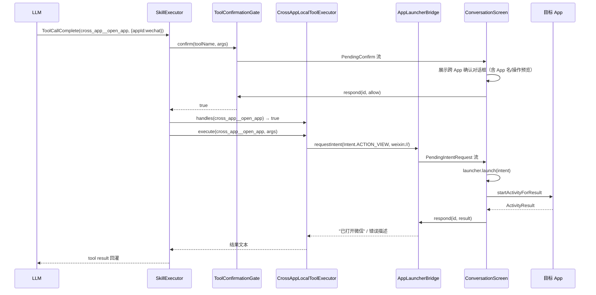

# ADR-016: M6 跨 App 调用架构（US-006）

| 项目 | 内容 |
| --- | --- |
| 状态 | Accepted |
| 日期 | 2026-08-11 |
| 合并日期 | 2026-08-11（M6 里程碑 Phase A/B/C 全部通过 guardrail-enforcer + ac-verifier + functional-validation-auditor 里程碑审计后转 Accepted，CLAUDE.md §17.3） |
| 决策者 | 主 Agent（基于 code-archaeologist 考古报告 TKN-M6-ARCH-001 + tech-selection-researcher 选型报告 TKN-M6-TECH-SELECTION-001 + sequential-thinking 6 步推演 + 用户需求 PRD US-006） |
| 关联文档 | PRD US-006 / ARCH（待生成）/ ADR-001 3.4 轻量路线 / ADR-013 M4 Skills 架构 / ADR-014 M4 tool_calling 接口 |
| 上游调研 | docs/reports/2026-08-11-m6-archaeology.md / docs/reports/2026-08-11-m6-tech-selection.md |
| 风险等级 | P2 跨模块（改动 SkillExecutor + ConversationViewModel + ConversationScreen + AndroidManifest + PrismApplication） |

## 背景（Context）

Prism 作为手机端 AI 聊天 Agent 应用，M0-M5 已交付完整的 AI 对话 + 知识库 RAG + Skills 系统 + 三层记忆系统。M6 需要实现"AI Agent 通过 tool_calling 自主触发跨 App 操作"的能力，使 LLM 能够：

1. **Deep Link 跳转**：跳转微信/支付宝/淘宝/抖音/QQ/微博/百度地图 7 个目标 App
2. **Share Sheet 分享**：分享文本/链接/文件到其他 App
3. **系统 Picker 选取**：选取照片/文档供 AI 处理

核心约束（ADR-001 3.4 轻量路线）：

- **零新增第三方依赖**：仅使用 Android 原生 API（Intent + ActivityResultContracts + PackageManager）
- **Android 11+ 包可见性合规**：使用 `<queries>` 精确声明，不滥用 `QUERY_ALL_PACKAGES`
- **复用 M4 基建**：SkillExecutor 工具执行回路 + ToolConfirmationGate 用户确认 + SkillExecutionRecord 可观测
- **LLM 可触发**：必须通过 tool_calling 让 LLM 自主决策调用，而非仅用户手动触发
- **不引入重量级框架**：移动端 APK 体积与方法数约束

现有基建（13 项可复用，详见考古报告第 5 节）：

1. SkillExecutor 工具执行回路（maxRounds + 确认 + 超时 + 错误回灌 + 可观测）
2. ToolConfirmationGate 确认门禁接口
3. UiConfirmationGate 桥接模式（SharedFlow + CompletableDeferred）
4. McpToolProvider 依赖倒置接口
5. ActivityResultContracts + rememberLauncherForActivityResult 先例（KnowledgeBaseScreen）
6. SkillExecutionRecord 执行可观测
7. 命名空间隔离机制（skillName__toolName）
8. PrismApplication by lazy 依赖注入模式
9. 错误脱敏 sanitizeErrorMessage（CWE-209）
10. CancellationException 重抛铁律（BR-error-handling-007）

## 决策（Decision）

**采用方案 A（纯 Android 原生底层）+ LocalToolExecutor 独立接口（AI 集成层）**：

- **底层能力层**：CrossAppLauncher 核心模块（SchemeRegistry + DeepLinkLauncher + ShareSheetLauncher + MediaPicker + AppAvailabilityChecker + AppLauncherBridge），全部使用 Android 原生 API，零新增第三方依赖
- **AI 集成层**：新增 `LocalToolExecutor` 接口（与 McpToolProvider 平行的执行后端），跨 App 工具（`open_app` / `share_content` / `pick_media`）注册为内置本地工具，通过 SkillExecutor 的本地工具分支执行
- **用户确认**：复用 M4 ToolConfirmationGate，扩展 CrossAppConfirmationRequest 携带目标 App 名称/操作类型/内容预览
- **包可见性**：AndroidManifest 新增 `<queries>` 声明 7 个目标 App 包名 + scheme + ACTION_SEND intent 过滤器
- **兼容性清单**：`assets/cross-app/app_schemes.json` JSON 配置驱动，支持未来远程更新

选择此方案的一句理由：**语义清晰（跨 App 调用不是 MCP 协议）+ 测试性好（复用 KnowledgeBaseViewModel 注入解耦模式）+ 未来扩展性强（LocalToolExecutor 可支持更多本地工具）+ 改动面集中（仅 SkillExecutor 增加分支 + 新增接口，不污染 McpServerConfig/McpToolProviderDispatcher）**。

## 备选方案（Alternatives）

| 方案 | 优点 | 缺点 / 否决理由 |
|---|---|---|
| **B1：IntentToolProvider 路径**（扩展 McpToolProvider + McpServerConfig.serverType=INTENT） | 复用度最高，SkillExecutor 零改动 | McpServerConfig 字段（baseUrl/transport/headers）为 HTTP 设计，跨 App 调用用不上，语义牵强；McpToolProviderDispatcher 路由逻辑被污染；影响 M2 阶段 McpServerConfig 相关测试 |
| **B2：MCP Server 路径**（新增 IntentMcpServer 仿 FilesystemMcpServer） | 复用 LocalMcpToolProvider/InProcessTransport | 过度抽象——跨 App 调用本质是 `startActivity(intent)`，封装为 MCP Server 需实现 JSON-RPC 协议；UI 密集型操作（需 Activity 上下文）不适合 IPC 模型；listTools 静态注册与跨 App 动态目标不匹配 |
| **B3：独立 ViewModel 路径**（不复用 SkillExecutor/MCP 回路） | 实现简单 | 致命缺陷——不接入 tool_calling，LLM 无法自主触发，失去 AI Agent 本质；用户确认/超时/错误回灌/可观测都要重新实现 |
| **B4：作为完整 Skill 路径**（创建 cross-app-launcher SKILL.md + SkillRegistry 注册） | 复用 Skill 索引描述，LLM 可通过 Skill 索引了解跨 App 能力 | SKILL.md 解析开销不必要；跨 App 工具不是真正的 Skill（无 MCP Server 后端）；SkillRegistry 扫描机制为文件系统驱动，内置工具不适合 |

## 后果（Consequences）

- **正面后果**：
  - 零新增第三方依赖，APK 体积增量 < 100KB
  - 复用 M4 SkillExecutor 完整回路（用户确认 + 超时 + 错误回灌 + 可观测 + 命名空间隔离）
  - LocalToolExecutor 接口可扩展支持更多本地工具（如剪贴板、通知、系统设置）
  - 跨 App 工具不走 SkillRegistry，避免 SKILL.md 解析开销
  - JSON 配置驱动兼容性清单，支持未来远程更新（复用 M4 SkillDownloader 基建）
  - 遵循 Android 11+ `<queries>` 最佳实践，不滥用 QUERY_ALL_PACKAGES

- **负面后果 / 代价**：
  - SkillExecutor 需增加本地工具分支（`executeToolCall` 增加前置判断：`localToolExecutor.handles(toolName)` → 走本地路径，否则走 MCP 路径）
  - 需扩展 ADR-013 说明 LocalToolExecutor 作为第二个执行后端的定位
  - ConversationViewModel 需注入 CrossAppLauncher + LocalToolExecutor，构造器参数增加
  - ConversationScreen 需注册 ActivityResult launcher 并收集 IntentResultGate 请求流
  - 国产 App scheme 兼容性需自维护清单（无开源库可依赖）

- **需要同步更新的文档或代码**：
  - ADR-013（补充 LocalToolExecutor 作为第二个执行后端的说明）
  - README.md 文档索引（新增 ADR-016 + M6 相关报告）
  - prd.json（新增 US-006 跨 App 调用用户故事）
  - AndroidManifest.xml（新增 `<queries>` 声明）
  - PrismApplication.kt（注入 CrossAppLauncher + LocalToolExecutor）
  - ConversationViewModel.kt（注册跨 App 工具到工具执行回路）
  - ConversationScreen.kt（注册 ActivityResult launcher + 收集 IntentResultGate 请求流）
  - SkillExecutor.kt（增加 localToolExecutor 构造器参数 + executeToolCall 本地工具分支）

## 风险与缓解

| 风险 | 等级 | 缓解措施 |
|---|---|---|
| R1：国产 App scheme 兼容性变化 | 高 | JSON 配置驱动 + 降级 Share Sheet + PoC 真机验证 + 每个 scheme 标注"已验证版本/日期" |
| R2：ActivityResult 桥接协程取消语义 | 中 | 复用 UiConfirmationGate 桥接模式（SharedFlow + CompletableDeferred + withTimeoutOrNull 30s）；onCleared/Activity 销毁时清理 pending deferred 避免泄漏 |
| R3：SkillExecutor 增加本地工具分支影响 M4 回归 | 中 | localToolExecutor 默认 null 向后兼容；M4 全量回归测试（1237 用例）必须 0 失败；本地工具分支用 `handles(toolName)` 前置判断，不影响 MCP 路径 |
| R4：目标 App 未安装 | 中 | AppAvailabilityChecker 预检（PackageManager.getPackageInfo）；未安装时降级提示 + fallbackUrl 网页跳转 |
| R5：跨 App 返回数据格式多样 | 中 | 统一结果序列化策略——提取 ActivityResult.data extras 转 JSON string 回灌 LLM；参考 McpClientManager.renderResult 文本渲染模式 |
| R6：测试时 ActivityResult 无法纯 JVM 模拟 | 中 | 复用 KnowledgeBaseViewModel inputStreamProvider 注入解耦模式——CrossAppLocalToolExecutor 通过 `intentLauncher: (Intent) -> String?` 注入，测试用 fake，纯 JVM 可测 |
| R7：微信屏蔽外部 scheme 跳转 | 中 | PoC 验证 `weixin://` 基本跳转可用性；降级 Share Sheet（ACTION_SEND 不受 scheme 屏蔽影响）；兼容性清单标注微信可用/不可用 scheme；用户确认对话框提示"部分功能可能受限" |
| R8：IntentResultGate 与 UiConfirmationGate 双重确认冗余 | 低 | 职责分离——UiConfirmationGate 是"用户允许执行工具"（布尔），IntentResultGate 是"桥接 ActivityResult 返回数据"（String）；UI 交互设计避免连续弹两个对话框（确认对话框与跳转 launcher 串行，非并行） |
| R9：ActivityResult launcher 必须在 Activity/Fragment 上下文注册 | 中 | AppLauncherBridge 桥接——ConversationScreen 用 rememberLauncherForActivityResult 注册 launcher，收集 IntentResultGate 请求流发起跳转，回调结果回灌 bridge；与 KnowledgeBaseScreen OpenDocument 先例模式一致 |
| R10：跨 App 工具声明需 JSON Schema 供 LLM 调用 | 低 | 在 ConversationViewModel.buildTools 中硬编码跨 App 工具的 ToolDefinition（含 JSON Schema parameters），与 Skill 工具合并后传入 streamChat |

## 设计细节

### 1. LocalToolExecutor 接口

```kotlin
package io.prism.skill

/**
 * 本地工具执行器接口（M6，ADR-016）。
 *
 * 与 [McpToolProvider] 平行的执行后端，用于非 MCP 协议的本地工具（如跨 App 调用）。
 * [SkillExecutor.executeToolCall] 在调用 MCP Server 前先查询 [handles]，
 * 若返回 true 则走 [execute] 本地路径，否则走 MCP 路径。
 *
 * **设计原则**：
 * - 纯函数式接口，不依赖 Android Context（具体实现通过注入解耦）
 * - suspend execute 返回 String（成功结果 / 失败描述，均回灌给 LLM，与 McpToolProvider.callTool 一致）
 * - handles(toolName) 必须无副作用且快速（O(1) 查表）
 */
interface LocalToolExecutor {
    /**
     * 判断是否由本执行器处理该工具。
     *
     * @param toolName 工具名（含命名空间前缀，如 `cross_app__open_app`）
     * @return true 表示由本执行器处理，[execute] 将被调用
     */
    fun handles(toolName: String): Boolean

    /**
     * 执行本地工具。
     *
     * @param toolName 工具名（含命名空间前缀）
     * @param arguments 工具参数（LLM 传入的 JSON 参数 Map）
     * @return 执行结果文本（成功/失败描述，回灌给 LLM）
     */
    suspend fun execute(toolName: String, arguments: Map<String, Any?>): String
}
```

### 2. SkillExecutor 扩展（向后兼容）

```kotlin
open class SkillExecutor(
    private val mcpToolProvider: McpToolProvider,
    private val confirmationGate: ToolConfirmationGate,
    private val ioDispatcher: CoroutineDispatcher = Dispatchers.IO,
    private val skillExecutionRepository: SkillExecutionRepository? = null,
    private val localToolExecutor: LocalToolExecutor? = null  // M6 新增，默认 null 向后兼容
) {
    suspend fun executeToolCall(
        toolCall: StreamEvent.ToolCallComplete,
        mcpServers: List<McpServerConfig>,
        maxTimeoutMs: Long = DEFAULT_TOOL_TIMEOUT_MS
    ): String = withContext(ioDispatcher) {
        // 1. 用户确认（复用 ToolConfirmationGate，所有工具统一确认门禁）
        val approved = try {
            confirmationGate.confirm(toolCall.toolName, toolCall.arguments)
        } catch (e: CancellationException) {
            throw e
        } catch (e: Exception) {
            Log.w(TAG, "tool confirm failed: ${toolCall.toolName}", e)
            return@withContext formatConfirmError(toolCall.toolName, e)
        }
        if (!approved) return@withContext formatRejection(toolCall.toolName)

        // 2. M6 新增：本地工具分支（LocalToolExecutor 路径）
        if (localToolExecutor != null && localToolExecutor.handles(toolCall.toolName)) {
            return@withContext try {
                withTimeout(maxTimeoutMs) {
                    localToolExecutor.execute(toolCall.toolName, toolCall.arguments)
                }
            } catch (e: TimeoutCancellationException) {
                Log.w(TAG, "local tool timeout: ${toolCall.toolName} (${maxTimeoutMs}ms)")
                formatTimeout(toolCall.toolName, maxTimeoutMs)
            } catch (e: CancellationException) {
                throw e
            } catch (e: Exception) {
                Log.w(TAG, "local tool execution failed: ${toolCall.toolName}", e)
                formatToolError(toolCall.toolName, e)
            }
        }

        // 3. MCP 工具路径（原有逻辑不变）
        val mcpServer = selectMcpServer(mcpServers)
            ?: return@withContext formatNoServer(toolCall.toolName)
        val physicalName = stripNamespace(toolCall.toolName)
        try {
            withTimeout(maxTimeoutMs) {
                mcpToolProvider.callTool(mcpServer, physicalName, toolCall.arguments)
            }
        } catch (e: TimeoutCancellationException) {
            Log.w(TAG, "tool timeout: ${toolCall.toolName} (${maxTimeoutMs}ms)")
            formatTimeout(toolCall.toolName, maxTimeoutMs)
        } catch (e: CancellationException) {
            throw e
        } catch (e: Exception) {
            Log.w(TAG, "tool execution failed: ${toolCall.toolName}", e)
            formatToolError(toolCall.toolName, e)
        }
    }
}
```

### 3. 模块清单

**新增文件**：

| 文件 | 职责 |
|---|---|
| `app/src/main/assets/cross-app/app_schemes.json` | 7 个 App scheme 兼容性清单 |
| `app/src/main/java/io/prism/crossapp/AppSchemeEntry.kt` | scheme 配置数据类 |
| `app/src/main/java/io/prism/crossapp/SchemeRegistry.kt` | 兼容性清单加载与管理 |
| `app/src/main/java/io/prism/crossapp/AppAvailabilityChecker.kt` | App 安装状态检测（PackageManager） |
| `app/src/main/java/io/prism/crossapp/DeepLinkLauncher.kt` | Deep Link 跳转（Intent.ACTION_VIEW） |
| `app/src/main/java/io/prism/crossapp/ShareSheetLauncher.kt` | Share Sheet 分享（ACTION_SEND） |
| `app/src/main/java/io/prism/crossapp/MediaPicker.kt` | Photo/Document Picker（ActivityResultContracts） |
| `app/src/main/java/io/prism/crossapp/AppLauncherBridge.kt` | Activity 上下文桥接（SharedFlow + CompletableDeferred） |
| `app/src/main/java/io/prism/crossapp/CrossAppLauncher.kt` | 核心入口，组合上述组件 |
| `app/src/main/java/io/prism/crossapp/CrossAppConfirmationRequest.kt` | 用户确认请求数据类 |
| `app/src/main/java/io/prism/crossapp/CrossAppLocalToolExecutor.kt` | LocalToolExecutor 实现，注册 open_app/share_content/pick_media 工具 |
| `app/src/main/java/io/prism/skill/LocalToolExecutor.kt` | LocalToolExecutor 接口 |

**修改文件**：

| 文件 | 改动内容 |
|---|---|
| `app/src/main/AndroidManifest.xml` | 新增 `<queries>` 声明（7 个包名 + 7 个 scheme + 2 个 SEND intent） |
| `app/src/main/java/io/prism/PrismApplication.kt` | 新增 CrossAppLauncher + CrossAppLocalToolExecutor lazy 依赖注入；SkillExecutor 构造增加 localToolExecutor 参数 |
| `app/src/main/java/io/prism/skill/SkillExecutor.kt` | 新增 localToolExecutor 构造器参数（默认 null）；executeToolCall 增加本地工具分支 |
| `app/src/main/java/io/prism/ui/chat/ConversationViewModel.kt` | buildTools 合并跨 App 本地工具；Factory 注入 CrossAppLauncher |
| `app/src/main/java/io/prism/ui/chat/ConversationScreen.kt` | 注册 ActivityResult launcher；收集 AppLauncherBridge 请求流；跨 App 确认 UI |

### 4. 跨 App 工具命名空间

跨 App 工具使用 `cross_app__` 命名空间前缀（与 Skill 的 `skillName__` 前缀平行）：

- `cross_app__open_app`：打开指定 App（参数：appId, action?）
- `cross_app__share_content`：分享内容（参数：content, mimeType?）
- `cross_app__pick_media`：选取媒体（参数：mediaType: "photo"|"document"）

`CrossAppLocalToolExecutor.handles(toolName)` 通过 `toolName.startsWith("cross_app__")` 判断。

### 5. 用户确认 UI 扩展

CrossAppConfirmationRequest 携带更丰富的确认信息（扩展 UiConfirmationGate.PendingConfirm）：

```kotlin
data class CrossAppConfirmationRequest(
    val appDisplayName: String,      // "微信"
    val actionType: ActionType,      // OPEN / SHARE / PICK
    val contentPreview: String,      // "分享文本：Hello World" / "打开微信扫一扫"
    val targetScheme: String,        // "weixin://scanqrcode"
    val isAppInstalled: Boolean      // true
) {
    enum class ActionType { OPEN, SHARE, PICK }
}
```

UI 实现：自定义 Compose `AlertDialog`，展示 App 名称 + 操作类型 + 内容预览 + 确认/取消按钮。

### 6. 执行流程



## 参考

- [Android Package Visibility 官方文档](https://developer.android.com/training/package-visibility)
- [Android Photo Picker 官方文档](https://developer.android.google.cn/training/data-storage/shared/photo-picker)
- [QUERY_ALL_PACKAGES Lint 检查](https://googlesamples.github.io/android-custom-lint-rules/checks/QueryAllPackagesPermission.md.html)
- [URL schemes 汇总](https://blog.csdn.net/Pursuitdreams/article/details/147148391)
- [移动端深度链接原理](https://blog.csdn.net/weixin_40094522/article/details/87666254)
- M6 源码考古报告：[../reports/2026-08-11-m6-archaeology.md](../reports/2026-08-11-m6-archaeology.md)
- M6 技术选型报告：[../reports/2026-08-11-m6-tech-selection.md](../reports/2026-08-11-m6-tech-selection.md)
- ADR-001 Prism 技术栈：[ADR-001-prism-tech-stack.md](ADR-001-prism-tech-stack.md) 3.4 跨 App 能力决策
- ADR-013 M4 Skills 系统架构：[ADR-013-m4-skills-system-architecture.md](ADR-013-m4-skills-system-architecture.md) 5.4 SkillExecutor + ToolConfirmationGate
- ADR-014 M4 tool_calling 接口扩展：[ADR-014-m4-toolcalling-interface.md](ADR-014-m4-toolcalling-interface.md)

## 实施完成情况（2026-08-11 转 Accepted 时记录）

### Phase A/B/C 三阶段实施

| Phase | 用户故事 | 关键交付 | 验收结果 |
|---|---|---|---|
| Phase A | US-037 | CrossAppLauncher 核心模块（SchemeRegistry + DeepLinkLauncher + ShareSheetLauncher + MediaPicker + AppLauncherBridge + AppAvailabilityChecker + CrossAppConfirmationRequest）+ app_schemes.json 7 App 配置 | 10/10 AC 通过（TKN-M6-PHASE-A-ACCEPTANCE-001） |
| Phase B | US-038 | LocalToolExecutor 接口 + CrossAppLocalToolExecutor + SkillExecutor 扩展本地工具分支（默认 null 向后兼容） | 10/10 AC 通过（Phase B 验收发现 DEF-01 B2 严重缺陷，Phase C 修复并闭合，TKN-M6-PHASE-B-ACCEPTANCE-001） |
| Phase C | US-039 | AndroidManifest queries（7+7+2）+ PrismApplication 注入 + ConversationViewModel 工具合并 + ConversationScreen launcher + 用户确认 UI + M-1 双重超时竞态修复 | 10/10 AC 通过（TKN-M6-PHASEC-ACCEPTANCE-001） |

### 关键缺陷修复

| 缺陷 | 严重度 | 根因 | 修复 | 验证 |
|---|---|---|---|---|
| DEF-01 | B2 严重 | PrismApplication 未注入 crossAppLocalToolExecutor 到 SkillExecutor，本地工具分支生产环境永不触发 | PrismApplication.kt 新增 5 lazy 注入 + SkillExecutor 构造传入 localToolExecutor | Phase C AC-C-2 PASS + SkillExecutorLocalToolTest 11 用例 |
| M-1 | B1 一般 | AppLauncherBridge.DEFAULT_TIMEOUT_MS=30s 与 SkillExecutor.DEFAULT_TOOL_TIMEOUT_MS=30s 相同，外层先超时导致 pending 残留 + 语义化超时文案丢失 | 调整为 25s（短于 30s，BR-concurrency-005），保证 bridge 先超时返回语义化文案 + 清理 pending | M6PhaseBAcceptanceSupplementTest 新增端到端验证 + behavioral-rules.md 转 active |

### 设计偏差（已文档化）

| 偏差 | ADR-016 设计 | 实际实现 | 偏差理由 |
|---|---|---|---|
| AC-2 偏差 | handles 用 `startsWith("cross_app__")` | handles 用 `toolName in HANDLED_TOOLS`（Set 查找） | 语义等价且更精确（仅匹配已注册 3 工具，拒绝未知 cross_app__* 工具名） |
| AC-4 偏差 | 注入 `intentLauncher: (Intent) -> String?` lambda | 注入 `crossAppLauncher: CrossAppLauncher`（open class） | CrossAppLauncher 标记 open + 三方法 open，测试用 fake 子类注入解耦，同样纯 JVM 可测 |

### 行为规则固化

| 规则 ID | 类别 | 来源 | 状态 |
|---|---|---|---|
| BR-concurrency-005 | concurrency | M6 Phase C M-1 双重超时竞态修复 | active（2026-08-11） |

### 已知局限

| 编号 | 严重度 | 说明 | 缓解/计划 |
|---|---|---|---|
| L-1 | B0 微小 | isFailureResult 前缀匹配可能误判 MCP 正常结果 | 未来重构为 sealed class 返回类型 |
| L-3 | B0 微小 | extractTemplateParams null 值转空字符串 | 边界行为已测试覆盖 |
| L-4 | B0 微小 | URLEncoder.encode 空格编码为 + 在 path 段语义偏差 | 当前 scheme path 段无空格占位符 |
| UNC-1 | 受限 | 真机 ActivityResult E2E 7 App Deep Link 兼容性未验证 | 待真机/模拟器补测 |
| UNC-2 | 受限 | ConversationScreen Compose UI Test 缺失（项目无基建） | 静态审查验证，待引入 Compose UI Test |
| FUT-01 | 改进项 | resolveConfirmationContent 改为 internal 支持纯 JVM 测试 | 后续提交 |

### 全量回归

M6 三阶段实施完成后，全量自动化测试：**1380 测试 / 0 failures / 0 errors / 26 skipped**（82 测试文件，skipped 为性能基准 @Ignore）。独立验证通过（functional-validation-auditor TKN-M6-MILESTONE-AUDIT-001）。
