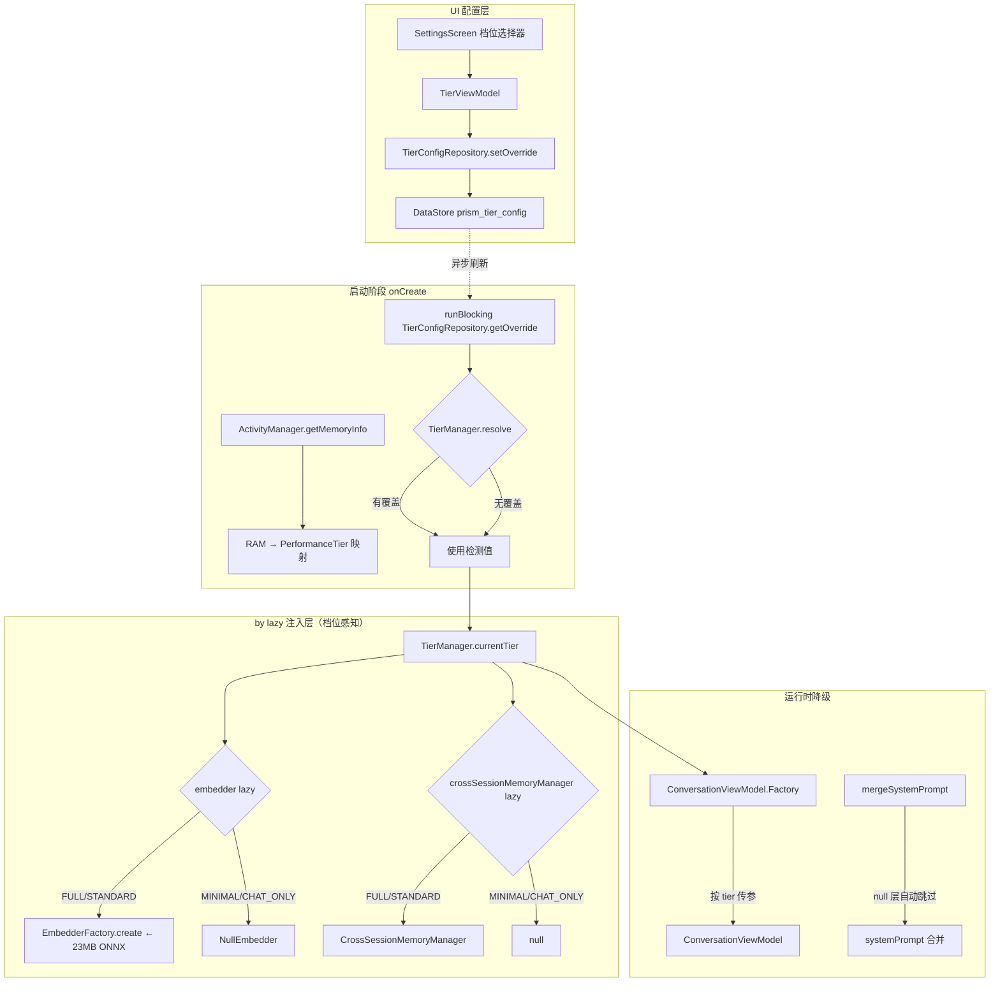

# ADR-017: M7 设备适配与降级架构（US-007）

| 项目 | 内容 |
| --- | --- |
| 状态 | Accepted |
| 日期 | 2026-08-11 |
| 决策者 | 主 Agent |
| 关联文档 | [PRD US-007](../PRD.md) / [ADR-015](ADR-015-m5-memory-system-architecture.md) / [ADR-007](ADR-007-m3-rag-tech-stack.md) |
| 上游调研 | [M7 源码考古](../reports/2026-08-11-m7-archaeology.md) |
| 风险等级 | P2 跨模块（改动 Application 注入结构 + 跨模块降级） |
| 审查记录 | guardrail TKN-M7-GUARDRAIL-001/002 通过 + ac-verifier TKN-M7-ACCEPTANCE-001 通过（117 专项 + 1497 回归 0 失败） |

## 背景（Context）

PRD US-007 要求 Prism 在低端 Android 设备上也能基本可用，按设备 RAM 容量分四档提供差异化功能：

| RAM 档位 | 功能范围 | 关键行为 |
|---|---|---|
| ≥6GB（FULL） | 全功能 | RAG 标准批次 + 嵌入常驻 |
| 4-6GB（STANDARD） | RAG 小批次 + 嵌入按需 | top-k=3 + 嵌入闲置卸载 2min |
| 3-4GB（MINIMAL） | 禁用 RAG，仅关键词检索 | 嵌入不加载 |
| <3GB（CHAT_ONLY） | 仅聊天 + BYOK | RAG/L2 全禁用 |

**M7 源码考古关键发现**（[docs/reports/2026-08-11-m7-archaeology.md](../reports/2026-08-11-m7-archaeology.md)）：

1. **降级基建已就绪**：`ConversationViewModel` 三层记忆管理器（L1/L2/L3）均声明为可空参数（`? = null`），`mergeSystemPrompt` 纯函数自动跳过 null 层。
2. **embedder 是 RAG + L2 共享依赖**：`PrismApplication.embedder`（`by lazy`，~23MB ONNX）同时被 `IngestionPipeline`（M3）和 `CrossSessionMemoryManager`（M5）注入。禁用 embedder 会同时禁用这两个功能，与 PRD 档位定义一致。
3. **OnnxEmbedder 闲置卸载机制已实现但未激活**：`checkAndUnload(maxIdleMs)` 方法已就绪（L129-L142），全局搜索无调用方。
4. **TierConfigRepository 可照搬 MemoryConfigRepository 模式**：独立 DataStore + Flow 暴露 + 校验。
5. **SettingsScreen 已有 PerfTier mock UI**（三档，纯本地 state），需改造为四档 + ViewModel 驱动。
6. **RAG_TOP_K 硬编码**（`ConversationViewModel.kt` L794 `private const val RAG_TOP_K = 3`），需改为按档位动态读取。

## 决策（Decision）

**方案 A：TierManager 同步检测 + by lazy 档位感知注入 + 降级传 null**

在 `PrismApplication.onCreate()` 中同步检测 RAM（`ActivityManager.MemoryInfo.totalMem`）并通过 `runBlocking` 一次性读取 DataStore 中的用户覆盖值，构造 `TierManager` 单例。后续 `by lazy` 注入的 `embedder`、`crossSessionMemoryManager` 等组件根据 `tierManager.currentTier` 决定返回真实实例或 null/NoopEmbedder。

选择此方案的原因：**改动集中、风险可控、最大化复用现有降级基建**。ConversationViewModel 的 null 降级模式（M5 Phase E 已验证）可直接复用，`mergeSystemPrompt` 纯函数无需修改。

### 4.1 核心组件设计



### 4.2 PerformanceTier 档位与功能矩阵

| 档位 | RAM 阈值 | RAG | L1 | L2 | L3 | Skill | embedder | top-k |
|---|---|---|---|---|---|---|---|---|
| FULL | ≥6GB | ✓ 标准批次 | ✓ | ✓ | ✓ | ✓ | 常驻 5min 卸载 | 5 |
| STANDARD | 4-6GB | ✓ 小批次 | ✓ | ✓ | ✓ | ✓ | 按需 2min 卸载 | 3 |
| MINIMAL | 3-4GB | ✗ 关键词检索 | ✓ | ✗ | ✓ | ✓ | 不加载 | N/A |
| CHAT_ONLY | <3GB | ✗ | ✓ | ✗ | ✓ | ✓ | 不加载 | N/A |

### 4.3 RAM 检测方案

使用 `ActivityManager.MemoryInfo.totalMem`（API 16+，项目 minSdk=26 满足）：

```kotlin
val activityManager = context.getSystemService(Context.ACTIVITY_SERVICE) as ActivityManager
val memoryInfo = ActivityManager.MemoryInfo()
activityManager.getMemoryInfo(memoryInfo)
val totalRamBytes = memoryInfo.totalMem
val totalRamGb = totalRamBytes / (1024L * 1024L * 1024L)
```

**已知限制**（考古报告风险清单 R3）：`totalMem` 在某些设备上报告值小于物理 RAM（如 3GB 设备可能报告为 2.8GB）。采用保守阈值：报告值低于 3GB 阈值时归入 CHAT_ONLY 档，符合 PRD「低端机优先保稳定」语义。

### 4.4 用户覆盖持久化

`TierConfigRepository` 仿 `MemoryConfigRepository` 模式（ADR-015 5.3）：
- 独立 DataStore 文件 `prism_tier_config`（与 `prism_memory_config` / `prism_api_keys` 隔离）
- `stringPreferencesKey("tier_override")` 存枚举名（`FULL` / `STANDARD` / `MINIMAL` / `CHAT_ONLY` / `AUTO`）
- `AUTO` 表示无覆盖（使用 RAM 检测结果），为默认值
- Flow 暴露 + suspend 单值读取 + 校验

**onCreate 同步读取**：`TierManager` 在 `onCreate` 中通过 `runBlocking { tierConfigRepository.getOverride() }` 一次性读取覆盖值缓存到内存。后续 `by lazy` 注入直接读内存字段，避免 suspend 传播。用户在 UI 修改覆盖后，需重启 App 生效（在 UI 明确提示）。

### 4.5 embedder 加载策略

| 档位 | 加载策略 | 闲置卸载 |
|---|---|---|
| FULL | `EmbedderFactory.create` 正常加载 | 5min 闲置后 `session.close()` |
| STANDARD | `EmbedderFactory.create` 正常加载 | 2min 闲置后 `session.close()` |
| MINIMAL | `NullEmbedder`（embed 返回空向量） | N/A |
| CHAT_ONLY | `NullEmbedder` | N/A |

**NullEmbedder 设计**：实现 `Embedder` 接口，`embed()` 返回空 `FloatArray`，`embedBatch()` 返回空 List。下游 RAG 检索因空向量无相似度匹配，自然降级为「无检索结果」，触发 `RagBuildResult.NormalChat`。L2 跨会话记忆因 embed 结果空，无法向量化存储，`CrossSessionMemoryManager` 直接传 null 跳过。

**checkAndUnload 调度**：在 `PrismApplication.appScope` 中启动协程循环：

```kotlin
appScope.launch {
    while (isActive) {
        delay(checkIntervalMs)
        (embedder as? OnnxEmbedder)?.checkAndUnload(idleThresholdMs)
    }
}
```

`checkIntervalMs` 与 `idleThresholdMs` 由 `tierManager.currentTier` 决定。

### 4.6 ConversationViewModel 降级注入

在 `ConversationViewModel.Factory` 中按档位传参：

```kotlin
val Factory: ViewModelProvider.Factory = viewModelFactory {
    initializer {
        val app = this[...] as PrismApplication
        val tier = app.tierManager.currentTier
        ConversationViewModel(
            // ... 其他依赖不变
            embedder = app.embedder,  // 已是 NullEmbedder 或真实 embedder
            crossSessionMemoryManager = if (tier.isMemoryL2Enabled) app.crossSessionMemoryManager else null,
            // L1/L3 不受档位影响，始终注入
        )
    }
}
```

`isMemoryL2Enabled` 由 `PerformanceTier` 扩展属性提供：`FULL/STANDARD → true, MINIMAL/CHAT_ONLY → false`。

### 4.7 RAG_TOP_K 动态化

将 `ConversationViewModel` 的 `RAG_TOP_K` 从 `private const val` 改为构造参数 `ragTopK: Int`，由 Factory 按 tier 传入：
- FULL: 5
- STANDARD: 3
- MINIMAL/CHAT_ONLY: 0（RAG 禁用，值不使用）

### 4.8 abiFilters 决策

在 `app/build.gradle.kts` 的 `defaultConfig` 中添加：

```kotlin
ndk {
    abiFilters += listOf("arm64-v8a", "armeabi-v7a")
}
```

排除 x86 / x86_64（模拟器用，生产无用），减小 APK 体积。ONNX Runtime Android AAR 已包含这两个 ABI 的 native 库。

### 4.9 不启用 largeHeap

PRD 要求 4GB 设备 <1.2GB 内存，6GB <1.8GB。启用 `largeHeap` 会提升堆上限但增加系统压力，且掩盖内存问题。通过档位降级控制内存更符合 PRD 语义。

### 4.10 不添加前台服务

嵌入加载 ~200ms（考古报告 L213），摄入在前台 UI 触发，无需后台长任务。Android 14+ 前台服务类型要求复杂（`specialUse` 需 Google Play 审查），且 Prism 不上架 Google Play（PRD 非目标），暂不引入。

## 备选方案（Alternatives）

| 方案 | 优点 | 缺点 / 否决理由 |
|---|---|---|
| **B. 运行时动态切换档位**（无需重启 App） | 用户体验更好，覆盖即时生效 | `by lazy` 已加载的组件无法卸载（embedder 模型已加载到内存），需重构全部 lazy 为可重置注入，改动巨大且易引入竞态 |
| **C. SharedPreferences 存覆盖**（替代 DataStore） | 同步读取，无需 runBlocking | 与项目既有 DataStore 模式不一致（ADR-015 / ADR-003 均用 DataStore），且 SharedPreferences 有 ANR 风险 |
| **D. 多 Process 隔离低档位功能** | 进程级隔离，内存释放彻底 | 架构复杂度激增，IPC 成本高，与现有单进程注入模式完全冲突 |

## 后果（Consequences）

- **正面后果**：
  - 低端设备（3GB RAM）可基本运行（仅聊天 + BYOK），覆盖 PRD US-007 验收
  - embedder 闲置卸载激活，所有档位内存占用降低
  - 用户可手动覆盖档位（高端机选 MINIMAL 省电，低端机强制 FULL 测试边界）
  - 改动集中（PrismApplication + ConversationViewModel.Factory + SettingsScreen + build.gradle），不影响核心业务逻辑
  - 最大化复用 M5 降级基建，不引入新的并发模式

- **负面后果 / 代价**：
  - 用户修改覆盖需重启 App 生效（runBlocking 缓存模式限制）—— UI 需明确提示
  - `totalMem` 报告值偏差可能导致 3.5GB 设备归入 CHAT_ONLY —— 保守策略，符合低端机优先保稳定语义
  - NullEmbedder 返回空向量，下游需处理空检索结果 —— 已有 `RagBuildResult.NormalChat` 降级路径

- **需要同步更新的文档或代码**：
  - `docs/PRD.md` US-007 验收标准勾选
  - `prd.json` 新增 US-040~US-043
  - `README.md` 项目状态 + 文档索引
  - `docs/decisions/README.md` 索引
  - `docs/behavioral-rules.md` 新增设备适配相关规则（若有）

## 风险与缓解

| 风险 | 等级 | 缓解措施 |
|---|---|---|
| `by lazy` 内引用 tierManager 形成隐式依赖，若 tierManager 未在 onCreate 初始化会 NPE | 高 | TierManager 在 onCreate 同步构造（非 lazy），确保 by lazy 访问时已就绪 |
| `runBlocking` 读取 DataStore 在 onCreate 阻塞主线程 | 中 | DataStore 首次读取通常 <50ms（单 key），可接受；备选：SharedPreferences 缓存 + DataStore 异步刷新 |
| NullEmbedder 返回空向量导致下游异常 | 中 | 下游 RAG 检索已有空结果降级（`RagBuildResult.NormalChat`），L2 传 null 跳过 |
| 用户覆盖需重启生效，用户体验不佳 | 低 | UI 明确提示「重启 App 生效」，符合 Android 应用惯例 |
| abiFilters 排除 x86 影响开发机模拟器调试 | 低 | 开发者可通过 `./gradlew assembleDebug` 覆盖 abiFilters，或使用 arm64 模拟器 |
| `totalMem` 报告值偏差导致档位误判 | 低 | 保守阈值（3GB 设备报告 2.8GB 归 CHAT_ONLY）+ 用户手动覆盖兜底 |

## 参考

- [M7 源码考古报告](../reports/2026-08-11-m7-archaeology.md)
- [PRD US-007 设备适配与降级](../PRD.md)
- [ADR-015 M5 三层记忆系统架构](ADR-015-m5-memory-system-architecture.md)
- [ADR-007 M3 RAG 技术栈](ADR-007-m3-rag-tech-stack.md)
- [Android ActivityManager.MemoryInfo 文档](https://developer.android.com/reference/android/app/ActivityManager.MemoryInfo)
- [Android Foreground Service Types](https://developer.android.com/develop/background-work/services/fgs/service-types)
- [Jetpack DataStore 文档](https://developer.android.com/datastore)
