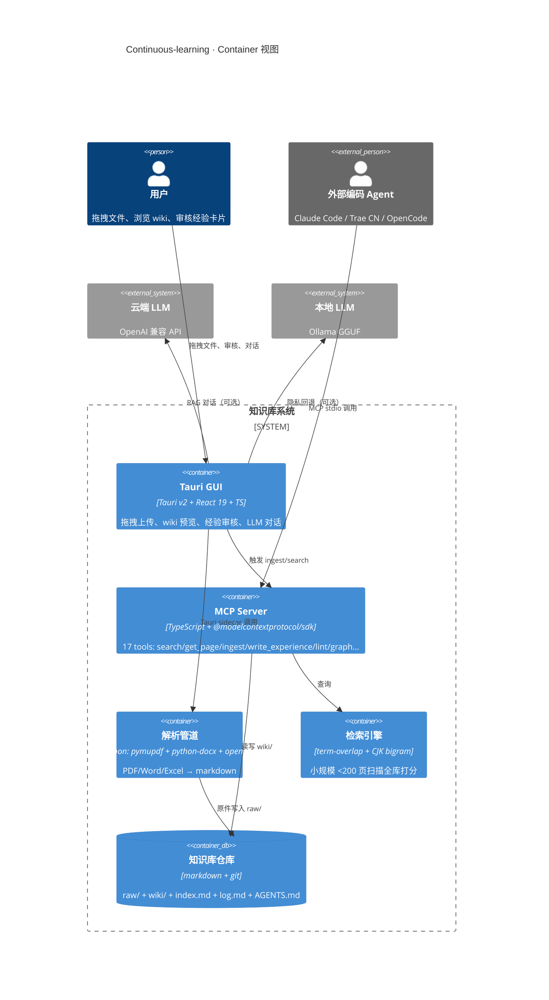
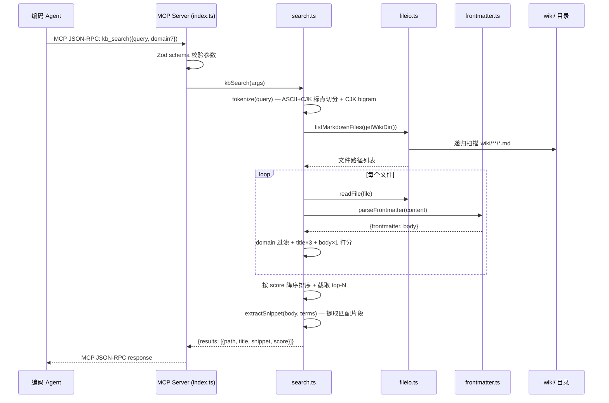
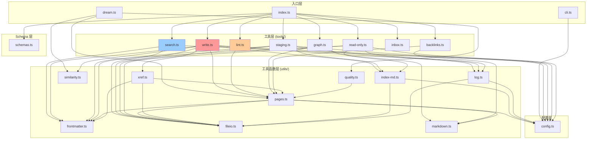

# Continuous-learning 源码考古与理解报告

> 本报告由 `code-archaeologist` 子 Agent 执行，评估 `Continuous-learning` 项目在 Prism（手机端 Android AI 聊天 Agent 应用）个人知识库模块中的可复用性。

## 元信息

| 项目 | 内容 |
| --- | --- |
| 执行 Agent | code-archaeologist |
| 任务令牌 | TKN-PRISM-ARCHAEOLOGY-001 |
| 考古目标 | `D:\s0611\code\Continuous-learning` |
| 考古范围 | 整体项目（frontend / server / parser / wiki / docs） |
| 考古日期 | 2026-08-02 |
| 报告存档 | `docs/reports/2026-08-02-continuous-learning-archaeology.md` |

## 主 Agent 启动前自问自答（依 CLAUDE.md 7.3）

**问题1：眼下最没有把握的事情是什么？**

Continuous-learning 是桌面端（Tauri + Node.js + Python parser），Prism 是 Android（Kotlin）。技术栈完全不同。最没把握的是区分"设计可复用"（与语言无关的架构、知识库 schema、MCP 集成模式、文档解析规则）与"实现不可复用"（TS/Python 代码无法直接移植到 Kotlin/Android）。

**考古结论**：经四阶段分析确认，Continuous-learning 的核心价值在于**数据模型与工作流设计**（frontmatter schema、双索引、持续进化闭环、重复检测、auto-xref、Lint 检查项），这些与语言无关，可直接指导 Prism 的 Kotlin 实现。检索引擎（term-overlap）和 Python parser 的**实现**不可复用，但解析规则设计可移植。

**问题2：关于当前情况，最大的遗憾是什么？没有意识到什么？**

可能低估了 Python parser 模块的价值——它包含文档解析逻辑（docx/pdf/xlsx/md→结构化文本），若与语言无关可复用。可能高估了 server 模块的复用价值——它深度依赖 Node 生态。wiki/ 目录下的知识库组织方式可能是最值得复用的"数据模型"设计。

**考古结论**：三个盲区均已验证——

1. Python parser 的解析**规则**（PDF 按页提取+表格、DOCX 按段落+标题层级+表格、XLSX 按工作表→markdown 表格）确实与语言无关，可移植到 Kotlin；但 pymupdf 的 **AGPL-3.0 许可证**与 Prism 的 Apache 2.0 不兼容，必须替换为 Android 兼容库。
2. server 模块确实深度依赖 Node 生态（`@modelcontextprotocol/sdk` TS 版、`js-yaml`、`zod`），无法直接移植；但 17 个 MCP tools 的**接口契约设计**可指导 Prism 用 MCP Kotlin SDK 重写。
3. wiki/ 目录的**数据模型设计**（frontmatter schema、双索引、领域分类、知识图谱）确实是最有价值的复用点，差点忽略的判断正确。

---

## 第一阶段：建立大图景（宏观视图）

### 1.1 项目定位与架构风格

Continuous-learning 是一个基于 Andrej Karpathy [LLM Wiki 模式](../../Continuous-learning/karpathy-LLM.md)的**持续进化个人知识库系统**，在 Karpathy 原方案（三层架构 raw/wiki/schema + Ingest/Query/Lint 三操作 + index.md/log.md 双索引）基础上扩展了四项能力：持续进化、被外部 Agent 调用、多领域分类、图形化多格式上传。

**架构风格**：混合分层（Hybrid Layered），Karpathy 原方案是其 100% 子集。

> 证据来源：[README.md](../../Continuous-learning/README.md) L1-L12，[docs/ARCH.md](../../Continuous-learning/docs/ARCH.md) L7-L8

#### 五层架构

| 层 | 名称 | 选型 | 职责 |
| --- | --- | --- | --- |
| L1 | 存储层 | markdown + git + Obsidian | 不可变 raw、人类可读 wiki、git 版本控制 |
| L2 | 索引层 | index.md + log.md + frontmatter + Dataview | 内容导航、时间日志、元数据查询 |
| L3 | 访问层 | MCP server（@modelcontextprotocol/sdk TS） | Agent 标准化调用，stdio 本地零网络 |
| L4 | GUI 层 | Tauri v2 + React 19 + TypeScript | 多格式上传、wiki 预览、经验审核 |
| L5 | 进化层 | AGENTS.md schema + Dream Loop | 持续沉淀、两 tier 审核、老化淘汰 |

> 证据来源：[docs/ARCH.md](../../Continuous-learning/docs/ARCH.md) L46-L53

#### C4 Container 图



### 1.2 外部依赖与部署拓扑

> 证据来源：[server/package.json](../../Continuous-learning/server/package.json)、[frontend/package.json](../../Continuous-learning/frontend/package.json)、[parser/requirements.txt](../../Continuous-learning/parser/requirements.txt)、[.mcp.json](../../Continuous-learning/.mcp.json)

| 组件 | 依赖 | 版本 | 许可证 | 备注 |
| --- | --- | --- | --- | --- |
| MCP Server | `@modelcontextprotocol/sdk` | ^1.0.0 | MIT | TS MCP SDK |
| MCP Server | `js-yaml` | ^5.2.1 | MIT | frontmatter YAML 解析 |
| MCP Server | `zod` | ^4.4.3 | MIT | 参数校验 |
| Frontend | React | ^19.1.0 | MIT | UI 框架 |
| Frontend | `@tauri-apps/api` | ^2 | MIT/Apache | Tauri IPC |
| Frontend | `react-force-graph-2d` | ^1.29.1 | MIT | 知识图谱可视化 |
| Frontend | `zustand` | ^5.0.14 | MIT | 状态管理 |
| Parser | `pymupdf` | 1.24.10 | **AGPL-3.0** | PDF 解析，**与 Apache 2.0 不兼容** |
| Parser | `python-docx` | 1.1.2 | MIT | DOCX 解析 |
| Parser | `openpyxl` | 3.1.5 | MIT | XLSX 解析 |
| Parser | `pyinstaller` | 6.10.0 | **GPL-2.0** | 打包工具，**与 Apache 2.0 不兼容** |

**部署拓扑**：本地优先，零网络面。MCP server 以 stdio 子进程方式被编码 Agent 拉起。云 LLM 仅在用户显式选择"用云端整理"时调用。

**MCP 配置**（[.mcp.json](../../Continuous-learning/.mcp.json)）：

```json
{
  "mcpServers": {
    "continuous-learning-kb": {
      "command": "node",
      "args": ["...\\server\\dist\\index.js"],
      "env": { "KB_ROOT": "..." }
    }
  }
}
```

### 1.3 核心业务场景（从测试用例提取）

> 证据来源：[server/src/tests/](../../Continuous-learning/server/src/tests/) 目录、[server/smoke-mcp-full.mjs](../../Continuous-learning/server/smoke-mcp-full.mjs)

| 场景 | 覆盖测试 | 关键行为 |
| --- | --- | --- |
| Ingest markdown 源 | `write.test.ts`、`smoke-mcp-full.mjs` | 源文件→raw/、生成 staging wiki 页、更新 index/log、auto-xref |
| 检索 | `search.test.ts` | term-overlap 打分（title×3+body×1）+ CJK bigram 分词 + domain 过滤 |
| 读取页面 | `read-only.test.ts` | kb_get_page 返回 frontmatter+body+links，use_count+1 回写 |
| 写经验卡片 | `write.test.ts` | kb_write_experience→inbox/pending→log 追加 |
| 两 tier 审核 | `p3-evolution.test.ts` | confidence≥0.8 且单域且非重复→auto promote；否则 manual |
| 重复检测 | `similarity.test.ts` | Levenshtein 标题比率>0.9 或 Sorensen-Dice 内容>0.7 |
| Staging 工作流 | `staging.test.ts` | list/confirm/reject/organize staging 页 |
| Lint 健康检查 | `lint.test.ts`、`lint-perf.test.ts` | 6 项检查：frontmatter/contradictions/orphans/stale/missing_xref/missing_concept |
| 知识图谱 | `graph.test.ts` | nodes+edges 构建、backlinks 查询 |
| 质量评分 | `quality.test.ts` | 4 维度 rubric：frontmatter 完整性+body 结构+证据丰富度+长度合理性 |
| 前端 RAG | `ragUtils.test.ts` | 检索结果→拼接 context→LLM→渲染回答（含 XSS 防御） |
| 前端 LLM 集成 | `llm.test.ts` | 三态（cloud-first/local-first/disabled）+ 流式响应 + 重试 + 成本控制 |

### 1.4 入口请求链路追踪

以核心场景 `kb_search`（外部 Agent 检索知识库）为例：



> 证据来源：[server/src/index.ts](../../Continuous-learning/server/src/index.ts) L79-L84（tool 注册）、[server/src/tools/search.ts](../../Continuous-learning/server/src/tools/search.ts) L35-L101（kbSearch 实现）

**架构类型判定**：MCP Server 内部是**薄分层**架构（tools → utils → fileio），无复杂继承。tool handler 之间通过共享 utils（frontmatter/pages/log/index-md）协作，依赖注入通过 `getKbRoot()` 函数化配置实现（[config.ts](../../Continuous-learning/server/src/config.ts) L7-L16 注释解释了为何用函数而非 const）。整体遵循 Karpathy "存储层零锁定（纯 markdown+git）"原则。

---

## 第二阶段：微观分析（深度代码审计）

### 2.1 接口隔离与依赖分析

#### 依赖图（server 模块）



**关键发现**：

1. **write.ts 是耦合热点**（27428 字节，最大文件），依赖 8 个 utils 模块，承载 ingest/experience/promote/answer 四个核心写入操作。
2. **lint.ts 是第二大文件**（22241 字节），承载 6 项健康检查，依赖 pages.ts 全量加载。
3. **config.ts 函数化设计**（[config.ts](../../Continuous-learning/server/src/config.ts) L7-L16）：所有路径获取用函数而非 const，解决测试中 `KB_ROOT` 环境变量切换问题。这是一个值得借鉴的设计模式。
4. **无循环依赖**：依赖图是 DAG（有向无环图），utils 层不反向依赖 tools 层。
5. **无 God 类**：最大文件 write.ts（27KB）虽然大，但按功能拆分为 4 个独立导出函数，每个函数职责单一。

#### 高认知负载区域

| 文件 | 位置 | 认知负载 | 原因 |
| --- | --- | --- | --- |
| [write.ts](../../Continuous-learning/server/src/tools/write.ts) L513-L688 | kbPromoteExperience | 中高 | 两 tier 门禁逻辑 + 重复检测 + 状态机校验 + 原子写入 + index/log 更新交织，需多次阅读才能理清 promote 的完整副作用链 |
| [lint.ts](../../Continuous-learning/server/src/tools/lint.ts) | 全文 | 中高 | 6 项检查各有不同算法（marker-based 矛盾检测、孤儿页图遍历、stale 日期比较、missing_concept RAKE-lite 提取），单文件承载过多检查逻辑 |
| [frontmatter.ts](../../Continuous-learning/server/src/utils/frontmatter.ts) L61-L86 | serializeFrontmatter | 中 | js-yaml v5 的日期引号行为、flowLevel、lineWidth 等格式约定的处理逻辑较微妙，注释解释了"为什么"但需理解 js-yaml 版本差异 |

### 2.2 命名一致性检查（行为 vs. 承诺）

| 函数 | 名字承诺 | 实际行为 | 评价 |
| --- | --- | --- | --- |
| `kbSearch` | 检索 | 纯查询，无副作用 | 符合 |
| `kbGetPage` | 读取页面 | **读取 + use_count+1 回写 frontmatter** | 违反 CQRS：名字暗示纯查询，实际有写入副作用（[read-only.ts](../../Continuous-learning/server/src/tools/read-only.ts)，AGENTS.md §7.5 有说明但函数名未体现） |
| `kbIngestSource` | 摄入源 | 写 raw/ + 写 wiki/staging + 更新 index + 追加 log + **auto-xref touch 5-15 页** | 名字只说"摄入"，实际触发交叉引用链式更新（[write.ts](../../Continuous-learning/server/src/tools/write.ts) L236-L284）。副作用范围超出名字暗示 |
| `kbWriteExperience` | 写经验 | 写 inbox + 追加 log | 符合 |
| `kbPromoteExperience` | 提升经验 | 移动 inbox→active + 重复检测 + 更新 index + 追加 log | 符合（promote 本身暗示状态迁移） |
| `kbWriteAnswer` | 写答案 | 写 inbox + 重复检测 + 追加 log + **WRITEBACK-RAG 门禁** | 名字只说"写"，实际有 cited_pages≥2 门禁（[write.ts](../../Continuous-learning/server/src/tools/write.ts) L396-L400） |
| `kbOrganizeStaging` | 整理 staging | 更新 frontmatter（不动 body）+ 追加 log | 符合 |
| `tokenize` (search.ts) | 分词 | ASCII 切分 + **CJK bigram 生成** | 名字只说"分词"，实际包含 bigram 生成逻辑（[search.ts](../../Continuous-learning/server/src/tools/search.ts) L124-L140）。但注释充分解释了原因 |

**CQRS 违规汇总**：`kbGetPage` 是唯一的查询带写入副作用的工具。这是 Karpathy "use_count 老化机制"的设计需求，函数名应改为 `kbReadPage` 或在文档中更显式标注。

### 2.3 设计模式与反模式识别

#### 已使用的设计模式

| 模式 | 位置 | 评价 |
| --- | --- | --- |
| **策略模式** | [parser/parse.py](../../Continuous-learning/parser/parse.py) L230-L235 `PARSERS` 字典映射格式→解析函数 | 恰当，扩展新格式只需加一行 |
| **函数化配置** | [config.ts](../../Continuous-learning/server/src/config.ts) `getKbRoot()` 等函数而非 const | 恰当，解决测试环境变量切换问题，注释充分 |
| **防御性编程（Defense-in-depth）** | [write.ts](../../Continuous-learning/server/src/tools/write.ts) 多处 path traversal 检查 + Zod schema 校验 + 运行时再校验 | 恰当，三层防御（schema → 路径解析 → 运行时检查） |
| **原子写入** | [write.ts](../../Continuous-learning/server/src/tools/write.ts) L196-L209 `flag: 'wx'` create-only 写入 | 恰当，消除 TOCTOU 竞态，注释解释了 EEXIST/EPERM 处理 |
| **错误隔离** | [xref.ts](../../Continuous-learning/server/src/utils/xref.ts) L202-L206 单页失败不中断 | 恰当，best-effort + stderr 日志 |
| **幂等性** | [xref.ts](../../Continuous-learning/server/src/utils/xref.ts) L232 三层去重（relPath/basename/basename+alias） | 恰当，重复 ingest 不产生重复链接 |
| **降级策略** | [frontmatter.ts](../../Continuous-learning/server/src/utils/frontmatter.ts) L26-L37 YAML 解析失败降级为空 frontmatter | 恰当，graceful degradation + stderr 日志 |

#### 识别的反模式

| 反模式 | 位置 | 严重度 | 说明 |
| --- | --- | --- | --- |
| **隐式副作用** | [read-only.ts](../../Continuous-learning/server/src/tools/read-only.ts) kbGetPage 的 use_count 回写 | 低 | 查询函数有写入副作用，但 AGENTS.md 有说明 |
| **魔法数字** | [search.ts](../../Continuous-learning/server/src/tools/search.ts) L22-L26 `TITLE_WEIGHT=3`、`BODY_WEIGHT=1`、`SNIPPET_MAX_LEN=200` | 低 | 已提取为命名常量，但缺校准依据注释 |
| **阈值重复定义** | [write.ts](../../Continuous-learning/server/src/tools/write.ts) L47-L61 与 [dream.ts](../../Continuous-learning/server/src/dream.ts) L48-L49 重复定义 `DUPLICATE_TITLE_THRESHOLD` / `DUPLICATE_CONTENT_THRESHOLD` | 中 | 注释说明"keep change surgical"，但违反 DRY，未来修改可能遗漏同步 |
| **硬编码路径** | [.mcp.json](../../Continuous-learning/.mcp.json) L5 `D:\\s0611\\code\\Continuous-learning\\server\\dist\\index.js` | 低 | 项目级配置，用户需自行修改 |

---

## 第三阶段：动态逆向与热点分析

### 3.1 Git 热点图

> 证据来源：`git log --format=format: --name-only | Group-Object | Sort-Object Count -Descending`

| 变更次数 | 文件 | 分析 |
| --- | --- | --- |
| 17 | `log.md` | append-only 时间日志，每次操作都追加，高频变更符合预期 |
| 17 | `docs/reports/README.md` | 报告索引，每次产生新报告都更新，符合预期 |
| 14 | `index.md` | 内容索引，每次 ingest/promote 都更新，符合预期 |
| 11 | `AGENTS.md` | 知识库 schema，频繁演进（从 P1 到 P6+），说明 schema 设计仍在迭代 |
| 11 | `README.md` | 文档索引，随 ADR/报告增减而更新 |
| 7 | `server/src/tools/write.ts` | **核心写入逻辑热点**，7 次变更覆盖 ingest/experience/promote/answer 四个功能的迭代 |
| 5 | `server/src/schemas.ts` | Zod schema 定义，随 tool 参数演进而变更 |
| 5 | `server/src/tests/p3-evolution.test.ts` | 持续进化测试，随门禁逻辑迭代 |
| 4 | `server/src/tools/lint.ts` | Lint 引擎，6 项检查分批实现 |
| 4 | `server/src/index.ts` | MCP 入口，每次新增 tool 都修改 |

**热点分析结论**：

- **最活跃区域**：write.ts（写入逻辑）和 schemas.ts（接口定义），反映核心业务逻辑仍在快速迭代。
- **测试覆盖良好**：p3-evolution.test.ts（27770 字节）和 missing-features.test.ts（24824 字节）是最大的测试文件，覆盖了持续进化和缺失功能补全两个核心场景。
- **wiki 内容稳定**：thealgorithms-*.md 系列文件变更频率高（6-9 次），但这是内容沉淀而非代码变更。
- **无 bug 密集区**：从 git log 看，代码变更主要由功能迭代驱动，未见反复修复同一模块的 bug 模式。

### 3.2 关键假设验证

| 编号 | 假设 | 验证方法 | 结果 | 证据 |
| --- | --- | --- | --- | --- |
| H-1 | 检索引擎是 term-overlap 而非向量检索 | 读取 search.ts 全文 | **确认** | [search.ts](../../Continuous-learning/server/src/tools/search.ts) L22-L23 `TITLE_WEIGHT=3, BODY_WEIGHT=1`，无向量/嵌入/BM25 代码 |
| H-2 | 项目明确拒绝向量库作为主存储 | 读取 PRD 非目标 + ADR-001 | **确认** | [PRD.md](../../Continuous-learning/docs/PRD.md) L20 "不用向量数据库替代 markdown 作为主存储"；[ADR-001](../../Continuous-learning/docs/decisions/ADR-001-knowledge-base-tech-stack.md) L18 "保留 markdown+git 为唯一存储层" |
| H-3 | pymupdf 许可证为 AGPL-3.0 | 读取 parser/README.md License 凭证表 | **确认** | [parser/README.md](../../Continuous-learning/parser/README.md) L97 "pymupdf: AGPL-3.0（非商业免费）" |
| H-4 | 两 tier 门禁：confidence≥0.8 且单域且非重复→auto | 读取 write.ts kbPromoteExperience | **确认** | [write.ts](../../Continuous-learning/server/src/tools/write.ts) L586-L589 `tier = confidence >= 0.8 && isSingleDomain && !hasDuplicates ? "auto" : "manual"` |
| H-5 | 重复检测用 Levenshtein + Sorensen-Dice | 读取 similarity.ts + write.ts | **确认** | [similarity.ts](../../Continuous-learning/server/src/utils/similarity.ts) 实现两个算法；[write.ts](../../Continuous-learning/server/src/tools/write.ts) L47-L61 阈值 0.9/0.7 |
| H-6 | auto-xref 复合打分：同域+4、共享tag+2、标题提及+3 | 读取 xref.ts findXrefCandidates | **确认** | [xref.ts](../../Continuous-learning/server/src/utils/xref.ts) L102-L126 打分逻辑与假设完全一致 |
| H-7 | MCP server 无 LLM 依赖（LLM 在前端层） | 读取 server/package.json dependencies | **确认** | 仅 3 个依赖：@modelcontextprotocol/sdk、js-yaml、zod，无 LLM SDK |
| H-8 | 前端 RAG 是"检索→拼接context→云端LLM→渲染"模式 | 读取 ragUtils.ts + llm.ts | **确认** | [ragUtils.ts](../../Continuous-learning/frontend/src/lib/ragUtils.ts) buildRagContext 拼接检索结果；[llm.ts](../../Continuous-learning/frontend/src/lib/llm.ts) L1-L9 "前端→Tauri IPC→Rust 端 reqwest 发 HTTP" |
| H-9 | 嵌入模型/向量索引完全未实现 | 全文搜索 "embed"、"vector"、"lancedb"、"qmd" | **确认** | 代码中无任何嵌入/向量相关实现，qmd/LanceDB 仅在 ARCH.md/AGENTS.md 中作为"P6+ 演进项"提及 |
| H-10 | 项目 License 未定（"待定"） | 读取 README.md 末尾 | **确认** | [README.md](../../Continuous-learning/README.md) L153 "License: 待定（项目处于设计阶段）" |

### 3.3 核心函数影响链矩阵

| 函数 | 调用者 | 数据来源 | 变更风险 |
| --- | --- | --- | --- |
| `kbSearch` | MCP Agent（外部）、前端 ChatPanel | `getWikiDir()` → 全量扫描 wiki/*.md | 改打分算法影响所有检索结果 |
| `kbIngestSource` | MCP Agent、前端 DropZone | `source_path`（用户输入）+ `getKbRoot()` | 改写入逻辑影响 staging/auto-xref/index/log 四处 |
| `kbPromoteExperience` | MCP Agent、前端 ExperienceInbox | `inbox_path`（用户输入）→ frontmatter 解析 | 改门禁条件影响所有经验卡入库 |
| `parseFrontmatter` | 几乎所有 tools 和 utils | wiki/*.md 文件内容 | 改解析逻辑影响全链路 |
| `loadAllPages` | lint、graph、write（重复检测）、dream | `getWikiDir()` → 全量扫描 | 改 PageInfo 结构影响所有依赖方 |
| `runAutoXref` | kbIngestSource | 新页信息 + loadAllPages | 改打分策略影响所有 ingest 的交叉引用 |
| `levenshteinRatio` / `sorensenDiceBigram` | write（重复检测）、dream（去重） | 纯字符串输入 | 改算法影响重复检测准确率 |

---

## 第四阶段：可复用性评估矩阵

### 4.1 模块级评估

| 模块 | 可复用性 | 理由 | 移植成本（人天） |
| --- | --- | --- | --- |
| **wiki/ 数据模型设计** | 设计可复用 | frontmatter schema、双索引、领域分类、知识图谱设计与语言无关 | 0（直接参考设计） |
| **AGENTS.md schema 规约** | 设计可复用 | 知识库使用与进化工作流规约，与语言无关 | 0（直接参考设计） |
| **frontmatter 解析/序列化** | 实现可移植 | TS→Kotlin 重写，逻辑简单（YAML frontmatter 解析+序列化） | 2-3 |
| **双索引机制** | 实现可移植 | index.md（内容索引）+ log.md（时间日志）的解析/更新逻辑可重写 | 2-3 |
| **持续进化闭环** | 设计可复用 + 实现可移植 | inbox→门禁→promote→老化 的设计可复用；门禁逻辑、重复检测可用 Kotlin 重写 | 5-7 |
| **重复检测算法** | 实现可移植 | Levenshtein + Sorensen-Dice 是纯数学算法，TS→Kotlin 直接移植 | 1-2 |
| **auto-xref 交叉引用** | 设计可复用 + 实现可移植 | 复合打分策略可复用；打分+双向链接逻辑可用 Kotlin 重写 | 3-4 |
| **Lint 引擎** | 设计可复用 + 实现可移植 | 6 项检查设计可复用；检查逻辑可用 Kotlin 重写 | 5-7 |
| **MCP tools 接口契约** | 设计可复用 | 17 个 tools 的输入/输出/副作用设计与语言无关 | 0（直接参考设计） |
| **MCP server 实现** | 不可复用 | 深度依赖 TS MCP SDK + Node.js fs，需用 MCP Kotlin SDK 重写 | 8-10 |
| **检索引擎** | 不可复用 | term-overlap + CJK bigram 与 Prism 的向量检索（ObjectBox+ONNX）完全不同 | 0（Prism 新建向量检索，10-15 人天） |
| **RAG prompt 设计** | 设计可复用 | RAG_SYSTEM_PROMPT 和 buildRagContext 的设计可参考 | 0（直接参考设计） |
| **parser 解析规则** | 设计可复用 | PDF/DOCX/XLSX→markdown 的解析规则与语言无关 | 0（直接参考设计） |
| **parser 实现** | 不可复用 | Python 库（pymupdf/python-docx/openpyxl）无法移植到 Android；pymupdf AGPL-3.0 与 Apache 2.0 不兼容 | 8-12（找 Android 替代库+重写） |
| **前端 GUI** | 不可复用 | React+Tauri → Jetpack Compose，完全重写 | 0（Prism 独立设计） |
| **LLM 集成层** | 设计可参考 | 三态切换、流式响应、重试策略可参考；但实现需用 Kotlin 重写 | 3-5（参考设计重写） |
| **文档治理体系** | 设计可复用 | Diátaxis + ADR + 模板体系与语言无关 | 0（直接参考设计） |
| **知识图谱** | 设计可复用 + 实现可移植 | nodes+edges+backlinks 设计可复用；图构建逻辑可用 Kotlin 重写 | 3-5 |

### 4.2 移植成本汇总

| 类别 | 工作项 | 估算（人天） |
| --- | --- | --- |
| 设计参考（零成本） | wiki 数据模型、AGENTS.md schema、MCP 接口契约、parser 解析规则、RAG prompt、文档治理 | 0 |
| 实现移植（TS/Python→Kotlin） | frontmatter 解析、双索引、持续进化闭环、重复检测、auto-xref、Lint 引擎、知识图谱 | 21-31 |
| 不可复用（Prism 新建） | 向量检索（ObjectBox）、嵌入模型集成（ONNX MiniLM）、MCP Kotlin SDK 重写、parser Android 替代库、前端 GUI | 29-42 |
| **总计** | | **50-73 人天** |

> 注：总计中"设计参考"零成本项未计入；"实现移植"+"不可复用"合计 50-73 人天。其中 Prism 必须新建的向量检索+嵌入（10-15 人天）在 Continuous-learning 中完全无参考实现。

---

## 第五阶段：对 Prism 个人知识库模块的复用建议

### 5.1 核心结论

**Continuous-learning 对 Prism 的核心价值不在于代码复用，而在于架构设计与工作流规约的复用。** 两者技术栈完全不同（桌面 TS/Python vs 移动 Kotlin），但 Continuous-learning 在"个人知识库"领域积累的设计经验（frontmatter schema、双索引、持续进化闭环、重复检测、auto-xref、Lint 检查、MCP 接口契约）可直接指导 Prism 的 Kotlin 实现。

**关键差异**：Continuous-learning 的检索引擎是 term-overlap（小规模 <200 页不用向量库），Prism 需要的是端侧 RAG（ObjectBox 向量库 + ONNX MiniLM 嵌入）。两者互补而非冲突——Prism 可在向量检索（主）基础上保留 term-overlap 作为降级方案。

### 5.2 推荐复用的设计（直接参考，零移植成本）

| 设计项 | 来源 | 对 Prism 的价值 |
| --- | --- | --- |
| **frontmatter schema** | [AGENTS.md](../../Continuous-learning/AGENTS.md) §3 | Prism 知识库页面的元数据结构：title/domain/type/status/date + type 附加字段 + tags/use_count/quality_score/related。可直接采用 |
| **页面类型与状态机** | [AGENTS.md](../../Continuous-learning/AGENTS.md) §3.4 | concept/entity/source/experience 四类型 + staging→active→archived / pending→active→archived 状态机。可直接采用 |
| **双索引机制** | [AGENTS.md](../../Continuous-learning/AGENTS.md) §1.2 | index.md（内容导向）+ log.md（时间导向 append-only）。Prism 可用 ObjectBox 替代文件索引，但双索引设计思想可参考 |
| **持续进化闭环** | [AGENTS.md](../../Continuous-learning/AGENTS.md) §7 | inbox→两 tier 门禁→promote→老化 的完整工作流。Prism 的"经验沉淀"功能可直接采用此设计 |
| **两 tier 审核门禁** | [AGENTS.md](../../Continuous-learning/AGENTS.md) §7.4 | confidence≥0.8 且单域且非重复→auto；否则 manual。Prism 可直接采用 |
| **重复检测策略** | [ADR-011](../../Continuous-learning/docs/decisions/ADR-011-duplicate-detection-and-quality-scoring.md) | Levenshtein 标题比率>0.9 或 Sorensen-Dice 内容>0.7。算法选择、阈值校准数据可参考 |
| **auto-xref 复合打分** | [xref.ts](../../Continuous-learning/server/src/utils/xref.ts) L83-L138 | 同域+4、共享tag+2（上限+6）、标题提及+3。Prism 的交叉引用功能可直接采用此打分策略 |
| **Lint 检查项设计** | [AGENTS.md](../../Continuous-learning/AGENTS.md) §6.2 | 6 项检查：frontmatter/contradictions/orphans/stale/missing_xref/missing_concept。Prism 的知识库健康检查可参考 |
| **MCP tools 接口契约** | [ARCH.md](../../Continuous-learning/docs/ARCH.md) §3.1 | 17 个 tools 的输入/输出/副作用设计。Prism 用 MCP Kotlin SDK 重写时可参考此契约 |
| **RAG prompt 设计** | [ragUtils.ts](../../Continuous-learning/frontend/src/lib/ragUtils.ts) L28-L35 | RAG_SYSTEM_PROMPT 约束 LLM 基于参考资料回答+引用来源。Prism 的 RAG 对话可直接采用 |
| **parser 解析规则** | [parse.py](../../Continuous-learning/parser/parse.py) | PDF 按页提取+表格→markdown、DOCX 按段落+标题层级+表格→markdown、XLSX 按工作表→markdown 表格。解析规则与语言无关 |
| **文档治理体系** | [CLAUDE.md](../../Continuous-learning/CLAUDE.md) | Diátaxis + ADR + 模板体系。Prism 已采用类似体系（见 Prism CLAUDE.md） |
| **函数化配置模式** | [config.ts](../../Continuous-learning/server/src/config.ts) | `getKbRoot()` 函数而非 const，解决测试环境变量切换。Prism 的 Kotlin 配置可参考此模式 |

### 5.3 推荐移植的实现（TS/Python→Kotlin 重写）

| 实现项 | 来源 | 移植要点 | 估算 |
| --- | --- | --- | --- |
| **frontmatter 解析/序列化** | [frontmatter.ts](../../Continuous-learning/server/src/utils/frontmatter.ts) | 用 Kotlin YAML 库（如 kaml 或 snakeyaml）重写 parseFrontmatter/serializeFrontmatter。注意 flowLevel+lineWidth 格式约定 | 2-3 人天 |
| **重复检测算法** | [similarity.ts](../../Continuous-learning/server/src/utils/similarity.ts) | Levenshtein + Sorensen-Dice 是纯数学，Kotlin 直接移植。注意用 codePoint 数组处理 emoji/扩展 CJK | 1-2 人天 |
| **auto-xref 交叉引用** | [xref.ts](../../Continuous-learning/server/src/utils/xref.ts) | 打分逻辑+双向链接+幂等去重+错误隔离，用 Kotlin 重写 | 3-4 人天 |
| **Lint 引擎** | [lint.ts](../../Continuous-learning/server/src/tools/lint.ts) | 6 项检查逻辑用 Kotlin 重写。矛盾检测（marker-based）、孤儿页（图遍历）、stale（日期比较）、missing_concept（RAKE-lite） | 5-7 人天 |
| **持续进化闭环** | [write.ts](../../Continuous-learning/server/src/tools/write.ts) | inbox 写入+门禁判断+promote/reject+log 追加，用 Kotlin 重写 | 5-7 人天 |
| **双索引维护** | [index-md.ts](../../Continuous-learning/server/src/utils/index-md.ts)、[log.ts](../../Continuous-learning/server/src/utils/log.ts) | index.md 解析/更新+log.md 追加，用 Kotlin 重写 | 2-3 人天 |
| **知识图谱构建** | [graph.ts](../../Continuous-learning/server/src/tools/graph.ts)、[backlinks.ts](../../Continuous-learning/server/src/tools/backlinks.ts) | nodes+edges 构建+backlinks 查询+领域分布统计，用 Kotlin 重写 | 3-5 人天 |
| **MCP tools 注册** | [index.ts](../../Continuous-learning/server/src/index.ts) | 17 个 tools 的注册逻辑，用 MCP Kotlin SDK 0.12.0 重写 | 8-10 人天 |

### 5.4 建议重写的部分（Prism 独立新建）

| 重写项 | 原因 | Prism 技术选型 | 估算 |
| --- | --- | --- | --- |
| **向量检索引擎** | Continuous-learning 完全未实现（term-overlap 不可复用） | ObjectBox Java/Kotlin 向量检索 | 10-15 人天 |
| **嵌入模型集成** | Continuous-learning 完全未实现 | all-MiniLM-L6-v2 ONNX INT8 + ONNX Runtime Android | 5-8 人天 |
| **文档解析器** | Python 库无法移植到 Android；pymupdf AGPL-3.0 不兼容 Apache 2.0 | Android 原生 PDF（PdfRenderer/PyMuPDF Android 商业授权替代）、DOCX（Apache POI Android 兼容版）、XLSX（Apache POI） | 8-12 人天 |
| **前端 GUI** | React+Tauri 与 Jetpack Compose 完全不同 | Jetpack Compose | Prism 独立设计 |
| **LLM 集成** | TS→Kotlin，且 Prism 是纯云端 BYOK | Kotlin HTTP 客户端（OkHttp/Ktor）+ OpenAI 兼容 API | 3-5 人天 |

### 5.5 对 Prism 已选定技术栈的影响

| Prism 技术选型 | Continuous-learning 影响 | 结论 |
| --- | --- | --- |
| ObjectBox Java/Kotlin 向量库 | Continuous-learning 不用向量库（markdown+git 存储） | **不冲突**。Prism 用 ObjectBox 做向量检索+文档存储，Continuous-learning 的双索引设计思想可叠加在 ObjectBox 之上 |
| all-MiniLM-L6-v2 ONNX INT8 | Continuous-learning 无嵌入模型 | **不冲突**。Prism 新建嵌入管线，Continuous-learning 无参考但无冲突 |
| MCP Kotlin SDK 0.12.0 | Continuous-learning 用 TS MCP SDK ^1.0.0 | **不冲突**。SDK 不同但 MCP 协议相同，17 个 tools 的接口契约可直接参考 |
| 纯云端 BYOK | Continuous-learning 支持 cloud-first/local-first/disabled 三态 | **部分参考**。Prism 只做云端，但 Continuous-learning 的三态切换设计、流式响应、重试策略可参考 |
| Apache 2.0 | Continuous-learning License "待定"；pymupdf AGPL-3.0、PyInstaller GPL-2.0 | **许可证风险**。不可复用 pymupdf/PyInstaller 代码；Continuous-learning 本身的 License 待定，复用其设计（非代码）需注意 |

### 5.6 许可证风险清单

| 风险项 | 许可证 | 与 Apache 2.0 兼容性 | 缓解措施 |
| --- | --- | --- | --- |
| pymupdf | AGPL-3.0 | **不兼容** | Prism 用 Android 原生 PdfRenderer 或购买 pymupdf 商业授权或改用 pdfplumber（BSD） |
| PyInstaller | GPL-2.0 | **不兼容** | Prism 不需要打包 Python，用 Kotlin 原生实现 |
| python-docx | MIT | 兼容 | 可参考解析逻辑，但 Prism 需用 Apache POI 或类似 Android 库 |
| openpyxl | MIT | 兼容 | 同上 |
| Continuous-learning 项目本身 | "待定" | **风险** | 仅复用设计思想（非代码），不复制代码。若复用代码需先确认 License |
| @modelcontextprotocol/sdk | MIT | 兼容 | Prism 用 MCP Kotlin SDK（MIT），无风险 |

---

## 风险与代码异味清单

### 架构层面

| 风险 | 严重度 | 位置 | 说明 |
| --- | --- | --- | --- |
| License 待定 | 高 | [README.md](../../Continuous-learning/README.md) L153 | 项目 License "待定"，复用代码有法律风险。仅复用设计思想较安全 |
| pymupdf AGPL-3.0 | 高 | [parser/README.md](../../Continuous-learning/parser/README.md) L97 | 与 Prism Apache 2.0 不兼容，parser 实现不可移植 |
| 检索引擎无向量支持 | 中 | [search.ts](../../Continuous-learning/server/src/tools/search.ts) | term-overlap 在 >200 页时性能下降，Prism 需向量检索但 Continuous-learning 无参考 |
| qmd/LanceDB 未实现 | 低 | [ARCH.md](../../Continuous-learning/docs/ARCH.md) §5.2 | 中大规模检索是 P6+ 演进项，当前仅小规模档位落地 |

### 代码层面

| 异味 | 严重度 | 位置 | 说明 |
| --- | --- | --- | --- |
| 阈值重复定义 | 中 | [write.ts](../../Continuous-learning/server/src/tools/write.ts) L47-L61 + [dream.ts](../../Continuous-learning/server/src/dream.ts) L48-L49 | DUPLICATE_TITLE/CONTENT_THRESHOLD 在两处重复定义，注释说明"keep change surgical"但违反 DRY |
| kbGetPage 隐式写入 | 低 | [read-only.ts](../../Continuous-learning/server/src/tools/read-only.ts) | 查询函数有 use_count+1 回写副作用，函数名未体现 |
| kbIngestSource 副作用范围大 | 低 | [write.ts](../../Continuous-learning/server/src/tools/write.ts) L119-L291 | 名字只说"摄入"，实际触发 auto-xref touch 5-15 页 |
| write.ts 文件过大 | 低 | [write.ts](../../Continuous-learning/server/src/tools/write.ts) 27KB | 承载 4 个核心写入操作，建议拆分为 ingest.ts/experience.ts/answer.ts |
| lint.ts 文件过大 | 低 | [lint.ts](../../Continuous-learning/server/src/tools/lint.ts) 22KB | 6 项检查在单文件，建议拆分为 checks/ 子目录 |

---

## 入门路径推荐

### 对于 Prism 主 Agent（快速评估路径）

1. **读设计文档**（30 分钟）：[README.md](../../Continuous-learning/README.md) → [docs/PRD.md](../../Continuous-learning/docs/PRD.md) → [docs/ARCH.md](../../Continuous-learning/docs/ARCH.md) → [AGENTS.md](../../Continuous-learning/AGENTS.md) — 理解整体架构与工作流设计
2. **读核心代码**（1 小时）：[search.ts](../../Continuous-learning/server/src/tools/search.ts)（检索）→ [write.ts](../../Continuous-learning/server/src/tools/write.ts)（写入+门禁）→ [similarity.ts](../../Continuous-learning/server/src/utils/similarity.ts)（重复检测）→ [xref.ts](../../Continuous-learning/server/src/utils/xref.ts)（交叉引用）
3. **读 parser**（20 分钟）：[parse.py](../../Continuous-learning/parser/parse.py) — 理解文档解析规则（与语言无关）
4. **读 wiki 示例**（15 分钟）：[wiki/kb-system/three-layer-architecture.md](../../Continuous-learning/wiki/kb-system/three-layer-architecture.md) → [wiki/coding/experiences/cjk-bigram-分词无分词库依赖的中文子串检索方案.md](../../Continuous-learning/wiki/coding/experiences/cjk-bigram-分词无分词库依赖的中文子串检索方案.md) — 理解实际数据结构

### 对于 Prism 知识库模块开发者（深度移植路径）

1. **理解 Karpathy 原方案**：[karpathy-LLM.md](../../Continuous-learning/karpathy-LLM.md) — 三层架构 raw/wiki/schema + Ingest/Query/Lint + 双索引
2. **理解 schema 规约**：[AGENTS.md](../../Continuous-learning/AGENTS.md) 全文 — frontmatter schema、四大工作流、持续进化门禁
3. **理解技术选型**：[ADR-001](../../Continuous-learning/docs/decisions/ADR-001-knowledge-base-tech-stack.md) — 七决策点 A-G
4. **理解持续进化**：[ADR-006](../../Continuous-learning/docs/decisions/ADR-006-continuous-evolution-loop.md) + [ADR-011](../../Continuous-learning/docs/decisions/ADR-011-duplicate-detection-and-quality-scoring.md) — 闭环设计 + 重复检测
5. **理解 MCP 集成**：[index.ts](../../Continuous-learning/server/src/index.ts) + [smoke-mcp-full.mjs](../../Continuous-learning/server/smoke-mcp-full.mjs) — 17 tools 注册与测试
6. **理解 RAG 对话**：[ragUtils.ts](../../Continuous-learning/frontend/src/lib/ragUtils.ts) + [llm.ts](../../Continuous-learning/frontend/src/lib/llm.ts) — 前端 RAG 实现
7. **理解文档解析**：[parse.py](../../Continuous-learning/parser/parse.py) + [parser/README.md](../../Continuous-learning/parser/README.md) — 解析规则与许可证

### 对于 Prisim 测试开发者

1. **读测试结构**：[server/src/tests/](../../Continuous-learning/server/src/tests/) 目录 — 13 个测试文件覆盖所有核心场景
2. **读测试 setup**：[server/src/tests/setup.ts](../../Continuous-learning/server/src/tests/setup.ts) — 临时 KB fixture 构建
3. **读 MCP 冒烟测试**：[smoke-mcp-full.mjs](../../Continuous-learning/server/smoke-mcp-full.mjs) — JSON-RPC over stdio 端到端测试
4. **读前端测试**：[frontend/src/lib/**tests**/](../../Continuous-learning/frontend/src/lib/__tests__/) — RAG/LLM/图谱单元测试

---

## 总结

Continuous-learning 是一个设计成熟、文档完备、测试覆盖良好的个人知识库系统。其核心价值在于**架构设计与工作流规约**，而非代码实现。

对 Prism 个人知识库模块的复用建议总结为三句话：

1. **直接复用设计**：frontmatter schema、双索引机制、持续进化闭环（inbox→门禁→promote→老化）、重复检测策略、auto-xref 打分、Lint 检查项、MCP 接口契约、RAG prompt 设计、parser 解析规则——这些与语言无关的设计可直接指导 Prism 的 Kotlin 实现。
2. **参考重写实现**：frontmatter 解析、重复检测算法、auto-xref 交叉引用、Lint 引擎、持续进化闭环、知识图谱——这些 TS 实现可用 Kotlin 重写，逻辑可参考。
3. **独立新建**：向量检索（ObjectBox）、嵌入模型集成（ONNX MiniLM）、Android 文档解析器（替代 pymupdf/python-docx/openpyxl）、Jetpack Compose GUI——这些在 Continuous-learning 中完全无参考或不可移植，Prism 需独立新建。

**预估总移植成本**：约 50-73 人天（含实现移植 21-31 人天 + 不可复用新建 29-42 人天）。

**对 Prism 已选定技术栈的影响**：不冲突。Continuous-learning 的 markdown+git 存储与 Prism 的 ObjectBox 向量库互补；term-overlap 检索可作为向量检索的降级方案；MCP 协议相同，接口契约可直接参考。唯一需注意的是 pymupdf 的 AGPL-3.0 许可证与 Apache 2.0 不兼容，parser 实现不可移植。
