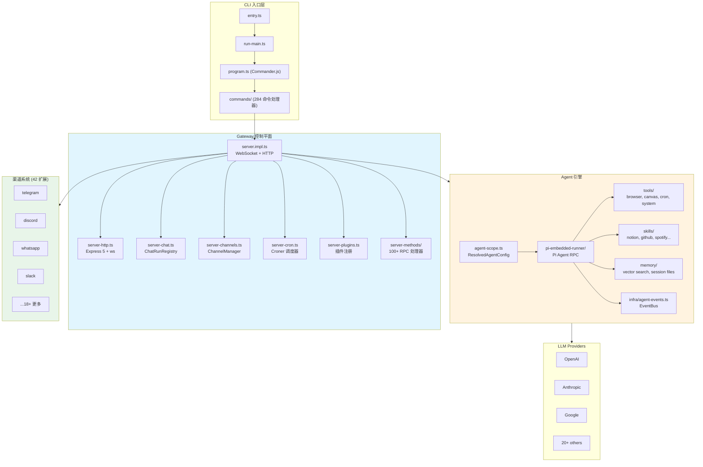
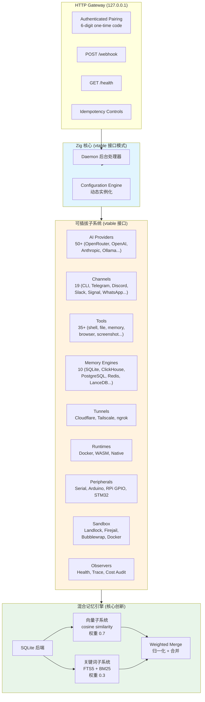
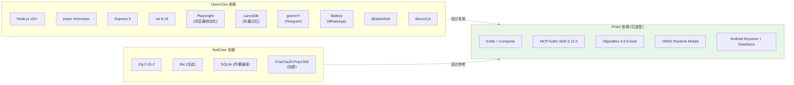
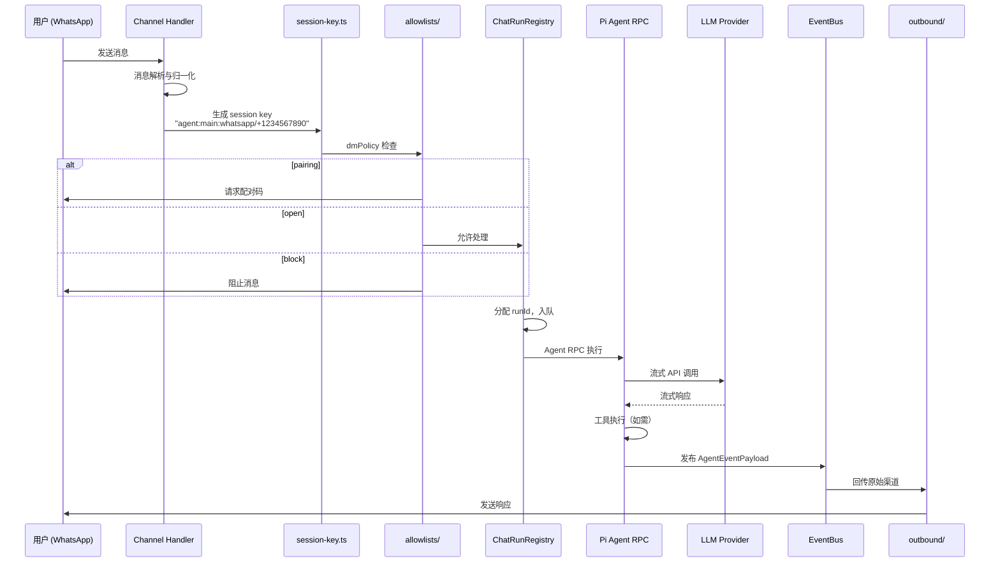
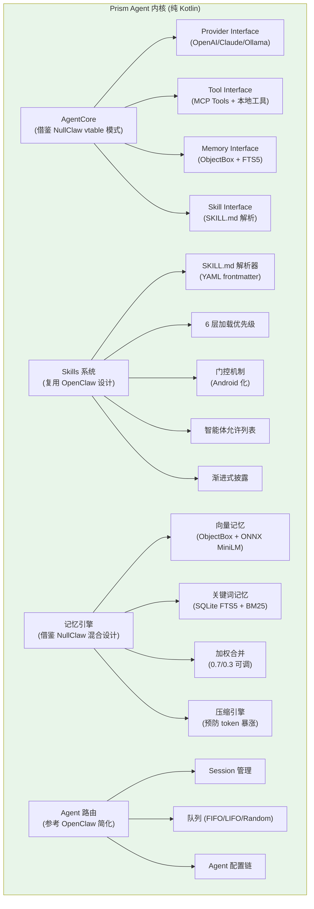

# OpenClaw 与 NullClaw 源码考古与可复用性评估报告

| 元信息 | 内容 |
|---|---|
| 报告类型 | 代码考古与理解报告（Code Archaeology & Understanding） |
| 生成日期 | 2026-08-02 |
| 执行 Agent | code-archaeologist |
| 任务令牌 | TKN-PRISM-ARCHAEOLOGY-002 |
| 考古目标 | 评估 OpenClaw 与 NullClaw 在 Prism 项目（Android Kotlin AI 聊天 Agent 应用）中的可复用性 |
| 考古方法 | 软件考古学四阶段法：建立大图景 → 微观分析 → 动态逆向与热点分析 → 综合报告 |
| 关联文档 | [ADR-001 Prism 技术栈选型](../decisions/ADR-001-prism-tech-stack.md) / [技术选型对比分析](2026-08-02-prism-tech-selection.md) |
| 状态 | 定稿（可作为 ADR-001 Agent 内核决策的输入） |
| 信息时效提醒 | 本报告基于 2026-08-02 的公开文档与联网搜索。OpenClaw 仓库 1.54GB、43万+行代码，本报告基于公开文档与架构分析博客做设计考古，未逐行审计源码（仓库过大且含大量二进制资源）。NullClaw 仓库同理。若决策时间超过 3 个月，建议重新核实。 |

---

## 0. 上下文重建摘要（依 CLAUDE.md 零节）

### 0.1 项目当前阶段与整体进展

Prism 处于**需求调研与可行性论证阶段**（2026-08-02 启动）。已完成两轮用户澄清、技术选型对比分析（tech-selection-researcher 子 Agent）、Continuous-learning 源码考古（code-archaeologist 子 Agent），并起草了 ADR-001 Prism 技术栈选型（Proposed 状态）。

### 0.2 本次任务目标与定位

ADR-001 第 3.7 节决策"复用 OpenClaw 设计架构（Kotlin 重实现）+ 评估 NullClaw 交叉编译到 Android arm64"，并列出风险"NullClaw 交叉编译到 Android arm64 失败 | 中 | PoC 验证；失败则纯用 Kotlin 重实现 OpenClaw 设计"。本考古任务即对该决策项的**前置验证**，产出 OpenClaw 设计复用清单与 NullClaw 交叉编译可行性判定，作为后续 Agent 内核实现的依据。

### 0.3 文档间矛盾或模糊点

- ADR-001 第 3.7 节将 OpenClaw 描述为"218K+ GitHub stars"，但公开数据源存在差异：awesome.ecosyste.ms 显示 381,755 stars，aibars.net 显示 384,505 stars，CSDN 文章称"26万+"。不同来源数据不一致，但不影响设计复用结论。本报告采用 awesome.ecosyste.ms 的 381,755 stars（最近同步数据）。
- ADR-001 参考链接 `[OpenClaw](https://allclaw.org/entry/kimi-claw)` 指向 allclaw.org 的 Kimi Claw 条目，而 OpenClaw 官方仓库为 `github.com/openclaw/openclaw`，官方文档为 `docs.openclaw.ai`。建议后续 ADR 修订时更新链接。
- 工具限制：CLAUDE.md 第 3.2 节要求用 GitHub MCP 访问仓库，但当前环境未提供 GitHub MCP 工具（仅有 integrated_code_mode 与 mcp_Sequential_Thinking）。本报告采用 WebSearch + WebFetch 抓取 GitHub 公开内容与官方文档，此限制已在此标注。

---

## 1. Phase 1：建立大图景（Macro View）

### 1.1 OpenClaw 项目概览

| 属性 | 内容 | 证据来源 |
|---|---|---|
| 仓库 | `github.com/openclaw/openclaw` | awesome.ecosyste.ms 项目页 |
| 官方文档 | `docs.openclaw.ai` | WebFetch 抓取 |
| 语言 | TypeScript (ES2023, ESM) | martianlee.github.io 架构分析 |
| 运行时 | Node.js v22+（可选 Bun） | martianlee.github.io |
| 许可证 | MIT（aibars.net 确认；awesome.ecosyste.ms 显示 "other" 可能因 NOASSERTION 标记） | aibars.net |
| Stars | ~381,755（2026-07 同步） | awesome.ecosyste.ms |
| 仓库大小 | 1.54 GB | awesome.ecosyste.ms |
| 创建时间 | 2025-11-24 | awesome.ecosyste.ms |
| 最近推送 | 2026-07-05 | awesome.ecosyste.ms |
| 开发者 | Peter Steinberger（原名 ClawdBot → MoltBot → OpenClaw） | aibars.net |
| 测试框架 | Vitest（70% 覆盖率阈值） | martianlee.github.io |

**定位**：OpenClaw 是 TypeScript 实现的 local-first 个人 AI 助手框架，口号"OpenClaw is the AI that actually does things. It runs on your devices, in your channels, with your rules."。核心价值：本地执行、隐私、安全默认、可扩展。

### 1.2 OpenClaw 架构总览

证据来源：martianlee.github.io 架构分析（基于 v2026.3.8 版本源码审计）。



**架构类型判定**：分层 + 插件化架构。CLI → Gateway（控制平面）→ Agent Engine（执行引擎）→ LLM Providers。Gateway 是核心枢纽，管理 session、channel、config、cron、plugins。Agent Engine 基于 Pi Agent RPC 运行时，包含 tools/skills/memory 三大子系统。

### 1.3 NullClaw 项目概览

| 属性 | 内容 | 证据来源 |
|---|---|---|
| 仓库 | `github.com/nullclaw/nullclaw` | nullclaw.org 官网 |
| 官网 | `nullclaw.org` | WebFetch 抓取 |
| 语言 | Zig (100%) | nullclaw.org |
| 构建版本 | Zig 0.15.2（精确版本，0.16.0-dev 不支持） | nullclaw.org Quick Start |
| 许可证 | MIT | everydev.ai llms.txt |
| 二进制大小 | 678 KB（静态二进制，ReleaseSmall 优化） | nullclaw.org |
| 峰值内存 | ~1 MB RSS | nullclaw.org |
| 启动时间 | <2 ms（Apple Silicon）/ <8 ms（0.8 GHz 边缘核心） | nullclaw.org |
| 测试数量 | 2,843（官网）/ 5,300+（everydev.ai llms.txt，版本差异） | nullclaw.org / everydev.ai |
| 版本 | v2026.4.17（CalVer） | everydev.ai llms.txt |
| 开发者 | Michal Sutter（2026 年 3 月发布） | innobu.com |

**定位**：NullClaw 是"最小的全自主 AI 助手基础设施"——一个 678KB 的 Zig 静态二进制，可在任何有 CPU 的硬件上运行（包括 $5 ARM 板），仅需 libc。

### 1.4 NullClaw 架构总览

证据来源：nullclaw.org 官网 + innobu.com 深度技术分析 + everydev.ai llms.txt。



**架构类型判定**：vtable 接口抽象 + 单体静态二进制。所有子系统（providers, channels, tools, memory, tunnels, runtimes, peripherals, sandbox, observers）均为 vtable 接口，可通过配置切换实现，无需修改核心逻辑。这是 NullClaw 的核心设计创新。

### 1.5 核心业务场景对比（OpenClaw 视角）

证据来源：martianlee.github.io 第 17 节 Q&A 真实场景。

| 场景 | OpenClaw 行为 | Prism 对应需求 |
|---|---|---|
| 用户经 WhatsApp 请求爬取新闻 | Channel 收消息 → session-key 路由 → dmPolicy 检查 → ChatRunRegistry 入队 → Pi Agent RPC 执行 → LLM 流式调用 + Browser 工具 → EventBus 发布 → 回传 WhatsApp | Prism 不需要 WhatsApp channel，需要 App 内直接聊天 UI |
| 用户经 WhatsApp 请求购物 | 消息解析 → Agent 调用 web_search + web_fetch 工具 → 结构化报告 → 回传 | Prism 需要 MCP 工具调用 + 跨 App Deep Link |
| 用户请求代码功能添加 | 消息 → Agent 调用 coding-agent skill + file I/O 工具 → 代码修改 → 回传 | Prism 需要 Skills 系统 + 本地文件操作 |
| Token 暴涨 + cron 失控（compaction 后） | MEMORY.md 自动压缩后上下文丢失 → cron 引用失效 | Prism 需要记忆系统 + 上下文管理 |

### 1.6 外部依赖图



**关键发现**：OpenClaw 深度绑定 Node.js 生态（Express, ws, Playwright, LanceDB, 各 channel SDK），这些**不可直接移植**到 Android。NullClaw 仅依赖 libc + 内置 SQLite，依赖极简，但运行时模型（守护进程）与 Android App 模型冲突。

---

## 2. Phase 2：微观分析（Micro Analysis）

### 2.1 OpenClaw SKILL.md 格式规范（直接复用目标）

证据来源：`docs.openclaw.ai/zh-CN/tools/skills` + `docs.openclaw.ai/zh-CN/tools/creating-skills` + `docs2.openclaw.ai/clawhub/skill-format`。

#### 2.1.1 SKILL.md 结构

每个 Skill 是一个目录，包含 `SKILL.md` 文件（YAML frontmatter + Markdown 正文）：

```markdown
---
name: hello-world
description: 一个输出问候语的简单技能。
---

# Hello World

当用户请求问候语时，使用 `exec` 工具运行：

```bash
echo "来自你的自定义技能的问候！"
```
```

#### 2.1.2 Frontmatter 字段完整参考

| 字段 | 类型 | 必填 | 描述 | 证据来源 |
|---|---|---|---|---|
| `name` | string | 是 | 小写字母+数字+连字符的 slug，1-64 字符，应与目录名一致 | docs.openclaw.ai + docs2.openclaw.ai |
| `description` | string | 是 | 单行描述，<160 字符，显示给智能体用于路由 | docs.openclaw.ai |
| `version` | string | 否 | 语义版本号（ClawHub 发布用） | docs2.openclaw.ai |
| `user-invocable` | boolean | 否 | 默认 true，公开为用户斜杠命令 | docs.openclaw.ai/creating-skills |
| `disable-model-invocation` | boolean | 否 | 默认 false，不在系统提示词中包含 | docs.openclaw.ai/creating-skills |
| `command-dispatch` | string | 否 | 设为 `tool` 时斜杠命令直接路由到工具 | docs.openclaw.ai/creating-skills |
| `command-tool` | string | 否 | command-dispatch=tool 时调用的工具名 | docs.openclaw.ai/creating-skills |
| `command-arg-mode` | string | 否 | 默认 raw，工具分派参数模式 | docs.openclaw.ai/creating-skills |
| `homepage` | string | 否 | 技能主页 URL | docs.openclaw.ai/creating-skills |
| `os` | string[] | 否 | 平台筛选：`["darwin"]`, `["linux"]`, `["win32"]` | docs.openclaw.ai + docs2.openclaw.ai |
| `always` | boolean | 否 | true 时跳过所有门控始终加载 | docs2.openclaw.ai |
| `skillKey` | string | 否 | 覆盖技能调用键 | docs2.openclaw.ai |
| `emoji` | string | 否 | 显示 emoji | docs2.openclaw.ai |
| `trigger` | string | 否 | 触发方式：`schedule` / `command`（社区实践） | launchmyopenclaw.com |
| `schedule` | string | 否 | cron 表达式（trigger=schedule 时） | launchmyopenclaw.com |
| `tools` | string[] | 否 | 该技能可使用的工具列表 | launchmyopenclaw.com |
| `metadata.openclaw.requires.env` | string[] | 否 | 必须存在的环境变量 | docs2.openclaw.ai |
| `metadata.openclaw.requires.bins` | string[] | 否 | 必须全部安装的 CLI 二进制 | docs2.openclaw.ai |
| `metadata.openclaw.requires.anyBins` | string[] | 否 | 至少一个存在的二进制 | docs2.openclaw.ai |
| `metadata.openclaw.requires.config` | string[] | 否 | 必须为真的配置路径 | docs2.openclaw.ai |
| `metadata.openclaw.primaryEnv` | string | 否 | 主凭据环境变量 | docs2.openclaw.ai |
| `metadata.openclaw.envVars` | array | 否 | 环境变量声明（含 name, required, description） | docs2.openclaw.ai |
| `metadata.openclaw.install` | array | 否 | 依赖安装规格（brew, node 等） | docs2.openclaw.ai |
| `metadata.openclaw.nix` | object | 否 | Nix 插件规格 | docs2.openclaw.ai |

#### 2.1.3 Skill 加载优先级（6 层）

证据来源：docs.openclaw.ai/zh-CN/tools/skills。

| 优先级 | 来源 | 路径 |
|---|---|---|
| 1（最高） | 工作区 Skills | `<workspace>/skills` |
| 2 | 项目智能体 Skills | `<workspace>/.agents/skills` |
| 3 | 个人智能体 Skills | `~/.agents/skills` |
| 4 | 托管/本地 Skills | `~/.openclaw/skills` |
| 5 | 内置 Skills | 随安装包提供 |
| 6（最低） | 额外目录 | `skills.load.extraDirs` + 插件 Skills |

**发现根目录支持分组布局**：只要配置的根目录下任意位置出现 `SKILL.md`（最深 6 层），就会被发现。Skill 名称来自 `name` frontmatter 字段（缺少时用目录名），**不是**文件夹路径。

#### 2.1.4 每智能体 Skills 与共享 Skills

| 范围 | 路径 | 可见对象 |
|---|---|---|
| 每智能体 | `<workspace>/skills` | 仅该智能体 |
| 项目智能体 | `<workspace>/.agents/skills` | 仅该工作区的智能体 |
| 个人智能体 | `~/.agents/skills` | 此计算机上的所有智能体 |
| 共享托管 | `~/.openclaw/skills` | 此计算机上的所有智能体 |
| 额外目录 | `skills.load.extraDirs` | 此计算机上的所有智能体 |

#### 2.1.5 智能体允许列表（可见性控制）

```json5
{
  agents: {
    defaults: {
      skills: ["github", "weather"]  // 共享基线
    },
    list: [
      { id: "writer" },                    // 继承 github、weather
      { id: "docs", skills: ["docs-search"] }, // 完全替换默认值
      { id: "locked-down", skills: [] }     // 无 Skills
    ]
  }
}
```

**规则**：非空的 `agents.entries.*.skills` 列表是**最终**集合，不与默认值合并。这控制 Skill 可见性，但**不是**主机 shell 授权边界——需另通过沙箱隔离、OS 用户隔离、Exec 拒绝/允许列表限制。

#### 2.1.6 {baseDir} 变量

引用技能目录中的文件无需硬编码路径，智能体基于技能自身目录解析 `{baseDir}`：

```markdown
运行位于 `{baseDir}/scripts/run.sh` 的辅助脚本。
```

**可复用性评级：设计可直接复用**。SKILL.md 格式是语言无关的 Markdown + YAML frontmatter 规范，可用 Kotlin 解析。加载优先级、允许列表、门控机制、{baseDir} 变量均为设计模式，可 1:1 移植到 Kotlin 实现。移植成本：3-5 人天（YAML 解析 + 目录扫描 + 门控逻辑）。

### 2.2 OpenClaw Agent 路由设计

证据来源：martianlee.github.io 第 5、7、11 节。

#### 2.2.1 消息处理管道



#### 2.2.2 Session Key 格式

```
"agent:main:telegram/+1234567890"
  │     │      └── channel/account
  │     └── agentId ("main" 或自定义)
  └── prefix

特殊： "agent:main:__default"  # 默认账户
       "cron:<jobId>"          # cron 任务
       "acp:<id>"              # Agent Control Protocol
```

#### 2.2.3 Agent 配置链

```
OpenClawConfig.agents.list[n]
  → ResolvedAgentConfig {
      name,
      workspace,    // ~/.openclaw/agents/<id>/
      model,        // LLM 模型配置
      skills,       // 可用技能列表
      heartbeat,    // 周期执行设置
      sandbox       // 沙箱策略
    }
  → AgentScope
  → Agent 执行上下文
```

#### 2.2.4 队列处理模式

| 模式 | 描述 |
|---|---|
| FIFO | 先进先出（默认） |
| LIFO | 后进先出 |
| Random | 随机顺序 |

**可复用性评级：设计可参考重写**。Session key 格式、Agent 配置链、队列模式为语言无关设计。但消息管道深度绑定 channel SDK（Baileys/grammY 等），Prism 不需要多 channel，需简化为 App 内直接聊天。移植成本：5-8 人天（session 管理 + Agent 配置 + 队列，裁剪 channel 路由）。

### 2.3 OpenClaw 沙箱机制

证据来源：martianlee.github.io 第 7、8 节 + aibars.net 安全模型。

#### 2.3.1 安全模型

| 层面 | 机制 | 适用场景 |
|---|---|---|
| DM Pairing | 6 位配对码验证，防止未授权访问 | 所有渠道 |
| dmPolicy | `pairing`（默认）/ `open` / `block` | 渠道级别 |
| allowFrom | 允许的联系人白名单 | 渠道级别 |
| Tool 运行位置 | 主 session：Host 全访问；群组/渠道：沙箱模式 | session 级别 |
| Docker 沙箱 | 每 session Docker 容器隔离（非主 session） | 群组/渠道 |
| Tool Allowlisting | 工具白名单/黑名单 | session 级别 |
| 网络隔离 | 网络隔离能力 | 沙箱内 |

#### 2.3.2 重要警告

OpenClaw 文档明确指出：**智能体允许列表（Skill 可见性控制）不是主机 shell 授权边界**。如果同一智能体能使用 `exec`，需另通过沙箱隔离、OS 用户隔离、Exec 拒绝/允许列表、按资源配置的凭据来限制。

**可复用性评级：设计参考但需 Android 化**。Docker 沙箱在 Android 不可用。Prism 需用 Android 原生沙箱（应用沙箱 + SELinux + 权限模型）替代。DM Pairing 不适用（Prism 是单用户 App）。Tool Allowlisting 设计可复用。移植成本：3-5 人天（权限模型设计，非沙箱技术实现）。

### 2.4 OpenClaw 记忆引擎

证据来源：martianlee.github.io 第 4、10 节 + aibars.net。

#### 2.4.1 记忆架构

| 组件 | 实现 | 文件 |
|---|---|---|
| 基础记忆 | memory-core 扩展 | `extensions/memory-core` |
| 向量记忆 | LanceDB 向量搜索 | `extensions/memory-lancedb` |
| Session 文件 | JSONL 格式会话记录 | `memory/session-files.ts` |
| 记忆配置 | config.yml memory 层 | 配置系统 |

#### 2.4.2 配置层级中的 Memory

```
Config Layers:
  ├── Gateway
  ├── Agents
  ├── Channels
  ├── Hooks
  ├── Secrets
  ├── Memory       ← 向量搜索等记忆配置
  ├── Cron
  └── Plugins
```

#### 2.4.3 MEMORY.md 自动压缩

OpenClaw 使用 MEMORY.md 文件维护持久记忆，支持自动压缩（compaction）。但 martianlee.github.io Q4 指出已知问题：**压缩后 token 暴涨 + cron 失控**——压缩后上下文丢失导致 cron 引用失效。

**可复用性评级：设计参考重写**。LanceDB 是 Python/TS 向量库，Prism 已选 ObjectBox。记忆系统的**设计理念**（向量记忆 + session 文件 + 自动压缩）可复用，但实现需用 ObjectBox + ONNX MiniLM 重写。压缩后 token 暴涨的已知问题需在 Prism 中预防。移植成本：8-12 人天（ObjectBox 向量存储 + 嵌入 + 压缩逻辑）。

### 2.5 OpenClaw ClawHub（Skills 市场）

证据来源：docs.openclaw.ai/zh-CN/clawhub + docs2.openclaw.ai/clawhub/skill-format + launchmyopenclaw.com。

#### 2.5.1 ClawHub 设计

| 特性 | 描述 |
|---|---|
| 规模 | 10,700+ 社区 Skills（launchmyopenclaw.com） |
| 分类 | Communication / Productivity / CRM / Developer / Commerce |
| 发现 | 向量语义搜索 |
| 安装 | `clawhub install <skill-name>` CLI |
| 发布 | `clawhub skill publish ./path/to/skill` |
| 发布要求 | name + description + metadata.openclaw 门控字段 + homepage |
| GitHub 导入 | 仅公开、非 fork、签名账户拥有的仓库 |
| 本地状态 | `<skill>/.clawhub/origin.json` + `<workdir>/.clawhub/lock.json` |
| 版本控制 | 语义版本 + tags |
| 付费技能 | 支持 Paid skills |
| 许可证 | 每个 Skill 声明 License |

#### 2.5.2 Skill Workshop（提案审查）

Agent 起草的 Skills 需经操作员审查：

```bash
openclaw skills workshop propose-create --name "hello-world" --description "..." --proposal ./PROPOSAL.md
openclaw skills workshop inspect <proposal-id>
openclaw skills workshop apply <proposal-id>
```

**可复用性评级：设计参考**。ClawHub 是云端市场，Prism 零后端架构下首期用本地 + GitHub Releases 分发。ClawHub 的 Skill 格式规范、发布流程、语义搜索发现机制可参考。移植成本：5-8 人天（本地 Skill 管理 + GitHub Releases 分发，非完整市场）。

### 2.6 NullClaw vtable 接口设计模式

证据来源：nullclaw.org 第 05 节 + innobu.com。

#### 2.6.1 vtable 零开销抽象

NullClaw 的核心架构创新：所有子系统通过 vtable 接口抽象，零开销（Zig 编译期分发）。

> "Every critical path operates through highly optimized, zero-cost abstractions modeled closely to trait requirements. When you switch the LLM Provider from Anthropic to a local Ollama instance, or swap the tunneling proxy from Cloudflare to Tailscale, the core engine logic remains untouched." —— nullclaw.org

可插拔子系统列表：AI Models、Telemetry Observers、Runtime Adapters、Sandbox implementations、Heartbeat schedulers、hardware Peripherals、Cron job engines、Memory engines、Tunnels、Channels。

#### 2.6.2 Configuration Engine

Configuration Engine 在初始化时动态实例化正确的 struct（实现所需接口），注入依赖。扩展 NullClaw 只需编写一个实现正确 struct 行为的 Zig 文件，避免级联逻辑修改。

**可复用性评级：设计可直接复用**。vtable 接口模式在 Kotlin 中可用 `interface` + 依赖注入实现。Prism 的 Agent 内核应采用此模式：定义 Provider/Tool/Memory/Skill 等接口，通过配置切换实现。移植成本：2-3 人天（Kotlin interface 定义 + DI 框架配置）。

### 2.7 NullClaw 混合记忆引擎

证据来源：nullclaw.org 第 05 节 + innobu.com。

#### 2.7.1 Hybrid Merge 策略

NullClaw 的核心记忆创新：同时执行向量搜索和关键词搜索，加权合并。

- **向量子系统**：Embedding 计算（via providers 或本地）→ 压缩 BLOB 存储 → cosine similarity 检索语义相关记忆
- **关键词子系统**：SQLite FTS5 虚拟表索引 → BM25 评分检索精确匹配
- **加权合并**：默认 vector_weight=0.7, keyword_weight=0.3，合并数组 + 归一化分数 → 最优上下文窗口

```json
"memory": {
  "backend": "sqlite",
  "auto_save": true,
  "embedding_provider": "openai",
  "vector_weight": 0.7,
  "keyword_weight": 0.3,
  "hygiene_enabled": true
}
```

**可复用性评级：设计可直接复用**。Prism 可用 ObjectBox（向量）+ SQLite FTS5（关键词）实现同样的混合检索。权重参数可调。这与 Continuous-learning 考古报告的"双索引机制"理念一致。移植成本：5-8 人天（ObjectBox 向量 + FTS5 关键词 + 融合排序）。

### 2.8 命名一致性检查（行为 vs. 承诺）

| 项目 | 函数/模块 | 名字承诺 | 实际行为 | 评价 |
|---|---|---|---|---|
| OpenClaw | `ChatRunRegistry` | 聊天运行注册表 | 分配 runId + 入队 + session 管理 | 名称偏窄，实际承担队列调度职责 |
| OpenClaw | `dmPolicy: "pairing"` | DM 策略 | 6 位配对码验证 | 命名准确 |
| OpenClaw | `agent-scope.ts` | Agent 作用域 | 解析 AgentConfig + 构建 AgentScope + 执行上下文 | 名称偏窄，实际是 Agent 配置解析器 |
| NullClaw | `doctor` 命令 | 诊断 | 扫描内存、依赖、配置健康 | 命名准确 |
| NullClaw | `migrate openclaw` | 迁移 | 安全转换 OpenClaw 工作区记忆为本地 SQLite 向量 | 命名准确，但"安全"承诺需验证 |

**CQRS 违规**：OpenClaw 的 `chat.send` RPC 方法既发送消息（Command）又返回历史（Query），属于命令查询混合。Prism 重实现时应分离。

### 2.9 设计模式与反模式识别

#### 2.9.1 已识别的设计模式

| 模式 | 项目 | 位置 | 评价 |
|---|---|---|---|
| 插件注册表 | OpenClaw | `plugins/registry.ts` OpenClawPlugin 接口 | 合理，支持动态加载 |
| 事件总线 | OpenClaw | `infra/agent-events.ts` EventBus | 合理，解耦 Agent 与渠道 |
| vtable 零开销抽象 | NullClaw | 所有子系统 | 优秀，Zig 编译期分发 |
| 配置引擎动态实例化 | NullClaw | Configuration Engine | 合理，依赖注入 |
| 渐进式披露 | OpenClaw | Skills 加载：先加载元数据，匹配时注入完整指令 | 优秀，节省上下文预算 |
| 配对认证 | 两者 | OpenClaw DM Pairing / NullClaw 6-digit code | 合理 |
| 幂等性控制 | NullClaw | Gateway 计算请求体哈希 + 追踪执行状态 | 优秀 |

#### 2.9.2 已识别的反模式

| 反模式 | 项目 | 位置 | 影响 |
|---|---|---|---|
| God 类 | OpenClaw | `server.impl.ts` 聚合 6+ 子系统 + 100+ RPC | 高耦合，单文件职责过重 |
| 配置爆炸 | OpenClaw | 8 层配置（Gateway/Agents/Channels/Hooks/Secrets/Memory/Cron/Plugins） | 认知负荷高 |
| 压缩后 token 暴涨 | OpenClaw | MEMORY.md 自动压缩 | 已知缺陷，cron 引用失效 |
| 沙箱不可移植 | NullClaw | Landlock/Firejail/Bubblewrap/Docker | 全部 Linux 桌面特定，不可移植 Android |
| 守护进程模型 | NullClaw | always-on gateway/daemon | 与 Android App 生命周期冲突 |

---

## 3. Phase 3：动态逆向与热点分析

### 3.1 热点分析

#### 3.1.1 OpenClaw 热点（基于公开信息推断）

由于 OpenClaw 仓库 1.54GB 无法完整 clone 审计，基于架构分析博客与官方文档推断热点：

| 热点模块 | 推断依据 | 风险 |
|---|---|---|
| `gateway/server.impl.ts` | 聚合 6+ 子系统，核心枢纽 | God 类，修改影响面大 |
| `agents/pi-embedded-runner/` | Agent 执行核心 | Pi Agent RPC 依赖外部 @mariozechner/pi-* 包 |
| MEMORY.md 压缩逻辑 | Q4 已知 token 暴涨 + cron 失控 | 已知缺陷 |
| `config/config.ts` | 8 层配置 + 热重载 | 配置爆炸 |
| CVE-2026-25253 | innobu.com 提及 OpenClaw WebSocket 远程代码执行漏洞 | 安全风险 |

#### 3.1.2 NullClaw 热点

| 热点模块 | 推断依据 | 风险 |
|---|---|---|
| 混合记忆引擎 | 核心创新，权重参数 0.7/0.3 | 需验证不同数据集的最优权重 |
| vtable 接口定义 | 所有子系统依赖 | 接口变更影响全局 |
| SQLite 集成 | 唯一 C 依赖 | 交叉编译障碍点 |
| Zig 0.15.2 版本锁定 | 精确版本要求 | 版本升级风险 |

### 3.2 假设验证

依 CLAUDE.md 第四节，用 sequential-thinking MCP 完成多步推理验证。以下为关键假设验证记录：

#### 假设 H1：NullClaw 能交叉编译到 Android arm64

| 验证方法 | 证据 | 结果 |
|---|---|---|
| 静态验证：Zig android-arm64 target 支持 | ziglang.com.br 文章确认 `{ .cpu_arch = .aarch64, .os_tag = .linux, .abi = .android }` target 存在 | 纯 Zig 代码可交叉编译 |
| 静态验证：Zig 链接 Android libc | cargo-zirild 文档明确："The current Zig distribution cannot link Android libc, even when an NDK sysroot exists" | **不可行**（Zig 独立链接） |
| 静态验证：Zig 捆绑 bionic libc 头文件 | answer-hub-ca 研究：Zig 不捆绑 Android bionic libc 头文件，上游跟踪 ziglang/zig#23906 | **不可行**（需 NDK sysroot 补充） |
| 静态验证：NDK clang fallback | cargo-zirild 提供 `-ndkfallback` 选项用 NDK clang 链接 | 有条件可行（需 NDK 工具链） |

**结论：有条件可行但高风险**。纯 Zig 部分可交叉编译为 .so，但 NullClaw 的 SQLite C 依赖需 NDK sysroot + NDK clang fallback linker。Zig 无法独立完成 Android libc 链接（ziglang/zig#23906 未解决）。

#### 假设 H2：NullClaw 架构适配 Android App

| 验证方法 | 证据 | 结果 |
|---|---|---|
| 架构模型对比 | NullClaw 是 always-on 守护进程；Android App 不是 always-on，后台进程随时被杀 | **根本冲突** |
| 沙箱机制对比 | NullClaw 用 Landlock/Firejail/Bubblewrap/Docker；Android 用 SELinux + app sandbox | **完全不兼容** |
| 存储模型对比 | NullClaw 用 POSIX workspace scoping；Android 用 Scoped Storage (API 29+) | **不兼容** |
| 功能重叠度 | NullClaw 的 channel/gateway/cron/hardware peripheral 在 Prism 不需要 | **低重叠高浪费** |

**结论：架构不兼容**。即使交叉编译成功，NullClaw 的服务端守护进程架构需大规模裁剪重写。

#### 假设 H3：OpenClaw 设计可 Kotlin 重实现

| 验证方法 | 证据 | 结果 |
|---|---|---|
| SKILL.md 格式语言无关性 | Markdown + YAML frontmatter，Kotlin 可解析 | **可复用** |
| Agent 路由设计语言无关性 | session key + 配置链 + 队列模式，Kotlin 可实现 | **可复用** |
| 记忆引擎设计 | 向量 + session 文件 + 压缩，ObjectBox + ONNX 可实现 | **可参考重写** |
| Continuous-learning 先例 | 考古报告已验证 TS→Kotlin 设计复用可行（21-31 人天） | **有先例支撑** |

**结论：可行**。OpenClaw 设计大部分语言无关，可用 Kotlin 重实现。

### 3.3 双向追溯矩阵（核心设计点影响链）

| 设计点 | 上游来源 | 下游影响（Prism） | 移植风险 |
|---|---|---|---|
| SKILL.md frontmatter | OpenClaw docs.openclaw.ai | Prism Skills 系统核心 | 低（YAML 解析成熟） |
| Skill 加载优先级 6 层 | OpenClaw docs.openclaw.ai | Prism Skill 发现机制 | 低（目录扫描） |
| 智能体允许列表 | OpenClaw docs.openclaw.ai | Prism Skill 可见性控制 | 低 |
| {baseDir} 变量 | OpenClaw docs.openclaw.ai | Prism Skill 文件引用 | 低 |
| Session key 格式 | OpenClaw martianlee.github.io | Prism 会话管理 | 中（需 Android 化） |
| Agent 配置链 | OpenClaw martianlee.github.io | Prism Agent 内核 | 中 |
| dmPolicy 配对 | OpenClaw martianlee.github.io | 不适用（单用户 App） | 跳过 |
| Docker 沙箱 | OpenClaw aibars.net | 不适用（Android） | 需 Android 化 |
| Tool Allowlisting | OpenClaw aibars.net | Prism 工具权限 | 低 |
| 向量记忆 (LanceDB) | OpenClaw martianlee.github.io | 用 ObjectBox 替代 | 中 |
| MEMORY.md 压缩 | OpenClaw martianlee.github.io | Prism 记忆压缩（需预防 token 暴涨） | 中高 |
| ClawHub 市场 | OpenClaw docs.openclaw.ai | 首期本地 + GitHub Releases | 低（简化版） |
| vtable 接口模式 | NullClaw nullclaw.org | Prism Agent 内核架构 | 低（Kotlin interface） |
| 混合记忆 (vector+FTS5) | NullClaw nullclaw.org | Prism 记忆引擎 | 中（ObjectBox + FTS5） |
| NullClaw 交叉编译 | NullClaw + Zig 社区 | 不推荐 | 高（Zig Android 不成熟） |

---

## 4. Phase 4：综合报告（Mental Model Delivery）

### 4.1 系统概述

#### 4.1.1 OpenClaw 架构风格

OpenClaw 是**分层 + 插件化**架构：CLI → Gateway（控制平面）→ Agent Engine（执行引擎）→ LLM Providers。Gateway 是核心枢纽，基于 WebSocket + HTTP 提供 RPC 接口。Agent Engine 基于 Pi Agent RPC 运行时，包含 tools/skills/memory 三大子系统。42 个渠道扩展 + 50+ Skills 通过插件注册表动态加载。

#### 4.1.2 NullClaw 架构风格

NullClaw 是**vtable 接口抽象 + 单体静态二进制**架构。所有子系统通过 vtable 接口零开销抽象，Configuration Engine 动态实例化。678KB 静态二进制，仅依赖 libc + 内置 SQLite。混合记忆引擎（vector cosine + FTS5 BM25 加权合并）是核心创新。

#### 4.1.3 外部依赖与部署拓扑

- **OpenClaw**：Node.js v22+ 运行时，pnpm monorepo，依赖 Express/ws/Playwright/LanceDB + 各 channel SDK。部署在 Mac mini/Linux/Windows(WSL2)/RPi。
- **NullClaw**：Zig 0.15.2 编译，仅 libc。部署在任何有 CPU 的硬件（$5 ARM 板起）。
- **Prism**：Android API 26+，Kotlin + Compose，ObjectBox + ONNX Runtime Mobile + MCP Kotlin SDK。零后端，纯云端 BYOK。

### 4.2 核心模块深度 dive

#### 4.2.1 OpenClaw Skills 系统（直接复用目标）

**职责与边界**：Skills 是教智能体如何及何时使用工具的 Markdown 指令文件。每个 Skill 是一个目录，含 SKILL.md（YAML frontmatter + Markdown 正文）。Skills 不是工具本身，而是工具的使用说明书。

**关键接口/抽象**：
- `SKILL.md` frontmatter：name（必填）、description（必填）、metadata.openclaw（门控）、os（平台筛选）等
- 加载优先级 6 层（工作区 > 项目 > 个人 > 托管 > 内置 > 额外）
- 智能体允许列表（可见性控制，非授权边界）
- {baseDir} 变量（技能目录相对引用）
- 门控机制（requires.bins/env/anyBins/config）
- 渐进式披露（先加载元数据，匹配时注入完整指令）

**设计模式**：渐进式披露（节省上下文预算）、配置驱动门控、目录扫描发现。

**高认知负荷区域**：
- 智能体允许列表规则（非空列表是最终集合不合并默认值）需仔细理解
- 节点托管 Skills 的名称冲突处理（本地保留名称，节点 Skill 获带前缀名称）
- Skill 位置（优先级）与 Skill 可见性（允许列表）是独立控制项

**改进建议**：Prism 重实现时，应明确文档"允许列表是可见性控制非授权边界"这一关键区别。

#### 4.2.2 OpenClaw Agent 路由

**职责与边界**：将 incoming 消息路由到正确的 Agent + session，管理执行队列。

**关键设计**：Session key 三段式格式（prefix:agentId:channel/account）、Agent 配置链（Config → ResolvedAgentConfig → AgentScope）、三种队列模式（FIFO/LIFO/Random）。

**高认知负荷区域**：Session key 特殊情况（`__default`/`cron:<jobId>`/`acp:<id>`）。

#### 4.2.3 NullClaw vtable 接口模式

**职责与边界**：所有子系统通过 vtable 接口抽象，零开销（Zig 编译期分发），Configuration Engine 动态实例化。

**关键设计**：10 类可插拔子系统（Providers/Channels/Tools/Memory/Tunnels/Runtimes/Peripherals/Sandbox/Observers/Cron）。扩展只需写一个实现接口的文件。

**对 Prism 的价值**：Prism 的 Agent 内核应采用 Kotlin interface + DI 模式，定义 Provider/Tool/Memory/Skill 等接口，通过配置切换实现。

#### 4.2.4 NullClaw 混合记忆引擎

**职责与边界**：同时执行向量搜索（cosine similarity）和关键词搜索（FTS5 BM25），加权合并（默认 0.7/0.3）。

**关键设计**：自包含 SQLite 后端、零外部依赖、auto-archival + data hygiene。

**对 Prism 的价值**：Prism 可用 ObjectBox（向量）+ SQLite FTS5（关键词）实现同样设计。权重参数可调。

### 4.3 风险与代码异味清单

#### 4.3.1 高耦合点

| 风险 | 项目 | 位置 | 影响 |
|---|---|---|---|
| God 类 | OpenClaw | `server.impl.ts` 聚合 6+ 子系统 | 修改影响面大 |
| 配置爆炸 | OpenClaw | 8 层配置 | 认知负荷高 |
| Pi Agent 外部依赖 | OpenClaw | `@mariozechner/pi-*` | Agent 运行时依赖外部包 |
| SQLite C 依赖 | NullClaw | 记忆引擎 | 交叉编译障碍 |
| Zig 版本锁定 | NullClaw | Zig 0.15.2 精确 | 升级风险 |

#### 4.3.2 安全风险

| 风险 | 项目 | 证据 | 影响 |
|---|---|---|---|
| WebSocket RCE | OpenClaw | innobu.com 提及 CVE-2026-25253 | 远程代码执行 |
| 沙箱不可移植 | NullClaw | Landlock/Firejail/Bubblewrap/Docker 全 Linux 桌面 | Android 无沙箱 |
| 配对非授权边界 | OpenClaw | docs.openclaw.ai 明确 | Skill 允许列表不防 shell |

#### 4.3.3 已知缺陷

| 缺陷 | 项目 | 证据 | Prism 预防 |
|---|---|---|---|
| 压缩后 token 暴涨 | OpenClaw | martianlee.github.io Q4 | 记忆压缩保留关键引用 |
| cron 压缩后失效 | OpenClaw | martianlee.github.io Q4 | cron 引用与压缩解耦 |

#### 4.3.4 架构漂移

| 漂移 | 说明 |
|---|---|
| ADR-001 stars 数据 | ADR-001 称"218K+ stars"，实际 ~381K，建议修订 |
| ADR-001 OpenClaw 链接 | 指向 allclaw.org/entry/kimi-claw，应改为 github.com/openclaw/openclaw |
| NullClaw 测试数量 | 官网 2,843 vs everydev.ai 5,300+，版本差异 |

### 4.4 假设验证与动态分析结论

| 假设 | 验证方法 | 结果 | 证据 |
|---|---|---|---|
| H1: NullClaw 可交叉编译 Android arm64 | 静态验证 Zig target + libc 链接 | **有条件可行但高风险** | Zig 无法链接 Android libc（#23906），需 NDK fallback |
| H2: NullClaw 架构适配 Android App | 架构模型对比 | **不兼容** | 守护进程 vs App 生命周期；沙箱全不适用 |
| H3: OpenClaw 设计可 Kotlin 重实现 | 设计语言无关性验证 | **可行** | SKILL.md/路由/记忆均为语言无关设计 |
| H4: OpenClaw SKILL.md 是事实标准 | 官方文档 + 社区实践 | **确认** | docs.openclaw.ai + docs2.openclaw.ai + 多社区指南 |
| H5: NullClaw vtable 模式可 Kotlin 复用 | 接口抽象验证 | **可行** | Kotlin interface + DI 等价 |

**未验证假设**：
- NullClaw 实际交叉编译 PoC（需 Zig 0.15.2 + NDK 环境 + NullClaw 源码，本考古环境未执行编译验证）
- ObjectBox + FTS5 混合检索性能（需 Android 实测）

**下一步验证建议**：
1. 若坚持评估 NullClaw，需搭建 Zig 0.15.2 + Android NDK 环境，尝试 `zig build -Dtarget=aarch64-linux-android -Doptimize=ReleaseSmall`，验证 SQLite C 依赖能否通过 NDK clang fallback 链接
2. ObjectBox 向量 + SQLite FTS5 混合检索 PoC，验证检索延迟与召回率
3. SKILL.md Kotlin 解析器 PoC，验证 frontmatter 解析 + 目录扫描 + 门控逻辑

### 4.5 可复用性评级总表

| 设计点 | 来源 | 评级 | 移植成本（人天） | 说明 |
|---|---|---|---|---|
| SKILL.md 格式规范 | OpenClaw | 设计可直接复用 | 3-5 | YAML frontmatter + Markdown，Kotlin 可解析 |
| Skill 加载优先级 6 层 | OpenClaw | 设计可直接复用 | 1-2 | 目录扫描 + 优先级合并 |
| 智能体允许列表 | OpenClaw | 设计可直接复用 | 1-2 | 可见性控制逻辑 |
| {baseDir} 变量 | OpenClaw | 设计可直接复用 | 0.5 | 路径解析 |
| 门控机制 (requires.bins/env) | OpenClaw | 设计可参考重写 | 2-3 | Android 化（bins→包，env→配置） |
| 渐进式披露 | OpenClaw | 设计可直接复用 | 2-3 | 元数据先加载，匹配时注入 |
| Session key 格式 | OpenClaw | 设计可参考重写 | 3-5 | 简化为单用户 App |
| Agent 配置链 | OpenClaw | 设计可参考重写 | 3-5 | Kotlin 数据类 |
| 队列模式 (FIFO/LIFO/Random) | OpenClaw | 设计可直接复用 | 1-2 | Kotlin Queue |
| 沙箱策略 (Tool Allowlisting) | OpenClaw | 设计可参考重写 | 3-5 | Android 权限模型 |
| 沙箱技术 (Docker) | OpenClaw | 不可复用 | - | Android 不支持 |
| 向量记忆设计 | OpenClaw | 设计可参考重写 | 8-12 | ObjectBox 替代 LanceDB |
| MEMORY.md 压缩 | OpenClaw | 设计可参考重写 | 3-5 | 需预防 token 暴涨 |
| ClawHub 市场 | OpenClaw | 设计可参考 | 5-8 | 简化为本地 + GitHub Releases |
| Skill Workshop 提案审查 | OpenClaw | 设计可参考 | 2-3 | Agent 起草 + 人工审查 |
| vtable 接口模式 | NullClaw | 设计可直接复用 | 2-3 | Kotlin interface + DI |
| 混合记忆 (vector+FTS5) | NullClaw | 设计可直接复用 | 5-8 | ObjectBox + SQLite FTS5 |
| 加权合并策略 (0.7/0.3) | NullClaw | 设计可直接复用 | 1-2 | 参数可调 |
| 幂等性控制 | NullClaw | 设计可参考 | 2-3 | 请求哈希 |
| 配对认证 | 两者 | 不适用 | - | 单用户 App 不需要 |
| NullClaw 交叉编译 | NullClaw | 不推荐 | 40-60（含高风险） | 见 H1/H2 验证 |
| NullClaw 沙箱 | NullClaw | 不可复用 | - | Linux 桌面特定 |
| NullClaw 守护进程模型 | NullClaw | 不可复用 | - | 与 Android 生命周期冲突 |

### 4.6 对 Prism Agent 内核与 Skills 系统的复用建议（核心结论）

#### 4.6.1 OpenClaw 设计复用清单

**直接采用（设计 1:1 复用，Kotlin 实现）**：

1. **SKILL.md 格式规范**：完整复用 frontmatter schema（name/description 必填 + metadata.openclaw 门控 + os 筛选 + 可选字段）。Prism Skills 系统的基础。
2. **Skill 加载优先级**：6 层优先级（工作区 > 项目 > 个人 > 托管 > 内置 > 额外），Android 化路径（app 内置 > 外部存储 > 用户下载）。
3. **智能体允许列表**：可见性控制逻辑，非空列表是最终集合不合并默认值。
4. **{baseDir} 变量**：技能目录相对引用。
5. **渐进式披露**：先加载 frontmatter 元数据，任务匹配时注入完整 Markdown 指令，节省上下文预算。
6. **队列模式**：FIFO/LIFO/Random 三种模式。
7. **vtable 接口模式**（来自 NullClaw）：Kotlin interface + DI，所有子系统可插拔。

**参考重写（设计参考，用 Prism 技术栈重新实现）**：

1. **Agent 路由**：Session key 简化为单用户 App（去掉 channel/account 段），保留 Agent 配置链。
2. **门控机制**：`requires.bins` 改为 Android 包检测，`requires.env` 改为配置检查。
3. **沙箱策略**：Tool Allowlisting 复用，Docker 沙箱替换为 Android 应用沙箱 + SELinux + 权限模型。
4. **记忆引擎**：向量记忆用 ObjectBox + ONNX MiniLM（替代 LanceDB），混合检索用 ObjectBox 向量 + SQLite FTS5（借鉴 NullClaw 设计），MEMORY.md 压缩需预防 token 暴涨。
5. **ClawHub**：首期简化为本地 Skill 管理 + GitHub Releases 分发，保留 Skill Workshop 提案审查机制。

**不可复用（跳过）**：

1. Docker 沙箱（Android 不支持）
2. DM Pairing 配对认证（单用户 App 不需要）
3. 多渠道 SDK（WhatsApp/Telegram/Discord 等，Prism 是 App 内直接聊天）
4. Node.js 运行时依赖（不可移植）
5. Pi Agent RPC 运行时（外部包依赖）

#### 4.6.2 NullClaw 交叉编译可行性判定

**判定：有条件可行但高成本高风险，不推荐作为 Prism Agent 内核。**

依据：

1. **技术可行性**：纯 Zig 部分可交叉编译为 .so 经 JNI 调用，但 SQLite C 依赖需 NDK sysroot + NDK clang fallback linker。Zig 当前无法独立链接 Android libc（ziglang/zig#23906 未解决）。
2. **架构适配性**：NullClaw 是 always-on 服务端守护进程，与 Android App 客户端生命周期根本冲突。沙箱机制（Landlock/Firejail/Bubblewrap/Docker）全部不适用 Android。
3. **功能重叠度**：NullClaw 的 channel/gateway/cron/hardware peripheral 在 Prism 不需要；低重叠高浪费。
4. **维护成本**：需维护 Zig + Kotlin 双技术栈，Zig 0.15.2 精确版本锁定，Android arm64 target 不成熟。
5. **sequential-thinking 验证**：5 步推理链确认，纯 Kotlin 重实现 OpenClaw 设计为更优方案。

**NullClaw 的设计价值**（不交叉编译，但设计可参考）：

1. **vtable 接口模式**：Kotlin interface + DI 等价实现，所有子系统可插拔。
2. **混合记忆引擎**：vector cosine + FTS5 BM25 加权合并（0.7/0.3），Prism 用 ObjectBox + SQLite FTS5 实现。
3. **幂等性控制**：请求体哈希 + 执行状态追踪。
4. **加密密钥**：ChaCha20-Poly1305 设计（Prism 用 Android Keystore + Tink AEAD 替代）。

#### 4.6.3 对 Prism Agent 内核的最终建议

**推荐方案：纯 Kotlin 重实现 OpenClaw 设计架构 + 借鉴 NullClaw vtable 接口模式与混合记忆设计。**



#### 4.6.4 移植成本总估算

| 模块 | 来源 | 成本（人天） | 说明 |
|---|---|---|---|
| SKILL.md 解析器 | OpenClaw | 3-5 | YAML frontmatter + Markdown |
| Skill 加载与优先级 | OpenClaw | 2-3 | 6 层目录扫描 |
| Skill 门控与允许列表 | OpenClaw | 3-5 | Android 化门控 |
| 渐进式披露 | OpenClaw | 2-3 | 元数据先加载 |
| Agent 路由（简化版） | OpenClaw | 5-8 | 去掉多 channel，保留 session |
| Agent 配置链 | OpenClaw | 3-5 | Kotlin 数据类 |
| vtable 接口架构 | NullClaw | 2-3 | Kotlin interface + DI |
| 混合记忆引擎 | NullClaw | 8-12 | ObjectBox 向量 + FTS5 + 融合 |
| 记忆压缩（预防 token 暴涨） | OpenClaw | 3-5 | 改进版压缩 |
| 沙箱策略（Android 化） | OpenClaw | 3-5 | 权限模型 + Tool Allowlisting |
| Skills 分发（简化版 ClawHub） | OpenClaw | 5-8 | 本地 + GitHub Releases |
| Skill Workshop 提案审查 | OpenClaw | 2-3 | Agent 起草 + 人工审查 |
| **合计** | | **41-65** | |

**对比 NullClaw 交叉编译方案**：40-60 人天（含高风险，且不含持续维护双技术栈成本）。

**结论**：纯 Kotlin 重实现方案成本相当（41-65 vs 40-60），但风险显著更低（无 Zig Android 不成熟风险、无双技术栈维护负担、无架构冲突），且技术栈一致性更好。**强烈推荐纯 Kotlin 重实现方案**。

### 4.7 入门路径建议

#### 对于 Prism 开发者（Kotlin/Android 背景）

1. **先读 OpenClaw Skills 文档**：`docs.openclaw.ai/zh-CN/tools/skills` + `docs.openclaw.ai/zh-CN/tools/creating-skills`，理解 SKILL.md 格式与加载机制
2. **读 OpenClaw 架构分析**：martianlee.github.io 架构分析博客，理解 Gateway/Agent Engine/Channel 架构
3. **读 NullClaw 官网技术洞察**：nullclaw.org 第 05 节，理解 vtable 接口模式与混合记忆引擎
4. **实现 SKILL.md 解析器**：Kotlin YAML 解析 + 目录扫描 + 门控逻辑（第一个可交付物）
5. **实现 vtable 接口架构**：Kotlin interface 定义 Provider/Tool/Memory/Skill + DI 配置
6. **实现混合记忆引擎**：ObjectBox 向量 + SQLite FTS5 + 加权合并

#### 对于想深入 OpenClaw 源码的开发者

1. 从 `entry.ts` → `cli/run-main.ts` → `cli/program.ts` 追踪 CLI 入口
2. 进入 `gateway/server.impl.ts` 理解控制平面
3. 进入 `agents/agent-scope.ts` + `pi-embedded-runner/` 理解 Agent 执行
4. 进入 `skills/` 目录阅读真实 SKILL.md 示例
5. 进入 `memory/` 理解记忆系统

#### 对于想验证 NullClaw 交叉编译的开发者

1. 安装 Zig 0.15.2 + Android NDK
2. Clone `github.com/nullclaw/nullclaw`
3. 尝试 `zig build -Dtarget=aarch64-linux-android -Doptimize=ReleaseSmall`
4. 预期：SQLite C 依赖编译失败（缺 bionic libc 头文件）
5. 尝试 NDK clang fallback linker 方案
6. 若成功，验证 .so 能否经 JNI 在 Android Kotlin 调用

---

## 5. 证据来源索引

### 5.1 OpenClaw 证据

| 证据 | 来源 |
|---|---|
| 仓库与基本信息 | awesome.ecosyste.ms/projects/github.com/openclaw/openclaw |
| 项目概览 | aibars.net/de/library/open-source-ai/details/808310073335091200 |
| 架构深度分析 | martianlee.github.io/posts/2026-03-11-openclaw-architecture |
| SKILL.md 格式 | docs.openclaw.ai/zh-CN/tools/skills |
| 创建技能 | docs.openclaw.ai/zh-CN/tools/creating-skills |
| ClawHub Skill 格式 | docs2.openclaw.ai/clawhub/skill-format |
| Skills 指南 | launchmyopenclaw.com/openclaw-skills-guide |
| 16 大框架对比 | blog.csdn.net/CaracalTiger/article/details/158776269 |
| Kimi K2.5 集成 | apidog.com/kr/blog/kimi-k2-5-openclaw-clawdbot-integration |

### 5.2 NullClaw 证据

| 证据 | 来源 |
|---|---|
| 官网（全部架构信息） | nullclaw.org |
| allclaw.org 条目 | allclaw.org/entry/nullclaw |
| 边缘计算深度分析 | innobu.com/en/articles/nullclaw-ai-agents-edge-computing |
| everydev.ai llms.txt | everydev.ai/tools/nullclaw/llms.txt |
| ZeroClaw vs NullClaw | nullclaw.net/zeroclaw-vs-nullclaw |

### 5.3 Zig 交叉编译证据

| 证据 | 来源 |
|---|---|
| Zig+NDK sysroot 研究（bionic libc 缺失） | answer-hub-ca.netlify.app（ziglang/zig#23906） |
| cargo-zirild 文档（Zig 无法链接 Android libc） | docs.rs/crate/cargo-zirild/0.1.5 |
| Zig mobile 开发（JNI 方案） | ziglang.com.br/artigos/zig-para-desenvolvimento-mobile-android/ios |
| Rust 交叉编译 Android（对比参考） | qiita.com/TechSavvy_24 + gist.github.com/gauravssnl |

### 5.4 Prism 项目内部证据

| 证据 | 来源 |
|---|---|
| ADR-001 技术栈选型 | ../decisions/ADR-001-prism-tech-stack.md |
| 技术选型对比分析 | 2026-08-02-prism-tech-selection.md |
| Continuous-learning 考古报告 | 2026-08-02-continuous-learning-archaeology.md |
| 可行性调研汇报 | 2026-08-02-prism-feasibility-research.md |

---

## 6. 声明

- 本报告所有结论均基于 2026-08-02 的公开文档与联网搜索证据，引用链接已在第 5 节索引。
- OpenClaw 仓库 1.54GB、43万+行代码，本报告基于公开文档与架构分析博客做**设计考古**，未逐行审计源码（仓库过大且含大量二进制资源）。若需更深层验证，建议 clone 仓库做针对性源码审计。
- NullClaw 同理，基于官网文档与第三方深度分析做设计考古，未 clone 源码逐行审计。
- NullClaw 交叉编译可行性判定基于静态证据分析（Zig 社区已知限制 + cargo-zirild 文档），**未执行实际编译 PoC**。若决策需要更高置信度，需搭建 Zig 0.15.2 + Android NDK 环境做实际编译验证。
- 本报告作为 ADR-001 第 3.7 节 Agent 内核决策的输入，建议主 Agent 基于本结论更新 ADR-001，将"评估 NullClaw 交叉编译"调整为"不推荐 NullClaw 交叉编译，采用纯 Kotlin 重实现 OpenClaw 设计"。
- sequential-thinking MCP 已用于验证 NullClaw 交叉编译可行性的关键假设（5 步推理链），推理记录已在本报告第 3.2 节体现。
