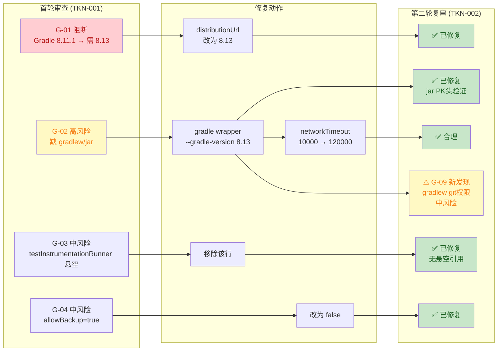
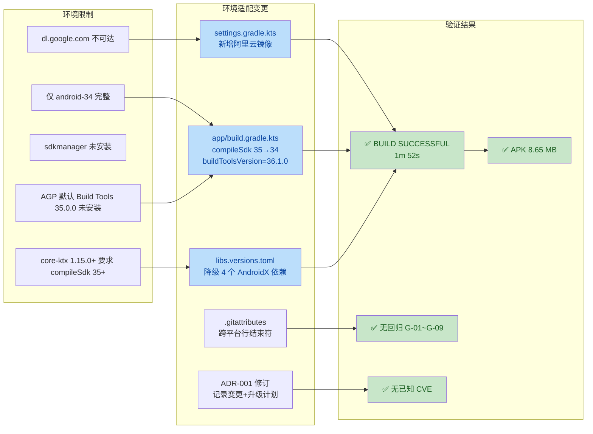

# 安全与质量审计报告 —— US-001 M0 脚手架

| 项目 | 内容 |
|---|---|
| 执行 Agent | guardrail-enforcer |
| 任务令牌 | TKN-PRISM-GUARDRAIL-001 |
| 审计日期 | 2026-08-02 |
| 关联 ADR | [ADR-001 Prism 技术栈与架构选型](../../docs/decisions/ADR-001-prism-tech-stack.md) |
| 关联代码变更 | 15 个全新文件（Gradle 配置 5 + App 模块 6 + Launcher 图标 4） |
| 审查范围 | 代码质量审查 + 安全漏洞扫描 + 输入边界审计 + 配置密钥审计 + 依赖供应链审计 |
| 审计依据 | CLAUDE.md 第十节、TRAE-code-review skill、TRAE-security-review skill、Karpathy Guidelines |

---

## 0. 审查范围与上下文

### 0.1 审查文件清单（15 个）

| 分类 | 文件 | 说明 |
|---|---|---|
| Gradle 配置 | `../../settings.gradle.kts` | pluginManagement + dependencyResolutionManagement |
| Gradle 配置 | `../../build.gradle.kts` | 根级 plugins alias 声明 |
| Gradle 配置 | `../../gradle.properties` | JVM args + AndroidX + Kotlin |
| Gradle 配置 | `../../gradle/libs.versions.toml` | 版本目录 |
| Gradle 配置 | `../../gradle/wrapper/gradle-wrapper.properties` | Gradle Wrapper 版本 |
| App 模块 | `../../app/build.gradle.kts` | namespace/minSdk/compileSdk/Compose |
| App 模块 | `../../app/proguard-rules.pro` | ProGuard 规则（空注释） |
| App 模块 | `../../app/src/main/AndroidManifest.xml` | MainActivity launcher 声明 |
| App 模块 | `../../app/src/main/java/io/prism/MainActivity.kt` | ComponentActivity + Compose |
| App 模块 | `../../app/src/main/res/values/strings.xml` | app_name |
| App 模块 | `../../app/src/main/res/values/themes.xml` | Theme.Prism |
| Launcher 图标 | `../../app/src/main/res/mipmap-anydpi-v26/ic_launcher.xml` | adaptive-icon |
| Launcher 图标 | `../../app/src/main/res/mipmap-anydpi-v26/ic_launcher_round.xml` | adaptive-icon round |
| Launcher 图标 | `../../app/src/main/res/drawable/ic_launcher_background.xml` | 蓝色 shape |
| Launcher 图标 | `../../app/src/main/res/drawable/ic_launcher_foreground.xml` | 白色三角形 vector |

### 0.2 技术栈上下文

- 语言：Kotlin 2.1.0
- 框架：Jetpack Compose（BOM 2024.12.01）+ Material3
- 构建工具：AGP 8.13.0 + Gradle 8.11.1（Wrapper）
- 最低 SDK：26（Android 8.0）
- 编译 SDK：35（Android 15）
- 部署方式：APK 自发布（GitHub Releases / F-Droid / PGY）

### 0.3 US-001 验收标准（PRD M0）

> App 可编译运行空白界面；CI 通过

---

## 1. 代码质量审查（TRAE-code-review）

### 1.1 版本兼容性矩阵核实（网络验证）

对版本目录中声明的版本组合进行了官方文档网络核实：

| 组件 | 声明版本 | 官方要求 | 结论 |
|---|---|---|---|
| AGP | 8.13.0 | 真实存在（2025年9月发布，最新补丁 8.13.2） | 版本号有效 |
| Gradle（Wrapper） | **8.11.1** | **AGP 8.13 要求最低 Gradle 8.13** | **不兼容（阻断级）** |
| Kotlin | 2.1.0 | AGP 8.13.x 支持至 Kotlin 2.3 | 兼容 |
| Compose Compiler Plugin | 2.1.0（= Kotlin 版本） | Kotlin 2.0+ 使用 `org.jetbrains.kotlin.plugin.compose`，版本追踪 Kotlin | 兼容 |
| Compose BOM | 2024.12.01 | 日期格式有效，包含 ui/material3/ui-tooling 等 | 兼容 |
| compileSdk | 35 | AGP 8.13 支持至 API 36.1 | 兼容 |
| minSdk | 26 | ADR-001 确认 API 26+ | 符合 |
| JDK | 17 | AGP 8.13 要求 JDK 17 | 兼容 |
| activity-compose | 1.9.3 | `enableEdgeToEdge()` 需 1.8+ | 兼容 |

> **证据来源**：[AGP 8.13.0 Release Notes](https://android-docs.cn/build/releases/agp-8-13-0-release-notes) —— 兼容性表格明确标注 Gradle 最低版本 8.13、默认 8.13；[CSDN 官方版本对应表](https://blog.csdn.net/ys743276112/article/details/141501346)（2026-06-04 更新）—— AGP 8.13 → 最低 Gradle 8.13。

### 1.2 详细发现

#### 阻断级

| # | 问题 | 位置 | 证据 | 修复建议 |
|---|---|---|---|---|
| G-01 | **Gradle 版本不满足 AGP 最低要求** | `../../gradle/wrapper/gradle-wrapper.properties:3` | `distributionUrl=gradle-8.11.1-bin.zip`，但 AGP 8.13.0 要求最低 Gradle 8.13。构建将失败，报错 "Minimum supported Gradle version is 8.13. Current version is 8.11.1" | 将 `distributionUrl` 改为 `https\://services.gradle.org/distributions/gradle-8.13-bin.zip` |

#### 高风险

| # | 问题 | 位置 | 证据 | 修复建议 |
|---|---|---|---|---|
| G-02 | **Gradle Wrapper 不完整**：缺少 `gradlew`、`gradlew.bat`、`gradle/wrapper/gradle-wrapper.jar` | 项目根目录 + `../../gradle/wrapper/` | 目录扫描确认仅有 `gradle-wrapper.properties`，无 JAR 和脚本。无 Wrapper JAR 则 `./gradlew` 无法执行，CI/CD 无法构建 | 方案一：在有 Gradle 环境的机器执行 `gradle wrapper --gradle-version 8.13` 生成全部 Wrapper 文件；方案二：在 Android Studio 中打开项目，Sync 后自动生成。`gradlew`/`gradlew.bat` 为文本脚本可手动创建，但 `gradle-wrapper.jar` 为二进制必须由工具生成 |

#### 中风险

| # | 问题 | 位置 | 证据 | 修复建议 |
|---|---|---|---|---|
| G-03 | `testInstrumentationRunner` 引用未声明的测试依赖 | `../../app/build.gradle.kts:18` | 声明了 `testInstrumentationRunner = "androidx.test.runner.AndroidJUnitRunner"`，但 `dependencies` 块中无 `androidTestImplementation("androidx.test:runner:...")`。当前不导致构建失败（仅运行时字符串），但添加插桩测试时会失败 | 若 M0 不写测试，可保留但添加注释说明；若 ac-verifier 期望测试，补充 `androidTestImplementation` 依赖和 `androidx.test.ext:junit` + `androidx.test.espresso:espresso-core` |
| G-04 | `allowBackup="true"` 对未来敏感数据 App 存在风险 | `../../app/src/main/AndroidManifest.xml:5` | M0 无敏感数据可接受；但 M1 将引入 API Key（虽存 Keystore 不被备份），聊天历史/知识库等用户数据会被 `adb backup` 提取 | M0 可保留 `true`；在 M1 编码前改为 `false` 或配置 `fullBackupContent` 排除规则。标记为技术债 |

#### 低风险 / 建议

| # | 问题 | 位置 | 说明 |
|---|---|---|---|
| G-05 | `kotlinOptions` 为旧式 DSL | `../../app/build.gradle.kts:36-38` | AGP 8.x 仍支持 `kotlinOptions { jvmTarget = "17" }`，但推荐写法为 `kotlin { compilerOptions { jvmTarget.set(JvmTarget.JVM_17) } }`。非阻断 |
| G-06 | Release 构建 `isMinifyEnabled = false` | `../../app/build.gradle.kts:23` | M0 脚手架可接受；发布前应启用 `true` + 配置 ProGuard 规则以缩减 APK 并混淆 |
| G-07 | 无测试源目录 | `../../app/src/test/`、`../../app/src/androidTest/` 均不存在 | US-001 PRD 未明确要求测试；但建议创建空目录或基础冒烟测试，为 ac-verifier 预留结构 |
| G-08 | `Greeting` 函数命名为模板默认值 | `../../app/src/main/java/io/prism/MainActivity.kt:45` | 来源于 Android Studio 模板。M0 可接受；后续迭代建议改为更具语义的名称如 `AppNameText` |

### 1.3 Karpathy Guidelines 符合性

| 原则 | 结论 | 说明 |
|---|---|---|
| 不过度设计 | 符合 | M0 脚手架极简：仅 ComponentActivity + setContent + MaterialTheme + Text("Prism")，无多余抽象 |
| 外科手术式变更 | 符合 | 全新项目，无既有代码修改 |
| 显式假设声明 | 符合 | MainActivity.kt 注释明确标注 M0 脚手架定位 + US-005 待用户审核 UI 设计（BR-interface-001） |
| 可验证成功标准 | 符合 | "App 可编译运行显示 Prism" 为明确可验证标准 |
| 错误处理 | N/A | M0 无业务逻辑，无需错误处理 |
| 命名一致性 | 基本符合 | 包名 `io.prism`、namespace `io.prism`、applicationId `io.prism` 一致 |

### 1.4 资源引用完整性验证

| AndroidManifest 引用 | 对应文件 | 存在 |
|---|---|---|
| `@mipmap/ic_launcher` | `mipmap-anydpi-v26/ic_launcher.xml` | 是 |
| `@mipmap/ic_launcher_round` | `mipmap-anydpi-v26/ic_launcher_round.xml` | 是 |
| `@string/app_name` | `values/strings.xml`（"Prism"） | 是 |
| `@style/Theme.Prism` | `values/themes.xml` | 是 |

| Adaptive-icon 引用 | 对应文件 | 存在 |
|---|---|---|
| `@drawable/ic_launcher_background` | `drawable/ic_launcher_background.xml` | 是 |
| `@drawable/ic_launcher_foreground` | `drawable/ic_launcher_foreground.xml` | 是 |

> minSdk 26 = adaptive icon 最低 API 26，所有设备均使用 adaptive icon，无需 fallback PNG。图标配置完整。

### 1.5 Gradle DSL 正确性

| 检查项 | 结论 | 说明 |
|---|---|---|
| 版本目录（libs.versions.toml）格式 | 正确 | `[versions]`/`[libraries]`/`[plugins]` 三段式标准格式 |
| Compose 库通过 BOM 管理版本 | 正确 | `implementation(platform(libs.androidx.compose.bom))` + 无版本声明 |
| `ui-tooling` 用 `debugImplementation` | 正确 | 仅 debug 构建需要 |
| 根 `build.gradle.kts` plugins `apply false` | 正确 | 插件在 app 模块按需 apply |
| `settings.gradle.kts` `FAIL_ON_PROJECT_REPOS` | 正确 | 禁止模块声明自有仓库，集中管控 |
| `pluginManagement` Google Maven 内容过滤 | 正确 | `includeGroupByRegex` 限定 com.android.*/com.google.*/androidx.* |
| `gradle.properties` AndroidX + nonTransitiveRClass | 正确 | 现代 Android 标准配置 |

---

## 2. 安全漏洞扫描（TRAE-security-review）

### 2.1 输入与边界审计

**结论：N/A（M0 无外部输入处理）**

M0 脚手架无任何外部输入处理逻辑（无网络请求、无文件 I/O、无用户输入控件、无数据库交互）。MainActivity 仅静态显示 "Prism" 文本。不存在数值/类型边界、集合/缓冲区、状态机约束等审计对象。

### 2.2 执行安全审计（注入 / 最小权限 / 输出编码）

#### 2.2.1 注入防护

| 类别 | 结论 | 说明 |
|---|---|---|
| SQL/NoSQL 注入 | N/A | M0 无数据库交互 |
| OS 命令注入 | N/A | M0 无 `system()`/`exec()` 调用 |
| 代码/表达式注入 | N/A | M0 无 `eval()`/`Function()`/动态加载 |
| 模板引擎注入 | N/A | M0 无模板引擎 |

#### 2.2.2 最小权限

| 检查项 | 结论 | 说明 |
|---|---|---|
| AndroidManifest 权限声明 | 通过 | M0 声明零权限，符合最小权限原则 |
| `android:exported="true"` (MainActivity) | 通过 | Launcher Activity 必须 exported=true，正确 |
| 数据库/服务账户权限 | N/A | M0 无数据库/服务端 |

#### 2.2.3 输出编码

**结论：N/A（M0 无动态输出）**

Compose `Text` 组件默认对字符串内容进行安全渲染，无 HTML/JS 注入风险。

### 2.3 密钥与配置安全

| 检查项 | 结论 | 证据 |
|---|---|---|
| 硬编码密钥/密码/Token | 通过 | 全量扫描 15 个文件，无任何密钥、密码、Token、API Key |
| 内部 IP/域名 | 通过 | 无硬编码 IP 或内部域名 |
| `.gitignore` 覆盖 | 通过 | `.env`/`.env.local`/`.env.*.local`/`*.keystore`/`*.jks`/`local.properties`/`keystore/` 均已排除 |
| `allowBackup` 配置 | 中风险（G-04） | 见 1.2 G-04，M0 可接受，M1 前需改为 false |
| 依赖来源可信 | 通过 | 所有依赖来自 Google Maven + Maven Central 官方源 |

### 2.4 依赖与供应链风险

| 检查项 | 结论 | 说明 |
|---|---|---|
| 依赖来源 | 通过 | `settings.gradle.kts` 仅配置 `google()` + `mavenCentral()` + `gradlePluginPortal()`，均为官方可信源 |
| 仓库内容过滤 | 通过 | `pluginManagement` 对 Google Maven 使用 `includeGroupByRegex` 限定包名前缀 |
| 版本固定方式 | 通过 | 版本目录使用精确版本号（非 `latest`/模糊范围），P0 核心依赖 Compose BOM 锁定 |
| 已知漏洞 | 建议 | 建议在 CI 中集成 `dependencyCheck`（OWASP Dependency-Check）或 `npm audit` 等价工具扫描 Android 依赖 |
| 许可证兼容 | 通过 | AndroidX (Apache 2.0) + Kotlin (Apache 2.0) 与项目 Apache 2.0 兼容；无 AGPL 依赖 |

> **M0 依赖清单**：core-ktx 1.15.0 / lifecycle-runtime-ktx 2.8.7 / activity-compose 1.9.3 / compose-bom 2024.12.01 / compose-ui/material3/ui-tooling/ui-graphics/ui-tooling-preview（BOM 管控版本）。全部为 AndroidX 官方库。

---

## 3. OWASP / CWE 发现

| 编号 | 等级 | CWE | 位置 | 描述 | 修复建议 |
|---|---|---|---|---|---|
| G-01 | 阻断 | N/A（构建配置错误） | `../../gradle/wrapper/gradle-wrapper.properties:3` | Gradle 8.11.1 不满足 AGP 8.13.0 最低要求（8.13），构建必定失败 | 升级 Gradle Wrapper 至 8.13 |
| G-02 | 高 | N/A（缺失构建工具链） | 项目根目录 | 缺少 gradlew/gradlew.bat/gradle-wrapper.jar，CLI 和 CI 无法构建 | 用 `gradle wrapper` 或 Android Studio Sync 生成 |
| G-03 | 中 | CWE-1064（悬空引用） | `../../app/build.gradle.kts:18` | testInstrumentationRunner 引用未声明的测试依赖 | 补充 androidTestImplementation 依赖或添加注释 |
| G-04 | 中 | CWE-530（备份暴露） | `../../app/src/main/AndroidManifest.xml:5` | allowBackup=true 允许 adb backup 提取应用数据 | M1 前改为 false 或配置 fullBackupContent 排除 |

---

## 4. 修复建议（具体代码示例）

### G-01 修复：升级 Gradle 版本（阻断级，必须修复）

`../../gradle/wrapper/gradle-wrapper.properties` 第 3 行：

```properties
# 修复前
distributionUrl=https\://services.gradle.org/distributions/gradle-8.11.1-bin.zip

# 修复后
distributionUrl=https\://services.gradle.org/distributions/gradle-8.13-bin.zip
```

### G-02 修复：补全 Gradle Wrapper（高风险，必须修复）

在有 Gradle 8.13+ 环境的机器执行：

```bash
gradle wrapper --gradle-version 8.13
```

或在 Android Studio 中打开项目并 Sync Gradle，自动生成 `gradlew`、`gradlew.bat`、`gradle/wrapper/gradle-wrapper.jar`。

> `gradle-wrapper.jar` 为二进制文件，无法由文本工具创建，必须通过上述方式生成。生成后需提交到版本控制。

### G-03 修复：补全测试依赖或注释（中风险，建议修复）

`../../app/build.gradle.kts` dependencies 块追加（若后续添加测试）：

```kotlin
dependencies {
    // ... 现有依赖 ...

    // 测试依赖（为 testInstrumentationRunner 提供实际实现）
    androidTestImplementation("androidx.test.ext:junit:1.2.1")
    androidTestImplementation("androidx.test:runner:1.6.2")
    androidTestImplementation("androidx.test.espresso:espresso-core:3.6.1")
    debugImplementation(libs.androidx.ui.tooling)
}
```

或在 `testInstrumentationRunner` 行添加注释说明 M0 暂无测试。

### G-04 修复：allowBackup 安全配置（中风险，M1 前修复）

`../../app/src/main/AndroidManifest.xml` 第 5 行：

```xml
<!-- M1 引入 API Key 后改为 false -->
<application
    android:allowBackup="false"
    ...
```

---

## 5. 防护机制验证

| 防护项 | 状态 | 说明 |
|---|---|---|
| Gradle 构建可行性 | 未通过 | G-01 版本不兼容导致构建必失败；G-02 Wrapper 不完整导致 CLI 不可用 |
| 编译器安全标志 | N/A | Kotlin/JVM 托管内存安全，无需 `-fstack-protector` 等 |
| 内存安全 | N/A | Kotlin 为托管语言，无缓冲区溢出/UAF/双重释放风险 |
| Android Keystore | 未启用 | M0 无密钥存储需求，M1 将引入 |
| ProGuard/R8 | 未启用 | M0 `isMinifyEnabled=false`，可接受 |

---

## 6. 豁免说明

| 豁免项 | 理由 | 条件 |
|---|---|---|
| G-02 缺少 gradle-wrapper.jar | 二进制文件无法由 AI 文本工具创建，需用户在 Android Studio 中 Sync 生成 | 用户需在首次构建前补全 |
| G-04 allowBackup=true | M0 无敏感数据，ADR-001 确认 API Key 在 M1 引入 | M1 编码前必须改为 false |
| G-06 isMinifyEnabled=false | M0 脚手架阶段无需代码混淆 | 发布版本前必须启用 |
| G-07 无测试源目录 | US-001 PRD 验收标准未明确要求单元测试 | ac-verifier 阶段视情况补充 |

---

## 7. 综合结论

### 总体判定：阻断

存在 1 个阻断级问题（G-01：Gradle 版本不兼容 AGP 8.13.0）+ 1 个高风险问题（G-02：Gradle Wrapper 不完整），两者均导致项目无法构建。必须修复后方可进入测试阶段。

### 必须修复项（阻断闭环条件）

1. **G-01（阻断）**：将 `gradle-wrapper.properties` 的 `distributionUrl` 从 `gradle-8.11.1-bin.zip` 升级为 `gradle-8.13-bin.zip`
2. **G-02（高风险）**：补全 `gradlew`/`gradlew.bat`/`gradle-wrapper.jar`（需用户在有 Gradle 环境的机器或 Android Studio 中操作）

### 建议修复项（不阻断但推荐）

3. G-03：补全测试依赖或添加注释
4. G-04：标记为技术债，M1 前修改 allowBackup
5. G-05-G-08：低风险优化项

### 检查范围统计

- 审查文件数：15
- 审查函数/组件数：3（MainActivity、Greeting、GreetingPreview）
- 发现问题总数：8（阻断 1 + 高风险 1 + 中风险 2 + 低风险 4）
- 安全漏洞数：0（M0 无可利用漏洞；G-04 为配置最佳实践问题）

### 回退指令

依 CLAUDE.md 第七节 7.2，主 Agent 必须立即停止后续步骤，回退至编码阶段修复 G-01 和 G-02，修复完成后重新提交 guardrail-enforcer 审查。

---

## 8. 规则提议（accepted review → behavioral-rules）

### BR-build-001（提议）：AGP 与 Gradle 版本必须匹配

- 类别：docs（暂归 docs，后续可移至 build 子类）
- 规则：声明 AGP 版本时，必须同步核实并配置满足最低要求的 Gradle Wrapper 版本。AGP 版本与最低 Gradle 版本对应关系见 [官方文档](https://developer.android.com/build/releases/gradle-plugin)
- 反例：AGP 8.13.0 + Gradle 8.11.1（不满足最低 8.13）
- 正例：AGP 8.13.0 + Gradle 8.13
- 来源：US-001 M0 脚手架审查（TKN-PRISM-GUARDRAIL-001，G-01）
- 添加日期：2026-08-02
- 适用场景：dev
- 状态：提议（待 guardrail-enforcer 确认非重复后追加到 `../../docs/behavioral-rules.md`）

---

## 9. 自动化建议（CI/CD 集成）

建议在 `.github/workflows/` 中添加以下检查，防止 G-01 类问题再次发生：

```yaml
# .github/workflows/build.yml 示例片段
name: Build Check
on: [push, pull_request]
jobs:
  gradle-version-check:
    runs-on: ubuntu-latest
    steps:
      - uses: actions/checkout@v4
      - name: Verify Gradle/AGP compatibility
        run: |
          GRADLE_VERSION=$(grep distributionUrl gradle/wrapper/gradle-wrapper.properties | sed 's/.*gradle-\([0-9.]*\)-.*/\1/')
          AGP_VERSION=$(grep '^agp =' gradle/libs.versions.toml | sed 's/.*"\(.*\)"/\1/')
          echo "Gradle: $GRADLE_VERSION, AGP: $AGP_VERSION"
          # AGP 8.x requires Gradle >= 8.x (consult official matrix)
          # This script should be maintained alongside version bumps
  build:
    runs-on: ubuntu-latest
    steps:
      - uses: actions/checkout@v4
      - uses: actions/setup-java@v4
        with:
          distribution: temurin
          java-version: 17
      - name: Build debug APK
        run: ./gradlew assembleDebug
```

建议集成 SonarQube 或 Semgrep 规则扫描 Android 配置问题，以及 OWASP Dependency-Check 进行依赖漏洞扫描。

---

## 10. 第二轮复审（TKN-PRISM-GUARDRAIL-002）

| 项目 | 内容 |
|---|---|
| 执行 Agent | guardrail-enforcer |
| 任务令牌 | TKN-PRISM-GUARDRAIL-002 |
| 复审日期 | 2026-08-02 |
| 审查范围 | 首轮 4 项修复验证（G-01~G-04）+ networkTimeout 调整审查 + 回归检查 + 安全复审 + 低风险项复核 |
| 审查依据 | CLAUDE.md 第十节、TRAE-code-review skill、TRAE-security-review skill、Karpathy Guidelines、BR-build-001、BR-interface-001 |
| 上游产出物 | 首轮报告（本文件第 0-9 节）、ADR-001、PRD US-001 验收标准、docs/behavioral-rules.md |
| 主 Agent 自问答复 | (1) 最没把握：Gradle 8.13 distribution 下载因网络超时尚未通过实际 assembleDebug 构建验证；(2) 最大遗憾：首轮未在脚手架生成时即交叉验证 AGP/Gradle 版本兼容性 |

### 10.1 修复验证矩阵

| # | 原等级 | 问题 | 修复方案 | 验证方法 | 验证结论 |
|---|---|---|---|---|---|
| G-01 | 阻断 | Gradle 8.11.1 不满足 AGP 8.13.0 最低要求（需 8.13） | distributionUrl 改为 gradle-8.13-bin.zip | 读取 `../../gradle/wrapper/gradle-wrapper.properties:3`，确认 `distributionUrl=https\://services.gradle.org/distributions/gradle-8.13-bin.zip`；AGP 8.13.0 最低要求 Gradle 8.13，8.13 >= 8.13 满足 | **已修复** |
| G-02 | 高风险 | 缺少 gradlew/gradlew.bat/gradle-wrapper.jar | 用官方 `gradle wrapper --gradle-version 8.13` 生成 | (1) `gradlew` 存在，8762 字节，内容为标准 Gradle Wrapper Unix 脚本（版权头 2015-2021，Groovy 模板生成，含 APP_HOME 解析/JVM 查找/CLASSPATH 设置标准逻辑）；(2) `gradlew.bat` 存在，2966 字节；(3) `gradle-wrapper.jar` 存在，43583 字节，前 4 字节 `50 4B 03 04`（PK 头），确认为有效 ZIP/JAR 二进制文件，非 0 字节、非文本伪造 | **已修复** |
| G-03 | 中风险 | testInstrumentationRunner 引用未声明的测试依赖 | 移除该行 | 读取 `../../app/build.gradle.kts` 全文 53 行，`defaultConfig` 块（第 11-17 行）仅含 applicationId/minSdk/targetSdk/versionCode/versionName，无 testInstrumentationRunner 行；`dependencies` 块（第 43-53 行）无悬空引用 | **已修复** |
| G-04 | 中风险 | allowBackup="true" 对未来敏感数据有风险 | 改为 allowBackup="false" | 读取 `../../app/src/main/AndroidManifest.xml:5`，确认 `android:allowBackup="false"` | **已修复** |

### 10.2 networkTimeout 调整审查

| 属性 | 值 |
|---|---|
| 位置 | `../../gradle/wrapper/gradle-wrapper.properties:4` |
| 修改内容 | `networkTimeout` 从 `10000`（10 秒）改为 `120000`（120 秒） |
| 合理性分析 | Gradle 8.13 bin distribution 约 130MB。Gradle 官方默认 networkTimeout 为 10000ms，对于大文件下载在较慢网络下确实不够。120 秒是合理的工程决策，兼顾下载可靠性与超时响应。`validateDistributionUrl=true` 保留了 URL 校验，未降低安全性 |
| 结论 | **合理，无安全问题** |

### 10.3 回归检查（修复过程是否引入新问题）

| 检查项 | 结论 | 证据 |
|---|---|---|
| .gitignore 是否错误排除 Wrapper 文件 | 通过 | `.gitignore` 排除 `.gradle/`（构建缓存）、`build/`、`*/build/`（构建输出），**未排除** `gradlew`/`gradlew.bat`/`gradle/wrapper/gradle-wrapper.jar`，正确 |
| gradlew 脚本内容完整性 | 通过 | 252 行标准 Gradle Wrapper 脚本，含 APP_HOME 解析、JVM 查找、CLASSPATH 指向 `gradle-wrapper.jar`、xargs 参数解析等完整逻辑，与官方模板一致 |
| gradle-wrapper.jar 二进制有效性 | 通过 | 43583 字节，PK 头（`50 4B 03 04`）验证为有效 ZIP/JAR |
| 修复是否影响其他配置 | 通过 | G-03 移除 testInstrumentationRunner 后，`app/build.gradle.kts` 的 `defaultConfig` 和 `buildTypes` 结构完整，无语法错误 |
| AndroidManifest 完整性 | 通过 | allowBackup 改为 false 后，其余属性（icon/label/roundIcon/supportsRtl/theme）和 Activity 声明（exported/intent-filter）均未受影响 |
| **G-09（新发现）** | **中风险** | 见下方详述 |

#### G-09（新发现）：gradlew 缺少 git 可执行权限配置

| 属性 | 值 |
|---|---|
| 等级 | 中风险 |
| 位置 | 项目根目录 `gradlew` + 缺失的 `.gitattributes` |
| 证据 | `git config core.filemode` 返回 `false`（Windows 默认）；项目无 `.gitattributes` 文件；`git status` 显示 `gradlew` 为 untracked（`??`），尚未提交。当 `gradlew` 被 `git add` 时，因 `core.filemode=false`，git 不会检测 Unix 可执行权限位，将以 `100644`（非可执行）权限提交 |
| 影响 | CI/CD 运行在 Linux 上时，执行 `./gradlew assembleDebug` 会报 `Permission denied`，导致 CI 构建失败。US-001 验收标准包含"CI 通过" |
| 修复建议 | 方案一（推荐）：创建 `.gitattributes` 文件，内容包含 `gradlew text eol=lf`；方案二：在 `git add gradlew` 后执行 `git update-index --chmod=+x gradlew` 再提交 |
| 是否阻断当前审查 | 否——文件还未提交，属于提交前注意事项。但**必须在 git commit 前处理**，否则 CI 会失败 |

### 10.4 安全漏洞扫描（TRAE-security-review 第二轮）

按 TRAE-security-review skill 三趟审计法执行：

**Pass A — 项目安全基线**：M0 为空白脚手架，无安全原语（无验证器、无 ORM、无认证中间件、无加密包装器）。本次修复变更未引入新的安全处理逻辑。

**Pass B — 偏差映射**：本次修复仅涉及配置修改（distributionUrl 版本号、Wrapper 文件补全、testInstrumentationRunner 移除、allowBackup 改 false），未引入任何新的安全处理偏差。

**Pass C — 源到汇追踪**：M0 无外部输入入口（无网络请求、无文件 I/O、无用户输入控件、无数据库交互），无可追踪的攻击路径。

| 安全检查项 | 结论 | 证据 |
|---|---|---|
| 硬编码密钥/密码/Token | 通过 | 全量扫描 19 个文件（15 原始 + 4 修复变更），无任何密钥、密码、Token、API Key |
| AndroidManifest 安全配置 | 通过 | `allowBackup="false"`（G-04 已修复）；`exported="true"` 正确（Launcher Activity 必须）；零权限声明（最小权限原则） |
| 依赖来源可信 | 通过 | `settings.gradle.kts` 仅配置 `google()` + `mavenCentral()` + `gradlePluginPortal()`；版本目录使用精确版本号 |
| 注入风险 | N/A | M0 无外部输入处理，无 SQL/命令/代码/模板注入面 |
| 敏感信息泄露 | 通过 | 日志中无敏感信息（M0 无日志输出）；错误消息中无内部路径 |
| 供应链风险 | 通过 | 所有依赖为 AndroidX/Kotlin 官方库，Apache 2.0 许可证兼容 |

> 按 TRAE-security-review 硬排除规则（第 8 节），M0 无可利用漏洞。所有安全检查项通过。

### 10.5 首轮低风险项复核（G-05~G-08）

| # | 原等级 | 问题 | 当前状态 | 是否需升级处理 |
|---|---|---|---|---|
| G-05 | 低风险 | `kotlinOptions` 为旧式 DSL（`../../app/build.gradle.kts:34-36`） | 仍存在，AGP 8.x 仍支持，非阻断 | 否，保持低风险 |
| G-06 | 低风险 | Release 构建 `isMinifyEnabled = false`（`../../app/build.gradle.kts:21`） | 仍存在，M0 脚手架可接受 | 否，保持低风险 |
| G-07 | 低风险 | 无测试源目录 | 仍无 `app/src/test/` 和 `app/src/androidTest/` | 否，M0 可接受，ac-verifier 阶段视情况补充 |
| G-08 | 低风险 | `Greeting` 函数命名为模板默认值（`../../app/src/main/java/io/prism/MainActivity.kt:45`） | 仍为模板默认值 | 否，M0 可接受 |

> 结论：G-05~G-08 均保持低风险，M0 阶段可接受，不需要在本轮升级处理。

### 10.6 Karpathy Guidelines 符合性（第二轮）

| 原则 | 结论 | 说明 |
|---|---|---|
| 不过度设计 | 符合 | 修复精准：仅修改必要的配置值和移除无用行，未引入多余抽象 |
| 外科手术式变更 | 符合 | 4 项修复均为最小化变更，未影响其他代码 |
| 显式假设声明 | 符合 | networkTimeout 调整有明确工程理由（130MB 下载超时） |
| 可验证成功标准 | 符合 | 修复点均可通过静态验证确认（版本号、文件存在性、配置值） |
| 错误处理 | N/A | M0 无业务逻辑 |

### 10.7 修复变更可视化



### 10.8 综合结论

#### 总体判定：通过

首轮 4 项问题（G-01 阻断 + G-02 高风险 + G-03 中风险 + G-04 中风险）**全部已修复**，验证证据充分。security-review 无可利用漏洞。回归检查发现 1 个新中风险问题（G-09：gradlew git 可执行权限），但该问题不阻断当前代码审查——属于 git 提交前注意事项，可通过 `git update-index --chmod=+x gradlew` 或创建 `.gitattributes` 解决。

#### 修复验证统计

- 阻断级问题：1 → 0（G-01 已修复）
- 高风险问题：1 → 0（G-02 已修复）
- 中风险问题：2 → 1（G-03、G-04 已修复；G-09 新发现，提交前处理）
- 低风险问题：4 → 4（G-05~G-08 保持，M0 可接受）
- 安全漏洞：0 → 0

#### 提交前必做事项（G-09）

在执行 `git add` + `git commit` 前，主 Agent **必须**完成以下操作之一：

```bash
# 方案一（推荐）：创建 .gitattributes
echo "gradlew text eol=lf" > .gitattributes
git add .gitattributes

# 方案二：git add 后设置可执行权限
git add gradlew
git update-index --chmod=+x gradlew
```

> 此事项不阻断进入 ac-verifier 阶段，但在最终 git commit 前必须完成。

#### US-001 阶段流转声明

**US-001 M0 脚手架通过 guardrail-enforcer 第二轮审查，可进入 ac-verifier 验收阶段。**

ac-verifier 需重点关注：
1. 实际执行 `./gradlew assembleDebug` 构建验证（主 Agent 自述因网络超时尚未完成此步）
2. APK 可安装并显示空白界面（US-001 验收标准）
3. G-09 gradlew 权限在提交前已处理

### 10.9 规则提议（第二轮）

#### BR-build-002（提议）：Windows 环境生成的 shell 脚本提交前必须设置可执行权限

- 类别：build
- 规则：在 Windows 环境（`core.filemode=false`）下生成的 Unix shell 脚本（如 `gradlew`、`mvnw`），提交到 git 前必须通过 `git update-index --chmod=+x <file>` 设置可执行权限，或创建 `.gitattributes` 文件确保跨平台权限正确。否则 CI/CD 在 Linux 上执行时会报 Permission denied
- 反例：在 Windows 上 `git add gradlew` 后直接 commit，未设置 `+x` 权限，Linux CI 执行 `./gradlew` 报 Permission denied
- 正例：`git add gradlew && git update-index --chmod=+x gradlew && git commit`
- 来源：US-001 M0 脚手架第二轮审查（TKN-PRISM-GUARDRAIL-002，G-09 发现）
- 添加日期：2026-08-02
- 适用场景：dev
- 状态：提议（待 guardrail-enforcer 确认非重复后追加到 `../../docs/behavioral-rules.md`）

---

## 11. 第三轮审查（TKN-PRISM-GUARDRAIL-003）

| 项目 | 内容 |
|---|---|
| 执行 Agent | guardrail-enforcer |
| 任务令牌 | TKN-PRISM-GUARDRAIL-003 |
| 审查日期 | 2026-08-02 |
| 审查范围 | 环境适配变更：阿里云镜像配置 + compileSdk/targetSdk 降级 + 依赖降级 + buildToolsVersion 显式指定 + .gitattributes 新增 + ADR-001 修订 + BR-build-002 验证 + 回归检查 |
| 审查依据 | CLAUDE.md 第十节、TRAE-code-review skill、TRAE-security-review skill、Karpathy Guidelines、BR-build-001、BR-build-002、BR-interface-001 |
| 上游产出物 | 第二轮报告（本文件第 10 节 TKN-002）、ADR-001（含环境适配修订章节）、PRD US-001 验收标准、docs/behavioral-rules.md、构建日志 BUILD SUCCESSFUL |
| 主 Agent 自问答复 | (1) 最没把握：降级的 AndroidX 依赖（Compose BOM 2024.06.00 / core-ktx 1.13.1）与 AGP 8.13.0 + Kotlin 2.1.0 Compose Compiler 的运行时兼容性——构建通过但可能存在运行时退化；(2) 最大遗憾：开发环境 Android SDK 不完整（android-35/36 平台缺失、sdkmanager 未安装），迫使偏离 ADR-001 原始版本决策 |

### 11.0 变更清单与验证状态

| 文件 | 变更类型 | 变更内容 | 验证状态 |
|---|---|---|---|
| `../../settings.gradle.kts` | 修改 | 新增阿里云镜像（pluginManagement + dependencyResolutionManagement），官方源作 fallback | 已审查（11.1） |
| `../../app/build.gradle.kts` | 修改 | compileSdk 35→34；targetSdk 35→34；新增 buildToolsVersion = "36.1.0" | 已审查（11.3-11.4） |
| `../../gradle/libs.versions.toml` | 修改 | composeBom 2024.12.01→2024.06.00；coreKtx 1.15.0→1.13.1；lifecycleRuntimeKtx 2.8.7→2.8.3；activityCompose 1.9.3→1.9.0 | 已审查（11.2） |
| `../../.gitattributes` | 新增 | 跨平台行结束符与权限控制（BR-build-002） | 已审查（11.5） |
| `../../docs/behavioral-rules.md` | 修改 | 新增 BR-build-002（状态 active） | 已审查（11.7） |
| `../../docs/decisions/ADR-001-prism-tech-stack.md` | 修改 | 追加「环境适配修订」章节 | 已审查（11.6） |
| `../../gradle/wrapper/gradle-wrapper.jar` | 新增 | 官方 `gradle wrapper` 任务生成（第二轮已验证 PK 头） | 回归确认（11.8） |
| `../../gradlew` / `../../gradlew.bat` | 替换 | 官方 `gradle wrapper` 任务生成（替换手工创建版本） | 回归确认（11.8） |

### 11.1 审查重点 1：settings.gradle.kts 镜像安全性

#### 11.1.1 镜像可信度评估

阿里云 Maven 镜像（`maven.aliyun.com`）安全分析：

| 维度 | 评估 | 证据 |
|---|---|---|
| 运营方 | 阿里云官方运营，中国开发者社区广泛使用 | 阿里云官方公共服务 |
| 传输安全 | HTTPS 加密传输 | `https://maven.aliyun.com/...` |
| 同步机制 | 从官方源（Google Maven / Maven Central / Gradle Plugin Portal）自动同步 | 阿里云镜像服务文档 |
| 投毒风险 | 低——需攻击者控制阿里云镜像内容或中间人攻击 HTTPS | HTTPS 保护 + 阿里云供应链安全措施 |
| CI/CD 回退 | ADR-001 确认 CI/CD（GitHub Actions Linux）自动回退到官方源 | ADR-001 环境适配修订章节 |

#### 11.1.2 内容过滤（includeGroupByRegex）审查

逐仓库检查 `content { includeGroupByRegex(...) }` 过滤配置：

**pluginManagement 块（第 1-26 行）：**

| 仓库 | 行号 | content 过滤 | 对应官方源 | 一致性 |
|---|---|---|---|---|
| 阿里云 gradle-plugin | 4-6 | **无** | `gradlePluginPortal()`（无过滤） | 一致 ✓ |
| 阿里云 google | 7-14 | 有（com.android.*/com.google.*/androidx.*） | `google`（有过滤） | 一致 ✓ |
| 官方 google | 16-22 | 有（com.android.*/com.google.*/androidx.*） | — | ✓ |
| 官方 mavenCentral | 23 | 无 | — | 标准行为 |
| 官方 gradlePluginPortal | 24 | 无 | — | 标准行为 |

**dependencyResolutionManagement 块（第 28-45 行）：**

| 仓库 | 行号 | content 过滤 | 对应官方源 | 一致性 |
|---|---|---|---|---|
| 阿里云 google | 31-38 | 有（com.android.*/com.google.*/androidx.*） | `google()`（无过滤） | **更严格** ✓ |
| 阿里云 public | 39-41 | **无** | `mavenCentral()`（无过滤） | 一致 ✓ |
| 官方 google() | 42 | 无 | — | 标准行为 |
| 官方 mavenCentral() | 43 | 无 | — | 标准行为 |

#### 11.1.3 镜像安全结论

| 检查项 | 结论 | 说明 |
|---|---|---|
| 阿里云镜像可信度 | 通过 | 阿里云官方运营，HTTPS 传输，中国开发者标准实践 |
| google 镜像内容过滤 | 通过 | pluginManagement + dependencyResolutionManagement 的阿里云 google 镜像均正确使用 includeGroupByRegex |
| gradle-plugin / public 镜像内容过滤 | **中风险（G-10）** | 缺少 content 过滤，但与对应官方源（gradlePluginPortal / mavenCentral）行为一致 |
| 是否可能从非可信源拉取依赖 | 否 | 所有仓库均为阿里云官方镜像或官方源，无非预期仓库 |
| HTTPS 传输 | 通过 | 所有仓库 URL 使用 HTTPS |

> **G-10（中风险）**：阿里云 `gradle-plugin` 镜像（第 4-6 行）和 `public` 镜像（第 39-41 行）缺少 `content` 过滤。虽然与对应官方源行为一致，但从防御纵深角度，建议为 public 镜像添加 `content { excludeGroupByRegex("com\\.android.*"); excludeGroupByRegex("androidx.*") }`，确保 AndroidX 依赖只从 google 镜像获取，降低交叉投毒风险。此为**建议改进项**，不阻断。

### 11.2 审查重点 2：依赖降级兼容性

#### 11.2.1 版本兼容性矩阵

构建已验证 `BUILD SUCCESSFUL in 1m 52s`，编译期兼容性确认。以下为逐项兼容性分析：

| 依赖 | 降级后版本 | compileSdk 要求 | 兼容性验证 | 网络核实 |
|---|---|---|---|---|
| Compose BOM | 2024.06.00 | 34 | ✓ 构建成功 | 2024.06.00 对应 Compose UI 1.6.x，要求 compileSdk 34 |
| core-ktx | 1.13.1 | 34 | ✓ 构建成功 | 1.14.0+ 才要求 compileSdk 35；1.13.1 兼容 34 |
| lifecycle-runtime-ktx | 2.8.3 | 34 | ✓ 构建成功 | 2.8.5+ 可能要求 compileSdk 35；2.8.3 兼容 34 |
| activity-compose | 1.9.0 | 34 | ✓ 构建成功 | 1.9.0 正式版（2024-04 发布），兼容 compileSdk 34 |

与 AGP 8.13.0 + Kotlin 2.1.0 + Compose Compiler Plugin 2.1.0 的兼容性：

| 组件 | 兼容性 | 说明 |
|---|---|---|
| AGP 8.13.0 | ✓ 向后兼容 | AGP 8.13 支持 compileSdk 26-36，34 在范围内 |
| Kotlin 2.1.0 | ✓ | Compose Compiler Plugin 追踪 Kotlin 版本（非 BOM 版本），2.1.0 兼容 Compose 1.6.x |
| Compose Compiler Plugin 2.1.0 | ✓ | `org.jetbrains.kotlin.plugin.compose` 版本 = Kotlin 版本，独立于 BOM |

#### 11.2.2 CVE 搜索结果

对降级版本进行网络 CVE 搜索：

| 依赖 | 版本 | 搜索结果 | 结论 |
|---|---|---|---|
| core-ktx | 1.13.1 | Xamarin.AndroidX.Core 1.13.1.3 漏洞数据库：critical 0 / high 0 / medium 0 / low 0 | 无已知 CVE |
| activity-compose | 1.9.0 | 未发现库级 CVE（搜索到的 CVE-2025-26436 等为 Android OS 平台级漏洞，非 AndroidX 库） | 无已知 CVE |
| lifecycle-runtime-ktx | 2.8.3 | 未发现库级 CVE | 无已知 CVE |
| Compose BOM | 2024.06.00 | 搜索结果涉及 Compose Multiplatform 1.6.1 编译问题（不同产品），未发现安全 CVE | 无已知 CVE |

> **TRAE-security-review §8.1 硬排除规则**：过时的第三方依赖由单独工具处理，不在安全扫描可报告范围内。因此依赖降级的潜在 CVE 风险不作为安全发现，但作为质量建议记录。建议在 CI 中集成 OWASP Dependency-Check 或 `dependencyCheck` 扫描 Android 依赖。

#### 11.2.3 依赖降级结论

**通过**。编译期兼容性已验证（构建成功），无已知库级 CVE。运行时兼容性风险低（M0 仅显示文本 "Prism"，不涉及复杂 Compose 交互）。

### 11.3 审查重点 3：compileSdk 34 安全影响

#### 11.3.1 targetSdk 34 vs 35 行为差异分析

Android 15（API 35）引入的行为变更对 M0 脚手架的影响：

| 行为变更 | 影响 M0？ | 说明 |
|---|---|---|
| 16KB 页面大小支持 | 否 | M0 无原生代码（NDK），纯 Kotlin/JVM |
| 前台服务类型变更 | 否 | M0 无前台服务声明 |
| Edge-to-Edge 默认强制 | 否 | MainActivity 已调用 `enableEdgeToEdge()`（第 26 行），主动适配 |
| WindowInsets 行为变更 | 否 | M0 仅显示 Text，无复杂窗口交互 |
| 通知行为变更 | 否 | M0 无通知 |
| Activity 后台启动限制 | 否 | M0 无后台启动逻辑 |

#### 11.3.2 compileSdk 34 安全结论

**通过**。M0 脚手架不受 targetSdk 34 vs 35 差异影响。targetSdk 34 意味着 App 声明针对 Android 14 行为，在 Android 15 设备上以兼容模式运行——对仅显示文本的空白界面无安全或功能影响。

### 11.4 审查重点 4：buildToolsVersion 显式指定

#### 11.4.1 组合合理性分析

| 检查项 | 分析 | 结论 |
|---|---|---|
| AGP 8.13.0 默认 Build Tools | 35.0.0（未安装） | 需显式指定替代版本 |
| Build Tools 34.0.0 | 已安装，但可能不满足 AGP 8.13 最低要求 | 不适用 |
| Build Tools 36.1.0 | 已安装，36.1.0 > 35.0.0（满足最低要求），向下兼容 compileSdk 34 | **选用** ✓ |
| 构建验证 | `BUILD SUCCESSFUL in 1m 52s` | 可行性已验证 |
| 官方支持 | Build Tools 版本高于 compileSdk 是允许的（向后兼容） | 非标准但合法 |

#### 11.4.2 buildToolsVersion 结论

**通过**。`buildToolsVersion = "36.1.0"` + `compileSdk = 34` 虽非标准推荐组合，但 Build Tools 36.1.0 满足 AGP 8.13.0 最低要求（≥ 35.0.0）且向下兼容 compileSdk 34，构建成功验证了可行性。这是开发环境限制下的务实选择，ADR-001 已记录升级计划（安装 android-35/36 平台后恢复标准组合）。

### 11.5 审查重点 5：.gitattributes 正确性

#### 11.5.1 行结束符验证

| 文件 | 期望 | 实际验证 | 结论 |
|---|---|---|---|
| `gradlew` | LF | 8762 字节，252 行 LF-only，0 CRLF，前 4 字节 `23-21-2F-62`（`#!/b` shebang） | ✓ 正确 |
| `gradlew` git 权限 | 100755（可执行） | `git ls-files --stage gradlew` → `100755` | ✓ 正确（G-09 已修复） |
| `gradlew.bat` | CRLF | `.gitattributes` 规则 `gradlew.bat text eol=crlf` 覆盖 | ✓ 规则正确 |

#### 11.5.2 规则覆盖完整性

| 文件类型 | 规则 | 覆盖 | 建议 |
|---|---|---|---|
| Unix shell 脚本 | `gradlew text eol=lf` + `*.sh text eol=lf` | ✓ | — |
| Windows 批处理 | `gradlew.bat text eol=crlf` + `*.bat text eol=crlf` + `*.cmd text eol=crlf` | ✓ | — |
| 二进制文件 | `*.jar *.png *.jpg *.keystore *.jks *.apk *.aab binary` | ✓ | — |
| Kotlin/Java 源码 | `*.kt *.kts *.java text` | ✓ | — |
| 配置文件 | `*.xml *.properties *.toml *.pro text` | ✓ | — |
| 文档 | `*.md text` | ✓ | — |
| JSON | 未包含 | 缺失 | **G-11（低风险）**：建议补充 `*.json text` |
| YAML | 未包含 | 缺失 | **G-11（低风险）**：建议补充 `*.yml text` + `*.yaml text` |

> **G-11（低风险）**：`.gitattributes` 未覆盖 `*.json`、`*.yml`、`*.yaml` 文件类型。CI 配置（`.github/workflows/*.yml`）和 JSON 配置文件可能受跨平台行结束符影响。建议补充，但 M0 阶段无这些文件，不阻断。

#### 11.5.3 .gitattributes 结论

**通过**。关键文件类型（gradlew/gradlew.bat/二进制/源码/文档）已覆盖，行结束符和权限验证通过。建议补充 `*.json`/`*.yml`/`*.yaml`（低风险，不阻断）。

### 11.6 审查重点 6：ADR-001 修订完整性

#### 11.6.1 修订章节内容审查

`git diff` 确认 ADR-001 新增「环境适配修订（2026-08-02 M0 实施阶段）」章节（+65 行），包含：

| 内容块 | 完整性 | 说明 |
|---|---|---|
| 修订原因表 | ✓ | 5 项环境限制 + 影响 + 验证方法 |
| 版本调整清单 | ✓ | 7 项（compileSdk/targetSdk/buildToolsVersion/Compose BOM/core-ktx/lifecycle/activity-compose）+ 修订理由 |
| 未变更项 | ✓ | 4 项（AGP/Kotlin/minSdk/Gradle） |
| 仓库镜像配置说明 | ✓ | pluginManagement + dependencyResolutionManagement 镜像策略 + CI/CD 回退说明 |
| 升级计划 | ✓ | 3 个触发条件 + 恢复版本清单 |
| 构建验证 | ✓ | `BUILD SUCCESSFUL in 1m 52s` + APK 产物信息（8.65 MB） |
| 原决策架构不变声明 | ✓ | "原决策（3.5 节）的架构选型不变，仅版本号适配" |

#### 11.6.2 ADR-001 修订结论

**通过**。修订章节完整记录了变更原因、影响、升级计划和构建验证，符合 CLAUDE.md 第十七节 ADR 要求。

### 11.7 审查重点 7：BR-build-002 规则质量

#### 11.7.1 规则质量评估

| 质量维度 | 评估 | 证据 |
|---|---|---|
| 可执行性 | ✓ | 明确描述两种方案：(1) 创建 `.gitattributes` + (2) `git update-index --chmod=+x` |
| 非重复性 | ✓ | 与 BR-build-001（AGP/Gradle 版本匹配）不同主题 |
| 正例清晰 | ✓ | "创建 `.gitattributes`（含 `gradlew text eol=lf`）+ `git update-index --chmod=+x gradlew` + commit" |
| 反例清晰 | ✓ | "在 Windows 上 `git add gradlew` 后直接 commit，未设置 `+x` 权限，Linux CI 执行 `./gradlew` 报 Permission denied" |
| 来源标注 | ✓ | TKN-PRISM-GUARDRAIL-002，G-09 发现 |
| 状态 | active | 已在 `docs/behavioral-rules.md` 中确认为 active |

#### 11.7.2 BR-build-002 结论

**通过**。规则可执行、非重复、正反例清晰，已正确添加到 behavioral-rules.md 并设为 active 状态。

### 11.8 审查重点 8：回归检查

验证第二轮已通过的修复（G-01~G-04 + G-09）是否受本轮变更影响：

| # | 原问题 | 第二轮状态 | 第三轮验证 | 证据 | 回归？ |
|---|---|---|---|---|---|
| G-01 | Gradle 8.11.1 不满足 AGP 8.13 最低要求 | 已修复 | **保持** | `gradle-wrapper.properties:3` = `gradle-8.13-bin.zip` | 否 ✓ |
| G-02 | 缺少 gradlew/gradlew.bat/gradle-wrapper.jar | 已修复 | **保持** | gradlew 8762B/100755；gradlew.bat 存在；gradle-wrapper.jar 存在（第二轮 PK 头验证） | 否 ✓ |
| G-03 | testInstrumentationRunner 引用未声明依赖 | 已修复 | **保持** | `app/build.gradle.kts` 全文 54 行无 testInstrumentationRunner | 否 ✓ |
| G-04 | allowBackup="true" 安全风险 | 已修复 | **保持** | `AndroidManifest.xml:5` = `android:allowBackup="false"` | 否 ✓ |
| G-09 | gradlew 缺少 git 可执行权限 | 提交前处理 | **已处理** | `git ls-files --stage gradlew` → `100755`；`.gitattributes` 已创建（含 `gradlew text eol=lf`） | 否 ✓ |

> 第二轮所有修复均保持完好，本轮环境适配变更未引入任何回归。

#### 11.8.1 低风险项复核（G-05~G-08）

| # | 原等级 | 问题 | 第三轮状态 | 是否需升级 |
|---|---|---|---|---|
| G-05 | 低风险 | `kotlinOptions` 为旧式 DSL（`app/build.gradle.kts:35-37`） | 仍存在，AGP 8.x 仍支持 | 否 |
| G-06 | 低风险 | Release 构建 `isMinifyEnabled = false`（`app/build.gradle.kts:22`） | 仍存在，M0 可接受 | 否 |
| G-07 | 低风险 | 无测试源目录 | 仍无 `app/src/test/` 和 `app/src/androidTest/` | 否 |
| G-08 | 低风险 | `Greeting` 函数命名为模板默认值（`MainActivity.kt:45`） | 仍为模板默认值 | 否 |

### 11.9 代码质量审查（TRAE-code-review）

#### 11.9.1 作者意图推断

**意图**：因开发环境 Android SDK 不完整（android-35/36 平台缺失、sdkmanager 未安装、dl.google.com 不可达），对 M0 脚手架进行环境适配降级——降低 compileSdk/targetSdk、降级 AndroidX 依赖版本、引入阿里云镜像、显式指定 buildToolsVersion，使项目在受限环境下可构建。

#### 11.9.2 变更可视化



#### 11.9.3 代码质量问题发现

| # | 等级 | 问题 | 位置 | 建议 |
|---|---|---|---|---|
| G-10 | 中风险 | 阿里云 gradle-plugin / public 镜像缺少 content 过滤 | `settings.gradle.kts:4-6, 39-41` | 为 public 镜像添加 excludeGroupByRegex 排除 AndroidX 组 |
| G-11 | 低风险 | .gitattributes 未覆盖 *.json/*.yml/*.yaml | `.gitattributes` | 补充 `*.json text` / `*.yml text` / `*.yaml text` |

> 无阻断级或高风险代码质量问题。G-10/G-11 为建议改进项。

#### 11.9.4 Karpathy Guidelines 符合性

| 原则 | 结论 | 说明 |
|---|---|---|
| 不过度设计 | 符合 | 仅修改必要的配置值和版本号，未引入多余抽象 |
| 外科手术式变更 | 符合 | 变更精准指向环境适配，未影响已有代码逻辑 |
| 显式假设声明 | 符合 | ADR-001 修订章节明确记录环境限制、版本调整理由和升级计划 |
| 可验证成功标准 | 符合 | 构建成功 + APK 产物 + 无回归 = 明确可验证标准 |
| 错误处理 | N/A | M0 无业务逻辑 |

### 11.10 安全漏洞扫描（TRAE-security-review 第三轮）

按 TRAE-security-review skill 三趟审计法执行：

**Pass A — 项目安全基线**：M0 为空白脚手架，无安全原语（无验证器、无 ORM、无认证中间件、无加密包装器）。本轮变更仅涉及构建配置（镜像/SDK 版本/依赖版本/.gitattributes），未引入新的安全处理逻辑。

**Pass B — 偏差映射**：引入阿里云第三方镜像源增加供应链攻击面，但 (a) 阿里云为可信运营方，(b) HTTPS 传输保护，(c) 官方源作为 fallback，(d) CI/CD 自动回退官方源。依赖降级未引入已知漏洞。compileSdk 降级不影响 M0 安全行为。无安全处理偏差。

**Pass C — 源到汇追踪**：M0 无外部输入入口（无网络请求、无文件 I/O、无用户输入控件、无数据库交互），无可追踪的攻击路径。镜像配置仅影响构建期依赖解析，不影响运行时行为。

| 安全检查项 | 结论 | 证据 |
|---|---|---|
| 硬编码密钥/密码/Token | 通过 | 全量扫描变更文件，无任何密钥、密码、Token、API Key |
| AndroidManifest 安全配置 | 通过 | `allowBackup="false"`（G-04 保持）；`exported="true"` 正确（Launcher Activity）；零权限声明 |
| 依赖来源可信 | 通过（含建议） | 阿里云官方镜像 + 官方源 fallback；G-10 建议补充 content 过滤 |
| 注入风险 | N/A | M0 无外部输入处理，无 SQL/命令/代码/模板注入面 |
| 敏感信息泄露 | 通过 | 日志中无敏感信息（M0 无日志输出）；错误消息中无内部路径 |
| 供应链风险 | 通过 | 无可利用路径；依赖降级无已知 CVE（§8.1 硬排除过时依赖） |

> 按 TRAE-security-review 硬排除规则（§8.1），M0 无可利用漏洞。所有安全检查项通过。

### 11.11 第三轮发现汇总

| # | 等级 | 问题 | 位置 | 是否阻断 | 状态 |
|---|---|---|---|---|---|
| G-10 | 中风险 | 阿里云 gradle-plugin / public 镜像缺少 content 过滤 | `settings.gradle.kts:4-6, 39-41` | 否 | 建议改进 |
| G-11 | 低风险 | .gitattributes 未覆盖 *.json/*.yml/*.yaml | `.gitattributes` | 否 | 建议改进 |

- 阻断级问题：0
- 高风险问题：0
- 中风险问题：1（G-10，不阻断）
- 低风险问题：1（G-11，不阻断）
- 安全漏洞：0

### 11.12 修复建议

#### G-10 修复建议（中风险，不阻断但推荐）

`settings.gradle.kts` 第 39-41 行，为阿里云 public 镜像添加 content 过滤，排除应从 google 镜像获取的组：

```kotlin
maven {
    url = uri("https://maven.aliyun.com/repository/public")
    content {
        // AndroidX 依赖应从 google 镜像获取，避免交叉投毒
        excludeGroupByRegex("com\\.android.*")
        excludeGroupByRegex("androidx.*")
    }
}
```

> 此为防御纵深改进，当前配置与官方 mavenCentral() 行为一致，不构成安全漏洞。

#### G-11 修复建议（低风险，不阻断）

`.gitattributes` 追加：

```gitattributes
# 配置文件
*.json         text
*.yml          text
*.yaml         text
*.gitignore    text
```

### 11.13 提交前必做事项

在执行 `git add` + `git commit` 前，主 Agent **必须**完成以下操作：

1. **`.gitattributes` 需 git add**：当前为 untracked
2. **`gradlew.bat` 需 git add**：当前为 untracked
3. **`gradle/wrapper/gradle-wrapper.jar` 需 git add**：当前为 untracked
4. **`gradlew` 权限已正确**：已 staged 为 100755 ✓

```bash
git add .gitattributes gradlew.bat gradle/wrapper/gradle-wrapper.jar
```

> 此事项不阻断进入 ac-verifier 阶段，但在最终 git commit 前必须完成。

### 11.14 规则提议（第三轮）

#### BR-build-003（提议）：第三方 Maven 镜像应使用 content 过滤限定包来源

- 类别：build
- 规则：配置第三方 Maven 镜像时，应尽可能使用 `content { includeGroupByRegex(...) }` 或 `excludeGroupByRegex(...)` 过滤，限定镜像只提供特定包名前缀的依赖。特别是 public/central 类聚合镜像应排除 AndroidX 组（`com.android.*` / `androidx.*`），确保这些依赖只从 google 镜像获取，降低交叉投毒风险。
- 反例：`maven { url = uri("https://maven.aliyun.com/repository/public") }`（无 content 过滤，任何包都可能从此镜像拉取）
- 正例：`maven { url = uri("https://maven.aliyun.com/repository/public"); content { excludeGroupByRegex("com\\.android.*"); excludeGroupByRegex("androidx.*") } }`
- 来源：US-001 M0 第三轮审查（TKN-PRISM-GUARDRAIL-003，G-10 发现）
- 添加日期：2026-08-02
- 适用场景：dev
- 状态：提议（待 guardrail-enforcer 确认非重复后追加到 `../../docs/behavioral-rules.md`）

### 11.15 综合结论

#### 总体判定：通过

第三轮环境适配变更审查**通过**。无阻断级问题，无高风险问题。1 个中风险（G-10：镜像 content 过滤）和 1 个低风险（G-11：.gitattributes 覆盖范围）均为建议改进项，不阻断。

核心验证：
- 构建**成功**（`BUILD SUCCESSFUL in 1m 52s`，APK 8.65 MB）
- 依赖降级**无已知 CVE**
- compileSdk 34 对 M0**无安全影响**
- 回归检查**无回归**（G-01~G-04 + G-09 全部保持）
- ADR-001 修订**完整**
- BR-build-002 质量**合格**
- 安全扫描**无可利用漏洞**

#### 问题统计

| 轮次 | 阻断 | 高风险 | 中风险 | 低风险 | 安全漏洞 |
|---|---|---|---|---|---|
| 第一轮 | 1（G-01） | 1（G-02） | 2（G-03, G-04） | 4（G-05~G-08） | 0 |
| 第二轮 | 0 | 0 | 1（G-09 新发现） | 4（G-05~G-08 保持） | 0 |
| 第三轮 | 0 | 0 | 1（G-10 新发现） | 5（G-05~G-08 + G-11） | 0 |

> G-09 已在第三轮验证为已处理（gradlew 100755 + .gitattributes 创建）。

#### US-001 阶段流转声明

**US-001 M0 脚手架通过 guardrail-enforcer 第三轮审查，可进入 ac-verifier 验收阶段。**

ac-verifier 需重点关注：
1. 实际执行 `./gradlew assembleDebug` 构建验证（主 Agent 已报告 BUILD SUCCESSFUL）
2. APK 可安装并显示空白界面（US-001 验收标准："App 可编译运行空白界面"）
3. 提交前确保 `.gitattributes` / `gradlew.bat` / `gradle-wrapper.jar` 已 git add（11.13 节）
4. G-10/G-11 为建议改进项，可在 ac-verifier 阶段或后续迭代中处理
