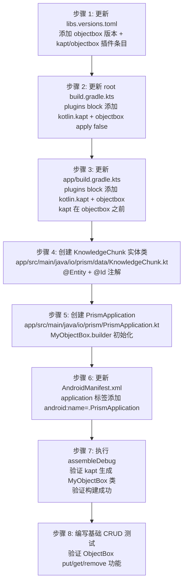
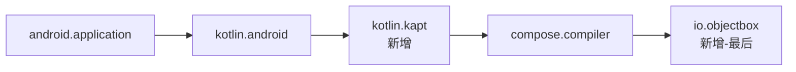

# 源码考古报告 —— US-002 ObjectBox 5.4.2 集成

| 项目 | 内容 |
|---|---|
| 执行 Agent | code-archaeologist |
| 任务令牌 | TKN-PRISM-ARCHAEOLOGY-003 |
| 考古日期 | 2026-08-02 |
| 考古目标 | Prism 项目（`d:\s0611\code\Prism`）—— US-002 ObjectBox 数据库集成 |
| 考古模式 | 简化版完整考古 |
| 上游决策 | [ADR-001 Prism 技术栈与架构选型](../decisions/ADR-001-prism-tech-stack.md) |
| 上游验证 | [US-001 M0 脚手架验收报告](2026-08-02-us001-m0-scaffold-acceptance.md) |
| 行为规则 | [docs/behavioral-rules.md](../behavioral-rules.md) BR-build-001/002/003 |
| 主 Agent 自问答复 | (1) 最没把握：ObjectBox 5.4.2 的 kapt 注解处理器与 Kotlin 2.1.0 + AGP 8.13.0 的兼容性——Context7 文档显示用 kotlin.kapt 插件，但 Kotlin 2.0+ 后 kapt 的维护状态（KSP 才是未来方向）让我担心构建期可能出问题。(2) 最大遗憾：M0 脚手架阶段没有预留 data 层的包结构（如 io.prism.data、io.prism.db），现在加 ObjectBox 需要从零规划。没意识到的是：ObjectBox 插件会自动生成 MyObjectBox 类，需要确认生成路径与 .gitignore 的关系 |

---

## 0. 执行摘要

本报告对 Prism 项目 M0 脚手架完成后的代码库进行源码考古，为 US-002（ObjectBox 5.4.2 数据库集成）提供集成点分析、风险清单和入门路径。

**核心结论**：ObjectBox 5.4.2 与 Prism 现有技术栈（AGP 8.13.0 + Kotlin 2.1.0 + compileSdk 34 + 阿里云镜像）**完全兼容**。ObjectBox 官方 README 明确提供了 AGP 8.13 及以下版本的配置方式，使用 `org.jetbrains.kotlin.kapt` 插件（而非 AGP 9.0+ 的 `com.android.legacy-kapt`）。ObjectBox 插件与 Compose Compiler 插件作用域不同，不冲突。阿里云镜像 content 过滤不影响 `io.objectbox` 组的依赖解析。

**关键发现**：
- ObjectBox 插件要求 AGP 8.1+ / Gradle 7.0+ / JDK 11+ / Android API 21+，Prism 全部满足
- ObjectBox 插件在 Maven Central 发布（非 Gradle Plugin Portal），Prism 的 `settings.gradle.kts` 已配置 `mavenCentral()`
- ObjectBox 插件自动添加核心依赖和配置注解处理器，无需手动添加 `implementation` 依赖
- kapt 在 Kotlin 2.x 处于维护模式（非首选，KSP 是推荐），但 ObjectBox 5.4.2 使用 kapt

---

## 1. 建立大图景

### 1.1 项目结构概览

证据来源：`Get-ChildItem -Recurse` 文件枚举

```text
Prism/
├── build.gradle.kts                    # Root 构建脚本（3 个插件声明，全 apply false）
├── settings.gradle.kts                 # 仓库配置（阿里云镜像 + 官方 fallback + content 过滤）
├── gradle/
│   ├── libs.versions.toml              # 版本目录（AGP 8.13.0 / Kotlin 2.1.0 / Compose BOM 2024.06.00）
│   └── wrapper/gradle-wrapper.properties  # Gradle 8.13
├── gradle.properties                   # JVM 2048m / AndroidX / parallel / caching
├── app/
│   ├── build.gradle.kts                # App 构建脚本（3 个插件 / compileSdk 34 / minSdk 26 / Java 17）
│   ├── proguard-rules.pro              # 空 ProGuard 规则
│   └── src/main/
│       ├── AndroidManifest.xml         # 无 Application subclass 声明
│       ├── java/io/prism/
│       │   └── MainActivity.kt         # 唯一源文件（显示 "Prism" 文本）
│       └── res/                        # 标准资源（launcher icon / strings / themes）
├── docs/                               # 文档治理体系（ADR / templates / reports）
└── scripts/consistency-check.js        # CI 一致性检查
```

### 1.2 现有构建配置

#### 1.2.1 版本目录（[libs.versions.toml](../../gradle/libs.versions.toml)）

| 类别 | 条目 | 版本 |
|---|---|---|
| [versions] | agp | 8.13.0 |
| [versions] | kotlin | 2.1.0 |
| [versions] | composeBom | 2024.06.00 |
| [versions] | coreKtx | 1.13.1 |
| [versions] | lifecycleRuntimeKtx | 2.8.3 |
| [versions] | activityCompose | 1.9.0 |
| [plugins] | android-application | com.android.application |
| [plugins] | kotlin-android | org.jetbrains.kotlin.android |
| [plugins] | compose-compiler | org.jetbrains.kotlin.plugin.compose |

> 证据来源：[libs.versions.toml:1-23](../../gradle/libs.versions.toml#L1-23)

#### 1.2.2 Root 构建脚本（[build.gradle.kts](../../build.gradle.kts)）

```kotlin
plugins {
    alias(libs.plugins.android.application) apply false
    alias(libs.plugins.kotlin.android) apply false
    alias(libs.plugins.compose.compiler) apply false
}
```

> 证据来源：[build.gradle.kts:1-6](../../build.gradle.kts#L1-6)

#### 1.2.3 App 构建脚本（[app/build.gradle.kts](../../app/build.gradle.kts)）

关键配置：
- namespace = "io.prism"
- compileSdk = 34 / buildToolsVersion = "36.1.0"
- minSdk = 26 / targetSdk = 34
- Java 17 / jvmTarget = "17"
- Compose enabled
- 无 kapt 插件 / 无 ObjectBox 插件 / 无测试框架

> 证据来源：[app/build.gradle.kts:1-54](../../app/build.gradle.kts#L1-54)

#### 1.2.4 仓库配置（[settings.gradle.kts](../../settings.gradle.kts)）

```text
pluginManagement:
  - 阿里云 gradle-plugin 镜像
  - 阿里云 google 镜像 (content: com.android.*/com.google.*/androidx.*)
  - 官方 google (content: com.android.*/com.google.*/androidx.*)
  - mavenCentral()
  - gradlePluginPortal()

dependencyResolutionManagement:
  - 阿里云 google 镜像 (content: com.android.*/com.google.*/androidx.*)
  - 阿里云 public 镜像 (content: 排除 com.android.*/androidx.*)
  - google()
  - mavenCentral()
  - FAIL_ON_PROJECT_REPOS
```

> 证据来源：[settings.gradle.kts:1-53](../../settings.gradle.kts#L1-53)

#### 1.2.5 Gradle 属性（[gradle.properties](../../gradle.properties)）

```properties
org.gradle.jvmargs=-Xmx2048m -Dfile.encoding=UTF-8
org.gradle.parallel=true
org.gradle.caching=true
android.useAndroidX=true
android.nonTransitiveRClass=true
kotlin.code.style=official
```

> 证据来源：[gradle.properties:1-10](../../gradle.properties#L1-10)

### 1.3 现有源码结构

| 文件 | 包名 | 职责 |
|---|---|---|
| [MainActivity.kt](../../app/src/main/java/io/prism/MainActivity.kt) | io.prism | M0 脚手架入口 Activity，显示 "Prism" 文本 |
| [AndroidManifest.xml](../../app/src/main/AndroidManifest.xml) | — | 无 `android:name` 声明（无 Application subclass） |

**关键观察**：
- 包结构为 `io.prism`，无子包（无 `data/`、`database/`、`domain/` 等分层目录）
- 无 Application subclass
- 无测试目录（`src/test/` 和 `src/androidTest/` 均不存在）
- 无 DI 框架

### 1.4 架构类型评估

当前为 M0 脚手架阶段，仅有单 Activity 显示文本，无分层架构。US-002 将引入数据层，是项目分层架构的首次实践。

---

## 2. ObjectBox 集成点分析

### 2.1 ObjectBox 兼容性验证

证据来源：[ObjectBox GitHub README](https://github.com/objectbox/objectbox-java#getting-started)（2026-08-02 抓取）

| 要求 | ObjectBox 最低版本 | Prism 实际值 | 结论 |
|---|---|---|---|
| Gradle | 7.0 | 8.13 | 满足 |
| Android Gradle Plugin | 8.1 | 8.13.0 | 满足 |
| JDK | 11 | 17 | 满足 |
| Android API | 21 (Android 5.0) | 26 (Android 8.0) | 满足 |
| Kotlin | 1.7 | 2.1.0 | 满足 |

### 2.2 kapt 插件配置方式（AGP 版本相关）

**关键发现**：ObjectBox 官方 README 明确区分了两种 kapt 插件配置方式：

| AGP 版本 | kapt 插件 ID | 版本引用 | 证据 |
|---|---|---|---|
| **AGP 9.0+** | `com.android.legacy-kapt` | `version.ref = "agp"` | ObjectBox README "Android Gradle Plugin 9.0 or newer" |
| **AGP 8.13-** | `org.jetbrains.kotlin.kapt` | `version.ref = "kotlin"` | ObjectBox README "Android Gradle Plugin 8.13 or older" |

**Prism 使用 AGP 8.13.0，必须使用**：
```toml
kotlin-kapt = { id = "org.jetbrains.kotlin.kapt", version.ref = "kotlin" }
```

> 注意：ADR-001 Context7 验证结论 "AGP 8.13- 用 kotlin.android + kotlin.kapt" 与此一致。

### 2.3 libs.versions.toml 需添加的条目

```toml
[versions]
# 新增
objectbox = "5.4.2"

[plugins]
# 新增
kotlin-kapt = { id = "org.jetbrains.kotlin.kapt", version.ref = "kotlin" }
objectbox = { id = "io.objectbox", version.ref = "objectbox" }
```

> 说明：
> - ObjectBox 插件 ID 为 `io.objectbox`，在 Maven Central 发布
> - ObjectBox 插件版本与运行时库版本一致（5.4.2）
> - kapt 插件版本跟随 Kotlin 版本（2.1.0）
> - 无需在 `[libraries]` section 添加 ObjectBox 运行时依赖——ObjectBox Gradle 插件会自动添加核心依赖

### 2.4 Root build.gradle.kts 插件声明

在 [build.gradle.kts](../../build.gradle.kts) 的 `plugins` block 中添加：

```kotlin
plugins {
    alias(libs.plugins.android.application) apply false
    alias(libs.plugins.kotlin.android) apply false
    alias(libs.plugins.kotlin.kapt) apply false        // 新增
    alias(libs.plugins.compose.compiler) apply false
    alias(libs.plugins.objectbox) apply false          // 新增
}
```

> 位置：`build.gradle.kts` 第 2-5 行的 plugins block

### 2.5 app/build.gradle.kts 插件应用

在 [app/build.gradle.kts](../../app/build.gradle.kts) 的 `plugins` block 中添加：

```kotlin
plugins {
    alias(libs.plugins.android.application)
    alias(libs.plugins.kotlin.android)
    alias(libs.plugins.kotlin.kapt)     // 新增——必须在 objectbox 之前
    alias(libs.plugins.compose.compiler)
    alias(libs.plugins.objectbox)       // 新增——最后应用（ObjectBox 官方要求）
}
```

> 关键约束：ObjectBox 官方文档明确要求 "apply the kapt and then the ObjectBox plugin after the Android application plugin"。kapt 必须在 ObjectBox 之前应用。
>
> 证据来源：ObjectBox GitHub README app/build.gradle.kts 示例

### 2.6 settings.gradle.kts 仓库配置验证

ObjectBox 要求 `pluginManagement` 和 `dependencyResolutionManagement` 中均有 `mavenCentral()`。

| 要求 | Prism 现状 | 结论 |
|---|---|---|
| pluginManagement 含 mavenCentral() | [settings.gradle.kts:23](../../settings.gradle.kts#L23) `mavenCentral()` | 已满足 |
| dependencyResolutionManagement 含 mavenCentral() | [settings.gradle.kts:48](../../settings.gradle.kts#L48) `mavenCentral()` | 已满足 |

**content 过滤影响分析**：

| 仓库 | content 过滤 | io.objectbox 组影响 |
|---|---|---|
| 阿里云 google 镜像 | `includeGroupByRegex("com\\.android.*")` 等 | 无影响——`io.objectbox` 不在包含列表，不会被从此仓库获取 |
| 阿里云 public 镜像 | `excludeGroupByRegex("com\\.android.*")` 等 | 无影响——`io.objectbox` 不在排除列表，可从此仓库获取 |
| 官方 google | `includeGroupByRegex("com\\.android.*")` 等 | 无影响 |
| mavenCentral() | 无过滤 | `io.objectbox` 插件和依赖从此仓库获取 |

> 结论：`io.objectbox` 组不在任何 `includeGroupByRegex`/`excludeGroupByRegex` 的 com.android.*/com.google.*/androidx.* 范围内，content 过滤不影响 ObjectBox 依赖解析。BR-build-003 要求的 content 过滤恰好保证了 AndroidX 依赖从 google 镜像获取，同时不阻塞 ObjectBox 从 mavenCentral/public 镜像获取。

### 2.7 KnowledgeChunk 实体包路径建议

| 方案 | 路径 | 优点 | 缺点 |
|---|---|---|---|
| **推荐** | `io.prism.data` | 与 ADR-001 数据层定位一致；通用性好；后续可放 Repository/DAO | 粒度较粗 |
| 备选 | `io.prism.database` | 语义明确 | 过于具体，限制后续扩展 |

**推荐方案**：`io.prism.data`

文件路径：`app/src/main/java/io/prism/data/KnowledgeChunk.kt`

实体类示例（基于 ObjectBox 官方 API）：

```kotlin
package io.prism.data

import io.objectbox.annotation.Entity
import io.objectbox.annotation.Id

@Entity
data class KnowledgeChunk(
    @Id var id: Long = 0,
    var content: String = "",
    var source: String = "",
    // 后续 US 可扩展：向量字段、元数据等
)
```

> 证据来源：ObjectBox GitHub README Android + Kotlin 示例（@Entity data class + @Id var id: Long = 0）

### 2.8 ObjectBox 初始化代码位置

**当前状态**：[AndroidManifest.xml](../../app/src/main/AndroidManifest.xml) 的 `<application>` 标签无 `android:name` 属性，即使用默认 `android.app.Application`。

**建议方案**：创建 `PrismApplication.kt`，在 `onCreate()` 中初始化 ObjectBox。

文件路径：`app/src/main/java/io/prism/PrismApplication.kt`

```kotlin
package io.prism

import android.app.Application
import io.objectbox.BoxStore
import io.prism.data.MyObjectBox   // kapt 生成的类

class PrismApplication : Application() {
    lateinit var boxStore: BoxStore
        private set

    override fun onCreate() {
        super.onCreate()
        boxStore = MyObjectBox.builder()
            .androidContext(this)
            .build()
    }
}
```

**同步修改 AndroidManifest.xml**：

```xml
<application
    android:name=".PrismApplication"
    android:allowBackup="false"
    ...>
```

> 注意：`MyObjectBox` 是 kapt 注解处理器在编译期自动生成的类，源码中不存在，首次构建后自动出现在 `build/generated/source/kapt/` 目录下。

**访问模式建议**（M0 阶段简单方案，后续 US 引入 DI 时重构）：

```kotlin
// 在 Activity/Service 中获取 BoxStore
val boxStore = (application as PrismApplication).boxStore
val box = boxStore.boxFor(KnowledgeChunk::class)
```

---

## 3. 风险清单

| 风险 ID | 风险描述 | 等级 | 证据 | 缓解措施 |
|---|---|---|---|---|
| RISK-001 | kapt 在 Kotlin 2.x 处于维护模式（maintenance mode），Kotlin 官方推荐 KSP | 中 | [Kotlin kapt 文档](https://kotlinlang.org/docs/kapt.html)："kapt is in maintenance mode. We are keeping it up-to-date... but have no plans to implement new features. Please use KSP." | ObjectBox 5.4.2 使用 kapt（Context7 验证），kapt 在 Kotlin 2.1.0 仍完全功能；后续 ObjectBox 若支持 KSP 可迁移；当前可接受为技术债 |
| RISK-002 | ObjectBox 6.0.0-beta 已发布（main 分支），5.4.2 非最新版本 | 低 | ObjectBox GitHub README 显示 version = "6.0.0-beta"；ADR-001 Context7 验证确认 5.4.2 为稳定版 | ADR-001 已锁定 5.4.2（P0 核心依赖严格版本控制）；6.0.0-beta 为 beta 版不适用于生产；后续评估 6.0.0 稳定版 |
| RISK-003 | ObjectBox 向量搜索功能可能需商业许可证 | 高 | ADR-001 风险表："ObjectBox 向量搜索功能可能需商业许可证，需向厂商确认" | US-002 范围为基础数据库集成（@Entity CRUD），不涉及向量搜索；向量搜索在后续 US 中评估；备选 sqlite-vec |
| RISK-004 | ObjectBox native 库（.so）增加 APK 体积约 3-8MB | 低 | ADR-001 提到 "<8MB binary" | M0 APK 为 8.65MB，加 ObjectBox 后预计 12-17MB，在可接受范围内；release 构建可启用 ABI splits 优化 |
| RISK-005 | ObjectBox 插件与 Compose Compiler 插件潜在冲突 | 低 | 两者插件 ID 不同（`io.objectbox` vs `org.jetbrains.kotlin.plugin.compose`），作用域不同（ObjectBox 处理实体注解/代码生成，Compose Compiler 处理 Compose 编译器） | 理论上不冲突；首次 `assembleDebug` 构建验证即可确认；ObjectBox 官方文档未提及与 Compose 的已知冲突 |
| RISK-006 | compileSdk 34 是否满足 ObjectBox 5.4.2 的传递依赖要求 | 低 | ObjectBox 支持 Android API 21+；ObjectBox 5.4.2 发布时 compileSdk 34 是主流 | 首次 `assembleDebug` 构建验证；若传递依赖要求 compileSdk 35+，需降级该传递依赖版本（类似 M0 AndroidX 降级策略） |
| RISK-007 | 阿里云镜像是否缓存了 io.objectbox 插件和依赖 | 低 | 阿里云 public 镜像代理 Maven Central；ObjectBox 在 Maven Central 发布 | 首次构建时从 mavenCentral() fallback 获取；阿里云镜像通常有 Maven Central 完整代理；若镜像缺失，fallback 机制保证可从官方 mavenCentral 获取 |
| RISK-008 | ObjectBox 插件自动添加的依赖可能与现有依赖版本冲突 | 低 | ObjectBox 插件自动添加 objectbox-android / objectbox-java 等核心依赖 | 首次 `assembleDebug` 构建验证；Gradle dependencies 检查报告；必要时使用 `resolutionStrategy` 强制版本 |
| RISK-009 | kapt 注解处理器首次执行可能较慢（生成 stub + 运行注解处理器） | 低 | kapt 机制：生成 Kotlin stub → 运行 Java 注解处理器 → 生成代码 | 仅首次构建较慢，后续增量构建有缓存；`org.gradle.caching=true` 已启用 |

---

## 4. 假设验证

| 假设 ID | 假设描述 | 验证方法 | 验证结果 |
|---|---|---|---|
| HYP-001 | ObjectBox 5.4.2 插件 ID 为 `io.objectbox` | ObjectBox GitHub README + ADR-001 Context7 验证 | **已确认**——README 示例 `objectbox = { id = "io.objectbox", version.ref = "objectbox" }` |
| HYP-002 | AGP 8.13.0 应使用 `org.jetbrains.kotlin.kapt` 而非 `com.android.legacy-kapt` | ObjectBox GitHub README AGP 版本区分 | **已确认**——README 明确："AGP 8.13 or older" 使用 `org.jetbrains.kotlin.kapt` |
| HYP-003 | ObjectBox 插件在 Maven Central 发布（非 Gradle Plugin Portal） | ObjectBox GitHub README + JitPack 页面 | **已确认**——README："ObjectBox tools and dependencies are available on the Maven Central repository" |
| HYP-004 | ObjectBox 插件自动添加核心依赖，无需手动 implementation | ObjectBox 官方文档步骤 5："Your project can now use ObjectBox" | **已确认**——官方文档无手动添加 implementation 步骤 |
| HYP-005 | ObjectBox 插件要求在 Android application 插件之后、kapt 之后应用 | ObjectBox GitHub README app/build.gradle.kts 示例 | **已确认**——README："apply the kapt and then the ObjectBox plugin after the Android application plugin" |
| HYP-006 | settings.gradle.kts 的 content 过滤不影响 io.objectbox 依赖解析 | 静态分析 content 过滤规则 | **已确认**——io.objectbox 不在 com.android.*/com.google.*/androidx.* 过滤范围内 |
| HYP-007 | ObjectBox 支持 minSdk 26 | ObjectBox GitHub README："Android 5.0 (API level 21) or newer" | **已确认**——26 >= 21 |
| HYP-008 | ObjectBox 5.4.2 与 Kotlin 2.1.0 兼容 | ObjectBox GitHub README："Kotlin 1.7 or newer" | **已确认**——2.1.0 >= 1.7 |
| HYP-009 | ObjectBox 插件与 Compose Compiler 插件不冲突 | 静态分析插件作用域 | **待动态验证**——理论分析不冲突，需首次构建确认 |

---

## 5. 入门路径

### 5.1 ObjectBox 集成推荐步骤顺序



### 5.2 需要特别注意的配置点

1. **kapt 插件必须在 ObjectBox 插件之前应用**——ObjectBox 官方明确要求。如果顺序错误，ObjectBox 插件可能无法正确注册注解处理器。

2. **kapt 插件 ID 必须是 `org.jetbrains.kotlin.kapt`**（不是 `com.android.legacy-kapt`）——后者是 AGP 9.0+ 的新插件，AGP 8.13.0 不支持。

3. **ObjectBox 插件版本引用 `objectbox` 版本变量**（5.4.2），而 kapt 插件版本引用 `kotlin` 版本变量（2.1.0）——不要混淆。

4. **无需手动添加 ObjectBox 运行时依赖**——ObjectBox Gradle 插件会自动添加 `io.objectbox:objectbox-android` 等核心依赖。手动添加可能导致版本冲突。

5. **`MyObjectBox` 类在首次构建后才生成**——IDE 可能报红（找不到 `MyObjectBox`），这是正常的。执行一次 `assembleDebug` 或 `kaptDebugKotlin` 后，生成的代码会出现在 `app/build/generated/source/kapt/debug/` 目录下。**该路径已被 `.gitignore` 的 `*/build/` 规则排除**（[.gitignore:4](../../.gitignore#L4)），不会误提交到版本控制，符合预期——kapt 生成代码属于构建产物，不应入库。主 Agent 自问答复 #2 关注的"MyObjectBox 生成路径与 .gitignore 的关系"由此验证：生成路径在 `build/` 下，已被正确忽略，无需额外配置 `.gitignore`。

6. **AndroidManifest.xml 必须声明 Application subclass**——不声明则 ObjectBox 不会初始化，运行时访问 `boxStore` 会抛出 `UninitializedPropertyAccessException`。

7. **proguard-rules.pro 需补充 ObjectBox 混淆规则**——ObjectBox 官方提供 consumer rules（通常自动应用），但 release 构建需验证混淆不影响实体类。当前 [proguard-rules.pro](../../app/proguard-rules.pro) 为空，ObjectBox 插件应自动注入 consumer rules。

### 5.3 集成后的验证清单

| 验证项 | 验证方法 | 预期结果 |
|---|---|---|
| kapt 注解处理器执行 | `./gradlew assembleDebug` 构建日志 | 出现 `kaptDebugKotlin` task 且无错误 |
| MyObjectBox 代码生成 | 检查 `app/build/generated/source/kapt/debug/io/prism/data/` | 存在 `MyObjectBox.java` 文件 |
| 构建成功 | `./gradlew assembleDebug` | BUILD SUCCESSFUL |
| APK 体积 | 检查 `app/build/outputs/apk/debug/app-debug.apk` 大小 | 预计 12-17MB（M0 基线 8.65MB + ObjectBox native ~3-8MB） |
| ObjectBox native 库打包 | `jar tf app-debug.apk \| findstr lib/` | 存在 `lib/arm64-v8a/libobjectbox.so` 等 native 库 |
| Application 初始化 | APK aapt2 xmltree 检查 Manifest | `android:name` = `.PrismApplication` |
| lint 无新增 error | `./gradlew lintDebug` | 0 errors（warnings 可接受） |

---

## 6. 架构图

### 6.1 ObjectBox 集成后的模块依赖图

```mermaid
graph TB
    subgraph "Prism App (io.prism)"
        MA[MainActivity.kt<br/>io.prism]
        PA[PrismApplication.kt<br/>io.prism<br/>新增]
    end

    subgraph "Data Layer (io.prism.data) 新增"
        KC[KnowledgeChunk.kt<br/>@Entity]
        MOB[MyObjectBox.java<br/>kapt 生成]
    end

    subgraph "ObjectBox Runtime"
        BS[BoxStore]
        BOX[Box&lt;KnowledgeChunk&gt;]
    end

    subgraph "Build Plugins"
        AGP[com.android.application<br/>8.13.0]
        KT[org.jetbrains.kotlin.android<br/>2.1.0]
        KAPT[org.jetbrains.kotlin.kapt<br/>2.1.0 新增]
        CC[org.jetbrains.kotlin.plugin.compose<br/>2.1.0]
        OB[io.objectbox<br/>5.4.2 新增]
    end

    PA -->|初始化| BS
    BS -->|boxFor| BOX
    BOX -->|CRUD| KC
    KAPT -->|生成| MOB
    MOB -->|builder| BS
    OB -->|配置| KAPT

    MA -->|application as| PA
```

### 6.2 构建插件应用顺序



> 顺序约束来源：ObjectBox 官方要求 "apply the kapt and then the ObjectBox plugin after the Android application plugin"

---

## 7. 结论与建议

### 7.1 集成可行性结论

ObjectBox 5.4.2 与 Prism 现有技术栈**完全兼容**，可放心集成。所有前置条件已满足：

| 维度 | 结论 | 依据 |
|---|---|---|
| AGP 兼容性 | 满足（8.13.0 >= 8.1） | ObjectBox GitHub README |
| Gradle 兼容性 | 满足（8.13 >= 7.0） | ObjectBox GitHub README |
| Kotlin 兼容性 | 满足（2.1.0 >= 1.7） | ObjectBox GitHub README |
| compileSdk 兼容性 | 满足（34 >= 21 最低要求） | ObjectBox GitHub README |
| minSdk 兼容性 | 满足（26 >= 21） | ObjectBox GitHub README |
| JDK 兼容性 | 满足（17 >= 11） | ObjectBox GitHub README |
| 仓库配置 | 满足（mavenCentral 已配置） | settings.gradle.kts |
| 镜像兼容性 | 满足（content 过滤不影响 io.objectbox） | 静态分析 |
| 插件冲突 | 无冲突预期（作用域不同） | 静态分析 |

### 7.2 风险评估

**无需阻断的风险**：所有风险均为低/中等级，可通过首次构建验证消除。唯一的高等级风险（RISK-003 向量搜索许可证）不在 US-002 范围内。

**建议关注的验证点**：
1. 首次 `assembleDebug` 构建——验证 kapt 执行 + MyObjectBox 生成 + 构建成功
2. APK 体积——确认 ObjectBox native 库大小在可接受范围
3. lint 检查——确认无新增 error

### 7.3 技术债记录

| 技术债 | 来源 | 缓解计划 |
|---|---|---|
| kapt 维护模式（非 KSP） | ObjectBox 5.4.2 使用 kapt | 后续 ObjectBox 支持 KSP 后迁移 |
| ObjectBox 5.4.2 非最新（6.0.0-beta 已发布） | ADR-001 锁定稳定版 | 6.0.0 稳定版发布后评估升级 |
| PrismApplication 单例访问 BoxStore | M0 阶段无 DI 框架 | 后续 US 引入 DI（Hilt/Koin）时重构 |
| 无测试框架 | M0 脚手架无测试目录 | US-002 应同步建立测试框架 |

### 7.4 对主 Agent 的建议

1. **按 5.1 步骤顺序执行**——顺序错误可能导致构建失败
2. **首次构建后检查 `app/build/generated/source/kapt/` 目录**——确认 MyObjectBox 已生成
3. **若构建失败，首先检查 kapt 插件顺序和 ID**——这是最常见的问题
4. **提交 PRD 验收时附带构建日志和 APK 检查报告**——证明 ObjectBox 集成成功
5. **更新 README.md 文档索引**——引用本考古报告

---

## 8. 参考

- [ObjectBox GitHub README](https://github.com/objectbox/objectbox-java#getting-started)（2026-08-02 抓取）
- [ObjectBox Getting Started 文档](https://docs.objectbox.io/getting-started)
- [Kotlin kapt 文档](https://kotlinlang.org/docs/kapt.html)
- [ADR-001 Prism 技术栈与架构选型](../decisions/ADR-001-prism-tech-stack.md)
- [US-001 M0 脚手架验收报告](2026-08-02-us001-m0-scaffold-acceptance.md)
