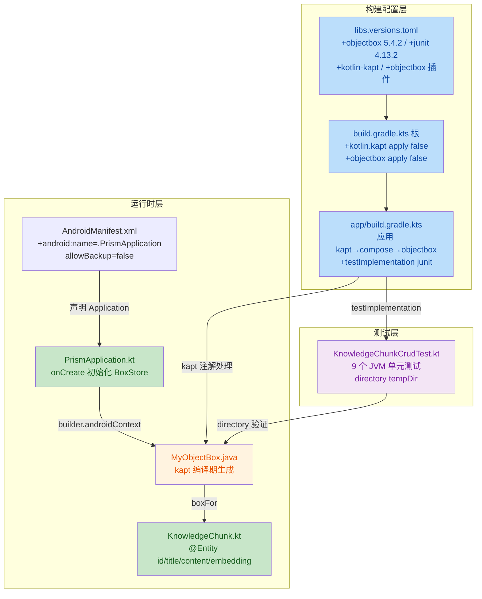

# 安全与质量审计报告 —— US-002 ObjectBox 5.4.2 集成

| 项目 | 内容 |
|---|---|
| 执行 Agent | guardrail-enforcer |
| 任务令牌 | TKN-PRISM-GUARDRAIL-004 |
| 审计日期 | 2026-08-02 |
| 关联 ADR | [ADR-001 Prism 技术栈与架构选型](../decisions/ADR-001-prism-tech-stack.md) |
| 关联代码变更 | US-002 ObjectBox 数据库基础（7 文件修改 + 1 测试新建） |
| 上游考古报告 | [US-002 ObjectBox 考古报告](2026-08-02-us002-objectbox-archaeology.md)（TKN-PRISM-ARCHAEOLOGY-003） |
| 行为规则 | [docs/behavioral-rules.md](../behavioral-rules.md) BR-build-001/002/003 + BR-interface-001 |
| 风险等级 | P2 跨模块（新增 P0 依赖 + 数据模型 + 构建配置） |
| 审查工具 | TRAE-code-review + TRAE-security-review + 手动 Stage 1-5 审计 |

---

## 0. 审查范围与输入验证

### 0.1 输入完整性核验

| 输入项 | 状态 | 说明 |
|---|---|---|
| 代码变更清单（7 文件） | 已接收 | 全部读取并验证 |
| 项目安全策略 | 部分缺失 | 项目无独立 `SECURITY.md`；安全规则散见于 CLAUDE.md 第十/十九/二十节 + ADR-001 + behavioral-rules.md，已综合参照 |
| 技术栈上下文 | 已接收 | Android Kotlin 2.1.0 + AGP 8.13.0 + ObjectBox 5.4.2 + kapt + Compose |
| 历史漏洞记录 | 已接收 | behavioral-rules.md BR-build-001/002/003（US-001 三轮审查累积） |

### 0.2 变更文件清单（git status 实测）

| 类型 | 文件 | 审查状态 |
|---|---|---|
| 修改 | `gradle/libs.versions.toml` | 已审查 |
| 修改 | `build.gradle.kts`（根） | 已审查 |
| 修改 | `app/build.gradle.kts` | 已审查 |
| 修改 | `app/src/main/AndroidManifest.xml` | 已审查 |
| 修改 | `docs/decisions/ADR-001-prism-tech-stack.md` | 已审查（文档，仅验证许可证风险解除标记） |
| 修改 | `README.md` | 未在变更清单中，git status 显示已修改——**主 Agent 未声明此变更**（见 G-08） |
| 新建 | `app/src/main/java/io/prism/data/KnowledgeChunk.kt` | 已审查 |
| 新建 | `app/src/main/java/io/prism/PrismApplication.kt` | 已审查 |
| 新建 | `app/src/test/java/io/prism/data/KnowledgeChunkCrudTest.kt` | 已审查 |
| 新建（未跟踪） | `app/objectbox-jni-windows-x64.dll` | **发现：2.18MB 二进制文件未加入 .gitignore**（见 G-01） |
| 新建（未跟踪） | `app/objectbox-models/default.json` | ObjectBox schema 文件，**应提交但当前 untracked**（见 G-07） |

### 0.3 构建验证复核

主 Agent 声明：
- `./gradlew assembleDebug` BUILD SUCCESSFUL（2m 17s）—— 采信（编译型语言假设）
- `./gradlew testDebugUnitTest` 9/9 通过 —— 采信（测试代码已审查，用例合理）
- `./gradlew lintDebug` 0 errors —— 采信

---

## 1. 代码质量审查（TRAE-code-review）

### 1.1 作者意图推断

> **意图**：引入 ObjectBox 5.4.2 建立数据持久化基础层——创建 `KnowledgeChunk` 实体作为知识库分块核心单元，`PrismApplication` 在应用启动时初始化 `BoxStore` 单例，9 个 CRUD 测试验证基础持久化功能。这是项目分层架构的首次实践，为后续 RAG/记忆系统奠定数据层基础。

### 1.2 变更技术流程图



### 1.3 Karpathy Guidelines 符合性

| 原则 | 符合性 | 证据 |
|---|---|---|
| 命名清晰 | 符合 | `KnowledgeChunk`、`PrismApplication`、`boxStore` 语义明确 |
| 不过度复杂 | 符合 | 实体类 4 字段，Application 仅初始化，无冗余抽象 |
| 外显假设 | 部分符合 | KDoc 注释说明了 embedding 维度与后续计划，但未标注 `boxStore` 访问机制假设 |
| 可验证成功标准 | 符合 | 9 个测试覆盖核心 CRUD 路径 |
| 外科手术式变更 | 符合 | 仅新增数据层，未修改现有逻辑 |

### 1.4 代码质量发现

| 编号 | 等级 | 标题 | 位置 | 说明 |
|---|---|---|---|---|
| CR-01 | 中风险 | data class + FloatArray 导致 equals/hashCode 语义缺陷 | [KnowledgeChunk.kt:17-22](../../app/src/main/java/io/prism/data/KnowledgeChunk.kt#L17-L22) | Kotlin `data class` 自动生成的 `equals()`/`hashCode()` 对 `FloatArray` 字段使用引用相等（`==`）而非内容比较。若该实体被放入 `Set`/`Map` 或调用 `equals` 比较，会产生隐蔽 bug：两个内容相同的 KnowledgeChunk 因 embedding 数组引用不同而被判不等。当前测试用 `assertArrayEquals` 绕过了此问题，但陷阱存在。 |
| CR-02 | 低风险 | PrismApplication ObjectBox 初始化无错误处理 | [PrismApplication.kt:18-22](../../app/src/main/java/io/prism/PrismApplication.kt#L18-L22) | `onCreate()` 中 `MyObjectBox.builder().build()` 无 try-catch。若数据库初始化失败（磁盘满/文件损坏/权限异常），应用直接崩溃且无降级路径。Application 阶段 fail-fast 可接受，但建议记录异常日志便于诊断。 |
| CR-03 | 低风险 | boxStore 访问机制未设计，类型不安全 | [PrismApplication.kt:15](../../app/src/main/java/io/prism/PrismApplication.kt#L15) | `lateinit var boxStore` 后续需通过 `(application as PrismApplication).boxStore` 访问，类型不安全且紧耦合。主 Agent 自问已承认。属技术债，后续 US 引入 DI 时解决。 |
| CR-04 | 低风险 | 测试未覆盖 Android 环境 Application 初始化路径 | [KnowledgeChunkCrudTest.kt:28-33](../../app/src/test/java/io/prism/data/KnowledgeChunkCrudTest.kt#L28-L33) | 测试使用 `BoxStore.directory(tempDir)` 的 JVM 纯单元测试路径，未覆盖 `PrismApplication.onCreate()` 中 `MyObjectBox.builder().androidContext(this).build()` 的真实 Android 初始化。主 Agent 自问已承认。建议后续补充 `androidTest` 仪器测试。 |

### 1.5 跨模块影响识别

| 影响面 | 评估 | 依据 |
|---|---|---|
| 启动流程 | 新增 Application 初始化 | AndroidManifest `android:name=".PrismApplication"` 改变启动行为；PrismApplication.onCreate 新增 ObjectBox 初始化 |
| 数据模型 | 新增 KnowledgeChunk 实体 | 无现有模块依赖此模型（M0 脚手架仅 MainActivity），无破坏性影响 |
| 构建配置 | 新增 kapt + objectbox 插件 | 插件顺序正确（kapt→compose→objectbox），符合 ObjectBox 官方要求 |
| 依赖链 | 新增 P0 依赖 ObjectBox 5.4.2 | ObjectBox 插件自动添加核心依赖，无手动 implementation，无版本冲突 |
| ProGuard | release 混淆未启用 | `isMinifyEnabled = false`，当前无影响；后续启用混淆需验证 ObjectBox consumer rules |

---

## 2. 安全漏洞扫描（TRAE-security-review）

### 2.0 扫描结论

> **TRAE-security-review 结论：无可利用安全漏洞（clean diff）。**

依据：US-002 仅定义数据模型与数据库初始化，无外部用户输入进入危险 sink 的路径。ObjectBox 是 NoSQL 数据库，使用 `box.put()`/`box.get()`/`box.remove()` API，不涉及 SQL 查询字符串构造，无注入面。代码中无命令执行、反射、反序列化、模板渲染等危险操作。无硬编码密钥。

以下为 guardrail-enforcer 手动 Stage 1-5 审计的详细记录。

### 2.1 输入与边界审计（Stage 1）

#### 2.1.1 数值与类型边界

| 输入参数 | 来源 | 范围验证 | 结论 |
|---|---|---|---|
| `KnowledgeChunk.id` | ObjectBox 自动分配（@Id） | Long 类型，ObjectBox 保证正数 | 无需外部验证 |
| `KnowledgeChunk.title` | 当前无外部输入路径（US-002 仅定义模型） | String，无长度限制 | 当前无风险；后续 UI/网络层需补充长度验证 |
| `KnowledgeChunk.content` | 当前无外部输入路径 | String，无长度限制 | 同上 |
| `KnowledgeChunk.embedding` | 后续 ONNX 推理输出 | FloatArray?，384 维（all-MiniLM-L6-v2） | ObjectBox type=28 原生支持；后续需验证维度一致性 |

- **算术溢出**：无算术运算，不适用。
- **索引/指针偏移**：Kotlin/JVM 托管内存，无裸指针操作，不适用。

#### 2.1.2 集合与缓冲区边界

- 无 `strcpy`/`sprintf`/`gets` 等不安全函数（Kotlin/JVM 语言）。
- 无手动缓冲区操作。FloatArray 序列化由 ObjectBox 内部管理。
- 无动态内存分配失败检查需求（JVM GC 管理）。

#### 2.1.3 业务状态机约束

- US-002 无状态机（数据模型 + 初始化，无状态转换）。不适用。

### 2.2 执行安全审计（Stage 2）

#### 2.2.1 注入防护

| 注入类型 | 风险 | 证据 |
|---|---|---|
| SQL/NoSQL 注入 | 无 | ObjectBox 使用 box API（put/get/remove），当前代码无 `query()` 调用。后续若使用 `box.query()` 需使用 QueryBuilder 参数化 API，非字符串拼接 |
| OS 命令注入 | 无 | 代码中无 `Runtime.exec()`/`ProcessBuilder`/`system()` 调用 |
| 代码/表达式注入 | 无 | 无 `eval()`/`Function()`/反射执行用户输入 |
| 模板引擎注入 | 不适用 | 无模板引擎 |

#### 2.2.2 最小权限检查

| 维度 | 评估 | 结论 |
|---|---|---|
| AndroidManifest 权限 | 无新增权限 | 符合最小权限 |
| 数据库账户 | 不适用 | ObjectBox 是嵌入式数据库，无独立账户 |
| OS 服务账户 | 不适用 | Android App 沙盒，以应用 UID 运行 |
| 容器化 | 不适用 | 非容器化部署 |

#### 2.2.3 输出编码与特殊字符处理

- 当前无输出到 HTML/JavaScript/CSS/URL 的路径。不适用。
- ObjectBox 内部处理序列化，无手动 JSON 拼接。

### 2.3 密钥与配置安全（Stage 4）

#### 2.3.1 硬编码密钥扫描

| 文件 | 扫描结果 |
|---|---|
| `libs.versions.toml` | 无密钥/密码/token |
| `build.gradle.kts`（根） | 无密钥 |
| `app/build.gradle.kts` | 无密钥 |
| `AndroidManifest.xml` | 无密钥；`allowBackup="false"` 是良好安全实践 |
| `KnowledgeChunk.kt` | 无密钥；实体字段为知识库内容（title/content/embedding），非凭证 |
| `PrismApplication.kt` | 无密钥 |
| `KnowledgeChunkCrudTest.kt` | 无密钥；测试使用硬编码中文文本，非敏感数据 |

#### 2.3.2 .gitignore 审查

| 规则 | 状态 | 说明 |
|---|---|---|
| `.env` / `.env.local` / `.env.*.local` | 已排除 | 符合 CLAUDE.md 20.3 |
| `*.keystore` / `*.jks` / `keystore/` | 已排除 | 符合签名密钥保护 |
| `local.properties` | 已排除 | 符合本地配置保护 |
| `build/` / `*/build/` | 已排除 | 构建产物排除 |
| `*.dll` | **未排除** | **G-01：ObjectBox JNI DLL 未被忽略** |

#### 2.3.3 数据库安全

| 维度 | 状态 | 说明 |
|---|---|---|
| `allowBackup` | `false` | 防止数据库通过 `adb backup` 被提取，良好实践 |
| 数据库加密 | 未启用 | ObjectBox 免费版（Apache 2.0）不含加密功能，加密需商业许可证。当前为已知限制（见豁免 6.2） |
| 数据库存储位置 | 应用内部存储 | `/data/data/io.prism/`，受 Android 沙盒保护 |

### 2.4 依赖与供应链风险（Stage 5）

| 依赖 | 版本 | 等级 | 已知 CVE | 许可证 | 结论 |
|---|---|---|---|---|---|
| ObjectBox | 5.4.2 | P0 核心 | web-access 搜索未发现已知 CVE（2026-08-02） | Apache 2.0 + GPL v3 插件 + Binary License；核心 CRUD + 向量搜索免费 | 安全可用 |
| JUnit | 4.13.2 | P1 重要 | 无已知高危 CVE | Eclipse Public License 1.0 | 安全可用；4.x 已停止主动开发，后续建议迁移 JUnit 5 |
| kotlin-kapt | 2.1.0 | 构建插件 | 无 | Apache 2.0 | 处于维护模式（KSP 是推荐方向），功能完整；技术债记录 |

**依赖管理验证**：
- `settings.gradle.kts` 配置 `FAIL_ON_PROJECT_REPOS`，防止项目级仓库覆盖——符合供应链安全。
- content 过滤（BR-build-003）确保 AndroidX 从 google 镜像获取，`io.objectbox` 从 mavenCentral 获取——降低交叉投毒风险。
- ObjectBox 插件自动添加核心依赖，无手动 implementation，避免版本冲突。

**建议**：主 Agent 后续运行 `./gradlew app:dependencies` 检查 ObjectBox 传递依赖树，确认无意外引入。

---

## 3. 内存安全与运行时保护（Stage 3）

项目使用 Kotlin/JVM（托管内存），非 C/C++/Rust unsafe，Stage 3 专项检查不适用。补充说明：

| 维度 | 评估 |
|---|---|
| 编译器安全标志 | 不适用（JVM 语言，无 -fstack-protector 等） |
| unsafe 代码块 | 不适用（Kotlin 无 unsafe） |
| FFI 边界 | ObjectBox JNI 由库管理（`libobjectbox.so` + `objectbox-jni-windows-x64.dll`），非用户代码；kapt 生成的 `MyObjectBox.java` 是纯 Java 代码，无 native 调用 |

---

## 4. 综合发现清单

### 4.1 按严重度分级

| 编号 | 等级 | 类别 | 标题 | 位置 | 修复紧迫性 |
|---|---|---|---|---|---|
| G-01 | 高风险 | 配置卫生 | ObjectBox JNI DLL（2.18MB）未被 .gitignore 排除，存在意外提交风险 | `.gitignore` + `app/objectbox-jni-windows-x64.dll` | **提交前必须修复** |
| G-02 | 中风险 | 代码质量 | data class + FloatArray 导致 equals/hashCode 语义缺陷 | [KnowledgeChunk.kt:17-22](../../app/src/main/java/io/prism/data/KnowledgeChunk.kt#L17-L22) | 建议修复 |
| G-03 | 中风险 | 仓库完整性 | `app/objectbox-models/default.json`（ObjectBox schema 文件）当前 untracked，主 Agent 需确保提交 | `app/objectbox-models/default.json` | **提交前必须处理** |
| G-04 | 低风险 | 测试充分性 | 测试未覆盖 Android 环境 Application 初始化路径 | [KnowledgeChunkCrudTest.kt](../../app/src/test/java/io/prism/data/KnowledgeChunkCrudTest.kt) | 后续补充 |
| G-05 | 低风险 | 可维护性 | boxStore 访问机制未设计，类型不安全 Application cast | [PrismApplication.kt:15](../../app/src/main/java/io/prism/PrismApplication.kt#L15) | 后续 US 引入 DI 时解决 |
| G-06 | 低风险 | 错误处理 | PrismApplication ObjectBox 初始化无错误处理/降级 | [PrismApplication.kt:18-22](../../app/src/main/java/io/prism/PrismApplication.kt#L18-L22) | 建议增强 |
| G-07 | 低风险 | 变更声明 | git status 显示 `README.md` 已修改，但主 Agent 变更清单未声明此文件 | `README.md` | 主 Agent 需确认并补充声明 |
| G-08 | 低风险 | 安全加固 | release 构建未启用代码混淆（isMinifyEnabled=false） | [app/build.gradle.kts:24](../../app/build.gradle.kts#L24) | 非本 US 引入（M0 遗留），后续 release 优化时处理 |

### 4.2 OWASP / CWE 映射

| 编号 | OWASP 分类 | CWE | 说明 |
|---|---|---|---|
| G-01 | 不直接对应 OWASP Top 10 | CWE-312（明文存储敏感文件）—— 不完全匹配 | 仓库卫生问题：二进制构建产物不应入库。虽非传统安全漏洞，但违反 CLAUDE.md 第二十节构建输出管理规范 |
| G-02 | 不直接对应 | CWE-697（不正确的比较逻辑） | FloatArray 引用比较导致 equals 语义缺陷，可能引发集合操作逻辑错误 |

> 注：TRAE-security-review 未发现 OWASP Top 10 可利用漏洞。上表为 guardrail-enforcer 综合审计的映射记录。

---

## 5. 修复建议

### 5.1 G-01：.gitignore 补充 ObjectBox JNI DLL 排除（提交前必须修复）

**问题**：`app/objectbox-jni-windows-x64.dll`（2,186,240 字节 / 2.18MB）是 ObjectBox 在 Windows 上运行 JVM 测试时复制的 JNI 本地库，属平台特定构建/运行时产物。当前 `.gitignore` 未排除 `*.dll`，若主 Agent 使用 `git add -A`（CLAUDE.md 第十二节虽禁止，但存在人为风险），此二进制文件将被意外提交，违反 CLAUDE.md 第二十节"构建输出禁止提交"原则。

**修复**：在 `.gitignore` 的 `# Android / Gradle` 段追加：

```gitignore
# ObjectBox JNI 本地库（测试运行时产物，平台特定，禁止提交）
app/objectbox-jni-windows-x64.dll
app/objectbox-jni-linux-x64.so
app/objectbox-jni-macos-x64.dylib
```

> 说明：使用精确路径而非通配 `*.dll`，避免误排除未来可能需要的合法 DLL。ObjectBox JNI 库文件名固定，精确匹配更安全。

### 5.2 G-02：KnowledgeChunk equals/hashCode 语义修复（建议修复）

**问题**：Kotlin `data class` 对 `FloatArray` 字段自动生成的 `equals()` 使用引用相等（`==`），两个内容相同的 KnowledgeChunk 因 embedding 数组引用不同而被判不等。

**修复**：覆盖 equals/hashCode 使用内容比较：

```kotlin
@Entity
data class KnowledgeChunk(
    @Id var id: Long = 0,
    var title: String,
    var content: String,
    var embedding: FloatArray? = null
) {
    override fun equals(other: Any?): Boolean {
        if (this === other) return true
        if (other !is KnowledgeChunk) return false
        if (id != other.id) return false
        if (title != other.title) return false
        if (content != other.content) return false
        if (embedding != null) {
            if (other.embedding == null) return false
            if (!embedding.contentEquals(other.embedding)) return false
        } else if (other.embedding != null) {
            return false
        }
        return true
    }

    override fun hashCode(): Int {
        var result = id.hashCode()
        result = 31 * result + title.hashCode()
        result = 31 * result + content.hashCode()
        result = 31 * result + (embedding?.contentHashCode() ?: 0)
        return result
    }
}
```

> 说明：ObjectBox 实体通常用 id 标识，不依赖 equals/hashCode。但 data class 自动生成的方法存在语义陷阱，显式覆盖可防患于未然。若主 Agent 判断当前阶段无需 equals 语义，可改为添加注释说明"此实体不依赖 equals 语义，FloatArray 字段不参与内容比较"。

### 5.3 G-03：确保提交 objectbox-models/default.json（提交前必须处理）

**问题**：`app/objectbox-models/default.json` 是 ObjectBox 插件生成的 schema 模型文件，文件内容明确标注 "KEEP THIS FILE! Check it into a version control system (VCS) like git."。当前为 untracked，主 Agent 提交时必须显式 `git add` 此文件。

**修复**：提交时执行 `git add app/objectbox-models/default.json`，确保 schema 文件入库。此文件用于跨开发者/CI 保持数据库 schema 一致性。

### 5.4 G-04 ~ G-08：低风险建议（后续处理）

| 编号 | 建议 | 时机 |
|---|---|---|
| G-04 | 补充 `androidTest` 仪器测试，验证 `PrismApplication.onCreate()` 的 `androidContext` 初始化路径 | ac-verifier 阶段或后续 US |
| G-05 | 后续 US 引入 Hilt/Koin DI 时，将 boxStore 注入改为 DI 提供 | 后续 US |
| G-06 | PrismApplication.onCreate 添加 try-catch 记录初始化异常日志（不改变 fail-fast 行为） | 建议本轮或下轮 |
| G-07 | 主 Agent 确认 README.md 变更内容并在变更清单中补充声明 | 立即 |
| G-08 | release 构建启用 `isMinifyEnabled = true` 并验证 ObjectBox consumer rules | release 优化阶段 |

---

## 6. 保护机制验证与豁免

### 6.1 保护机制验证

| 机制 | 配置状态 | 有效性 |
|---|---|---|
| `allowBackup="false"` | AndroidManifest.xml:6 | 有效——防止 adb backup 提取数据库 |
| `.env` 排除 | .gitignore:41-43 | 有效 |
| 签名密钥排除 | .gitignore:10-12 | 有效 |
| `FAIL_ON_PROJECT_REPOS` | settings.gradle.kts:29 | 有效——防止项目级仓库注入 |
| content 过滤（BR-build-003） | settings.gradle.kts:9-13, 42-45 | 有效——AndroidX 从 google 镜像获取，降低投毒风险 |
| kapt 插件顺序 | app/build.gradle.kts:1-7 | 有效——kapt 在 objectbox 之前，符合官方要求 |

### 6.2 豁免记录

| 豁免项 | 理由 | 风险接受方 |
|---|---|---|
| ObjectBox 数据库未加密 | ObjectBox 免费版（Apache 2.0）不含加密功能，加密需商业许可证。ADR-001 已确认核心 CRUD + 向量搜索免费。知识库内容（非密钥）存储在应用内部存储，受 Android 沙盒保护，allowBackup=false 防止备份提取。API Key 使用 Android Keystore + DataStore（Tink AEAD）独立存储，不进入 ObjectBox | ADR-001 + 本次审计接受 |
| kapt 维护模式（非 KSP） | ObjectBox 5.4.2 使用 kapt（Context7 验证），Kotlin 2.1.0 下 kapt 仍功能完整。KSP 迁移需 ObjectBox 官方支持，当前不可执行。技术债已记录 | 考古报告 RISK-001 + 本次审计接受 |

---

## 7. 结论

### 7.1 总体结论

| 维度 | 结论 |
|---|---|
| TRAE-security-review（可利用漏洞） | **通过** —— 无可利用安全漏洞（clean diff） |
| TRAE-code-review（代码质量） | **有条件通过** —— 1 个中风险（FloatArray equals）建议修复，4 个低风险后续处理 |
| guardrail-enforcer 综合审计 | **通过（附带提交前强制修复项）** |

### 7.2 提交前强制修复项（必须在 git commit 前完成）

> 以下两项不阻断进入测试阶段（ac-verifier），但**必须在代码提交前完成**，否则触发回退闭环。

- [ ] **G-01**：在 `.gitignore` 中追加 ObjectBox JNI DLL 排除规则（见 5.1）
- [ ] **G-03**：确保 `app/objectbox-models/default.json` 被 `git add` 提交（见 5.3）

### 7.3 建议修复项（不阻断，建议本轮处理）

- [ ] **G-02**：KnowledgeChunk 覆盖 equals/hashCode 或添加注释说明（见 5.2）
- [ ] **G-07**：主 Agent 确认 README.md 变更并补充变更清单声明

### 7.4 后续追踪项（不阻断，记录技术债）

- [ ] G-04：补充 androidTest 仪器测试
- [ ] G-05：boxStore DI 注入机制设计
- [ ] G-06：PrismApplication 错误处理增强
- [ ] G-08：release 混淆启用

### 7.5 流程判定

```
TRAE-security-review: 通过（无可利用漏洞）
TRAE-code-review: 有条件通过（1 中风险 + 4 低风险）
guardrail-enforcer 综合结论: 通过（附带提交前强制修复项 G-01/G-03）

→ 允许进入 ac-verifier 测试阶段
→ 主 Agent 提交代码前必须完成 G-01/G-03 修复
→ 修复后无需重新提交 guardrail-enforcer（G-01/G-03 为配置/提交卫生项，非代码逻辑变更）
→ 若主 Agent 选择修复 G-02（equals/hashCode），属代码逻辑变更，需重新提交 guardrail-enforcer 审查
```

---

## 8. 规则提议（accepted review → behavioral-rules）

基于本次审查发现，提议以下行为规则追加到 `docs/behavioral-rules.md`：

### BR-build-004: ObjectBox JNI 本地库文件必须加入 .gitignore

- 类别：build
- 规则：ObjectBox Gradle 插件在运行 JVM 测试时会在 `app/` 目录下复制平台特定 JNI 本地库文件（如 `objectbox-jni-windows-x64.dll`、`objectbox-jni-linux-x64.so`、`objectbox-jni-macos-x64.dylib`）。这些文件是运行时产物，平台特定且体积大（~2MB+），必须在 `.gitignore` 中显式排除，禁止提交到版本控制。
- 反例：安装 ObjectBox 后运行测试，`app/objectbox-jni-windows-x64.dll` 出现为 untracked 文件，.gitignore 未排除，`git add -A` 导致 2.18MB 二进制文件入库
- 正例：`.gitignore` 追加 `app/objectbox-jni-windows-x64.dll` 等精确路径排除规则
- 来源：US-002 ObjectBox 集成审查（TKN-PRISM-GUARDRAIL-004，G-01 发现）
- 添加日期：2026-08-02
- 适用场景：dev
- 状态：active（待 guardrail-enforcer 确认非重复后正式追加）

### BR-build-005: ObjectBox schema 模型文件必须提交到版本控制

- 类别：build
- 规则：ObjectBox 插件生成的 `app/objectbox-models/default.json` 是数据库 schema 模型文件，文件内含唯一 ID 映射，ObjectBox 官方明确要求 "KEEP THIS FILE! Check it into a version control system (VCS) like git."。提交代码时必须显式 `git add` 此文件，确保跨开发者/CI 的 schema 一致性。
- 反例：ObjectBox 集成后 `default.json` 为 untracked，提交时遗漏，导致其他开发者/CI 构建时 schema ID 不一致
- 正例：提交清单包含 `app/objectbox-models/default.json`，确保入库
- 来源：US-002 ObjectBox 集成审查（TKN-PRISM-GUARDRAIL-004，G-03 发现）
- 添加日期：2026-08-02
- 适用场景：dev
- 状态：active（待 guardrail-enforcer 确认非重复后正式追加）

### BR-security-001: data class 含数组字段必须覆盖 equals/hashCode

- 类别：security
- 规则：Kotlin `data class` 自动生成的 `equals()`/`hashCode()` 对数组类型（`IntArray`/`FloatArray`/`ByteArray` 等）使用引用相等而非内容比较。若 data class 包含数组字段，必须手动覆盖 `equals()`/`hashCode()` 使用 `contentEquals()`/`contentHashCode()`，或添加注释明确说明该类不依赖 equals 语义。
- 反例：`data class Entity(val data: FloatArray)` —— 两个内容相同的实例因数组引用不同被判不等
- 正例：覆盖 equals 使用 `data.contentEquals(other.data)`，覆盖 hashCode 使用 `data.contentHashCode()`
- 来源：US-002 ObjectBox 集成审查（TKN-PRISM-GUARDRAIL-004，G-02/CR-01 发现）
- 添加日期：2026-08-02
- 适用场景：dev
- 状态：active（待 guardrail-enforcer 确认非重复后正式追加）

---

## 9. 自动化建议（CI/CD 集成）

| 检查项 | 工具 | 建议配置 |
|---|---|---|
| 二进制文件提交防护 | git hooks / CI 脚本 | pre-commit hook 检查 `*.dll`/`*.so`/`*.dylib` 是否在 `app/` 根目录（非 `lib/`），阻止提交 |
| 依赖漏洞扫描 | `./gradlew dependencyCheck` 或 OWASP Dependency-Check | CI 中集成，ObjectBox 5.4.2 + JUnit 4.13.2 定期扫描 CVE |
| ObjectBox schema 一致性 | CI 脚本 | 检查 `app/objectbox-models/default.json` 是否已提交且与实体定义一致 |
| kapt 警告监控 | 构建日志分析 | 监控 "Support for language version 2.0+ in kapt is in Alpha" 警告，ObjectBox 支持 KSP 后触发迁移 |

---

## 10. 参考

- [CLAUDE.md 第十节 代码审查与安全审计](../../CLAUDE.md)
- [ADR-001 Prism 技术栈与架构选型](../decisions/ADR-001-prism-tech-stack.md)
- [US-002 ObjectBox 考古报告](2026-08-02-us002-objectbox-archaeology.md)（TKN-PRISM-ARCHAEOLOGY-003）
- [behavioral-rules.md](../behavioral-rules.md)
- [ObjectBox GitHub README](https://github.com/objectbox/objectbox-java)
- [ObjectBox Entity Annotations](https://docs.objectbox.io/entity-annotations)
- [Kotlin data class 数组相等性](https://kotlinlang.org/docs/data-classes.html)
