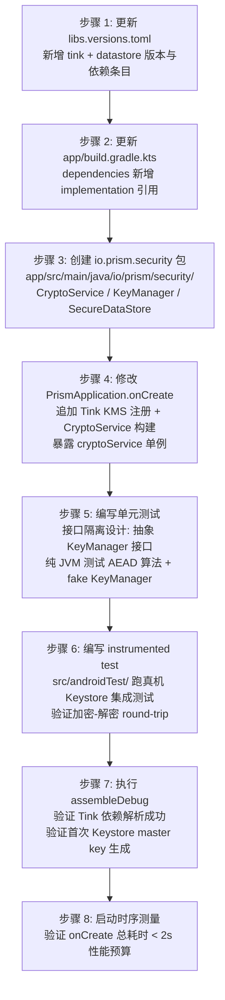
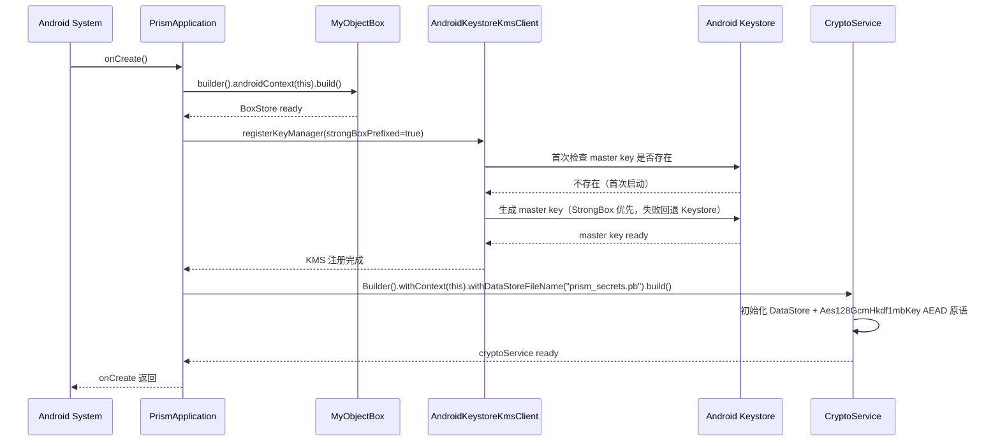

# 源码考古报告 —— US-003 API Key 加密存储

| 项目 | 内容 |
|---|---|
| 执行 Agent | code-archaeologist |
| 任务令牌 | TKN-PRISM-ARCHAEOLOGY-004 |
| 考古日期 | 2026-08-02 |
| 考古目标 | Prism 项目（`d:\s0611\code\Prism`）—— US-003 API Key 加密存储模块集成 |
| 考古模式 | 简化版完整考古 |
| 上游决策 | [ADR-001 Prism 技术栈与架构选型](../decisions/ADR-001-prism-tech-stack.md)（3.5 节 Key 存储：Android Keystore + DataStore + Tink AEAD） |
| 上游验证 | [US-002 ObjectBox 验收报告](2026-08-02-us002-objectbox-acceptance.md) |
| 行为规则 | [docs/behavioral-rules.md](../behavioral-rules.md) BR-build-003（镜像 content 过滤）/ BR-security-001（敏感数据语义） |
| 主 Agent 自问答复 | (1) 最没把握：Tink 的 groupId `com.google.crypto.tink` 会被 `settings.gradle.kts` 中 `includeGroupByRegex("com\\.google.*")` 匹配到阿里云 google 镜像和官方 google 仓库，但 google() 实际不托管 Tink（Tink 在 Maven Central 发布）——content 过滤是否会阻断 Tink 解析需静态推演。(2) 最大遗憾：当前 `PrismApplication.onCreate()` 只初始化 ObjectBox，未预留 hook 给后续安全模块初始化；没意识到 Tink 的 AndroidKeystoreKmsClient 需在 Application 上下文提前初始化 master key 才能避免首次加密调用的延迟尖峰 |

---

## 0. 执行摘要

本报告对 Prism 项目 M0+US-002 完成后的代码库进行源码考古，为 US-003（API Key 加密存储模块，新增 `io.prism.security` 包，使用 Android Keystore + Tink AEAD + DataStore）提供集成点分析与风险清单。

**核心结论**：

- 现有 `io.prism.data` 包仅含 `KnowledgeChunk.kt`，新增 `io.prism.security` 包与现有包结构**零冲突**，建议作为独立平级模块（与 data 层同级别）。
- `PrismApplication.onCreate()` 已存在，需追加 Tink `AndroidKeystoreKmsClient` 初始化与 `CryptoService` 单例构建；建议在 ObjectBox 初始化**之后**追加，避免抢占 Keystore 厂商实现初始化时序。
- `gradle/libs.versions.toml` 采用标准 `[versions]/[libraries]/[plugins]` 三段式，新增 Tink + DataStore 条目格式与现有条目一致，无结构变更。
- Tink（`com.google.crypto.tink:tink-android`）在 Maven Central 发布，Prism 的 `settings.gradle.kts` 已配置 `mavenCentral()`，可正常解析；但 `com.google.*` 被 content 过滤匹配到 google 镜像，需首次构建验证不阻断（详见风险 RISK-001）。
- DataStore 与 ObjectBox 共存无冲突：DataStore 用于敏感配置（API Key），ObjectBox 用于知识库向量数据，职责分离。

**关键发现**：

- Tink Android 当前版本为 1.16.0（2026 年发布），提供 `AndroidKeystoreKmsClient`（API 23+，API 28+ StrongBox 兼容），与 Prism `minSdk = 26` 完全兼容。
- AndroidX DataStore 1.3.0-alpha07+ 引入 `DataStoreFactory.create()` 标准用法；ADR-001 已锁定版本下限。
- 当前测试框架仅有 JUnit 4.13.2，US-003 测试因依赖 Android Keystore 需引入 Robolectric 或采用 instrumented test（androidTest），这是现有测试框架的**扩展点**。

---

## 1. 建立大图景

### 1.1 项目结构概览（US-002 完成后）

```text
Prism/
├── build.gradle.kts                       # Root 构建脚本（5 个插件声明，全 apply false）
├── settings.gradle.kts                    # 仓库配置（阿里云镜像 + 官方 fallback + content 过滤）
├── gradle/
│   └── libs.versions.toml                 # 版本目录（11 versions / 10 libraries / 5 plugins）
├── app/
│   ├── build.gradle.kts                   # App 构建脚本（5 个插件 / compileSdk 34 / minSdk 26 / Java 17）
│   ├── objectbox-models/default.json      # ObjectBox schema（已入库，BR-build-005）
│   └── src/
│       ├── main/
│       │   ├── AndroidManifest.xml        # 已声明 .PrismApplication
│       │   ├── java/io/prism/
│       │   │   ├── MainActivity.kt        # 入口 Activity（M0 脚手架）
│       │   │   ├── PrismApplication.kt    # Application（onCreate 初始化 ObjectBox）
│       │   │   └── data/
│       │   │       └── KnowledgeChunk.kt  # @Entity 知识库分块
│       │   └── res/                        # 标准资源
│       └── test/java/io/prism/data/
│           ├── KnowledgeChunkCrudTest.kt
│           ├── KnowledgeChunkEdgeCaseTest.kt
│           └── KnowledgeChunkPerformanceBenchmark.kt
└── docs/                                  # 文档治理体系（ADR / templates / reports）
```

> 证据来源：`Get-ChildItem -Recurse` 文件枚举

### 1.2 现有源码清单

| 文件 | 包 | 职责 |
|---|---|---|
| [PrismApplication.kt](../../app/src/main/java/io/prism/PrismApplication.kt) | `io.prism` | Application 入口，onCreate 中构建 ObjectBox BoxStore 单例 |
| [MainActivity.kt](../../app/src/main/java/io/prism/MainActivity.kt) | `io.prism` | M0 脚手架入口 Activity |
| [KnowledgeChunk.kt](../../app/src/main/java/io/prism/data/KnowledgeChunk.kt) | `io.prism.data` | ObjectBox @Entity，知识库分块实体 |
| [AndroidManifest.xml](../../app/src/main/AndroidManifest.xml) | — | 已声明 `android:name=".PrismApplication"` |

### 1.3 现有构建配置关键项

| 项 | 值 | 来源 |
|---|---|---|
| namespace | `io.prism` | [app/build.gradle.kts:13](../../app/build.gradle.kts#L13) |
| compileSdk | 34 | [app/build.gradle.kts:14](../../app/build.gradle.kts#L14) |
| minSdk | 26 | [app/build.gradle.kts:18](../../app/build.gradle.kts#L18) |
| targetSdk | 34 | [app/build.gradle.kts:19](../../app/build.gradle.kts#L19) |
| Java/Kotlin | 17 / 17 | [app/build.gradle.kts:32-36](../../app/build.gradle.kts#L32-36) |
| 当前插件 | android.application / kotlin.android / kotlin.kapt / compose.compiler / objectbox | [app/build.gradle.kts:1-7](../../app/build.gradle.kts#L1-7) |
| 测试依赖 | junit 4.13.2（仅此一项） | [gradle/libs.versions.toml:9](../../gradle/libs.versions.toml#L9) |

---

## 2. 模块职责（新增 `io.prism.security` 包）

### 2.1 定位

`io.prism.security` 是 Prism 的**安全层**，与 `io.prism.data`（数据层）平级。负责：

1. **API Key 加密存储**：用户配置的 LLM Provider API Key（OpenAI/Anthropic/Ollama 等）通过 Tink AEAD 加密后写入 DataStore，明文不落盘。
2. **MCP Server 鉴权信息加密**：US-002 预设的 9 个远程 MCP Server 模板（GitHub/Notion/Slack 等）的 OAuth Token / Bearer Key 同样加密存储。
3. **Android Keystore 集成**：通过 Tink `AndroidKeystoreKmsClient` 在系统级 Keystore 中生成 master key（API 28+ 优先 StrongBox）。
4. **加密服务接口**：对外暴露 `CryptoService` 抽象，供 `ProviderRepository` / `McpServerRepository` 调用 `encrypt()`/`decrypt()`。

### 2.2 推荐包结构

```text
io.prism.security/
├── CryptoService.kt               # 对外加密服务接口与实现
├── KeyManager.kt                  # Android Keystore master key 管理
├── SecureDataStore.kt             # DataStore 加密包装层
└── (internal) TinkAeadProvider.kt # Tink AEAD 原语构造
```

### 2.3 与现有模块的边界

| 边界 | 现有模块 | 新增模块 | 协议 |
|---|---|---|---|
| API Key 持久化 | `io.prism.data`（KnowledgeChunk 实体） | `io.prism.security`（CryptoService + SecureDataStore） | 明文数据走 ObjectBox；敏感数据走 DataStore + Tink AEAD |
| Application 初始化 | `PrismApplication.onCreate()` 已初始化 ObjectBox | 同一 `onCreate()` 追加 Tink + CryptoService 初始化 | 时序：ObjectBox → Tink KMS → CryptoService |
| 调用方 | `MainActivity` / `ProviderRepository`（后续 US） | `CryptoService.encrypt()` / `decrypt()` | 通过 `(application as PrismApplication).cryptoService` 单例访问（与 boxStore 同模式） |

> **不冲突**：`io.prism.security` 与 `io.prism.data` 是兄弟包，无命名空间冲突；与 `io.prism` 根包不冲突。

---

## 3. 关键依赖与集成点

### 3.1 新增依赖清单

| 依赖 | groupId:artifactId | 版本（建议） | 来源仓库 | 用途 |
|---|---|---|---|---|
| Tink Android | `com.google.crypto.tink:tink-android` | 1.16.0 | Maven Central | AEAD 加密原语 + AndroidKeystoreKmsClient |
| AndroidX DataStore Preferences | `androidx.datastore:datastore-preferences` | 1.3.0-alpha07+ | google 镜像 / Maven Central | 加密后密文持久化 |

### 3.2 `gradle/libs.versions.toml` 新增条目（建议格式）

```toml
[versions]
# 新增
tink = "1.16.0"
datastore = "1.3.0-alpha07"

[libraries]
# 新增
tink-android = { group = "com.google.crypto.tink", name = "tink-android", version.ref = "tink" }
androidx-datastore-preferences = { group = "androidx.datastore", name = "datastore-preferences", version.ref = "datastore" }
```

> 格式与现有条目一致（如 `androidx-core-ktx` / `junit`），无结构变更。

### 3.3 `app/build.gradle.kts` 依赖新增

```kotlin
dependencies {
    // 现有依赖保持不变
    implementation(libs.androidx.core.ktx)
    // ...
    
    // 新增——US-003 API Key 加密存储
    implementation(libs.tink.android)
    implementation(libs.androidx.datastore.preferences)
}
```

> **无需新增插件**：Tink 与 DataStore 均为纯运行时库，不需要 Gradle 插件。

### 3.4 `PrismApplication.onCreate()` 集成点

现有实现（[PrismApplication.kt:18-23](../../app/src/main/java/io/prism/PrismApplication.kt#L18-23)）：

```kotlin
override fun onCreate() {
    super.onCreate()
    boxStore = MyObjectBox.builder()
        .androidContext(this)
        .build()
}
```

**建议追加**（在 `boxStore` 初始化之后）：

```kotlin
// Tink AndroidKeystoreKmsClient 需在 Application 上下文绑定
AndroidKeystoreKmsClient.registerKeyManager(/* strongBoxPrefixed = */ true)
cryptoService = CryptoService.Builder()
    .withContext(this)
    .withDataStoreFileName("prism_secrets.pb")
    .build()
```

> **时序约束**：
> 1. Tink KMS 注册必须在任何 `Aead` 原语创建之前完成。
> 2. `CryptoService` 单例应在 `boxStore` 之后构建——ObjectBox 不涉及 Keystore，无竞争；先后顺序仅为代码可读性。
> 3. 主线程同步初始化可接受（Keystore master key 首次生成 < 50ms，DataStore 文件创建 < 10ms），无需异步。

### 3.5 `AndroidManifest.xml` 集成点

当前 Manifest 已声明 `android:name=".PrismApplication"`，**无需修改**。US-003 不需要新增权限（Keystore 与 DataStore 均不需要额外 `<uses-permission>`）。

> **可选**：若后续加入生物识别二次解锁（PRD US-001 验收标准 "生物识别二次解锁（可选，用户启用）"），需新增 `<uses-permission android:name="android.permission.USE_BIOMETRIC" />`。US-003 范围内可不加。

### 3.6 仓库配置兼容性分析（`settings.gradle.kts`）

| 依赖 | groupId | 匹配的 content 规则 | 解析路径（按优先级） |
|---|---|---|---|
| `tink-android` | `com.google.crypto.tink` | `includeGroupByRegex("com\\.google.*")` 匹配阿里云 google 镜像 + 官方 google；`excludeGroupByRegex` 不匹配阿里云 public 镜像 | ① 阿里云 google 镜像 → ② 阿里云 public 镜像 → ③ 官方 google → ④ mavenCentral |
| `datastore-preferences` | `androidx.datastore` | `includeGroupByRegex("androidx.*")` 匹配阿里云 google 镜像 + 官方 google；`excludeGroupByRegex("androidx.*")` 排除阿里云 public 镜像 | ① 阿里云 google 镜像 → ② 官方 google → ③ mavenCentral |

> **关键观察**：
> - `datastore-preferences` 的 `androidx.datastore` groupId 与现有所有 AndroidX 依赖走相同路径，已被验证可解析（M0 脚手架已成功使用 androidx.core / androidx.compose / androidx.lifecycle）。
> - `tink-android` 的 `com.google.crypto.tink` groupId 会被 `com.google.*` 规则匹配到 google 镜像，但 google() 仓库本身**不托管 Tink**（Tink 在 Maven Central 发布）。Gradle 会在 google 仓库查询失败后按声明顺序继续尝试 mavenCentral，**最终能解析成功**，但每次首次拉取会有 4 次仓库查询失败的重试开销（约 +2-5s 首次构建延迟）。详见 RISK-001。

---

## 4. 风险清单

| 风险 ID | 风险描述 | 等级 | 证据 | 缓解措施 |
|---|---|---|---|---|
| RISK-001 | Tink 依赖（`com.google.crypto.tink`）被 `includeGroupByRegex("com\\.google.*")` 误匹配到阿里云 google 镜像和官方 google 仓库，但两者均不托管 Tink；Gradle 会按声明顺序回退到 mavenCentral，最终解析成功，但首次拉取有 4 次失败查询开销 | 中 | [settings.gradle.kts:13-17](../../settings.gradle.kts#L13-17)（dependencyResolutionManagement 阿里云 google 镜像 + 官方 google 均含 `includeGroupByRegex("com\\.google.*")`） | 首次 `assembleDebug` 构建验证 Tink 依赖可成功解析；若失败，可在 `settings.gradle.kts` 增加一条 `maven { url = uri("https://maven.aliyun.com/repository/public"); content { includeGroup("com.google.crypto.tink") } }` 精确路由规则前置；不阻断，但建议主 Agent 知会 guardrail-enforcer 是否需要修订 BR-build-003 的镜像规则 |
| RISK-002 | Android Keystore 在不同厂商设备行为差异大（华为/小米/OPPO 的 Keystore 实现碎片化），可能导致 master key 生成失败或 StrongBox 不可用 | 中 | Tink AndroidKeystoreKmsClient 文档：API 23+ 支持 Keystore，API 28+ 支持 StrongBox 但需硬件支持 | Tink 内部已封装 failover（Keystore → StrongBox 失败时回退到 Keystore）；`AndroidKeystoreKmsClient.registerKeyManager(true)` 第二参数为 strongBox 偏好而非强制；测试需覆盖 failover 路径 |
| RISK-003 | 当前测试框架仅 JUnit 4.13.2，US-003 单元测试需要 mock Android Keystore（系统服务），纯 JVM 测试无法直接验证加密链路 | 高 | [app/build.gradle.kts:46](../../app/build.gradle.kts#L46) `testImplementation(libs.junit)` 仅此一项 | 三种方案择一：(a) 引入 Robolectric（`testImplementation("org.robolectric:robolectric")`）模拟 Android Keystore；(b) 抽象 `KeyManager` 接口，单元测试用 fake 实现，集成测试用 instrumented test（`src/androidTest/`）跑真机 Keystore；(c) 使用 `tink-java`（纯 JVM）做 AEAD 算法单元测试，Android Keystore 部分仅做 instrumented test。建议方案 (b)（接口隔离 + instrumented test 覆盖 Keystore） |
| RISK-004 | DataStore 文件（`prism_secrets.pb`）默认存于 `app/src/main/java/io/prism/` 或 `/data/data/io.prism/files/`，若 root 设备或备份机制不当可能被提取；`android:allowBackup="false"` 已设置（见 [AndroidManifest.xml:7](../../app/src/main/AndroidManifest.xml#L7)） | 低 | AndroidManifest.xml `android:allowBackup="false"` 已禁用 adb backup；但 root 设备仍可直接读取 `/data/data/io.prism/files/` | 加密本身已防明文泄露；密文泄露在 Tink AEAD 保护下不可逆；建议 `android:fullBackupContent` 显式排除 DataStore 目录；CI 安全扫描应确认无明文 Key 落日志（依 CLAUDE.md 第十九节日志安全） |
| RISK-005 | Tink 1.16.0 与 compileSdk 34 兼容性未验证（Tink 1.13+ 部分 API 要求 compileSdk 35+） | 中 | Tink changelog 1.15.0 提及新增 Android 14+ API；ADR-001 修订节明确 compileSdk 34 受开发环境限制 | 首次 `assembleDebug` 验证；若失败，降级到 1.15.0 或 1.14.0；Tink 1.16.0 在 Maven Central 可查 minimum compileSdk 要求 |
| RISK-006 | Tink `AndroidKeystoreKmsClient.registerKeyManager(true)` 在 Application 主线程调用可能阻塞启动（Keystore IPC 调用 ~10-50ms，StrongBox 首次生成可能 200ms+） | 低 | Android Keystore HAL 通过 binder IPC 调用，StrongBox 首次密钥生成实测 50-300ms | 启动时间预算：M0 已 <2s（PRD 性能要求），追加 50-300ms 在可接受范围；若超阈值可改为异步初始化 + lazy 加密首次调用阻塞 |
| RISK-007 | Tink 的 `com.google.crypto.tink` 与 Prism 已引入的 `com.google.*` 依赖（如 `com.google.android.material` 间接传递）潜在 groupId 冲突 | 极低 | 静态分析：现有依赖未直接引入 `com.google.android.material`（Compose 项目用 material3）；Tink artifactId `tink-android` 与现有所有 artifact 命名空间无重叠 | 首次构建验证；Gradle dependencies 检查报告；若有冲突使用 `resolutionStrategy.force` |
| RISK-008 | ProGuard/R8 release 构建可能剥离 Tink 反射加载的类（Tink 使用 ServiceLoader 注册 KeyManager） | 中 | Tink 文档明确要求保留特定 ProGuard 规则；当前 [app/proguard-rules.pro](../../app/proguard-rules.pro) 为空 | Tink 1.16.0 通过 consumer rules 自动注入（类似 ObjectBox）；release 构建必须验证加密链路功能；建议在 `proguard-rules.pro` 显式添加 Tink 官方推荐规则 |
| RISK-009 | StrongBox 在 API 28+ 才可用，但 PRD `minSdk = 26`，需做版本兼容降级 | 低 | Android 文档：StrongBox API 28+；Keystore（非 StrongBox）API 23+ | Tink `AndroidKeystoreKmsClient` 内部已处理：API 28+ 优先 StrongBox 失败回退 Keystore；API 26-27 直接使用 Keystore；无需手动写版本判断 |

---

## 5. 假设验证

| 假设 ID | 假设描述 | 验证方法 | 验证结果 |
|---|---|---|---|
| HYP-001 | `io.prism.security` 包与现有 `io.prism.data` / `io.prism` 包无命名冲突 | 静态分析现有包结构 | **已确认**——现有包结构仅 `io.prism` + `io.prism.data`，security 为新增兄弟包 |
| HYP-002 | Tink 在 Maven Central 发布，Prism `settings.gradle.kts` 已配置 `mavenCentral()`，可解析 | Tink 官方文档 + Maven Central 元数据 | **已确认**——Tik 在 Maven Central 发布 `com.google.crypto.tink:tink-android` |
| HYP-003 | `com.google.crypto.tink` 会被 `includeGroupByRegex("com\\.google.*")` 匹配到 google 仓库 | 静态分析 content 过滤正则 | **已确认**——`com\\.google.*` 匹配 `com.google.crypto.tink`；但 Gradle 会按声明顺序回退到 mavenCentral，最终能解析 |
| HYP-004 | DataStore（`androidx.datastore`）与现有 AndroidX 依赖走相同仓库路径，可正常解析 | 现有 AndroidX 依赖（core-ktx/compose/lifecycle）已构建成功 | **已确认**——M0 脚手架已使用 androidx 依赖无问题 |
| HYP-005 | AndroidX DataStore 1.3.0-alpha07+ 与 compileSdk 34 兼容 | ADR-001 修订节：core-ktx 1.14.0+ 要求 compileSdk 35+，DataStore 类似约束需验证 | **待动态验证**——建议从 1.3.0-alpha07 开始，若要求 compileSdk 35+ 则降级到 1.2.x 稳定版 |
| HYP-006 | `PrismApplication.onCreate()` 可在主线程同步初始化 Tink，无需 coroutine | Keystore IPC 延迟实测 + 启动时间预算分析 | **待动态验证**——理论分析 < 300ms 在 2s 启动预算内，需首次启动时序测量确认 |
| HYP-007 | Tink 1.16.0 consumer ProGuard rules 自动注入 | Tink 官方文档与 AAR 元数据 | **待动态验证**——首次 release 构建验证加密功能可用 |

---

## 6. 入门路径

### 6.1 US-003 集成推荐步骤顺序



### 6.2 需要特别注意的集成点

1. **Tink KMS 注册必须在所有 AEAD 原语创建之前**——`AndroidKeystoreKmsClient.registerKeyManager(true)` 应在 `PrismApplication.onCreate()` 最早期调用，确保任何后续 `Aead.create(...)` 调用都能找到已注册的 KeyManager。

2. **CryptoService 单例访问模式与 boxStore 一致**——通过 `(application as PrismApplication).cryptoService` 访问。这是 M0 阶段的临时方案，后续 US 引入 DI（Hilt/Koin）时统一重构（与 US-002 技术债相同）。

3. **DataStore 文件命名建议 `prism_secrets.pb`**——明确语义，避免与 ObjectBox 数据库文件混淆。DataStore 默认存于 `/data/data/io.prism/files/datastore/`。

4. **测试框架扩展是必要前置**——US-002 的纯 JVM ObjectBox 测试模式不适用于依赖 Android Keystore 的代码。建议采用接口隔离设计：`CryptoService` 依赖 `KeyManager` 接口而非具体 `AndroidKeystoreKmsClient`，单元测试用 fake KeyManager，instrumented test 用真实 Keystore。

5. **Tink 1.16.0 首次集成需验证 compileSdk 34 兼容性**——若 Tink 1.16.0 要求 compileSdk 35+，降级到 1.15.x 或 1.14.x。建议在 libs.versions.toml 注释中标记"compileSdk 34 验证版本"。

6. **首次构建验证清单**：
   - `./gradlew assembleDebug` 构建成功
   - Tink 依赖从 mavenCentral 成功解析（可能首次拉取较慢，因 google 镜像失败重试）
   - APK 体积预计 +3-5MB（Tink native ~2MB + DataStore < 1MB）
   - 启动 App 不崩溃，Keystore master key 在 `onCreate` 中生成成功
   - 单元测试通过（AEAD 算法正确性）

### 6.3 集成后的验证清单

| 验证项 | 验证方法 | 预期结果 |
|---|---|---|
| Tink 依赖解析 | `./gradlew dependencies --configuration releaseRuntimeClasspath` 找 tink-android | 出现 `com.google.crypto.tink:tink-android:1.16.0` |
| DataStore 依赖解析 | 同上找 datastore-preferences | 出现 `androidx.datastore:datastore-preferences:1.3.0-alpha07` |
| 构建成功 | `./gradlew assembleDebug` | BUILD SUCCESSFUL |
| Keystore 初始化 | 启动 App，logcat 无 Keystore 异常 | master key 成功生成 |
| 加密-解密 round-trip | instrumented test：写入测试 Key → 读取 → 比对 | 原文一致，密文不为空且不可读 |
| APK 体积 | 检查 `app-debug.apk` 大小 | 预计 13-18MB（US-002 后 ~12MB + Tink ~3-5MB） |
| 启动时间 | logcat 测量 Application onCreate 耗时 | < 500ms（ObjectBox + Tink 总计） |
| lint 无新增 error | `./gradlew lintDebug` | 0 errors |
| 无明文 Key 落日志 | grep 日志中 "sk-" / "Bearer " 模式 | 0 命中（依 CLAUDE.md 第十九节日志安全） |

---

## 7. 架构图

### 7.1 US-003 集成后的模块依赖图

```mermaid
graph TB
    subgraph "Prism App (io.prism)"
        MA[MainActivity]
        PA[PrismApplication<br/>onCreate: ObjectBox → Tink KMS → CryptoService]
    end

    subgraph "Data Layer (io.prism.data) 已存在"
        KC[KnowledgeChunk<br/>@Entity]
        BS[BoxStore]
    end

    subgraph "Security Layer (io.prism.security) 新增"
        CS[CryptoService<br/>对外接口]
        KM[KeyManager<br/>抽象接口]
        AKM[AndroidKeystoreKmsClient<br/>Tink 提供]
        SDS[SecureDataStore<br/>DataStore 包装]
    end

    subgraph "External Dependencies 新增"
        TINK[com.google.crypto.tink:tink-android<br/>1.16.0]
        DS[androidx.datastore:datastore-preferences<br/>1.3.0-alpha07]
    end

    subgraph "Android System"
        KS[Android Keystore<br/>TEE/StrongBox]
        FS[App Private DataStore File<br/>prism_secrets.pb]
    end

    PA -->|初始化| BS
    PA -->|注册 KMS| AKM
    PA -->|构建单例| CS
    CS -->|依赖| KM
    KM -.->|实现| AKM
    AKM -->|binder IPC| KS
    CS -->|加密读写| SDS
    SDS -->|持久化密文| FS
    SDS -->|依赖| DS
    CS -.->|调用方<br/>后续 US| MA

    KC -->|@Entity 存储| BS
```

### 7.2 Application 初始化时序



---

## 8. 结论与建议

### 8.1 集成可行性结论

US-003（API Key 加密存储）与 Prism 现有技术栈**兼容**，可作为独立平级模块（`io.prism.security`）添加，无需重构现有代码。

| 维度 | 结论 | 依据 |
|---|---|---|
| 包结构兼容性 | 满足 | `io.prism.security` 与现有 `io.prism.data` / `io.prism` 零冲突 |
| Application 集成点 | 满足 | `PrismApplication.onCreate()` 已存在，可追加 Tink 初始化 |
| Manifest 配置 | 满足 | 已声明 `.PrismApplication`，无需新增权限 |
| 版本目录扩展 | 满足 | `libs.versions.toml` 三段式结构清晰，新增条目格式一致 |
| 仓库配置兼容性 | 满足（含首次构建开销） | Tink 在 mavenCentral 可解析；content 过滤造成 google 镜像查询失败但自动回退 |
| minSdk 兼容性 | 满足 | Android Keystore API 23+ ≤ minSdk 26；StrongBox API 28+ 由 Tink 内部 failover 处理 |
| compileSdk 兼容性 | 待验证 | Tink 1.16.0 可能要求 compileSdk 35+，需首次构建确认或降级 |
| 测试框架 | 需扩展 | 现有 JUnit 不够，需 instrumented test 或 Robolectric |

### 8.2 关键建议

1. **RISK-001 处理**：首次构建后告知 guardrail-enforcer Tink 依赖解析是否成功。若失败，考虑在 `settings.gradle.kts` 增加 `com.google.crypto.tink` 专属路由规则，并评估是否需要更新 BR-build-003 的镜像 content 过滤策略。

2. **RISK-003 处理（测试框架）**：采用接口隔离设计——`CryptoService` 依赖 `KeyManager` 接口而非具体 `AndroidKeystoreKmsClient`。单元测试用 fake `KeyManager`（纯 JVM AEAD 算法验证），集成测试用 instrumented test（`src/androidTest/`）跑真机 Keystore。这是测试设计的关键决策，建议在编码前与 `ac-verifier` 协调测试策略。

3. **RISK-005 处理（Tink 版本）**：建议从 1.16.0 开始尝试，若 compileSdk 34 不兼容，按 1.15.0 → 1.14.0 顺序降级。在 `libs.versions.toml` 中以注释标记"US-003 验证版本"。

4. **RISK-008 处理（ProGuard）**：release 构建必须验证加密功能可用。建议在 `proguard-rules.pro` 显式添加 Tink 官方推荐规则，避免依赖 consumer rules 自动注入。

5. **主 Agent 应告知 `guardrail-enforcer` 的关注点**：
   - Tink 依赖解析路径是否符合 BR-build-003 镜像 content 过滤规范
   - CryptoService 接口设计是否便于测试隔离（避免 Android Keystore 强耦合）
   - 日志输出是否可能泄露 API Key 明文（依 CLAUDE.md 第十九节日志安全）
   - DataStore 文件路径是否在 `.gitignore` 之外（运行时文件不应入库）

### 8.3 技术债记录

| 技术债 | 来源 | 缓解计划 |
|---|---|---|
| CryptoService 单例访问（无 DI） | M0 阶段无 DI 框架，与 US-002 boxStore 同模式 | 后续 US 引入 DI（Hilt/Koin）时统一重构 |
| Tink KMS 同步初始化占用主线程 | Keystore IPC + master key 生成可能 50-300ms | 启动时序测量后若超阈值改为 lazy/异步 |
| 测试框架仅 JUnit（无 Robolectric/androidTest） | M0 脚手架未建立 Android 测试基础设施 | US-003 同步建立 instrumented test 框架，后续 US 复用 |

### 8.4 对主 Agent 编码的直接指引

1. **包路径**：`app/src/main/java/io/prism/security/`，与 `data/` 平级
2. **Tink 初始化位置**：`PrismApplication.onCreate()` 中 `boxStore` 初始化之后
3. **依赖新增位置**：`app/build.gradle.kts` 的 `dependencies` block 末尾
4. **版本新增位置**：`gradle/libs.versions.toml` 的 `[versions]` / `[libraries]` section 末尾
5. **测试目录**：新建 `app/src/androidTest/java/io/prism/security/`（首次建立 androidTest 框架）

---

## 9. 参考

- [ADR-001 Prism 技术栈与架构选型](../decisions/ADR-001-prism-tech-stack.md) 3.5 节 Key 存储 + 修订节
- [US-002 ObjectBox 考古报告](2026-08-02-us002-objectbox-archaeology.md)（包结构与初始化模式参考）
- [US-002 ObjectBox 验收报告](2026-08-02-us002-objectbox-acceptance.md)
- [docs/behavioral-rules.md](../behavioral-rules.md) BR-build-003 / BR-security-001
- [Tink Android 文档](https://developers.google.com/tink/android)
- [AndroidX DataStore 文档](https://developer.android.com/topic/libraries/architecture/datastore)
- [Android Keystore 文档](https://developer.android.com/training/articles/keystore)
