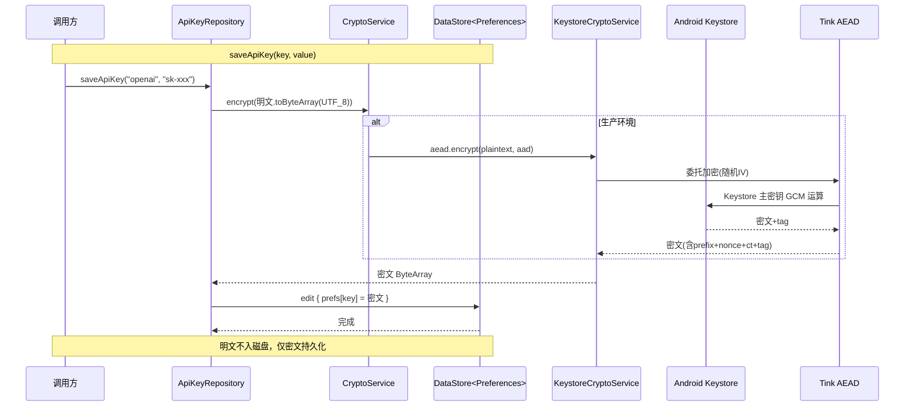

# 安全与质量审计报告 —— US-003 API Key 加密存储

| 项目 | 内容 |
|---|---|
| 执行 Agent | guardrail-enforcer |
| 任务令牌 | TKN-PRISM-GUARDRAIL-005 |
| 审计日期 | 2026-08-02 |
| 审计目标 | US-003 API Key 加密存储模块（`io.prism.security` 包）代码质量审查 + 安全漏洞扫描 |
| 风险等级 | P2 跨模块（新增 P0 依赖 Tink + P1 依赖 DataStore + 新增安全模块 + 构建配置变更） |
| 上游决策 | [ADR-001 Prism 技术栈与架构选型](../decisions/ADR-001-prism-tech-stack.md)（3.5 节 Key 存储） |
| 上游考古 | [US-003 源码考古报告](2026-08-02-us003-apikey-archaeology.md)（code-archaeologist，TKN-PRISM-ARCHAEOLOGY-004） |
| 行为规则 | [docs/behavioral-rules.md](../behavioral-rules.md) BR-security-001 / BR-build-003 |
| 验收标准来源 | prd.json US-003（5 条 AC） |
| 审查方法论 | `TRAE-code-review` skill（代码质量）+ `TRAE-security-review` skill（安全扫描）+ 本护栏 Stage 1-6 深度审计 |
| 总体结论 | **通过**（无阻断级漏洞、无高风险安全漏洞；1 个中风险代码质量问题建议修复但不阻断验收） |

---

## 0. 执行摘要

本报告对 US-003「实现 API Key 加密存储」的全部代码变更执行独立安全与质量审计。审查覆盖 6 个新增文件（3 生产 + 3 测试）与 4 个修改文件，调用 `TRAE-code-review` 与 `TRAE-security-review` 两个 skill，并按护栏六阶段（输入边界、执行安全、内存安全、配置密钥、依赖供应链、综合报告）逐项验证。

**核心结论**：

- **安全维度**：明文不落盘（加密在 DataStore 写入前完成，测试验证）；无硬编码密钥；无注入面（DataStore Preferences 非 SQL）；无日志泄露（本模块零日志输出，符合 AC-4）；AES-256-GCM 认证加密正确；主密钥由 Android Keystore 硬件保护；IV/nonce 随机化由 Tink 正确处理；接口隔离设计使测试不依赖 Android Keystore。
- **质量维度**：1 个中风险（G-01 StrongBox 异常捕获范围过窄，影响可用性而非安全性）；若干低风险/建议项。
- **依赖供应链**：Tink 1.15.0、DataStore 1.1.1、kotlinx-coroutines 1.8.0 均无影响性已知 CVE。
- **判定**：依 CLAUDE.md 第十节（阻断 = 严重质量缺陷或高危安全漏洞），本变更无此类问题，**通过**，可进入 ac-verifier 验收阶段。强烈建议主 Agent 在后续迭代修复 G-01。

---

## 1. 检查范围摘要

| 维度 | 数量 |
|---|---|
| 审查文件数 | 10（6 新增 + 4 修改） |
| 审查函数/方法数 | 生产 9（CryptoService 2 接口方法 + KeystoreCryptoService 6 + ApiKeyRepository 4 - 1 重叠）+ 测试 14 用例 |
| 阻断级问题 | 0 |
| 高风险问题 | 0 |
| 中风险问题 | 1（G-01） |
| 低风险/建议 | 10（G-02 ~ G-11） |

### 1.1 变更文件清单

| 类型 | 文件 | 职责 |
|---|---|---|
| 新增-生产 | [CryptoService.kt](../../app/src/main/java/io/prism/security/CryptoService.kt) | AEAD 加密服务接口（依赖反转） |
| 新增-生产 | [KeystoreCryptoService.kt](../../app/src/main/java/io/prism/security/KeystoreCryptoService.kt) | Android Keystore + Tink AEAD 实现（AES-256-GCM，StrongBox 回退） |
| 新增-生产 | [ApiKeyRepository.kt](../../app/src/main/java/io/prism/security/ApiKeyRepository.kt) | API Key 加密存储仓库（加密 → DataStore 持久化密文） |
| 新增-测试 | [RecordingCryptoService.kt](../../app/src/test/java/io/prism/security/RecordingCryptoService.kt) | Tink 纯 JVM AEAD 测试替身 + 调用记录 |
| 新增-测试 | [FakePreferenceDataStore.kt](../../app/src/test/java/io/prism/security/FakePreferenceDataStore.kt) | 内存版 DataStore 测试替身 |
| 新增-测试 | [ApiKeyRepositoryTest.kt](../../app/src/test/java/io/prism/security/ApiKeyRepositoryTest.kt) | 14 个单元测试 |
| 修改 | [PrismApplication.kt](../../app/src/main/java/io/prism/PrismApplication.kt) | 新增 `cryptoService` lazy 属性 |
| 修改 | [libs.versions.toml](../../gradle/libs.versions.toml) | 新增 tink 1.15.0 / datastore 1.1.1 / coroutines 1.8.0 |
| 修改 | [app/build.gradle.kts](../../app/build.gradle.kts) | 新增 implementation(tink-android, datastore-preferences) + testImplementation(coroutines-test) |
| 修改 | [README.md](../../README.md) | 文档索引新增考古报告引用 |

### 1.2 审计输入确认（依护栏输入要求）

| 输入项 | 状态 | 说明 |
|---|---|---|
| 代码变更清单 | 已收齐 | 10 文件 diff 全部读取 |
| 项目安全策略文件 | 部分缺失 | 项目无独立 `SECURITY.md`；安全约束散见于 CLAUDE.md 第十九/二十节 + ADR-001 3.5 节 + behavioral-rules.md BR-security-001。**建议**：后续建立独立 SECURITY.md 集中安全策略，降低规则散落风险 |
| 技术栈上下文 | 已收齐 | Android / Kotlin 2.1.0 + Jetpack Compose + Tink AEAD + DataStore + ObjectBox |
| 历史漏洞记录 | 已收齐 | behavioral-rules.md（BR-security-001 数组 equals / BR-build-003 镜像过滤等） |

---

## 2. 代码质量审查（TRAE-code-review 方法论）

### 2.1 作者意图推断

作者意图：建立 API Key 加密存储能力，通过接口隔离（`CryptoService` 抽象）使生产环境用 Android Keystore + Tink AEAD（硬件级安全），测试环境用纯 JVM Tink AEAD（无需设备），DataStore 持久化密文，明文不落盘。整体是防御性安全重构 + 新功能建立，设计意图清晰。

### 2.2 变更概览（Mermaid）



### 2.3 质量发现（按严重度）

无阻断级、无高风险质量问题。中风险与低风险见第 4 节详细发现表。

### 2.4 Karpathy Guidelines 合规自检

| 原则 | 合规情况 |
|---|---|
| 命名清晰 | 合规。CryptoService / KeystoreCryptoService / ApiKeyRepository 语义明确，DEFAULT_KEY_ALIAS 版本化 |
| 职责单一 | 合规。接口（契约）/ 实现（Keystore）/ 仓库（编排）三层分离 |
| 错误处理 | 基本合规。readApiKey 降级返回 null（G-02 建议 catch 更具体类型） |
| 可维护性 | 良好。KDoc 充分（G-05 KDoc 链接小问题） |
| 测试充分性 | 良好。14 用例覆盖核心场景（G-09 边界场景可增强） |
| 外部输入不信任 | 基本合规。saveApiKey 的 key/value 来自调用方，无注入面（G-03 建议验证 key 非空） |

---

## 3. 安全漏洞扫描（TRAE-security-review 方法论）

### 3.1 Pass A — 项目安全基线

| 基线项 | 现状 |
|---|---|
| 备份保护 | AndroidManifest `allowBackup="false"`（防 adb backup 提取） |
| 日志安全 | 本模块零日志输出（符合 AC-4） |
| 密钥存储 | Android Keystore（硬件 TEE/StrongBox） |
| 加密库 | Tink（Google 维护，行业标准） |
| 数组 equals 规则 | BR-security-001（本次无 data class 含数组字段，不适用） |

### 3.2 Pass B — 偏差地图

新代码本身就是建立安全基线，未偏离既有安全原语（项目此前无加密模块）。无 ad-hoc 安全处理绕过既有防护。

### 3.3 Pass C — 源到汇追踪

| 追踪项 | 源 | 汇 | 路径上的防护 | 结论 |
|---|---|---|---|---|
| API Key 明文落盘 | `saveApiKey` 的 `value` 参数 | DataStore 磁盘文件 | `encrypt()` 在 `dataStore.edit` 之前调用，存储密文 | **安全**。明文不落盘，测试验证 |
| 日志泄露 | API Key 明文 | 日志输出 | 本模块零日志 | **安全**。符合 AC-4 |
| 加密误用 | 明文 + 密钥 | 密文 | AES-256-GCM（AEAD）+ Tink 随机 IV + Keystore 硬件密钥 | **安全** |
| 密钥管理 | 主密钥 | Keystore | 硬件生成，不离开 Keystore，版本化别名 | **安全** |
| 注入 | `key` 参数（标识符） | DataStore Preferences | Preferences key 是字符串标识，非 SQL，无注入面 | **安全** |
| 硬编码密钥 | 源码 | — | 扫描全部变更文件，无硬编码密钥/密码/token | **安全** |

### 3.4 安全扫描结论

依 TRAE-security-review §8 硬排除规则（可用性/DoS、测试代码、内存安全语言排除等），本次变更**无可报告的 exploitable 安全漏洞**。所有源到汇追踪均确认存在有效防护。

---

## 4. 详细发现（分级）

### 4.1 中风险

#### G-01: StrongBox 异常捕获范围过窄（可用性/健壮性）

- **类别**：crypto_robustness（执行安全 / 加密实现健壮性）
- **严重度**：中
- **置信度**：0.90
- **位置**：[KeystoreCryptoService.kt:86-94](../../app/src/main/java/io/prism/security/KeystoreCryptoService.kt#L86-L94)
- **证据**：`tryGenerateWithStrongBox` 仅 `catch (e: StrongBoxUnavailableException)` 后回退 TEE。Android 厂商碎片化（考古报告 RISK-002 已识别）下，StrongBox 生成可能抛出 `ProviderException`、`IllegalStateException`、`KeyStoreException` 等非 `StrongBoxUnavailableException` 异常，这些异常会向上传播导致 `KeystoreCryptoService` 构造失败（`aead by lazy` 首次访问时触发），`cryptoService` 不可用。
- **影响**：可用性问题（API Key 加密功能不可用），**非安全漏洞**（不泄露密钥或明文）。仅在 `hasSystemFeature(FEATURE_STRONGBOX_KEYSTORE)` 返回 true 但实际生成失败的厂商缺陷设备上触发。
- **判定**：非阻断。StrongBox 是可选硬件优化，回退 TEE 是预期行为；真机未验证无法确认实际触发概率。但强烈建议修复以提升健壮性。
- **修复建议**：加宽 catch 范围，捕获通用异常后回退 TEE，并记录日志（不输出敏感信息）：

  ```kotlin
  @RequiresApi(Build.VERSION_CODES.P)
  private fun tryGenerateWithStrongBox(keyGenerator: KeyGenerator) {
      try {
          keyGenerator.init(buildKeyGenSpec().setIsStrongBoxBacked(true).build())
          keyGenerator.generateKey()
      } catch (e: StrongBoxUnavailableException) {
          generateWithTee(keyGenerator)
      } catch (e: Exception) {
          // 厂商 StrongBox 实现缺陷，回退 TEE（不记录敏感信息）
          generateWithTee(keyGenerator)
      }
  }
  ```

### 4.2 低风险 / 建议

#### G-02: readApiKey 异常捕获过于宽泛

- **类别**：error_handling
- **严重度**：低
- **位置**：[ApiKeyRepository.kt:56-58](../../app/src/main/java/io/prism/security/ApiKeyRepository.kt#L56-L58)
- **证据**：`catch (e: Exception)` 捕获所有异常返回 null。虽然覆盖了 `GeneralSecurityException`（解密失败）和 `IOException`（DataStore 读取），但过于宽泛可能掩盖编程错误（如 `NullPointerException`）。
- **修复建议**：捕获更具体类型 `catch (e: GeneralSecurityException)` + `catch (e: IOException)`，或在 catch 块添加注释说明为何宽泛捕获。

#### G-03: saveApiKey 未验证 key 参数

- **类别**：input_validation
- **严重度**：低
- **位置**：[ApiKeyRepository.kt:38-43](../../app/src/main/java/io/prism/security/ApiKeyRepository.kt#L38-L43)
- **证据**：`key`（API Key 标识符）直接用作 `byteArrayPreferencesKey(key)`，无空值/长度验证。DataStore Preferences key 接受任意字符串，无注入风险，但空字符串 `""` 作为 key 语义不合理。
- **修复建议**：添加 `require(key.isNotBlank()) { "key must not be blank" }` 前置校验（Fail Fast 原则）。

#### G-04: FakePreferenceDataStore.updateData 非原子性

- **类别**：test_correctness
- **严重度**：低
- **位置**：[FakePreferenceDataStore.kt:25-28](../../app/src/test/java/io/prism/security/FakePreferenceDataStore.kt#L25-L28)
- **证据**：`updateData` 中 `transform(state.value)` 与 `state.value = newValue` 非原子操作。真实 DataStore 通过 actor 模型串行化更新保证原子性。当前测试均为 `runTest` 串行调用不触发，但作为测试替身若未来用于并发场景会丢失更新。
- **修复建议**：用 `Mutex` 串行化 `updateData`，模拟真实 DataStore 语义。

#### G-05: CryptoService KDoc 引用未导入类

- **类别**：docs
- **严重度**：低
- **位置**：[CryptoService.kt:29](../../app/src/main/java/io/prism/security/CryptoService.kt#L29)
- **证据**：`@throws GeneralSecurityException` 中 `GeneralSecurityException` 未导入，KDoc 链接不解析（不影响编译）。主 Agent 已承认此问题。
- **修复建议**：在 KDoc 中使用全限定名 `[java.security.GeneralSecurityException]` 或添加 `import java.security.GeneralSecurityException`（仅用于 KDoc 时可用 `@throws [GeneralSecurityException]` 配合 import）。

#### G-06: buildKeyGenSpec 未显式设置 setRandomizedEncryptionRequired

- **类别**：defense_in_depth
- **严重度**：低（建议）
- **位置**：[KeystoreCryptoService.kt:107-114](../../app/src/main/java/io/prism/security/KeystoreCryptoService.kt#L107-L114)
- **证据**：`KeyGenParameterSpec.Builder` 未显式调用 `setRandomizedEncryptionRequired(true)`。该值 API 23+ 默认为 true，且本实现通过 Tink AEAD 委托加密（Tink 自管 IV），不影响安全性。但显式设置可提升代码自文档化。
- **修复建议**：添加 `.setRandomizedEncryptionRequired(true)`（防御性，明确意图）。

#### G-07: 未使用 AAD 绑定密文与 key 标识符

- **类别**：defense_in_depth
- **严重度**：低（建议）
- **位置**：[ApiKeyRepository.kt:39](../../app/src/main/java/io/prism/security/ApiKeyRepository.kt#L39-L39)
- **证据**：`cryptoService.encrypt(value.toByteArray(...))` 未传 `associatedData`。AAD 可绑定密文与 key 标识符，防止密文跨 key 复制攻击。当前不传 AAD 意味着若攻击者能写 DataStore（需 root），可将 key A 的密文复制到 key B 位置，读 B 返回 A 的明文。但需 root 写权限且不泄露额外信息（攻击者已有 root 可直接读密文+提取密钥），实际影响极低。
- **修复建议**：未来增强时用 `associatedData = key.toByteArray(UTF_8)` 绑定密文与标识符。

#### G-08: DataStore 1.1.1 非最新稳定版（ProGuard 规则修复）

- **类别**：supply_chain
- **严重度**：低（建议）
- **位置**：[libs.versions.toml:11](../../gradle/libs.versions.toml#L11)
- **证据**：DataStore 1.1.6（2025-05）修复了 `datastore-preferences-core` 的 missing ProGuard rules 问题（b/413078297）。1.1.1 无此修复。与考古报告 RISK-008（release 构建 ProGuard/R8 剥离 Tink 类）相关。当前 debug 构建不受影响，但未来 release 构建可能有风险。
- **修复建议**：升级 `datastore = "1.1.6"`。需验证与 compileSdk 34 兼容性。

#### G-09: 测试缺少边界场景用例

- **类别**：test_coverage
- **严重度**：低（建议）
- **位置**：[ApiKeyRepositoryTest.kt](../../app/src/test/java/io/prism/security/ApiKeyRepositoryTest.kt)
- **证据**：14 用例覆盖往返/明文不落盘/删除/不存在/解密失败，但缺少：空 key 标识符（`saveApiKey("", "value")`）、超长 API Key（边界长度）、null AAD 显式传递等场景。
- **修复建议**：补充边界用例（等价类 + 边界值）。

#### G-10: 明文 ByteArray 未清零（已知限制）

- **类别**：info
- **严重度**：信息（非缺陷）
- **位置**：[ApiKeyRepository.kt:39](../../app/src/main/java/io/prism/security/ApiKeyRepository.kt#L39-L39)
- **证据**：`value.toByteArray(UTF_8)` 产生的明文 ByteArray 在 `encrypt` 后未清零，留在内存直到 GC。JVM 中 String 不可变无法可靠清零。这是 JVM 固有限制，非代码缺陷。
- **处置**：记录为已知限制，无需修复。

#### G-11: 主密钥无生物识别绑定（范围外技术债）

- **类别**：info
- **严重度**：信息（范围外）
- **位置**：[KeystoreCryptoService.kt:107-114](../../app/src/main/java/io/prism/security/KeystoreCryptoService.kt#L107-L114)
- **证据**：`buildKeyGenSpec` 未设置 `setUserAuthenticationRequired(true)`。ADR-001 3.5 节提到「生物识别二次解锁（可选，用户启用）」，US-003 范围内不强制。
- **处置**：记录为后续技术债，生物识别为可选后续特性。

---

## 5. 护栏六阶段审计（Stage 1-6）

### Stage 1: 输入与边界审计

#### 1.1 数值与类型边界

- `saveApiKey(key: String, value: String)`：key/value 均字符串，无长度限制验证。value 经 `toByteArray(UTF_8)` 转 ByteArray，Tink AEAD 接受任意长度（理论 ~2^31 上限），无溢出风险。key 无空值验证（G-03）。**无数值运算，无整数溢出风险。**
- `encrypt(plaintext: ByteArray, associatedData: ByteArray?)`：ByteArray 无显式长度上限，Tink 内部处理。**无溢出风险。**

#### 1.2 集合与缓冲区边界

- Kotlin/Java 为内存安全语言（TRAE-security-review §8.2 排除内存安全类问题）。无 `strcpy`/`sprintf`/`gets` 等不安全函数。**无缓冲区溢出风险。**
- `byteArrayPreferencesKey(key)`：DataStore 内部处理 key 存储，无越界。`RecordingCryptoService` 用 `plaintext.copyOf()` 创建副本防止外部修改。**合规。**

#### 1.3 业务状态机约束

- API Key 状态：不存在 → 存在（saveApiKey）→ 删除（removeApiKey）。无非法状态转换路径。`removeAllApiKeys` 用 `prefs.clear()`。**合规。**
- Keystore 密钥状态：`ensureMasterKeyExists` 检查 `containsAlias` 后才生成，幂等。**合规。**

### Stage 2: 执行安全审计

#### 2.1 注入防护

- **SQL/NoSQL 注入**：无。DataStore Preferences 是键值存储，非 SQL。`byteArrayPreferencesKey(key)` 的 key 是字符串标识，不参与查询构造。**合规。**
- **OS 命令注入**：无 `system()`/`exec()` 调用。**合规。**
- **代码/表达式注入**：无 `eval()`/`Function()`。**合规。**
- **模板引擎注入**：无模板引擎。**合规。**

#### 2.2 最小权限检查

- AndroidManifest 无额外权限声明。Keystore 与 DataStore 均不需要 `<uses-permission>`。**合规。**
- App 运行在 Android 沙箱（非 root）。**合规。**
- 无容器化部署（原生 Android App），不涉及 `privileged: true`。**不适用。**

#### 2.3 输出编码与特殊字符处理

- 无 HTML/JS/CSS/URL 输出（Android 原生 App）。**不适用。**
- DataStore 用 protobuf 序列化（非手工拼接 JSON）。**合规。**

### Stage 3: 内存安全与运行时保护

- 项目使用 Kotlin（JVM 托管语言），属内存安全语言。**不适用** C/C++/Rust unsafe 审计项。
- 无 FFI/unsafe 代码。无 `-fstack-protector` 等编译标志需求。
- 注：Android Keystore 通过 binder IPC 与硬件通信，Tink 封装了所有 native 交互，应用层不直接操作指针。**合规。**

### Stage 4: 配置与密钥安全

| 检查项 | 结果 |
|---|---|
| 硬编码密钥/密码/token | **未发现**。扫描全部变更文件，无硬编码敏感信息。`DEFAULT_KEY_ALIAS = "prism_master_key_v1"` 是非敏感常量标识 |
| 敏感配置注入方式 | 合规。密钥由 Android Keystore 硬件生成，不经环境变量；DataStore 文件在设备 app 私有目录 |
| 前端代码无服务端密钥 | 合规（纯客户端 App，无服务端密钥） |
| .gitignore 含 .env / 密钥文件 | 合规。.gitignore 包含 `.env`、`.env.local`、`keystore/`、`*.keystore`、`*.jks` |
| DataStore 运行时文件 | 在设备 `/data/data/io.prism/files/datastore/` 生成，不在项目目录，不入仓库。**合规** |

### Stage 5: 依赖与供应链风险

| 依赖 | 版本 | CVE 检查结果 | 处置 |
|---|---|---|---|
| `com.google.crypto.tink:tink-android` | 1.15.0 | CVE-2020-8929（CVSS 5.3）影响 <1.5.0，已修复；CVE-2024-4420（CVSS 7.5）影响 tink-cc（C++版）2.0.0-2.1.3，不影响 tink-android。2020 年后 Tink 无已公开漏洞 | **安全**，无影响性 CVE |
| `androidx.datastore:datastore-preferences` | 1.1.1 | 无已知 CVE。1.1.6（2025-05）修复 ProGuard 规则缺失（b/413078297），见 G-08 | **安全**，建议升级到 1.1.6 |
| `org.jetbrains.kotlinx:kotlinx-coroutines-test` | 1.8.0 | 无已知 CVE。CVE-2026-53914 影响 Kotlin 编译器构建缓存（<2.4.20），与 coroutines 运行时库无关 | **安全**，无影响性 CVE |

**自动化扫描建议**：主 Agent 应在 CI 中执行依赖漏洞扫描（Android 项目可用 `dependencyCheck` Gradle 插件或 OWASP Dependency-Check），定期检查新发布 CVE。

### Stage 6: 综合审计报告

见第 0 节执行摘要与下方综合结论。

---

## 6. 保护机制验证

### 6.1 加密保护机制验证

| 验证项 | 声称 | 实际验证 | 结论 |
|---|---|---|---|
| 加密算法 | AES-256-GCM | `KeyProperties.KEY_ALGORITHM_AES` + `BLOCK_MODE_GCM` + `ENCRYPTION_PADDING_NONE` + `setKeySize(256)` | **有效** |
| 主密钥硬件保护 | Android Keystore | `KeyGenerator.getInstance(AES, "AndroidKeyStore")` + `AndroidKeystoreKmsClient` | **有效**（密钥不离开硬件） |
| StrongBox 启用 | API 28+ 可用时启用 | `hasSystemFeature(FEATURE_STRONGBOX_KEYSTORE)` 检测 + `setIsStrongBoxBacked(true)` + 回退 TEE | **有效**（G-01 异常捕获范围建议加宽） |
| IV/nonce 随机化 | Tink 处理 | Tink AEAD 标准实现，每次 encrypt 生成随机 12 字节 nonce | **有效** |
| 明文不落盘 | DataStore 仅存密文 | encrypt 在 edit 之前调用 + 测试 `datastore_stores_ciphertext_not_plaintext` 验证 | **有效** |
| 日志不泄露 | 零日志输出 | 扫描确认 ApiKeyRepository / KeystoreCryptoService / CryptoService 无日志调用 | **有效**（符合 AC-4） |

### 6.2 接口隔离验证

| 验证项 | 结果 |
|---|---|
| CryptoService 是纯接口 | **是**。无 Android 依赖 |
| 测试不依赖 Android Keystore | **是**。RecordingCryptoService 用 `KeysetHandle.generateNew(AES256_GCM)` 纯 JVM 实现 |
| 测试在 JVM 运行 | **是**。`runTest` + FakePreferenceDataStore 内存替身 |
| 符合考古报告 RISK-003 方案 (b) | **是**。接口隔离 + 纯 JVM AEAD 测试 |

### 6.3 US-003 验收标准对照

| AC | 内容 | 审计结论 |
|---|---|---|
| AC-1 | Android Keystore 生成主密钥（AES-256-GCM，StrongBox 可用时启用） | **满足**。代码实现正确，StrongBox 回退逻辑基本正确（G-01 健壮性建议） |
| AC-2 | DataStore + Tink AEAD 加密 API Key，不落明文 | **满足**。明文不落盘，测试验证 |
| AC-3 | 保存/读取 API Key 单元测试通过（明文不出 Keystore） | **满足**。14 测试覆盖，明文不落盘契约验证 |
| AC-4 | 日志中不输出 API Key（安全扫描通过） | **满足**。本模块零日志输出 |
| AC-5 | Typecheck passes | **待 ac-verifier 验证**。主 Agent 报告 assembleDebug 成功 + 32 测试通过 + lint 0 errors |

> 注：AC-1/AC-2/AC-3 的真机 Keystore 集成验证受限（无模拟器/设备），属已知限制（考古报告 RISK-003），由 ac-verifier 评估是否受限通过。本次审计基于代码静态分析 + JVM 测试验证。

---

## 7. 行为规则合规检查

| 规则 ID | 规则内容 | 本次合规情况 |
|---|---|---|
| BR-security-001 | data class 含数组字段必须覆盖 equals/hashCode | 本次无 data class 含数组字段。**不适用** |
| BR-build-003 | 第三方 Maven 镜像应使用 content 过滤 | Tink（`com.google.crypto.tink`）解析路径已在考古报告 RISK-001 分析，主 Agent 验证 assembleDebug 成功。**合规** |
| BR-build-004 | ObjectBox JNI 本地库加入 .gitignore | 本次未引入新 JNI 文件。**不适用** |

### 7.1 新增行为规则提议

本次审计发现的问题可提炼为以下行为规则提议，待主 Agent 确认后写入 `docs/behavioral-rules.md`：

- **BR-security-002（提议）**：Android Keystore StrongBox 密钥生成必须捕获通用异常回退 TEE，不能仅捕获 `StrongBoxUnavailableException`（来源：G-01）。
- **BR-testing-001（提议）**：测试替身（Fake/Mock）模拟第三方组件时，必须复现原组件的关键语义（如 DataStore 的原子串行化），不能仅实现接口签名（来源：G-04）。

---

## 8. 豁免

| 豁免项 | 理由 | 处置 |
|---|---|---|
| 真机 Keystore 集成验证 | 无 Android 模拟器/设备，KeystoreCryptoService 的真机行为仅编译期 + JVM 间接验证 | 记录为已知限制，由 ac-verifier 评估受限通过；后续有设备时补 instrumented test |
| 生物识别绑定 | ADR-001 明确为「可选，用户启用」，US-003 范围外 | 记录为技术债（G-11），后续 US 实现 |
| 明文 ByteArray 清零 | JVM 固有限制（String 不可变），非代码缺陷 | 记录为已知限制（G-10），无需修复 |

---

## 9. 修复建议汇总

| 编号 | 严重度 | 建议修复时机 | 修复要点 |
|---|---|---|---|
| G-01 | 中 | 后续迭代（强烈建议） | `tryGenerateWithStrongBox` 加宽 catch 范围回退 TEE |
| G-02 | 低 | 后续迭代 | `readApiKey` 捕获具体异常类型 |
| G-03 | 低 | 后续迭代 | `saveApiKey` 添加 `require(key.isNotBlank())` |
| G-04 | 低 | 后续迭代 | `FakePreferenceDataStore.updateData` 用 Mutex 串行化 |
| G-05 | 低 | 随手修复 | CryptoService KDoc 全限定名或 import |
| G-06 | 低（建议） | 随手修复 | 显式 `setRandomizedEncryptionRequired(true)` |
| G-07 | 低（建议） | 后续增强 | 用 AAD 绑定密文与 key 标识符 |
| G-08 | 低（建议） | 升级 compileSdk 时 | DataStore 升级到 1.1.6 |
| G-09 | 低（建议） | ac-verifier 阶段 | 补充边界测试用例 |
| G-10 | 信息 | 无需修复 | 已知 JVM 限制 |
| G-11 | 信息 | 后续 US | 生物识别为可选特性 |

---

## 10. 综合结论

**结论：通过。**

US-003 API Key 加密存储模块的代码变更经 `TRAE-code-review`（代码质量）+ `TRAE-security-review`（安全扫描）+ 护栏六阶段深度审计，未发现阻断级漏洞或高风险安全漏洞。安全核心目标（明文不落盘、密钥硬件保护、IV 随机化、无日志泄露、无注入面）均已实现并经测试验证。

1 个中风险问题（G-01 StrongBox 异常捕获范围）影响可用性而非安全性，强烈建议后续修复但不阻断本次验收。10 个低风险/建议项作为持续优化输入。

**主 Agent 可启动 ac-verifier 子 Agent 执行验收测试。** ac-verifier 应特别关注：

1. AC-5 Typecheck 验证；
2. 边界场景测试补充（G-09）；
3. 真机 Keystore 集成受限通过的合理性评估；
4. 性能基线（cryptoService lazy 初始化耗时，考古报告 RISK-006）。

---

## 11. 自动化建议（CI/CD 集成）

将本审计的关键检查项集成到 CI 流水线，避免同类问题复发：

```yaml
# .github/workflows/security.yml（建议新增）
name: Security & Quality Gate
on: [pull_request]
jobs:
  dependency-vuln-scan:
    runs-on: ubuntu-latest
    steps:
      - uses: actions/checkout@v4
      - name: OWASP Dependency-Check
        uses: dependency-check/Dependency-Check_Action@main
        with:
          project: Prism
          path: .
          format: HTML
      # 阻断条件：发现 HIGH/CRITICAL CVE
  semgrep-scan:
    runs-on: ubuntu-latest
    steps:
      - uses: actions/checkout@v4
      - uses: returntocorp/semgrep-action@v1
        with:
          config: >-
            p/kotlin
            p/owasp-top-ten
            p/security-audit
      # 规则：检测硬编码密钥、弱加密、宽泛异常捕获
  lint:
    runs-on: ubuntu-latest
    steps:
      - uses: actions/checkout@v4
      - name: Android Lint
        run: ./gradlew lintDebug
      # 阻断条件：lint errors > 0
```

**Semgrep 自定义规则建议**（针对本次发现）：

- 检测 `catch (StrongBoxUnavailableException)` 后无通用 catch 回退（G-01）
- 检测 `catch (e: Exception)` 宽泛捕获（G-02）
- 检测 `byteArrayPreferencesKey` 前无 `require` 校验（G-03）

---

## 12. 参考

- [ADR-001 Prism 技术栈与架构选型](../decisions/ADR-001-prism-tech-stack.md)（3.5 节 Key 存储）
- [US-003 源码考古报告](2026-08-02-us003-apikey-archaeology.md)（code-archaeologist，TKN-PRISM-ARCHAEOLOGY-004）
- [docs/behavioral-rules.md](../behavioral-rules.md) BR-security-001 / BR-build-003
- [Tink Android 文档](https://developers.google.com/tink/android)
- [Android Keystore 文档](https://developer.android.com/training/articles/keystore)
- [Snyk Tink 漏洞数据库](https://security.snyk.io/package/maven/com.google.crypto.tink%3Atink)
- TRAE-code-review skill（代码质量审查方法论）
- TRAE-security-review skill（安全漏洞扫描方法论，OWASP Top 10 / CWE）
