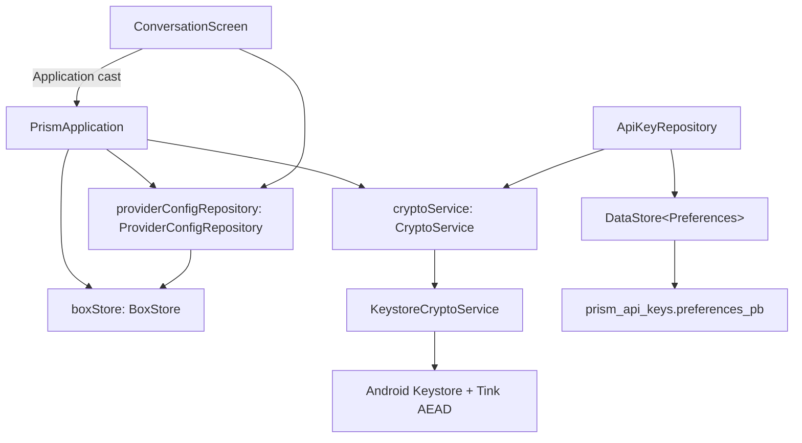

# Settings 屏幕接入 Provider 配置数据层 —— 源码考古报告

> 本报告为**简化版源码探查**，聚焦「Settings 屏幕接入 Provider 配置数据层」所需架构。
> 仅做研究，不产生代码改动。由 code-archaeologist 子 Agent 生成。

| 项目 | 内容 |
|---|---|
| 执行 Agent | code-archaeologist |
| 任务令牌 | TKN-UI-PROVIDER-001 |
| 考古日期 | 2026-08-05 |
| 考古目标 | Settings 屏幕 → ProviderConfigRepository + ApiKeyRepository 数据层接入架构 |
| 考古模式 | 简化版探查（模块职责 / 关键依赖 / 接入方案 / 风险点） |

---

## 1. 模块职责与关键依赖

### 1.1 已探查文件清单

| 文件 | 职责 | 关键暴露点 |
|---|---|---|
| `app/src/main/java/io/prism/PrismApplication.kt` | 应用入口，初始化 ObjectBox + 加密/仓库延迟单例 | 暴露 `boxStore`、`cryptoService`、`providerConfigRepository`（均 `lazy`） |
| `app/src/main/java/io/prism/MainActivity.kt` | 单 Activity，`setContent { PrismTheme { PrismApp() } }` | 无数据层接口 |
| `app/src/main/java/io/prism/ui/PrismApp.kt` | 4 Tab NavHost 根导航（`PrismDestinations`） | `SettingsScreen()` 为无参叶子路由 |
| `app/src/main/java/io/prism/ui/chat/ConversationScreen.kt` | 聊天屏，演示 **Application cast 取仓库**的既有模式 | `context.applicationContext as? PrismApplication` |
| `app/src/main/java/io/prism/ui/chat/ConversationViewModel.kt` | 无参构造 ViewModel（默认 `viewModel()` 工厂） | 无依赖注入需求 |
| `app/src/main/java/io/prism/ui/settings/SettingsScreen.kt` | 静态设置列表 | 无参 Composable，无 ViewModel/导航 |
| `app/src/main/java/io/prism/data/ProviderConfigRepository.kt` | Provider CRUD + 激活管理 | `getAll/save/remove/setActive/createFromPreset/activeProviderFlow` |
| `app/src/main/java/io/prism/security/ApiKeyRepository.kt` | API Key 加密存储（DataStore + Tink AEAD） | `saveApiKey/readApiKey/removeApiKey/removeAllApiKeys` |
| `app/src/main/java/io/prism/security/CryptoService.kt` | 加密接口（接口抽象，支持测试隔离） | `encrypt/decrypt` |
| `app/src/main/java/io/prism/security/KeystoreCryptoService.kt` | 生产加密实现（Keystore + Tink AEAD） | 主密钥 `prism_master_key_v1` |
| `gradle/libs.versions.toml` | 依赖版本中心 | `lifecycle-viewmodel-compose = 2.8.3`、`datastore = 1.1.1` |
| `app/build.gradle.kts` | 构建配置 | 已含 `lifecycle-viewmodel-compose`、`datastore-preferences` |

### 1.2 数据层依赖拓扑



**关键结论**：`PrismApplication` 目前**未暴露** `ApiKeyRepository`，也**未暴露** `DataStore<Preferences>`。`ApiKeyRepository` 在生产侧尚无任何实例化点（仅测试态通过 `FakePreferenceDataStore` 构造，见 `app/src/test/java/io/prism/security/ApiKeyRepositoryTest.kt` 第 40 行）。

---

## 2. 待明确问题结论与建议方案

### Q1. 依赖注入模式：Settings 应如何获取 repository

**现状证据**：
- `PrismApplication.kt` 文档第 17 行明确「后续可通过 Hilt 注入或 Application cast 访问」。
- `ConversationScreen.kt` 第 86-88 行采用既有模式：`val app = context.applicationContext as? PrismApplication`，再读 `app?.providerConfigRepository?.activeProviderFlow`。
- `ADR-002` 第 4.3 节决策「本 US 不引入 Hilt」，第 4.5 节「仅展示读 activeProviderFlow」。

**结论**：项目当前**无 Hilt**，DI 模式为**手动 + Application cast**。Settings 应沿用同一模式，但**推荐将 cast 下沉到 ViewModel**（经 `CreationExtras[APPLICATION_KEY]` 获取 Application），而非在 Composable 中直接 cast——理由见 Q3。

**建议方案（推荐）**：`SettingsViewModel` 在构造时接收 `ProviderConfigRepository` 与 `ApiKeyRepository`，由 `viewModel { }` initializer 通过 `APPLICATION_KEY` 从 `PrismApplication` 取实例。Composable 层保持无数据层依赖，仅持 ViewModel。

**备选方案（保守）**：完全复制 `ConversationScreen` 的 Composable 内 cast 模式。缺点：与「数据层逻辑进 ViewModel」分层意图冲突，且 API Key 读写需在 Composable 内触发协程。

---

### Q2. ApiKeyRepository 的 DataStore 来源

**现状证据**：
- `ApiKeyRepository.kt` 构造签名第 27-30 行：`(dataStore: DataStore<Preferences>, cryptoService: CryptoService)`。
- `PrismApplication` 暴露了 `cryptoService`（lazy），但**未暴露** `DataStore` 或 `ApiKeyRepository`。
- `ApiKeyRepository.kt` 文档第 18 行确认 DataStore 文件名为 `prism_api_keys.preferences_pb`。
- `gradle/libs.versions.toml` 已含 `androidx-datastore-preferences = 1.1.1`。

**结论**：Settings 无现成 DataStore 可用，**必须在 `PrismApplication` 中新增暴露**。Preferences DataStore 官方要求单例（多实例会抛 `IllegalStateException`），故必须由 Application 持有。

**建议方案（推荐）**：在 `PrismApplication` 新增：

```kotlin
private val apiKeyDataStore: DataStore<Preferences> by lazy {
    PreferenceDataStoreFactory.create(
        produceFile = { preferencesDataStoreFile("prism_api_keys") }
    )
}
val apiKeyRepository: ApiKeyRepository by lazy {
    ApiKeyRepository(apiKeyDataStore, cryptoService)
}
```

- `preferencesDataStoreFile("prism_api_keys")` 生成 `prism_api_keys.preferences_pb`，与 `ApiKeyRepository` 文档注释一致。
- 直接暴露 `apiKeyRepository`（而非裸 DataStore），保持 DataStore 私有、外部只读写业务 API，符合封装。

**注意**：`PrismApplication` 已存在 `cryptoService` lazy，`apiKeyRepository` lazy 引用它即可复用同一加密服务，避免多 Keystore 实例。

---

### Q3. ViewModel 模式：SettingsViewModel 的工厂方式

**现状证据**：
- `ConversationViewModel` 无参构造，`ConversationScreen.kt` 第 81 行用默认 `viewModel()`（ViewModelProvider 默认工厂）。
- `gradle/libs.versions.toml` 第 6 行 `lifecycleRuntimeKtx = "2.8.3"`，`lifecycle-viewmodel-compose` 同版本（第 22 行引用同 ref）。
- `app/build.gradle.kts` 第 64 行已 `implementation(libs.androidx.lifecycle.viewmodel.compose)`。

**结论**：`lifecycle-viewmodel-compose 2.8.3` **同时支持两种注入方式**：
1. `viewModel(factory = ...)`（`ViewModelProvider.Factory`，`viewModelFactory` DSL，2.5.0+ 支持）。
2. `viewModel { SettingsViewModel(...) }`（`initializer` 重载，lifecycle-viewmodel 2.5.0+ 支持，`CreationExtras` 提供 `APPLICATION_KEY`）。

**建议方案（推荐）**：使用 `viewModel { }` initializer + `APPLICATION_KEY`，最简洁：

```kotlin
@Composable
fun SettingsScreen(
    viewModel: SettingsViewModel = viewModel {
        val app = this[APPLICATION_KEY] as PrismApplication
        SettingsViewModel(app.providerConfigRepository, app.apiKeyRepository)
    }
)
```

**理由**：2.8.3 完全支持；`APPLICATION_KEY` 由 `AndroidViewModelFactory` 自动填充，无需自定义 Factory；改动量最小，与既有 `viewModel()` 调用点风格一致。

---

### Q4. 现有 Settings 静态 UI 结构

**现状证据**（`SettingsScreen.kt` 第 52-140 行）：

| 分组 | 行 | 响应式行 | 需接入数据层 | 说明 |
|---|---|---|---|---|
| 模型与端点 | **Provider 配置** | 行 64-71 | **是** | 需 ProviderConfigRepository + 导航到详情页 |
| 模型与端点 | **API Key** | 行 72-79 | **是** | 需 ApiKeyRepository 读/写，副标题「Keystore 加密 · 已启用」为静态文案 |
| 隐私与安全 | 生物识别解锁 | 行 81-89 | 否（本次） | `remember` 本地状态 + `PrismSwitch` |
| 设备档位 | 性能档位 | 行 91-129 | 否（本次） | `remember` 本地状态，三档胶囊 |
| 关于 | 关于 Prism | 行 131-138 | 否 | 静态 |

**结论**：本次需接入数据层的仅 **Provider 配置** 与 **API Key** 两行。`SettingsScreen()` 当前为无参叶子 Composable，且是底部 Tab 叶子路由（`PrismApp.kt` 第 87 行 `composable(SETTINGS) { SettingsScreen() }`），**尚无详情页导航**。

**建议方案**：
- 为使「Provider 配置」行可点击进入详情页，需在 `PrismApp.kt` NavHost 新增叶子路由（如 `settings/provider`、`settings/provider/{id}`），或改用嵌套 nav graph。`SettingsScreen` 需接收 `onNavigateToProviderDetail` 回调或 `NavController`。
- 「API Key」行可升级为可编辑详情页，或直接在当前设置项内触发读写（推荐独立详情页，避免列表页内并发 I/O）。

---

### Q5. Provider 数据流：Settings 如何订阅 Provider 列表

**现状证据**（`ProviderConfigRepository.kt`）：
- 暴露 `getAll(): List<ProviderConfig>`（第 59 行，同步 `box.all.sortedBy { it.createdAt }`）。
- 暴露 `activeProviderFlow: StateFlow<ProviderConfig?>`（第 32 行），仅在 `refreshActiveProvider()`（第 146 行）处更新，而 `refreshActiveProvider()` 仅在 `init`（第 35 行）、`setActive`（第 105 行）、`clearActive`（第 123 行）调用。
- **无列表 Flow**。

**关键缺陷**：`activeProviderFlow` 在 `save()`/`remove()`/`createFromPreset()` 后**不会刷新**（不改变激活态时合理，但若新增 Provider 后需要列表刷新则无机制）。

**结论**：现有仓库**无 Provider 列表 Flow**。Settings 详情页若要展示可增删改的 Provider 列表，需新增列表订阅能力，不能依赖 `activeProviderFlow`。

**建议方案（推荐）**：在 `ProviderConfigRepository` 新增 `providers: StateFlow<List<ProviderConfig>>`，与 `activeProviderFlow` 同构：

```kotlin
private val _providers = MutableStateFlow<List<ProviderConfig>>(emptyList())
val providers: StateFlow<List<ProviderConfig>> = _providers.asStateFlow()

// 在 save/remove/removeAll/setActive/clearActive/createFromPreset 末尾统一调用
private fun refreshProviders() { _providers.value = box.all.sortedBy { it.createdAt } }
```

**备选方案（不推荐）**：Settings ViewModel 内轮询 `getAll()`（如 `snapshotFlow` 或定时刷新）。缺点：`getAll()` 是同步 `box.all` 查询，主动轮询浪费资源且非实时，违反「响应式订阅」惯性。

**备注**：若 Settings 详情页仅需一次性读取（如编辑单个 Provider），可直接用 `get(id)`/`getAll()` 同步读取，无需 Flow；但列表页增删后需刷新，Flow 方案更优。

---

## 3. 潜在风险点

| 风险 | 等级 | 证据 / 说明 |
|---|---|---|
| DataStore 多实例崩溃 | 高 | Preferences DataStore 官方要求单例；若在 Application 外再 `PreferenceDataStoreFactory.create` 会抛 `IllegalStateException`。必须由 `PrismApplication` 持有并注入 |
| `activeProviderFlow` 不随 `save/remove` 刷新 | 中 | `refreshActiveProvider()` 仅在 `init/setActive/clearActive` 调用；新增列表 Flow 时须在 `save/remove/createFromPreset` 也刷新，否则列表与实际不符 |
| 列表 Flow 与 active Flow 双状态不一致 | 中 | 若同时维护 `providers` 与 `activeProviderFlow`，需保证二者在同一事务后一致刷新（参照 `setActive` 的 `runInTx` 原子性，`BR-concurrency-001`） |
| Settings 无详情页导航 | 中 | `SettingsScreen` 是底部叶子路由（`PrismApp.kt` 第 87 行），接入详情页需改 NavHost 结构（新增路由或嵌套 graph），属 P2 跨模块变更 |
| `viewModel { }` initializer 类型安全 | 低 | `APPLICATION_KEY` 需强转 `as PrismApplication`；若自定义 Application 未注册（Manifest）会 cast 失败，需确认 Manifest `android:name` 指向 `PrismApplication` |
| API Key 明文泄露 | 高 | 遵循 `ApiKeyRepository` 既有保证：明文仅内存短暂存在，DataStore 只存密文，日志禁止输出（`BR-security-002`）；Settings 输入框不得将明文写入状态持久化 |
| minSdk 26 与 DataStore 兼容 | 低 | `datastore-preferences 1.1.1` 支持 API 21+，minSdk 26 无碍 |
| 同步 `getAll()` 在主线程 | 中 | `box.all` 为同步查询，若在 Compose 组合/主线程调用可能卡顿；Flow 方案应在 `viewModelScope` 中收集，避免主线程阻塞 |

---

## 4. 结论摘要

1. **DI 模式**：项目无 Hilt，沿用「Application cast」手动 DI。推荐将 cast 下沉到 `SettingsViewModel` 构造（经 `APPLICATION_KEY`），而非在 Composable 中 cast。
2. **ApiKeyRepository 来源**：`PrismApplication` 需新增暴露 `apiKeyRepository`（lazy），内部用 `PreferenceDataStoreFactory.create` + `preferencesDataStoreFile("prism_api_keys")` 构建 DataStore，复用现有 `cryptoService`。
3. **ViewModel 工厂**：`lifecycle-viewmodel-compose 2.8.3` 支持 `viewModel { }` initializer + `APPLICATION_KEY`，为推荐方式。
4. **静态 UI**：仅「Provider 配置」与「API Key」两行需接入数据层；`SettingsScreen` 需支持详情页导航（改 `PrismApp.kt` NavHost）。
5. **Provider 数据流**：现有仓库**无列表 Flow**，需在 `ProviderConfigRepository` 新增 `providers: StateFlow<List<ProviderConfig>>` 并在所有变更操作后刷新，优于轮询 `getAll()`。

**架构漂移提示**：`PrismApplication.kt` 文档第 17 行「后续可通过 Hilt 注入或 Application cast 访问」的表述，与 ADR-002「不引入 Hilt」决策一致；本次接入**不引入 Hilt**，符合 ADR-002 4.3 与 Karpathy「避免过度设计」原则。