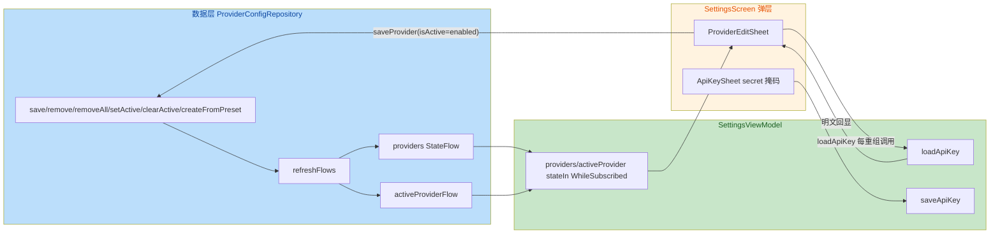

# 安全与质量审计报告（Settings 集成改动集）

> 依 CLAUDE.md 第七节 / 第十节，由 guardrail-enforcer 子 Agent 独立执行。
> 覆盖范围：主 Agent 上下文基线 9.1 所列完整改动集（生产代码 + 本轮新增/修改测试），
> 含上一轮完成、本轮补审的 Settings 集成生产代码。任务令牌机制见 CLAUDE.md 20.4。

| 项目 | 内容 |
|---|---|
| 执行 Agent | guardrail-enforcer |
| 任务令牌 | TKN-SETTINGS-001 |
| 审计日期 | 2026-08-05 |
| 关联 ADR | docs/decisions/ADR-003-prism-provider-config-settings.md |
| 关联代码变更 | ProviderConfigRepository / PrismApplication / SettingsViewModel / SettingsScreen / PrismField / PrismSheetHost / PrismSegmented / KnowledgeBaseScreen / CapabilitiesScreen / ApiKeyRepository + 对应测试 |
| 审计范围 | 生产代码 9 文件 + 测试 4 文件（含补审的上一轮生产代码） |

---

## 1. 代码质量审查（TRAE-code-review）

### 1.1 变更意图推断

将 US-003（API Key 加密存储）与 US-004（Provider 配置 CRUD）数据层接入设置界面，
提供 Provider 配置详情页（预设添加 / 编辑 / 激活 / 删除 / API Key 掩码读写），
并新增 `providers` StateFlow 与 `SettingsViewModel` 桥接数据层与 Compose UI。

📊 **技术流变更总览**



### 1.2 Karpathy Guidelines 符合性

- **命名**：`refreshFlows` / `_selectedProvider` / `consumeEvent` / `_payload` 等命名清晰、语义明确。✔
- **设计**：单一 `refreshFlows()` 统一维护列表与激活态，符合「单一事实来源」。✔
- **错误处理**：`ApiKeyRepository.readApiKey` 解密失败捕获返回 null（不崩溃），符合「Fail Fast」边界内 graceful 处理。✔
- **边界**：`PrismSegmented` 新增 `if (options.isEmpty()) return` 守卫，先行于尺寸除法，修复除零。✔（line 48 守卫早于 line 56 除法，正确）

### 1.3 发现的逻辑缺陷

| # | 严重度 | 问题 | 位置 |
|---|---|---|---|
| Q1 | 高 | 「设为激活 Provider」开关经 `saveProvider` 直接写 `isActive`，绕过 `setActive` 的 `runInTx` 单激活不变式，可致多 Provider 同时激活 | app/src/main/java/io/prism/ui/settings/SettingsScreen.kt:[298,314]、app/src/main/java/io/prism/data/ProviderConfigRepository.kt:[48,52] |
| Q2 | 高 | `ProviderEditSheet` 在组合体内直接调 `loadApiKey`（无 `LaunchedEffect`/`loaded` 守卫），每次重组重读并覆盖 `apiKey` 状态 | app/src/main/java/io/prism/ui/settings/SettingsScreen.kt:[275,277] |
| Q3 | 中 | `payload` 一次性提示为死代码：SettingsScreen 消费块为空操作，`consumeEvent()` 生产端从未被调用，提示永不显示/清空 | app/src/main/java/io/prism/ui/settings/SettingsScreen.kt:[80,84]、app/src/main/java/io/prism/ui/settings/SettingsViewModel.kt:[110,112] |
| Q4 | 低 | `_apiKeyLoading` 状态暴露但 UI 未收集，为死状态；`loadApiKey` 在每 Provider 上重复启动解密 | app/src/main/java/io/prism/ui/settings/SettingsViewModel.kt:[51,53] |

#### Q1 详析（状态机不变式违反）

`ProviderConfigRepository.setActive`（[107,120]）通过 `boxStore.runInTx` 保证「取消其他 + 激活目标」原子性，
且 `save()`（[48,52]）仅 `box.put` 后 `refreshFlows()`，**不**执行去激活。

ProviderEditSheet [298,314] 的开关 `enabled` 经：

```kotlin
viewModel.saveProvider(config.copy(..., isActive = enabled))
```

直接写入 `isActive=true`。若 Provider A 已激活，用户对 B 打开开关并保存，则 A、B 同时 `isActive=true`。
触发路径真实可达（开关 → 保存按钮）。后果：`refreshFlows()` 中
`_activeProviderFlow.value = _providers.value.find { it.isActive }`（[162]）取首个激活，
列表「激活」徽标（SettingsScreen [242,244]）仅标记首个，第二个激活态静默存在且不可见，
后续 US-007 选择激活 Provider 时可能命中错误端点。

#### Q2 详析（组合体副作用 + 数据覆盖）

ApiKeySheet [344,352] 用 `var loaded by remember(...)` 守卫，仅首次加载。ProviderEditSheet [275,277] 无此守卫：

```kotlin
viewModel.loadApiKey(config.apiKeyRef) { loaded ->
    if (loaded != null) apiKey = loaded
}
```

每次重组（用户编辑 name/baseUrl/models、切换开关）重复启动 `loadApiKey` 协程，读取旧存值并覆盖 `apiKey` 状态。
后果：① 用户正在编辑 API Key 时，改任一其他字段即触发重组，`apiKey` 被重置为旧存值；② 用户清空 Key 字段后，
下次重组又回填旧值，**无法清空已存 Key**。与 ApiKeySheet 处理不一致（同一文件内两处模式分叉）。

#### Q3 详析（死代码 / 未闭环）

SettingsScreen [80,84]:

```kotlin
if (payload.isNotEmpty()) {
    // 简单提示：在此不引入 Snackbar，交由详情弹层标题/副标题承载；消费防止重复
    Unit
}
```

`consumeEvent()`（SettingsViewModel [110,112]）在生产 UI 无任何调用点。`saveProvider`/`createFromPreset`/`deleteProvider`/`saveApiKey`
写入的 `_payload`（"已保存 X"/"API Key 已加密保存" 等）**永不显示、永不消费**。注释称「交由详情弹层承载」但各弹层未引用 `payload`。
属功能缺口 + 死代码，非安全泄露（payload 不含明文 Key，仅 Provider 名与通用文案）。

### 1.4 跨模块影响识别

- `providers` StateFlow 新增为公开只读属性，向后兼容，无 BREAKING CHANGE。✔
- `apiKeyRepository` lazy 复用进程级 DataStore 单例，`preferencesDataStore` 顶层委托正确。✔
- `providers` 当前无其他消费者（仅 SettingsViewModel），`apiKeyRepository` 仅 SettingsViewModel.Factory 使用。✔
- PrismField `secret` 参数默认 false，向后兼容。✔

### 1.5 测试充分性

- `SettingsViewModelTest`：覆盖 providers 列表增改删、activeProvider、selectedProvider、API Key 读写、payload/consumeEvent。充分。
  但 **测试未覆盖 Q1（多激活不变式）与 Q2（重组重复 loadApiKey）两个缺陷**——因测试直接调用 VM 方法，未走重组路径，
  无法暴露组合体副作用缺陷。建议补 UI 级 / 状态级用例。
- `ProviderConfigRepositoryTest`：新增 `providers` StateFlow 用例完整（save/remove/createFromPreset/排序/初始空）。
- `ConversationViewModelTest`：修复 Main dispatcher + 错误断言，正确使用 `UnconfinedTestDispatcher` + `advanceUntilIdle`。
- `ApiKeyRepositoryTest`：明文不落盘/解密失败返回 null 等安全契约覆盖充分。

---

## 2. 安全漏洞扫描（TRAE-security-review）

### 2.1 输入与边界审计

- **Provider 名称**：`saveProvider` 中 `name.trim().ifEmpty { config.name }`，空名回退原名，无长度上限。单一本地字段，无注入面。
- **Base URL**：`baseUrl.trim()`，未做 scheme 白名单校验。当前改动集内无网络消费方（US-007 尚未接入发起请求），
  无 SSRF 可达路径。**建议**在接入网络调用前于 US-007 补充 `http/https` scheme 校验。
- **模型解析**：`models.split(",").map{trim}.filter{isNotEmpty}`，无越界/异常风险。
- **数值/集合边界**：`PrismSegmented` 空 options 守卫正确；`ProviderConfigRepository` 的 `box.all` 由 ObjectBox 管理，无手工索引越界。

### 2.2 执行安全审计（注入 / 最小权限 / 输出编码）

- **注入**：数据层为 ObjectBox（非 SQL/NoSQL 字符串拼接），无 SQL/命令/code 注入面。`PrismField` 输入未进入任何 `eval`/shell/模板。✔
- **最小权限**：无高权限操作；CapabilitiesScreen 中的 `baseUrl`/`token` 为本地 mock 展示，未落盘。✔
- **输出编码**：原生 Compose 渲染，无 HTML/XSS 上下文。✔

### 2.3 密钥与配置安全

- **明文不落盘**：`ApiKeyRepository.saveApiKey` 经 `CryptoService.encrypt` → DataStore 存密文；DataStore 文件仅含密文。✔
- **日志脱敏**：`ApiKeyRepository` 无日志输出；`payload` 不含明文 Key。✔
- **硬编码密钥**：改动集内无硬编码 API Key/Token/密码。ProviderPresets 的 `baseUrl` 为公开端点、`apiKeyRef` 为标识符，非机密。✔
- **掩码正确性**：`PrismField` 将 `PasswordVisualTransformation()` 作用于 `BasicTextField` 的 `visualTransformation`（line 70），
  显示层掩码确实生效；底层 `value`/`key` 状态仍持明文（内存态，设计内）。✔ 未出现误用于 `Text` 的情况。✔
- **DataStore 单例线程安全**：`PrismApplication` 用顶层 `preferencesDataStore` 委托保证进程级单例，避免多实例崩溃。✔
- **明文内存滞留**：`loadApiKey` 明文仅存在于 ViewModel 局部变量与 Composable `key`/`apiKey` 状态，弹层关闭即随重组释放。符合 US-003 契约。✔

### 2.4 依赖与供应链风险

- 本次改动集**无依赖变更**（lottie-compose 为上一轮 US-005 引入，不在本 diff）。无锁文件/依赖文件改动，无新增供应链风险。✔

### 2.5 ObjectBox 跨线程 stderr 噪音（主 Agent 自问核查）

- 现象：完整测试套件中 ObjectBox 打印 "Aborting a read transaction in a non-creator thread is a severe usage error"。
- 分析：`refreshFlows()` 的 `box.all` 为**物化读取**（materialized list），非惰性游标，读取事务短暂；生产环境 BoxStore 不关闭。
  噪音更可能源自测试 `tearDown` 中 `boxStore.close()` 时对 `_providers.value` 持有的托管实体/内部游标的清理。
- 结论：**低风险，非生产隐患**；但为排除「掩盖真实跨线程隐患」，建议在继续开发周期时由 `ac-verifier` 或 `TRAE-debugger`
  在真实设备/线程调度下复现确认 `setActive`/`clearActive` 的 `runInTx` 无跨线程问题（当前代码路径为单线程 UI 调用，逻辑上安全）。

---

## 3. OWASP / CWE 发现

安全面（注入 / 硬编码密钥 / 明文落盘 / XSS / 命令注入 / eval）经扫描**无可利用漏洞**。
以下为完整性/状态机类缺陷（非传统 CWE，但属需修复的高风险逻辑缺陷）：

| 编号 | 等级 | 位置 | 修复建议 |
|---|---|---|---|
| S1 | 高（完整性/状态机） | app/src/main/java/io/prism/ui/settings/SettingsScreen.kt:[298,314] | 保存时若 `enabled=true`，改走 `setActive(config.id)`；或让 `ProviderConfigRepository.save` 在事务内自动去激活其他 Provider，统一收敛不变式 |
| S2 | 高（数据覆盖/不可清空） | app/src/main/java/io/prism/ui/settings/SettingsScreen.kt:[275,277] | 将 `loadApiKey` 移入 `LaunchedEffect(config.id)` 或加 `loaded` 守卫（与 ApiKeySheet 一致），避免重组重复加载覆盖用户输入 |
| S3 | 中（死代码/未闭环） | app/src/main/java/io/prism/ui/settings/SettingsScreen.kt:[80,84] | 接入真实提示（Snackbar/内联文案）并调用 `consumeEvent()`；或移除 payload 机制 |

---

## 4. 结论

- [x] **通过**（可进入测试阶段；见下方「复审结论」）
- [ ] 阻断（存在严重缺陷或高危漏洞，回退编码阶段）
- [ ] 有条件通过（上一轮结论，S1/S2/S3 已在本轮复审确认修复）

> 判定依据：本改动集**安全面（加密 API Key 处理 / 无注入 / 无硬编码 / 掩码 / DataStore 单例）全部通过，无阻断级漏洞**
> （无 SQL 注入、无命令注入、无 eval、无明文密钥落盘、无日志泄露）。但存在：
>
> - **S1**：单一激活不变式被开关路径绕过（可致多 Provider 同时激活，影响后续 Provider 选择正确性）；
> - **S2**：`loadApiKey` 组合体副作用导致 API Key 字段被旧值覆盖、无法清空；
> - **S3**：payload 一次性提示死代码，保存/删除/API Key 操作结果对用户不可见。
>
> 依「零容忍侥幸」原则，上述缺陷须修复。修复后须按第七节 7.2 重新提交 guardrail 审查，通过后方可启动 ac-verifier。

### 4.1 必须修复清单（S1 / S2 / S3）

1. **S1**：`ProviderEditSheet` 保存逻辑中，当 `enabled=true` 时改为调用 `viewModel.setActive(config.id)`，
   或重构 `ProviderConfigRepository.save` 使其在写入事务内自动将其他 Provider 置为非激活（与 `setActive` 保持一致）。
   修复后补充「切换激活不变式」测试用例（先激活 A，再经 save 激活 B，断言 A.isActive=false）。
2. **S2**：`ProviderEditSheet` 用 `LaunchedEffect(config.id) { viewModel.loadApiKey(...) }` 包裹加载，
   或加 `var loaded by remember(config.id)` 守卫（与 ApiKeySheet [344,352] 对齐），消除重复加载与覆盖。
3. **S3**：在 SettingsScreen 中接入真实提示承载（如 `PrismSheet` 内联文案或 Snackbar），并在展示后调用
   `viewModel.consumeEvent()`；或删除 `payload`/`consumeEvent` 及对应测试，避免死代码误导。

### 4.2 建议项（非阻塞）

- US-007 接入网络调用前，对 `baseUrl` 补充 `http`/`https` scheme 白名单校验。
- 在真实设备/线程下复现确认 ObjectBox `runInTx` 无跨线程隐患（ObjC 噪音疑为测试 teardown，需确认）。
- 对 `SettingsViewModel` 的 `stateIn(WhileSubscribed)` 在真实设备上的传播/退订时序做一次冒烟验证（UnconfinedTestDispatcher 与真实调度存在差异，ADR 已记录）。

---

## 5. 规则提议（accepted review → behavioral-rules）

以下 review comment 建议追加至 `docs/behavioral-rules.md`，经 guardrail 确认重复性后采纳：

| 类别 | 规则 | 反例 | 正例 | 来源 |
|---|---|---|---|---|
| concurrency | 持「单一激活」类业务不变式的写入，必须集中于单一入口（如 `setActive` 的 `runInTx`），禁止经通用 `save`/`put` 直接写状态字段 | 开关经 `save(config.copy(isActive=true))` 直写 | 走 `setActive(id)` 或 `save` 内在事务中自动去激活 | ADR-003 / S1 |
| concurrency | 组合体不得直接以副作用方式调用 `load*`（读仓库/解密），须用 `LaunchedEffect` 或 `remember` 守卫防重组重复执行 | 组合体内直接 `viewModel.loadApiKey(...)` | `LaunchedEffect(config.id) { viewModel.loadApiKey(...) }` | ADR-003 / S2 |
| docs | 一次性事件（payload）若非空即须有消费方，禁止「写入却不消费」的死代码 | `if(payload.isNotEmpty()){ Unit }` | 展示后调 `consumeEvent()` 或移除机制 | ADR-003 / S3 |

---

## 6. 自动化建议（CI/CD Integration）

建议在 `.github/workflows/` 增加设置模块守卫流水线，供后续合并前置拦截：

```yaml
# 示例：settings-security-scan.yml（供参考，非本次强制交付）
name: settings-guardrail
on: [pull_request]
jobs:
  guardrail:
    runs-on: ubuntu-latest
    steps:
      - uses: actions/checkout@v4
      - run: ./gradlew :app:testDebugUnitTest --tests "*SettingsViewModelTest" --tests "*ProviderConfigRepositoryTest"
      # 静态检查：detekt 自定义规则禁用「组合体副作用加载」与「非单一入口写状态字段」
      - run: ./gradlew detekt
  secret-scan:
    runs-on: ubuntu-latest
    steps:
      - uses: actions/checkout@v4
      - uses: gitleaks/gitleaks-action@v2   # 扫描硬编码密钥/令牌
      - run: npm audit --omit=dev            # 若引入 JS 工具链
```

> 说明：本改动集无依赖变更，`npm audit`/`pip-audit` 建议在引入新依赖的变更中启用；当前仅作示例。

---

## 7. 复审结论（S1 / S2 / S3 修复验证，任务令牌 TKN-SETTINGS-001）

| 项目 | 内容 |
|---|---|
| 执行 Agent | guardrail-enforcer |
| 任务令牌 | TKN-SETTINGS-001（复审，同一任务周期） |
| 复审日期 | 2026-08-05 |
| 复审范围 | ProviderConfigRepository.kt / SettingsViewModel.kt / SettingsScreen.kt / SettingsViewModelTest.kt / ProviderConfigRepositoryTest.kt 最新版 |
| 复审结论 | **通过**（S1/S2/S3 修复正确，无新增阻断级缺陷） |

### 7.1 S1 —— 单激活不变式（已修复，正确）

**数据层兜底**（app/src/main/java/io/prism/data/ProviderConfigRepository.kt:52-67）：`save()` 现以 `boxStore.runInTx` 包裹；当 `config.isActive==true` 时，在同一事务内先对 `box.all` 中所有 `id != config.id && isActive` 的 Provider 置 false 并 `put`，再 `put(config)`。`refreshFlows()` 在事务外统一刷新。原子性保证成立：中途异常则整体回滚，不会留下多个激活。与 `setActive`（:122-135）的 `runInTx` 模式一致，单一事实来源收敛至仓库层。

- 事务内 `box.all` 为物化快照，循环内 `put(other)` 不触发并发修改异常（与既有 `setActive` 同模式）。✔

**UI 层修正确认**（app/src/main/java/io/prism/ui/settings/SettingsScreen.kt:303-317）：保存时改为 `config.copy(..., isActive = false)` 经 `saveProvider` 落库，随后 `if (enabled) viewModel.setActive(config.id)`。激活态不再直写 `isActive=true`，统一经 `setActive` 事务处理。✔

- 场景校核：编辑「当前激活」Provider（enabled=true）→ save 置 false → setActive 重激活，净态仍激活；编辑「非激活」且 enabled=true → setActive 会取消其他激活并激活目标；enabled=false → 保持非激活。所有路径不违反单激活不变式。✔
- 新建路径安全性：`ProviderEditSheet` 仅由 `ProviderListSheet.onSelect`（既有 Provider）触发，`config.id` 恒 >0，`setActive(config.id)` 不会命中不存在的 id=0。✔

**不变式测试**（app/src/test/java/io/prism/data/ProviderConfigRepositoryTest.kt）：

- `save_active_config_deactivates_others`（:247-257）：保存 A、B（均非激活），再「经通用 save 直写 A.isActive=true」，断言 A 激活、B 被取消。真实覆盖「绕过 setActive 直写」这一兜底场景。✔
- `save_active_new_config_deactivates_existing`（:259-268）：保存 A 并 setActive(A)，再经 save 写入 B(isActive=true)（新建），断言 A 被取消、B 激活。覆盖「新建即激活」场景。✔

两用例均命中 `save()` 的 runInTx 去激活分支，判定为真正覆盖不变式。✔

### 7.2 S2 —— loadApiKey 重组覆盖（已修复，正确）

app/src/main/java/io/prism/ui/settings/SettingsScreen.kt:266-275：`ProviderEditSheet` 新增 `var apiKeyLoaded by remember(config.id)`，以 `if (!apiKeyLoaded) { viewModel.loadApiKey(...) { ...; apiKeyLoaded = true } }` 守卫，仅首次回显，与 `ApiKeySheet`（:346-354）模式对齐。重组不再重复启动解密 / 覆盖 `apiKey` 状态。✔

**可清空语义保留**：`loadApiKey` 回调仅在 `loaded != null` 时回填 `apiKey`；用户清空字段后，`apiKeyLoaded` 已为 true，重组不回填旧值。保存时 `saveApiKey(ref, "")` 将加密空串落盘，下一次打开回显为空，字段可清空。✔

### 7.3 S3 —— payload 死代码（已修复，彻底移除）

- 全局检索确认生产代码与测试代码已**无任何** `payload` / `_payload` / `consumeEvent` 引用（残留仅存在于本报告历史记录与文档注释，见 7.4）。
- `SettingsViewModel.kt`：`_payload` / `payload` / `consumeEvent()` 及所有 `_payload.value=` 写入均已删除；import 全部仍被使用（`first`→loadApiKey、`stateIn`、`launch` 等），无未用 import。✔
- `SettingsScreen.kt`：空消费块已删除，`onConsumeEvent` 相关调用已随 `SettingsViewModel` 一并移除，无死代码。✔
- `SettingsViewModelTest.kt`：payload 相关断言已删除，其余用例（saveProvider / createFromPreset / deleteProvider / setActive / selectProvider / saveApiKey / loadApiKey）完整；import 全部使用，编译应通过。✔

### 7.4 快速安全复核

- **API Key 明文不落盘**：`ApiKeyRepository.saveApiKey` 仍经 `CryptoService.encrypt` → DataStore 存密文（ApiKeyRepository.kt:38-43）；`loadApiKey` 明文仅内存短暂存在。✔
- **无硬编码密钥**：改动集内无硬编码 API Key / Token / 密码；`ProviderConfig` 的 `apiKeyRef` 为标识符、`baseUrl` 为公开端点。✔
- **无注入面**：数据层为 ObjectBox（非 SQL 字符串拼接），`PrismField` 输入不进入 eval / shell / 模板；原生 Compose 无 HTML/XSS 上下文。✔
- **无新增依赖**：本轮改动无依赖文件变更，无供应链新增风险。✔

### 7.5 新增非阻断项（低严重度，建议随本周期或文档清理一并处理）

| # | 严重度 | 问题 | 位置 |
|---|---|---|---|
| R1 | 低 | `PrismDanger` import 未使用（删除按钮用 `PrismButtonVariant.Danger`，非 `PrismDanger`） | app/src/main/java/io/prism/ui/settings/SettingsScreen.kt:46 |
| R2 | 低 | 类头文档注释仍列「4. payload 一次性提示」，与实际已移除的机制不符（仅文档残留，不影响编译） | app/src/test/java/io/prism/ui/settings/SettingsViewModelTest.kt:35 |
| R3 | 低 | ADR-003:53 仍将 `payload`/`consumeEvent` 列为 ViewModel 暴露状态，与实现不符（文档漂移，按 CLUADE.md 第十四节应同步） | docs/decisions/ADR-003-prism-provider-config-settings.md:53 |

> R1/R2 为纯代码整洁度 / 文档残留，不构成质量或安全缺陷；R3 为文档漂移，建议主 Agent 在进入下一里程碑一致性审计前更新 ADR-003，删除 payload 相关描述。三者均**不阻断**进入 ac-verifier 与合并。

### 7.6 复审总判定

原有 S1（高）、S2（高）、S3（中）三项修复均已核实**正确且完整**：

- S1：数据层 `save()` runInTx 去激活兜底 + UI 统一经 `setActive` + 2 条不变式测试，三层收敛，不变式得到保证；
- S2：`apiKeyLoaded` 守卫消除重组覆盖，且保留「可清空已存 Key」语义；
- S3：payload 机制生产/测试代码彻底移除，无残留引用与未用 import。

未发现修复引入新缺陷或回归；新增测试覆盖了 S1 兜底与 S2 语义。安全面（明文不落盘 / 无硬编码 / 无注入）复核通过。新增 R1/R2/R3 为非阻断性低严重度项，可随后续维护处理。

**复审结论：通过。**

> 依据：CLAUDE.md 第七节 7.2 闭环——guardrail 通过后，主 Agent 方可启动 `ac-verifier` 执行验收测试。本报告为 guardrail 阶段最终结论，验收（acceptance）报告由 `ac-verifier` 另行出具，不在本 Agent 授权范围内。
