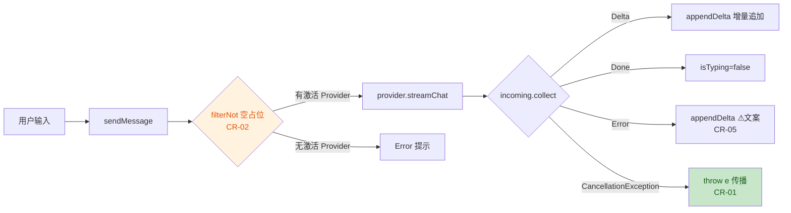

# 安全与质量审计报告 —— US-006 OpenAI 兼容 Provider 流式请求（CR-01~CR-05 修复复审）

> 由 `guardrail-enforcer` 子 Agent 生成。依 CLAUDE.md 第十节。本报告引用的代码位置使用相对路径（ADR-010）。
> 本报告是对 `2026-08-05-us006-provider-streaming-guardrail.md`（TKN-US006-GUARDRAIL-002，阻断）所列 CR-01~CR-05 修复后的复审。

| 项目 | 内容 |
|---|---|
| 执行 Agent | guardrail-enforcer |
| 任务令牌 | TKN-NETWORK-US006-001 |
| 审计日期 | 2026-08-05 |
| 关联 ADR | ADR-004-prism-provider-streaming |
| 关联代码变更 | US-006 修复复审（ChatStreamProvider / OpenAICompatibleProvider / StreamEvent / ConversationViewModel / PrismApplication / 测试 / Gradle 测试依赖） |
| 风险等级 | P2 跨模块（评审按 P3 深度执行） |

## 0. 重读与上下文重建摘要（CLAUDE.md 零节）

- 项目阶段：US-001~US-005 已验收；US-006 流式请求主实现经上一轮 guardrail（TKN-US006-GUARDRAIL-002）判定**阻断**，主 Agent 已修复 CR-01~CR-05 并重新提交本护栏复审。
- 本次任务：对修复后的 US-006 变更执行代码质量审查 + 安全审计，确认修复彻底且无回归，输出三态结论。
- 评审范围：主 Agent 提供的 8 处代码变更 + 2 处 Gradle 依赖配置。`AndroidManifest.xml` / `network_security_config.xml`（ADR-004 §4.6）不在本次 diff 内，仅作验收关注项转交 ac-verifier。
- 证据获取：通读全部变更文件、数据模型（ProviderConfig / ChatMessage / ApiKeyRepository）、Gradle 依赖、ADR-004、上一轮 guardrail 报告。

---

## 1. 代码质量审查（TRAE-code-review）

### 1.1 作者意图

修复上一轮阻断项：不吞协程取消（CR-01）、请求历史排除空占位（CR-02）、空 choices 中段快照不终止流（CR-03）、真实 401 用例（CR-04）、错误文案不泄露内部细节（CR-05），并将 SSE 解析抽为 internal 纯函数以规避 MockEngine 不支持 `SSECapability` 的测试障碍。

### 1.2 变更总览

**业务流（流式对话）：**



**技术流（SSE 消费与取消）：**

```mermaid
sequenceDiagram
    participant UI as ConversationViewModel
    participant P as OpenAICompatibleProvider
    participant K as Ktor SSE(OkHttp)
    UI->>P: streamChat(config, history)
    P->>K: Post /chat/completions (Bearer + headers)
    K-->>P: incoming events
    P->>UI: StreamEvent.Delta / Done
    UI->>P: 取消 collect
    P->>P: catch(CancellationException) throw e
    P-->>UI: 取消传播（不发射 Error）
    style P fill:#bbdefb,color:#0d47a1
```

### 1.3 CR-01~CR-05 修复核验（逐项）

| 编号 | 修复判定 | 证据位置 | 说明 |
|---|---|---|---|
| CR-01 | ✅ 彻底修复 | `OpenAICompatibleProvider.kt:[87,89]` | `catch (e: CancellationException) { throw e }` 置于 `catch (Exception)` 之前，取消不被吞并、不转 Error。新增测试 `streamChat rethrows cancellation instead of emitting error`（Test:[222,280]）形成回归防线 |
| CR-02 | ⚠️ 主向量修复，**残留边界** | `ConversationViewModel.kt:[83]` | `filterNot { it.id == aiId }` 排除刚追加的当前占位。**但仅按 id 排除当前占位，未排除历史中遗留的其他空 content 消息**（见 §1.4 发现 1）。新增测试 `request history excludes empty placeholder message`（Test:[177,194]）仅覆盖单轮 |
| CR-03 | ✅ 彻底修复 | `OpenAICompatibleProvider.kt:[148]` | `chunk.choices.isEmpty() && chunk.usage == null` 才判 Done；带 usage 的中段快照返回 null 忽略。测试 `parseChunkData ignores mid-stream usage snapshot not terminate`（Test:[133,139]）覆盖 |
| CR-04 | ✅ 彻底修复 | `OpenAICompatibleProviderTest.kt:[195,216]` | 服务器 route 对 POST /chat/completions 返回真实 `HttpStatusCode.Unauthorized`，客户端 SSE 收到非 200 抛异常 → Error。测试名与行为一致，移除未用服务器死代码 |
| CR-05 | ✅ 彻底修复 | `OpenAICompatibleProvider.kt:[92]` | `emit(StreamEvent.Error("网络请求失败，请检查网络连接或 Provider 配置"))`，无 `e.message`，无内部端点/堆栈泄露 |

### 1.4 修复后发现的残留与新关注项

#### 发现 1（中 · 建议本轮修复）CR-02 残留：请求历史仅排除当前占位，未排除历史遗留的空 AI 消息

`app/src/main/java/io/prism/ui/chat/ConversationViewModel.kt:[83]`

```kotlin
val history = _messages.value.filterNot { it.id == aiId }
provider.streamChat(active, history)
```

`filterNot { it.id == aiId }` 只排除**本次刚追加的占位**。若上一轮流式对话因服务端零增量（仅 `[DONE]`）结束，则该轮 AI 消息 content 为 `""`，在下一轮请求历史中**不会被过滤**，仍会序列化为 `{"role":"assistant","content":""}`。这与 CR-02 原始目标（空 assistant 消息不入请求体、避免严格 API 拒绝）同源，属未完全闭合的残留。

- 触发路径：turn1 服务端返回零 Delta + [DONE]（AI 消息留空）→ turn2 发送时历史含该空 assistant 消息。
- 影响：OpenAI 网关通常接受空字符串 content；Anthropic 兼容及部分严格网关会拒绝（400）。属协议兼容风险，非安全漏洞。
- 概率：中低，但与原 CR-02 同源，且原始判定阻断，「零容忍侥幸」标准下应闭合。
- 建议：将过滤泛化为排除所有空 content 的 assistant 占位，例如 `_messages.value.filterNot { it.role == Role.ASSISTANT && it.content.isEmpty() }`（同时覆盖当前占位与历史遗留空消息），并补多轮用例。

#### 发现 2（低）CR-06 未修复：`applyCustomHeaders` 头名大小写敏感比较

`app/src/main/java/io/prism/network/OpenAICompatibleProvider.kt:[120,126]`

```kotlin
if (k != HttpHeaders.Authorization && k != HttpHeaders.ContentType)
```

`HttpHeaders.Authorization` 为字面量 `"Authorization"`，大小写敏感。用户配置写入小写 `authorization`/`content-type` 时不命中跳过逻辑，`builder.header` 追加重复/冲突头。属用户自配置、非受信网络输入，影响有限；建议头名规范化（lowercase）后比较。上一轮 CR-06（低）未在本轮 CR 清单中，仍处于未修复状态。

#### 发现 3（低）CR-05 副作用：401 与网络错误被统一为同一文案，诊断价值下降

`app/src/main/java/io/prism/network/OpenAICompatibleProvider.kt:[90,92]`

所有异常（含 401 鉴权失败）统一映射为「网络请求失败，请检查网络连接或 Provider 配置」。CR-04 测试证明 401 会发射 Error，但用户看到的文案与纯网络故障完全相同，无法区分「API Key 无效」与「断网」。这是 CR-05 的矫枉副作用（为隐藏细节而牺牲诊断）。建议在保持不泄露内部细节前提下，区分 HTTP 状态类错误（401 → 「鉴权失败，请检查 API Key」）与网络类错误（→ 通用网络文案）。

#### 发现 4（低）自定义 Authorization 头在 apiKeyRef 为空时被丢弃

`app/src/main/java/io/prism/network/OpenAICompatibleProvider.kt:[64,77]`

`ProviderConfig.headers` 文档（`ProviderConfig.kt:[19]`）声明可承载 `{"Authorization": "Bearer ..."}`。但 `applyCustomHeaders` 恒跳过 Authorization/Content-Type，当 `apiKeyRef` 为空（`buildAuthHeader` 返回 null）时，**既不发送 apiKeyRef 鉴权头，也不发送用户自定义 Authorization 头**，导致该 Provider 无任何鉴权头。属功能缺口（仅非常规配置触发），非安全漏洞；建议澄清鉴权优先级：apiKeyRef 为空时回退使用自定义 Authorization 头。

### 1.5 主 Agent 盲区专项核验

| 盲区问询 | 结论 | 依据 |
|---|---|---|
| 取消流时 Ktor SSE 连接是否真正关闭（主 Agent 最担心） | **代码路径正确，但生产级关闭未直接验证**。`catch(CancellationException) throw e` 让结构化并发接管清理；Ktor SSE 插件在 `incoming.collect` 取消时关闭 SSE 会话并取消底层 OkHttp call。取消传播测试（Test:[222,280]）用 `serverStop` 显式信号规避 `server.stop()` 挂起非确定性，**未直接断言客户端连接已断**。此缺口应用真机/集成验证（ac-verifier + 真机 PoC）确认，转交验收 | OpenAICompatibleProvider.kt:[87,94]；Test:[222,280] |
| ObjectBox 测试 teardown "Aborting a read transaction in a non-creator thread" 警告 | **属既有问题，非本次变更引入，不阻断**。`ConversationViewModelTest` 的 `@Before/@After`（Test:[50,62]）建/关 BoxStore，README 未将警告归因于本次变更；不影响测试通过（154 全绿）。建议另行立 task 排查 BoxStore 关闭与线程归属，不阻塞本 US | ConversationViewModelTest.kt:[50,62] |
| `flowOn(Dispatchers.IO)` 下 emit 线程安全 | **非问题**。flow 内 emit 串行且限定于 flow 协程上下文；VM 收集端 `viewModelScope`（Main），`appendDelta` 改 `_messages.value` 在主线程，StateFlow 线程安全 | OpenAICompatibleProvider.kt:[97]；ConversationViewModel.kt:[71,94] |
| 请求体是否遗漏 temperature/max_tokens | **非问题**。二者为 OpenAI 可选参数，缺省由服务端取默认；`ProviderConfig` 亦无字段，省略合法 | ProviderConfig.kt:[33,44] |

### 1.6 跨模块影响识别

- 新增 `ChatStreamProvider` 接口 + `ConversationViewModel` 构造签名变更：Factory 接线（ConversationViewModel.kt:[107,118]）经 `PrismApplication.openAICompatibleProvider` 注入，PrismApplication 已装配 `httpClient(OkHttp + SSE)`（PrismApplication.kt:[43,52]），未发现遗漏调用点。
- 依赖变更：`ktor-server-core/netty/sse` 仅 `testImplementation`（build.gradle.kts:[89,91]），不进入运行时 APK；版本锁定 Ktor 3.1.3（libs.versions.toml:[15]），符合 ADR-001/004 版本硬约束。

### 1.7 测试充分性

- `OpenAICompatibleProviderTest`（13 用例）：纯函数 8 + 真实 Netty SSE 集成 3 + 取消路径 1。覆盖 CR-01/CR-03/CR-04 回归，真实 401、端到端流式、取消不吞并均有防线。
- `ConversationViewModelTest`（8 用例）：覆盖 CR-02 主向量（空占位不入请求体）、无激活提示、错误提示、id 递增、activeProvider。
- **缺口**：
  - CR-02 残留未覆盖——无「历史中存在上一轮空 AI 消息」的多轮用例（发现 1 无回归防线）。
  - 无「空 choices 带 usage 中段快照后仍有后续 Delta 继续到达」的端到端用例（parseChunkData 单测已覆盖，但集成层未覆盖）。
  - 无流中段异常后「Error + isTyping 复位 + 已累积内容保留」集成用例。
- 全量 154 单测通过、0 failures/0 errors，与主 Agent 描述一致。

---

## 2. 安全漏洞扫描（TRAE-security-review）

### 2.1 输入与边界审计

- 外部输入：`ProviderConfig.baseUrl / headers / models`（用户配置）与 `_messages.value`（会话内容）。均非攻击者可控网络输入，无 SQL / 命令 / 表达式拼接，无 `eval`、无 `exec`。
- 边界：`parseChunkData` 对非 JSON / 坏 chunk / 未知字段（`reasoning_content`）返回 null 而非崩溃（OpenAICompatibleProvider.kt:[137,150]），符合「不崩溃」验收；`Json { ignoreUnknownKeys = true }` 空安全。
- 无集合越界、无原始 buffer 操作（JVM 托管内存，C/C++ 内存安全项不适用）。

### 2.2 执行安全审计（注入 / 最小权限 / 输出编码）

- **注入**：无 SQL / OS 命令 / 模板 / 表达式注入面。请求体由 kotlinx.serialization 编译时序列化（OpenAICompatibleProvider.kt:[109,117]），无 JSON 字符串拼接（安全）。`applyCustomHeaders` 的任意 user-config 头，来源为用户自有配置，无 CRLF 注入实现攻击面。
- **最小权限**：`INTERNET` + `ACCESS_NETWORK_STATE` 为流式请求最小必要权限；`network_security_config` 仅放行 localhost 明文（ADR-004 §4.6，不在本次 diff，转交验收确认）。
- **输出编码**：原生 Android Compose 渲染，`StreamEvent.Delta` 为纯文本拼接，无 HTML/JS 上下文注入面，无 XSS 风险。

### 2.3 密钥与配置安全

- API Key 仅经 `Authorization: Bearer` 头发送，**不进入 URL**，不会随端点/异常 message 泄漏；`ApiKeyRepository` 明文仅内存短驻，DataStore 仅存密文，无日志输出（ApiKeyRepository.kt:[52,72]，与 BR-security-002 一致）。
- **未发现硬编码密钥 / token / 密码 / 内部 IP**。测试中的 `sk-123` / `openai` 为 fixture 值，非真实凭证；测试用 FakePreferenceDataStore + RecordingCryptoService 隔离。
- CR-05 已修复：错误文案无 `e.message`，无内部路径/异常细节外泄。
- `.gitignore` 已排除 `.env` / `.env.local` / keystore / 运行时产物（上轮已核验，本轮无新增敏感文件）。

### 2.4 依赖与供应链风险

- 变更集仅新增 `testImplementation` 的 `ktor-server-core/netty/sse`（Ktor 3.1.3），不进入运行时 APK，攻击面有限。
- Ktor 3.1.3 为锁定版本，符合版本硬约束。需主 Agent 执行依赖漏洞扫描确认（非阻断）：`./gradlew :app:dependencyCheckAnalyze` 或等效审计。

### 2.5 安全结论

未发现 HIGH 级可利用安全漏洞。安全相关项均 LOW（异常文案归并后的 UX 诊断下降、自定义头大小写、自定义 Authorization 头丢弃），均非漏洞。本报告**有条件通过**判定由 §1 正确性残留（发现 1 CR-02）驱动，而非安全漏洞。

---

## 3. OWASP / CWE 发现

| 编号 | 等级 | 位置 | 修复建议 |
|---|---|---|---|
| CWE-670 / 协议正确性 | Medium（正确性，非漏洞） | `ConversationViewModel.kt:[83]` | 泛化过滤为空 content 的 assistant 占位，闭合多轮残留（同发现 1） |
| CWE-209（类） | LOW | `OpenAICompatibleProvider.kt:[90,92]` | 保持通用文案的同时，区分 401（鉴权）与网络错误文案，兼顾诊断与不泄露（同发现 3） |

> 注：发现 2/4 为功能/健壮性低风险项，不构成安全漏洞，未列入 OWASP 表。

---

## 4. 结论

- [ ] 通过（可进入测试阶段）
- [x] **有条件通过（修复发现 1 后即可进入测试阶段）**

### 4.1 必须修复项（有条件通过的门槛）

1. **发现 1（中，CR-02 残留）**：`ConversationViewModel.kt:[83]` 的请求历史过滤仅按 id 排除当前占位，未排除历史遗留的空 content assistant 消息。修复：将过滤泛化为排除所有空 content 的 assistant 占位（如 `filterNot { it.role == Role.ASSISTANT && it.content.isEmpty() }`），并补多轮用例（上一轮零增量结束 → 下一轮历史不含空 AI 消息）。

### 4.2 强建议（本轮或下轮修复，不阻断）

1. **发现 3（低）**：错误文案区分 401 鉴权类与网络类，兼顾诊断价值与不泄露。
2. **发现 2（低，CR-06）**：`applyCustomHeaders` 头名规范化（lowercase）后比较，避免小写 authorization/content-type 绕过跳过逻辑。
3. **发现 4（低）**：apiKeyRef 为空时回退使用自定义 Authorization 头，避免无任何鉴权头。

### 4.3 转交 ac-verifier 的验证项（非代码缺陷）

- **真机/集成验证 SSE 连接在生产取消场景下正确释放**（主 Agent 盲区 #1）：客户端取消后连接关闭、`server.stop()` 不挂起；建议真机 SSE PoC 观测首字延迟并建性能基线（ADR-004 §4.6）。
- **ObjectBox teardown 警告**（主 Agent 盲区 #2）：确认属既有问题，另立 task 排查，不阻塞本 US。
- **AndroidManifest INTERNET 权限 + network_security_config localhost 明文白名单**落地确认（ADR-004 §4.6，不在本次 diff）。
- **空 choices 带 usage 中段快照后仍有后续 Delta 的端到端行为**（parseChunkData 已单测，集成层补验）。

---

## 5. 规则提议（accepted review → behavioral-rules）

以下规则由本次复审接受项提炼，建议追加 `docs/behavioral-rules.md`：

- **BR-interface-003（强建议）**：请求历史过滤空占位消息时，必须排除**所有**空 content 的 assistant 消息，而非仅排除当前刚追加的占位。
  - 反例：`_messages.value.filterNot { it.id == aiId }` —— 只排除当前占位，历史遗留空 AI 消息仍入请求体。
  - 正例：`_messages.value.filterNot { it.role == Role.ASSISTANT && it.content.isEmpty() }`。
  - 来源：US-006 修复复审（TKN-NETWORK-US006-001，发现 1）。
- **BR-error-handling-003（强建议）**：错误文案做安全映射时，应保留业务语义区分（如 401 鉴权 vs 网络断开），避免为隐藏细节而将诊断价值一并抹除。
  - 反例：所有异常统一为「网络请求失败」。
  - 正例：`if (isUnauthorized) "鉴权失败，请检查 API Key" else "网络请求失败，请检查网络连接或 Provider 配置"`（均不泄露内部细节）。
  - 来源：US-006 修复复审（TKN-NETWORK-US006-001，发现 3）。

---

## 6. 自动化建议（CI/CD）

- 在 CI 单元测试工作流增加依赖漏洞扫描（`dependencyCheckAnalyze`）为必需状态检查（对应 §2.4）。
- 引入 Semgrep/Ruleguard 规则：`catch (e: Exception)` 后无 `CancellationException` 显式 rethrow 即告警（对应 CR-01，防回归）。
- 将「请求历史过滤空占位」纳入静态检查或单元门禁：请求体负载不得含空 content 的 assistant 消息（对应发现 1）。
