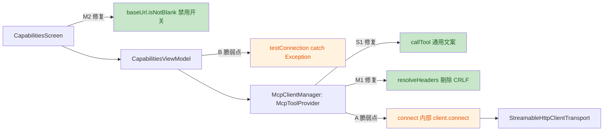

# 安全与质量审计报告（US-008 MCP Client 集成 · 第二轮复审）

| 项目 | 内容 |
|---|---|
| 执行 Agent | guardrail-enforcer |
| 任务令牌 | TKN-MCP-CLIENT-002 |
| 轮次 | 第二轮（复审上轮"有条件通过"的 S1/M1/M2 修复） |
| 审计日期 | 2026-08-06 |
| 关联 ADR | [ADR-005](../decisions/ADR-005-mcp-client-integration.md) |
| 上轮报告 | [2026-08-06-us008-mcp-client-guardrail.md](2026-08-06-us008-mcp-client-guardrail.md) |
| 审查依据 | TRAE-code-review + TRAE-security-review full passes |

## 0. 审查范围与证据

- 复审文件：`McpClientManager.kt` / `CapabilitiesScreen.kt` / `CapabilitiesViewModel.kt` / `McpToolProvider.kt` / `McpServerConfig.kt` / `McpServerPresets.kt` / `McpServerRepository.kt` / `PrismApplication.kt`
- 测试：`McpClientManagerTest.kt`（含 CRLF 负向用例）/ `McpServerRepositoryTest.kt`
- 构建：`app/build.gradle.kts`（lint 配置 + compilerOptions DSL）/ `gradle/libs.versions.toml` / `settings.gradle.kts`（google() content filter）
- 安全基线对比：`OpenAICompatibleProvider.kt`（CR-05 通用文案模式）、`ApiKeyRepository.kt`（readApiKeyOnce）、`StringMapConverter.kt`（headers 转义）

**上轮修复项核验结论**：S1 / M1(CRLF) / M2 / L1 均已修复；M1 的 baseUrl 连接层校验部分残留（LOW）。详见第 2 节。

---

## 1. 代码质量审查（TRAE-code-review）

### 意图推断
本轮为修复驱动的复审，作者意图是三处防御性修复：callTool 去信息泄露（对齐 CR-05）、resolveHeaders 连接层 CRLF 过滤（纵深防御）、LOCAL 空 baseUrl 禁用开关（功能缺陷）。架构未变，仍为数据层 + 连接层 + UI 层三层，符合 US-004/005/007 既有范式。

### 变更概览（mermaid）

### Karpathy Guidelines 符合性
- 命名 / 设计 / 可维护性：与上轮一致，无回退。✔
- 错误处理：`resolveHeaders` 的 CRLF 过滤为纯函数，注释清晰说明纵深防御意图，符合"零侥幸"原则。✔
- 交叉核验：`StringMapConverter` 将换行符转义为 `\n`、`\` 转义为 `\\`，round-trip 正确；UI 层已过滤 CRLF，DB 正常路径不会含原始 CRLF，`resolveHeaders` 过滤为第二道防线，设计合理。✔

---

## 2. 安全漏洞扫描（TRAE-security-review）：上轮修复核验

### 2.1 S1（CWE-209 信息泄露）—— 已修复 ✔
`McpClientManager.kt:87-89`：失败分支返回 `"工具调用失败，请检查网络连接或 Server 配置"`，不再拼接 `e.message`。与 `OpenAICompatibleProvider.kt:105-108` 的 CR-05 通用文案模式完全对齐。上轮 M1 修复建议的"结构化日志脱敏记录"虽未显式实现，但连接层本无日志输出，符合"不记日志"契约，可接受。

### 2.2 M1（CWE-113/93 CRLF 注入）—— CRLF 部分已修复，baseUrl 部分残留
- **CRLF 过滤已修复** ✔：`McpClientManager.kt:149-153` 剔除含 `\r`/`\n` 的头名/头值；`McpClientManagerTest.kt:88-103` 新增两条负向用例（`crlfValues_stripped` / `crlfKeys_stripped`）固化。
- **baseUrl 连接层校验残留** ✘（LOW）：`connect()`（L103-116）仍不校验 baseUrl 的 `http(s)://` 前缀、非空、无 CRLF。当前唯一入口是 UI（`canSave` 已强制 `urlValid && urlSafe`），且 Ktor URL 解析对 CRLF 会编码/抛异常，实际可利用率低。但作为纵深防御缺口，若未来出现绕过 UI 的写入路径，含 CRLF 的 baseUrl 仍可能被直传 `StreamableHttpClientTransport`。**建议**：`connect()` 入口对 baseUrl 做一次 `http(s)://` 前缀 + 非空 + 无 CRLF 白名单校验，失败抛 `IllegalArgumentException`（被 listTools/callTool 降级）。

### 2.3 M2（LOCAL 空 baseUrl）—— 已修复 ✔
- `CapabilitiesScreen.kt:246`（McpRow）：`enabled = server.baseUrl.isNotBlank()`。
- `CapabilitiesScreen.kt:438`（McpConfigSheet）：`enabled = baseUrlTrimmed.isNotBlank()`。
- 补充确认：L418 `testEnabled = !isNew && nameValid && urlValid && urlSafe`，LOCAL 空 baseUrl 下 `urlValid=false`，测试连接按钮禁用，LOCAL server 无法触发 `testConnection`（因而无法触达 `connect()` 空 URL 异常路径）。M2 兜底完整。

### 2.4 L1（lint 禁用注释）—— 已修复 ✔
`app/build.gradle.kts:58-66` 注释已从"Kotlin 2.1.0 metadata"更新为"Kotlin 2.3.21 产 metadata v2.3.0，lint 内置 kotlinx-metadata-jvm 无法读取"，并明确说明 `CoroutineCreationDuringComposition` 与 `StateFlowValueCalledInComposition` 均崩溃而一并禁用。注释准确反映当前状态，无需进一步整改。

### 2.5 密钥与配置 / 依赖供应链 —— 无新问题
- API Key 明文 `readApiKeyOnce` 仅使用瞬间解密，不落盘不记日志。✔
- 依赖版本全部固定（Kotlin 2.3.21 / Ktor 3.3.3 / mcp 0.12.0），settings.gradle.kts 的 `google()` content filter 限定 Android 组，`io.modelcontextprotocol` 从 mavenCentral 解析。✔

---

## 3. OWASP / CWE 发现（本轮新发现）

| 编号 | 等级 | 位置 | CWE | 说明 |
|---|---|---|---|---|
| S2 | MEDIUM | `app/src/main/java/io/prism/network/McpClientManager.kt:110-114` | CWE-404 / CWE-772（资源释放） | `connect()` 内部 `client.connect(transport)` 若抛异常，已创建的 `client` 与 `transport` 未释放；调用方 finally 中 `client` 仍为 null，`closeQuietly(null)` 无操作 → 失败路径每次泄漏一个 Client 实例及其底层资源 |
| S3 | MEDIUM | `app/src/main/java/io/prism/ui/capabilities/CapabilitiesViewModel.kt:112-113` | CWE-248（未捕获异常）/ CWE-209（信息泄露） | `catch (e: Exception)` 会误捕 `McpClientManager.listTools` 重新抛出的 `CancellationException`（违反结构化并发 CR-01）；且 `testState.value = TestState.Fail(e.message ?: "连接失败")` 暴露 `e.message`，属 CWE-209 纵深缺口（当前经 listTools 兜底业务异常不可达，但脆弱） |
| M1-残 | LOW | `app/src/main/java/io/prism/network/McpClientManager.kt:103-116` | CWE-113（纵深防御） | `connect()` 未校验 baseUrl 的 `http(s)://` 前缀 / 非空 / 无 CRLF，依赖 UI 单点防线 |

---

## 4. 主 Agent 自问两题评估（关键脆弱点）

### 4.1 连接生命周期是否有泄漏？—— 确认存在（S2）
主 Agent 的担忧成立。`connect()`（[L103-116](app/src/main/java/io/prism/network/McpClientManager.kt#L103-L116)）在 `client.connect(transport)` 返回前，client 与 transport 均为函数内局部变量。若握手失败抛异常：
1. `connect()` 抛出异常，未返回 client；
2. 调用方 `listTools`/`callTool` 的 `client` 变量保持 null；
3. `finally { closeQuietly(client) }` 传 null，无释放动作。

→ 失败连接路径泄漏 Client 实例及其底层 HTTP 资源。虽非注入类安全漏洞，但长期运行（反复对不可达 server 测试连接）会累积资源。**修复**：`connect()` 内用 try/catch-finally 包裹 `client.connect(transport)`，失败时 `closeQuietly(client)` 后重新抛出。

### 4.2 testConnection 的 e.message 是否泄露？—— 确认存在（S3）
主 Agent 的判断正确。虽然 `McpClientManager.listTools` 内部 catch 业务异常返回空列表，正常业务异常不会抛出，但存在两个真实问题：
1. **`CancellationException` 被捕获**：`listTools` 显式重新抛出 `CancellationException`（L57-58），而 `testConnection` 的 `catch (e: Exception)` 会捕获它（CancellationException 是 Exception 子类）。viewModelScope 取消时（如配置弹层关闭）会错误设置 `Fail` 状态并吞掉取消，违反项目 CR-01 结构化并发规则。
2. **`e.message` 暴露**：一旦未来替换 provider 实现或 listTools 行为改变，`e.message` 可能含 URL/路径/异常细节进入 UI。违反自身 CR-05 模式。

**修复**：在 `catch (e: Exception)` 前先 `catch (e: CancellationException) { throw e }`；将 Fail 文案改为通用文案 `"连接失败，请检查网络连接或 Server 配置"`，不暴露 `e.message`。

---

## 5. 结论

- [ ] 通过（可进入测试阶段）
- [x] **有条件通过**（上轮 S1/M1/M2/L1 已修复，但主 Agent 自问暴露的两个脆弱点 S2/S3 经核验确认为真实 MEDIUM 缺陷，需修复后复审；无阻断级漏洞）

**判定依据**：未发现 SQL/命令/代码注入、硬编码密钥、权限绕过等阻断级漏洞。上轮三项 MEDIUM（S1/M1-CRLF/M2）与 LOW（L1）均已正确修复且无残留（除 M1 的 baseUrl 纵深校验为 LOW 残留）。但主 Agent 主动暴露的两处脆弱点经源码级核验均为真实缺陷：
- **S2**：`connect()` 失败路径泄漏 Client/transport 资源（CWE-404/772）。
- **S3**：`testConnection` 捕获 CancellationException 且暴露 `e.message`（CWE-248/209），违反 CR-01 与 CR-05 项目自身规则。

两处均为"修复成本低、价值明确"，按第七节闭环须修复后重新提交审查。

**修复前置条件（回退至编码阶段处理）**：
1. **S2**：`McpClientManager.connect()` 内 try/catch-finally 包裹 `client.connect(transport)`，失败时 `closeQuietly(client)` 后重新抛出。
2. **S3**：`CapabilitiesViewModel.testConnection()` 先 `catch (e: CancellationException) { throw e }`，Fail 分支改为通用文案，不暴露 `e.message`。
3. **M1-残（建议）**：`connect()` 入口对 baseUrl 做 `http(s)://` 前缀 + 非空 + 无 CRLF 白名单校验，抛 `IllegalArgumentException` 由调用方降级，补齐纵深防御。

修复后按第七节闭环重新提交 guardrail-enforcer 审查（含第九节影响自检重跑），通过后再启动 ac-verifier。

---

## 6. 规则提议（accepted review → behavioral-rules）

| 类别 | 规则 | 反例（本次） | 正例 | 来源 |
|---|---|---|---|---|
| concurrency | 协程作用域内不得捕获 `CancellationException`，必须重新抛出（保持结构化并发） | `CapabilitiesViewModel.testConnection` 的 `catch (e: Exception)` 误捕取消 | 先 `catch (e: CancellationException) { throw e }` 再 catch 其他异常 | S3 |
| error-handling | 资源构建（连接/传输/session）与使用分离时，构建失败路径必须显式释放已创建资源，不得依赖调用方 finally | `connect()` 在 `client.connect()` 抛异常时不释放 client/transport | try/catch-finally 内 close 后重新抛出 | S2 |

---

## 7. 自动化建议（CI/CD 集成）

- 复用上轮建议：在 `.github/workflows/` 增加 `security.yml`，对 `app/src/**/*.kt` 运行 **Semgrep** 规则集（`cwe-209-information-exposure`、`cwe-248-uncatchedexception`），并补充检测 `catch (Exception)` 中变量名为 `e`/`ex` 且调用 `e.message` 的模式（S3 类）。
- 将 S2 的 `connect()` 失败释放与 S3 的 CancellationException 重抛封装为正例用例纳入单测回归，防复发。
- 依赖供应链：CI 增加 `gradle dependencies` 全量树核对 + OWASP Dependency-Check 插件，覆盖 MCP SDK 0.12.0 传递依赖。