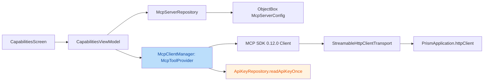

# 安全与质量审计报告（US-008 MCP Kotlin SDK Client 集成）

| 项目 | 内容 |
|---|---|
| 执行 Agent | guardrail-enforcer |
| 任务令牌 | TKN-MCP-CLIENT-001 |
| 审计日期 | 2026-08-06 |
| 关联 ADR | [ADR-005](../decisions/ADR-005-mcp-client-integration.md) |
| 关联代码变更 | 新增 8 文件 + 修改 7 文件（US-008，P3 重大） |
| 审查依据 | TRAE-code-review + TRAE-security-review full passes |

## 0. 审查范围与证据

- 新增：`McpServerConfig.kt` / `McpServerPresets.kt` / `McpServerRepository.kt` / `McpToolProvider.kt` / `McpClientManager.kt` / `CapabilitiesViewModel.kt` / 两个测试文件
- 修改：`PrismApplication.kt` / `CapabilitiesScreen.kt` / `objectbox-models/default.json` / `libs.versions.toml` / `app/build.gradle.kts` / `settings.gradle.kts` / `build.gradle.kts`
- 基线对比：`OpenAICompatibleProvider.kt`（CR-05/CR-06 已修复模式）、`ApiKeyRepository.kt`、`StringMapConverter.kt`
- 编译证据：`compileDebugKotlin` 通过（kotlinOptions→compilerOptions DSL 迁移有效）；主 Agent 声明 assembleDebug + 全量单测通过（191 through / 15 skipped 为性能基准）

**主 Agent 自问两题核查结论**：

1. `callTool` 签名 `Map<String, Any?>` 与 MCP SDK 0.12.0 `Client.callTool(name, arguments)` 匹配（`compileDebugKotlin` 通过即为权威证据，签名不匹配无法编译）。`connect()` 的传输构建与连接生命周期（每次 new Client + finally `closeQuietly`）设计正确，无连接泄漏。
2. `settings.gradle.kts` 的 `google()` content filter 已正确限定 `com.android.*`/`com.google.*`/`androidx.*`，强制 `io.ktor`/`io.modelcontextprotocol` 从 mavenCentral 解析，无 AndroidX 解析异常。`CoroutineCreationDuringComposition` lint 禁用仍停留于陈旧注释（Kotlin 2.1 metadata 崩溃的历史原因），需在 Kotlin 2.3 下重新评估（见 L2-1）。

---

## 1. 代码质量审查（TRAE-code-review）

### 意图推断

US-008 将 `CapabilitiesScreen` 的静态 MCP 数据替换为「数据层（ObjectBox 实体/Repository）+ 连接层（MCP SDK ClientManager）+ UI 层（ViewModel）」三层架构，并升级 Kotlin/Ktor 以满足 MCP SDK 0.12.0 编译约束。架构完全复用既有 US-004/005/007 范式（@Entity、Repository、Factory 注入、stateIn、internal 纯函数抽离）。

### Karpathy Guidelines 符合性

- **命名**：`McpClientManager`/`McpServerRepository`/`resolveHeaders`/`renderResult` 自解释，与既有命名风格一致。✔
- **设计**：依赖倒置（`McpToolProvider` 接口对齐 `ChatStreamProvider`）、纯函数抽离（`resolveHeaders`/`renderResult`）、构造注入——可测性与可维护性良好。✔
- **错误处理**：`listTools`/`callTool` 均 catch 后降级（空列表/错误文本），`CancellationException` 重新抛出（结构化并发 CR-01），`closeQuietly` 释放连接。✔ 但见 S2 `callTool` 错误信息泄露。
- **可维护性**：`McpServerType`/`McpTransport` 用 String 常量而非 enum，与 `ProviderConfig` 既有模式一致但不具类型安全。LOW。
- **跨模块影响**：新增 lazy 单例仅被新 `CapabilitiesViewModel` 消费，无既有模块引用；现有 Provider 链路未改动。✔

### 变更概览（mermaid）

---

## 2. 安全漏洞扫描（TRAE-security-review）

### 2.1 输入与边界审计

- **baseUrl 边界**：UI 层 `McpConfigSheet` 已校验 `http://`/`https://` 前缀 + 拒绝 `\r`/`\n`（`CapabilitiesScreen.kt:307-308`），`canSave` 门禁阻止非法 URL 落库。但**连接层 `connect()` 不校验 baseUrl**——`StreamableHttpClientTransport(httpClient, config.baseUrl)` 直接消费 DB 中的值。当前唯一入口是 UI（已校验），纵深防御缺口见 M1。
- **LOCAL server 空 baseUrl**：`McpServerPresets.local` 6 个内置 server 的 `baseUrl` 均为 `""`。若用户启用本地 server 并触发 `listTools`/`callTool`，`connect()` 以空 URL 建传输会抛异常（被 catch 降级为空列表/错误文本）。非安全漏洞，但为功能缺陷，masking 真实连接问题（见 M2）。

### 2.2 执行安全审计（注入 / 最小权限 / 输出编码）

- **SQL/命令/代码注入**：无数据库字符串拼接、无 `system()`/`exec()`、无 `eval()`。所有网络参数经 Ktor `header()`/MCP SDK 正常传入。✔
- **Header 注入 / CRLF**：`resolveHeaders` 直接复制自定义头（`McpClientManager.kt:143`），**连接层未剔除含 `\r`/`\n` 的头名/头值**。UI 层已过滤（`CapabilitiesScreen.kt:312`），但连接层作为安全边界应独立校验（纵深防御）：DB 中若存在绕过 UI 的坏数据（如未来非 UI 写入路径），CRLF 头可导致 HTTP 头注入。见 M1。
- **错误信息泄露**：`callTool` 失败分支返回 `"调用失败：${e.message ?: "未知错误"}"`（`McpClientManager.kt:87`），直接暴露异常消息给 UI。对比 `OpenAICompatibleProvider` 的 CR-05 修复（统一映射为通用文案，避免内部路径/异常细节泄露），此处**违反项目自身安全模式**——`e.message` 可能含 URL、内部路径或传输构造细节。MEDIUM，见 S1。

### 2.3 密钥与配置安全

- **API Key 明文**：`readApiKeyOnce` 仅在使用瞬间解密一次明文注入 Bearer，不落盘、不记日志，符合 US-003/ADR-004 4.4 契约。✔
- **无硬编码密钥**：客户端代码无硬编码 token/password；预设模板仅含公开 server 端点 URL 与 header 模板占位（`CONTEXT7_API_KEY_HEADER`→`CONTEXT7_API_KEY`），非真实密钥。✔
- **鉴权头优先级**：`resolveHeaders` 大小写不敏感检测已有 `Authorization` 后不重复注入 Bearer（`McpClientManager.kt:144-147`），与 CR-06 修复思路一致。✔

### 2.4 依赖与供应链风险

- **Kotlin 2.3.21 / Ktor 3.3.3 / serialization 1.11.0 / mcp 0.12.0 升级**：无锁文件（Gradle 项目），依赖版本全部固定具体值（非 `latest`）。`compileDebugKotlin` 通过验证编译兼容。
- **content filter**：`google()` 限定 Android 组，避免 `io.ktor`/`io.modelcontextprotocol` 被发往不可达的 `dl.google.com`（BR-build-003 意图正确）。`com.google.crypto.tink`（既有依赖）匹配 `com.google.*` 从 aliyun google 镜像解析，属既有行为。
- **建议**：主 Agent 后续 CI 运行 `gradle dependencies` 核对全量传递依赖可解析性（尤其 MCP SDK 传递依赖如 `org.jetbrains.kotlinx`/`com.squareup` 均回退 mavenCentral）；`npm audit` 不适用（非 JS 项目）。

---

## 3. OWASP / CWE 发现

| 编号 | 等级 | 位置 | CWE | 修复建议 |
|---|---|---|---|---|
| S1 | MEDIUM | `app/src/main/java/io/prism/network/McpClientManager.kt:87` | CWE-209（信息泄露） | callTool 失败返回通用文案，不拼接 `e.message`；如需诊断信息，fallback 到结构化日志（脱敏）而非 UI |
| M1 | MEDIUM | `app/src/main/java/io/prism/network/McpClientManager.kt:142-150, 101-114` | CWE-113（HTTP 头注入）/ CWE-93 | 连接层 `resolveHeaders`/`connect` 独立校验：剔除含 `\r`/`\n` 的头名/头值，校验 baseUrl 以 `http(s)://` 开头且非空（纵深防御，不依赖 UI） |
| M2 | LOW-MEDIUM | `app/src/main/java/io/prism/data/McpServerPresets.kt:19-24` | -（功能缺陷） | LOCAL 内建 server 的 `baseUrl=""` 在启用 + 连接时必失败；接入真实本地 server 前建议 UI 层对 LOCAL 类型禁用「测试连接」或提供明确占位提示 |
| L1 | LOW | `app/build.gradle.kts:61-63` | - | `CoroutineCreationDuringComposition` 禁用注释仍陈述 Kotlin 2.1.0 metadata 崩溃历史，Kotlin 2.3.21 下需重新评估是否仍必要；若已修复应移除 disable 恢复 lint 覆盖 |
| L2 | LOW | `app/src/main/java/io/prism/data/McpServerConfig.kt:36-37` / `McpServerPresets.kt` | - | `serverType`/`transport` 用 String 魔法值，建议 enum 化（与 `McpServerType`/`McpTransport` 常量对象对齐）提升类型安全 |

---

## 4. 测试框架与基础用例充分性

**已覆盖（充分）**：

- `McpServerRepositoryTest`（9 例）：CRUD、findByName、setEnabled、createFromPreset、createdAt 排序、预设组成。✔
- `McpClientManagerTest`（10 例）：`resolveHeaders` 鉴权合并 6 例（含大小写规范化、自定义保留、空白 key）+ `renderResult` 渲染 4 例。✔

**缺口（建议补充，非阻断）**：

- `StringMapConverter` 特殊字符 round-trip：`headers` 含 `=`/`\`/换行符 的转义/反转义正确性（当前 `resolveHeaders`/`renderResult` 测试未触达 `@Convert` 持久化路径的转义边界）。
- `resolveHeaders` CRLF 负向用例：构造含 `\r\n` 的头名/值，断言被剔除——用于固化 M1 修复。
- `callTool`/`listTools` 异常路径：空 baseUrl、`connect` 抛异常时断言降级为空列表/通用错误文本（不泄露 `e.message`）——用于固化 S1 修复。
- Kotlin 2.3 全量回归属 P3 必要性，已由主 Agent 声明 assembleDebug + 全量单测通过，ac-verifier 阶段需复跑确认。

---

## 5. 结论

- [ ] 通过（可进入测试阶段）
- [x] **有条件通过**（存在 MEDIUM 级缺陷，需修复后进入 ac-verifier；无阻断级漏洞）

**判定依据**：未发现 SQL/命令/代码注入、硬编码密钥、权限绕过等阻断级漏洞；API Key 加密存储、连接生命周期、依赖解析均正确。但存在两项违反项目自身安全模式的 MEDIUM 缺陷（S1 错误信息泄露、M1 连接层 CRLF/URL 纵深验证缺失），修复成本低、价值明确，应在进入 ac-verifier 前修复。

**修复前置条件（回退至编码阶段处理）**：

1. **S1**：`callTool` 失败分支改为通用文案，不暴露 `e.message`（对齐 `OpenAICompatibleProvider` CR-05）。
2. **M1**：连接层 `resolveHeaders`/`connect` 增加 CRLF 剔除 + baseUrl 白名单校验（纵深防御，不依赖 UI 层）。
3. **M2/L2**：LOCAL 空 baseUrl 的启用/测试行为给出明确处理（建议项）。

修复后需按第七节闭环重新提交 guardrail-enforcer 审查（含第九节影响自检重跑），通过后再启动 ac-verifier。

---

## 6. 规则提议（accepted review → behavioral-rules）

| 类别 | 规则 | 反例（本次） | 正例 | 来源 |
|---|---|---|---|---|
| error-handling | 网络失败分支不得向 UI 暴露 `e.message` 原始异常文本，必须映射为通用文案或脱敏日志 | `McpClientManager.callTool` 返回 `"调用失败：${e.message}"` | `OpenAICompatibleProvider` CR-05 统一映射 | S1（accepted review） |
| security | 所有 HTTP 请求头装配点（连接层）必须独立校验 CRLF，纵深防御不依赖单一 UI 层过滤 | `resolveHeaders` 直接复制自定义头 | 连接层剔除含 `\r`/`\n` 的头名/值 | M1 |

---

## 7. 自动化建议（CI/CD 集成）

- 在 `.github/workflows/` 增加 `security.yml`：对 `app/src/**/*.kt` 运行 [**Semgrep**](https://semgrep.dev/) 规则集（`java.lang.security.audit.cwe-113-header-injection`、`cwe-209-information-exposure`），作为 PR 必需状态检查，阻断 MEDIUM 以上发现。
- 依赖供应链：CI 增加 `gradle dependencies` 全量树核对 + 依赖漏洞扫描（建议接入 **OWASP Dependency-Check Gradle 插件** 或 Grype，覆盖 MCP SDK 0.12.0 传递依赖）。
- 将 `callTool`/`listTools` 失败文案与 `resolveHeaders` CRLF 过滤封装为正例用例，纳入单测回归防复发。
