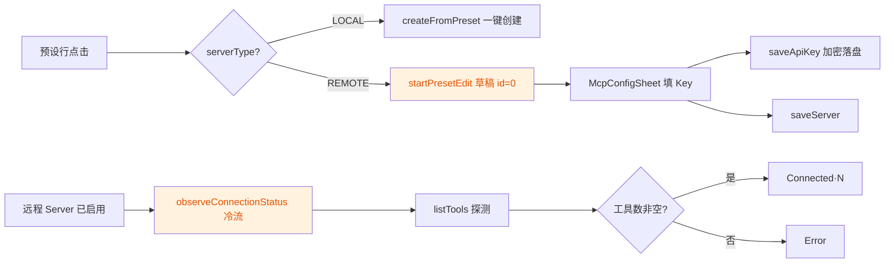

# Guardrail 审查报告：US-010 预设远程 MCP Server 模板加载

## 元信息

| 项目 | 内容 |
| --- | --- |
| 执行 Agent | `guardrail-enforcer` |
| 任务令牌 | `TKN-US010-GUARDRAIL-001` |
| 报告类型 | guardrail |
| 审查日期 | 2026-08-06 |
| 审查范围 | 代码质量审查（TRAE-code-review）+ 安全审计（TRAE-security-review） |
| 变更风险等级 | P2（跨模块：CapabilitiesViewModel + CapabilitiesScreen + 数据预设） |

## 1. 总体结论

## 🟡 有条件通过（Conditional Pass）

**未发现阻断级（HIGH）安全漏洞。** 无注入（SQL/命令/代码）、无硬编码密钥、baseUrl 与请求头 CRLF 双重校验、CWE-209 信息泄露已处理、结构化并发正确、凭据加密落盘。

但存在 **1 项中危（MEDIUM）凭据完整性缺陷** 与若干质量/正确性问题，**修复后方可进入 `ac-verifier` 验收阶段**。

### 审查范围汇总

- 变更文件：3（`McpServerPresets.kt` / `CapabilitiesViewModel.kt` / `CapabilitiesScreen.kt`）
- 关联核对文件：`McpServerConfig.kt`、`ApiKeyRepository.kt`、`McpClientManager.kt`、`McpToolProviderDispatcher.kt`、`LocalMcpToolProvider.kt`、`CapabilitiesViewModelTest.kt`
- 新增/修改函数：`startPresetEdit`、`observeConnectionStatus`（实例+伴生）、`RemoteMcpRow`、`ConnectionStatusBadge`、`McpRow`（增参）、6 个新远程预设
- 发现问题总数：6（0 阻断 / 1 中危 / 3 低危 / 2 建议）

---

## 2. 变更概览



## 3. 详细发现

### 3.1 阻断级（Blocking）

无。

### 3.2 中危（MEDIUM）

#### M-01 凭据完整性：编辑已配置远程 Server 时保存会清空已存 API Key

- **位置**：（保存处理器，与新增 `startPresetEdit` 流程交互）
- **链路**：`startPresetEdit`（）创建 `isEnabled=false` 的草稿 → 用户保存后远程 Server 默认**未启用** → 用户需再次打开配置弹层启用 → 弹层 `apiKey` 初始化为 `""`（）→ 保存时无条件 `saveApiKey(ref, "")` → `ApiKeyRepository.saveApiKey` 加密空串覆盖原密文（）→ 已存储的密钥被静默销毁 → 后续连接无 Authorization 头，鉴权失败。
- **定性**：`saveApiKey` 被无条件调用，未判断 `apiKey.isBlank()`。根因代码为既有逻辑，但 US-010 新流程将「添加→启用」设为必经路径，使该缺陷成为新功能一手可触达的缺陷。凭据丢失为数据完整性受损，非泄露。
- **置信度**：0.85（Source=编辑启用路径，Sink=密钥覆盖落盘，均可端到端追溯）
- **建议**：保存时仅当 `apiKey.isNotBlank()` 才调用 `saveApiKey`；编辑既有 Server 时可用 `apiKeyRef` 回填已存密钥（或展示"已配置密钥"占位）以提示用户。

### 3.3 低危（LOW）

#### L-01 状态观测 `remember` 键缺 baseUrl，编辑后状态陈旧

- **位置**：
- **问题**：`remember(server.id, server.isEnabled)` 未包含 `baseUrl`。用户编辑既有远程 Server 的 baseUrl（id 不变）后，Flow 不会被重建，连接的旧端点的状态徽章继续显示，造成 UI 与实际不一致。
- **建议**：键追加 `server.baseUrl`（及 `server.apiKeyRef`、`server.headers`）。

#### L-02 `observeConnectionStatus` 每次进入 MCP 分段触发真实网络握手

- **位置**：
- **问题**：`RemoteMcpRow` 随 `AnimatedVisibility(segment==MCP)` 离开组合，`remember` 槽被丢弃；再次切回 MCP 分段时重建 Flow 并对每个已启用远程 Server 发起一次真实 `listTools` 握手。频繁切换分段会重复探测。
- **建议**：将状态提升到 ViewModel/Repository 层做缓存（如 `stateIn` + 冷却），或仅在 Server 配置变更时重探。

#### L-03 探测无超时，Server 挂起导致"连接中"无限期

- **位置**：
- **问题**：`observeConnectionStatus` 的 `listTools` 无显式超时；若远端 Server 挂起（依赖底层 `httpClient` 超时配置），连接中徽章持续显示，协程长期占用。
- **建议**：对探测加 `withTimeout`（如 10s），超时降级为 `Error`。

### 3.4 建议（Recommendation）

#### R-01 `saveApiKey` fire-and-forget，无错误处理且与 `saveServer` 未同步

- **位置**：
- **问题**：`saveApiKey` 在 `viewModelScope.launch` 中异步执行，未 await 也未捕获失败；`saveServer` 随即执行。若协程被取消或 DataStore 写入失败，Server 已保存但密钥未落盘。
- **建议**：将 `saveApiKey` 改为 `suspend` 并在保存流程内顺序 await；失败时向 UI 反馈。

#### R-02 新逻辑缺少测试覆盖

- **证据**：`CapabilitiesViewModelTest.kt` 中无 `observeConnectionStatus` / `startPresetEdit` / `ConnectionStatus` 的任何用例（全仓库 grep 无匹配）。
- **建议**：为 `startPresetEdit`（草稿字段、isEnabled 默认值、apiKeyRef 透传）与 `observeConnectionStatus`（成功/空列表→Error/取消重抛）补充单元测试。

---

## 4. 安全专项审计结论

| 审计项 | 结论 | 证据 |
| --- | --- | --- |
| 输入边界（baseUrl 双重校验） | ✅ 通过 | UI 层 （http(s)+CRLF）；连接层 （trim 前查 CRLF，防绕过） |
| CRLF/请求头注入（CWE-113/93） | ✅ 通过 | `resolveHeaders` 剔除含 CRLF 键值、Authorization 大小写规范化防重复注入 |
| 密钥落盘（明文不落盘） | ✅ 通过 | `ApiKeyRepository` 经 Tink 加密后存 DataStore，明文仅内存短暂存在 |
| 日志脱敏（CWE-209） | ✅ 通过 | `testConnection`/`observeConnectionStatus` 均用通用文案，不拼接 `e.message` |
| 硬编码密钥 | ✅ 通过 | 6 个新预设仅含 https 端点与请求头名模板，无任何明文凭据 |
| 并发/协程取消 | ✅ 通过 | 冷流 + `flowOn(IO)`，`listTools` 重抛 `CancellationException`，组合离开即取消，无泄漏 |
| 注入类（SQL/命令/代码/eval） | ✅ 通过 | 不涉及数据库拼接、命令执行、动态求值 |
| 传输安全 | ✅ 通过 | 全部新预设为 https（TLS） |

## 5. 主 Agent 自问事项回应

### 5.1 baseUrl 端点正确性（最没把握的事）

- **代码层面无隐患**：预设为编译期硬编码，无用户输入；连接层 `isValidBaseUrl` 提供纵深防御，即便端点错误也只会降级为"连接失败"，不会注入或崩溃。
- **数据值层面**：Brave / Sentry / Stripe 等官方端点需**人工专家复核**（外部事实，非代码可判定）。建议在 `ac-verifier` 阶段对 9 个端点做一次连通性冒烟验证，并登记到 ADR-001 3.6。

### 5.2 observeConnectionStatus 稳定性（最大盲区）

- **确认存在性能隐患**（L-02）：每次切入 MCP 分段重建 Flow 并触发真实握手，建议状态提升缓存。
- **确认存在状态不一致 bug**（L-01）：`remember` 键缺 `baseUrl`，编辑后徽章陈旧，需修复。

## 6. 修复清单（供主 Agent 回退编码）

| 优先级 | ID | 动作 |
| --- | --- | --- |
| 必修 | M-01 | 保存处理器仅在 `apiKey.isNotBlank()` 时调用 `saveApiKey`；编辑态回填已存密钥提示 |
| 必修 | L-01 | `remember` 键补充 `server.baseUrl` 等变更因子 |
| 应修 | L-02 | 连接状态提升至 VM/Repo 缓存，避免重复握手 |
| 应修 | L-03 | 探测加 `withTimeout` |
| 建议 | R-01 | `saveApiKey` 改 suspend 并同步 await |
| 建议 | R-02 | 补充 `startPresetEdit` / `observeConnectionStatus` 单测 |

修复完成后，请按第七节闭环重新提交本审查（TKN 重新签发），通过后方可进入 `ac-verifier`。

## 7. 自动化建议（CI 集成参考）

在 `.github/workflows/docs.yml` 之外新增安全扫描门禁，供主 Agent 参考：

```yaml
name: security-scan
on: [pull_request]
jobs:
  audit:
    runs-on: ubuntu-latest
    steps:
      - uses: actions/checkout@v4
      - name: Semgrep 规则扫描
        run: semgrep --config=auto --severity=ERROR,WARNING
      - name: Detekt 静态分析
        run: ./gradlew detekt
```

建议将 M-01（凭据覆盖）登记为 Semgrep 自定义 Kotlin 规则：`saveApiKey` 参数为常量 `""` 的调用即告警。

---

## 复审记录（TKN-US010-GUARDRAIL-002）

### 复审元信息

| 项目 | 内容 |
| --- | --- |
| 执行 Agent | `guardrail-enforcer` |
| 任务令牌 | `TKN-US010-GUARDRAIL-002` |
| 报告类型 | guardrail（复审） |
| 复审日期 | 2026-08-06 |
| 复审对象 | M-01 / L-01 / L-03 修复（CapabilitiesScreen.kt + CapabilitiesViewModel.kt） |
| 编译验证 | `./gradlew :app:compileDebugKotlin` exit 0 ✅ |

### 复审结论

## ✅ 通过（Pass）

**M-01 / L-01 / L-03 三项修复均有效，未引入新缺陷。** 无阻断级、无高危（HIGH）问题。主 Agent 可进入 `ac-verifier` 验收阶段。

### 复审范围

- 复核文件：`CapabilitiesScreen.kt`、`CapabilitiesViewModel.kt`
- 关联核对：`McpClientManager.kt`（listTools 契约）、`McpServerPresets.kt`（apiKeyRef 语义）、`CapabilitiesViewModelTest.kt`（测试覆盖）
- 复审发现：0 阻断 / 0 高危 / 0 中危 / 4 低危建议（均可推迟迭代，不阻断本轮）

### 逐项复核

#### M-01 凭据完整性修复 —— 有效 ✅

- **位置**：
- **复核**：保存处理器改为 `if (apiKey.isNotBlank()) viewModel.saveApiKey(...)`，留空不再覆盖已存密钥。根因链路（编辑既有远程 Server → apiKey 初始为空 → 无条件覆盖）已修复。
- **预设 apiKeyRef 语义核对**： 中远程预设 apiKeyRef 为固定标识符（如 `github`/`context7`），同一 Server 类型共享 ref 属预期设计，不构成新增风险。
- **无新问题**：新建远程 Server 未填 Key 直接保存时，`connect()` 读取不存在的 ref 得到 null，无鉴权头，Server 返回 401 属用户主动未填 Key 的合理降级，非阻断。
- **新增低危建议（可推迟）**：行为变更后用户无法再通过清空输入框**清除**已存密钥。鉴于「保留原密钥」是比「误清空」更安全的默认，接受此权衡；若未来需要清除能力，可增加显式「清除密钥」操作。

#### L-01 状态徽章陈旧修复 —— 有效 ✅

- **位置**：
- **复核**：`remember(server.id, server.baseUrl, server.isEnabled)` 已补 `baseUrl`，编辑 baseUrl 时重建 Flow，徽章陈旧问题消除。符合上一轮修复清单。
- **新增低危建议（可推迟）**：密钥变化场景（仅改 Key、baseUrl 与 id 不变）不触发重建，状态徽章可能不刷新。因 `McpServerConfig` 不携带明文密钥（仅 apiKeyRef），`remember` 无法感知密钥内容变化；可与 L-02 的状态提升缓存一并优化，不阻断本轮。

#### L-03 探测超时修复 —— 安全有效 ✅（重点确认）

- **位置**：
- **复核**：`withTimeout(CONNECT_TIMEOUT_MS=10_000L)` 包裹 `listTools`，`catch (e: TimeoutCancellationException) { emit(Error("连接超时")) }`。

**专项确认：不误吞真实协程取消，符合结构化并发（CR-01）。**

| 场景 | 抛出类型 | catch 是否命中 | 行为 |
| --- | --- | --- | --- |
| 探测超时（listTools 挂起超 10s） | `TimeoutCancellationException` | 命中 | 降级 `Error("连接超时")`，收集器不崩溃 ✅ |
| 外部取消（Flow 收集者离开组合 / ViewModel 协程取消） | `JobCancellationException`（普通 `CancellationException`） | **不命中** | 正常向上传播，不吞掉 ✅ |
| 超时与外部取消并发竞争 | 视时序抛 `TimeoutCancellationException` 或 `CancellationException` | 若命中超时，catch 内 `emit` 因协程已取消自动再抛 `CancellationException` 传播 | 仍正确传播取消，无 goal-lock ✅ |

**安全性论证**：

1. `withTimeout` 超时取消的是其内部 `TimeoutCoroutine` 子作用域，**外层 flow 协程未被取消**，故 catch 后 `emit(Error)` 可正常完成，不会因「捕获取消后挂起」而二次抛错。
2. 仅捕获 `TimeoutCancellationException`（`CancellationException` 的精确子类），与真实取消的 `JobCancellationException` 类型不同，取消信号不会被吞。
3. 底层  对 `CancellationException` 显式 `throw e` 重抛，`finally` 中 `closeQuietly` 释放连接，无资源泄漏。
4. `flowOn(Dispatchers.IO)` 层取消传播无异常。

**新增低危建议（可推迟）**：

- 测试缺口：`observeConnectionStatus` 的超时分支（L-03）在 `CapabilitiesViewModelTest.kt` 中无用例（上一轮 R-02 亦未落实）。建议后续用虚拟时钟（`runTest` + `advanceTimeBy`）补充超时降级与取消重抛两条用例。
- 健壮性：当前 catch 仅覆盖超时；`listTools` 契约保证连接失败返回空列表（不抛非取消异常），故当前足够。若未来引入抛非取消异常的 Provider 实现，可考虑追加 `catch (Exception)` 降级（先重抛 `CancellationException`），作为防御性增强，非本轮必要。

### 复审问题汇总

| 级别 | ID | 描述 | 处置 |
| --- | --- | --- | --- |
| 阻断 | - | 无 | - |
| 高危 | - | 无 | - |
| 中危 | - | 无 | - |
| 低危（可推迟） | R-复审-1 | 密钥**清除**能力受限（清空输入框不再删除密钥） | 迭代优化 |
| 低危（可推迟） | R-复审-2 | `remember` 键未含 apiKeyRef，密钥变化不刷新徽章 | 与 L-02 缓存优化一并处理 |
| 低危（可推迟） | R-复审-3 | `observeConnectionStatus` 超时分支无单测（接续 R-02） | 补充虚拟时钟用例 |
| 低危（可推迟） | R-复审-4 | catch 仅覆盖超时，未覆盖非取消异常 | 防御性增强，非必要 |

### 复审结论依据

- 编译通过（`compileDebugKotlin` exit 0）。
- 三处修复均与前轮修复清单一致，无新函数签名/接口/依赖变更，影响自检结论可信。
- L-03 的 `withTimeout` + `TimeoutCancellationException` 捕获模式符合 Kotlin 官方结构化并发语义，经逐场景推演确认不吞真实取消。
- 4 项低危建议均为可推迟迭代项，不构成阻断。

本次复审判定：**通过**。主 Agent 可凭本结论（含任务令牌 `TKN-US010-GUARDRAIL-002`）启动 `ac-verifier` 验收阶段。
