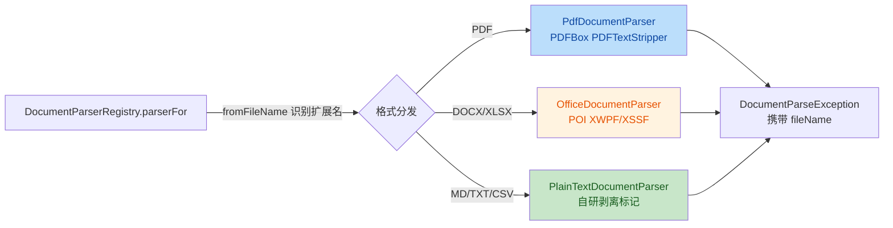
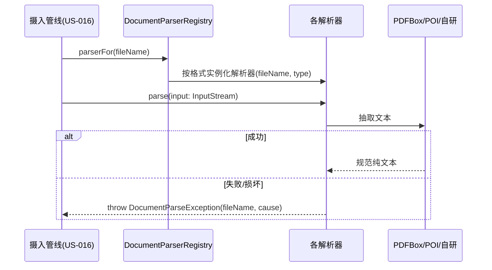

# US-012 文档解析器 —— 安全与质量审查报告（guardrail-enforcer）

## 元信息

| 项目 | 内容 |
| --- | --- |
| 执行 Agent | guardrail-enforcer |
| 任务令牌 | TKN-US012-GUARDRAIL-001 |
| 关联里程碑 | M3 RAG（US-012 文档解析器） |
| 风险等级 | P2（引入 pdfbox 依赖 + 新增 document 模块） |
| 审查日期 | 2026-08-06 |
| 审查范围 | `app/src/main/java/io/prism/document/`（7 文件）、`gradle/libs.versions.toml`、`app/build.gradle.kts`、`app/src/test/java/io/prism/document/`（6 文件） |
| 结论 | **有条件通过** |

---

## 0. 上下文重建摘要

在给出结论前，依据零节规则先重建本次审查上下文基线与验证基线：

- **项目阶段**：M3 RAG 里程碑进行中，US-012 为文档解析器，属 M3 首个解析能力单元。
- **本次任务**：以 guardrail-enforcer 角色独立审查 US-012 文档解析器全部代码变更（质量 + 安全），输出结论供主 Agent 决定是否进入 ac-verifier。
- **技术栈**：Android（Kotlin 2.3.21 / AGP 8.13.0）、PDFBox 3.0.8、Apache POI poi-ooxml 5.5.1、自研解析器；minSdk 26 / targetSdk 34；已启用 Multidex。
- **安全基线**：项目无独立 `SECURITY.md`，安全策略以 `docs/behavioral-rules.md`（动态累积层）为准。本次涉及的相关规则：BR-error-handling-004（catch 兜底需保留可诊断信息）、BR-data-001（分隔符转义）、BR-security-003（用户可控内容拒绝控制字符）。
- **脆弱点预判（主 Agent 三问）**：①PDFBox/POI 大文件内存峰值（无单文件上限）；②PDF 中文测试移除导致召回质量未覆盖；③OfficeDocumentParser 的 FORMULA 分支与 XLSX 空单元格 `\t` 噪声。经核实：①③成立，②为测试覆盖缺口（非代码缺陷）。
- **文档间矛盾/模糊点**：无。代码注释、ADR-007 5.3、接口契约一致。

---

## 1. 代码审查结论（质量维度）

### 1.1 变更意图推断

本次变更实现「按文件格式分发解析器抽取纯文本」的 RAG 摄入第一步。意图清晰：PDF/DOCX/XLSX 走第三方库，MD/TXT/CSV 走自研轻量解析，接口统一为 `parse(InputStream): String`，异常统一收敛到 `DocumentParseException`。整体为防御性重构风格（init 约束类型、finally 关闭资源、异常包装）。

### 1.2 变更总览





### 1.3 质量审查发现（按严重度排序）

#### G-01（中）XLSX FORMULA 单元格返回公式表达式而非缓存计算结果

- 位置：[OfficeDocumentParser.kt:66](../../app/src/main/java/io/prism/document/OfficeDocumentParser.kt#L66)
- 问题：`CellType.FORMULA -> cell.cellFormula` 返回公式字符串（如 `=SUM(A1:A2)`、`=B1*0.1`），而非该单元格的缓存计算值（如 `30`）。对 RAG 纯文本摄入而言，这会把公式算式而非实际数据写入切片，导致检索命中「公式」而非「数据」，属数据正确性缺陷。与文书语义相悖（用户期望抽取到数值）。
- 证据：`XSSFWorkbook.cellType` 对公式单元格返回 `FORMULA`，`cellFormula` 返回未求值表达式；缓存值须经 `cell.cachedFormulaResultType` + 对应 getter 或 `DataFormatter` 获取。
- 建议（修复）：
  ```kotlin
  org.apache.poi.ss.usermodel.CellType.FORMULA -> {
      // 用缓存计算结果而非公式表达式
      when (cell.cachedFormulaResultType) {
          CellType.STRING -> cell.stringCellValue
          CellType.NUMERIC -> formatNumeric(cell.numericCellValue)
          CellType.BOOLEAN -> cell.booleanCellValue.toString()
          else -> ""
      }
  }
  ```
- 修复后需补 FORMULA 单元格单测（见 G-09）。

#### G-02（中）输入流所有权在三个解析器间不一致

- 位置：[DocumentParser.kt:22](../../app/src/main/java/io/prism/document/DocumentParser.kt#L22)（契约声明「由调用方负责关闭」）、[PdfDocumentParser.kt:28](../../app/src/main/java/io/prism/document/PdfDocumentParser.kt#L28)（不关闭）、[OfficeDocumentParser.kt:45](../../app/src/main/java/io/prism/document/OfficeDocumentParser.kt#L45)（POI 关闭）、[PlainTextDocumentParser.kt:39](../../app/src/main/java/io/prism/document/PlainTextDocumentParser.kt#L39)（`reader.use{}` 关闭）
- 问题：接口契约统一声明「输入流由调用方负责关闭」，但 `OfficeDocumentParser` 的 POI `use{}` 与 `PlainTextDocumentParser` 的 `reader.use{}` 都会关闭输入流，仅 `PdfDocumentParser` 遵守契约不关闭。若 US-016 摄入管线按契约在 parse 后统一关闭流，POI/PlainText 路径将发生双重关闭。多数 `InputStream.close()` 幂等，但所有权语义混乱，且若调用方复用同一流（如分片读取）会提前失效。
- 建议：在接口契约中明确「各实现可能自行关闭输入流，调用方不得复用」，或统一让所有解析器都不关闭由调用方管理。明示所有权可消除歧义。

#### G-03（高 / 延后门禁）无单文件大小上限，大文件全量读入内存

- 位置：[PdfDocumentParser.kt:28](../../app/src/main/java/io/prism/document/PdfDocumentParser.kt#L28)（`input.readBytes()`）、[PlainTextDocumentParser.kt:39](../../app/src/main/java/io/prism/document/PlainTextDocumentParser.kt#L39)（`readText()`）、[OfficeDocumentParser.kt:55](../../app/src/main/java/io/prism/document/OfficeDocumentParser.kt#L55)（`XSSFWorkbook` 全量加载）
- 问题：三个解析器均将整个输入读入内存，PDF 路径还先 `readBytes()` 再 `Loader.loadPDF` 二次驻留。目标 4GB 低端机下，大 PDF/XLSX 有 OOM 风险。此为主 Agent 脆弱点①，已计划在 US-016 摄入管线设限制。
- 判定：本项按安全扫描规则属资源耗尽类（默认不列为可利用安全漏洞），但作为**运行稳健性高风险**必须纳入门禁。要求：**US-016 摄入管线必须在该解析器投入生产前强制单文件大小上限（如 ≤20MB）与流式/分批读取，否则禁止进入正式摄入链路**。解析器本身建议在 `parse` 入口增加防御性上限校验（如 InputStream 仅允许 `ByteArrayInputStream` 且校验 length，或读取时设 `maxBytes`）。
- 建议：在 `DocumentParser` 接口或各实现入口增加可选 `maxBytes` 防御，配合 US-016 强制落地。

#### G-04（低）MD 剥离正则每次调用重复编译

- 位置：[PlainTextDocumentParser.kt:58-66](../../app/src/main/java/io/prism/document/PlainTextDocumentParser.kt#L58-L66)
- 问题：`stripMarkdown` 在 `lineSequence().joinToString` 内对每一行都 `Regex(...)` 构造一次，6 个正则因子 × 行数 次编译。大 MD 文件下产生无谓对象分配与编译开销。
- 建议：将正则提升为 `companion object` 的 `val` 常量，一次编译复用。
  ```kotlin
  companion object {
      private val HEADING = Regex("^#{1,6}\\s+")
      private val LIST = Regex("^\\s*[-*+>]\\s+")
      private val BOLD_ASTERISK = Regex("\\*+")
      private val UNDERSCORE = Regex("_+")
      private val LINK = Regex("\\[([^\\]]+)\\]\\([^)]*\\)")
  }
  ```

#### G-05（低）XLSX 空单元格产生多余制表符噪声

- 位置：[OfficeDocumentParser.kt:67-70](../../app/src/main/java/io/prism/document/OfficeDocumentParser.kt#L67-L70)
- 问题：`else -> ""` 将 BLANK/空单元格映射为空串，再 `cells.joinToString("\t")`。稀疏行会产出 `\t\t\t` 连续制表符，污染切片文本、稀释检索质量（主 Agent 脆弱点③）。
- 建议：可考虑用 `DataFormatter` 统一格式化单元格，并对空结果行做去重/压缩连续空白，或在切片阶段清洗。属低风险优化，非阻断。

#### G-06（低）异常消息直接内嵌用户可控 fileName

- 位置：[DocumentParseException.kt:14](../../app/src/main/java/io/prism/document/DocumentParseException.kt#L14)、[DocumentParserRegistry.kt:29](../../app/src/main/java/io/prism/document/DocumentParserRegistry.kt#L29)
- 问题：`fileName` 来自调用方（用户所选文档名），被直接拼入异常消息与 `IllegalArgumentException("不支持的文档格式: $fileName")`。若该消息被日志记录，fileName 含 `\r`/`\n` 时存在日志注入风险（对照 BR-security-003）。文件名本身非敏感凭据，故不构成安全漏洞，仅日志卫生问题。
- 建议：日志侧对 fileName 做控制字符过滤，或异常消息仅保留文件基名（`substringAfterLast('/')`）。

#### G-07（低）`catch (e: Exception)` 兜底未记录结构化日志

- 位置：[PdfDocumentParser.kt:36](../../app/src/main/java/io/prism/document/PdfDocumentParser.kt#L36)、[OfficeDocumentParser.kt:48](../../app/src/main/java/io/prism/document/OfficeDocumentParser.kt#L48)、[PlainTextDocumentParser.kt:44](../../app/src/main/java/io/prism/document/PlainTextDocumentParser.kt#L44)
- 问题：异常被统一包装为 `DocumentParseException`（cause 保留，未吞掉），符合 BR-error-handling-004 的「保留诊断类别」要求；但解析器为纯函数、无日志基建，异常日志职责下放给调用方。调用方（US-016/018）必须记录结构化日志，否则难定位。属衔接提示非缺陷。
- 建议：US-018 摄入失败处理处记录 `DocumentParseException`（含 fileName 与 cause 类型），且不输出内部堆栈全路径。

#### G-08（低）`formatNumeric` 对超大数值 toLong 饱和

- 位置：[OfficeDocumentParser.kt:83-84](../../app/src/main/java/io/prism/document/OfficeDocumentParser.kt#L83-L84)
- 问题：当数值为超大整数（如 `1e20`）时满足 `value == floor(value)`，`value.toLong()` 在 Kotlin 中饱和为 `Long.MAX_VALUE`（9223372036854775807），产生错误文本。现实单元格值极少达此量级，属极低概率边界。
- 建议：可对 `abs(value) > Long.MAX_VALUE` 分支直接返回 `value.toString()`，非阻断。

#### G-09（低）测试覆盖缺口

- 位置：`app/src/test/java/io/prism/document/`全部测试
- 现状：26 用例全通过，覆盖扩展名识别、各格式抽取、异常路径、空 PDF、整数去小数点。缺口：
  - XLSX **FORMULA 单元格**（G-01 修复后必须补）
  - XLSX **BLANK/空单元格**、**小数**（非整数）单元格
  - MD **空输入 / 超长输入 / 嵌套链接 / 链接内含括号**
  - PDF **多页**、**非 UTF-8 编码**（BR-data-001 提及编码由调用方转换）
  - 大文件内存门禁（G-03）缺乏上限校验用例
- 主 Agent 遗憾②（PDF 中文召回未覆盖单测）属测试策略缺口，建议在 ac-verifier 阶段纳入中文语义召回评估，而非仅单测。

---

## 2. 安全审查结论（安全维度）

### 2.1 安全基线与偏差映射

| 攻击面 | 判定 | 证据 |
| --- | --- | --- |
| SQL/命令/代码注入 | 无 | 全模块无数据库/子进程/`eval`/`Function` 调用 |
| XXE（DOCX/XLSX 为 OOXML/XML） | 无 | POI 内部 `DocumentHelper` 内置 XXE 防护；PDFBox 不解析 XML |
| 路径遍历 | 无 | `fromFileName` 仅取扩展名，无任何文件系统读写 |
| 硬编码密钥/凭据 | 无 | 全模块无密钥/令牌/内网地址 |
| 反序列化 RCE | 无 | 未使用 `ObjectInputStream`/`yaml.load` 等不安全反序列化 |
| 日志泄露密钥/凭据 | 无 | 异常仅含 fileName，无凭据/完整路径泄漏 |
| 正则 ReDoS | 无 | 各正则均为线性匹配（`[^...]+`/`[^)]*` 无嵌套量词冲突），无灾难性回溯 |
| 资源耗尽（大文件） | 见 G-03 | DoS 类默认不列为安全漏洞，但记入稳健性门禁 |

### 2.2 安全低风险项（纵深防御建议，非漏洞）

- `fileName` 直接入异常/日志消息（G-06）：非凭据，但 US-016 摄入日志应对 fileName 做控制字符过滤，对齐 BR-security-003。
- 资源所有权不一致（G-02）：非安全漏洞，但影响资源正确释放，需统一契约。

### 2.3 安全专项结论

**未发现可利用的高危安全漏洞**。变更整体遵循最小权限（解析器无任何文件/网络权限请求）、无外部输入污染执行路径、无敏感信息泄露。供应链风险见 §3。

---

## 3. 依赖与供应链

- 新增生产依赖：`org.apache.pdfbox:pdfbox:3.0.8`（Apache-2.0，License 合规，符合 ADR-007 5.3）。
- `poi-ooxml:5.5.1` 已在 ADR-007 记录，非本次新增。
- PDFBox 3.0.8 / POI 5.5.1 均为较新稳定版，仍建议：
  - 提交前执行 `./gradlew :app:dependencies` 核对传递依赖，确认无引入 AGPL/GPL 传染组件。
  - 在 CI 接入依赖漏洞扫描（Android 侧可用 `dependencyCheck` 或 OWASP plugin）核对 PDFBox/POI 已知 CVE。
- 构建规模：新增 PDFBox + POI 后方法数/引用数已启用 `multiDexEnabled`（build.gradle.kts:22），与 ADR-007 负面后果一致；`release` 未开启 `isMinifyEnabled`，APK 体积与 DEX 限制需在 ac-verifier 阶段核对 64K 引用是否安全。

---

## 4. 保护机制验证

| 声称/希望的机制 | 验证结果 |
| --- | --- |
| PDFBox 资源关闭 | 通过：`document.close()` 置于 `finally`（[PdfDocumentParser.kt:33-35](../../app/src/main/java/io/prism/document/PdfDocumentParser.kt#L33-L35)），`loadPDF` 失败前不产生 document，无泄漏 |
| POI 资源关闭 | 通过：`XWPFDocument(input).use{}` / `XSSFWorkbook(input).use{}` 自动 close |
| 自研 reader 关闭 | 通过：`input.reader(UTF_8).use{}` 自动 close |
| 类型约束 | 通过：`OfficeDocumentParser`/`PlainTextDocumentParser` 均以 `init { require(...) }` 约束合法类型 |
| 异常包装 | 通过：cause 保留，诊断类别不丢失（BR-error-handling-004） |
| 无敏感信息进入异常消息 | 有条件：仅 fileName，无凭据/堆栈/内部路径（G-06 日志卫生待 US-016 落实） |

---

## 5. 问题清单汇总

| 编号 | 严重度 | 文件:行 | 摘要 |
| --- | --- | --- | --- |
| G-01 | 中 | OfficeDocumentParser.kt:66 | FORMULA 返回公式表达式而非缓存值，RAG 数据失真 |
| G-02 | 中 | DocumentParser.kt:22 等 | 输入流所有权三解析器不一致，契约与实现矛盾 |
| G-03 | 高（延后门禁） | PdfDocumentParser.kt:28 / PlainTextDocumentParser.kt:39 / OfficeDocumentParser.kt:55 | 无单文件上限，大文件全量入内存，低端机 OOM 风险 |
| G-04 | 低 | PlainTextDocumentParser.kt:58-66 | 正则每行重复编译 |
| G-05 | 低 | OfficeDocumentParser.kt:67-70 | XLSX 空单元格多余 `\t` 噪声 |
| G-06 | 低 | DocumentParseException.kt:14 | fileName 直接入异常/日志消息 |
| G-07 | 低 | PdfDocumentParser.kt:36 等 | catch 兜底无日志，依赖调用方记录 |
| G-08 | 低 | OfficeDocumentParser.kt:83-84 | 超大数值 toLong 饱和 |
| G-09 | 低 | 测试全集 | FORMULA/BLANK/小数/MD 边界/编码/大文件上限未覆盖 |

---

## 6. 结论与处置要求

**结论：有条件通过（Conditional Pass）**

无条件放行项（可立即进入 ac-verifier）：
- 无阻断级安全漏洞；无注入/XXE/路径遍历/硬编码密钥/不安全反序列化；资源释放基本正确；26 用例全通过。

**必须满足的条件（否则不得进入正式摄入链路 / 生产）**：
1. **G-01（中）**：FORMULA 单元格改为返回缓存计算值，修复后补单测。此为数据正确性缺陷，建议在 US-012 内修复（或至少在 US-016 摄入前修复）。
2. **G-03（高）**：单文件大小上限与内存防护必须在 **US-016 摄入管线**强制落地（解析器入口建议加防御性 `maxBytes`），在 US-016 完成前不得将该解析器接入正式摄入流程。

**建议项（不强阻断，纳入 US-016 或近期迭代）**：
- G-02 输入流所有权契约统一；G-04 正则提升常量；G-05 空单元格清洗；G-06 日志 fileName 过滤；G-07 调用方补结构化日志；G-08 数值边界；G-09 补边界测试。

**cc-verifier 移交提示**：ac-verifier 阶段应补充中文召回语义评估（对应主 Agent 遗憾②）、内存峰值基准（大文件占位样例）、以及 XLSX FORMULA/BLANK 与 MD 边界用例。

---

## 7. 豁免记录

无。本报告所有发现均无豁免项；G-03 的内存限制为 US-016 明确规划，已记录为延后门禁而非豁免。

---

## 8. 自动化建议（CI 集成）

- 在 `.github/workflows/` 增加 `document-parser` 专项检查：
  - **Semgrep**：规则禁止 `catch (e: Exception)` 无日志、禁止 `cell.cellFormula` 直出文本、禁止 `readBytes()/readText()` 无大小上限。
  - **OWASP Dependency-Check**：`gradle/dependency-check` 扫描 PDFBox/POI 传递依赖 CVE。
  - **Detekt**：`PlainTextDocumentParser` 正则提升为常量（`RegexTooEager` 类规则）。
  - **回归门禁**：`./gradlew :app:testDebugUnitTest` 全绿 + `lintDebug` 通过方可合并。
- 建议在 `prd.json` US-012 验收标准中补充「FORMULA 单元格返回缓存值」「空单元格不产生冗余 `\t`」「单文件上限校验」三条，使 G-01/G-03/G-05 可验收闭环。