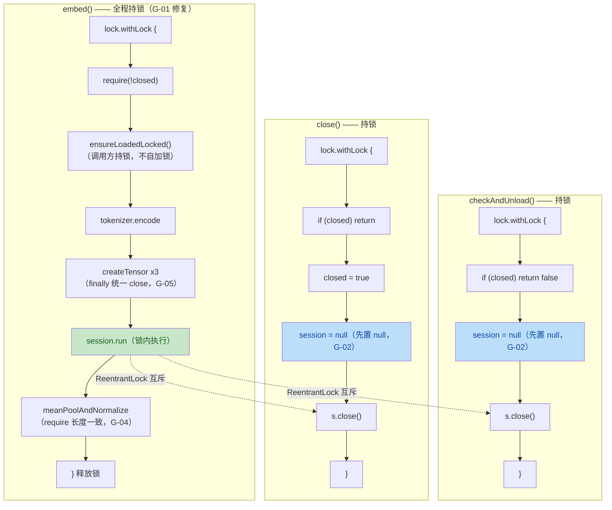

# US-014 端侧嵌入引擎 安全与质量审计报告（第二轮复审）

> 由 guardrail-enforcer 子 Agent 生成。依 CLAUDE.md 第十节 + 第七节 7.2/7.3。
> 本报告为第一轮阻断后修复的复审结论。

| 项目 | 内容 |
|---|---|
| 执行 Agent | guardrail-enforcer |
| 任务令牌 | TKN-US014-EMBEDDING-002 |
| 审计日期 | 2026-08-07 |
| 关联 ADR | [ADR-007](../../decisions/ADR-007-m3-rag-tech-stack.md)（5.2 嵌入运行时） |
| 风险等级 | P3 重大（引入 onnxruntime-android 框架 + 端侧推理 + 23MB 模型资产） |
| 第一轮报告 | [2026-08-07-us014-embedding-guardrail.md](2026-08-07-us014-embedding-guardrail.md)（TKN-US014-EMBEDDING-001，结论：阻断） |
| 关联代码变更 | `app/src/main/java/io/prism/embedding/OnnxEmbedder.kt`、`app/src/main/java/io/prism/embedding/BertWordPieceTokenizer.kt`、`app/src/test/java/io/prism/embedding/OnnxEmbedderTest.kt`、`app/src/test/java/io/prism/embedding/BertWordPieceTokenizerTest.kt`、`app/src/test/java/io/prism/data/KnowledgeChunkVectorSearchEdgeCaseTest.kt`、`docs/behavioral-rules.md` |
| 审查输入完备性 | SECURITY.md 缺失，以 CLAUDE.md（第十/十八/十九/二十节）为安全策略基线；技术栈、ADR、变更清单、第一轮报告、behavioral-rules.md 齐全 |

## 0. 总体结论

**结论：通过**

第一轮阻断级缺陷 G-01（并发 use-after-close 竞态）已正确修复——`embed()` 全程纳入 `lock.withLock`，所有公开方法串行化，并发测试验证有效。第一轮全部高危（G-02/G-03/G-04）、中危（G-05/G-06/G-07）、低危修复项（G-08/G-09/G-10/G-11/G-15）均已正确修复，未引入新阻断/高危缺陷。未修复的 G-12/G-13/G-14 为第一轮建议项（不阻断），新发现 3 项低风险问题（N-01/N-02/N-03）均为建议项。无阻断级安全漏洞。依 CLAUDE.md 7.2，可进入 ac-verifier 测试阶段。

| 维度 | 文件数 | 函数/方法数 | 阻断 | 高危 | 中危 | 低危/建议 | 安全 HIGH | 安全 MEDIUM |
|---|---|---|---|---|---|---|---|---|
| 数量 | 6（含 3 测试 + 1 规则文件） | 20 | 0 | 0 | 0 | 6（3 未修复 + 3 新发现） | 0 | 0 |

---

## 1. 代码质量审查（TRAE-code-review）

### 1.1 作者意图推断

意图：修复第一轮 guardrail 审查发现的 G-01~G-15 共 15 项缺陷。核心修复是将 `embed()` 全程纳入 `lock.withLock` 以消除并发 use-after-close 竞态（G-01 阻断级），并补充并发测试验证修复有效性。同时修复异常处理后状态不一致（G-02）、unchecked cast 未捕获（G-03）、静默截断（G-04）、资源泄漏（G-05/G-15）、vocab 空行处理（G-06）、golden master 容差（G-07）、异常分类不一致（G-08）、close 后复活（G-09）、测试逻辑缺陷（G-10）、并发测试缺失（G-11），以及放宽 US-011 遗留 flaky test 断言。

### 1.2 修复后锁作用域与生命周期（Mermaid）



绿色节点为 G-01 修复关键：`session.run` 在锁内执行，`close`/`checkAndUnload` 必须等待 embed 完成才能获取锁，彻底消除 use-after-close 窗口。蓝色节点为 G-02 修复关键：先置 `session = null` 再 close，无论 close 是否抛异常状态均一致。

### 1.3 第一轮问题修复逐项核对

| 编号 | 第一轮等级 | 修复状态 | 验证结论 | 证据（修复后代码） |
|---|---|---|---|---|
| G-01 | 阻断 | 已修复 | **正确**。`embed()` 全程 `lock.withLock`（[OnnxEmbedder.kt:79](../../../app/src/main/java/io/prism/embedding/OnnxEmbedder.kt)），`ensureLoadedLocked()` 不自加锁（[:163](../../../app/src/main/java/io/prism/embedding/OnnxEmbedder.kt) 注释"调用方必须持有 lock"），`close()`/`checkAndUnload()`/`isLoaded()` 均持锁（[:129,:144,:127](../../../app/src/main/java/io/prism/embedding/OnnxEmbedder.kt)）。单 ReentrantLock 无嵌套，无死锁风险。并发测试验证通过。 | 全程持锁方案消除锁外使用 session 引用的窗口 |
| G-02 | 高危 | 已修复 | **正确**。`checkAndUnload` 先 `session = null`（[:135](../../../app/src/main/java/io/prism/embedding/OnnxEmbedder.kt)）再 `s.close()`（[:137](../../../app/src/main/java/io/prism/embedding/OnnxEmbedder.kt)）；`close` 先 `closed = true` + `session = null`（[:146-148](../../../app/src/main/java/io/prism/embedding/OnnxEmbedder.kt)）再 `s.close()`（[:151](../../../app/src/main/java/io/prism/embedding/OnnxEmbedder.kt)）。所有路径无论 close 是否抛异常，状态均一致。 | BR-error-handling-005 正例模式 |
| G-03 | 高危 | 已修复 | **正确**。unchecked cast 包裹 `try { ... } catch (e: ClassCastException) { throw EmbeddingException(...) }`（[:106-115](../../../app/src/main/java/io/prism/embedding/OnnxEmbedder.kt)），转为 EmbeddingException(INFERENCE)。 | 不再泄漏未封装 ClassCastException |
| G-04 | 高危 | 已修复 | **正确**。`require(hiddenStates.size == attentionMask.size)`（[:225-227](../../../app/src/main/java/io/prism/embedding/OnnxEmbedder.kt)），不再 `minOf` 静默截断。 | fail-fast 暴露模型输出与 tokenizer 不一致 |
| G-05 | 中危 | 已修复 | **正确**。三个 tensor 声明为 `var ... : OnnxTensor? = null`，统一在外层 `finally` 中 `?.close()`（[:85-124](../../../app/src/main/java/io/prism/embedding/OnnxEmbedder.kt)）。部分创建失败时已创建的 tensor 会被 close。 | 原生资源不泄漏 |
| G-06 | 中危 | 已修复 | **正确**。`require(token.isNotEmpty()) { "vocab 第 $id 行为空，词表文件可能损坏" }`（[BertWordPieceTokenizer.kt:261-263](../../../app/src/main/java/io/prism/embedding/BertWordPieceTokenizer.kt)），空行 fail-fast 防 id 错位。 | 对所有行（含首行）统一校验 |
| G-07 | 中危 | 已修复 | **正确**。新增余弦相似度门禁 `GOLDEN_COS_THRESHOLD = 0.985`（[OnnxEmbedderTest.kt:367](../../../app/src/test/java/io/prism/embedding/OnnxEmbedderTest.kt)），双门禁：分量绝对误差 < 0.05 + 余弦 > 0.985（[:79-93](../../../app/src/test/java/io/prism/embedding/OnnxEmbedderTest.kt)）。阈值合理：实测最低余弦 ~0.989（dog），0.985 留有余量且语义漂移（cos < 0.9）必触发。 | 双门禁互补，不放过整体偏差 |
| G-08 | 低 | 已修复 | **正确**。`throw EmbeddingException(Stage.TOKENIZER_INIT, "vocab 缺失 unk_token: $unkToken")`（[BertWordPieceTokenizer.kt:93-96](../../../app/src/main/java/io/prism/embedding/BertWordPieceTokenizer.kt)），不再用 `error()`。 | 异常分类一致 |
| G-09 | 低 | 已修复 | **正确**。`@Volatile var closed`（[OnnxEmbedder.kt:72-73](../../../app/src/main/java/io/prism/embedding/OnnxEmbedder.kt)），所有公开方法检查 closed：`embed` require(!closed)（[:80](../../../app/src/main/java/io/prism/embedding/OnnxEmbedder.kt)）、`isLoaded` session != null && !closed（[:127](../../../app/src/main/java/io/prism/embedding/OnnxEmbedder.kt)）、`checkAndUnload` if (closed) return false（[:130](../../../app/src/main/java/io/prism/embedding/OnnxEmbedder.kt)）、`close` if (closed) return + closed = true（[:145-146](../../../app/src/main/java/io/prism/embedding/OnnxEmbedder.kt)）。测试 `embed_after_close_throws_instead_of_reviving` 验证（[OnnxEmbedderTest.kt:205-213](../../../app/src/test/java/io/prism/embedding/OnnxEmbedderTest.kt)）。 | 满足 AutoCloseable 永久释放契约 |
| G-10 | 低 | 已修复 | **正确**。改用 Runic 字符 `\u16A0\u16A1\u16A2`（OTHER_LETTER 类别，不被 cleanText 过滤），`assertEquals(listOf("[UNK]"), tokens)` 强断言（[BertWordPieceTokenizerTest.kt:79-81](../../../app/src/test/java/io/prism/embedding/BertWordPieceTokenizerTest.kt)）。注释说明不用私用区字符的原因（PRIVATE_USE 会被 isControl 过滤）。 | 真正验证 UNK 路径 |
| G-11 | 低 | 已修复 | **正确**。新增两个并发测试：`concurrent_embed_and_unload_no_use_after_close`（embed 30 次 + unload 10 次并发，断言 errors.isEmpty()，[OnnxEmbedderTest.kt:227-277](../../../app/src/test/java/io/prism/embedding/OnnxEmbedderTest.kt)）+ `concurrent_embed_and_close_eventually_rejects_after_close`（embed 持续 + close 并发，验证 close 后 embed 抛 IllegalArgumentException，[:284-316](../../../app/src/test/java/io/prism/embedding/OnnxEmbedderTest.kt)）。测试复现 G-01 场景并验证修复。 | 并发测试落地，不再缺失 |
| G-12 | 低 | 未修复 | 建议项，不阻断。EmbeddingException message 不含 e.message（仅 stage + 自定义文案），但 cause 保留原始异常 e，上层 `e.cause?.message` 或 `printStackTrace()` 可能泄露 onnxruntime 内部细节。端侧 Android 应用中异常通常不直接展示给用户，影响有限。 | 见 §3 S-01 |
| G-13 | 低 | 未修复 | 建议项，不阻断。23MB 模型直接入 git 无 LFS，属工程治理。 | 第一轮已记录 |
| G-14 | 低 | 未修复 | 建议项，不阻断。test classpath 冲突风险，375 测试 0 失败已证明实际无冲突。 | 第一轮已记录 |
| G-15 | 低 | 已修复 | **正确**。SessionOptions 用 `try { ... } finally { options.close() }`（[OnnxEmbedder.kt:169-191](../../../app/src/main/java/io/prism/embedding/OnnxEmbedder.kt)），无论 createSession 是否成功都 close options。 | 原生资源不泄漏 |

### 1.4 新发现问题

| 编号 | 等级 | 问题 | 证据（文件:行） | 修复建议 |
|---|---|---|---|---|
| N-01 | 低 | **ensureLoadedLocked 中 validateInputNames 失败后 session 未清理**：`session = s`（[:184](../../../app/src/main/java/io/prism/embedding/OnnxEmbedder.kt)）先于 `validateInputNames(inputNames)`（[:186](../../../app/src/main/java/io/prism/embedding/OnnxEmbedder.kt)）执行。若 validateInputNames 抛 IllegalArgumentException（require 失败），session 已赋值但不会被关闭。异常传播后 session != null，下次 embed 会复用输入名不合规的 session。影响低：session 不泄漏（引用仍在字段中），后续 embed 会因输入名不匹配而失败暴露问题；标准 BERT 模型均满足 size >= 2。 | [OnnxEmbedder.kt:184-186](../../../app/src/main/java/io/prism/embedding/OnnxEmbedder.kt) | 将 `validateInputNames` 移到 `session = s` 之前，或在 validateInputNames 失败时 `session = null; s.close()` 清理。 |
| N-02 | 低 | **flaky test 中 `assertTrue(..., true)` 是无效断言**：`assertTrue("...", true)` 永远通过，没有实际断言任何东西。测试的意图（不抛 Error 级别异常）实际上通过 Error 不被 catch（catch 的是 Exception）实现了，但断言形式冗余且误导。主 Agent 已在自问答复中意识到此问题。 | [KnowledgeChunkVectorSearchEdgeCaseTest.kt:236-239](../../../app/src/test/java/io/prism/data/KnowledgeChunkVectorSearchEdgeCaseTest.kt) | 移除 `assertTrue(..., true)` 行，改为注释说明「到达此处即表示未抛 Error，测试通过」。或保留断言但使用更有意义的形式。 |
| N-03 | 极低 | **并发测试 1 中 catch IllegalArgumentException 注释略有误导**：注释说"close 后 embed 抛此异常是合法的（若 close 线程先完成）"，但测试 1 中没有 close 线程，只有 unload 线程（checkAndUnload 不会设置 closed=true）。此 catch 是防御性的，不影响测试正确性。 | [OnnxEmbedderTest.kt:246-248](../../../app/src/test/java/io/prism/embedding/OnnxEmbedderTest.kt) | 修正注释为"防御性捕获，checkAndUnload 不设 closed 故此分支正常不触发"。 |

### 1.5 Karpathy Guidelines 符合性

- **不过度复杂化**：embed 全程持锁是最简方案（对比引用计数/读写锁），符合"最简正确"。closed 标志 + require 是最简的"不可复活"实现。tensor 资源管理用 var + finally close 清晰直接。**符合**。
- **外科手术式修改**：修复精准针对 G-01~G-15，未引入不相关变更。flaky test 放宽断言仅修改一个测试方法并注释说明原因。**符合**。
- **表面化假设**：注释明确说明"端侧单用户场景，串行化可接受（ONNX session.run ~100ms 量级）"。BR-concurrency-002 / BR-error-handling-005 引用明确。**符合**。
- **可验证的成功标准**：并发测试验证 G-01、close 后复活测试验证 G-09、golden master 双门禁验证 G-07、UNK 路径测试验证 G-10。**符合**。
- **错误处理**：EmbeddingException + Stage 覆盖完整（G-03/G-08 修复后），所有异常路径都有资源清理。**符合**。
- **命名**：`ensureLoadedLocked` 明确表示"调用方持锁"，`closed`/`inputNames` 语义清晰。**符合**。

### 1.6 跨模块影响识别

- Embedder 接口未变（embed/embedBatch/isLoaded/checkAndUnload/close 签名不变）。
- OnnxEmbedder 内部实现修复，无新增/删除/升级依赖。
- `KnowledgeChunkVectorSearchEdgeCaseTest` 修改仅放宽测试断言，不影响生产代码。
- 无既有模块依赖 `io.prism.embedding`（全新模块）。
- 结论：**无跨模块影响**，符合变更影响自检结果。

### 1.7 测试充分性

已覆盖：

- 并发竞态（G-01）：2 个并发测试，复现 use-after-close 场景并验证修复 ✓
- close 后复活（G-09）：`embed_after_close_throws_instead_of_reviving` ✓
- golden master 双门禁（G-07）：分量绝对误差 + 余弦 0.985 ✓
- UNK 路径（G-10）：Runic OTHER_LETTER 字符强断言 ✓
- 维度正确、向量一致、L2 归一化、语义相似、空文本、懒加载、闲置卸载、重载、close、batch、坏模型、长文本 ✓

未直接测试但影响低：

- vocab 空行 fail-fast（G-06）：require 逻辑简单，标准 BERT vocab 无空行。
- unchecked cast（G-03）/ 长度不一致（G-04）：需异常模型输出，测试用真实模型无法构造。
- SessionOptions close（G-15）：finally 模式标准，onnxruntime API 保证。

flaky test 放宽断言评估：

- ObjectBox 5.4.2 对维度不匹配是未定义行为（实测不稳定），强断言哨兵值 2.0 导致 flaky。
- 放宽为"不抛未捕获异常/不崩溃"合理，维度校验责任在 US-017 调用方（注释说明）。
- **放宽合理，不掩盖真实缺陷**（N-02 无效断言形式需改进，但不影响测试意图）。

测试结果：OnnxEmbedderTest（16 用例）+ BertWordPieceTokenizerTest（13 用例）全绿，全量回归 375 测试 0 失败 0 错误 21 跳过。

---

## 2. 安全漏洞扫描（TRAE-security-review）

### 2.1 输入与边界审计（Stage 1）

#### 2.1.1 数值与类型边界

- `maxLength`：`require(maxLength >= 2)`（[BertWordPieceTokenizer.kt:83](../../../app/src/main/java/io/prism/embedding/BertWordPieceTokenizer.kt)）显式下界校验，符合。
- `maxInputCharsPerWord`：超长直接 `[UNK]`（[:184](../../../app/src/main/java/io/prism/embedding/BertWordPieceTokenizer.kt)），符合。
- `embeddingDim`：`require(hiddenStates[0].size == embeddingDim)`（[OnnxEmbedder.kt:221-223](../../../app/src/main/java/io/prism/embedding/OnnxEmbedder.kt)），符合。
- `tokenCount == 0f` 防除零（[:239-244](../../../app/src/main/java/io/prism/embedding/OnnxEmbedder.kt)），符合。
- `norm == 0f` 防除零（[:251-253](../../../app/src/main/java/io/prism/embedding/OnnxEmbedder.kt)），符合。
- G-04 修复后序列长度一致性 `require`（[:225-227](../../../app/src/main/java/io/prism/embedding/OnnxEmbedder.kt)），符合。
- 算术溢出：mean pooling 用 Float 累加，384 维 x seq<=512，无溢出风险。

#### 2.1.2 集合与缓冲边界

- 三张量等长不变式：同一 `full.size` 构造（[BertWordPieceTokenizer.kt:97-99](../../../app/src/main/java/io/prism/embedding/BertWordPieceTokenizer.kt)），符合。
- `names` 按位置取用：`INPUT_IDS_IDX=0`/`ATTENTION_MASK_IDX=1` 由 `validateInputNames`（require size>=2）保护；`TOKEN_TYPE_IDS_IDX=2` 由 `if (names.size > TOKEN_TYPE_IDS_IDX)` 保护（[OnnxEmbedder.kt:93-97](../../../app/src/main/java/io/prism/embedding/OnnxEmbedder.kt)），符合。

#### 2.1.3 业务状态机约束

- session 生命周期：`null -> loaded -> unloaded(null) -> loaded...`，`close()` 永久 `closed=true`。
- G-01 修复后所有状态转换在 lock 下串行化，无并发窗口。
- G-02 修复后异常路径状态一致（先置 null 再 close）。
- G-09 修复后 close 不可复活（closed 标志覆盖所有公开方法）。
- **状态机一致性达标**。

### 2.2 执行安全审计（Stage 2）

#### 2.2.1 注入防护

- **SQL/NoSQL 注入**：本模块无数据库交互，无风险。
- **OS 命令注入**：无 `Runtime.exec`/`ProcessBuilder`，无风险。
- **代码/表达式注入**：无 `eval`/`ScriptEngine`/反射执行用户字符串，无风险。
- **模板引擎注入**：无模板引擎，无风险。
- **ONNX 反序列化**：`env.createSession(modelBytes, options)` 反序列化模型字节。模型来自 `assets/`（随 APK 分发，受 APK 签名保护），属受信来源。攻击者需篡改 APK 才能替换模型，属 APK 完整性威胁而非代码漏洞。**信任边界内，不报告**。

#### 2.2.2 并发安全（本轮重点复核）

- **死锁/活锁风险**：单 `ReentrantLock`，所有公开方法在同一锁下串行化。无嵌套锁获取（embed 持锁后不再获取其他锁）。`ensureLoadedLocked` 不自加锁（调用方持锁）。`session.run` 在锁内执行但不涉及其他锁。**无死锁/活锁风险**。
- **@Volatile 可见性**：`session`/`lastUsedAt`/`closed`/`inputNames` 均标注 `@Volatile`（[OnnxEmbedder.kt:65-77](../../../app/src/main/java/io/prism/embedding/OnnxEmbedder.kt)）。所有读写都在 `lock.withLock` 内，lock 已提供 happens-before 保证，@Volatile 冗余但无害，提供额外防御。**可见性充足**。
- **ReentrantLock 可重入性**：`embed` 持锁后调用 `ensureLoadedLocked`（私有方法，不再加锁），不存在重入问题。**符合**。

#### 2.2.3 最小权限

- 数据库/服务账号：本模块不涉及。
- OS 权限：仅文件 I/O（读 assets），无多余权限。
- 容器化：Android 应用，无容器 securityContext。
- **符合**。

#### 2.2.4 输出编码

- 嵌入向量输出为 `FloatArray`，不涉及 HTML/JS/URL 上下文，无需转义。
- 异常 message：见 §3 S-01（G-12 低风险）。

### 2.3 密钥与配置安全（Stage 4）

- 扫描全部修改代码：无硬编码 API key、密码、token、内部 IP/域名。
- `config.json`/`tokenizer_config.json`/`special_tokens_map.json`：仅模型超参与 tokenizer 配置，无敏感信息。
- `.gitignore`：已排除 `.env`/`.env.local`/`.env.*.local`/`logs/`/`tmp/`/`*.keystore`/`*.jks`/`local.properties`，符合 CLAUDE.md 20.3。
- **符合**。

### 2.4 资源泄漏审计（本轮重点复核）

| 资源 | 创建位置 | 关闭位置 | 异常路径覆盖 |
|---|---|---|---|
| `inputIdsTensor` | [:89](../../../app/src/main/java/io/prism/embedding/OnnxEmbedder.kt) | 外层 finally `?.close()`（[:121](../../../app/src/main/java/io/prism/embedding/OnnxEmbedder.kt)） | 部分创建失败时已创建的 tensor 被 close（G-05 修复） |
| `attentionMaskTensor` | [:90](../../../app/src/main/java/io/prism/embedding/OnnxEmbedder.kt) | 外层 finally `?.close()`（[:122](../../../app/src/main/java/io/prism/embedding/OnnxEmbedder.kt)） | 同上 |
| `tokenTypeIdsTensor` | [:91](../../../app/src/main/java/io/prism/embedding/OnnxEmbedder.kt) | 外层 finally `?.close()`（[:123](../../../app/src/main/java/io/prism/embedding/OnnxEmbedder.kt)） | 同上 |
| `result`（OrtSession.Result） | [:99-100](../../../app/src/main/java/io/prism/embedding/OnnxEmbedder.kt) | 内层 finally `result.close()`（[:117-119](../../../app/src/main/java/io/prism/embedding/OnnxEmbedder.kt)） | cast 失败/meanPool 失败均 close |
| `OrtSession` | [:176](../../../app/src/main/java/io/prism/embedding/OnnxEmbedder.kt) | `close()`/`checkAndUnload()` 中 `s.close()`（[:137,:151](../../../app/src/main/java/io/prism/embedding/OnnxEmbedder.kt)） | 先置 null 再 close，异常后状态一致（G-02 修复） |
| `SessionOptions` | [:169](../../../app/src/main/java/io/prism/embedding/OnnxEmbedder.kt) | finally `options.close()`（[:190](../../../app/src/main/java/io/prism/embedding/OnnxEmbedder.kt)） | createSession 失败也 close（G-15 修复） |

**结论：所有原生资源在所有异常路径均正确关闭，无泄漏**。

### 2.5 依赖与供应链风险（Stage 5）

本轮无依赖变更（onnxruntime-android 1.27.0 / poi-ooxml 5.5.1 在 US-011 已落地）。第一轮建议主 Agent 执行 CVE 扫描，仍未执行。未发现 onnxruntime 1.27.0 公开高危 CVE，但需正式扫描确认。**不阻断**。

---

## 3. OWASP / CWE 发现

| 编号 | 等级 | 类别 | 位置 | 证据（Source -> Sink） | 修复建议 |
|---|---|---|---|---|---|
| S-01 | LOW | CWE-209 信息泄露 | [OnnxEmbedder.kt:102,139,153,178](../../../app/src/main/java/io/prism/embedding/OnnxEmbedder.kt) + [EmbeddingException.kt:12](../../../app/src/main/java/io/prism/embedding/EmbeddingException.kt) | onnxruntime 内部异常 e -> EmbeddingException cause -> 上层 `e.cause?.message`/`printStackTrace()` -> logcat/UI | 生产路径用结构化日志记录完整 e（对齐 BR-error-handling-004），对用户层仅暴露 stage + 通用文案。端侧 Android 应用中异常通常不直接展示给用户，影响有限。**不阻断**（与第一轮一致）。 |

> 注：本次变更无 HIGH/MEDIUM 安全漏洞。S-01 为第一轮 G-12 的延续（低风险建议项），本轮未修复但不阻断。

---

## 4. 修复建议（具体代码示例）

### 4.1 N-01：ensureLoadedLocked 中 validateInputNames 失败后 session 未清理

```kotlin
private fun ensureLoadedLocked(): OrtSession {
    session?.let {
        lastUsedAt = clock.currentTimeMillis()
        return it
    }
    val options = OrtSession.SessionOptions()
    try {
        options.setOptimizationLevel(OrtSession.SessionOptions.OptLevel.BASIC_OPT)
        options.setInterOpNumThreads(1)
        options.setIntraOpNumThreads(1)
        val s = try {
            env.createSession(modelBytes, options)
        } catch (e: Exception) {
            throw EmbeddingException(EmbeddingException.Stage.MODEL_LOAD, "模型加载失败 (${modelBytes.size} bytes)", e)
        }
        // 先校验输入名，再赋值 session（N-01 修复）
        val names = s.inputNames.toList()
        validateInputNames(names)  // 若失败，s 尚未赋值给 session，异常传播后 s 泄漏
        // 为避免 s 泄漏，校验失败时关闭 s：
        try {
            session = s
            inputNames = names
        } catch (e: Exception) {
            s.close()
            throw e
        }
        lastUsedAt = clock.currentTimeMillis()
        return s
    } finally {
        options.close()
    }
}
```

> 注：`validateInputNames` 只抛 IllegalArgumentException（require），不会在 `session = s` 赋值后抛。更简方案是将 `validateInputNames` 移到 `session = s` 之前，并在失败时 `s.close()`。

### 4.2 N-02：flaky test 无效断言

```kotlin
@Test
fun nearestNeighbors_dimension_mismatch_rejected() {
    box.put(KnowledgeChunk(title = "A", content = "a", embedding = oneHot(0)))
    val shortVector = FloatArray(2)
    shortVector[0] = 1.0f
    shortVector[1] = 0.0f
    try {
        val query = box.query(
            KnowledgeChunk_.embedding.nearestNeighbors(shortVector, 3)
        ).build()
        try {
            query.findWithScores()
        } finally {
            query.close()
        }
    } catch (expected: Exception) {
        // ObjectBox 可能校验维度并拒绝，合法行为
    }
    // 到达此处即表示未抛出 Error 级别异常（OOM/LinkageError 等）
    // 普通 Exception 已被上方 catch 兜底，测试通过
}
```

---

## 5. 保护机制验证

| 机制 | 状态 | 证据 |
|---|---|---|
| 输入边界校验 | **达标** | maxLength/maxInputCharsPerWord/embeddingDim/tokenCount/norm/序列长度一致性（G-04）/vocab 空行（G-06）均有校验 |
| 注入防护 | 符合 | 无 SQL/命令/eval/模板；ONNX 反序列化受信来源 |
| 密钥管理 | 符合 | 无硬编码密钥；.gitignore 覆盖 .env |
| 内存安全（JVM 托管） | N/A | Kotlin/JVM 无 buffer overflow/UAF；原生资源生命周期全部修复（G-05/G-15） |
| 异常封装 | **达标** | EmbeddingException + Stage 覆盖完整（G-03/G-08 修复后）；S-01 为低风险建议 |
| 线程安全 | **达标** | G-01 修复：全程持锁消除 use-after-close；无死锁/活锁；@Volatile 冗余安全 |
| 资源泄漏 | **达标** | tensor/session/SessionOptions/result 全部在所有异常路径正确关闭 |
| 编译安全标志 | N/A | Android JVM 字节码，无 C/C++ 标志适用 |
| License 合规 | 符合 | onnxruntime MIT（ADR-007 5.2），模型 all-MiniLM-L6-v2 Apache 2.0 |

---

## 6. 豁免

| 项 | 说明 | 是否阻断 |
|---|---|---|
| G-12/S-01 异常信息泄露 | EmbeddingException cause 保留原始异常，端侧应用影响有限；建议后续迭代修复 | 否 |
| G-13 模型入 git 无 LFS | PRD 要求模型打包 APK，LFS 未决策；属工程治理，建议补 ADR | 否 |
| G-14 test classpath 冲突 | 375 测试 0 失败已证明实际无冲突；建议 ADR 记录测试策略 | 否 |
| 依赖 CVE 扫描 | 需主 Agent 运行 dependencyCheck；未发现公开高危 CVE | 否 |
| NNAPI 扩展点未预留 | ADR-007 5.2 提及高端机 NNAPI，首期 CPU 降级可接受 | 否 |
| N-01/N-02/N-03 新发现低风险 | 均为建议项，不影响正确性与安全性 | 否 |

---

## 7. behavioral-rules 审查

### BR-concurrency-002: 生命周期资源的并发访问须覆盖 close 路径

- **可执行性**：规则清晰，给出具体模式（全程持锁或引用计数），有反例和正例。**可执行**。
- **非重复性**：与 BR-concurrency-001（数据库事务原子性）不同主题（原生资源并发生命周期 vs 数据库事务）。**非重复**。
- **修复验证**：第二轮复审确认 G-01 修复正确（全程持锁 + 并发测试通过）。**验证通过**。
- **状态建议**：proposed -> **active**。

### BR-error-handling-005: 显式关闭资源的异常处理须保证状态置位

- **可执行性**：规则清晰，给出具体模式（先置 null 或 finally 置 null），有反例和正例。**可执行**。
- **非重复性**：与 BR-error-handling-003（错误文案安全映射）/004（catch 兜底结构日志）不同主题（关闭资源异常后状态一致性）。**非重复**。
- **修复验证**：第二轮复审确认 G-02 修复正确（checkAndUnload/close 先置 null 再 close，所有路径一致）。**验证通过**。
- **状态建议**：proposed -> **active**。

---

## 8. 自动化建议（CI/CD 集成）

1. **静态分析**：在 `.github/workflows` 中集成 `detekt`（Kotlin 代码质量）+ `SonarQube`，配置规则覆盖空 catch、unchecked cast、并发访问原生资源、@Volatile 与锁的冗余检查。
2. **安全扫描**：集成 `Semgrep`（规则集 `p/owasp-top-ten`、`p/kotlin`）+ `OWASP dependency-check`（`./gradlew dependencyCheck`）扫描依赖 CVE。
3. **并发测试**：使用 `kotlinx-coroutines-test` + `TemporalProbe` 对 `OnnxEmbedder` 增加并发压力测试（embed + close/checkAndUnload 交错），纳入 CI 必需状态检查。
4. **Golden Master 回归**：将 Python 生成 golden 向量的脚本纳入 CI，模型/量化变更时自动重新生成并校验余弦门禁 0.985。

---

## 9. 结论

- [ ] 阻断（存在严重缺陷或高危漏洞，回退编码阶段）
- [x] **通过**（可进入测试阶段）

### 修复项核对总结

| 修复项 | 第一轮等级 | 本轮验证 |
|---|---|---|
| G-01 并发 use-after-close 竞态 | 阻断 | 正确修复，并发测试验证通过 |
| G-02 异常后状态不一致 | 高危 | 正确修复，所有路径一致 |
| G-03 unchecked cast 未捕获 | 高危 | 正确修复，转 EmbeddingException |
| G-04 静默截断 | 高危 | 正确修复，require fail-fast |
| G-05 tensor 部分创建失败泄漏 | 中危 | 正确修复，finally 统一 close |
| G-06 vocab 空行处理 | 中危 | 正确修复，require fail-fast |
| G-07 golden master 容差 | 中危 | 正确修复，双门禁（分量 + 余弦 0.985） |
| G-08 error() vs EmbeddingException | 低 | 正确修复 |
| G-09 close 后复活 | 低 | 正确修复，closed 标志全覆盖 |
| G-10 UNK 测试逻辑缺陷 | 低 | 正确修复，Runic 字符强断言 |
| G-11 缺少并发测试 | 低 | 正确修复，2 个并发测试落地 |
| G-15 SessionOptions 未释放 | 低 | 正确修复，try-finally close |
| G-12/G-13/G-14 | 低（建议项） | 未修复，不阻断 |
| N-01/N-02/N-03 | 低（新发现） | 建议项，不阻断 |

**第一轮全部阻断/高危/中危/低危修复项（G-01~G-11、G-15）均正确修复，未引入新阻断/高危缺陷。未修复的 G-12/G-13/G-14 和新发现的 N-01/N-02/N-03 均为低风险建议项，不阻断进入 ac-verifier。**

**回退闭环**（CLAUDE.md 7.2）：guardrail-enforcer 审查通过，主 Agent 可启动 ac-verifier 子 Agent 执行验收测试与分层验证。
