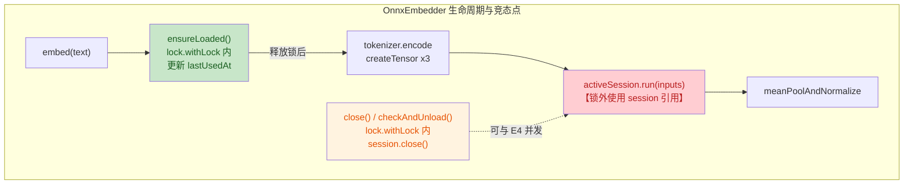

# US-014 端侧嵌入引擎 安全与质量审计报告

> 由 guardrail-enforcer 子 Agent 生成。依 CLAUDE.md 第十节。
> 本报告为本次代码变更进入测试阶段前的强制审查结论。

| 项目 | 内容 |
|---|---|
| 执行 Agent | guardrail-enforcer |
| 任务令牌 | TKN-US014-EMBEDDING-001 |
| 审计日期 | 2026-08-07 |
| 关联 ADR | [ADR-007](../../decisions/ADR-007-m3-rag-tech-stack.md)（5.2 嵌入运行时） |
| 风险等级 | P3 重大（引入 onnxruntime-android 框架 + 端侧推理 + 23MB 模型资产） |
| 关联代码变更 | `app/src/main/java/io/prism/embedding/*.kt`（6 文件）、`app/src/test/java/io/prism/embedding/*Test.kt`（2 文件）、`app/src/test/resources/embedding/golden_master.json`、`app/build.gradle.kts`、`gradle/libs.versions.toml`、`app/src/main/assets/models/*` |
| 审查输入完备性 | SECURITY.md 缺失，以 CLAUDE.md（第十/十八/十九/二十节）为安全策略基线；技术栈、ADR、变更清单、历史漏洞记录（behavioral-rules.md）齐全 |

## 0. 总体结论

**结论：阻断**

存在 1 项阻断级代码质量缺陷（G-01 并发 use-after-close 竞态，违反接口显式声明的线程安全契约）与多项中危错误处理缺陷。无阻断级安全漏洞（无注入、无硬编码密钥、无 RCE）。依 CLAUDE.md 7.2，主 Agent 必须立即停止后续步骤，无条件回退至编码阶段，修复全部阻断/高危问题后重新提交审查。在 G-01 未修复前不得进入 ac-verifier。

| 维度 | 文件数 | 函数/方法数 | 阻断 | 高危 | 中危 | 低危/建议 | 安全 HIGH | 安全 MEDIUM |
|---|---|---|---|---|---|---|---|---|
| 数量 | 8（含 2 测试 + 1 资源） | 18 | 1 | 3 | 3 | 8 | 0 | 0 |

---

## 1. 代码质量审查（TRAE-code-review）

### 1.1 作者意图推断

意图：为 M3 RAG 实现端侧文本嵌入引擎，将任意文本编码为 384 维 L2 归一化向量。采用 onnxruntime-android 加载 all-MiniLM-L6-v2 INT8 量化模型，自研 BERT WordPiece tokenizer 对齐 HuggingFace `BertTokenizer`，并以「按需加载 + 闲置 5 分钟卸载」管理 ~23MB 模型内存。属新功能模块，不改动既有接口。

### 1.2 变更概览（Mermaid）



红色节点 E4 为竞态暴露点：`ensureLoaded()` 返回 session 引用后锁已释放，`close()` 可在此窗口内关闭 session。

### 1.3 问题清单

| 编号 | 等级 | 问题 | 证据（文件:行） | 修复建议 |
|---|---|---|---|---|
| G-01 | 阻断 | **并发 use-after-close 竞态**：`embed()` 在 `ensureLoaded()` 释放锁后使用 `activeSession`，`close()` 可并发关闭 session，导致 `activeSession.run` 抛 `IllegalStateException`。违反 `Embedder` 接口声明的线程安全契约（[Embedder.kt:17](../../../app/src/main/java/io/prism/embedding/Embedder.kt)「实现需保证 embed / embedBatch 可并发调用」）。 | [OnnxEmbedder.kt:74](../../../app/src/main/java/io/prism/embedding/OnnxEmbedder.kt)（锁内返回）→ [OnnxEmbedder.kt:87](../../../app/src/main/java/io/prism/embedding/OnnxEmbedder.kt)（锁外 `activeSession.run`）；对照 [OnnxEmbedder.kt:123](../../../app/src/main/java/io/prism/embedding/OnnxEmbedder.kt)（`close()` 锁内 `s.close()`） | 将 `embed()` 整体纳入 `lock.withLock`（端侧单用户，串行化可接受；onnxruntime `session.run` 本身线程安全但全程持锁最简）；或引入引用计数/读写锁，`close()`/`checkAndUnload()` 等待活跃 embed 完成。二选一，并在测试中覆盖「close 与 embed 并发」用例。 |
| G-02 | 高危 | **close/checkAndUnload 异常后状态不一致**：`s.close()` 抛异常时 `catch` 块 `throw EmbeddingException`，其后 `session = null` 不执行，对象残留已关闭 session 引用，下次 `checkAndUnload` 会重复 `close` 已关闭 session。 | [OnnxEmbedder.kt:111-117](../../../app/src/main/java/io/prism/embedding/OnnxEmbedder.kt) 与 [OnnxEmbedder.kt:123-131](../../../app/src/main/java/io/prism/embedding/OnnxEmbedder.kt) | 无论 `s.close()` 是否成功都置 `session = null`：将 `session = null` 移入 `finally`，或先置 null 再 close（捕获异常后仍置 null）。 |
| G-03 | 高危 | **unchecked cast 未捕获**：`result[0].value as Array<Array<FloatArray>>` 若模型输出结构不符（如导出为 pooler_output 或维度异常），抛 `ClassCastException` 以未封装 `RuntimeException` 泄漏，未转 `EmbeddingException(INFERENCE)`。 | [OnnxEmbedder.kt:92-93](../../../app/src/main/java/io/prism/embedding/OnnxEmbedder.kt) | 用 `try { ... } catch (e: ClassCastException) { throw EmbeddingException(Stage.INFERENCE, "模型输出结构不符合 BERT last_hidden_state 预期", e) }` 包裹。 |
| G-04 | 高危 | **meanPoolAndNormalize 静默截断**：`minOf(hiddenStates.size, attentionMask.size)` 在两者不等时静默截断，掩盖模型输出与 tokenizer 不一致的根本缺陷（如序列长度漂移），调试困难。 | [OnnxEmbedder.kt:197](../../../app/src/main/java/io/prism/embedding/OnnxEmbedder.kt) | 改为 `require(hiddenStates.size == attentionMask.size) { "序列长度不一致: hidden=${hiddenStates.size} mask=${attentionMask.size}" }`，不一致即 fail-fast。 |
| G-05 | 中危 | **OnnxTensor 部分创建失败时原生资源泄漏**：三个 `OnnxTensor.createTensor` 顺序创建（L76-78），若第二个抛异常，第一个 tensor 不被 close（finally 仅在后续 try 块）。onnxruntime tensor 持有原生资源，依赖 GC 不可靠。 | [OnnxEmbedder.kt:76-78](../../../app/src/main/java/io/prism/embedding/OnnxEmbedder.kt) | 将每个 tensor 创建包入 `use { }`，或先声明 null 再在统一 finally 中 null-check close。 |
| G-06 | 中危 | **loadVocab 空行处理脆弱**：vocab 中间出现空行时 `id++` 仍执行但 token 不入表，导致后续 token 的 id 整体错位，模型推理语义错乱且无报错。标准 BERT vocab 无空行，但文件损坏/编辑误入空行时静默错位。 | [BertWordPieceTokenizer.kt:258-263](../../../app/src/main/java/io/prism/embedding/BertWordPieceTokenizer.kt) | 空行（非首行）应 `require(token.isNotEmpty()) { "vocab 第 $id 行为空，文件可能损坏" }` fail-fast，或记录警告并跳过 id 递增。 |
| G-07 | 中危 | **golden master 容差偏大**：分量绝对误差阈值 0.05，对归一化向量中绝对值 ~0.01 的小分量相当于 500% 相对误差，可能放过整体偏差。语义测试 `cos(cat,dog)>cos(cat,car)` 部分弥补，但量化漂移检测不充分。 | [OnnxEmbedderTest.kt:234](../../../app/src/test/java/io/prism/embedding/OnnxEmbedderTest.kt) | 增补 L2 距离或余弦相似度门禁（如 `1 - cosine(actual, golden) < 0.01`），与分量绝对误差双门禁。 |
| G-08 | 低 | tokenizer `encode()` 用 `error()` 抛 `IllegalStateException` 而非 `EmbeddingException`，异常分类不一致。 | [BertWordPieceTokenizer.kt:93](../../../app/src/main/java/io/prism/embedding/BertWordPieceTokenizer.kt) | 改为 `throw EmbeddingException(Stage.TOKENIZER_INIT, "vocab 缺失 unk_token: $unkToken")`。 |
| G-09 | 低 | **close() 后仍可 embed**：`close()` 仅置 `session=null`，再次 `embed` 会 `ensureLoaded` 重新加载，违背 `AutoCloseable` 永久释放契约，易导致「已关闭资源被复活」的误用。 | [OnnxEmbedder.kt:123-132](../../../app/src/main/java/io/prism/embedding/OnnxEmbedder.kt) | 引入 `@Volatile var closed = false`，`embed()`/`ensureLoaded()` 检查 `require(!closed) { "Embedder 已 close，不可复用" }`。 |
| G-10 | 低 | **unknown_word_returns_unk 测试逻辑缺陷**：`if (tokens.size == 1 && tokens[0] == "[UNK]")` 条件不满足时不做 UNK 断言，仅 `assertTrue(tokens.isNotEmpty())`，实际未验证 UNK 路径。 | [BertWordPieceTokenizerTest.kt:81-86](../../../app/src/test/java/io/prism/embedding/BertWordPieceTokenizerTest.kt) | 构造确定不在 vocab 且无子词命中的输入（如全 OOV 字符组合），强断言 `assertEquals(listOf("[UNK]"), tokens)`。 |
| G-11 | 低 | **缺少并发测试覆盖**：G-01 竞态无任何测试用例覆盖（embed 与 close/checkAndUnload 并发）。 | [OnnxEmbedderTest.kt](../../../app/src/test/java/io/prism/embedding/OnnxEmbedderTest.kt) 全文 | 新增并发测试：多线程 embed + 定时 checkAndUnload，断言无异常且结果一致。 |
| G-12 | 低 | 异常 message 含 `e.message`（onnxruntime 内部错误可能含张量形状/算子名），生产环境传 UI 有内部细节泄露风险（CWE-209）。 | [OnnxEmbedder.kt:89](../../../app/src/main/java/io/prism/embedding/OnnxEmbedder.kt)、[OnnxEmbedder.kt:114](../../../app/src/main/java/io/prism/embedding/OnnxEmbedder.kt)、[OnnxEmbedder.kt:128](../../../app/src/main/java/io/prism/embedding/OnnxEmbedder.kt)、[OnnxEmbedder.kt:153](../../../app/src/main/java/io/prism/embedding/OnnxEmbedder.kt) | 生产路径用结构化日志记录完整 `e`，对用户层仅暴露 stage + 通用文案（对齐 BR-error-handling-004）。 |
| G-13 | 低 | **23MB 模型直接入 git**：`model_qint8_arm64.onnx`（23MB）直接 commit，无 Git LFS，仓库膨胀且 clone/CI 拉取成本上升。PRD 要求模型打包入 APK，但未决策 LFS。 | `app/src/main/assets/models/model_qint8_arm64.onnx` | 评估 Git LFS 或 Gradle 下载任务（构建期拉取至 assets），写入 ADR 决策。当前不阻断（属工程治理非安全）。 |
| G-14 | 低 | **onnxruntime 依赖 test classpath 冲突风险**：`implementation(onnxruntime-android)` 与 `testImplementation(onnxruntime)` 在 test classpath 同时存在 `ai.onnxruntime.*`，测试通过可能因 JAR 优先加载，但未经验证。 | [app/build.gradle.kts:97,109](../../../app/build.gradle.kts) | 测试中显式排除 AAR 的 JVM 不兼容部分，或确认 onnxruntime-desktop 方案；在 ADR 记录测试策略。 |
| G-15 | 低 | **SessionOptions 可能未释放**：每次 `ensureLoaded` 新建 `OrtSession.SessionOptions()`，未 `close()`。需确认 onnxruntime-java API 是否要求释放。 | [OnnxEmbedder.kt:142-147](../../../app/src/main/java/io/prism/embedding/OnnxEmbedder.kt) | 确认 API；若需释放，用 `options.use { env.createSession(modelBytes, it) }`。 |

### 1.4 Karpathy Guidelines 符合性

- 命名（清晰）：`BertWordPieceTokenizer`/`OnnxEmbedder`/`EmbedderFactory`/`EmbeddingException.Stage` 语义明确，符合。
- 设计（分层）：`Embedder` 接口 + `OnnxEmbedder` 实现 + `EmbedderFactory` 解耦 AssetManager，符合「surface assumptions」。
- 错误处理：`EmbeddingException` + `Stage` 枚举方向正确，但 G-02/G-03/G-06/G-08 显示覆盖不完整、状态机不一致。
- 简洁性：`meanPoolAndNormalize` 清晰；但 G-01 锁作用域设计错误。
- 可验证性：26 测试用例覆盖维度/一致性/golden/语义/卸载/close/batch/坏模型/长文本，但缺并发与若干边界（G-07/G-10/G-11）。

### 1.5 跨模块影响识别

- 全新模块，不修改既有接口/契约/数据模型。
- `gradle/libs.versions.toml` 新增 `onnxruntime` 别名（testImplementation），`app/build.gradle.kts` 新增 `testImplementation(libs.onnxruntime)`，无现有依赖被移除/升级。
- 依赖模块扫描：无既有模块依赖 `io.prism.embedding`。
- 结论：跨模块影响为「无」，符合变更影响自检结果。

### 1.6 测试充分性

- 维度正确、向量一致、L2 归一化、golden master、语义相似、空文本、懒加载、闲置卸载、重载、close、batch、坏模型、长文本 —— 13 用例覆盖主线。
- 缺失：并发竞态（G-11）、vocab 空行、token_type_ids 缺失模型（names.size==2）路径、close 后再 embed 行为、跨平台量化一致性深度验证。
- golden master 容差合理性：见 G-07，需补 L2/余弦门禁。
- Typecheck passes（compileDebugKotlin + compileDebugUnitTestKotlin）确认，372 测试 0 失败。

---

## 2. 安全漏洞扫描（TRAE-security-review）

### 2.1 输入与边界审计（Stage 1）

#### 2.1.1 数值与类型边界

- `maxLength`：[BertWordPieceTokenizer.kt:83](../../../app/src/main/java/io/prism/embedding/BertWordPieceTokenizer.kt) `require(maxLength >= 2)` 显式下界校验，符合。
- `maxInputCharsPerWord`：[BertWordPieceTokenizer.kt:181](../../../app/src/main/java/io/prism/embedding/BertWordPieceTokenizer.kt) `if (token.length > maxInputCharsPerWord) return listOf(unkToken)`，符合。
- `embeddingDim` 校验：[OnnxEmbedder.kt:192-194](../../../app/src/main/java/io/prism/embedding/OnnxEmbedder.kt) `require(hiddenStates[0].size == embeddingDim)`，符合。
- `tokenCount == 0f` 防除零：[OnnxEmbedder.kt:207-212](../../../app/src/main/java/io/prism/embedding/OnnxEmbedder.kt)，符合。
- `norm == 0f` 防除零：[OnnxEmbedder.kt:219-221](../../../app/src/main/java/io/prism/embedding/OnnxEmbedder.kt) 不归一化返回零向量，可接受（全零 pooled 几乎不可能）。
- 算术溢出：mean pooling 用 Float 累加，384 维 × seq≤512，无溢出风险。

#### 2.1.2 集合与缓冲边界

- `inputIds`/`attentionMask`/`tokenTypeIds` 三张量等长不变式：[BertWordPieceTokenizer.kt:94-96](../../../app/src/main/java/io/prism/embedding/BertWordPieceTokenizer.kt) 同一 `full.size` 构造，符合。
- `names` 按位置取用：[OnnxEmbedder.kt:82-85](../../../app/src/main/java/io/prism/embedding/OnnxEmbedder.kt) `INPUT_IDS_IDX=0`/`ATTENTION_MASK_IDX=1` 由 `validateInputNames`（require size>=2）保护；`TOKEN_TYPE_IDS_IDX=2` 由 `if (names.size > TOKEN_TYPE_IDS_IDX)` 保护，符合。
- `meanPoolAndNormalize` 越界：G-04 已记录 `minOf` 静默截断为质量缺陷（非安全漏洞，输入来自受控 tokenizer）。

#### 2.1.3 业务状态机约束

- session 生命周期：`null → loaded → unloaded(null) → loaded...`，`close()` 永久 null。G-01（并发）与 G-02（异常后状态）为状态机一致性缺陷，已记录。
- `close()` 后复活（G-09）违反 AutoCloseable 状态契约。

### 2.2 执行安全审计（Stage 2）

#### 2.2.1 注入防护

- **SQL/NoSQL 注入**：本模块无数据库交互（ObjectBox 集成在后续 US），无拼接查询，无风险。
- **OS 命令注入**：无 `Runtime.exec`/`ProcessBuilder`，无风险。
- **代码/表达式注入**：无 `eval`/`ScriptEngine`/反射执行用户字符串，无风险。
- **模板引擎注入**：无模板引擎，无风险。
- **ONNX 反序列化**：`env.createSession(modelBytes, options)` 反序列化模型字节。模型来自 `assets/`（随 APK 分发，受 APK 签名保护），属受信来源。攻击者需篡改 APK 才能替换模型，属 APK 完整性威胁而非代码漏洞。**不报告**（信任边界内）。

#### 2.2.2 最小权限

- 数据库/服务账号：本模块不涉及。
- OS 权限：仅文件 I/O（读 assets），无多余权限。
- 容器化：本项目为 Android 应用，无容器 securityContext。
- 符合。

#### 2.2.3 输出编码

- 嵌入向量输出为 `FloatArray`，不涉及 HTML/JS/URL 上下文，无需转义。
- 异常 message（G-12）：含 `e.message`，可能泄露内部细节，CWE-209 信息泄露（LOW）。

### 2.3 密钥与配置安全（Stage 4）

- 扫描全部新增代码：无硬编码 API key、密码、token、内部 IP/域名。
- `config.json`/`tokenizer_config.json`/`special_tokens_map.json`：仅模型超参与 tokenizer 配置，无敏感信息。
- `.gitignore`：已排除 `.env`/`.env.local`/`.env.*.local`/`logs/`/`tmp/`/`*.keystore`/`*.jks`/`local.properties`，符合 CLAUDE.md 20.3。但未排除证书文件（`*.pem`/`*.crt`/`*.p12`），建议补充（低）。
- 模型文件入 git（G-13）：非密钥问题，属工程治理。

### 2.4 依赖与供应链风险（Stage 5）

| 依赖 | 版本 | 用途 | License | 已知风险 |
|---|---|---|---|---|
| `com.microsoft.onnxruntime:onnxruntime-android` | 1.27.0 | 生产嵌入推理 | MIT | 需运行 CVE 扫描 |
| `com.microsoft.onnxruntime:onnxruntime` | 1.27.0 | JVM 单测 | MIT | 同上；与 AAR test classpath 冲突风险（G-14） |
| `org.apache.poi:poi-ooxml` | 5.5.1 | 文档解析（后续 US，本次未使用） | Apache 2.0 | 历史 XXE 风险（CWE-611），需确认 5.5.1 已加固；本次未调用 POI API |
| `org.apache.pdfbox:pdfbox` | 3.0.8 | PDF 解析（后续 US，本次未使用） | Apache 2.0 | 需 CVE 扫描 |

**建议主 Agent 执行**：`./gradlew dependencyCheck`（若配置 OWASP dependency-check）或 `./gradlew dependencies --configuration releaseRuntimeClasspath` 人工核对。本次未发现 onnxruntime 1.27.0 公开高危 CVE，但需正式扫描确认。

---

## 3. OWASP / CWE 发现

| 编号 | 等级 | 类别 | 位置 | 证据（Source → Sink） | 修复建议 |
|---|---|---|---|---|---|
| S-01 | LOW | CWE-209 信息泄露 | [OnnxEmbedder.kt:89,114,128,153](../../../app/src/main/java/io/prism/embedding/OnnxEmbedder.kt) | onnxruntime 内部异常 message → `EmbeddingException` message → 上层/UI | 生产路径仅暴露 stage + 通用文案，完整异常入结构化日志（对齐 BR-error-handling-004） |

> 注：本次变更无 HIGH/MEDIUM 安全漏洞。G-01 为代码质量阻断（并发正确性），非 OWASP 安全类别。依赖供应链需扫描确认（建议项，不阻断）。

---

## 4. 修复建议（具体代码示例）

### 4.1 G-01 并发竞态（阻断）—— 方案A：全程持锁（推荐，端侧单用户）

```kotlin
override fun embed(text: String): FloatArray = lock.withLock {
    val (activeSession, names) = ensureLoadedLocked()  // 不再自行加锁，调用方持锁
    val tokens = tokenizer.encode(text, maxSeqLen)
    val inputIdsTensor = OnnxTensor.createTensor(env, arrayOf(tokens.inputIds))
    val attentionMaskTensor = OnnxTensor.createTensor(env, arrayOf(tokens.attentionMask))
    val tokenTypeIdsTensor = OnnxTensor.createTensor(env, arrayOf(tokens.tokenTypeIds))
    try {
        val inputs = HashMap<String, OnnxTensor>(names.size).apply {
            this[names[INPUT_IDS_IDX]] = inputIdsTensor
            this[names[ATTENTION_MASK_IDX]] = attentionMaskTensor
            if (names.size > TOKEN_TYPE_IDS_IDX) this[names[TOKEN_TYPE_IDS_IDX]] = tokenTypeIdsTensor
        }
        val result = try {
            activeSession.run(inputs)
        } catch (e: Exception) {
            throw EmbeddingException(EmbeddingException.Stage.INFERENCE, "ONNX run 失败", e)
        }
        try {
            val output = try {
                @Suppress("UNCHECKED_CAST")
                result[0].value as Array<Array<FloatArray>>
            } catch (e: ClassCastException) {
                throw EmbeddingException(EmbeddingException.Stage.INFERENCE, "模型输出结构不符", e)
            }
            return meanPoolAndNormalize(output[0], tokens.attentionMask)
        } finally {
            result.close()
        }
    } finally {
        inputIdsTensor.close(); attentionMaskTensor.close(); tokenTypeIdsTensor.close()
    }
}
// ensureLoadedLocked 改为内部假设调用方已持锁，去掉 lock.withLock
```

> 若性能敏感（多 embed 并发），改用引用计数：`ensureLoaded` 时 `activeCount++`，`embed` 完成 `activeCount--`，`close/checkAndUnload` 等待 `activeCount==0`。

### 4.2 G-02 异常后状态一致

```kotlin
override fun checkAndUnload(maxIdleMs: Long): Boolean = lock.withLock {
    val s = session ?: return@withLock false
    val idle = clock.currentTimeMillis() - lastUsedAt
    if (idle <= maxIdleMs) return@withLock false
    session = null  // 先置 null，无论 close 是否成功
    try { s.close() } catch (e: Exception) {
        throw EmbeddingException(EmbeddingException.Stage.UNLOAD, "session.close 失败", e)
    }
    true
}
```

### 4.3 G-06 vocab 空行 fail-fast

```kotlin
while (line != null) {
    val token = if (line.endsWith('\r')) line.dropLast(1) else line
    if (id == 0) {
        vocab[token] = id
    } else {
        require(token.isNotEmpty()) { "vocab 第 $id 行为空，文件可能损坏" }
        vocab[token] = id
    }
    id++; line = reader.readLine()
}
```

---

## 5. 保护机制验证

| 机制 | 状态 | 证据 |
|---|---|---|
| 输入边界校验 | 部分 | maxLength/maxInputCharsPerWord/embeddingDim/tokenCount 有校验；G-04 静默截断、G-06 空行缺失 |
| 注入防护 | 符合 | 无 SQL/命令/eval/模板；ONNX 反序列化受信来源 |
| 密钥管理 | 符合 | 无硬编码密钥；.gitignore 覆盖 .env |
| 内存安全（JVM 托管） | N/A | Kotlin/JVM 无 buffer overflow/UAF；原生资源（OrtSession/Tensor）生命周期见 G-01/G-02/G-05 |
| 异常封装 | 部分 | EmbeddingException + Stage 方向正确；G-03/G-08 覆盖不全 |
| 线程安全 | **不达标** | G-01 违反接口契约 |
| 编译安全标志 | N/A | Android JVM 字节码，无 -fstack-protector 等 C/C++ 标志适用 |
| License 合规 | 符合 | onnxruntime MIT（ADR-007 5.2），模型 all-MiniLM-L6-v2 Apache 2.0 |

---

## 6. 豁免

| 项 | 说明 | 是否阻断 |
|---|---|---|
| G-13 模型入 git 无 LFS | PRD 要求模型打包 APK，LFS 未决策；属工程治理，建议补 ADR | 否 |
| G-14 test classpath 冲突 | 测试通过但未深度验证；建议 ADR 记录测试策略 | 否 |
| 依赖 CVE 扫描 | 需主 Agent 运行 dependencyCheck；未发现公开高危 CVE | 否 |
| NNAPI 扩展点未预留 | ADR-007 5.2 提及高端机 NNAPI，首期 CPU 降级可接受 | 否 |

---

## 7. 规则提议（accepted review → behavioral-rules）

以下规则提议待主 Agent 确认后追加到 `docs/behavioral-rules.md`：

### BR-concurrency-002: 生命周期资源的并发访问须覆盖 close 路径

- 类别：concurrency
- 规则：当类持有需显式关闭的原生/重型资源（如 ONNX `OrtSession`、数据库连接、IO 句柄）并以锁保护生命周期时，若 `embed`/`run` 等使用方法在 `ensureLoaded` 返回后释放锁再使用资源引用，则 `close()` 可在并发窗口内关闭资源，导致 use-after-close。必须：要么将使用方法整体纳入锁（串行化可接受时），要么用引用计数/读写锁使 `close` 等待活跃使用完成。仅在注释中声明线程安全而实现未覆盖 close 并发路径视为契约违反。
- 反例：`fun embed() { val s = ensureLoaded() /* 锁内返回后释放 */; s.run(inputs) /* 锁外 */ }`，`fun close() = lock.withLock { session?.close(); session=null }` —— close 可在 s.run 前关闭 session
- 正例：`fun embed() = lock.withLock { val s = ensureLoadedLocked(); s.run(inputs) }`，或引用计数保证 close 等待 activeCount==0
- 来源：US-014 嵌入引擎审查（TKN-US014-EMBEDDING-001，G-01 阻断级发现）
- 添加日期：2026-08-07
- 适用场景：dev
- 状态：proposed

### BR-error-handling-005: 显式关闭资源的异常处理须保证状态置位

- 类别：error-handling
- 规则：`close()`/`unload()` 等显式关闭原生资源的方法，若 `close` 抛异常被捕获并重新抛出，其后的「置 null/标记已关闭」语句不会执行，导致对象残留已关闭引用、下次重复关闭。必须将「置 null」移入 `finally`，或在 `try` 之前/之内先置 null，保证无论 close 成功与否状态一致。
- 反例：`try { s.close() } catch (e: Exception) { throw Wrapped(e) }; session = null` —— 抛异常时 session 不置 null
- 正例：`session = null; try { s.close() } catch (e: Exception) { throw Wrapped(e) }`，或 `try { s.close() } finally { session = null }`
- 来源：US-014 嵌入引擎审查（TKN-US014-EMBEDDING-001，G-02 高危发现）
- 添加日期：2026-08-07
- 适用场景：dev
- 状态：proposed

---

## 8. 自动化建议（CI/CD 集成）

1. **静态分析**：在 `.github/workflows` 中集成 `detekt`（Kotlin 代码质量）+ `SonarQube`，配置规则覆盖空 `catch`、unchecked cast、并发访问原生资源。
2. **安全扫描**：集成 `Semgrep`（规则集 `p/owasp-top-ten`、`p/kotlin`）+ `OWASP dependency-check`（`./gradlew dependencyCheck`）扫描依赖 CVE。
3. **并发测试**：使用 `kotlinx-coroutines-test` + `TemporalProbe` 对 `OnnxEmbedder` 增加并发压力测试（embed + close/checkAndUnload 交错）。
4. **Golden Master 回归**：将 Python 生成 golden 向量的脚本纳入 CI，模型/量化变更时自动重新生成并校验。

---

## 9. 结论

- [x] **阻断**（存在严重质量缺陷 G-01 + 多项高危错误处理问题，回退编码阶段）
- [ ] 通过（可进入测试阶段）

**主 Agent 须完成的最小修复集（方可重新提交审查）**：

1. G-01：修复并发 use-after-close（全程持锁或引用计数），新增并发测试。
2. G-02：close/checkAndUnload 异常后状态置位。
3. G-03：unchecked cast 捕获并转 EmbeddingException。
4. G-04：meanPoolAndNormalize 长度不一致 fail-fast。
5. G-06：loadVocab 空行 fail-fast。

G-05/G-07~G-15 为建议项，建议同批修复但不阻断重审。

**回退闭环**（CLAUDE.md 7.2）：修复后必须重新执行第九节变更影响自检 → 重新提交 guardrail-enforcer → 通过后方可启动 ac-verifier。
