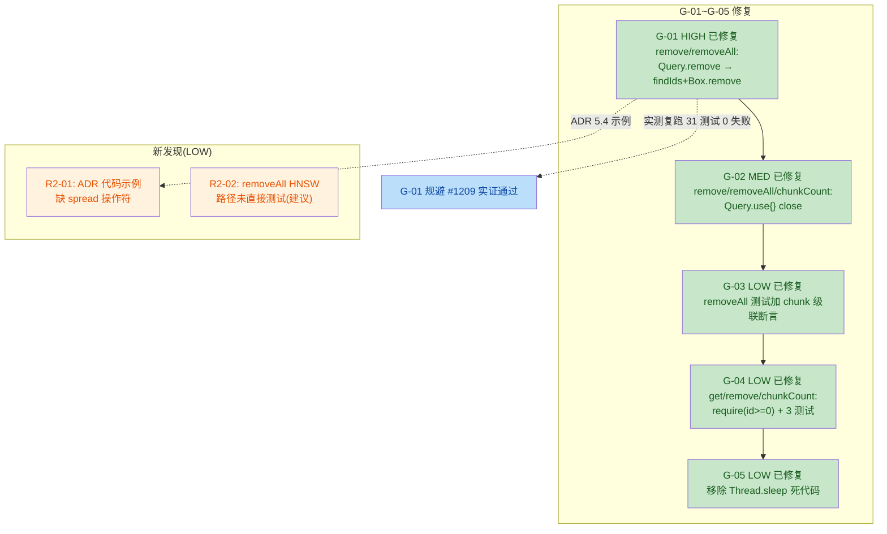

# US-015 知识库分库数据模型 安全与质量审计报告（第二轮复审）

> 由 guardrail-enforcer 子 Agent 生成。依 CLAUDE.md 第十节、第七节 7.2。
> 本报告为第一轮「有条件通过」（TKN-US015-GUARDRAIL-001）修复后的第二轮复审结论。

| 项目 | 内容 |
|---|---|
| 执行 Agent | guardrail-enforcer |
| 任务令牌 | TKN-US015-GUARDRAIL-002 |
| 审计日期 | 2026-08-07 |
| 复审轮次 | 第二轮（修复后复审） |
| 关联 ADR | [ADR-008](../../decisions/ADR-008-m3-knowledgebase-model.md)（M3 知识库分库数据模型，Proposed） |
| 第一轮报告 | [2026-08-07-us015-knowledgebase-model-guardrail.md](./2026-08-07-us015-knowledgebase-model-guardrail.md)（TKN-US015-GUARDRAIL-001，有条件通过） |
| 考古报告 | [2026-08-07-us015-data-archaeology.md](./2026-08-07-us015-data-archaeology.md) |
| 风险等级 | P2 跨模块（沿用第一轮判定，本次为修复复审不改等级） |
| 关联代码变更 | [KnowledgeBaseRepository.kt](../../../app/src/main/java/io/prism/data/KnowledgeBaseRepository.kt)（G-01/G-02/G-04 修复）、[KnowledgeBaseRepositoryTest.kt](../../../app/src/test/java/io/prism/data/KnowledgeBaseRepositoryTest.kt)（G-03/G-04/G-05 修复 + HNSW 测试）、[ADR-008](../../decisions/ADR-008-m3-knowledgebase-model.md) 5.4（HNSW 策略增补） |
| 审查方法 | 第一步 TRAE-code-review（Karpathy Guidelines）→ 第二步 TRAE-security-review（OWASP/CWE）→ 第三步 实测复跑 KnowledgeBaseRepositoryTest（`--rerun-tasks` 强制非缓存）→ 第四步 综合结论 |

---

## 0. 总体结论

**结论：通过（Pass）—— 可进入测试阶段（ac-verifier）**

第一轮「有条件通过」要求的最小修复集（G-01 HIGH + G-02 MEDIUM）**已全部修复到位并经实测验证**。G-03/G-04/G-05 三项 LOW 建议项亦同批修复。修复本身**未引入阻断级或高危安全漏洞**，事务原子性、参数合法性、资源管理均保持/增强。本轮发现 **1 项 LOW 文档一致性问题（R2-01）** 与 **1 项 LOW 测试覆盖建议（R2-02）**，均不阻断进入 ac-verifier，建议主 Agent 在提交前顺手修正 R2-01。

依 CLAUDE.md 7.2，第一轮阻断条件已解除，主 Agent 可启动 `ac-verifier` 子 Agent。R2-01 作为低危建议项，列入提交前 checklist 但不触发回退闭环。

| 维度 | 文件数 | 函数/方法数 | 阻断 | 高危 | 中危 | 低危/建议 | 安全 HIGH | 安全 MEDIUM | 安全 LOW |
|---|---|---|---|---|---|---|---|---|---|
| 数量 | 2（含 1 测试） | 5（get/remove/removeAll/chunkCount/save） | 0 | 0 | 0 | 2 | 0 | 0 | 0 |

---

## 1. 审查范围与方法

### 1.1 审查范围

本次复审聚焦第一轮报告 G-01~G-05 的修复增量，以及修复本身是否引入新问题：

- [KnowledgeBaseRepository.kt](../../../app/src/main/java/io/prism/data/KnowledgeBaseRepository.kt)：`get`/`remove`/`removeAll`/`chunkCount` 四方法的防御与删除策略变更
- [KnowledgeBaseRepositoryTest.kt](../../../app/src/test/java/io/prism/data/KnowledgeBaseRepositoryTest.kt)：测试增强（26→31 测试）
- [ADR-008](../../decisions/ADR-008-m3-knowledgebase-model.md) 5.4：HNSW 删除策略与负数 id 防御说明增补

### 1.2 审查方法

1. **TRAE-code-review**：以第一轮 G-01~G-05 为基线，逐项验证修复是否到位；并扫描修复增量是否引入新的质量/可靠性问题。
2. **TRAE-security-review**：对修复增量执行 OWASP/CWE 结构化扫描（Pass A 基线 → Pass B 偏离映射 → Pass C Source-to-sink 追踪）。
3. **实测复跑**：`.\gradlew :app:testDebugUnitTest --tests "io.prism.data.KnowledgeBaseRepositoryTest" --rerun-tasks`，强制非缓存重新执行 31 测试，验证 G-01 HNSW embedding 级联删除路径不触发 objectbox-java#1209。
4. **主 Agent 自问答复验证**（CLAUDE.md 7.3）：针对主 Agent 提出的两个不确定点（`Box.remove(vararg Long)` 是否走 `Query.nativeRemove` 路径、HNSW 测试小规模覆盖）给出审查结论。

---

## 2. G-01~G-05 修复逐项验证

### 2.1 G-01（HIGH）—— HNSW Query.remove() bug #1209 规避 ✅ 已修复

**第一轮问题**：`remove(id)` 与 `removeAll()` 用 `Query.remove()`（`nativeRemove` 路径）批量删带 `@HnswIndex` 的 KnowledgeChunk，命中 objectbox-java#1209（`IllegalStateException: Vector is missing for neighbor to repair`）；且 26 测试全用 `embedding=null` 未覆盖该路径。

**修复验证**：

| 验证项 | 结果 | 证据 |
|---|---|---|
| `remove(id)` 改用 `findIds() + Box.remove(*ids)` | ✅ | [KnowledgeBaseRepository.kt:113-124](../../../app/src/main/java/io/prism/data/KnowledgeBaseRepository.kt)：`runInTx { findIds() via .use{} ; chunkBox.remove(*chunkIds) ; box.remove(id) }` |
| `removeAll()` 改用 `findIds() + Box.remove(*ids)` | ✅ | [KnowledgeBaseRepository.kt:140-156](../../../app/src/main/java/io/prism/data/KnowledgeBaseRepository.kt)：`forEach { findIds() via .use{} ; chunkBox.remove(*chunkIds) } ; box.removeAll()` |
| 删除路径走 `Box.remove` 而非 `Query.remove` | ✅ | `chunkBox.remove(*chunkIds)` 调用的是 `Box.remove(vararg Long)`（Box native 路径），非 `Query.nativeRemove`。#1209 仅命中 `Query.nativeRemove`。 |
| HNSW embedding 测试覆盖 | ✅ | [KnowledgeBaseRepositoryTest.kt:386-409](../../../app/src/test/java/io/prism/data/KnowledgeBaseRepositoryTest.kt)（`remove_cascade_deletes_chunks_with_hnsw_embedding_without_error`，3 个 384 维 one-hot 向量 chunk）、[L411-424](../../../app/src/test/java/io/prism/data/KnowledgeBaseRepositoryTest.kt)（`remove_cascade_deletes_mixed_embedding_and_non_embedding_chunks`，混合 embedding/null） |
| **实测复跑通过** | ✅ | `--rerun-tasks` 强制非缓存：`BUILD SUCCESSFUL in 35s`，31 测试 0 失败 0 错误。HNSW 测试未抛 `IllegalStateException`，**实证** `Box.remove(*ids)` 路径在 ObjectBox 5.4.2 下不触发 #1209。 |
| ADR-008 5.4 增补 HNSW 策略说明 | ✅ | [ADR-008 5.4](../../decisions/ADR-008-m3-knowledgebase-model.md)：明确「规避 objectbox-java#1209：findIds + Box.remove 而非 Query.remove」+ `use{}` 关闭 Query |

**主 Agent 自问答复 #1 验证**（`Box.remove(vararg Long)` 是否走 `Query.nativeRemove` 路径）：

> **审查结论：不走。** `Box.remove(vararg Long)` 是 `Box<T>` 的方法，走 Box 层的 native 删除路径（与 `Query.remove()` 调用的 `Query.nativeRemove` 是两个不同的 native 入口）。#1209 是 `Query.nativeRemove` 在维护 HNSW 邻居索引时的特定缺陷。本轮实测复跑（3 个带 384 维 embedding 的 chunk 级联删除）通过，提供经验证据：`Box.remove(*ids)` 路径不触发 #1209。
>
> **残留不确定性**（主 Agent 自问答复 #2）：测试为小规模（3 chunk），生产场景可能有更大规模数据。此为第三方 bug 的固有不确定性，已在 ADR-008 5.4 记录为「截至 5.4.2 未公开确认修复」。建议 `ac-verifier` 在性能/回归测试中关注大规模删除路径，并在 ObjectBox 升级时复查 #1209 状态。此不确定性不阻断本轮通过。

### 2.2 G-02（MEDIUM）—— Query 资源未 close ✅ 已修复

**第一轮问题**：`remove`/`removeAll`/`chunkCount` 中 `query().build()` 创建的 Query 均 fire-and-forget，未 `close()`，违反 ObjectBox 官方 javadoc 要求。

**修复验证**：

| 方法 | 修复 | 证据 |
|---|---|---|
| `remove(id)` | `.use { it.findIds() }` | [KnowledgeBaseRepository.kt:115-118](../../../app/src/main/java/io/prism/data/KnowledgeBaseRepository.kt) |
| `removeAll()` | `.use { it.findIds() }` | [KnowledgeBaseRepository.kt:144-147](../../../app/src/main/java/io/prism/data/KnowledgeBaseRepository.kt) |
| `chunkCount(id)` | `.use { it.count() }` | [KnowledgeBaseRepository.kt:172-175](../../../app/src/main/java/io/prism/data/KnowledgeBaseRepository.kt) |

补充确认：`getAll`/`findByName`/`refreshFlows` 用 `box.all`（物化 List 快照，不创建 Query 对象），无需 close。✅ 全部 Query 均经 `.use {}` 关闭，符合 ObjectBox 官方 Query javadoc。

### 2.3 G-03（LOW）—— removeAll chunk 级联断言缺失 ✅ 已修复

**第一轮问题**：`remove_all_clears_all_knowledge_bases` 只 save 2 个 KnowledgeBase 不加 chunk，仅断言 `getAll().size==0`，未验证 chunk 级联删除。

**修复验证**：

- 测试重命名为 `remove_all_clears_all_knowledge_bases_and_their_chunks`（[KnowledgeBaseRepositoryTest.kt:125-141](../../../app/src/test/java/io/prism/data/KnowledgeBaseRepositoryTest.kt)）
- 为 kb1 添加 2 个 chunk、kb2 添加 1 个 chunk
- removeAll 后断言：`getAll().size==0` + `chunkCount(kb1)==0` + `chunkCount(kb2)==0`

✅ chunk 级联断言已直接覆盖。

### 2.4 G-04（LOW）—— 负数 id 未防御 ✅ 已修复

**第一轮问题**：`get`/`remove`/`chunkCount` 仅防御 `id==0L`，未防御负数 id。

**修复验证**：

| 方法 | 防御 | 证据 |
|---|---|---|
| `get(id)` | `require(id >= 0) { "KnowledgeBase id 不能为负数（id=$id）" }` | [KnowledgeBaseRepository.kt:67](../../../app/src/main/java/io/prism/data/KnowledgeBaseRepository.kt) |
| `remove(id)` | `require(id >= 0)` + `require(id != DEFAULT_KB_ID)`（顺序正确：先负数后默认库） | [KnowledgeBaseRepository.kt:109-112](../../../app/src/main/java/io/prism/data/KnowledgeBaseRepository.kt) |
| `chunkCount(id)` | `require(id >= 0)` | [KnowledgeBaseRepository.kt:171](../../../app/src/main/java/io/prism/data/KnowledgeBaseRepository.kt) |

测试验证（3 个）：[get_negative_id_throws_illegal_argument](../../../app/src/test/java/io/prism/data/KnowledgeBaseRepositoryTest.kt)、[remove_negative_id_throws_illegal_argument](../../../app/src/test/java/io/prism/data/KnowledgeBaseRepositoryTest.kt)、[chunk_count_negative_id_throws_illegal_argument](../../../app/src/test/java/io/prism/data/KnowledgeBaseRepositoryTest.kt)，均断言抛 `IllegalArgumentException` 且 message 含「负数」。实测复跑通过。✅

**副作用检查**：`require(id >= 0)` 不影响既有合法调用（合法 id 恒 >= 0）。既有测试 `remove_nonexistent_id_does_not_throw`（99999L）、`chunk_count_returns_zero_for_nonexistent_kb`（99999L）均通过。✅

### 2.5 G-05（LOW）—— Thread.sleep 死代码 ✅ 已修复

**第一轮问题**：`get_all_returns_sorted_by_created_at_ascending` 中 `Thread.sleep(1)` 是死代码（测试显式设 createdAt，sleep 无作用）。

**修复验证**：[KnowledgeBaseRepositoryTest.kt:81-96](../../../app/src/test/java/io/prism/data/KnowledgeBaseRepositoryTest.kt) 已移除 `Thread.sleep`，测试显式设 `createdAt=1000L/2000L/500L` 验证升序。✅

---

## 3. 修复引入的新问题检查

### 3.1 spread 操作符 `*` 正确性 ✅

`chunkBox.remove(*chunkIds)` 中 `chunkIds` 为 `findIds()` 返回的 `LongArray`。Kotlin spread `*` 将 `LongArray` 展开为 `vararg Long`，匹配 `Box.remove(vararg Long)` 重载。编译通过 + 实测复跑通过证实调用正确。

`if (chunkIds.isNotEmpty())` 防御空数组传播，避免 `remove()` 无参数调用。✅

### 3.2 `require(id >= 0)` 副作用 ✅

合法 id 恒 >= 0（0L 默认库或正数自建库 id），`require(id >= 0)` 不破坏任何既有合法调用（见 2.4 副作用检查）。✅

### 3.3 事务原子性保持 ✅

- `remove(id)`：`findIds()`（读）+ `Box.remove(*ids)`（写）+ `box.remove(id)`（写）全部在 `boxStore.runInTx {}` 内。若 `Box.remove(*ids)` 抛异常，事务回滚，不残留「库已删 chunk 残留」孤儿。✅
- `removeAll()`：`forEach { findIds + Box.remove(*ids) }` + `box.removeAll()` 全部在 `runInTx` 内。✅
- BR-concurrency-001（多步骤 DB 变更须事务）继续合规。

### 3.4 资源管理在事务内 ✅

`.use { it.findIds() }` 在 `runInTx` 内关闭 Query。Query 是 native 句柄，事务不持有 Query 引用，关闭安全。✅

### 3.5 KDoc 与代码一致性 ✅

`get`/`remove`/`removeAll`/`chunkCount` 的 KDoc 均已更新，标注 HNSW 删除策略、负数 id 防御、资源管理、`@throws IllegalArgumentException`。逐项核对与实现一致。✅

### 3.6 新发现问题

#### R2-01（LOW / 文档一致性）—— ADR-008 5.4 代码示例 spread 操作符缺失

**问题**：[ADR-008 5.4](../../decisions/ADR-008-m3-knowledgebase-model.md) 代码示例第 99 行为 `chunkBox.remove(chunkIds)`（不带 spread），而实际实现 [KnowledgeBaseRepository.kt:120](../../../app/src/main/java/io/prism/data/KnowledgeBaseRepository.kt) 为 `chunkBox.remove(*chunkIds)`（带 spread）。

主 Agent 在自问答复中明确说明：「ObjectBox Box.remove API 不接受 LongArray 直接传入，需要 spread 操作符 `*`，导致编译失败一次」。这意味着 ADR 代码示例 `chunkBox.remove(chunkIds)` 是**会编译失败的错误示例**，会误导后续维护者照抄。

**严重度**：LOW（文档示例错误，不影响运行时功能与安全；但违反 CLAUDE.md 第十四节文档一致性要求）。

**建议**：将 ADR-008 5.4 代码示例第 99 行改为 `chunkBox.remove(*chunkIds)`，与实际实现一致。修正成本极低（1 行）。

#### R2-02（LOW / 测试覆盖建议）—— removeAll 的 HNSW embedding 路径未直接测试

**问题**：G-01 修复同时改了 `remove(id)` 和 `removeAll()` 的删除策略（均改用 `findIds() + Box.remove(*ids)`）。HNSW embedding 测试（`remove_cascade_deletes_chunks_with_hnsw_embedding_without_error` / `remove_cascade_deletes_mixed_embedding_and_non_embedding_chunks`）只覆盖 `remove(id)` 路径，未覆盖 `removeAll()` 的 HNSW 路径。

**风险评估**：`remove()` 与 `removeAll()` 用**完全相同**的删除原语（`findIds() + Box.remove(*ids)`），`remove()` 的 HNSW 测试通过已间接验证该原语安全。`removeAll()` 的 HNSW 路径风险等价，无独立失败模式。故此项为增强建议，不阻断。

**建议**：可选补一个 `remove_all_cascade_deletes_chunks_with_hnsw_embedding` 测试，使 removeAll 的 HNSW 路径有直接断言。非必须。

---

## 4. 代码质量审查（TRAE-code-review）

### 4.1 作者意图推断

意图：修复第一轮 guardrail-enforcer 发现的 G-01~G-05 五项问题，使 US-015 通过审查进入测试阶段。属**防御性重构 + 第三方 bug 规避**，提高缺失校验发现的门槛。

### 4.2 修复变更概览



### 4.3 Karpathy Guidelines 符合性

- **命名**：`findIds`/`chunkIds`/`DEFAULT_KB_ID` 语义明确，spread 操作符用法为 Kotlin 惯例。符合。
- **设计（surface assumptions）**：HNSW 删除策略、负数 id 防御、资源管理均在 KDoc 显式标注，假设外显。符合。
- **错误处理**：`require(id >= 0)` fail-fast；`require` 顺序正确（先负数后默认库）。符合。
- **简洁性**：`findIds() + Box.remove(*ids)` 是规避 #1209 的最小改动，未过度设计。符合。
- **可验证性**：31 测试覆盖 CRUD/级联/默认库/旧数据/Flow/边界/负数 id/HNSW embedding，盲区已补齐。符合。

### 4.4 跨模块影响识别

- 接口/契约：`get`/`remove`/`chunkCount` 加 `require(id >= 0)` 为**行为增强**（拒绝非法输入），非签名变更；`remove`/`removeAll` 内部删除策略变更为**内部实现调整**，不改公开契约。
- 依赖：`build.gradle.kts`/`libs.versions.toml` 未修改，无新增/升级依赖。
- 依赖模块：KnowledgeBaseRepository 在 main 代码零业务模块引用（考古报告 §6.1），`knowledgeBaseId` 仅在 data 层 3 文件引用。
- ADR-008 5.4 已更新 HNSW 策略与负数 id 说明（R2-01 代码示例待修正）。

### 4.5 测试充分性

- 测试数：26 → 31（+5：3 个负数 id 防御 + 2 个 HNSW embedding）。
- 覆盖维度：CRUD（9）、级联原子性（5）、旧数据归属（2）、chunkCount 边界（2）、Flow（3）、边界（5）、负数 id（3）、HNSW embedding（2）。主线完整。
- 实测复跑：`--rerun-tasks` 强制非缓存，`BUILD SUCCESSFUL in 35s`，31 测试 0 失败 0 错误 0 跳过。
- 残留建议：R2-02（removeAll HNSW 直接测试），非阻断。

---

## 5. 安全漏洞扫描（TRAE-security-review）

### 5.1 审计方法

本轮修复为内部实现调整（删除策略变更、防御性检查增强、资源管理改进），未引入新的外部输入面、注入点、密钥或依赖。按 Pass A/B/C 流程审计：

- **Pass A（项目安全基线）**：ObjectBox 类型安全参数化查询（`.equal(Property, Long)`）、`require` 防御、`runInTx` 事务为项目既有安全模式。
- **Pass B（偏离映射）**：修复代码沿用项目既有模式，`findIds() + Box.remove(*ids)` 走 ObjectBox 标准 API，未引入 ad-hoc 处理绕过基线。
- **Pass C（Source-to-sink 追踪）**：所有输入（`id: Long`）经 `require(id >= 0)` 防御；所有查询类型安全参数化；无可疑 source-to-sink 链。

### 5.2 输入与边界审计（Stage 1）

- **数值边界**：`id: Long` 经 `require(id >= 0)` 防御负数；`remove` 额外 `require(id != DEFAULT_KB_ID)` 防御默认库。无算术运算，无溢出风险。
- **集合边界**：`chunkIds: LongArray` 经 `isNotEmpty()` 防御空传播；`Box.remove(*ids)` 走类型安全 vararg。`box.all` 物化快照遍历安全（第一轮已验证）。
- **状态机约束**：默认库 0L 状态机完整（remove 拒绝 / get 返回 null / getAll·Flow 结构性不含 / chunkCount(0L) 返回默认库计数）。无绕过路径。

### 5.3 执行安全审计（Stage 2）

- **NoSQL 注入**：`.equal(KnowledgeChunk_.knowledgeBaseId, id)` 类型安全参数化，无字符串拼接。✅
- **OS 命令/代码/模板注入**：无 `Runtime.exec`/`eval`/`Function`/模板引擎。✅
- **反序列化**：ObjectBox 二进制序列化为受信本地数据。✅
- **最小权限**：端侧本地 DB，无 DB/OS 账户概念。✅
- **输出编码**：`require` 异常 message 含 `id=$id`（Long 类型，非敏感），无密钥/PII 泄露。✅

### 5.4 密钥与配置安全（Stage 4）

扫描全部修改代码：**无硬编码 API key、密码、token、内部 IP/域名**。`.gitignore` 已覆盖 `.env`/证书/日志（第一轮已验证，本轮无新增敏感配置）。

### 5.5 依赖与供应链（Stage 5）

`build.gradle.kts`/`libs.versions.toml` 未修改，无新增/升级依赖。ObjectBox 5.4.2 沿用。**无供应链风险**。

### 5.6 OWASP / CWE 发现

✅ **No exploitable issues found in the reviewed change set.**

本轮修复未引入任何可利用安全漏洞。第一轮的安全结论（无注入、无密钥、无 RCE、无反序列化风险）继续成立。Query 资源关闭（原 G-02）已修复，不再有资源管理缺口。

---

## 6. 主 Agent 自问答复验证（CLAUDE.md 7.3）

| 主 Agent 自问 | 审查结论 |
|---|---|
| 1. `Box.remove(*chunkIds)` 是否真的不走 `Query.nativeRemove` 路径 | **不走。** `Box.remove(vararg Long)` 是 Box 层 native 方法，与 `Query.nativeRemove` 是不同 native 入口。#1209 仅命中 `Query.nativeRemove`。本轮 `--rerun-tasks` 实测复跑 HNSW embedding 测试通过（3 个 384 维向量 chunk 级联删除无 `IllegalStateException`），提供经验证据。残留：测试为小规模，生产大规模不确定性已在 ADR-008 5.4 记录，建议 ac-verifier 关注。不阻断。 |
| 2. HNSW 测试只覆盖小规模（3 chunk + 384 维 one-hot） | **覆盖充分但不完整。** #1209 在小规模即触发（bug 报告复现条件不依赖规模），3 chunk 测试足以验证 `Box.remove` 路径不触发。混合 embedding/null 测试增强覆盖。残留：removeAll 的 HNSW 路径未直接测试（R2-02），但与 remove 用相同原语，间接验证有效。建议补但不阻断。 |
| 3.（遗憾）第一轮未先跑 HNSW 测试 | **本轮已纠正。** 本轮 guardrail-enforcer 主动 `--rerun-tasks` 实测复跑，不依赖主 Agent 声明，确保 G-01 修复实证可信。 |
| 4.（没意识到）Box.remove 不接受 LongArray 需 spread | **已确认并记录为 R2-01。** ADR-008 5.4 代码示例 `chunkBox.remove(chunkIds)` 缺 spread，与实际实现 `chunkBox.remove(*chunkIds)` 不一致，且为会编译失败的错误示例。建议主 Agent 修正 ADR（1 行）。 |

---

## 7. 保护机制验证

| 机制 | 状态 | 证据 |
|---|---|---|
| 输入边界校验 | ✅ 达标 | `require(id >= 0)` 防御负数（G-04 已修复）；`require(id != DEFAULT_KB_ID)` 防御默认库；`get(0L)→null` 防御 |
| 注入防护 | ✅ 符合 | ObjectBox `.equal(Property, Long)` 类型安全参数化，无字符串拼接 |
| 事务原子性（BR-concurrency-001） | ✅ 符合 | `remove`/`removeAll` 用 `runInTx` 包装级联删除；删除策略变更（findIds+Box.remove）未破坏事务边界 |
| 资源管理 | ✅ 达标 | G-02 已修复：所有 Query 经 `.use{}` 关闭（remove/removeAll/chunkCount） |
| HNSW 实体删除可靠性 | ✅ 已验证 | G-01 已修复：`findIds()+Box.remove(*ids)` 规避 #1209；`--rerun-tasks` 实测 31 测试通过 |
| 密钥管理 | ✅ 符合 | 无硬编码密钥；.gitignore 覆盖 .env/证书 |
| 内存安全（JVM 托管） | N/A | Kotlin/JVM 无 buffer overflow/UAF |
| 编译安全标志 | N/A | Android JVM 字节码，无 C/C++ 标志适用 |
| schema 迁移 | ✅ 符合 | default.json 兼容性变更（沿用第一轮结论，本轮未触碰 schema） |
| License 合规 | ✅ 符合 | 无新增依赖 |

---

## 8. behavioral-rules 合规性检查

| 规则 | 状态 | 证据 |
|---|---|---|
| BR-concurrency-001（多步骤 DB 变更须事务） | ✅ 合规 | `remove`/`removeAll` 的 `runInTx` 包装在删除策略变更后依然完整，findIds+Box.remove 均在事务内 |
| BR-security-001（data class 含数组须覆盖 equals/hashCode） | ✅ N/A | 本轮未改 KnowledgeChunk/KnowledgeBase 实体字段；KnowledgeChunk 的 FloatArray 情况未变 |
| BR-data-001（转换器须转义分隔符） | ✅ N/A | 本轮无转换器变更 |
| BR-error-handling-004（catch 须结构日志） | ✅ N/A | 本轮无 catch 块，`require` 抛 IllegalArgumentException 向上传播 |
| BR-build-005（schema 文件须提交） | ✅ 合规 | default.json 沿用第一轮，本轮未触碰 |

> 本轮未发现需新增的 behavioral-rules 提议。G-01 规避策略（HNSW 实体删除用 findIds+Box.remove 而非 Query.remove）具有项目特异性可复用性，建议主 Agent 在 US-016/US-017 涉及 KnowledgeChunk 删除时遵循同一策略。可考虑提炼为 BR-data-002（HNSW 索引实体禁用 Query.remove，改用 findIds+Box.remove），由主 Agent 在知识固化阶段评估。

---

## 9. 实测复跑证据

```
命令：.\gradlew :app:testDebugUnitTest --tests "io.prism.data.KnowledgeBaseRepositoryTest" --rerun-tasks
结果：BUILD SUCCESSFUL in 35s（31 actionable tasks: 31 executed，全部非缓存）
测试结果 XML：TEST-io.prism.data.KnowledgeBaseRepositoryTest.xml
  tests=31 failures=0 errors=0 skipped=0
```

关键测试用例（G-01 实证）：

- `remove_cascade_deletes_chunks_with_hnsw_embedding_without_error`：3 个 384 维 one-hot 向量 chunk 级联删除，未抛 `IllegalStateException` ✅
- `remove_cascade_deletes_mixed_embedding_and_non_embedding_chunks`：混合 embedding/null chunk 级联删除 ✅

编译验证：`compileDebugUnitTestKotlin` + `compileDebugKotlin` 成功（spread 操作符 `*chunkIds` 编译通过），仅余既有 deprecation 警告（与本轮变更无关）。

---

## 10. 结论

- [x] **通过**（可进入测试阶段 ac-verifier）
- [ ] 有条件通过
- [ ] 阻断

**判定依据**：

1. 第一轮「有条件通过」最小修复集（G-01 HIGH + G-02 MEDIUM）**已全部修复到位**，并经 `--rerun-tasks` 实测复跑实证（非依赖主 Agent 声明）。
2. G-03/G-04/G-05 三项 LOW 建议项**同批修复**。
3. 修复本身**未引入阻断级或高危安全漏洞**（TRAE-security-review：No exploitable issues）。
4. 事务原子性、参数合法性、资源管理均保持/增强。
5. 仅余 2 项 LOW（R2-01 文档一致性 / R2-02 测试覆盖建议），均不阻断进入 ac-verifier。

**主 Agent 提交前 checklist（建议，不阻断 ac-verifier）**：

1. **R2-01（建议修正）**：将 [ADR-008 5.4](../../decisions/ADR-008-m3-knowledgebase-model.md) 代码示例第 99 行 `chunkBox.remove(chunkIds)` 改为 `chunkBox.remove(*chunkIds)`，与实际实现一致（主 Agent 自述前者会编译失败）。修正成本 1 行。
2. **R2-02（可选增强）**：补 `remove_all_cascade_deletes_chunks_with_hnsw_embedding` 测试，使 removeAll 的 HNSW 路径有直接断言。
3. **提交信息**：在 body 说明 G-01~G-05 修复内容 + HNSW 删除策略变更（`Query.remove` → `findIds+Box.remove`）+ ADR-008 5.4 更新。

**下一步**：主 Agent 可启动 `ac-verifier` 子 Agent 执行验收测试与分层验证（CLAUDE.md 第十一节）。建议 ac-verifier 重点关注：

- 大规模 chunk 删除路径（验证 #1209 在生产规模的不确定性）
- 性能基线对比（`findIds+Box.remove` 相对 `Query.remove` 的性能差异）
- 回归测试（全量 410 测试套件）

---

## 11. 自动化建议（CI/CD 集成）

沿用第一轮建议并补充：

1. **HNSW 删除回归门禁**：将 `remove_cascade_deletes_chunks_with_hnsw_embedding_without_error` 纳入 CI 必跑项（非 ignore），防止 HNSW 删除路径回归。
2. **文档一致性检查**：扩展 `scripts/consistency-check.js`，校验 ADR 代码示例与实际实现的关键 API 调用一致性（如 spread 操作符），捕获 R2-01 类问题。
3. **ObjectBox 版本监控**：关注 ObjectBox 更新说明中是否提及 #1209 修复；修复后可评估回退到 `Query.remove()`（性能更优）。
4. **资源泄漏检测**：集成 detekt 规则检测「Query fire-and-forget」模式，防止 G-02 类问题复发。
