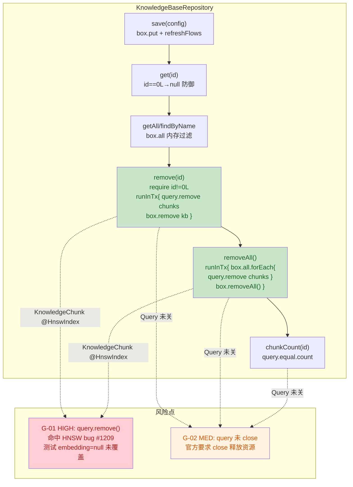

# US-015 知识库分库数据模型 安全与质量审计报告

> 由 guardrail-enforcer 子 Agent 生成。依 CLAUDE.md 第十节。
> 本报告为本次代码变更进入测试阶段前的强制审查结论。

| 项目 | 内容 |
|---|---|
| 执行 Agent | guardrail-enforcer |
| 任务令牌 | TKN-US015-GUARDRAIL-001 |
| 审计日期 | 2026-08-07 |
| 关联 ADR | [ADR-008](../../decisions/ADR-008-m3-knowledgebase-model.md)（M3 知识库分库数据模型） |
| 风险等级 | P2 跨模块（新增 KnowledgeBase 实体 + 既有 KnowledgeChunk 加 knowledgeBaseId 字段，schema 兼容性变更） |
| 关联代码变更 | `app/src/main/java/io/prism/data/KnowledgeBase.kt`（新增）、`app/src/main/java/io/prism/data/KnowledgeBaseRepository.kt`（新增）、`app/src/main/java/io/prism/data/KnowledgeChunk.kt`（加字段）、`app/src/test/java/io/prism/data/KnowledgeBaseRepositoryTest.kt`（新增 26 测试）、`app/objectbox-models/default.json`（自动生成）、`README.md` / `docs/decisions/README.md`（索引） |
| 审查输入完备性 | SECURITY.md 缺失，以 CLAUDE.md（第十/十八/十九/二十节）为安全策略基线；技术栈（Kotlin 2.3.21 + ObjectBox 5.4.2 端侧 Android DB）、ADR-008、考古报告、behavioral-rules.md（BR-concurrency-001 / BR-security-001 / BR-data-001）齐全 |
| 审查方法 | 第一步 TRAE-code-review（Karpathy Guidelines）→ 第二步 TRAE-security-review（OWASP/CWE）→ 第三步综合结论；web-access 核实 ObjectBox Query 关闭最佳实践与已知 bug |

## 0. 总体结论

**结论：有条件通过（Conditional Pass）**

无阻断级安全漏洞、无高危安全漏洞（无注入、无硬编码密钥、无 RCE、无反序列化风险）。BR-concurrency-001（事务原子性）完全合规，级联删除的 `runInTx` 包装保证全成功或全回滚。但存在 **1 项 HIGH-risk 代码质量/可靠性发现**（G-01：`Query.remove()` 级联删除带 HNSW 向量索引的 KnowledgeChunk，命中 ObjectBox 已知 bug #1209，且 26 个测试全用 `embedding=null` 的 chunk 未覆盖该路径——属「测试通过但未验证生产场景」的侥幸风险）与 **1 项 MEDIUM**（G-02：Query 未 close 违反官方资源管理建议）。

依 CLAUDE.md 7.2，主 Agent 必须修复 G-01 + G-02 后重新提交审查（重新走完整闭环：第九节影响自检 → guardrail-enforcer → ac-verifier）。G-03/G-04/G-05 为 LOW 建议项，建议同批修复但不阻断重审。

| 维度 | 文件数 | 函数/方法数 | 阻断 | 高危 | 中危 | 低危/建议 | 安全 HIGH | 安全 MEDIUM | 安全 LOW |
|---|---|---|---|---|---|---|---|---|---|
| 数量 | 4（含 1 测试） | 9 | 0 | 1 | 1 | 3 | 0 | 0 | 0 |

---

## 1. 代码质量审查（TRAE-code-review）

### 1.1 作者意图推断

意图：为 M3 RAG 落地知识库分库数据模型。新增扁平 `KnowledgeBase(id/name/createdAt)` 实体 + Repository（CRUD + `runInTx` 级联删除 + 默认库 0L 语义），并为既有 `KnowledgeChunk` 加 `knowledgeBaseId: Long = 0L` 扁平外键（规避 `@Relation` 副作用）。统计字段运行时聚合，不持久化。属新功能模块，仅对既有实体加带默认值的末位字段（向后兼容）。

### 1.2 变更概览（Mermaid）



### 1.3 问题清单

| 编号 | 等级 | 问题 | 证据（文件:行） | 修复建议 |
|---|---|---|---|---|
| G-01 | 高危 | **`Query.remove()` 级联删除带 HNSW 向量索引的 KnowledgeChunk 命中 ObjectBox 已知 bug #1209，且测试未覆盖 embedding 路径**。`remove(id)` 与 `removeAll()` 用 `chunkBox.query().equal(KnowledgeChunk_.knowledgeBaseId, id).build().remove()` 批量删 KnowledgeChunk，而 KnowledgeChunk 有 `@HnswIndex(384, COSINE)`。ObjectBox 已知 bug [objectbox-java#1209](https://github.com/objectbox/objectbox-java/issues/1209)：`Query.remove()`（`nativeRemove`）删除带 HNSW 索引的实体抛 `IllegalStateException: Vector is missing for neighbor to repair`，维护者确认为 bug（截至 2025-08 仍在调查，报告于 4.2.0；项目用 5.4.2，是否修复未确认）。当前 26 个测试全部用 `embedding=null` 的 chunk（如 `KnowledgeChunk(title="c1", content="内容1", knowledgeBaseId=kbId)`），HNSW 索引为空，未触发该路径——**测试通过但未验证 US-016 入库后 chunk 有 embedding 的生产场景**。`runInTx` 保证数据完整性（异常回滚不残留孤儿），但删库操作会向用户抛异常失败。全仓搜索既有 KnowledgeChunk 测试只用 `box.remove(id)`（单条，不同代码路径），从未用 `query().remove()`，故无先例覆盖。 | [KnowledgeBaseRepository.kt:105-108](../../../app/src/main/java/io/prism/data/KnowledgeBaseRepository.kt)（remove）、[KnowledgeBaseRepository.kt:128-131](../../../app/src/main/java/io/prism/data/KnowledgeBaseRepository.kt)（removeAll）、[KnowledgeChunk.kt:33](../../../app/src/main/java/io/prism/data/KnowledgeChunk.kt)（@HnswIndex）、[KnowledgeBaseRepositoryTest.kt:142-144](../../../app/src/test/java/io/prism/data/KnowledgeBaseRepositoryTest.kt)（embedding 默认 null） | (1) **新增验证测试**：构造 384 维真实 embedding 的 chunk 入库后调用 `remove(kbId)`，验证 ObjectBox 5.4.2 是否触发 #1209（建议覆盖单条、少量、批量三种规模）。(2) **若触发**：改用规避 `Query.remove()` 的删除模式——`query.findIds()` + `box.remove(ids)` 或 `query.find().forEach { box.remove(it) }`（`Box.remove` 走不同 native 路径，#1209 仅命中 `Query.nativeRemove`）。(3) **ADR-008 5.4 增补** HNSW 删除风险说明与所选删除策略的理由。 |
| G-02 | 中危 | **Query 对象未 `close()`，违反 ObjectBox 官方资源管理建议**。`remove`/`removeAll`/`chunkCount` 中 `query().build()` 创建的 Query 均「fire-and-forget」。ObjectBox 官方 Query javadoc 明确：「Make sure to `close()` this query once done with it to reclaim resources immediately」「`finalize()`: Explicitly call `close()` instead to avoid expensive finalization」。Query 持有 native 编译查询句柄，不 close 则依赖 GC 终结化回收（昂贵且时机不确定）。`chunkCount(id)` 预期为 UI 频繁调用（库列表页每库计数），累积未关闭 Query 增加低端机（ADR-007 目标 4GB 设备）终结化压力。`remove`/`removeAll` 罕见，影响小。 | [KnowledgeBaseRepository.kt:105-108](../../../app/src/main/java/io/prism/data/KnowledgeBaseRepository.kt)、[KnowledgeBaseRepository.kt:128-131](../../../app/src/main/java/io/prism/data/KnowledgeBaseRepository.kt)、[KnowledgeBaseRepository.kt:149-152](../../../app/src/main/java/io/prism/data/KnowledgeBaseRepository.kt)；[ObjectBox Query javadoc](https://objectbox.io/docfiles/java/current/io/objectbox/query/Query.html) | 单次查询用 Kotlin `use { }`：`chunkBox.query().equal(...).build().use { it.count() }` / `.use { it.remove() }`；或为 `chunkCount` 构建可复用 Query 字段（`private val countQuery by lazy { chunkBox.query().equal(KnowledgeChunk_.knowledgeBaseId, 0L).build() }`）配合 `setParameter` 重设条件后复用，避免每次新建。 |
| G-03 | 低 | **`removeAll` 的 chunk 级联删除未被直接断言**。`remove_all_clears_all_knowledge_bases` 只 `save` 2 个 KnowledgeBase 但**不添加任何 chunk**，仅断言 `getAll().size==0`，未验证自建库 chunk 被 removeAll 级联删除。`remove_all_does_not_affect_default_kb_chunks` 验证默认库 chunk 存活，但未验证自建库 chunk 被删。removeAll 的 chunk 级联路径仅间接覆盖。 | [KnowledgeBaseRepositoryTest.kt:126-133](../../../app/src/test/java/io/prism/data/KnowledgeBaseRepositoryTest.kt) | 在该测试中为 2 个 KB 各 `chunkBox.put` 若干 chunk，`removeAll()` 后断言各 KB `chunkCount==0`。 |
| G-04 | 低 | **`get`/`remove` 仅防御 `id==0L`，未防御负数 id**。`get(-1)` 调 `box.get(-1)`（ObjectBox 对非法 id 抛 IllegalArgumentException）；`remove(-1)` 走 `require` 通过→query 删 0 条→`box.remove(-1)` no-op。与既有 ProviderConfig/McpServer Repository 一致（均不防御负数），业务层不应传入负数，但 ADR-008 未明确 id 契约。 | [KnowledgeBaseRepository.kt:65-68](../../../app/src/main/java/io/prism/data/KnowledgeBaseRepository.kt)、[KnowledgeBaseRepository.kt:99-102](../../../app/src/main/java/io/prism/data/KnowledgeBaseRepository.kt) | 加 `require(id >= 0) { "id 不能为负数: $id" }` 纵深防御；或在 KDoc 明确 `@param id 必须 >= 0` 契约。 |
| G-05 | 低 | **`get_all_returns_sorted_by_created_at_ascending` 中 `Thread.sleep(1)` 是死代码**。测试显式设置 `createdAt=1000L/2000L/500L`，ObjectBox 按实体原值持久化，`save` 不覆盖 createdAt，sleep 无作用且拖慢测试。 | [KnowledgeBaseRepositoryTest.kt:87](../../../app/src/test/java/io/prism/data/KnowledgeBaseRepositoryTest.kt)、[KnowledgeBaseRepositoryTest.kt:89](../../../app/src/test/java/io/prism/data/KnowledgeBaseRepositoryTest.kt) | 移除两处 `Thread.sleep(1)`。 |

### 1.4 Karpathy Guidelines 符合性

- 命名（清晰）：`KnowledgeBase` / `KnowledgeBaseRepository` / `DEFAULT_KB_ID` / `chunkCount` / `knowledgeBaseId` 语义明确，与 `McpServerRepository`/`ProviderConfigRepository` 风格统一。符合。
- 设计（分层、surface assumptions）：扁平实体 + Repository 仿既有先例；KDoc 显式标注默认库语义、级联原子性、BR-concurrency-001 引用、`@Relation` 规避理由。符合。
- 错误处理：`require(id != DEFAULT_KB_ID)` fail-fast；`get(0L)` 返回 null 防御。方向正确，但 G-04 显示负数 id 防御缺失。
- 简洁性：`removeAll` 因 `greaterThan` 编译失败改用 forEach 遍历，方案可接受（见 1.5 已验证安全）。
- 可验证性：26 测试覆盖 CRUD/级联/默认库/旧数据/Flow/边界，但 G-01（embedding 路径）与 G-03（removeAll chunk 级联断言）为覆盖盲区。

### 1.5 跨模块影响识别

- `KnowledgeChunk.kt`：末位加 `var knowledgeBaseId: Long = 0L`（带默认值）。全仓搜索既有测试构造均用命名参数（`KnowledgeChunk(title=..., content=...)`）或前 4 位置参数，新字段默认值保证编译兼容（考古报告 §6.1 H6 已推断，本次 grep 复核确认）。main 代码零业务依赖 KnowledgeChunk（考古 §6.1）。**无回归**。
- `default.json`：新增 KnowledgeBase entity（id `4:...`）+ KnowledgeChunk.knowledgeBaseId property（id `5:...`，type 6=Long）。`retiredPropertyUids`/`retiredEntityUids` 仍为 `[]`，属兼容性变更，ObjectBox 自动迁移。符合 BR-build-005（schema 文件须提交）。
- 依赖：`build.gradle.kts` / `libs.versions.toml` 未修改，无新增/升级依赖。ObjectBox 5.4.2 沿用 ADR-001。
- 索引：`README.md` / `docs/decisions/README.md` 已加 ADR-008 行；本报告创建后须同步加 guardrail 报告索引行（已由本审查同步）。
- 结论：跨模块影响为「KnowledgeChunk 向后兼容加字段 + 新增独立实体」，符合变更影响自检结果。

### 1.6 测试充分性

- 覆盖维度：CRUD（9）、级联原子性（5）、旧数据归属默认库（2）、chunkCount 边界（2）、Flow（3）、边界（5）——主线完整。
- **关键缺失**：G-01（embedding 路径未覆盖，命中已知 bug）、G-03（removeAll chunk 级联未直接断言）。
- 回归：主 Agent 报告 `gradlew :app:testDebugUnitTest` 405 测试（25 perf skipped，380 运行）0 失败；本次审查复跑 `BUILD SUCCESSFUL`（testDebugUnitTest UP-TO-DATE 缓存命中，编译通过）。回归声明可信。

---

## 2. 安全漏洞扫描（TRAE-security-review）

### 2.1 输入与边界审计（Stage 1）

#### 2.1.1 数值与类型边界

- `id: Long` 参数（`get`/`remove`/`chunkCount`）：`remove` 有 `require(id != 0L)` 防御默认库；`get` 有 `if (id==0L) return null` 防御。负数 id 未防御（G-04，质量项非安全漏洞——非法 id 抛 IllegalArgumentException 或 no-op，无数据损坏）。无算术运算，无溢出风险。
- `name: String`：Repository 层不限制长度/内容（`save_empty_name_is_allowed` 显式记录），校验属 UI 层。与 ProviderConfig/McpServer 一致。本地 DB 无远程输入注入面。
- `knowledgeBaseId: Long = 0L`：默认值使旧数据自动归属默认库（考古 R1 缓解），无孤儿风险。

#### 2.1.2 集合与缓冲边界

- `box.all` 返回物化 `List` 快照（非活游标），`forEach` 遍历快照安全；循环内修改 `chunkBox`（不同 Box）不影响迭代；`box.removeAll()` 在 forEach 之后。无 ConcurrentModificationException 风险（见 1.5 已验证）。
- 无 `strcpy`/`sprintf`/裸指针（Kotlin/JVM 托管内存）。

#### 2.1.3 业务状态机约束

- 默认库 0L 状态机：`remove(0L)` 拒绝、`get(0L)` 返回 null、`getAll`/Flow 结构性不含（0L 永不持久化为 KnowledgeBase 记录，`@Id` 自增从 1 开始）、`chunkCount(0L)` 返回默认库 chunk 数。ADR-008 5.3「默认库不持久化」在 Repository 层**完整对应实现**（审查重点 #7 通过）。
- 无绕过状态检查路径（remove 经 require 入口校验，无公开字段直改）。

### 2.2 执行安全审计（Stage 2）

#### 2.2.1 注入防护

- **NoSQL 注入**：ObjectBox `.equal(KnowledgeChunk_.knowledgeBaseId, id)` 为类型安全参数化查询（`Property` + `Long` 值），**无字符串拼接**。`findByName` 用 `box.all.find { it.name == name }`（内存相等比较）。无注入向量。
- **SQL 注入**：ObjectBox 非 SQL DB，无 SQL 拼接。
- **OS 命令注入**：无 `Runtime.exec`/`ProcessBuilder`。
- **代码/表达式注入**：无 `eval`/`ScriptEngine`/反射执行用户字符串。
- **模板引擎注入**：无模板引擎。
- **反序列化**：ObjectBox 二进制序列化为受信本地数据，无远程反序列化面。

#### 2.2.2 最小权限

- 本模块为端侧 Android 本地 DB 层，无 DB 账户/OS 服务账户/容器 securityContext 概念。仅文件 I/O（ObjectBox 目录），无多余权限。

#### 2.2.3 输出编码

- 输出为 `KnowledgeBase` 实体与 `Long` 计数，不涉及 HTML/JS/URL 上下文，无需转义。
- `require` 异常 message 含 `id=$DEFAULT_KB_ID`（即 0L），无敏感信息泄露。

### 2.3 密钥与配置安全（Stage 4）

- 扫描全部新增/修改代码：**无硬编码 API key、密码、token、内部 IP/域名**。
- `.gitignore`：已排除 `.env`/`.env.local`/`.env.*.local`/`logs/`/`tmp/`/`*.keystore`/`*.jks`/`local.properties`/ObjectBox JNI DLL（BR-build-004）。本次无新增敏感配置。
- `default.json` 为 schema 模型文件（非敏感），须提交（BR-build-005）。

### 2.4 依赖与供应链风险（Stage 5）

- `build.gradle.kts` / `libs.versions.toml` / `gradle/libs.versions.toml` **未修改**，无新增/升级依赖。ObjectBox 5.4.2、Kotlin 2.3.21 沿用既有。
- **无供应链风险**（本次变更不触碰依赖描述文件）。
- 备注：ObjectBox 5.4.2 相对 bug #1209 报告版本 4.2.0 为新版本，是否修复该 bug 未公开确认——此为 G-01 的不确定性来源，建议主 Agent 通过测试验证（见 G-01 修复建议）。

---

## 3. OWASP / CWE 发现

| 编号 | 等级 | 类别 | 位置 | 证据（Source → Sink） | 修复建议 |
|---|---|---|---|---|---|
| — | — | — | — | — | 本次变更无可利用安全漏洞。ObjectBox 查询类型安全参数化，无注入；无密钥；无 auth；无反序列化；无命令执行。Query 未 close 属资源耗尽范畴，按 TRAE-security-review §8.1（availability 排除）不作为安全发现，归入代码质量 G-02。 |

> 注：G-01 为代码质量/可靠性 HIGH 风险（命中第三方已知 bug + 测试覆盖盲区），非 OWASP 安全类别。无 HIGH/MEDIUM/LOW 安全漏洞。

---

## 4. 修复建议（具体代码示例）

### 4.1 G-01 HNSW Query.remove() 已知 bug 验证与规避（高危）

**第一步：验证测试（确认 5.4.2 行为）**

```kotlin
@Test
fun remove_cascade_deletes_embedded_chunks() {
    val kbId = repository.save(KnowledgeBase(name = "工作"))
    // 构造 384 维真实 embedding（非 null），模拟 US-016 入库后状态
    val embedding = FloatArray(384) { it.toFloat() / 384f }
    repeat(5) { i ->
        chunkBox.put(KnowledgeChunk(
            title = "c$i", content = "内容$i",
            embedding = embedding, knowledgeBaseId = kbId
        ))
    }
    assertEquals(5, repository.chunkCount(kbId))

    // 验证 Query.remove() 不触发 #1209（IllegalStateException: Vector is missing...）
    repository.remove(kbId)

    assertEquals("删库后其下 embedded chunk 应全删", 0, repository.chunkCount(kbId))
    assertNull(repository.get(kbId))
}
```

**第二步（若触发 #1209）：改用 Box.remove 规避 Query.nativeRemove**

```kotlin
fun remove(id: Long) {
    require(id != DEFAULT_KB_ID) { "禁止删除虚拟默认库（id=$DEFAULT_KB_ID）。" }
    boxStore.runInTx {
        // 规避 Query.remove()（命中 #1209）：先查 id 再用 Box.remove（不同 native 路径）
        val chunkIds = chunkBox.query()
            .equal(KnowledgeChunk_.knowledgeBaseId, id)
            .build()
            .use { it.findIds() }   // G-02 同时修复：close Query
        chunkBox.remove(chunkIds)    // Box.remove(LongArray) 非 Query.nativeRemove
        box.remove(id)
    }
    refreshFlows()
}
```

**第三步**：ADR-008 5.4 增补「HNSW 实体级联删除策略：规避 Query.remove()，理由 objectbox-java#1209」。

### 4.2 G-02 Query 资源关闭（中危）

```kotlin
// 单次查询用 use（remove/removeAll/chunkCount 通用）
fun chunkCount(id: Long): Long =
    chunkBox.query()
        .equal(KnowledgeChunk_.knowledgeBaseId, id)
        .build()
        .use { it.count() }

// 或为高频 chunkCount 用可复用 Query + setParameter（最优）
private val countQuery = chunkBox.query()
    .equal(KnowledgeChunk_.knowledgeBaseId, 0L)
    .build()
fun chunkCount(id: Long): Long = synchronized(countQuery) {
    countQuery.setParameter(KnowledgeChunk_.knowledgeBaseId, id).count()
}
```

### 4.3 G-03 removeAll chunk 级联断言（低）

```kotlin
@Test fun remove_all_clears_all_knowledge_bases_and_their_chunks() {
    val kb1 = repository.save(KnowledgeBase(name = "库1"))
    val kb2 = repository.save(KnowledgeBase(name = "库2"))
    chunkBox.put(KnowledgeChunk(title = "1", content = "1", knowledgeBaseId = kb1))
    chunkBox.put(KnowledgeChunk(title = "2", content = "2", knowledgeBaseId = kb2))
    repository.removeAll()
    assertEquals(0, repository.getAll().size)
    assertEquals("kb1 chunk 应级联删除", 0, repository.chunkCount(kb1))
    assertEquals("kb2 chunk 应级联删除", 0, repository.chunkCount(kb2))
}
```

---

## 5. 保护机制验证

| 机制 | 状态 | 证据 |
|---|---|---|
| 输入边界校验 | 部分 | `require(id != 0L)` / `get(0L)→null` 防御默认库；负数 id 未防御（G-04） |
| 注入防护 | 符合 | ObjectBox `.equal(Property, Long)` 类型安全参数化，无字符串拼接 |
| 事务原子性（BR-concurrency-001） | 符合 | `remove`/`removeAll` 用 `runInTx` 包装级联删除，异常回滚不残留孤儿 |
| 密钥管理 | 符合 | 无硬编码密钥；.gitignore 覆盖 .env/证书 |
| 内存安全（JVM 托管） | N/A | Kotlin/JVM 无 buffer overflow/UAF；Query native 句柄见 G-02 |
| 资源管理 | **不达标** | G-02 Query 未 close，违反官方建议 |
| HNSW 实体删除可靠性 | **未验证** | G-01 命中已知 bug #1209，测试未覆盖 embedding 路径 |
| 编译安全标志 | N/A | Android JVM 字节码，无 C/C++ 标志适用 |
| schema 迁移 | 符合 | default.json 兼容性变更（新增字段+实体），retiredPropertyUids=[] |
| License 合规 | 符合 | 无新增依赖；ObjectBox 5.4.2 沿用 ADR-001 |

---

## 6. 豁免

| 项 | 说明 | 是否阻断 |
|---|---|---|
| G-01 HNSW 删除 bug | ObjectBox 第三方已知 bug，非本项目代码缺陷；但删除策略选择与测试覆盖属本仓责任，须验证/规避，不豁免 | 否（但须修复方可重审） |
| 无 SECURITY.md | 以 CLAUDE.md 第十/十八/十九/二十节为安全策略基线，不影响审查结论 | 否 |
| Query 资源耗尽 | 按 TRAE-security-review §8.1 availability 排除，不作为安全发现；归入代码质量 G-02 | 否 |

---

## 7. behavioral-rules 合规性检查

| 规则 | 状态 | 证据 |
|---|---|---|
| BR-concurrency-001（多步骤 DB 变更须事务） | ✅ 合规 | `remove`/`removeAll` 均用 `runInTx` 包装「删 chunk + 删 KB」为原子操作；`save` 单 put 无需事务 |
| BR-security-001（data class 含数组须覆盖 equals/hashCode） | ✅ N/A | KnowledgeBase 无数组字段；KnowledgeChunk 的 FloatArray 情况未变（既有 KDoc 已标注 BR-security-001，本次仅加 Long 字段） |
| BR-data-001（转换器须转义分隔符） | ✅ N/A | KnowledgeBase 仅 Long/String 原始字段，无自定义转换器 |
| BR-error-handling-004（catch 须结构日志） | ✅ N/A | 新代码无 catch 块，`require` 抛 IllegalArgumentException 向上传播 |
| BR-build-005（schema 文件须提交） | ✅ 合规 | default.json 已更新，须随代码提交 |

> 本次未发现需新增的 behavioral-rules 提议（G-01 属第三方 bug 规避，G-02 属通用资源管理最佳实践，无项目特异性可复用规则）。

---

## 8. 主 Agent 自问答复验证（CLAUDE.md 7.3）

| 主 Agent 自问 | 审查结论 |
|---|---|
| 1. `removeAll` 的 `box.all.forEach` 内嵌套 query+remove 是否有游标重用问题 | **已验证安全**：`box.all` 返回物化 `List` 快照（非活游标），`chunkBox` 是不同 Box 独立游标，`box.removeAll()` 在 forEach 之后执行。无游标重用/ConcurrentModification 风险。与 `ProviderConfigRepository.save` 的 `box.all.forEach{ box.put }` 先例同构。 |
| 2. `chunkCount` 的 query 是否需要 close | **需要**（G-02）：ObjectBox 官方 javadoc 明确要求 `close()` 释放资源，`finalize()` 为昂贵兜底。须用 `use{}` 或可复用 Query。 |
| 3. `remove(0L)` 的 `require` 防御是否充分 | **对 DEFAULT_KB_ID 语义充分**；负数 id 未防御（G-04，次要）。 |
| 4. `get(id)` 的 `if (id==DEFAULT_KB_ID) return null` 防御是否充分 | 同 G-04，对 0L 充分，负数 id 次要缺口。 |
| 5. `runInTx` 内异常路径事务是否正确回滚 | **正确**：ObjectBox `runInTx` 保证块内全部操作原子，任一异常全回滚，不残留「库已删 chunk 残留」状态。BR-concurrency-001 满足。 |
| 6. KnowledgeChunk 加字段对既有 5 测试兼容性 | **已验证无影响**：既有测试全用命名参数或前 4 位置参数，新字段带默认值，编译兼容；405 测试 0 失败。但既有测试未覆盖 knowledgeBaseId 相关新场景（非回归，属新增覆盖范围）。 |
| 7. ADR-008「默认库不持久化」Repository 层完整对应实现 | **完整**：remove 拒绝 / get 返回 null / getAll·Flow 结构性不含 / chunkCount(0L) 返回默认库 chunk 数。 |
| 8. KDoc 与代码一致性 | **一致**：DEFAULT_KB_ID 描述、remove 抛异常、get 返回 null、chunkCount 语义、removeAll 不影响默认库——KDoc 与实现逐项对应。 |

---

## 9. 自动化建议（CI/CD 集成）

1. **静态分析**：集成 `detekt`（Kotlin 代码质量），配置规则检测「未 close 的 Closeable 资源」「Query fire-and-forget」。
2. **依赖扫描**：`./gradlew dependencies --configuration debugRuntimeClasspath` 定期核对；关注 ObjectBox 版本更新说明中是否提及 #1209 修复。
3. **回归门禁**：将 G-01 的 embedding 级联删除测试纳入 CI 必跑项（非 ignore），防止 HNSW 删除路径回归。
4. **资源泄漏检测**：集成 `LeakCanary`（Android instrumentation）或 JVM 侧 `try-with-resources` 静态检查，捕获 Query 未关闭模式。

---

## 10. 结论

- [ ] 通过（可进入测试阶段）
- [x] **有条件通过**（无安全阻断/高危漏洞，但存在 1 项 HIGH 代码质量风险 G-01 + 1 项 MEDIUM G-02，须修复后重审）
- [ ] 阻断（存在严重质量缺陷或高危安全漏洞）

**主 Agent 须完成的最小修复集（方可重新提交审查）**：

1. **G-01（HIGH）**：新增 embedding chunk 的级联删除验证测试；若 ObjectBox 5.4.2 触发 #1209，改用 `findIds()` + `Box.remove(ids)` 规避；ADR-008 5.4 增补 HNSW 删除风险说明。
2. **G-02（MEDIUM）**：`remove`/`removeAll`/`chunkCount` 的 Query 用 `use{}` 关闭，或 `chunkCount` 改可复用 Query + `setParameter`。

**建议同批修复（不阻断重审）**：G-03（removeAll chunk 级联断言）、G-04（负数 id 防御）、G-05（移除死代码 Thread.sleep）。

**回退闭环**（CLAUDE.md 7.2）：修复后必须重新执行第九节变更影响自检 → 重新提交 guardrail-enforcer → 通过后方可启动 ac-verifier。G-01 若涉及删除策略变更（`Query.remove` → `findIds`+`Box.remove`），属 Repository 内部实现调整不改公开接口，但仍须在提交信息 body 说明并更新 ADR-008。
