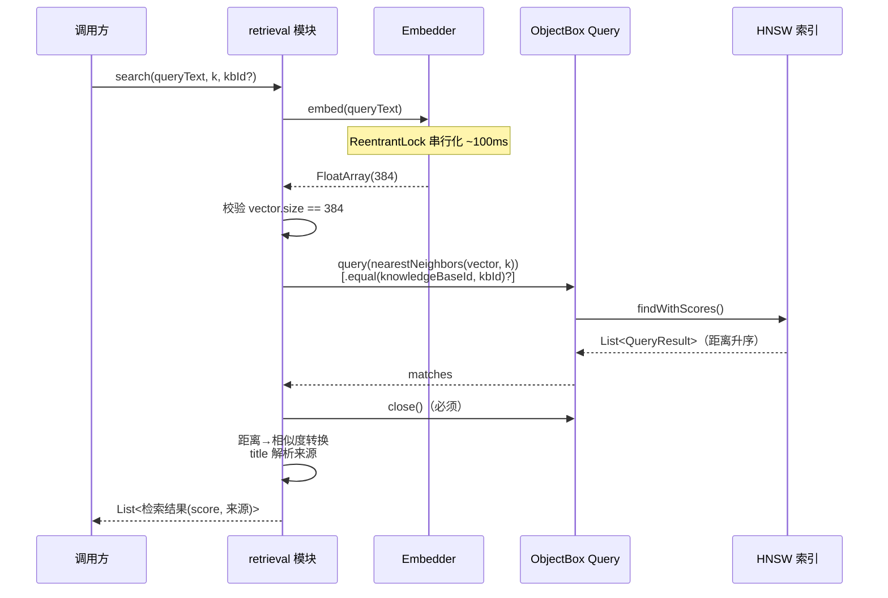

# 源码考古报告：US-017 实现向量检索

> 从 `docs/templates/reports/archaeology-template.md` 复制新建，依 CLAUDE.md 第 3.1 节简化版。
> 由 code-archaeologist 子 Agent 生成，为 US-017「实现向量检索」提供接口契约与风险清单。

| 项目 | 内容 |
|---|---|
| 执行 Agent | code-archaeologist |
| 任务令牌 | TKN-US017-ARCH-001 |
| 考古日期 | 2026-08-07 |
| 考古目标 | US-017 向量检索模块（新建）—— 既有数据层 / 嵌入层 / 摄入管线现状 |
| 考古模式 | 简化版考古（模块职责 / 接口契约 / API 用法 / 风险 / 测试模式） |
| 风险等级 | P2 跨模块（新建 retrieval 模块，依赖既有 Embedder / KnowledgeBaseRepository / KnowledgeChunk） |
| 关联 ADR | [ADR-007](../../docs/decisions/ADR-007-m3-rag-tech-stack.md) 5.1/5.4 / [ADR-008](../../docs/decisions/ADR-008-m3-knowledgebase-model.md) 5.2/5.3 / [ADR-009](../../docs/decisions/ADR-009-m3-ingestion-pipeline.md) |
| 关联规则 | BR-concurrency-002 / BR-concurrency-003 / BR-security-001 / BR-error-handling-005 |
| 技术栈 | Kotlin 2.3.21、ObjectBox 5.4.2（HNSW 向量搜索）、onnxruntime 1.27.0 |

---

## 1. 建立大图景

### 1.1 模块职责（一句话）

| 组件 | 路径 | 职责 |
|---|---|---|
| KnowledgeChunk | `../../app/src/main/java/io/prism/data/KnowledgeChunk.kt` | 知识库分块实体，承载 title/content/embedding(384维)/knowledgeBaseId，embedding 字段标 `@HnswIndex` |
| KnowledgeBase | `../../app/src/main/java/io/prism/data/KnowledgeBase.kt` | 知识库分库实体（id/name/createdAt 三字段），统计字段运行时聚合不持久化 |
| KnowledgeBaseRepository | `../../app/src/main/java/io/prism/data/KnowledgeBaseRepository.kt` | 代管 KnowledgeBase CRUD + KnowledgeChunk 写入（addChunk）/ 计数（chunkCount）/ 级联删除 |
| Embedder | `../../app/src/main/java/io/prism/embedding/Embedder.kt` | 嵌入引擎接口，文本→384 维 L2 归一化向量 |
| OnnxEmbedder | `../../app/src/main/java/io/prism/embedding/OnnxEmbedder.kt` | 生产实现，all-MiniLM-L6-v2 INT8 端侧推理，全程持锁串行化 |
| IngestionPipeline | `../../app/src/main/java/io/prism/ingestion/IngestionPipeline.kt` | 摄入管线，parse→chunk→embed→addChunk，生成 chunk title `${documentTitle}#${index+1}` |
| retrieval 模块 | （尚不存在） | US-017 新建，基于 nearestNeighbors 实现 top-k 检索 |

### 1.2 包结构现状

`app/src/main/java/io/prism/` 下既有包：`data` / `document` / `embedding` / `fs` / `ingestion` / `network` / `security` / `ui`。

全项目检索关键词 `retriev` 零匹配——**retrieval 模块尚不存在，US-017 为全新建**。建议新建 `io.prism.retrieval` 包（与 `ingestion` 平级，符合既有扁平包风格）。

### 1.3 入口链路（US-017 预期调用链）

```
用户查询文本
  │
  ▼
Embedder.embed(queryText)  →  384 维 FloatArray（L2 归一化，串行持锁）
  │
  ▼
retrieval 模块（US-017 新建）
  ├─ 维度前置校验 query.size == 384（调用方责任，见 §5.3）
  ├─ 构造 ObjectBox Query：
  │    box.query(KnowledgeChunk_.embedding.nearestNeighbors(queryVector, k))
  │    [.equal(KnowledgeChunk_.knowledgeBaseId, kbId)]  // 分库检索时叠加（未验证组合，见 §5.2）
  │    .build()
  ├─ query.findWithScores()  →  List<QueryResult<KnowledgeChunk>>
  ├─ query.close()  // 必须 close（见 §5.4）
  └─ 距离→相似度转换 + title 解析 → 返回 List<检索结果(score, 来源)>
```

### 1.4 核心业务场景（来自测试）

| 场景 | 测试用例 | 证据 |
|---|---|---|
| top-k 按相似度返回 | `nearestNeighbors_returns_topk_by_similarity` | `KnowledgeChunkVectorSearchTest.kt:50` |
| null embedding 不参与检索 | `nearestNeighbors_embedding_null_excluded` | `KnowledgeChunkVectorSearchTest.kt:73` |
| 空库返回空 | `nearestNeighbors_empty_box_returns_empty` | `KnowledgeChunkVectorSearchTest.kt:89` |
| k 上限生效 | `nearestNeighbors_k_honors_limit` | `KnowledgeChunkVectorSearchTest.kt:100` |
| top-k 完整排序 | `nearestNeighbors_full_ordering_all_topk` | `KnowledgeChunkVectorSearchEdgeCaseTest.kt:53` |
| k 超量返回全部 | `nearestNeighbors_k_greater_than_available_returns_all` | `KnowledgeChunkVectorSearchEdgeCaseTest.kt:147` |
| k=1 边界 | `nearestNeighbors_k_one_returns_single` | `KnowledgeChunkVectorSearchEdgeCaseTest.kt:165` |
| 纯 null 库返回空 | `nearestNeighbors_only_null_embeddings_returns_empty` | `KnowledgeChunkVectorSearchEdgeCaseTest.kt:183` |
| 维度不匹配不崩溃 | `nearestNeighbors_dimension_mismatch_rejected` | `KnowledgeChunkVectorSearchEdgeCaseTest.kt:201`（flaky 已修订） |

---

## 2. 接口契约

### 2.1 KnowledgeChunk 字段契约

证据：`../../app/src/main/java/io/prism/data/KnowledgeChunk.kt:28-36`

```kotlin
@Entity
data class KnowledgeChunk(
    @Id var id: Long = 0,
    var title: String,                                    // 来源标识，格式 "${documentTitle}#${index+1}"
    var content: String,                                  // 分块原文
    @HnswIndex(dimensions = 384, distanceType = VectorDistanceType.COSINE)
    var embedding: FloatArray? = null,                    // 384 维；null=未嵌入，HNSW 自动排除
    var knowledgeBaseId: Long = 0L                        // 0L=虚拟默认库，>0=自建库
)
```

关键点：

- `embedding` 可空。`@HnswIndex(dimensions=384, COSINE)` 是**实体级索引**——所有 KnowledgeChunk（不论 knowledgeBaseId）共享同一个 HNSW 索引。
- `knowledgeBaseId` 是扁平 Long 外键（非 `@Relation`），`0L` 代表虚拟默认库（ADR-008 5.2/5.3）。
- `FloatArray` 字段导致 data class 的 `equals/hashCode` 用引用比较（BR-security-001），US-017 若需按内容比较检索结果须显式覆盖。

### 2.2 Embedder.embed 契约

证据：`../../app/src/main/java/io/prism/embedding/Embedder.kt:22-31`

```kotlin
interface Embedder : AutoCloseable {
    fun embed(text: String): FloatArray   // 非 nullable，384 维 L2 归一化
    fun embedBatch(texts: List<String>): List<FloatArray> = texts.map { embed(it) }
    fun isLoaded(): Boolean
    fun checkAndUnload(maxIdleMs: Long): Boolean
}
```

关键点：

- `embed` 返回**非 nullable** `FloatArray`，固定 384 维（OnnxEmbedder `embeddingDim=384`，`OnnxEmbedder.kt:53`）。
- 失败抛 `EmbeddingException(stage)`，不返回 null。
- `embed` 全程持 `ReentrantLock`（`OnnxEmbedder.kt:79` `lock.withLock`），**串行化**，单次 ~100ms（BR-concurrency-002）。US-017 检索时 `embed(queryText)` 是并发瓶颈。
- `close` 后不可复用，抛 `IllegalStateException`（BR-error-handling-005）。US-017 须确保 Embedder 生命周期长于检索会话。

### 2.3 KnowledgeBaseRepository 契约

证据：`../../app/src/main/java/io/prism/data/KnowledgeBaseRepository.kt`

US-017 retrieval 模块**不应直接操作 Box**（遵循 ADR-009 5.2 单一写入入口原则的反向：读取也应通过 Repository 封装以统一资源管理）。但当前 Repository **无公开检索方法**，既有方法：

| 方法 | 签名 | 行号 | 说明 |
|---|---|---|---|
| `addChunk` | `(chunk: KnowledgeChunk): Long` | `:175` | 写入，校验 kbId>=0 |
| `chunkCount` | `(id: Long): Long` | `:194` | 按 kbId 计数，Query 用 `use{}` 关闭 |
| `get` | `(id: Long): KnowledgeBase?` | `:66` | 默认库 0L 返回 null |
| `getAll` | `(): List<KnowledgeBase>` | `:77` | 按 createdAt 升序，不含默认库 |
| `remove` | `(id: Long)` | `:108` | runInTx 级联删除，findIds+Box.remove 规避 #1209 |

Repository 持有 `private val chunkBox: Box<KnowledgeChunk>`（`:37`）但**未暴露**。US-017 有两条路径：

- **方案 A（推荐）**：扩展 KnowledgeBaseRepository 新增 `search(query: FloatArray, k: Int, kbId: Long?): List<检索结果>`，复用私有 chunkBox，统一 Query 资源管理。
- **方案 B**：新建 `VectorRetrievalRepository`/`RetrievalService`，注入 BoxStore 自行 `boxFor(KnowledgeChunk)`。

方案 A 与 ADR-009 5.2「KnowledgeChunk 由 KB Repository 代管」模式一致，避免散落 Box 访问点。但需注意单一职责——检索是读路径，写入是写路径，若 Repository 膨胀可考虑方案 B。**建议方案 A，并在 ADR 中记录**（US-017 涉及新增检索接口，属 ADR-017.1 触发条件 2「修改现有架构的模块划分或核心接口」）。

---

## 3. nearestNeighbors API 现有用法（精确提取）

### 3.1 调用模式

证据：`../../app/src/test/java/io/prism/data/KnowledgeChunkVectorSearchTest.kt:61-64`

```kotlin
val query = box.query(
    KnowledgeChunk_.embedding.nearestNeighbors(queryVector, 3)
).build()
val matches = query.findWithScores()
```

- `KnowledgeChunk_.embedding` 是 ObjectBox 编译期生成的 `Property<KnowledgeChunk, FloatArray?>`。
- `.nearestNeighbors(queryVector: FloatArray, k: Int)` 返回向量查询条件。
- `box.query(condition).build()` 构造 `Query<KnowledgeChunk>`。
- `query.findWithScores()` 执行检索。

### 3.2 findWithScores 返回值结构

证据：`KnowledgeChunkVectorSearchTest.kt:66-69`、`KnowledgeChunkVectorSearchEdgeCaseTest.kt:73-82`

`findWithScores()` 返回 `java.util.List<io.objectbox.query.QueryResult<KnowledgeChunk>>`：

| API | 返回 | 用法示例 |
|---|---|---|
| `matches.size` | `Int` | 结果数量 |
| `matches[i].get()` | `KnowledgeChunk` | `matches[0].get().title` |
| `matches[i].getScore()` | `double`（COSINE 距离，范围 [0,2]，越小越相似） | `matches[0].getScore() < matches[1].getScore()` |
| `matches.map { it.get().title }` | `List<String>` | 排序校验 |
| `matches.forEach { m -> m.getScore() }` | - | 遍历分数 |

结果按 score **升序**排列（最相似在前）。

### 3.3 score 语义（关键）

证据：`KnowledgeChunkVectorSearchTest.kt:68-69` 注释 + `KnowledgeChunkVectorSearchEdgeCaseTest.kt:133` + US-011 验收报告 §8

> **ObjectBox COSINE 返回的是「距离」分数，值越低越相似。**

| 场景 | score 值 | 含义 |
|---|---|---|
| 完全相同（oneHot(0) vs oneHot(0)） | `0.0` | COSINE 距离 = 0 |
| 正交（无关） | `1.0` | COSINE 距离 = 1 |
| 完全相反 | `2.0` | COSINE 距离 = 2（上界） |
| 维度不匹配（未定义行为） | `2.0` 哨兵 | ObjectBox 5.4.2 实测返回上界 |

**score 范围 [0, 2]，是距离不是相似度。** US-017 要求「结果含相似度分数」，须做转换：

- `similarity = 1.0 - distance`（范围 [-1, 1]，1=完全相同）—— 推荐语义对齐
- 或 `similarity = 1.0 - distance / 2.0`（范围 [0, 1]，1=完全相同）—— 推荐归一化展示

**这是 US-017 的关键设计决策点，须在 ADR 中明确转换公式与排序方向。** 注意：返回给上层时若用「相似度」语义，排序应改为**降序**（最相似在前），与 ObjectBox 原生距离升序相反。

### 3.4 既有用法清单

| 文件 | 用法 | 是否 close Query |
|---|---|---|
| `KnowledgeChunkVectorSearchTest.kt:61-64` | nearestNeighbors 全库 top-3 | **否**（瑕疵，见 §5.4） |
| `KnowledgeChunkVectorSearchTest.kt:79-82` | nearestNeighbors 全库 top-5 | 否 |
| `KnowledgeChunkVectorSearchTest.kt:91-94` | nearestNeighbors 空库 top-5 | 否 |
| `KnowledgeChunkVectorSearchTest.kt:107-110` | nearestNeighbors 全库 k=2 | 否 |
| `KnowledgeChunkVectorSearchEdgeCaseTest.kt:68-85` | nearestNeighbors 完整排序 top-4 | **是**（try-finally） |
| `KnowledgeChunkVectorSearchEdgeCaseTest.kt:97-113` | nearestNeighbors 全同向量 top-3 | 是 |
| `KnowledgeChunkVectorSearchEdgeCaseTest.kt:126-143` | nearestNeighbors 1000 条 top-5 | 是 |
| `KnowledgeChunkVectorSearchEdgeCaseTest.kt:153-161` | nearestNeighbors k 超量 | 是 |
| `KnowledgeChunkVectorSearchEdgeCaseTest.kt:170-179` | nearestNeighbors k=1 | 是 |
| `KnowledgeChunkVectorSearchEdgeCaseTest.kt:189-197` | nearestNeighbors 纯 null 库 | 是 |
| `KnowledgeChunkVectorSearchEdgeCaseTest.kt:220-228` | nearestNeighbors 维度不匹配 | 是 |

**全部 11 处 nearestNeighbors 用法均不带 `.equal(knowledgeBaseId)` 过滤——分库检索的组合用法零先例（见 §5.2）。**

---

## 4. 架构图

### 4.1 依赖图（retrieval 模块预期依赖）

```mermaid
graph TD
    subgraph 既有模块
        E[Embedder<br/>embed: String→FloatArray<br/>串行持锁]
        KBR[KnowledgeBaseRepository<br/>持有 chunkBox<br/>addChunk/chunkCount]
        KC[KnowledgeChunk<br/>@HnswIndex 384 COSINE<br/>knowledgeBaseId]
    end
    subgraph US-017 新建
        R[retrieval 模块<br/>RetrievalService/Repository]
    end
    R -->|embed 查询向量| E
    R -->|委托检索/或直接 boxFor| KBR
    KBR -.持有.-> KC
    R -.查询 HNSW 索引.-> KC
```

### 4.2 检索时序图



---

## 5. 风险清单

| 风险 | 等级 | 证据 / 说明 | 建议 |
|---|---|---|---|
| **5.1 距离 vs 相似度语义反转** | 高 | ObjectBox 返回 COSINE **距离**（越小越相似，[0,2]），US-017 要求「相似度分数」。若直接透传 score 会导致「分数越低越相似」的反直觉语义，且排序方向相反 | US-017 显式转换 `similarity = 1 - distance`，返回时按相似度降序。在 ADR 中固化公式 |
| **5.2 分库检索 nearestNeighbors+equal 组合未验证** | 高 | 全项目 11 处 nearestNeighbors 全部不带 equal 过滤；3 处 equal(knowledgeBaseId) 全部用于 count/findIds。组合用法零先例。ADR-008 风险表假设可「叠加 equal 过滤」但未实证 | US-017 编码前**先写探针测试**验证 `box.query(nearestNeighbors(v,k)).equal(knowledgeBaseId, id).build().findWithScores()` 是否返回正确分库 top-k。若 ObjectBox 不支持组合，备选：全库 top-N（N>k）后内存过滤 kbId 再截断 k（但破坏 top-k 语义，某库结果可能不足） |
| **5.3 维度校验责任在调用方** | 高 | EdgeCaseTest.kt:204-211 注释：ObjectBox 5.4.2 维度不匹配属**未定义行为**（可能抛异常/返回空/返回 2.0 哨兵）。US-011 验收报告 §8：US-017 须在调用 nearestNeighbors 前显式校验 query.size==384 | US-017 检索入口 `require(vector.size == 384)` 前置校验，fail-fast 抛 IllegalArgumentException。Embedder.embed 恒返回 384 维，但仍需防御性校验（嵌入模型升级场景） |
| **5.4 Query 资源未 close** | 中 | 主测试 KnowledgeChunkVectorSearchTest 4 用例 build 后未 close Query（瑕疵）；EdgeCaseTest 正确用 try-finally close。BR-concurrency-003 要求关闭 native 句柄。生产代码若未 close 会泄漏 native Query 句柄 | US-017 生产代码必须 `query.use { it.findWithScores() }` 或 try-finally close。**禁止照搬主测试未 close 模式** |
| **5.5 title 解析歧义** | 中 | IngestionPipeline.kt:141 title = `"${documentTitle}#${index+1}"`，documentTitle 可被调用方覆盖且文件名可能含 `#`（如「C#入门.pdf」→「C#入门#1」）。用 `split("#")` 会错误分割 | US-017 用 `lastIndexOf('#')` 分割：左=documentTitle，右=chunkIndex(1-based)。或直接展示原始 title 作为来源，不反向解析。建议返回结构同时含 title 原文与解析字段 |
| **5.6 并发检索 embed 瓶颈** | 中 | OnnxEmbedder.embed 全程持 ReentrantLock（OnnxEmbedder.kt:79，BR-concurrency-002），串行化。多检索并发时 embed 排队 ~100ms/次 | US-017 检索方法可设计为非 suspend（embed 阻塞），由调用方在 IO 调度器执行。nearestNeighbors 本身可并发（ObjectBox 线程安全），但 embed 是瓶颈。UI 层应防抖避免频繁检索 |
| **5.7 全库检索跨库污染** | 中 | HNSW 索引实体级，全库检索返回所有库的 chunk。若 US-017 默认应限定库但未加过滤，会泄漏其他库内容 | 明确 API 语义：`kbId=null` = 全库，`kbId=0L` = 默认库，`kbId>0` = 指定库。默认值须在 ADR 中明确（建议默认 null 全库或默认库，非跨自建库） |
| **5.8 FloatArray equals 引用比较** | 低 | KnowledgeChunk 含 FloatArray，data class equals 用引用比较（BR-security-001）。US-017 若对检索结果去重或比较须注意 | 检索结果按 id 去重而非按实体 equals。如需内容比较显式覆盖 equals/hashCode |
| **5.9 Embedder close 后检索失败** | 低 | OnnxEmbedder close 后 embed 抛 IllegalStateException（BR-error-handling-005） | US-017 检索方法应捕获 embed 异常并转友好错误，不暴露底层状态。确保 Embedder 生命周期与 Application 一致 |

---

## 6. 测试模式（供 US-017 复用）

### 6.1 临时目录 + 纯 JVM ObjectBox 模式

证据：`../../app/src/test/java/io/prism/data/KnowledgeChunkVectorSearchTest.kt:29-40`、`KnowledgeBaseRepositoryTest.kt:37-49`

```kotlin
class XxxVectorSearchTest {
    private lateinit var boxStore: BoxStore
    private lateinit var box: Box<KnowledgeChunk>
    private lateinit var tempDir: File

    @Before
    fun setUp() {
        tempDir = kotlin.io.path.createTempDirectory(prefix = "objectbox-vector-").toFile()
        boxStore = MyObjectBox.builder().directory(tempDir).build()
        box = boxStore.boxFor(KnowledgeChunk::class.java)
    }

    @After
    fun tearDown() {
        boxStore.close()
        tempDir.deleteRecursively()
    }

    private fun oneHot(dominantIndex: Int): FloatArray {
        val vector = FloatArray(384)
        vector[dominantIndex] = 1.0f
        return vector
    }
}
```

要点：

- `MyObjectBox` 由 ObjectBox plugin 编译期生成，自动包含所有 `@Entity`（KnowledgeChunk/KnowledgeBase）。
- `createTempDirectory` 隔离测试数据，`tearDown` 清理。
- `oneHot(dominantIndex)` 构造 384 维 one-hot 向量，便于控制 COSINE 距离（正交=1.0，同向=0.0）。
- 纯 JVM onnxruntime（桌面原生库）可在单测中跑真实推理（OnnxEmbedder 构造注入 modelBytes + vocab）。

### 6.2 Query 资源管理（正确模式）

证据：`KnowledgeChunkVectorSearchEdgeCaseTest.kt:71-85`

```kotlin
val query = box.query(
    KnowledgeChunk_.embedding.nearestNeighbors(queryVector, 4)
).build()
try {
    val matches = query.findWithScores()
    // 断言...
} finally {
    query.close()
}
```

US-017 测试与生产代码均应采用此 try-finally 或 `use {}` 模式。

### 6.3 US-017 建议补充测试用例

| 用例 | 验证点 |
|---|---|
| `search_returns_topk_with_similarity_score` | top-k 返回，相似度（非距离）降序，分数范围正确 |
| `search_specified_kb_filters_correctly` | **分库检索**：插入多库 chunk，指定 kbId 仅返回该库结果（验证 §5.2 组合可行性） |
| `search_all_kb_returns_cross_kb` | 全库检索跨库返回 |
| `search_null_embedding_excluded` | embedding=null 不参与检索（复用既有验证） |
| `search_k_default_5_configurable` | 默认 k=5，可配置 |
| `search_dimension_mismatch_throws` | query 维度 != 384 抛 IllegalArgumentException（调用方校验，非依赖 ObjectBox 未定义行为） |
| `search_empty_kb_returns_empty` | 指定空库返回空 |
| `search_title_parsed_to_source` | title「文档#3」解析为 documentTitle=文档、chunkIndex=3 |
| `search_query_closed_no_leak` | Query 被 close（可多次检索后验证无 native 泄漏） |

---

## 7. 入门路径

针对 US-017 实现者，推荐阅读顺序：

1. **先读测试理解 API**：[KnowledgeChunkVectorSearchTest.kt](../../app/src/test/java/io/prism/data/KnowledgeChunkVectorSearchTest.kt)（4 用例，nearestNeighbors 基础用法）→ [KnowledgeChunkVectorSearchEdgeCaseTest.kt](../../app/src/test/java/io/prism/data/KnowledgeChunkVectorSearchEdgeCaseTest.kt)（7 边界用例，含 flaky test 修订说明与 Query close 模式）。
2. **读实体与索引声明**：[KnowledgeChunk.kt](../../app/src/main/java/io/prism/data/KnowledgeChunk.kt)（`@HnswIndex` 注解、knowledgeBaseId 语义）→ [KnowledgeBase.kt](../../app/src/main/java/io/prism/data/KnowledgeBase.kt)（默认库 0L 语义）。
3. **读 Repository 理解既有 Box 访问模式**：[KnowledgeBaseRepository.kt](../../app/src/main/java/io/prism/data/KnowledgeBaseRepository.kt)（chunkBox 私有、chunkCount 的 use{} 模式、addChunk 写入入口）。
4. **读 Embedder 理解查询向量来源**：[Embedder.kt](../../app/src/main/java/io/prism/embedding/Embedder.kt) → [OnnxEmbedder.kt](../../app/src/main/java/io/prism/embedding/OnnxEmbedder.kt)（384 维、串行持锁、close 后不可复用）。
5. **读 IngestionPipeline 理解 title 来源**：[IngestionPipeline.kt](../../app/src/main/java/io/prism/ingestion/IngestionPipeline.kt)（title 格式、embedding null 降级）。
6. **读 ADR 锁定设计约束**：[ADR-007](../../docs/decisions/ADR-007-m3-rag-tech-stack.md) 5.4（纯 COSINE top-k，默认 k=5）→ [ADR-008](../../docs/decisions/ADR-008-m3-knowledgebase-model.md) 5.2/5.3（knowledgeBaseId 语义、跨库污染风险）。
7. **读 US-011 验收报告 §8**：[2026-08-06-us011-deps-vectorindex-acceptance.md](./2026-08-06-us011-deps-vectorindex-acceptance.md)（维度不匹配哨兵值 2.0、维度前置校验建议）。
8. **读行为规则**：[behavioral-rules.md](../behavioral-rules.md) BR-concurrency-002（embed 持锁）/ BR-concurrency-003（Query close）/ BR-security-001（FloatArray equals）。

---

## 8. 结论与建议

### 8.1 关键假设验证结论

| 假设 | 状态 | 证据 |
|---|---|---|
| findWithScores 返回 `List<QueryResult<KnowledgeChunk>>`，get()+getScore() | 已验证 | VectorSearchTest.kt:67/69 |
| score 是 COSINE 距离，越小越相似，范围 [0,2] | 已验证 | VectorSearchTest.kt:68-69 注释 + EdgeCaseTest.kt:133 + US-011 报告 §8 |
| HNSW 索引实体级，全库检索不带过滤即跨库返回 | 已验证 | KnowledgeChunk.kt:33 实体级注解 + 11 处无过滤用法 |
| nearestNeighbors + equal(kbId) 组合可用 | **未验证**（零先例） | rg 全项目无组合用法；ADR-008 仅假设 |
| 维度校验责任在调用方 | 已验证 | EdgeCaseTest.kt:209-211 + US-011 报告 §8 |
| HNSW 自动排除 null embedding | 已验证 | VectorSearchTest.kt:73-86 + EdgeCaseTest.kt:183-198 |
| Query 须 close | 已验证（EdgeCaseTest 正确，主测试瑕疵） | EdgeCaseTest.kt:84 try-finally + BR-concurrency-003 |
| title 格式 `${documentTitle}#${index+1}` | 已验证 | IngestionPipeline.kt:141 |

### 8.2 给 US-017 实现的强制建议

1. **编码前先写探针测试**验证 nearestNeighbors + equal(kbId) 组合（§5.2），这是最高风险点。若不支持，需在设计阶段确定备选方案并更新 ADR。
2. **显式距离→相似度转换**（§5.1），在 ADR 中固化公式，返回相似度降序。
3. **维度前置校验** `require(vector.size == 384)`（§5.3），不依赖 ObjectBox 未定义行为。
4. **Query 必须 close**，用 `use {}` 或 try-finally（§5.4），禁止照搬主测试未 close 模式。
5. **title 用 lastIndexOf('#') 解析**或直接展示原文（§5.5）。
6. **扩展 KnowledgeBaseRepository 新增检索方法**（方案 A，§2.3），与既有代管模式一致；若担心职责膨胀则新建 RetrievalService 并在 ADR 说明。
7. **新建 ADR**记录：相似度转换公式、分库检索策略、k 默认值与可配置、全库/默认库语义、Query 资源管理（触发 ADR-017.1 条件 2/7）。
8. **测试复用** §6.1 临时目录 + oneHot 模式，补充 §6.3 用例清单。

### 8.3 既有代码瑕疵（非 US-017 范围，建议后续修复）

- `KnowledgeChunkVectorSearchTest.kt` 4 用例未 close Query（§5.4）。虽不影响测试（boxStore.close 兜底），但作为参考模式会误导。建议补充 try-finally close 使其与 EdgeCaseTest 一致。

---

## 9. 证据索引

| 证据 | 路径 |
|---|---|
| KnowledgeChunk 实体 | `../../app/src/main/java/io/prism/data/KnowledgeChunk.kt` |
| KnowledgeBase 实体 | `../../app/src/main/java/io/prism/data/KnowledgeBase.kt` |
| KnowledgeBaseRepository | `../../app/src/main/java/io/prism/data/KnowledgeBaseRepository.kt` |
| Embedder 接口 | `../../app/src/main/java/io/prism/embedding/Embedder.kt` |
| OnnxEmbedder 实现 | `../../app/src/main/java/io/prism/embedding/OnnxEmbedder.kt` |
| IngestionPipeline | `../../app/src/main/java/io/prism/ingestion/IngestionPipeline.kt` |
| 向量检索基础测试 | `../../app/src/test/java/io/prism/data/KnowledgeChunkVectorSearchTest.kt` |
| 向量检索边界测试 | `../../app/src/test/java/io/prism/data/KnowledgeChunkVectorSearchEdgeCaseTest.kt` |
| Repository 测试 | `../../app/src/test/java/io/prism/data/KnowledgeBaseRepositoryTest.kt` |
| ADR-007 RAG 技术栈 | `../../docs/decisions/ADR-007-m3-rag-tech-stack.md` |
| ADR-008 知识库模型 | `../../docs/decisions/ADR-008-m3-knowledgebase-model.md` |
| ADR-009 摄入管线 | `../../docs/decisions/ADR-009-m3-ingestion-pipeline.md` |
| US-011 验收报告 | `./2026-08-06-us011-deps-vectorindex-acceptance.md` |
| 行为规则 | `../../docs/behavioral-rules.md` |
| ObjectBox 版本 | `../../gradle/libs.versions.toml:9`（objectbox=5.4.2） |
