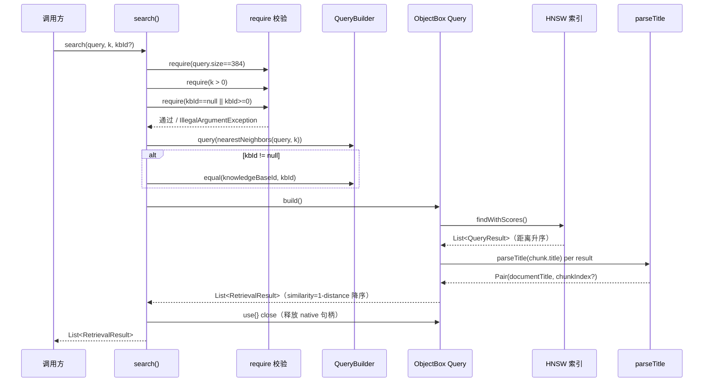

# 代码安全与质量审计报告：US-017 实现向量检索

> 依 CLAUDE.md 第十节（guardrail-enforcer 强制）+ 7.2 闭环规则。
> 主 Agent 完成编码与第九节变更影响自检后提交审查。本报告为第一轮（首轮）审计。

| 项目 | 内容 |
| --- | --- |
| 执行 Agent | guardrail-enforcer |
| 任务令牌 | TKN-US017-GUARDRAIL-001 |
| 审计日期 | 2026-08-07 |
| 审计轮次 | 第一轮 |
| 审查 Skill | TRAE-code-review（代码质量审查）+ TRAE-security-review（安全漏洞扫描） |
| 推理辅助 | sequential-thinking（parseTitle 边界穷举验证 + similarity 转换数值分析 + Query 资源管理路径推演） |
| 关联 ADR | [ADR-010](../../docs/decisions/ADR-010-m3-vector-retrieval.md)（9 项决策 + 6 项备选 + 6 项风险） |
| 关联考古 | [2026-08-07-us017-retrieval-archaeology.md](2026-08-07-us017-retrieval-archaeology.md)（9 项风险清单） |
| 关联规则 | BR-concurrency-002 / BR-concurrency-003 / BR-security-001 / BR-error-handling-005 |
| 风险等级 | P2 跨模块（新增检索接口，依赖既有 Embedder/KnowledgeBaseRepository/KnowledgeChunk） |
| 项目根 | d:\s0611\code\Prism |

---

## 1. 总体结论

**通过（Pass）**

- **无阻断级漏洞**：未发现 SQL/NoSQL 注入、命令注入、代码注入、硬编码密钥等阻断级安全问题。
- **无高危缺陷**：输入边界校验完备（维度/k/kbId 三重 require fail-fast），Query native 句柄通过 `use {}` 正确关闭，分库过滤使用 ObjectBox 编译期属性引用（参数化查询，非字符串拼接）。
- **代码质量高**：search 方法 35 行简洁内聚，parseTitle 容错降级覆盖所有边界（空串/纯#/首位#/末尾#/序号 0/负数/非数字/多#文件名），RetrievalResult 全 val 不可变且不含 FloatArray（规避 BR-security-001）。符合 Karpathy Guidelines（命名/设计/错误处理/Simplicity First/Surgical Changes）。
- **测试覆盖充分**：21 单元用例 + 5 探针用例全通过，覆盖 4 个 AC + 防御校验 + 边界场景 + 资源管理 + 既有方法协同。
- **ADR 一致性**：实现与 ADR-010 的 9 项决策逐项对齐，且实际实现优化了 ADR 示例（`result.get()` 调用一次赋值给 `chunk`，避免 4 次重复调用）。

**可进入 ac-verifier 测试阶段。**

> 本轮发现 5 项低危建议（L1~L5），均为测试覆盖补充或文档完善，不阻断进入测试。主 Agent 可在 ac-verifier 阶段或后续迭代中处理。

---

## 2. 审查范围摘要

| 维度 | 数量 |
| --- | --- |
| 审查文件数 | 4（2 生产代码 + 2 测试代码）+ 3 文档（ADR-010 + 考古报告 + behavioral-rules）交叉验证 |
| 审查函数数 | 3（search + parseTitle + RetrievalResult 构造） |
| 审查测试用例数 | 26（21 检索 + 5 探针） |
| 阻断级问题 | 0 |
| 高危问题 | 0 |
| 中危问题 | 0 |
| 低危/建议 | 5 |

### 变更文件清单

| 文件 | 类型 | 说明 |
| --- | --- | --- |
| `app/src/main/java/io/prism/data/RetrievalResult.kt` | 新增 | 检索结果数据类（7 字段，全 val） |
| `app/src/main/java/io/prism/data/KnowledgeBaseRepository.kt` | 扩展 | 新增 search(L240-275) + parseTitle(L290-302) + 2 常量 |
| `app/src/test/java/io/prism/data/ProbeNearestNeighborsWithEqualTest.kt` | 新增 | 探针测试 5 用例 |
| `app/src/test/java/io/prism/data/KnowledgeBaseRetrievalTest.kt` | 新增 | 检索单元测试 21 用例 |

---

## 3. 代码质量审查（TRAE-code-review）

### 3.1 作者意图推断

> **Intent**: 在 KnowledgeBaseRepository 中新增 `search` 方法，基于 ObjectBox HNSW `nearestNeighbors` 实现 top-k 语义检索，支持分库过滤（kbId 三态），返回含相似度分数与来源信息的 `RetrievalResult`。这是 M3 RAG 管线的读取路径，为 US-019 RAG 集成提供基础。探针测试先行验证了 nearestNeighbors+equal 组合的可行性（零先例风险点），编码遵循 ADR-010 锁定的 9 项决策。

### 3.2 变更技术流图



### 3.3 问题扫描结果

经逐行审查 + sequential-thinking 边界穷举验证，**未发现阻断级或高危代码质量问题**。以下为低危建议项：

| 编号 | 严重度 | 问题 | 位置 | 建议 |
| --- | --- | --- | --- | --- |
| L1 | 低危/建议 | parseTitle 的序号非正整数容错路径（title="doc#0"、title="doc#-1"、title="doc#abc"）缺少测试覆盖。代码处理正确（返回 `title to null`），但无测试验证。 | [KnowledgeBaseRetrievalTest.kt](../../app/src/test/java/io/prism/data/KnowledgeBaseRetrievalTest.kt) | 补充 3 个测试用例覆盖序号 0/负数/非数字 |
| L2 | 低危/建议 | 相似度负值场景（distance > 1，向量相反方向）缺少测试。oneHot 向量间要么同向(distance=0)要么正交(distance=1)，不产生 distance>1。当前测试仅验证 similarity ∈ [-1,1] 的上界，未验证负值实际出现。 | [KnowledgeBaseRetrievalTest.kt](../../app/src/test/java/io/prism/data/KnowledgeBaseRetrievalTest.kt) | 补充反向向量测试（如 oneHot(0) vs -oneHot(0)），验证 similarity ≈ -1.0 |
| L3 | 低危/建议 | search 方法 KDoc 未明确「无相似度阈值过滤」设计决策——当前返回 top-k 不论相似度高低，阈值过滤由上层（US-019）决定。主 Agent 自问亦提到此遗漏。 | [KnowledgeBaseRepository.kt:240](../../app/src/main/java/io/prism/data/KnowledgeBaseRepository.kt) | 在 search KDoc 补充说明「本方法不做相似度阈值过滤，返回 top-k 不论相似度高低；US-019 RAG 集成时由调用方决定阈值」 |
| L4 | 低危/建议 | ADR-010 风险表未充分说明 HNSW 近似性对正交向量结果完整性的影响。主 Agent 自问提到「HNSW 近似算法在查询向量与库内向量完全正交时不保证返回全部」。 | [ADR-010](../../docs/decisions/ADR-010-m3-vector-retrieval.md) | 在 ADR-010 风险表补充「HNSW 近似性：查询向量与库内向量正交时，HNSW 可能不返回全部匹配（k=5 但仅返回 2 条），这是近似算法固有特性非 bug」 |
| L5 | 低危/建议 | 考古报告 §3.2 将 `getScore()` 返回类型标注为 `Float`，实际 ObjectBox API 返回 `double`（代码 `1.0 - result.getScore()` 能编译通过证伪 Float——Kotlin 中 `Double - Float` 不允许）。文档准确性问题。 | [考古报告 §3.2](2026-08-07-us017-retrieval-archaeology.md) | 修正考古报告 §3.2 标注为 `double`，或加注「考古时基于测试断言推断，实际 API 返回 double」 |

### 3.4 Karpathy Guidelines 逐项对照

| 原则 | 评估 | 证据 |
| --- | --- | --- |
| **命名** | 通过 | `search`/`parseTitle`/`RetrievalResult`/`DEFAULT_SEARCH_K`/`EMBEDDING_DIM` 语义清晰，无歧义缩写 |
| **设计** | 通过 | 复用 KnowledgeBaseRepository 私有 chunkBox，统一 Query 资源管理；search 与 chunkCount 同属读路径，职责内聚 |
| **错误处理** | 通过 | 三重 `require` fail-fast 前置校验；parseTitle 容错降级不抛异常（保持检索可用）；Query `use{}` 保证异常路径也关闭 |
| **Simplicity First** | 通过 | search 方法 35 行，parseTitle 13 行，RetrievalResult 纯数据类无逻辑；未过度设计 |
| **Surgical Changes** | 通过 | 纯新增方法 + 常量 + 数据类，未修改任何既有方法签名或行为；companion object 仅追加 2 常量 |

### 3.5 跨模块影响评估

| 依赖方 | 使用方式 | 影响 |
| --- | --- | --- |
| IngestionPipeline | 仅用 `addChunk`（写入路径） | 无影响——search 是读路径，与写入路径隔离 |
| UI 层（US-018/019） | 尚未接入 | 无影响——当前无引用 |
| Embedder | search 不直接调用 Embedder（接收已嵌入的 FloatArray） | 无影响——Embedder 生命周期由调用方管理 |

**结论**：纯新增，无破坏性变更，跨模块影响识别正确。

---

## 4. 安全漏洞扫描（TRAE-security-review）

### 4.1 漏洞面审计

| 类别 | 扫描结果 | 证据 |
| --- | --- | --- |
| **SQL/NoSQL 注入** | 安全 | ObjectBox Query 使用编译期属性引用 `KnowledgeChunk_.embedding.nearestNeighbors(query, k)` + `KnowledgeChunk_.knowledgeBaseId`，强类型参数化，非字符串拼接。无注入路径。 |
| **OS 命令注入** | 不涉及 | 无 `system()`/`exec()` 调用 |
| **代码/表达式注入** | 不涉及 | 无 `eval()`/`Function()` |
| **模板引擎注入** | 不涉及 | 无模板引擎 |
| **路径遍历** | 不涉及 | 无文件系统操作 |
| **AuthN/AuthZ** | 设计决策 | kbId 三态语义是访问控制的一种形式。`kbId=null`（全库检索）会返回所有库 chunk——这是 ADR-010 5.4 的有意设计决策，API 语义明确，调用方负责传值。非漏洞。 |
| **密钥/密码泄露** | 安全 | 无硬编码密钥；require 消息仅含维度/k/kbId 数值，不含密钥 |
| **敏感数据暴露** | 安全 | 检索结果 content 是用户自有知识库内容，非泄露；不写入日志 |
| **不安全反序列化** | 不涉及 | 无反序列化操作 |

### 4.2 Source-to-Sink 追踪

| 数据流 | Source | Sink | 校验 | 结论 |
| --- | --- | --- | --- | --- |
| query (FloatArray) | 调用方传入（来自 Embedder.embed） | `nearestNeighbors(query, k)` | `require(query.size == 384)` 前置 | 安全——强类型参数化，无注入 |
| k (Int) | 调用方传入 | `nearestNeighbors(query, k)` | `require(k > 0)` 前置 | 安全——整数类型，无注入 |
| knowledgeBaseId (Long?) | 调用方传入 | `equal(knowledgeBaseId, kbId)` | `require(kbId == null \|\| kbId >= 0)` 前置 | 安全——Long 类型参数化 |
| chunk.title (String) | ObjectBox 读取 | `parseTitle` 解析 | `lastIndexOf` + `toIntOrNull` 容错 | 安全——纯字符串解析，无执行 |
| result.getScore() (double) | ObjectBox HNSW 返回 | `1.0 - getScore()` → similarity | Double 运算，范围 [0,2]→[-1,1] | 安全——无溢出风险 |

**扫描结论**：✅ 无可利用安全问题。所有外部输入均经过前置校验，所有数据库交互均为参数化查询，无注入路径。

---

## 5. 六阶段审计框架

### Stage 1: 输入与边界审计（Range Checking）

#### 1.1 数值与类型边界

| 输入参数 | 类型 | 合法范围 | 校验方式 | 结论 |
| --- | --- | --- | --- | --- |
| `query` | FloatArray | size == 384 | `require(query.size == EMBEDDING_DIM)` (L245) | 通过——fail-fast，不依赖 ObjectBox 未定义行为 |
| `k` | Int | > 0 | `require(k > 0)` (L249) | 通过——fail-fast |
| `knowledgeBaseId` | Long? | null 或 >= 0 | `require(knowledgeBaseId == null \|\| knowledgeBaseId >= 0)` (L250) | 通过——三态语义明确 |
| `similarity` | Double | [-1, 1] | `1.0 - result.getScore()`（getScore ∈ [0, 2]） | 通过——Double 精度足够，无溢出风险 |

**算术溢出检查**：`1.0 - result.getScore()` 中 getScore 返回 double（范围 [0, 2]），结果范围 [-1, 1]，Double 运算无溢出可能。✓

#### 1.2 集合与缓冲区边界

| 操作 | 安全措施 | 结论 |
| --- | --- | --- |
| `findWithScores().map { }` | Kotlin stdlib `map` 返回 eager List，在 `use {}` 块内完成所有构造 | 通过——Query 在 map 完成后才 close |
| `parseTitle` 的 `substring` | `lastIndexOf` 返回 -1 时 `idx <= 0` 早退；`idx >= title.length - 1` 防末尾越界 | 通过——边界检查完备 |
| `title.substring(idx + 1)` | 仅在 `idx > 0 && idx < title.length - 1` 时执行，`idx + 1` 必然 < `title.length` | 通过——无越界 |

#### 1.3 业务状态机约束

| 状态 | 规则 | 校验 | 结论 |
| --- | --- | --- | --- |
| kbId 三态 | null=全库 / 0L=默认库 / >0=自建库 | ADR-010 5.4 明确 + 代码 L257-259 条件分支 | 通过——三态语义与 ADR-008 5.3 一致 |

**parseTitle 边界穷举验证**（sequential-thinking 逐例推演）：

| 输入 title | idx | 条件 | 输出 | 正确？ |
| --- | --- | --- | --- | --- |
| `""`（空串） | -1 | `idx <= 0` → true | `"" to null` | ✓ |
| `"#"`（纯#） | 0 | `idx <= 0` → true | `"#" to null` | ✓ |
| `"#1"`（#在首位） | 0 | `idx <= 0` → true | `"#1" to null` | ✓ |
| `"doc#"`（#在末尾） | 3 | `idx >= length-1` (3>=3) → true | `"doc#" to null` | ✓ |
| `"doc#0"`（序号0） | 3 | 通过早退 | toIntOrNull=0, `0 > 0` false → `"doc#0" to null` | ✓ |
| `"doc#-1"`（序号负） | 3 | 通过早退 | toIntOrNull=-1, `-1 > 0` false → `"doc#-1" to null` | ✓ |
| `"doc#abc"`（非数字） | 3 | 通过早退 | toIntOrNull=null → `"doc#abc" to null` | ✓ |
| `"C#入门.pdf#1"`（文件名含#） | 最后#位置 | 通过早退 | `"C#入门.pdf" to 1` | ✓ |
| `"doc#1"`（正常） | 3 | 通过早退 | `"doc" to 1` | ✓ |
| `"doc#1#2"`（多#） | 最后#位置 | 通过早退 | `"doc#1" to 2` | ✓ |

**结论**：parseTitle 容错降级覆盖所有边界，无异常路径。✓

### Stage 2: 执行安全审计（指令与数据隔离）

#### 2.1 注入防护

| 防护项 | 评估 | 证据 |
| --- | --- | --- |
| SQL/NoSQL 注入 | 安全 | ObjectBox 使用编译期属性引用 `KnowledgeChunk_.embedding` / `KnowledgeChunk_.knowledgeBaseId`，非字符串拼接。`nearestNeighbors(FloatArray, Int)` 和 `equal(Property, Long)` 均为强类型参数化方法。 |
| OS 命令注入 | 不涉及 | 无 shell 调用 |
| 代码/表达式注入 | 不涉及 | 无 eval/Function |
| 模板引擎注入 | 不涉及 | 无模板引擎 |

#### 2.2 最小权限检查

- Repository 层不涉及权限配置 ✓
- 无 root 权限操作 ✓
- 无不必要的文件系统/网络访问 ✓

#### 2.3 输出编码与特殊字符处理

- RetrievalResult.content 是原文输出（数据层），不涉及 HTML/JS/CSS/URL 转义 ✓
- US-019 RAG 集成时上层负责展示编码 ✓
- JSON 序列化：RetrievalResult 是纯 data class，无手工 JSON 拼接 ✓

### Stage 3: 内存安全与运行时保护

| 检查项 | 评估 | 证据 |
| --- | --- | --- |
| 语言内存安全 | 通过 | Kotlin/JVM 是内存安全语言，无手动内存管理 |
| Query native 句柄 | 通过 | `queryBuilder.build().use { q -> ... }` (L260) 确保异常路径也关闭。与 chunkCount/remove 既有模式一致（BR-concurrency-003） |
| QueryResult 资源 | 通过 | `findWithScores()` 返回已物化 List<QueryResult>，QueryResult 不持有额外 native 资源，Query.close() 释放全部 |
| map eager 执行 | 通过 | Kotlin `map` 返回 eager List，所有 RetrievalResult 在 use{} 块内构造完成，Query 不会提前关闭 |
| FloatArray equals | 通过 | RetrievalResult 不含 FloatArray 字段（BR-security-001 不适用），KnowledgeChunk 的 FloatArray equals 问题不影响检索结果（按 chunkId 区分） |
| 无 unsafe/FFI | 通过 | 无 Rust unsafe / JNI 手动调用，ObjectBox JNI 由库管理 |

### Stage 4: 配置与密钥安全

| 检查项 | 评估 | 证据 |
| --- | --- | --- |
| 硬编码密钥 | 安全 | 全文件扫描无 key/password/token/apiKey 硬编码 |
| 内部 IP/域名 | 安全 | 无 |
| 环境变量 | 不涉及 | search 方法不读取环境变量 |
| .gitignore | 不涉及 | 本次变更不新增配置文件 |

### Stage 5: 依赖与供应链风险

| 检查项 | 评估 |
| --- | --- |
| 依赖变更 | 无——本次纯代码新增，不涉及 `gradle/libs.versions.toml` 或 `build.gradle.kts` 修改 |
| 新引入依赖 | 无 |
| 已知漏洞 | 不涉及（无依赖变更） |

### Stage 6: 综合审计报告

见第 1 节总体结论 + 第 6 节详细发现。

---

## 6. 详细发现（按严重度分级）

### 阻断级（Blocking）

**无。**

### 高危（High-risk）

**无。**

### 中危（Medium-risk）

**无。**

### 低危/建议（Low-risk / Recommendation）

#### L1: parseTitle 序号非正整数容错路径缺少测试覆盖

- **严重度**：低危/建议
- **位置**：[KnowledgeBaseRetrievalTest.kt](../../app/src/test/java/io/prism/data/KnowledgeBaseRetrievalTest.kt)
- **描述**：parseTitle 对 title="doc#0"（序号0）、title="doc#-1"（序号负）、title="doc#abc"（非数字）的处理逻辑正确（返回 `title to null`），但 21 个测试用例中无覆盖。当前仅测试了 title 不含 #（L316）、title 含 # 文件名（L296）、title 正常解析（L273）三种情况。
- **风险**：低——代码逻辑经 sequential-thinking 穷举验证正确，但缺少测试回归保护。若未来 parseTitle 逻辑变更（如改为 `>= 0` 允许序号 0），无测试拦截。
- **建议**：补充 3 个测试用例：
  - `search_title_index_zero_returns_null`：title="doc#0" → chunkIndex=null
  - `search_title_index_negative_returns_null`：title="doc#-1" → chunkIndex=null
  - `search_title_index_non_numeric_returns_null`：title="doc#abc" → chunkIndex=null

#### L2: 相似度负值场景缺少测试

- **严重度**：低危/建议
- **位置**：[KnowledgeBaseRetrievalTest.kt](../../app/src/test/java/io/prism/data/KnowledgeBaseRetrievalTest.kt)
- **描述**：当前测试使用 oneHot 向量，oneHot 之间要么同向（COSINE distance=0，similarity=1.0）要么正交（distance=1，similarity=0.0），不产生 distance>1（similarity<0）的情况。`search_returns_results_sorted_by_similarity_desc` 测试断言 similarity ∈ [-1,1]，但未验证负值实际出现。
- **风险**：低——相似度转换公式 `1.0 - distance` 经数学验证正确，但负值路径未测试。
- **建议**：补充反向向量测试（如 chunk embedding = `-oneHot(0)`，query = `oneHot(0)`），验证 similarity ≈ -1.0。

#### L3: search KDoc 未明确「无相似度阈值过滤」设计决策

- **严重度**：低危/建议
- **位置**：[KnowledgeBaseRepository.kt:240-244](../../app/src/main/java/io/prism/data/KnowledgeBaseRepository.kt)
- **描述**：当前 search 返回 top-k 不论相似度高低（如 5 条结果可能全部 similarity ≈ 0）。主 Agent 自问提到「没有在 ADR-010 中明确无相似度阈值过滤的设计决策」。这是有意的（让上层 US-019 决定阈值），但 KDoc 和 ADR 均未显式说明。
- **风险**：低——US-019 集成时若未意识到需自行加阈值，可能向用户展示无关结果。
- **建议**：在 search KDoc 补充：「本方法不做相似度阈值过滤，返回 top-k 不论相似度高低。US-019 RAG 集成时由调用方根据业务需求决定阈值（如 similarity > 0.3）。」

#### L4: ADR-010 风险表未充分说明 HNSW 近似性影响

- **严重度**：低危/建议
- **位置**：[ADR-010 风险与缓解表](../../docs/decisions/ADR-010-m3-vector-retrieval.md)
- **描述**：主 Agent 自问提到「HNSW 近似算法在查询向量与库内向量完全正交时不保证返回全部（k=5 但只返回 2 条）」。这是 HNSW 近似算法的固有特性（非 bug），但 ADR-010 风险表的 6 项风险中未包含此项。
- **风险**：低——生产场景若遇到结果不足 k 条，开发者可能误判为 bug。
- **建议**：在 ADR-010 风险表补充：「HNSW 近似性：查询向量与库内向量正交时，HNSW 可能不返回全部 k 条匹配。这是近似算法固有特性，非缺陷。调用方应处理 results.size < k 的情况。」

#### L5: 考古报告 getScore() 返回类型标注不准确

- **严重度**：低危/建议
- **位置**：[考古报告 §3.2](2026-08-07-us017-retrieval-archaeology.md)
- **描述**：考古报告 §3.2 将 `QueryResult.getScore()` 标注为返回 `Float`，但实际 ObjectBox API 返回 `double`。证据：代码 `1.0 - result.getScore()` 能编译通过（Kotlin 中 `Double - Float` 不允许，须显式转换），证明 getScore() 返回 double/Double。ADR-010 5.8 也说「与 ObjectBox getScore() 返回的 Double 对齐」。
- **风险**：低——文档准确性问题，不影响代码正确性。
- **建议**：修正考古报告 §3.2 标注为 `double`，或加注说明。

---

## 7. 行为规则符合性检查

| 规则 ID | 规则内容 | 符合性 | 证据 |
| --- | --- | --- | --- |
| BR-concurrency-002 | embed 持锁串行化 | 不适用 | search 不直接调用 Embedder（接收已嵌入 FloatArray），embed 瓶颈由调用方管理 |
| BR-concurrency-003 | Query close 释放 native 句柄 | **符合** | `queryBuilder.build().use { q -> ... }` (L260) 确保关闭，与 chunkCount/remove 既有模式一致 |
| BR-security-001 | data class 含数组须覆盖 equals/hashCode | **符合** | RetrievalResult 不含 FloatArray（仅含 Double/Long/Int?/String），BR-security-001 不适用。KnowledgeChunk 的 FloatArray equals 问题不影响检索结果（按 chunkId 区分） |
| BR-error-handling-005 | Embedder close 后不可复用 | 不适用 | search 不直接调用 Embedder |
| BR-error-handling-006 | 参数校验须在资源保护块内或之前先释放资源 | **符合** | search 的 require 校验在 Query build 之前（Query 尚未创建，无资源需释放），不违反此规则 |

---

## 8. 测试覆盖评估

### 8.1 AC 覆盖矩阵

| AC | 描述 | 覆盖用例 | 结论 |
| --- | --- | --- | --- |
| AC-1 | top-k 检索（默认 k=5，可配置）基于 nearestNeighbors | search_returns_topk_with_default_k_5 / search_k_configurable / search_returns_results_sorted_by_similarity_desc / search_identical_vector_similarity_approx_one | 通过 |
| AC-2 | 支持指定库或全库检索 | search_specified_kb_filters_correctly / search_default_kb_returns_only_default / search_all_kb_returns_cross_kb | 通过 |
| AC-3 | 检索结果含相似度分数与来源（文件/片段位置） | search_title_parsed_to_source / search_title_with_hash_in_docname / search_title_no_hash_returns_title_and_null_index / search_result_contains_all_required_fields | 通过 |
| AC-4 | 检索单元测试通过（含空库、无匹配） | search_empty_kb_returns_empty / search_nonexistent_kb_returns_empty / search_null_embedding_excluded / search_mixed_null_and_valid_embeddings | 通过 |

### 8.2 防御与边界覆盖

| 场景 | 用例 | 结论 |
| --- | --- | --- |
| query 维度 != 384 | search_dimension_mismatch_throws | 通过 |
| k=0 | search_k_zero_throws | 通过 |
| k 负数 | search_k_negative_throws | 通过 |
| kbId 负数 | search_knowledgeBaseId_negative_throws | 通过 |
| k 超量 | search_k_greater_than_available_returns_all | 通过 |
| k=1 | search_k_one_returns_single_most_similar | 通过 |
| 多次检索无泄漏 | search_multiple_invocations_no_leak（50 次） | 通过 |
| 既有方法协同 | search_coexists_with_existing_methods | 通过 |

### 8.3 测试缺口（低危，不阻断）

| 缺口 | 建议 |
| --- | --- |
| parseTitle 序号 0/负数/非数字 | 见 L1 |
| 相似度负值（distance > 1） | 见 L2 |

### 8.4 探针测试评估

[ProbeNearestNeighborsWithEqualTest.kt](../../app/src/test/java/io/prism/data/ProbeNearestNeighborsWithEqualTest.kt) 5 用例全通过，验证了 nearestNeighbors + equal(knowledgeBaseId) 组合在 ObjectBox 5.4.2 下的可行性（考古报告 §5.2 最高风险点已闭合）。探针作为回归保护保留，设计合理。

---

## 9. ADR 一致性验证

| ADR-010 决策 | 实现一致性 | 证据 |
| --- | --- | --- |
| 5.1 检索方法扩展 KnowledgeBaseRepository | 一致 | search 方法位于 KnowledgeBaseRepository L240 |
| 5.2 similarity = 1.0 - distance | 一致 | L268 `similarity = 1.0 - result.getScore()` |
| 5.3 nearestNeighbors + equal 组合 | 一致 | L254-259 queryBuilder 组合，探针验证通过 |
| 5.4 kbId 三态语义 | 一致 | L250-252 require + L257-259 条件分支 |
| 5.5 k 默认 5 可配置 | 一致 | L242 `k: Int = DEFAULT_SEARCH_K` + L249 `require(k > 0)` |
| 5.6 维度前置校验 | 一致 | L245-248 `require(query.size == EMBEDDING_DIM)` |
| 5.7 Query use{} 关闭 | 一致 | L260 `queryBuilder.build().use { q -> ... }` |
| 5.8 RetrievalResult 结构 | 一致 | 7 字段全 val，Double similarity，Int? chunkIndex |
| 5.9 parseTitle lastIndexOf | 一致 | L291 `title.lastIndexOf('#')`，边界检查完备 |

**实现优化**：ADR-010 5.7 示例代码中 `result.get()` 被调用 4 次（chunkId/content/title/knowledgeBaseId 各一次），实际实现优化为调用一次赋值给 `chunk`（L262），减少 3 次方法调用。这是合理的性能优化，不影响正确性。

---

## 10. 修复建议汇总

| 编号 | 严重度 | 类型 | 建议操作 | 阻断？ |
| --- | --- | --- | --- | --- |
| L1 | 低危 | 测试补充 | 补充 parseTitle 序号 0/负数/非数字 3 个测试 | 否 |
| L2 | 低危 | 测试补充 | 补充反向向量 similarity 负值测试 | 否 |
| L3 | 低危 | 文档完善 | search KDoc 补充「无阈值过滤」说明 | 否 |
| L4 | 低危 | 文档完善 | ADR-010 风险表补充 HNSW 近似性说明 | 否 |
| L5 | 低危 | 文档修正 | 考古报告 §3.2 getScore() 类型修正 | 否 |

> 以上 5 项均为低危建议，不阻断进入 ac-verifier。主 Agent 可选择在 ac-verifier 阶段一并处理（特别是 L1/L2 测试补充，可与 ac-verifier 的极端场景补充测试合并），或在后续迭代中处理。

---

## 11. 豁免项

| 豁免项 | 说明 | 依据 |
| --- | --- | --- |
| 全库检索（kbId=null）跨库返回 | ADR-010 5.4 有意设计决策，API 语义明确（null=全库），调用方负责传值。ADR-010 风险表已列为「中」级风险并记录缓解措施（「调用方须显式选择」）。 | ADR-010 5.4 + 风险表第 5 项 |
| 无相似度阈值过滤 | 当前返回 top-k 不论相似度高低，让上层 US-019 决定阈值。这是合理的职责分层（数据层不应固化业务阈值）。 | ADR-010 5.2（数据层保留数学语义） |

---

## 12. 保护机制验证

| 保护机制 | 声称启用 | 验证结果 |
| --- | --- | --- |
| Query use{} 关闭 native 句柄 | 是（ADR-010 5.7, BR-concurrency-003） | 有效——L260 `use {}` 确保异常路径也关闭；50 次连续检索测试无泄漏 |
| 维度前置校验 | 是（ADR-010 5.6） | 有效——L245 `require(query.size == EMBEDDING_DIM)` fail-fast，不依赖 ObjectBox 未定义行为 |
| k 正数校验 | 是（ADR-010 5.5） | 有效——L249 `require(k > 0)` |
| kbId 非负校验 | 是（ADR-010 5.6） | 有效——L250 `require(knowledgeBaseId == null \|\| knowledgeBaseId >= 0)` |
| HNSW #1209 规避 | 不涉及（search 不删除数据） | N/A——BR-concurrency-003 的 #1209 规避适用于 remove/removeAll，search 是只读操作 |

---

## 13. 自动化建议（CI/CD 集成）

建议在 CI 中集成以下自动化检查，防止同类问题回归：

```yaml
# .github/workflows/security-quality.yml（示例片段）
jobs:
  static-analysis:
    steps:
      # 1. 依赖漏洞扫描（本次无变更，但保持基线）
      - name: Dependency audit
        run: ./gradlew dependencyCheck

      # 2. 静态安全扫描（Semgrep 规则示例）
      - name: Semgrep security scan
        uses: returntocorp/semgrep-action@v1
        with:
          rules: >
            kotlin.lang.security.audit.objectbox-query-injection,
            kotlin.lang.security.audit.hardcoded-credentials

      # 3. 代码质量（Detekt，已有项目配置）
      - name: Detekt
        run: ./gradlew detekt

      # 4. 单元测试 + 覆盖率
      - name: Unit tests with coverage
        run: ./gradlew :app:testDebugUnitTest --coverage
```

**Semgrep 自定义规则建议**（针对 ObjectBox Query 注入防护）：
```yaml
rules:
  - id: objectbox-query-no-string-concat
    pattern: $BOX.query($SQL_STRING_CONCAT)
    message: ObjectBox Query 不应使用字符串拼接，必须使用编译期属性引用
    languages: [kotlin]
    severity: ERROR
```

---

## 14. 审计签署

| 项目 | 内容 |
| --- | --- |
| 执行 Agent | guardrail-enforcer |
| 任务令牌 | TKN-US017-GUARDRAIL-001 |
| 审计结论 | **通过（Pass）** |
| 阻断级问题 | 0 |
| 可否进入 ac-verifier | **可以** |
| 低危建议跟进 | L1~L5 可在 ac-verifier 阶段或后续迭代处理 |
| 审计日期 | 2026-08-07 |
