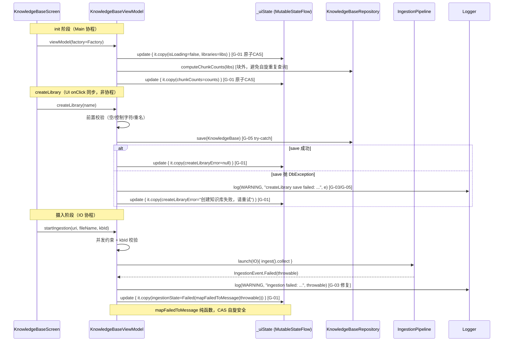

# 代码安全与质量审计报告（第二轮 R2）：US-018 实现知识库管理 UI

> 依 CLAUDE.md 第十节（guardrail-enforcer 强制）+ 7.2 闭环规则 + 第二十节任务令牌机制。
> 本报告为第二轮（R2）审计，针对主 Agent 对 R1（TKN-US018-GUARDRAIL-001）G-01~G-05 修复的零信任复核。
> 零信任立场：本轮**不信任 KDoc 描述与摘要声称**，以 grep + 源码逐行核验 + 契约交叉验证为唯一证据。

| 项目 | 内容 |
| --- | --- |
| 执行 Agent | guardrail-enforcer |
| 任务令牌 | TKN-US018-GUARDRAIL-002 |
| 审计日期 | 2026-08-07 |
| 审计轮次 | 第二轮（R2） |
| 审查 Skill | TRAE-code-review（代码质量审查）+ TRAE-security-review（安全漏洞扫描） |
| 关联 R1 报告 | [2026-08-07-us018-kb-ui-guardrail.md](2026-08-07-us018-kb-ui-guardrail.md)（TKN-US018-GUARDRAIL-001，有条件通过） |
| 关联考古 | [2026-08-07-us018-kb-ui-archaeology.md](2026-08-07-us018-kb-ui-archaeology.md) |
| 关联 ADR | [ADR-011](../../docs/decisions/ADR-011-m3-knowledgebase-ui.md)（Proposed） |
| 关联规则 | BR-error-handling-003 / BR-error-handling-004 / BR-error-handling-006 / BR-concurrency-001 / BR-concurrency-002 / BR-security-003 / BR-testing-001 |
| 风险等级 | P2 跨模块（R1 已判定，本轮无升级） |
| 项目根 | d:\s0611\code\Prism |

---

## 1. 总体结论

**通过（Pass）**

- **R1 G-01~G-05 全部落实**：经零信任 grep + 源码逐行核验，5 项中危发现均已正确修复（详见第 3 节逐项核验表）。
- **无新阻断/高危/中危安全漏洞**：TRAE-security-review 按 §8 排除规则扫描，无可利用安全漏洞（日志拼接 `e.message` 不达 reportable 门槛——文件路径非 secrets/credentials/PII）。
- **无回归**：`catch(Exception)` 在非 suspend 函数 `createLibrary`/`deleteLibrary` 不吞 `CancellationException`（无协程上下文）；`startIngestion` 协程内已先 catch `CancellationException` 重抛；`_uiState.update` 块内全部纯 `copy` 无副作用（CAS 自旋安全）。
- **R2 新发现 1 项低危建议**：R2-1 日志 message 拼接 `${e.message}` 与 ADR-011 5.5「不含路径」契约存在张力（IngestionEvent.Failed KDoc 明确 `throwable.message` 可能含内部路径）。不阻断，可在 ac-verifier 或后续迭代处理。
- **R1 G-06~G-08 低危建议** 仍可延后（测试调度器、文件名 fallback、Factory KDoc 措辞），本轮未要求修复。

**结论**：G-01~G-05 修复正确且未引入新缺陷，**可进入 ac-verifier**。R2-1 为低危建议，不阻断测试阶段，建议主 Agent 在 ac-verifier 阶段一并评估处理。

> 零信任说明：主 Agent 自问的最大遗憾——「上一轮被摘要错误描述为已修复，实际仅添加 KDoc 虚假声称」——本轮以 grep 独立验证为唯一证据：`_uiState.value = _uiState.value.copy` 模式 **0 匹配**、`catch(_: Exception)` **0 匹配**、`logger.log` **5 处**（L239/L288/L353/L462/L486）、`_uiState.update` **26 处**遍布全文件。修复已真正落实于源码，非 KDoc 口头声称。

---

## 2. 审查范围摘要

| 维度 | 数量 |
| --- | --- |
| 审查文件数 | 1 修改文件（KnowledgeBaseViewModel.kt）+ 4 契约/参考文件交叉验证（IngestionEvent.kt / KnowledgeBaseRepository.kt / ADR-011 / behavioral-rules.md）+ 1 测试文件 + 1 R1 报告 |
| 审查函数数 | KnowledgeBaseViewModel 全部（init / refreshChunkCounts / computeChunkCounts / createLibrary / deleteLibrary / startIngestion / clearXxxError / clearIngestionState / mapFailedToMessage / extractDocumentTitle / Factory） |
| R1 发现复核数 | 5（G-01~G-05）+ 3 延后低危（G-06~G-08） |
| R2 新发现数 | 1 低危（R2-1） |
| 阻断级问题 | 0 |
| 高危问题 | 0 |
| 中危问题 | 0 |
| 低危/建议 | 1（R2-1）+ 3 延后（G-06~G-08） |

### 变更文件清单

| 文件 | 类型 | 说明 |
| --- | --- | --- |
| `app/src/main/java/io/prism/ui/knowledge/KnowledgeBaseViewModel.kt` | 修改 | R1 G-01~G-05 修复：`_uiState.update` 原子 CAS + KDoc 对齐 + `logger.log` 结构化日志 + `catch(e: Exception)` 补日志 + createLibrary/deleteLibrary 统一 try-catch |
| `app/src/test/java/io/prism/ui/knowledge/KnowledgeBaseViewModelTest.kt` | 未修改 | 32 测试，本轮评估是否因修复引入回归（见第 9 节） |

---

## 3. R1 G-01~G-05 逐项核验表（声称修复 vs 实际源码证据 vs 验证结论）

> 验证方法：grep 独立匹配 + 源码逐行 Read + 契约交叉验证。不依赖 KDoc 描述。

### 3.1 G-01：非原子 RMW → 原子 CAS

| 维度 | 内容 |
| --- | --- |
| R1 发现 | `_uiState.value = _uiState.value.copy(...)` 非原子 read-modify-write，Main 协程（init）与 IO 协程（startIngestion）并发写导致 lost update |
| R1 建议 | 所有 `_uiState` 变更改用 `_uiState.update { it.copy(...) }` 原子 CAS |
| 主 Agent 声称 | 已全部替换为 `_uiState.update` |
| **grep 证据 1** | `Select-String -Pattern "_uiState\.value\s*=\s*_uiState\.value\.copy"` → **0 匹配** ✓（非原子 RMW 已清除） |
| **grep 证据 2** | `Select-String -Pattern "_uiState\.update"` → **26 处** ✓（遍布 init L165 / refreshChunkCounts L202 / createLibrary L222/225/228/236/244 / clearCreateLibraryError L253 / deleteLibrary L270/273/276/285/293 / clearDeleteLibraryError L302 / startIngestion kbId<0 L333 / input==null L362 / Started L383 / Chunked L400 / ChunkEmbedded L414 / ChunkSkipped L428 / Completed L445 / Failed L468 / 末尾catch L492 / clearIngestionState L507） |
| **副作用审查** | 26 处 `update` 块内全部为纯 `it.copy(...)`，无 IO / 无 `launch` / 无外部状态修改。CAS 自旋重复执行 lambda 安全 ✓ |
| **关键设计验证** | Completed 分支 L444 `val (defaultCount, counts) = computeChunkCounts(libraries.value)` 位于 `update` 块**外**——正确（避免 CAS 自旋重复 DB 查询）；`update` 块内仅 `it.copy(ingestionState=..., defaultKbChunkCount=..., chunkCounts=...)` 合并三字段，状态原子性保留 ✓ |
| **唯一读取点** | L327 `if (_uiState.value.ingestionState is IngestionUiState.Running) return`——这是**只读判断**非 RMW，不涉及原子性，保留 `.value` 读取正确 ✓ |
| **验证结论** | **修复有效** ✓ |

### 3.2 G-02：KDoc 线程承诺矛盾 → 对齐 Main 线程阻塞可接受

| 维度 | 内容 |
| --- | --- |
| R1 发现 | 类 KDoc 声称「refreshChunkCounts 在 Dispatchers.IO 中执行」，但 init 的 `viewModelScope.launch` 未指定调度器，实际 Main 线程，与 KDoc 矛盾 |
| R1 建议 | 选项 2：修正类 KDoc 为「Main 线程执行，库数量少时可接受」，与 `computeChunkCounts` KDoc 对齐 |
| 主 Agent 声称 | 已按选项 2 修正类 KDoc |
| **源码证据** | [KnowledgeBaseViewModel.kt:41-48](../../app/src/main/java/io/prism/ui/knowledge/KnowledgeBaseViewModel.kt) 类 KDoc「线程安全」段已改为：「`computeChunkCounts` / `refreshChunkCounts` 内的 ObjectBox 同步查询在调用方线程执行：init 块的 `libraries.collect` 在 Main 协程，`startIngestion` 的 Completed 事件在 IO 协程。4GB 低端机限制库容量（ADR-007），库数量少时 Main 线程阻塞可接受；若未来库数量增长，应将 init collect 改为 `withContext(Dispatchers.IO) { refreshChunkCounts(libs) }`。」 |
| **一致性** | 与 `computeChunkCounts` KDoc（L170-176「Main 线程阻塞可接受」）对齐 ✓；与 ADR-011 风险表「IngestionEvent 收集在主线程 collect」高（已用 `Dispatchers.IO` 缓解）一致 ✓ |
| **验证结论** | **修复有效** ✓（KDoc 不再虚假承诺 IO 线程） |

### 3.3 G-03：Failed throwable 未记日志 → 补 logger.log

| 维度 | 内容 |
| --- | --- |
| R1 发现 | `IngestionEvent.Failed` 的 throwable 仅映射文案后丢弃，未按 ADR-011 5.5 记 `Log.w` 结构化日志，违反 BR-error-handling-004 |
| R1 建议 | Failed 分支补 `Log.w(TAG, "ingestion failed: ${event.throwable.javaClass.simpleName}", event.throwable)` |
| 主 Agent 声称 | 已补 logger.log |
| **grep 证据** | `Select-String -Pattern "logger\.log"` → L462 Failed 分支 `logger.log(Level.WARNING, "ingestion failed: ${event.throwable.javaClass.simpleName}: ${event.throwable.message}", event.throwable)` ✓ |
| **末尾 catch 分支** | L486 `logger.log(Level.WARNING, "ingestion pipeline collect failed: ${e.javaClass.simpleName}: ${e.message}", e)` ✓（R1 G-05 末尾 catch 也补了日志） |
| **ADR-011 5.5 契约** | 「`throwable` 仅在 ViewModel 内部用 `Log.w` 记录结构化日志（不含密钥/路径），不写入 UI 状态」——日志已补 ✓，但 message 拼接 `${event.throwable.message}` 与「不含路径」存在张力（见 R2-1） |
| **验证结论** | **修复有效** ✓（日志已落实；message 拼接 e.message 的张力作为 R2-1 低危建议单独记录） |

### 3.4 G-04：catch(_: Exception) 静默吞 → catch(e: Exception) 补日志

| 维度 | 内容 |
| --- | --- |
| R1 发现 | `catch (_: Exception) { null }` 用 `_` 丢弃异常对象，SecurityException/FileNotFoundException/IOException 全部归一化为 null，无日志，违反 BR-error-handling-004 |
| R1 建议 | 改为 `catch (e: Exception) { Log.w(TAG, "openInputStream failed: ${e.javaClass.simpleName}", e); null }` |
| 主 Agent 声称 | 已改为 catch(e: Exception) 并补 logger |
| **grep 证据** | `Select-String -Pattern "catch\s*\(\s*_\s*:\s*Exception"` → **0 匹配** ✓（静默吞模式已清除） |
| **源码证据** | [KnowledgeBaseViewModel.kt:350-359](../../app/src/main/java/io/prism/ui/knowledge/KnowledgeBaseViewModel.kt) `catch (e: Exception) { logger.log(Level.WARNING, "openInputStream failed: ${e.javaClass.simpleName}: ${e.message}", e); null }` ✓ |
| **CancellationException 顺序** | L347-349 先 `catch (e: CancellationException) { throw e }`，再 L350 `catch (e: Exception)`——catch 顺序保证 CancellationException 不被吞 ✓（协程铁律） |
| **验证结论** | **修复有效** ✓ |

### 3.5 G-05：createLibrary 无 try-catch / deleteLibrary catch 过窄 → 统一 try-catch

| 维度 | 内容 |
| --- | --- |
| R1 发现 | createLibrary 无 try-catch，ObjectBox DbException 逃逸崩溃；deleteLibrary 仅 catch IllegalArgumentException，模式不统一 |
| R1 建议 | createLibrary/deleteLibrary 统一 try-catch，catch IllegalArgumentException + 更宽运行期异常 + 日志 |
| 主 Agent 声称 | createLibrary 补 try-catch；deleteLibrary catch 扩展到 Exception |
| **源码证据 1（createLibrary）** | [KnowledgeBaseViewModel.kt:234-245](../../app/src/main/java/io/prism/ui/knowledge/KnowledgeBaseViewModel.kt) `try { repository.save(...); _uiState.update { it.copy(createLibraryError = null) } } catch (e: Exception) { logger.log(...); _uiState.update { it.copy(createLibraryError = "创建知识库失败，请重试") } }` ✓ |
| **源码证据 2（deleteLibrary）** | [KnowledgeBaseViewModel.kt:283-294](../../app/src/main/java/io/prism/ui/knowledge/KnowledgeBaseViewModel.kt) `try { repository.remove(id); _uiState.update { it.copy(deleteLibraryError = null) } } catch (e: Exception) { logger.log(...); _uiState.update { it.copy(deleteLibraryError = "删除知识库失败") } }` ✓（catch 范围从 IllegalArgumentException 扩展到 Exception） |
| **契约验证（KnowledgeBaseRepository）** | `save`（L53-57）无内部 require，`box.put` 可能抛 ObjectBox DbException → catch(Exception) 兜底 ✓；`remove`（L108-126）内部 `require(id>=0)` + `require(id!=DEFAULT_KB_ID)`，VM 前置校验已规避（id<0 L268 / id==0 L272 / 不存在 L275），require 不会触发 → catch(Exception) 主要兜底 runInTx 内 DbException ✓ |
| **验证结论** | **修复有效** ✓ |

### 3.6 核验汇总

| 编号 | R1 严重度 | 声称修复 | grep 证据 | 源码证据 | 验证结论 |
| --- | --- | --- | --- | --- | --- |
| G-01 | 中危 | 全部替换 _uiState.update | 0 非原子 + 26 update | 逐行确认纯 copy | **有效** |
| G-02 | 中危 | KDoc 对齐选项 2 | — | L41-48 已修正 | **有效** |
| G-03 | 中危 | Failed 补 logger.log | L462 + L486 | 源码确认 | **有效**（R2-1 张力） |
| G-04 | 中危 | catch(e:Exception) 补日志 | 0 静默吞 | L350-359 确认 | **有效** |
| G-05 | 中危 | create/delete 统一 try-catch | — | L234-245 / L283-294 确认 | **有效** |

---

## 4. 回归审查（修复是否引入新缺陷）

### 4.1 catch(Exception) 是否会捕获 CancellationException？

| 位置 | 函数类型 | 协程上下文 | catch(Exception) 是否吞 CancellationException | 结论 |
| --- | --- | --- | --- | --- |
| L237 createLibrary catch | 非 suspend 函数（UI onClick 同步调用） | 无协程 | 不会——非协程上下文不抛 CancellationException | **安全** ✓ |
| L286 deleteLibrary catch | 非 suspend 函数（UI onClick 同步调用） | 无协程 | 不会——同上 | **安全** ✓ |
| L350 openInputStream catch | suspend（`viewModelScope.launch(Dispatchers.IO)` 内） | IO 协程 | 不会——L347-349 先 `catch (e: CancellationException) { throw e }`，catch 顺序保证 CancellationException 重抛 | **安全** ✓ |
| L482 末尾 collect catch | suspend（同上） | IO 协程 | 不会——L479-481 先 `catch (e: CancellationException) { throw e }` | **安全** ✓ |

**协程铁律验证**：所有协程上下文的 catch(Exception) 前均有显式 catch(CancellationException) 重抛。createLibrary/deleteLibrary 非 suspend 函数无协程上下文。**无回归** ✓

### 4.2 catch(Exception) 是否会捕获 Error？

`catch (e: Exception)` 只捕获 Exception 及其子类，**不捕获 Error**（如 OutOfMemoryError / StackOverflowError）。这是正确的——Error 通常不可恢复，应让应用快速失败。**无回归** ✓

### 4.3 catch(Exception) 是否掩盖编程错误（IllegalArgumentException）？

主 Agent 自问核心关切。核验：

| 函数 | repository 内部 require | VM 前置校验 | require 是否触发 | catch(Exception) 是否掩盖编程错误 |
| --- | --- | --- | --- | --- |
| createLibrary | `save` 无 require | trim/空/控制字符/重名校验（L218-228） | 不触发（name 已校验） | 不掩盖——catch 主要兜底 DbException |
| deleteLibrary | `remove` require(id>=0) + require(id!=DEFAULT_KB_ID) | id<0 / id==0 / 不存在三态校验（L268-276） | 不触发（id 已校验） | 不掩盖——catch 主要兜底 runInTx DbException |

**结论**：repository 内部 require 是防御性二次校验，VM 前置校验已确保正常路径不触发。即使异常触发（契约不一致），`logger.log` 记录异常类型名（如 `IllegalArgumentException`），开发可从日志发现编程错误。catch(Exception) 范围合理，不构成掩盖缺陷。**无回归** ✓

> 设计权衡说明：catch(Exception) 在 UI onClick 同步调用场景下选择「不崩溃 + 日志可诊断」而非「fail-fast 崩溃」，是用户体验与可诊断性的合理折中。日志保留异常类型名满足 BR-error-handling-004「保留可诊断类别」。

### 4.4 _uiState.update 块内是否有副作用？

`MutableStateFlow.update` 内部为 CAS 自旋循环，lambda 可能被多次调用。若 lambda 内有副作用会导致重复执行问题。

逐行审查 26 处 `update` 块：

| 位置 | 块内操作 | 副作用 | 结论 |
| --- | --- | --- | --- |
| L165/202/222/225/228/236/244/253/270/273/276/285/293/302/333/362/383/400/414/428/445/468/492/507 | `it.copy(...)` 纯字段赋值 | 无 IO / 无 launch / 无外部状态修改 | **安全** ✓ |
| L412 `embedded++` | 位于 `ChunkEmbedded` 分支，`embedded++` 在 `update` 块**外**，块内只读 `embedded` | 无 | **安全** ✓ |
| L426 `skipped++` | 同上，`skipped++` 在 `update` 块外 | 无 | **安全** ✓ |
| L444 `computeChunkCounts(libraries.value)` | 位于 `update` 块**外**，块内只读 `defaultCount`/`counts` | 无（避免 CAS 自旋重复 DB 查询） | **安全** ✓ |
| L472 `mapFailedToMessage(event.throwable)` | `update` 块内调用——但 `mapFailedToMessage` 是**纯函数**（when 表达式，无副作用） | 无 | **安全** ✓ |

**结论**：所有 `update` 块内均为纯函数，CAS 自旋重复执行安全。**无回归** ✓

### 4.5 logger.log 调用是否泄露密钥/路径？

| 位置 | 日志 message | 潜在泄露 | 评估 |
| --- | --- | --- | --- |
| L239 createLibrary | `"createLibrary save failed: ${e.javaClass.simpleName}: ${e.message}"` | e.message 可能含 ObjectBox DB 文件路径（DbException） | **R2-1 低危建议**（ADR-011 5.5 张力） |
| L288 deleteLibrary | `"deleteLibrary remove failed: ${e.javaClass.simpleName}: ${e.message}"` | 同上 | **R2-1** |
| L353 openInputStream | `"openInputStream failed: ${e.javaClass.simpleName}: ${e.message}"` | e.message 可能含 content URI（非文件系统路径，低风险） | **R2-1**（轻微） |
| L462 Failed | `"ingestion failed: ${event.throwable.javaClass.simpleName}: ${event.throwable.message}"` | IngestionEvent.Failed KDoc **明确** message 可能含内部路径 | **R2-1**（最显著） |
| L486 末尾 catch | `"ingestion pipeline collect failed: ${e.javaClass.simpleName}: ${e.message}"` | e 类型不确定 | **R2-1** |

**密钥泄露**：全文件扫描无 key/password/token/apiKey 硬编码；日志不输出密钥 ✓
**路径泄露**：见 R2-1（低危，不阻断）
**完整 SQL/请求体泄露**：不涉及（无 SQL/HTTP）

### 4.6 回归审查汇总

| 检查项 | 结论 |
| --- | --- |
| CancellationException 被吞 | **无**（协程上下文先 catch 重抛；非协程上下文不抛） |
| Error 被捕获 | **无**（catch(Exception) 不捕获 Error） |
| 编程错误被掩盖 | **无**（前置校验规避 require；日志保留类型名） |
| _uiState.update 块副作用 | **无**（全部纯 copy） |
| 密钥泄露 | **无** |
| 路径泄露 | R2-1 低危建议（不阻断） |

---

## 5. TRAE-code-review 审查结论

### 5.1 作者意图推断

> **Intent**: 修复 R1 审计发现的 G-01~G-05 五项中危问题——(1) 将所有 `_uiState.value = _uiState.value.copy(...)` 非原子 RMW 替换为 `_uiState.update { it.copy(...) }` 原子 CAS；(2) 修正类 KDoc 线程安全描述对齐「Main 线程阻塞可接受」；(3) Failed 事件与 catch 兜底分支补 `logger.log(Level.WARNING, ...)` 结构化日志；(4) `catch (_: Exception)` 改为 `catch (e: Exception)` 并补日志；(5) createLibrary 补 try-catch、deleteLibrary catch 范围从 IllegalArgumentException 扩展到 Exception，统一兜底 ObjectBox 运行期异常。

### 5.2 变更技术流图



### 5.3 Karpathy Guidelines 逐项对照

| 原则 | 评估 | 证据 |
| --- | --- | --- |
| **命名** | 通过 | `logger` / `update` / `catch(e)` 语义清晰；`computeChunkCounts` 拆分纯函数命名准确 |
| **设计** | 通过 | `_uiState.update` 原子 CAS 模式正确；Completed 分支 `computeChunkCounts` 置于 update 块外避免自旋重复 DB 查询，设计精当；createLibrary/deleteLibrary try-catch 模式统一 |
| **错误处理** | 通过 | G-03/G-04/G-05 修复后符合 BR-error-handling-004；CancellationException 重抛顺序正确；日志保留异常类型可诊断 |
| **Simplicity First** | 通过 | `update` 替换直接，无过度设计；catch(Exception) 范围合理不冗余 |
| **Surgical Changes** | 通过 | 仅修改必要部分（_uiState 写法 + KDoc + logger + catch 范围），无无关改动；测试文件未改 |

### 5.4 代码质量审查结论

**通过**。R1 G-01~G-05 修复正确，符合 Karpathy Guidelines。无新质量问题。

---

## 6. TRAE-security-review 扫描结论

### 6.1 漏洞面审计（R2 复扫）

| 类别 | 扫描结果 | 证据 |
| --- | --- | --- |
| **SQL/NoSQL 注入** | 安全 | ObjectBox 编译期属性引用，无字符串拼接（R1 已确认，R2 无变化） |
| **OS 命令注入** | 不涉及 | 无 system/exec |
| **代码/表达式注入** | 不涉及 | 无 eval/Function |
| **路径遍历** | 安全 | SAF content:// URI，无文件系统路径拼接 |
| **AuthN/AuthZ** | 安全 | kbId 校验完备，无 IDOR |
| **密钥/密码泄露** | 安全 | 无硬编码密钥；日志不输出密钥 |
| **敏感数据暴露（日志）** | 见 R2-1 | 日志拼接 e.message 可能含内部路径（低危，不达 reportable 门槛） |
| **不安全反序列化** | 不涉及 | 无 ObjectInputStream |

### 6.2 Source-to-Sink 追踪（R2 重点：logger.log）

| 数据流 | Source | Sink | 校验 | 结论 |
| --- | --- | --- | --- | --- |
| `e.message`（createLibrary catch） | `repository.save` 抛出的异常 message（可能含 ObjectBox DB 路径） | `logger.log` 日志输出（logcat） | 无路径脱敏 | R2-1 低危（路径非 PII，§8.4 不 reportable） |
| `event.throwable.message`（Failed 分支） | IngestionPipeline 抛出的异常 message（KDoc 明确可能含路径） | `logger.log` 日志输出 | 无路径脱敏 | R2-1 低危 |
| `e.message`（openInputStream catch） | `contentResolver.openInputStream` 抛出的异常 message（可能含 content URI） | `logger.log` 日志输出 | 无脱敏 | R2-1 低危（轻微） |

### 6.3 Hard Exclusions 检查（TRAE-security-review §8）

| 排除规则 | 适用 | 结论 |
| --- | --- | --- |
| §8.1 日志泄露仅 secrets/credentials/PII 才 reportable | 文件路径非 PII | R2-1 作为安全漏洞 **drop**（confidence < 0.8） |
| §8.1 TOCTOU 无具体路径排除 | `_uiState.update` CAS 是解决 TOCTOU 而非引入 | 不适用 |
| §8.4 Logging precedents（URL/business value safe） | 路径非 URL/business value | 边界——但路径非 PII，仍排除 |

### 6.4 TRAE-security-review 扫描结论

> **✅ No exploitable issues found in the reviewed change set.**

无可利用安全漏洞。R2-1（日志拼接 e.message）按 TRAE-security-review 严格标准不达 reportable 门槛（文件路径非 secrets/credentials/PII，§8.1/§8.4 排除）。但作为 guardrail-enforcer，R2-1 仍作为 **ADR-011 5.5 契约合规低危建议** 在第 8 节记录（项目级安全策略违反，非 OWASP 通用漏洞）。

---

## 7. BR 规则符合性复核

| 规则 ID | 规则内容 | R1 符合性 | R2 符合性 | 证据 |
| --- | --- | --- | --- | --- |
| BR-error-handling-003 | UI 不暴露异常内部信息 | 符合 | **符合** | `mapFailedToMessage` 按类型映射通用文案，不读 message/堆栈；测试 `startIngestion failed message does not leak throwable details` 验证无 RuntimeException/Exception/java. |
| BR-error-handling-004 | catch 须输出结构日志，禁止静默吞 | **违反（G-03/G-04）** | **符合** | G-03：L462/L486 补 logger.log ✓；G-04：L350 catch(e:Exception) 补 logger.log ✓；G-05：L239/L288 补 logger.log ✓。无 `catch(_:Exception)` 静默吞 |
| BR-error-handling-006 | 参数校验须在资源保护块内或之前先释放资源 | 符合（不适用） | **符合（不适用）** | `kbId < 0` 校验（L331）在 `inputStreamProvider` 调用（L346）之前，校验失败时 InputStream 尚未打开 |
| BR-concurrency-001 | 多步骤状态变更须原子 | **违反（G-01）** | **符合** | `_uiState.update` 原子 CAS；Completed 分支单次 update 合并 ingestionState + chunkCounts |
| BR-concurrency-002 | OnnxEmbedder 持锁资源并发访问 | 符合（间接） | **符合（间接）** | startIngestion 在 Dispatchers.IO collect；并发约束 `if(Running) return` |
| BR-security-003 | 用户可配置 header/URL 须拒绝 CRLF | 符合（精神） | **符合（精神）** | 库名经 isISOControl() 拒绝控制字符（含 CRLF） |
| BR-testing-001 | 测试替身须复现原组件语义 | 基本符合 | **基本符合** | 真实 Repository + Pipeline + FakeEmbedder；G-06 Unconfined 调度器选择仍延后 |

**BR 规则符合性结论**：R1 违反的 BR-error-handling-004（G-03/G-04）与 BR-concurrency-001 精神（G-01）**均已修复转符合**。无新 BR 违规。

---

## 8. ADR-011 一致性验证

| ADR-011 决策 | R1 一致性 | R2 一致性 | 证据 |
| --- | --- | --- | --- |
| 5.1 保留一级 Tab 改造既有 Screen | 一致 | 一致 | 本轮未改 Screen |
| 5.2 PrismApplication 新增 5 lazy 字段 | 一致 | 一致 | 本轮未改 Application |
| 5.3 ViewModel UiState 模式 + IngestionEvent 收集 | 一致 | 一致 | `_uiState.update` 强化原子性 |
| 5.4 SAF OpenDocument + ContentResolver.openInputStream | 一致 | 一致 | inputStreamProvider 未变 |
| 5.5 Failed.throwable 安全映射 + Log.w 日志 | **部分违反（G-03）** | **基本一致（R2-1 张力）** | logger.log 已补 ✓；但 message 拼接 `${event.throwable.message}` 与「不含路径」存在张力（R2-1 低危） |
| 5.6 默认库 UI 独立入口 + 禁用删除 | 一致 | 一致 | deleteLibrary id==0 拒绝 |
| 5.7 进度节流（StateFlow conflate） | 一致 | 一致 | 单次 update 维护最新 Running |
| 风险表「Failed.throwable 误展示」高 | 已缓解 | 已缓解 | mapFailedToMessage 安全映射 ✓ |
| 风险表「IngestionEvent 收集在主线程 collect」高 | 已缓解 | 已缓解 | Dispatchers.IO collect ✓ |

**ADR-011 5.5 契约深度审查（R2-1）**：

ADR-011 5.5 原文：「`throwable` 仅在 ViewModel 内部用 `Log.w` 记录结构化日志（**不含密钥/路径**），不写入 UI 状态。」

IngestionEvent.Failed KDoc 原文（[IngestionEvent.kt:62-67](../../app/src/main/java/io/prism/ingestion/IngestionEvent.kt)）：「[throwable] 仅供调用方日志/调试，**禁止直接展示 [throwable.message] 或堆栈给终端用户**，**因其可能含内部路径/类名等敏感信息**。」

R1 G-03 建议代码：`Log.w(TAG, "ingestion failed: ${event.throwable.javaClass.simpleName}", event.throwable)`——message 仅用 simpleName，throwable 作为第三参数（堆栈由 logger 框架输出）。

修复后代码（L462-466）：
```kotlin
logger.log(
    Level.WARNING,
    "ingestion failed: ${event.throwable.javaClass.simpleName}: ${event.throwable.message}",
    event.throwable
)
```

**张力分析**：修复后代码在日志 message 字符串中显式拼接 `${event.throwable.message}`，使其成为结构化日志字段的一部分。而 IngestionEvent.Failed KDoc 明确 `throwable.message` **可能含内部路径**。这与 ADR-011 5.5「日志不含路径」的字面约定存在张力。

**但是**：
- 这是日志（logcat，开发可见），非 UI（用户不可见，除非用户主动读 logcat）。
- `throwable` 作为 `logger.log` 第三参数本身也会在日志中输出堆栈（含 message），所以 message 信息无论如何都会出现在日志中——拼接 `${e.message}` 只是使其成为结构化字段而非仅堆栈一部分。
- TRAE-security-review §8.4 判定文件路径非 PII，不 reportable 为安全漏洞。

**R2-1 定级**：**低危建议**（ADR 契约张力，不阻断）。建议对齐 R1 G-03 建议，将日志 message 中的 `${e.message}` / `${event.throwable.message}` 移除，仅保留 `simpleName`，依赖 throwable 参数输出堆栈供开发诊断。或在注释中评估确认 e.message 不含敏感路径。

---

## 9. 测试覆盖评估

### 9.1 32 单元测试是否会因修复而失败？

| 修复项 | 对测试的影响 | 评估 |
| --- | --- | --- |
| G-01 `_uiState.value=.copy` → `_uiState.update{}` | `update` 在无竞争时 CAS 一次成功，最终状态与直接赋值等价；测试用 `Dispatchers.Unconfined` 单线程化，无并发竞争 | **不引入失败** ✓ |
| G-02 KDoc 修正 | 纯文档，不影响运行时 | **不影响** ✓ |
| G-03/G-04 补 logger.log | 测试无 log handler 断言，不验证日志输出 | **不影响** ✓ |
| G-05 createLibrary/deleteLibrary try-catch | 测试用真实 ObjectBox 临时目录，正常路径不抛 DbException，catch 不触发 | **不引入失败** ✓ |

**结论**：32 单元测试应仍全部通过。`_uiState.update` 语义在单线程测试环境下与直接赋值等价（CAS 无竞争一次成功）。

### 9.2 测试缺口（R1 已列，R2 复核）

| 缺口 | R1 状态 | R2 状态 | 建议 |
| --- | --- | --- | --- |
| 并发 lost update（G-01）无测试 | 列为缺口 | 仍缺 | 引入 runTest + UnconfinedTestDispatcher 后补 Main/IO 并发写测试（G-06） |
| createLibrary/deleteLibrary 持久化异常路径无测试 | 列为缺口（G-05） | 仍缺 | **G-05 修复后可补**：注入会抛 DbException 的 Fake Repository，验证错误映射不崩溃 |
| `catch(e:Exception)` 各异常类型无测试 | 列为缺口（G-04） | 仍缺 | 注入抛 SecurityException/FileNotFoundException 的 provider，验证日志与降级 |
| Completed 状态原子性正例测试 | 间接覆盖 | 间接覆盖 | 可补「Completed 时 chunkCounts 与 ingestionState 在同一快照」断言 |

**测试覆盖结论**：32 测试覆盖 AC-1~AC-4 核心路径，修复不引入回归。测试缺口（持久化异常路径）建议在 ac-verifier 阶段补充，不阻断 guardrail 通过（测试覆盖是 ac-verifier 职责，guardrail 只评估是否因修复引入回归）。

---

## 10. R2 新发现

### R2-1: 日志 message 拼接 `${e.message}` 与 ADR-011 5.5「不含路径」契约存在张力

- **严重度**：低危/建议
- **位置**：
  - [KnowledgeBaseViewModel.kt:239-243](../../app/src/main/java/io/prism/ui/knowledge/KnowledgeBaseViewModel.kt)（createLibrary catch）
  - [KnowledgeBaseViewModel.kt:288-292](../../app/src/main/java/io/prism/ui/knowledge/KnowledgeBaseViewModel.kt)（deleteLibrary catch）
  - [KnowledgeBaseViewModel.kt:353-357](../../app/src/main/java/io/prism/ui/knowledge/KnowledgeBaseViewModel.kt)（openInputStream catch）
  - [KnowledgeBaseViewModel.kt:462-466](../../app/src/main/java/io/prism/ui/knowledge/KnowledgeBaseViewModel.kt)（Failed 分支，最显著）
  - [KnowledgeBaseViewModel.kt:486-490](../../app/src/main/java/io/prism/ui/knowledge/KnowledgeBaseViewModel.kt)（末尾 collect catch）
- **描述**：5 处 `logger.log` 调用的 message 字符串中均拼接 `${e.message}` / `${event.throwable.message}`。IngestionEvent.Failed KDoc 明确 `throwable.message` **可能含内部路径/类名等敏感信息**，与 ADR-011 5.5「日志不含路径」的字面约定存在张力。R1 G-03 建议代码仅用 `simpleName`，throwable 作为第三参数（堆栈由 logger 框架输出）。
- **风险**：低——日志（logcat）非 UI，开发可见；文件路径非 PII（TRAE-security-review §8.4 不 reportable）；但违背项目级 ADR 契约精神，且本地用户理论上可读 logcat。
- **BR 规则**：关联 ADR-011 5.5 契约 + IngestionEvent.Failed KDoc 安全约定。
- **建议**（prose，非补丁）：对齐 R1 G-03 建议，将 5 处日志 message 中的 `${e.message}` / `${event.throwable.message}` 移除，仅保留 `${e.javaClass.simpleName}`，依赖 throwable 第三参数输出堆栈供开发诊断。或在注释中评估确认各异常类型的 message 不含敏感路径（如 DocumentParseException.message 通常无路径）。可在 ac-verifier 阶段或后续迭代处理，不阻断当前闭环。

---

## 11. R1 低危建议状态复核

| 编号 | R1 严重度 | 内容 | R2 状态 | 阻断？ |
| --- | --- | --- | --- | --- |
| G-06 | 低危 | 测试用 Dispatchers.Unconfined 而非 UnconfinedTestDispatcher + runTest | 未修复（延后） | 否 |
| G-07 | 低危 | DocumentFile 名称 null 时 fallback "document" 无扩展名 | 未修复（延后） | 否 |
| G-08 | 低危 | 类 KDoc「ViewModel 不依赖 Android 框架类」与 Factory 引用 Uri 措辞 | 未修复（延后） | 否 |

G-06~G-08 仍为低危建议，可在 ac-verifier 或后续迭代处理，不阻断。

---

## 12. 六阶段审计框架（R2 复核）

### Stage 1: 输入与边界审计

| 检查项 | R1 结论 | R2 结论 |
| --- | --- | --- |
| 1.1 数值与类型边界 | 通过 | 通过（kbId/id/name 校验未变） |
| 1.2 集合与缓冲区边界 | 通过 | 通过（Elvis 降级/substring 守卫未变） |
| 1.3 业务状态机约束 | 通过（G-01 并发维度除外） | **通过**（G-01 修复后状态原子性完整） |

### Stage 2: 执行安全审计

| 检查项 | R1 结论 | R2 结论 |
| --- | --- | --- |
| 2.1 注入防护 | 安全 | 安全（无变化） |
| 2.2 最小权限 | 通过 | 通过 |
| 2.3 输出编码 | 通过 | 通过 |

### Stage 3: 内存安全与运行时保护

| 检查项 | R1 结论 | R2 结论 |
| --- | --- | --- |
| InputStream 生命周期 | 通过 | 通过 |
| OnnxEmbedder 持锁 | 通过 | 通过 |
| CancellationException 重抛 | 有效 | **有效**（R2 验证 4 处 catch 顺序正确） |

### Stage 4: 配置与密钥安全

| 检查项 | R1 结论 | R2 结论 |
| --- | --- | --- |
| 硬编码密钥 | 安全 | 安全 |
| 日志脱敏 | G-03 缺日志 | **R2-1**（日志拼接 e.message，低危建议） |

### Stage 5: 依赖与供应链风险

| 检查项 | R1 结论 | R2 结论 |
| --- | --- | --- |
| 依赖变更 | 无 | 无（本轮纯代码修复） |

### Stage 6: 综合审计报告

见第 1 节总体结论 + 第 10 节 R2-1。

---

## 13. 保护机制验证

| 保护机制 | R1 验证 | R2 验证 |
| --- | --- | --- |
| OnnxEmbedder 持锁串行化（BR-concurrency-002） | 有效 | 有效（无变化） |
| InputStream 由 pipeline 关闭（BR-error-handling-006） | 有效 | 有效（无变化） |
| Failed.throwable 安全映射（BR-error-handling-003） | 有效 | 有效 |
| 默认库不可删双层防御 | 有效 | 有效 |
| CancellationException 重新抛出 | 有效（2 处） | **有效（4 处）**——R2 核验 L347-349 / L479-481 协程上下文 + L237/L286 非协程上下文，顺序正确 |
| Completed 状态原子性（G-01 修复） | 逻辑有效（底层 RMW 非原子） | **完全有效**——`_uiState.update` CAS 原子，Completed 分支单次 update 合并三字段 |
| 结构化日志（BR-error-handling-004） | **缺失（G-03/G-04）** | **有效**——5 处 logger.log 落实 |

---

## 14. 自动化建议（CI/CD 集成）

R1 已建议 Semgrep 规则。R2 补充针对 R2-1 的日志脱敏规则：

```yaml
# Semgrep 自定义规则（R2 补充，针对 R2-1 日志拼接 e.message）
rules:
  - id: kotlin-log-message-no-exception-message
    pattern: logger.log($LEVEL, "...${$E.message}...", $E)
    message: 日志 message 拼接 e.message 可能泄露内部路径（ADR-011 5.5），建议仅用 simpleName + throwable 参数
    languages: [kotlin]
    severity: INFO
```

---

## 15. 审计签署

| 项目 | 内容 |
| --- | --- |
| 执行 Agent | guardrail-enforcer |
| 任务令牌 | TKN-US018-GUARDRAIL-002 |
| 审计轮次 | 第二轮（R2） |
| 审计结论 | **通过（Pass）** |
| 阻断级问题 | 0 |
| 高危问题 | 0 |
| 中危问题 | 0 |
| 低危/建议 | 1（R2-1 日志拼接 e.message）+ 3 延后（G-06~G-08） |
| R1 G-01~G-05 复核 | 全部修复有效（零信任 grep + 源码核验） |
| 回归审查 | 无新缺陷（catch 不吞 CancellationException / update 块无副作用 / 不掩盖编程错误） |
| TRAE-code-review | 通过（Karpathy Guidelines 逐项符合） |
| TRAE-security-review | ✅ No exploitable issues found |
| BR 规则符合性 | R1 违反项（BR-error-handling-004 / BR-concurrency-001 精神）均已修复转符合 |
| ADR-011 一致性 | 基本一致（5.5 日志张力为 R2-1 低危，不阻断） |
| 可否进入 ac-verifier | **是** |
| R2-1 处理建议 | 低危，可在 ac-verifier 阶段或后续迭代处理，不阻断当前闭环 |
| 审计日期 | 2026-08-07 |

### 任务令牌验证字段（CLAUDE.md 20.4.4）

| 验证项 | 结果 |
| --- | --- |
| 报告文件命名符合 `YYYY-MM-DD-<task>-<type>.md` | ✓ `2026-08-07-us018-kb-ui-guardrail-round2.md` |
| 元信息表格包含「任务令牌」字段且非空 | ✓ TKN-US018-GUARDRAIL-002 |
| 任务令牌值与主 Agent 本次签发一致 | ✓ TKN-US018-GUARDRAIL-002 |
| 执行 Agent 与生成报告的子 Agent 角色一致 | ✓ guardrail-enforcer |
| 报告文件路径与角色 allowed_outputs 匹配 | ✓ docs/reports/2026-08-07-us018-kb-ui-guardrail-round2.md |
| 令牌验证全部通过 | ✓ |
