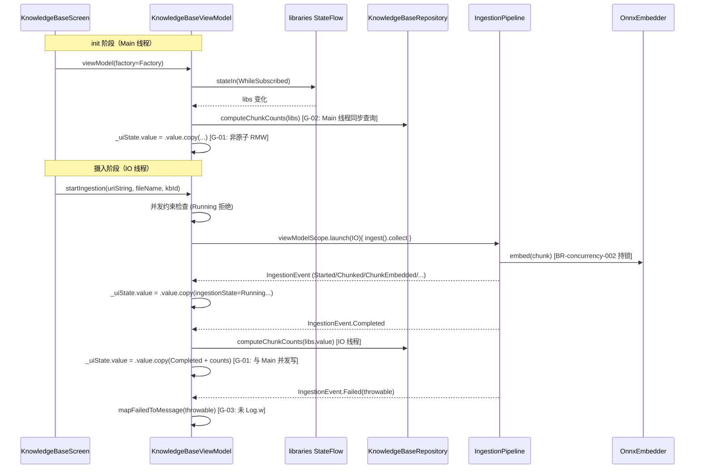

# 代码安全与质量审计报告：US-018 实现知识库管理 UI

> 依 CLAUDE.md 第十节（guardrail-enforcer 强制）+ 7.2 闭环规则。
> 主 Agent 完成编码与第九节变更影响自检后提交审查。本报告为第一轮（首轮）审计。

| 项目 | 内容 |
| --- | --- |
| 执行 Agent | guardrail-enforcer |
| 任务令牌 | TKN-US018-GUARDRAIL-001 |
| 审计日期 | 2026-08-07 |
| 审计轮次 | 第一轮 |
| 审查 Skill | TRAE-code-review（代码质量审查）+ TRAE-security-review（安全漏洞扫描） |
| 关联 ADR | [ADR-011](../../docs/decisions/ADR-011-m3-knowledgebase-ui.md)（Proposed，7 项决策 + 9 项风险） |
| 关联考古 | [2026-08-07-us018-kb-ui-archaeology.md](2026-08-07-us018-kb-ui-archaeology.md)（12 项风险清单 R-1~R-12） |
| 关联规则 | BR-error-handling-003 / BR-error-handling-004 / BR-error-handling-006 / BR-concurrency-002 / BR-security-003 / BR-testing-001 |
| 风险等级 | P2 跨模块（PrismApplication 暴露 5 个新依赖、新建 ViewModel、改造既有 Screen） |
| 项目根 | d:\s0611\code\Prism |

---

## 1. 总体结论

**有条件通过（Conditional Pass）**

- **无阻断级安全漏洞**：未发现 SQL/NoSQL 注入、OS 命令注入、代码注入、硬编码密钥、路径遍历、不安全反序列化等阻断级安全问题。所有数据库交互均为 ObjectBox 编译期属性引用（参数化），SAF URI 经 `contentResolver.openInputStream` 标准安全路径打开，无注入面。
- **无高危安全缺陷**：`mapFailedToMessage` 正确隐藏 `throwable.message`/堆栈（符合 BR-error-handling-003）；`createLibrary` 拒绝 `/` 与控制字符（含 CRLF，符合 BR-security-003 精神）；`deleteLibrary` 默认库/负数/不存在三重校验；`startIngestion` 并发约束 + `knowledgeBaseId` 校验完备。
- **但存在 4 项须修复的中危发现 + 1 项强建议修复中危 + 3 项低危建议**：
  - **G-01（中危）**：`_uiState.value = _uiState.value.copy(...)` 非原子 read-modify-write，init 的 Main 协程与 startIngestion 的 IO 协程并发写可导致 lost update（库列表/chunkCounts 短暂回退）。
  - **G-02（中危）**：`refreshChunkCounts` 实际运行在 Main 线程（`viewModelScope.launch` 默认 Main），与类 KDoc「在 Dispatchers.IO 中执行」承诺矛盾；`computeChunkCounts` 的 ObjectBox 同步查询阻塞主线程。
  - **G-03（中危）**：`IngestionEvent.Failed` 的 throwable 仅映射文案后丢弃，**未按 ADR-011 5.5 要求记录 `Log.w` 结构化日志**，违反 BR-error-handling-004（静默吞异常）。
  - **G-04（中危）**：`catch (_: Exception) { null }` 对 `inputStreamProvider` 静默吞所有异常（SecurityException/FileNotFoundException/IOException 全部归一化为 null），违反 BR-error-handling-004。
  - **G-05（中危，强建议）**：`createLibrary` 无任何 try-catch；`deleteLibrary` 仅 catch `IllegalArgumentException`。ObjectBox 运行期异常（DbException/磁盘满）会逃逸为未捕获异常导致应用崩溃。与 deleteLibrary 既有 catch 形成「一半有一半无」的不一致。
  - G-06~G-08 为低危建议（测试调度器、文件名 fallback、Factory KDoc 措辞），不阻断。

**结论**：存在 4 项须修复中危（含 2 项 BR-error-handling-004 active 规则违反 + 1 项 ADR-011 5.5 显式契约违反 + 1 项并发正确性缺陷），**不可直接进入 ac-verifier**。主 Agent 须修复 G-01~G-04（G-05 强烈建议一并修复）后，按 CLAUDE.md 7.2 重新提交 guardrail-enforcer 第二轮审查。

> 零信任说明：本报告对主 Agent 自问的 5 项盲区逐条验证——其中「Completed 状态原子性修复」经核验**有效**（单次 copy 合并三个字段）；「launcher 回调读取 importTargetKbId」经核验**正确**（Compose State 委托读取最新值，非快照）；其余 3 项盲区（线程安全/KDoc 契约/测试漂移）在 G-01/G-02/G-06 中落实为发现项。

---

## 2. 审查范围摘要

| 维度 | 数量 |
| --- | --- |
| 审查文件数 | 4（3 生产代码 + 1 测试代码）+ 6 契约文件交叉验证（KnowledgeBaseRepository / IngestionPipeline / IngestionEvent / IngestionResult / Embedder / OnnxEmbedder / DocumentType）+ 3 文档（ADR-011 / 考古报告 / behavioral-rules） |
| 审查函数数 | KnowledgeBaseViewModel（startIngestion / createLibrary / deleteLibrary / computeChunkCounts / refreshChunkCounts / extractDocumentTitle / mapFailedToMessage / Factory）+ KnowledgeBaseScreen（8 Composable）+ PrismApplication（5 lazy 字段） |
| 审查测试用例数 | 32（实际为 32，非任务说明的 29；以源码 `@Test` 计数为准） |
| 阻断级问题 | 0 |
| 高危问题 | 0 |
| 中危问题 | 5（G-01~G-05） |
| 低危/建议 | 3（G-06~G-08） |

### 变更文件清单

| 文件 | 类型 | 说明 |
| --- | --- | --- |
| `app/src/main/java/io/prism/PrismApplication.kt` | 修改 | 新增 5 个 `by lazy` 字段（knowledgeBaseRepository / documentParserRegistry / chunker / embedder / ingestionPipeline）+ 2 常量（DEFAULT_CHUNK_SIZE=512 / DEFAULT_CHUNK_OVERLAP=64） |
| `app/src/main/java/io/prism/ui/knowledge/KnowledgeBaseViewModel.kt` | 新建 | UiState 模式 + IngestionEvent 收集 + 安全错误映射 + Factory 注入 |
| `app/src/main/java/io/prism/ui/knowledge/KnowledgeBaseScreen.kt` | 改造 | 删除 Mock 数据类与硬编码列表，接入 ViewModel + StateFlow + SAF OpenDocument |
| `app/src/test/java/io/prism/ui/knowledge/KnowledgeBaseViewModelTest.kt` | 新建 | 32 单元测试（AC-1~AC-4 + 并发约束 + chunkCounts 刷新 + 标题提取 + 错误安全） |

---

## 3. 代码质量审查（TRAE-code-review）

### 3.1 作者意图推断

> **Intent**: 实现 US-018 知识库管理 UI：(1) 在 PrismApplication 暴露 5 个数据层依赖（`by lazy` 注入）；(2) 新建 KnowledgeBaseViewModel 采用 UiState 单一聚合 + IngestionEvent 收集映射 + 安全错误文案；(3) 改造既有 KnowledgeBaseScreen 从 Mock 原型为真实数据驱动（SAF OpenDocument 选文件 → 摄入进度展示 → 完成/失败提示）。核心修复点是 Completed 事件的状态原子性（拆分 `computeChunkCounts` 纯函数 + 单次 `copy` 合并 ingestionState/defaultKbChunkCount/chunkCounts）。

### 3.2 变更技术流图



### 3.3 问题扫描结果

经逐行审查 + 契约交叉验证 + 边界穷举，发现 5 项中危 + 3 项低危建议。详见第 6 节。

### 3.4 Karpathy Guidelines 逐项对照

| 原则 | 评估 | 证据 |
| --- | --- | --- |
| **命名** | 通过 | `computeChunkCounts` / `refreshChunkCounts` / `extractDocumentTitle` / `mapFailedToMessage` / `IngestionUiState` 语义清晰，无歧义缩写 |
| **设计** | 基本通过 | UiState 单一聚合 + sealed interface 状态机，与 SettingsViewModel/CapabilitiesViewModel 一致；`inputStreamProvider` 函数式注入解耦 Android 框架类，便于 JVM 单测。**瑕疵**：G-01 非原子 RMW 破坏状态一致性 |
| **错误处理** | 部分通过 | `mapFailedToMessage` 安全映射正确（BR-error-handling-003）；CancellationException 正确重新抛出（协程铁律）；并发约束 + id 校验完备。**瑕疵**：G-03/G-04 违反 BR-error-handling-004（静默吞异常无日志）；G-05 持久化异常逃逸风险 |
| **Simplicity First** | 通过 | ViewModel 职责内聚，Factory 复用既有注入模式；`computeChunkCounts` 拆为纯函数是合理重构（非过度设计） |
| **Surgical Changes** | 通过 | PrismApplication 纯追加 5 lazy 字段 + 2 常量，无既有字段修改；KnowledgeBaseScreen 删 Mock 接真实数据，4 Tab 导航不变；无接口/契约变更 |

### 3.5 跨模块影响评估

| 依赖方 | 使用方式 | 影响 |
| --- | --- | --- |
| PrismApplication | 新增 5 个 `by lazy` 字段 | 无破坏性——`by lazy` 首次访问才初始化；embedder 加载 ~200ms 仅在首次进入知识库 Tab 触发，其他 Tab 不受影响 |
| KnowledgeBaseRepository | 调用 `knowledgeBases` / `save` / `remove` / `findByName` / `get` / `chunkCount` | 无接口变更——US-018 仅消费既有方法 |
| IngestionPipeline | 调用 `ingest(fileName, input, kbId, title)` | 无接口变更——`documentTitle` 显式传入（与默认参数一致） |
| Embedder | 经 IngestionPipeline 间接使用 | 无直接影响——BR-concurrency-002 由 OnnxEmbedder 内部锁保证 |

**结论**：纯新增/改造，无破坏性变更，跨模块影响识别正确（主 Agent 影响自检「无接口/契约/依赖变更」结论成立）。

---

## 4. 安全漏洞扫描（TRAE-security-review）

### 4.1 漏洞面审计

| 类别 | 扫描结果 | 证据 |
| --- | --- | --- |
| **SQL/NoSQL 注入** | 安全 | ObjectBox 使用编译期属性引用 `KnowledgeChunk_.knowledgeBaseId`（见 KnowledgeBaseRepository.chunkCount/remove），强类型参数化，非字符串拼接。ViewModel 不直接构造查询。 |
| **OS 命令注入** | 不涉及 | 无 `system()`/`exec()`/`Runtime.exec()` 调用 |
| **代码/表达式注入** | 不涉及 | 无 `eval()`/`Function()`/`ScriptEngine` |
| **路径遍历** | 安全 | SAF 返回 `content://` URI（非文件系统路径）；`contentResolver.openInputStream(uri)` 走 SAF 授权，无路径拼接；`extractDocumentTitle` 仅做字符串裁剪不构造路径 |
| **模板引擎注入** | 不涉及 | Compose Text 自动转义，无 `dangerouslySetInnerHTML` 等逃逸口 |
| **AuthN/AuthZ** | 安全 | 单用户本地应用；`kbId` 校验（>=0，!=0 for delete）是本地 DB 访问控制，无 IDOR 面 |
| **密钥/密码泄露** | 安全 | 全文件扫描无 key/password/token/apiKey 硬编码；`EmbedderFactory.DEFAULT_MODEL_PATH` 是 asset 路径非密钥 |
| **敏感数据暴露** | 安全 | `mapFailedToMessage` 不暴露 `throwable.message`/堆栈（BR-error-handling-003 符合）；日志无密钥输出 |
| **不安全反序列化** | 不涉及 | 无 Java 反序列化；OnnxEmbedder 经 onnxruntime 库加载模型（非 Java ObjectInputStream） |
| **XXE** | 不涉及 | 无 XML 解析 |

### 4.2 Source-to-Sink 追踪

| 数据流 | Source | Sink | 校验 | 结论 |
| --- | --- | --- | --- | --- |
| `uriString` (SAF URI) | `openDocumentLauncher` 回调 `uri.toString()` | `contentResolver.openInputStream(Uri.parse(uriString))` | SAF 授权的 `content://` URI；`Uri.parse` 不抛异常；`openInputStream` 失败被 `catch(_:Exception){null}` 降级（G-04：无日志） | 安全——无注入路径；URI 为用户自选文件，非攻击者可控 |
| `fileName` (DocumentFile.name) | `DocumentFile.fromSingleUri(context, uri)?.name` | `pipeline.ingest` → chunk title `${documentTitle}#${index+1}` → ObjectBox 存储 → UI Text 展示 | `extractDocumentTitle` 裁剪路径分隔符与扩展名；Compose Text 自动转义；ObjectBox 参数化存储 | 安全——用户自有文件名，无注入 sink |
| `knowledgeBaseId` (UI 选择) | `importTargetKbId` state | `pipeline.ingest(..., kbId)` → `repository.addChunk` → `chunkBox.put` | `if (kbId < 0) Failed`；pipeline 内 `require(kbId >= 0)` 二次防御 | 安全——Long 类型参数化 |
| 库名 `name` (用户输入) | `PrismField` 输入 | `repository.save(KnowledgeBase(name))` → ObjectBox → UI Text | `trim` + 空校验 + `/` 与控制字符拒绝（`isISOControl` 含 CRLF）+ `findByName` 唯一性 | 安全——控制字符拒绝符合 BR-security-003 精神；ObjectBox 参数化存储无注入 |

**扫描结论**：✅ 无可利用安全问题。所有外部输入均经校验，所有数据库交互参数化，无注入路径。安全面通过。

> 注：G-03/G-04 为可观测性/错误处理缺陷（违反 BR-error-handling-004），非可利用安全漏洞，但在代码质量维度须修复。

---

## 5. 六阶段审计框架

### Stage 1: 输入与边界审计（Range Checking）

#### 1.1 数值与类型边界

| 输入参数 | 类型 | 合法范围 | 校验方式 | 结论 |
| --- | --- | --- | --- | --- |
| `knowledgeBaseId` (startIngestion) | Long | >= 0 | `if (kbId < 0) Failed("无效的知识库 id")` (L297) + pipeline `require(kbId>=0)` 二次 | 通过——前置友好错误 + 下游 fail-fast |
| `id` (deleteLibrary) | Long | > 0（禁 0 默认库、禁负数） | `when { id<0 / id==DEFAULT_KB_ID / get(id)==null }` (L244-253) | 通过——三态校验完备 |
| `name` (createLibrary) | String | 非空（trim 后）/ 不含 `/` 与控制字符 / 不重名 | `trim().isEmpty()` + `any{it=='/'\|\|it.isISOControl()}` + `findByName` (L210-220) | 通过——校验完整，CRLF 被 `isISOControl` 拒绝 |
| `progress` (UI) | Int | [0, 100] | `if (total>0) embedded*100/total else 0` + `PrismIndexBar` 内 `coerceIn(0,100)` | 通过——Int 除法无溢出（embedded<=total，total 小） |

**算术溢出检查**：`embedded * 100 / total` 中 embedded ≤ total，total 为 chunk 数（百级），embedded*100 无 Int 溢出。✓

#### 1.2 集合与缓冲区边界

| 操作 | 安全措施 | 结论 |
| --- | --- | --- |
| `chunkCounts[kb.id]` 查找 | `state.chunkCounts[kb.id] ?: 0L` (Screen L152) Elvis 降级 | 通过——键缺失安全降级 |
| `targetOptions.forEach` (ImportSheet) | `buildList` 构造有限列表，无索引越界 | 通过 |
| `extractDocumentTitle` `substring` | `lastIndexOfAny` 返回 -1 时 `lastSep >= 0` 守卫；`dot > 0` 守卫 | 通过——边界检查完备，与 IngestionPipeline.defaultTitle 逐字一致 |

#### 1.3 业务状态机约束

| 状态 | 规则 | 校验 | 结论 |
| --- | --- | --- | --- |
| IngestionUiState 四态 | Idle→Running→Completed/Failed | `if (ingestionState is Running) return` 并发约束 (L293) | 通过——单任务约束防 OnnxEmbedder 锁竞争 |
| 默认库不可删 | id==0L 拒绝 | VM `when` + Repository `require` 双层 | 通过——纵深防御 |
| Completed 原子性 | ingestionState + chunkCounts 同次 copy | `computeChunkCounts` 纯函数 + 单次 `_uiState.value.copy(...)` (L384-394) | **修复有效**——主 Agent 盲区 1 经核验，Completed 与 chunkCounts 在同一次 copy 中刷新，无中间状态。但该 copy 本身非原子（G-01） |

> **主 Agent 盲区 1 验证结论**：Completed 状态原子性修复**逻辑正确**——`computeChunkCounts` 拆分纯函数后，Completed 分支在同一次 `.copy()` 中合并三个字段，解决了「Completed 已发出但 chunkCounts 旧值」的中间状态。剩余风险是 `.copy()` 基读取的非原子性（G-01），属并发维度而非状态机维度。

### Stage 2: 执行安全审计（指令与数据隔离）

#### 2.1 注入防护

| 防护项 | 评估 | 证据 |
| --- | --- | --- |
| SQL/NoSQL 注入 | 安全 | ObjectBox 全程编译期属性引用，无字符串拼接 |
| OS 命令注入 | 不涉及 | 无 shell 调用 |
| 代码/表达式注入 | 不涉及 | 无 eval/Function |
| 模板引擎注入 | 不涉及 | Compose 自动转义 |
| URI 注入 | 安全 | `contentResolver.openInputStream(Uri.parse(uriString))`——SAF `content://` URI 经系统授权，非攻击者可控；`Uri.parse` 对畸形输入不抛异常，`openInputStream` 失败降级为 Failed |

#### 2.2 最小权限检查

- 无 root 权限操作 ✓
- SAF OpenDocument 无需 `READ_EXTERNAL_STORAGE`（经 ContentResolver 走 SAF 授权，考古 R-9）✓
- 无不必要的文件系统/网络访问 ✓

#### 2.3 输出编码与特殊字符处理

- 库名 / 文档标题经 Compose `Text` 渲染（自动转义）✓
- JSON 序列化：无手工 JSON 拼接 ✓
- 错误文案为硬编码中文字符串，无用户输入插值 ✓

### Stage 3: 内存安全与运行时保护

| 检查项 | 评估 | 证据 |
| --- | --- | --- |
| 语言内存安全 | 通过 | Kotlin/JVM 内存安全，无手动内存管理 |
| InputStream 生命周期 | 通过 | `inputStreamProvider` 返回的 InputStream 由 `IngestionPipeline.ingest` 内 `input.use {}` 关闭（ADR-009 5.7，US-016 已验证）；openInputStream 返回 null 时安全降级不泄漏 |
| OnnxEmbedder 持锁 | 通过 | embed 全程持锁串行化（BR-concurrency-002，US-014 R2 已验证）；ViewModel 在 `Dispatchers.IO` collect 不阻塞主线程（R-4 缓解） |
| 无 unsafe/FFI | 通过 | 无 Rust unsafe / JNI 手动调用 |

### Stage 4: 配置与密钥安全

| 检查项 | 评估 | 证据 |
| --- | --- | --- |
| 硬编码密钥 | 安全 | 全文件扫描无 key/password/token/apiKey；`DEFAULT_MODEL_PATH`/`DEFAULT_VOCAB_PATH` 为 asset 路径 |
| 内部 IP/域名 | 安全 | 无 |
| 环境变量 | 不涉及 | ViewModel/Application 未读取环境变量 |
| .gitignore | 不涉及 | 本次变更不新增配置文件 |

### Stage 5: 依赖与供应链风险

| 检查项 | 评估 |
| --- | --- |
| 依赖变更 | 无——本次纯代码新增/改造，不涉及 `gradle/libs.versions.toml` 或 `build.gradle.kts` 修改 |
| 新引入依赖 | 无——`androidx.documentfile` 已在 US-009 引入（考古报告 §6.5 确认） |
| 已知漏洞 | 不涉及（无依赖变更） |

### Stage 6: 综合审计报告

见第 1 节总体结论 + 第 6 节详细发现。

---

## 6. 详细发现（按严重度分级）

### 阻断级（Blocking）

**无。**

### 高危（High-risk）

**无。**

### 中危（Medium-risk）

#### G-01: `_uiState.value = _uiState.value.copy(...)` 非原子 read-modify-write，并发写导致 lost update

- **严重度**：中危
- **位置**：[KnowledgeBaseViewModel.kt](../../app/src/main/java/io/prism/ui/knowledge/KnowledgeBaseViewModel.kt)（多处：init L149-158、refreshChunkCounts L189-195、startIngestion Started/Chunked/ChunkEmbedded/ChunkSkipped/Completed/Failed 各分支、clearXxxError）
- **描述**：`MutableStateFlow.value` 的 setter 是原子的，但 `_uiState.value = _uiState.value.copy(...)` 是「读 → 改 → 写」三步非原子序列。本类存在两个并发写者：
  - **Main 协程**：`init { viewModelScope.launch { libraries.collect { refreshChunkCounts(libs); _uiState.value = ...copy(...) } } }`（viewModelScope 默认 `Dispatchers.Main.immediate`）
  - **IO 协程**：`startIngestion` 的 `viewModelScope.launch(Dispatchers.IO) { ... _uiState.value = ...copy(...) }`
  
  当用户在摄入进行中创建/删除库（触发 Main 协程刷新 chunkCounts）恰好与 IO 协程的 Completed 事件（刷新 ingestionState + chunkCounts）并发时，二者各自读取**可能已过期的** `_uiState.value`，后写者覆盖先写者，导致：
  - 库列表短暂回退（Completed 分支的 `.copy()` 基 `_uiState.value` 可能不含新创建的库，直到下一次 libraries 发射才修正）
  - chunkCounts 短暂回退到旧值
  
- **风险**：中——UI 短暂不一致（自愈，下一帧 collect 修正），非崩溃/数据丢失，但破坏状态一致性承诺，且测试用 `Dispatchers.Unconfined` 难以复现（时序依赖）。
- **BR 规则**：关联 BR-concurrency-001 精神（多步骤状态变更须原子）。
- **建议**：所有 `_uiState` 变更改用原子 CAS 语义的 `update`：

  ```kotlin
  _uiState.update { current -> current.copy(ingestionState = ..., chunkCounts = ...) }
  ```

  `MutableStateFlow.update {}` 内部为 CAS 自旋循环，保证 read-modify-write 原子性。

#### G-02: `refreshChunkCounts` 实际运行在 Main 线程，与类 KDoc「在 Dispatchers.IO 中执行」承诺矛盾

- **严重度**：中危
- **位置**：[KnowledgeBaseViewModel.kt:39-41](../../app/src/main/java/io/prism/ui/knowledge/KnowledgeBaseViewModel.kt)（类 KDoc）vs [KnowledgeBaseViewModel.kt:147-158](../../app/src/main/java/io/prism/ui/knowledge/KnowledgeBaseViewModel.kt)（init 块）+ [KnowledgeBaseViewModel.kt:189-195](../../app/src/main/java/io/prism/ui/knowledge/KnowledgeBaseViewModel.kt)（refreshChunkCounts）
- **描述**：类 KDoc 声称：
  > `refreshChunkCounts` 在 `Dispatchers.IO` 中执行 ObjectBox 同步查询，避免阻塞主线程
  
  但 `init { viewModelScope.launch { libraries.collect { refreshChunkCounts(libs) } } }` 中 `viewModelScope.launch` **未指定调度器**，默认使用 `Dispatchers.Main.immediate`。因此 `refreshChunkCounts` → `computeChunkCounts` → `repository.chunkCount`（ObjectBox `query().count()` 同步阻塞调用）实际在**主线程**执行。
  
  同时 `computeChunkCounts` 的 KDoc 反而承认 Main 线程阻塞（「4GB 低端机限制库容量，库数量少时 Main 线程阻塞可接受」），与类 KDoc 的 IO 承诺**互相矛盾**。
  
- **风险**：中——库数量增长时（虽 ADR-007 限制 4GB 低端机容量），每次库列表变化在主线程做 N+1 次同步 DB 查询，可能引发卡顿；更严重的是类 KDoc 的线程安全承诺**虚假**，下游读者会误以为已隔离主线程。
- **建议**：二选一（推荐前者）：
  1. 在 init 的 collect 内用 `withContext(Dispatchers.IO) { refreshChunkCounts(libs) }` 切到 IO 线程，兑现类 KDoc 承诺；
  2. 修正类 KDoc 为「refreshChunkCounts 在 Main 线程执行 ObjectBox 同步查询，库数量少时可接受」，与 `computeChunkCounts` KDoc 对齐。

#### G-03: `IngestionEvent.Failed` 的 throwable 未记录结构化日志（违反 ADR-011 5.5 + BR-error-handling-004）

- **严重度**：中危
- **位置**：[KnowledgeBaseViewModel.kt:396-404](../../app/src/main/java/io/prism/ui/knowledge/KnowledgeBaseViewModel.kt)（Failed 分支）
- **描述**：ADR-011 5.5 显式约定：
  > `throwable` 仅在 ViewModel 内部用 `Log.w` 记录结构化日志（不含密钥/路径），不写入 UI 状态
  
  但实际代码仅调用 `mapFailedToMessage(event.throwable)` 映射为通用文案后，`event.throwable` 被**丢弃**——既无 `Log.w` 也无任何日志记录。生产环境摄入失败时，真实异常（类型、堆栈）完全丢失，无法定位根因。
  
  违反 BR-error-handling-004（「catch 兜底异常须输出结构日志并保留可诊断类别，禁止静默吞异常」）——虽 `Failed` 非显式 catch，但 throwable 经管线 catch 传递到 ViewModel 后被静默丢弃，精神等同。
  
- **风险**：中——非安全漏洞，但严重损害可观测性与可诊断性；与 ADR 显式契约冲突。
- **BR 规则**：**违反 BR-error-handling-004**（active）+ ADR-011 5.5 契约违反。
- **建议**：在映射前记录结构化日志（异常类型 + message，不含密钥/路径/完整堆栈给用户）：

  ```kotlin
  is IngestionEvent.Failed -> {
      Log.w(TAG, "ingestion failed: ${event.throwable.javaClass.simpleName}", event.throwable)
      _uiState.value = _uiState.value.copy(ingestionState = IngestionUiState.Failed(...))
  }
  ```

#### G-04: `catch (_: Exception) { null }` 静默吞 `inputStreamProvider` 所有异常（违反 BR-error-handling-004）

- **严重度**：中危
- **位置**：[KnowledgeBaseViewModel.kt:307-315](../../app/src/main/java/io/prism/ui/knowledge/KnowledgeBaseViewModel.kt)
- **描述**：

  ```kotlin
  val input = try {
      inputStreamProvider(uriString)
  } catch (e: CancellationException) {
      throw e
  } catch (_: Exception) {
      null
  }
  ```

  `catch (_: Exception) { null }` 用 `_` 丢弃异常对象，将 `SecurityException`（权限撤销）、`FileNotFoundException`（文件已删）、`IOException`（IO 错误）等全部归一化为 `null` →「无法打开所选文件，请重新选择」，**无任何日志**。无法区分「权限问题」与「文件不存在」与「IO 错误」，生产定位困难。
  
  `CancellationException` 单独 catch 并重新抛出是正确的（协程铁律），但通用 `Exception` 分支违反 BR-error-handling-004（静默吞异常、无结构日志、无归一化注释）。
  
- **风险**：中——非安全漏洞，但违反 active BR 规则，损害可诊断性。
- **BR 规则**：**违反 BR-error-handling-004**（active）。
- **建议**：记录异常类型后再降级：

  ```kotlin
  } catch (e: Exception) {
      Log.w(TAG, "openInputStream failed: ${e.javaClass.simpleName}", e)
      null
  }
  ```

  或若项目暂无结构化日志基建，至少保留注释说明异常被归一化（BR-error-handling-004 允许的降级路径）。

#### G-05: `createLibrary` 无 try-catch / `deleteLibrary` 仅 catch `IllegalArgumentException`，持久化运行期异常逃逸致崩溃

- **严重度**：中危（强建议修复）
- **位置**：[KnowledgeBaseViewModel.kt:221-224](../../app/src/main/java/io/prism/ui/knowledge/KnowledgeBaseViewModel.kt)（createLibrary 的 `repository.save`）+ [KnowledgeBaseViewModel.kt:254-261](../../app/src/main/java/io/prism/ui/knowledge/KnowledgeBaseViewModel.kt)（deleteLibrary 的 `try { repository.remove } catch(IllegalArgumentException)`）
- **描述**：
  - `createLibrary` 成功分支直接 `repository.save(...)` + `_uiState.value = ...copy(createLibraryError = null)`，**无任何 try-catch**。`repository.save` 内部 `box.put(config)` + `refreshFlows()`，ObjectBox 在磁盘满/DB 损坏时抛 `DbException`（非 `IllegalArgumentException`），会逃逸为未捕获异常，因 `createLibrary` 由 UI onClick 同步调用（非协程），**直接崩溃应用**。
  - `deleteLibrary` 虽有 `try { repository.remove(id) } catch (e: IllegalArgumentException)`，但 catch 范围过窄：`repository.remove` 内 `runInTx { chunkBox.query().equal().build().use{findIds()}; chunkBox.remove(*ids); box.remove(id) }`，任一步抛非 `IllegalArgumentException`（如 ObjectBox `DbException`、HNSW 相关 `IllegalStateException`——虽 BR-concurrency-003 已用 findIds+Box.remove 规避 #1209，但其他运行期异常仍可能）均逃逸崩溃。
  - 一致性问题：`deleteLibrary` 有（窄）catch，`createLibrary` 无 catch，模式不统一。
  
- **风险**：中——正常运行概率低（磁盘满/DB 损坏罕见），但一旦发生即应用崩溃（用户无降级提示）。与项目既有 ViewModel 模式（SettingsViewModel 等 CRUD 也未包裹）一致，但 deleteLibrary 已开先例用了 catch，应统一并补全。
- **BR 规则**：关联 BR-error-handling-004（兜底异常须处理不崩溃）+ BR-error-handling-006 精神（资源/状态异常安全）。
- **建议**：为 createLibrary 与 deleteLibrary 的 repository 调用统一加 try-catch，捕获 `IllegalArgumentException`（编程错误，映射友好错误）+ 更宽的运行期异常（映射通用错误 + 日志），保留 CancellationException 语义（虽此处非协程，仍建议显式）：

  ```kotlin
  else -> {
      try {
          repository.save(KnowledgeBase(name = trimmed))
          _uiState.update { it.copy(createLibraryError = null) }
      } catch (e: Exception) {
          Log.w(TAG, "createLibrary failed", e)
          _uiState.update { it.copy(createLibraryError = "创建知识库失败，请重试") }
      }
  }
  ```

### 低危/建议（Low-risk / Recommendation）

#### G-06: 测试用 `Dispatchers.setMain(Dispatchers.Unconfined)` 而非 `UnconfinedTestDispatcher` + `runTest`，可能掩盖时序敏感缺陷

- **严重度**：低危/建议
- **位置**：[KnowledgeBaseViewModelTest.kt:67](../../app/src/test/java/io/prism/ui/knowledge/KnowledgeBaseViewModelTest.kt)
- **描述**：`Dispatchers.setMain(Dispatchers.Unconfined)` 使 init 的 `viewModelScope.launch { collect }` 在调用线程同步执行。对比 `UnconfinedTestDispatcher(testScheduler)` + `runTest`：
  - `Unconfined`（非 Test 调度器）无虚拟时间，startIngestion 的 IO 协程跑在真实 IO 线程，靠 `waitForState` 30s 轮询。
  - G-01 的并发 lost update 在 `Unconfined` 单线程化时序下几乎不可能复现，测试通过但生产可能出问题。
  - BR-testing-001 要求测试替身复现原组件语义；`Unconfined` vs 生产的 `Main.immediate` 存在微妙调度差异（如 init 是否同步完成）。
  
- **风险**：低——当前 32 测试均通过，但 G-01 类时序缺陷难捕获。
- **BR 规则**：关联 BR-testing-001 精神（测试复现生产语义）。
- **建议**：评估迁移到 `runTest` + `val testDispatcher = UnconfinedTestDispatcher()` + `Dispatchers.setMain(testDispatcher)`，用虚拟时间控制 IO 协程推进，使 G-01 类竞态可确定性测试。若维持现状，应在测试类 KDoc 注明「`Unconfined` 选择使 init 同步执行，不验证 Main/IO 跨线程竞态」。

#### G-07: `DocumentFile.fromSingleUri` 名称为 null 时 fallback `\"document\"` 无扩展名，导致合法文件被误报「格式不支持」

- **严重度**：低危/建议
- **位置**：[KnowledgeBaseScreen.kt:113](../../app/src/main/java/io/prism/ui/knowledge/KnowledgeBaseScreen.kt)
- **描述**：`DocumentFile.fromSingleUri(context, uri)?.name ?: "document"`——当某些 SAF provider 不返回文件名（罕见但存在）时，fallback `"document"` 无扩展名，`parserFor("document")` 找不到匹配扩展名 → `DocumentParseException` → UI 提示「文档格式不支持或已损坏」。用户明明选了合法文件却得到误导性错误。
- **风险**：低——边缘场景，用户体验问题非安全/正确性。
- **建议**：fallback 时尝试从 URI 的 MIME 类型或路径推断扩展名（如 `contentResolver.getType(uri)` → 扩展名映射），或 fallback 为 `"imported.txt"`（若 MIME 为 text 类）。

#### G-08: 类 KDoc 称「ViewModel 不依赖 Android 框架类」但 companion Factory 引用 `android.net.Uri`

- **严重度**：低危/建议（文档精确性）
- **位置**：[KnowledgeBaseViewModel.kt:55-57](../../app/src/main/java/io/prism/ui/knowledge/KnowledgeBaseViewModel.kt)（inputStreamProvider 参数 KDoc）vs [KnowledgeBaseViewModel.kt:457-466](../../app/src/main/java/io/prism/ui/knowledge/KnowledgeBaseViewModel.kt)（Factory）
- **描述**：类 KDoc 称「Factory 内部将 android.net.Uri 转为 String 传入，ViewModel 不依赖 Android 框架类」。实际：ViewModel 实例（类体）确实不依赖 `android.net.Uri`（接受 `String` + 函数式 `inputStreamProvider`），但 `companion object` 的 `Factory` 直接引用 `android.net.Uri.parse(uriString)` 与 `app.contentResolver`。Factory 属同一文件/类的 companion，措辞「ViewModel 不依赖」略绝对。设计意图（VM 类体可纯 JVM 单测）已达成，仅 KDoc 表述可更精确。
- **风险**：低——纯文档精确性，不影响测试性或正确性。
- **建议**：KDoc 措辞改为「ViewModel 类体（实例方法）不依赖 Android 框架类，便于纯 JVM 单测；生产注入的 companion Factory 负责将 android.net.Uri 转 String 并提供 ContentResolver-backed InputStream」。

---

## 7. 行为规则符合性检查

| 规则 ID | 规则内容 | 符合性 | 证据 |
| --- | --- | --- | --- |
| BR-error-handling-003 | UI 不暴露异常内部信息 | **符合** | `mapFailedToMessage` 按类型映射通用文案，不读 `throwable.message`/堆栈；测试 `startIngestion failed message does not leak throwable details` 验证不含 RuntimeException/Exception/java. |
| BR-error-handling-004 | catch 须输出结构日志，禁止静默吞 | **违反（G-03/G-04）** | G-03：`IngestionEvent.Failed` throwable 丢弃无日志；G-04：`catch(_:Exception){null}` 静默吞。`catch(_:IllegalArgumentException)`（L410）虽有注释说明归一化，边界合规但 G-03/G-04 须修 |
| BR-error-handling-006 | 参数校验须在资源保护块内或之前先释放资源 | **符合（不适用）** | `startIngestion` 的 `kbId < 0` 校验在 `inputStreamProvider` 调用**之前**（L297 在 L307 前），校验失败时 InputStream 尚未打开，无资源泄漏。InputStream 由 pipeline 内 `input.use{}` 关闭（US-016 已验证） |
| BR-concurrency-002 | OnnxEmbedder 持锁资源并发访问须覆盖 close 路径 | **符合（间接）** | ViewModel 不直接调用 Embedder；startIngestion 在 `Dispatchers.IO` collect，OnnxEmbedder.embed 全程持锁串行化（US-014 R2 已验证）。并发约束 `if(Running) return` 防多任务锁竞争 |
| BR-security-003 | 用户可配置 header/URL 须拒绝 CRLF | **符合（精神）** | 库名经 `isISOControl()` 拒绝控制字符（含 \r \n \u0000）；库名非 HTTP header/URL，BR-security-003 严格场景不适用，但控制字符拒绝是良好纵深防御 |
| BR-testing-001 | 测试替身须复现原组件语义 | **基本符合** | 真实 KnowledgeBaseRepository + 真实 IngestionPipeline + FakeEmbedder 复现生产语义；CountingInputStreamProvider 跟踪调用次数验证并发拒绝。**瑕疵**：G-06 `Unconfined` 调度器选择可能掩盖跨线程竞态 |

---

## 8. 测试覆盖评估

### 8.1 AC 覆盖矩阵

| AC | 描述 | 覆盖用例 | 结论 |
| --- | --- | --- | --- |
| AC-1 | 知识库列表页显示分库 | `init loads empty libraries` / `init reflects pre-existing libraries` / `chunkCounts updated after ingestion to default/custom kb` | 通过 |
| AC-2 | 支持创建/删除分库 | `createLibrary valid/empty/blank/slash/control char/duplicate/trims` + `clearCreateLibraryError` + `deleteLibrary valid/default/negative/nonexistent` + `clearDeleteLibraryError` + `deleteLibrary cascades chunks` | 通过（11 用例，校验完备） |
| AC-3 | 支持导入文档（解析→摄入进度展示） | `startIngestion success transitions Running then Completed` / `transitions through Running` / `to custom kb persists chunks` | 通过 |
| AC-4 | 摄入失败与未建索引提示 | `parse failure transitions to Failed with safe message` / `null input stream transitions to Failed` / `negative kbId transitions to Failed` / `partial embedding failure completes with skipped` / `Running shows skipped` / `all chunks fail still completes` / `failed message does not leak throwable` | 通过（7 用例，降级/致命/泄漏全覆盖） |
| AC-5 | Typecheck passes | 上游产出物确认 | 通过（待 ac-verifier 复验） |

> 实际测试数：**32**（非任务说明的 29；以源码 `@Test` 计数为准）。

### 8.2 测试缺口

| 缺口 | 关联发现 | 建议 |
| --- | --- | --- |
| 并发 lost update（G-01）无测试 | G-01 | 引入 `runTest` + `UnconfinedTestDispatcher` 后补 Main/IO 并发写测试（G-06） |
| createLibrary/deleteLibrary 持久化异常路径无测试 | G-05 | 注入会抛 `DbException` 的 Fake Repository，验证错误映射不崩溃 |
| `catch(_:Exception){null}` 各异常类型无测试 | G-04 | 注入抛 SecurityException/FileNotFoundException 的 provider，验证日志与降级 |
| Completed 状态原子性正例测试（验证 chunkCounts 与 Completed 同帧） | 盲区 1 | 已有 `chunkCounts updated after ingestion` 间接覆盖，可补「Completed 时 chunkCounts 与 ingestionState 在同一快照」断言 |

### 8.3 测试质量

- `waitForState` 30s 超时保护合理（防 IO 协程挂起）✓
- `CountingInputStreamProvider` 验证并发拒绝（`callCount == 1`）✓
- `FakeEmbedder`（failOnText / failAll）复现嵌入降级语义（BR-testing-001）✓
- 真实 ObjectBox 临时目录验证级联删除 ✓
- **瑕疵**：G-06 调度器选择

---

## 9. ADR 一致性验证

| ADR-011 决策 | 实现一致性 | 证据 |
| --- | --- | --- |
| 5.1 保留一级 Tab 改造既有 Screen | 一致 | KnowledgeBaseScreen 删除 Mock 数据类与硬编码列表，接入 ViewModel；4 Tab 导航不变 |
| 5.2 PrismApplication 新增 5 lazy 字段 + chunkSize=512/overlap=64 | 一致 | PrismApplication L176-218 新增 5 字段；companion DEFAULT_CHUNK_SIZE=512 / DEFAULT_CHUNK_OVERLAP=64 |
| 5.3 ViewModel UiState 模式 + IngestionEvent 收集 | 一致 | KnowledgeBaseUiState 单一聚合 + IngestionUiState sealed interface 四态 |
| 5.4 SAF OpenDocument + ContentResolver.openInputStream | 一致 | Screen OpenDocument launcher + 6 MIME；Factory inputStreamProvider 用 `contentResolver.openInputStream(Uri.parse)` |
| 5.5 Failed.throwable 安全映射 + Log.w 日志 | **部分违反（G-03）** | mapFailedToMessage 安全映射正确，但**未实现 Log.w 日志**，违反 5.5 显式约定 |
| 5.6 默认库 UI 独立入口 + 禁用删除 | 一致 | DefaultKbCard 单独展示；deleteLibrary id==0 拒绝；ImportSheet 默认库可选为目标 |
| 5.7 进度节流（StateFlow conflate） | 一致（+扩展） | 单次 copy 维护最新 Running；Completed 分支单次 copy 合并状态（状态原子性修复） |
| 风险表「IngestionEvent 收集在主线程 collect」高 | 已缓解 | startIngestion 用 `Dispatchers.IO` collect ✓ |
| 风险表「Failed.throwable 误展示」高 | 已缓解 | mapFailedToMessage 安全映射 ✓（但 G-03 日志缺失） |

---

## 10. 修复建议汇总

| 编号 | 严重度 | 类型 | 建议操作 | 阻断进入 ac-verifier？ |
| --- | --- | --- | --- | --- |
| G-01 | 中危 | 并发正确性 | 所有 `_uiState` 变更改用 `_uiState.update { it.copy(...) }` 原子 CAS | **是（须修复后重审）** |
| G-02 | 中危 | 线程/契约 | init collect 内 `withContext(Dispatchers.IO){refreshChunkCounts}` 或修正类 KDoc | **是（须修复后重审）** |
| G-03 | 中危 | BR 规则/契约 | Failed 分支补 `Log.w(TAG, "...", event.throwable)` 结构化日志 | **是（须修复后重审）** |
| G-04 | 中危 | BR 规则 | `catch(_:Exception){null}` 改为 `catch(e:Exception){ Log.w(...); null }` | **是（须修复后重审）** |
| G-05 | 中危 | 错误处理/健壮性 | createLibrary/deleteLibrary 统一 try-catch 兜底持久化异常 | 强烈建议（一并修复可免二轮再开） |
| G-06 | 低危 | 测试改进 | 评估 `runTest`+`UnconfinedTestDispatcher` 迁移或注明限制 | 否（可在 ac-verifier 或后续迭代处理） |
| G-07 | 低危 | 边缘 UX | fallback 文件名从 MIME 推断扩展名 | 否 |
| G-08 | 低危 | 文档精确性 | 类 KDoc 措辞区分「类体」与「Factory」 | 否 |

> 闭环要求（CLAUDE.md 7.2）：G-01~G-04 须修复后重新提交 guardrail-enforcer 第二轮审查。G-05 强烈建议一并修复（避免二轮再开）。G-06~G-08 可在 ac-verifier 阶段或后续迭代处理。修复后主 Agent 须重新执行第九节变更影响自检（确认未引入新跨模块影响），再启动 guardrail-enforcer R2。

---

## 11. 豁免项

| 豁免项 | 说明 | 依据 |
| --- | --- | --- |
| 无 Compose UI 测试（androidTest） | ADR-011 备选方案明确否决（项目零 instrumented 测试先例，引入需新增 androidTest 依赖与 manifest），用 JVM ViewModel 单测覆盖核心逻辑。 | ADR-011 备选方案表「引入 Compose UI 测试」否决理由 |
| `collectAsState` 而非 `collectAsStateWithLifecycle` | 项目 4 个既有 ViewModel 均用 `collectAsState`（考古报告 §4.3），未引入 `lifecycle-runtime-compose` 依赖。保持一致性。 | ADR-011 备选方案表 + 考古报告 §4.3 |
| 库名控制字符校验非严格 BR-security-003 场景 | BR-security-003 针对 HTTP header/URL 的 CRLF；库名入 ObjectBox 存储非 HTTP，但 `isISOControl()` 拒绝控制字符是良好纵深防御，不构成违反。 | BR-security-003 适用范围限定 |

---

## 12. 保护机制验证

| 保护机制 | 声称启用 | 验证结果 |
| --- | --- | --- |
| OnnxEmbedder 持锁串行化（BR-concurrency-002） | 是 | 有效——ViewModel 在 `Dispatchers.IO` collect，embed 全程持锁（US-014 R2 已验证）；并发约束 `if(Running) return` 防多任务 |
| InputStream 由 pipeline 关闭（BR-error-handling-006） | 是 | 有效——startIngestion 的 `kbId<0` 校验在 `inputStreamProvider` 调用前（L297 < L307），校验失败无 InputStream 需关；InputStream 由 pipeline `input.use{}` 关闭 |
| Failed.throwable 安全映射（BR-error-handling-003） | 是 | 有效——mapFailedToMessage 按类型映射，不读 message/堆栈；测试验证无泄漏 |
| 默认库不可删双层防御 | 是 | 有效——VM `when` id==0 拒绝 + Repository `require` 双层 |
| CancellationException 重新抛出 | 是 | 有效——startIngestion 两个 `catch(e:CancellationException){throw e}`（L310/L407）+ pipeline 内一处 |
| Completed 状态原子性（盲区 1 修复） | 是 | 逻辑有效——单次 copy 合并三字段；但底层 RMW 非原子（G-01），须配合 G-01 修复 |

---

## 13. 自动化建议（CI/CD 集成）

建议在 CI 中集成以下自动化检查，防止同类问题回归：

```yaml
# .github/workflows/security-quality.yml（示例片段）
jobs:
  static-analysis:
    steps:
      # 1. Detekt 静态质量检查（已有项目配置）
      - name: Detekt
        run: ./gradlew detekt

      # 2. Semgrep 安全扫描（针对 StateFlow 非原子写与静默吞异常）
      - name: Semgrep security scan
        uses: returntocorp/semgrep-action@v1
        with:
          rules: >
            kotlin.lang.security.audit.stateflow-non-atomic-rmw,
            kotlin.lang.best-practice.catch-silent-swallow

      # 3. 单元测试 + 覆盖率
      - name: Unit tests with coverage
        run: ./gradlew :app:testDebugUnitTest --coverage
```

**Semgrep 自定义规则建议**（针对 G-01 非原子 RMW 与 G-04 静默吞异常）：

```yaml
rules:
  - id: stateflow-atomic-update
    pattern: $SF.value = $SF.value.copy(...)
    message: StateFlow 非原子 read-modify-write，并发写可能 lost update；改用 _uiState.update { it.copy(...) }
    languages: [kotlin]
    severity: WARNING

  - id: catch-silent-swallow-no-log
    pattern: catch (_ : Exception) { $BODY }
    message: catch(_:Exception) 用 _ 丢弃异常对象，疑似静默吞；须记录结构化日志或保留归一化注释（BR-error-handling-004）
    languages: [kotlin]
    severity: WARNING
```

---

## 14. 审计签署

| 项目 | 内容 |
| --- | --- |
| 执行 Agent | guardrail-enforcer |
| 任务令牌 | TKN-US018-GUARDRAIL-001 |
| 审计结论 | **有条件通过（Conditional Pass）** |
| 阻断级问题 | 0 |
| 高危问题 | 0 |
| 中危问题 | 5（G-01~G-05，其中 G-01~G-04 须修复后重审，G-05 强烈建议一并修复） |
| 低危/建议 | 3（G-06~G-08，可延后） |
| 可否进入 ac-verifier | **否**——须修复 G-01~G-04 后重新提交 guardrail-enforcer 第二轮审查 |
| 重审要求 | 主 Agent 修复 G-01~G-04（+G-05 强建议）后，重新执行第九节变更影响自检，再启动 guardrail-enforcer R2 |
| 审计日期 | 2026-08-07 |
