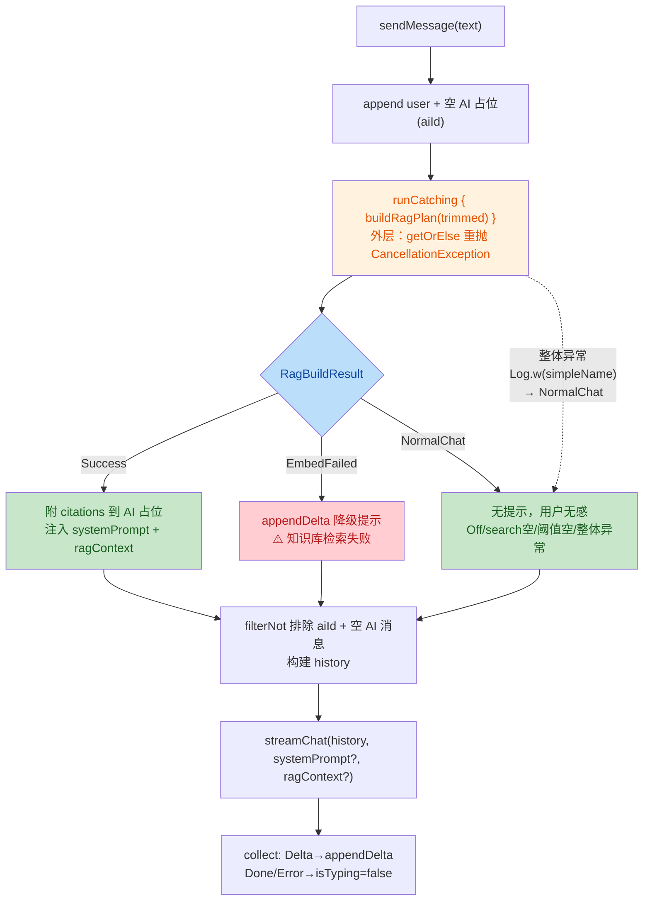

# US-019 RAG 对话集成 安全与质量审计报告（Round 2 复审）

> 从 `docs/templates/reports/guardrail-template.md` 复制新建，依 CLAUDE.md 第十节 + 7.2.5。
> 由 guardrail-enforcer 子 Agent 生成。基于 TRAE-code-review + TRAE-security-review skill 执行。
> 本轮为修复后复审，重点验证 G-01~G-05 修复有效性 + 无新增跨模块影响。

| 项目 | 内容 |
|---|---|
| 执行 Agent | guardrail-enforcer |
| 任务令牌 | TKN-US019-RAG-GUARDRAIL-002 |
| 审计日期 | 2026-08-07 |
| 关联 ADR | [ADR-012](../decisions/ADR-012-m3-rag-conversation-integration.md) |
| 关联考古报告 | [2026-08-07-us019-rag-integration-archaeology.md](2026-08-07-us019-rag-integration-archaeology.md) |
| 关联自检报告 | [2026-08-07-us019-rag-integration-impact-selfcheck.md](2026-08-07-us019-rag-integration-impact-selfcheck.md) |
| 关联 Round 1 guardrail | [2026-08-07-us019-rag-integration-guardrail.md](2026-08-07-us019-rag-integration-guardrail.md) |
| 关联代码变更 | 3 文件修改（round 2 修复范围） |
| 风险等级 | P2 跨模块（round 2 为修复后复审） |
| 技术栈 | Android Kotlin 2.3.21 + Jetpack Compose + ObjectBox 5.4.2 + Ktor SSE + ONNX Runtime 1.27.0 |

---

## 审查范围（Round 2 修复文件清单）

| # | 文件 | 类型 | 修复项 | 行数变化 |
|---|---|---|---|---|
| 1 | `app/src/main/java/io/prism/rag/RagTarget.kt` | 修改 | G-04：SpecificLibrary init 校验 kbId > 0 | +8 |
| 2 | `app/src/main/java/io/prism/ui/chat/ConversationViewModel.kt` | 修改 | G-01/G-02/G-03：显式 try-catch + RagBuildResult sealed + Log.w + 历史过滤器 | +60/-20 |
| 3 | `app/src/test/java/io/prism/ui/chat/ConversationViewModelTest.kt` | 修改 | G-05：新增 4 测试 + 更新 embed 失败断言 | +160/-10 |

**审查函数/接口数**：`ConversationViewModel.sendMessage` + `buildRagPlan` + `appendDelta` / `RagBuildResult` sealed interface（Success/EmbedFailed/NormalChat）/ `RagPlan` / `RagTarget.SpecificLibrary.init` / 5 个新增/更新测试用例

**round 1 已审、本轮维持不变的文件**（仅作上下文参考，未重新审查）：`RagContextBuilder.kt` / `ChatStreamProvider.kt` / `OpenAICompatibleProvider.kt` / `ChatMessage.kt` / `ConversationScreen.kt` / `RagContextBuilderTest.kt` / `OpenAICompatibleProviderTest.kt` / `ADR-012`。

---

## 1. 代码质量审查（TRAE-code-review）

### 1.0 修复后流程概览



**作者意图推断**：修复 round 1 发现的 G-01~G-05 质量缺陷。核心改造是用 `RagBuildResult` sealed interface 三态（Success/EmbedFailed/NormalChat）替代 `RagPlan?` + 静默降级，让调用方按三态差异化用户感知；内层 `runCatching` 改为显式 try-catch 重抛 `CancellationException`；整个 RAG 异常分支从 appendDelta 暴露 simpleName 改为 `Log.w` 记录 + 用户无感；`SpecificLibrary` init 块前置校验 kbId；补齐正向快乐路径测试。

### 1.1 Karpathy Guidelines 符合性（round 2 修复后）

| 指南项 | round 1 结论 | round 2 结论 | 证据 |
|---|---|---|---|
| 命名清晰 | ✅ 通过 | ✅ 通过 | RagBuildResult / Success / EmbedFailed / NormalChat 命名表意准确 |
| 职责单一 | ✅ 通过 | ✅ 通过 | buildRagPlan 只管构建结果，sendMessage 按 when 分支编排用户感知 |
| Surgical changes | ✅ 通过 | ✅ 通过 | 修复精准触及 3 文件，RagBuildResult 为 private 不扩散 |
| 错误处理 | ⚠️ 有条件 | ✅ 通过 | G-01 内层 try-catch 重抛 CancellationException；G-02 三态差异化感知；G-03 Log.w 用户无感 |
| 过度设计 | ✅ 通过 | ✅ 通过 | RagBuildResult sealed interface 是 Kotlin idiom，非过度（见 §1.7 G1） |
| 可验证成功标准 | ⚠️ 有条件 | ✅ 通过 | G-05 正向快乐路径 + 阈值空 + SpecificLibrary 校验/检索测试补齐 |

### 1.2 ADR-012 决策符合性（round 2 修复后）

| ADR-012 决策项 | round 1 结论 | round 2 结论 | 证据 / 偏差 |
|---|---|---|---|
| 5.5 三级降级 | ⚠️ 偏差 | ✅ 符合 | G-02：EmbedFailed → appendDelta 提示；G-03：整体异常 → Log.w 用户无感 |
| 5.5 embed 失败 Toast | ⚠️ 偏差 | ⚠️ 过渡方案 | Toast 基建未就绪，用 appendDelta 替代（注释说明），见 R2-3 LOW 建议 |
| 5.5 整个 RAG 异常用户无感 | ⚠️ 偏差 | ✅ 符合 | G-03：simpleName 仅 Log.w 记录，不进 appendDelta |
| 其余 5.1-5.8 | ✅ 符合 | ✅ 符合 | round 2 未改动，维持 round 1 结论 |

### 1.3 behavioral-rules.md 既有规则符合性（round 2 修复后）

| 规则 | round 1 结论 | round 2 结论 | 证据 |
|---|---|---|---|
| BR-error-handling-004（catch 不静默吞） | ❌ 违反 | ✅ 符合 | G-01：内层 try-catch，EmbedFailed/NormalChat 显式分类；外层 Log.w 记录 simpleName |
| BR-concurrency-002（embed IO 线程） | ✅ 符合 | ✅ 符合 | buildRagPlan 在 withContext(ioDispatcher) 内 |
| BR-concurrency-004（StateFlow 原子 CAS） | ✅ 符合 | ✅ 符合 | _messages.update 全部 CAS |
| BR-interface-003（过滤空 AI 占位） | ✅ 符合 | ✅ 符合 | filterNot 排除 aiId + 空 AI 消息（第 183 行） |
| BR-error-handling-007（提议） | ❌ 违反 | ✅ 符合 | G-01 修复后符合提议规则（含例外条款），见 §1.6 A4 |

### 1.4 跨模块影响识别（修复本身 blast-radius）

自检报告 v2 §9 的 blast-radius 扫描经复核**正确**：

- `RagBuildResult` sealed interface：private，仅 `ConversationViewModel.kt` 内部，无外部影响 ✅
- `buildRagPlan` 返回类型 `RagPlan?` → `RagBuildResult`：private 方法签名变更，仅 `sendMessage` 调用 ✅
- `RagTarget.SpecificLibrary` init 块：破坏性（kbId<=0 抛异常），但生产 UI 不构造（ConversationScreen.kt:225 仅 `is` 判断 + 显示 kbId），测试全部合法或故意测试异常 ✅
- `TAG` 常量 + `Log` import：仅 ConversationViewModel，无影响 ✅
- 历史过滤器 `it.id == aiId ||`：行为变更，所有 sendMessage 调用受影响，但既有测试全过 + 新增 embed 失败测试验证 ✅

**无孤立残留**，修复的跨模块影响全部受控。

### 1.5 测试框架与基础用例充分性（round 2 修复后）

| 测试文件 | 用例数 | 通过 | 覆盖评估 |
|---|---|---|---|
| `RagContextBuilderTest.kt` | 7 | 7 | ✅ 充分（round 1 已审，未改） |
| `OpenAICompatibleProviderTest.kt` | 32 | 32 | ✅ 充分（round 1 已审，未改） |
| `ConversationViewModelTest.kt` | 18 | 18 | ✅ 充分（round 2 新增 4 + 更新 1，覆盖正向/阈值空/校验/检索/降级） |
| **合计** | **57** | **57** | 0 失败 |

> **数据一致性观察**（R2-2 LOW）：自检报告 v2 §9.4 记录 OpenAICompatibleProviderTest 22 用例，任务背景声称 32 用例。该文件非本轮修复范围，无论 22 或 32 均全过，不影响结论。建议主 Agent 核对自检报告数字。

**round 2 新增/更新测试**：

- `rag on with matching chunks injects system prompt rag context and citations`（G-05 正向快乐路径，AC-3 验证）✅
- `rag on with below threshold results degrades to normal chat`（G-07 阈值过滤空）✅
- `SpecificLibrary rejects non positive kbId`（G-04 校验）✅
- `rag on with specific library retrieves only that library chunks`（G-04 指定库检索）✅
- `rag on with embedder failure degrades to normal chat`（G-02 断言更新：降级提示 + AI 回复 + 历史排除）✅

---

## 1.6 A-I 九维度逐项验证（本轮核心）

### A. G-01 修复有效性（HIGH）—— ✅ 通过

| 检查项 | 结论 | 证据（文件:行） |
|---|---|---|
| A1. 内层 runCatching 是否全部改为显式 try-catch | ✅ | embed：`ConversationViewModel.kt:233-239` try-catch；search：`ConversationViewModel.kt:248-254` try-catch。无内层 runCatching 残留 |
| A2. CancellationException 是否在 Exception 之前重抛（两处） | ✅ | embed：第 235-236 行 `catch (e: CancellationException) { throw e }` 在第 237 行 `catch (e: Exception)` 之前；search：第 250-251 行在 第 252 行之前。顺序正确 |
| A3. 是否有其他 runCatching 残留在协程代码 | ✅ | 全量搜索 `runCatching`：ConversationViewModel.kt 仅第 147 行（外层，见 A4）+ 第 219 行 KDoc 注释。buildRagPlan 内层无 runCatching |
| A4. 外层 runCatching 是否正确处理 CancellationException | ✅ | 第 147-154 行：`runCatching { buildRagPlan(trimmed) }.getOrElse { e -> if (e is CancellationException) throw e; Log.w(...); RagBuildResult.NormalChat }`。getOrElse 中 `is` 检查重抛，符合 BR-error-handling-007 提议的例外条款（"若必须用 runCatching，须在 getOrElse 中先检查并重抛 CancellationException"） |

**round 1 G-01 HIGH 缺陷已有效修复**。内层 runCatching 反模式消除，CancellationException 在 embed/search/外层三处均正确传播。与 `OpenAICompatibleProvider.kt:105-107` 既有正确模式一致（round 1 报告指出的"同项目模式不一致"已消除）。

### B. G-02 修复有效性（MEDIUM）—— ✅ 通过

| 检查项 | 结论 | 证据（文件:行） |
|---|---|---|
| B1. RagBuildResult 三态是否覆盖所有降级分支 | ✅ | buildRagPlan 返回路径：Off→NormalChat(227) / embed 失败→EmbedFailed(238) / Off 防御→NormalChat(246) / search 失败→NormalChat(253) / 阈值空→NormalChat(258) / 成功→Success(261)。外层整体异常→NormalChat(153)。七路径全覆盖三态 |
| B2. when (ragResult) 是否穷尽（无 else 兜底） | ✅ | 第 157-174 行：`is Success` / `EmbedFailed` / `NormalChat` 三分支，sealed interface 编译期穷尽检查，无 else |
| B3. EmbedFailed 是否 appendDelta 提示 + 文案合规 | ✅ | 第 167-172 行：`appendDelta(aiId, "⚠️ 知识库检索失败，已降级为普通对话\n\n")`。注释说明 Toast 基建未就绪用 appendDelta 过渡。末尾 `\n\n` 分隔后续 AI 流式回复 |
| B4. NormalChat 是否用户无感 | ✅ | 第 173 行：`RagBuildResult.NormalChat -> null`，无 appendDelta，无提示 |

**round 1 G-02 MEDIUM 缺陷已有效修复**。embed 失败从静默吞改为显式 EmbedFailed + appendDelta 提示，用户可感知降级。

### C. G-03 修复有效性（MEDIUM）—— ✅ 通过

| 检查项 | 结论 | 证据（文件:行） |
|---|---|---|
| C1. 整个 RAG 异常分支是否移除 simpleName 暴露到 appendDelta | ✅ | 第 147-154 行外层 getOrElse：无 appendDelta，仅 `Log.w(TAG, "RAG injection failed: ${e::class.simpleName}, degrading to normal chat")` + 返回 NormalChat。round 1 的 `appendDelta(aiId, "⚠️ 知识库检索异常（${e::class.simpleName}）...")` 已移除 |
| C2. Log.w 是否仅记录 simpleName（不含密钥/请求体/路径/堆栈） | ✅ | 第 152 行：消息为 `"RAG injection failed: ${e::class.simpleName}, degrading to normal chat"`。simpleName 是异常类名（如 IllegalStateException），不含密钥/请求体/URL/文件路径/堆栈/PII |
| C3. TAG 常量定义是否合理 | ✅ | 第 280 行：`private const val TAG = "ConversationViewModel"`。Android Logcat 惯例（类名作 TAG），private const |

**round 1 G-03 MEDIUM 缺陷已有效修复**。simpleName 从用户可见消息移到 Logcat 日志，符合 ADR-012 5.5「日志记录 simpleName，用户无感」。

### D. G-04 修复有效性（MEDIUM）—— ✅ 通过

| 检查项 | 结论 | 证据（文件:行） |
|---|---|---|
| D1. SpecificLibrary 是否有 init { require(kbId > 0) } | ✅ | `RagTarget.kt:35-41`：`init { require(kbId > 0) { "SpecificLibrary kbId 必须 > 0（收到 $kbId）；默认库请用 AllLibraries，负数非法" } }` |
| D2. KDoc 是否与代码一致 | ✅ | KDoc 第 9 行「kbId 为具体库 id（>0）」+ 第 19-20 行「G-04 修复：入参校验 kbId > 0，与 KDoc 一致」+ 第 32 行 `@throws IllegalArgumentException 当 kbId <= 0`，与第 38 行 `require(kbId > 0)` 一致 |
| D3. 既有调用点是否全部合法 kbId | ✅ | 全量搜索 SpecificLibrary：测试 `42L`(409) / `0L`+`-1L`(530-534 故意异常) / `1L`(572)；生产 ConversationScreen.kt:225 仅 `is` 判断不构造。无非法构造点 |
| D4. buildRagPlan when(target) 是否需重复校验 | ✅ | `ConversationViewModel.kt:243-247`：`is SpecificLibrary -> target.kbId`，注释「G-04 修复：init 已校验 kbId > 0，此处无需重复校验」。init 块保证不变式，无需重复 |

**round 1 G-04 MEDIUM 缺陷已有效修复**。KDoc 与代码一致，init 块前置校验，无非法构造点。

### E. G-05 修复有效性（MEDIUM）—— ✅ 通过

| 检查项 | 结论 | 证据（文件:行） |
|---|---|---|
| E1. 是否新增正向快乐路径测试 | ✅ | `ConversationViewModelTest.kt:424-483` `rag on with matching chunks injects system prompt rag context and citations`：构造含 chunk 的 KB（embedding 与 StubEmbedder 一致），验证检索成功注入 |
| E2. 断言是否覆盖 AC-3（标注引用来源） | ✅ | 第 458-482 行：断言 systemPrompt == RagContextBuilder.SYSTEM_PROMPT；ragContext 含【知识库片段】/ [来源1] / 文档A.pdf / 片段=1；AI 消息 sources 非空，citation index/documentTitle/chunkIndex 对齐；AI 流式回复追加 |
| E3. 是否新增阈值过滤空分支测试 | ✅ | 第 491-523 行 `rag on with below threshold results degrades to normal chat`：chunk embedding 正交（similarity=0 < 0.3），断言降级 NormalChat 无注入 |
| E4. 是否新增 SpecificLibrary(kbId<=0) 校验测试 | ✅ | 第 528-538 行 `SpecificLibrary rejects non positive kbId`：assertThrows IllegalArgumentException for 0L/-1L + 正向 42L |
| E5. embed 失败测试断言是否更新 | ✅ | 第 332-361 行：断言 systemPrompt/ragContext null + content 含「知识库检索失败」+「已降级为普通对话」+「降级回复」+ sources 空 + 请求历史不含降级提示（aiId 过滤验证） |

**round 1 G-05 MEDIUM 缺陷已有效修复**。AC-3 验证缺口闭合，正向快乐路径 + 阈值空 + SpecificLibrary 校验/检索全覆盖。

### F. 配套修复审查（历史过滤器扩展）—— ✅ 通过

| 检查项 | 结论 | 证据（文件:行） |
|---|---|---|
| F1. 历史过滤器是否正确防止 embed 失败提示进请求历史 | ✅ | `ConversationViewModel.kt:183`：`filterNot { it.id == aiId \|\| (it.role == Role.ASSISTANT && it.content.isEmpty()) }`。`it.id == aiId`排除当前 AI 占位消息（含 embed 失败 appendDelta 的降级提示）；`\|\|` 连接空 AI 消息过滤。EmbedFailed 后 AI 消息非空（含提示），仅靠 aiId 排除 |
| F2. 是否破坏既有测试 | ✅ | `request history excludes empty placeholder message`(246-265)：RAG Off，AI 占位空，aiId + isEmpty 双重排除，断言 sent.size==1 通过；`request history excludes stale empty ai message`(268-296)：多轮零增量，isEmpty 排除，断言无空 content 通过；embed 失败测试(359-360)断言 `sent.none { it.content.contains("知识库检索失败") }` 通过 |
| F3. 是否引入新边界问题（aiId 计算时机） | ✅ | 第 135 行 `val aiId = nextId++` 计算，第 183 行 filterNot 使用，作用域内一致。连续发送场景：每轮 aiId 唯一，filterNot 仅排除当前轮占位，历史轮非空 AI 消息保留、空 AI 消息被 isEmpty 排除。无边界问题 |

**配套修复正确**。`it.id == aiId` 与 `isEmpty` 用 `||` 互补：当前轮占位（可能非空，含降级提示）由 aiId 排除；历史轮空 AI 消息由 isEmpty 排除。两者覆盖不同场景，无遗漏。

### G. 新抽象合理性 —— ✅ 通过

| 检查项 | 结论 | 证据 / 论证 |
|---|---|---|
| G1. RagBuildResult sealed interface 是否过度设计 | ✅ 合理 | 三态（Success/EmbedFailed/NormalChat）对应 ADR-012 5.5 三级降级的用户感知差异（注入/提示/无感）。比"RagPlan? + 外层 runCatching 区分降级原因"更清晰：sealed interface 让编译器保证 when 穷尽，降级原因在 buildRagPlan 内部封装，调用方只需按三态决策。Kotlin idiom，非过度设计 |
| G2. RagBuildResult 是否为 private | ✅ | `ConversationViewModel.kt:311`：`private sealed interface RagBuildResult`。private 限定，无外部影响 |
| G3. Log.w 引入是否需 Logger 抽象 | ✅ 过渡合理 | 项目首次引入 android.util.Log（之前无结构化日志基建）。CLAUDE.md 19.1 要求结构化 JSON 日志，但项目暂无基建。Log.w 仅记录 simpleName，是合理过渡方案。R2-3 LOW 建议后续建轻量 Logger 抽象，但不阻断 |

### H. 跨模块影响（修复本身）—— ✅ 通过

| 检查项 | 结论 | 证据 |
|---|---|---|
| H1. 修复是否触及 round 1 未审查模块 | ✅ 未触及 | 修复仅触及 ConversationViewModel.kt / RagTarget.kt / ConversationViewModelTest.kt（round 1 已审）。RagBuildResult 新增 private 不扩散；Log.w 是 Android SDK 内置无新依赖 |
| H2. SpecificLibrary init 是否破坏生产调用点 | ✅ 未破坏 | 全量搜索：生产 ConversationScreen.kt:225 仅 `is RagTarget.SpecificLibrary -> "RAG #${target.kbId}"`（when 判断 + 显示），不构造。RagModeSelectorSheet「指定库」标注「暂未开放」。测试全部合法 kbId 或故意异常 |
| H3. RagBuildResult 是否泄漏到外部 | ✅ 未泄漏 | private sealed interface，仅 ConversationViewModel.kt 内部 |

### I. behavioral-rules 提议 —— 见 §5

| 检查项 | 结论 | 证据 |
|---|---|---|
| I1. BR-error-handling-007 是否可转 active | ✅ 可转 active（待 ac-verifier 确认） | G-01 修复有效：内层 try-catch 重抛 CancellationException，外层 runCatching getOrElse 重抛。符合提议规则（含例外条款）。按 BR-concurrency-002/004 先例，guardrail 复审通过后提议转 active，ac-verifier 确认 |
| I2. 是否需新增 BR-interface-004 | ✅ 建议新增 | 历史过滤器 `it.id == aiId` 修复了 v1 潜在 bug（降级提示进请求历史）。值得提炼为规则，防止复发 |

---

## 1.7 代码质量发现清单（Round 2）

| 编号 | 严重度 | 位置 | 问题描述 | 处置 |
|---|---|---|---|---|
| R2-1 | LOW | `ConversationViewModel.kt:147` | 外层 `runCatching { buildRagPlan(trimmed) }` 仍为协程代码中的 runCatching，且 runCatching 捕获所有 Throwable（含 Error 如 OOM）。虽符合 BR-error-handling-007 例外条款（getOrElse 重抛 CancellationException），但 Error 会被吞为 NormalChat。建议未来改为 try-catch 仅 catch Exception，更彻底符合规则精神且避免吞 Error | 建议（不阻断） |
| R2-2 | LOW | 自检报告 v2 §9.4 vs 任务背景 | 自检报告 v2 记录 OpenAICompatibleProviderTest 22 用例，任务背景声称 32 用例。数据不一致。该文件非本轮修复，测试全过不影响结论 | 建议主 Agent 核对自检报告数字 |
| R2-3 | LOW | `ConversationViewModel.kt:167-172` / ADR-012 5.5 | ADR-012 5.5 降级策略表规定 embed 失败用 Toast，实现用 appendDelta（Toast 基建未就绪）。注释已说明过渡方案。建议后续 ADR 更新降级策略表或补充 Toast 基建 TODO | 建议（不阻断） |

**无 HIGH / MEDIUM 质量缺陷**。round 1 的 G-01~G-05 全部有效修复，无新增阻断/高危/中危问题。

---

## 2. 安全漏洞扫描（TRAE-security-review）

### 2.1 审计方法论

执行 Pass A（项目安全基线）→ Pass B（偏差地图）→ Pass C（Source-to-sink trace）三遍审计。round 2 修复涉及的安全相关变更：

1. `Log.w` 引入（项目首次使用 android.util.Log）
2. `RagBuildResult` sealed interface（private 控制流抽象）
3. 历史过滤器扩展 `it.id == aiId ||`（改变请求历史构建）
4. `RagTarget.SpecificLibrary` init 校验（输入边界加固）
5. `appendDelta` 提示文案（用户可见输出）

### 2.2 Source-to-sink trace

| 变更 | Source | Sink | 路径上的防护 | 结论 |
|---|---|---|---|---|
| Log.w 信息泄露 | `e::class.simpleName`（异常类名） | `Log.w(TAG, "RAG injection failed: ${e::class.simpleName}...")` Logcat | simpleName 是类名（如 IllegalStateException），不含密钥/请求体/URL/路径/堆栈/PII。TAG=类名 | ✅ 安全 |
| SpecificLibrary init 校验 | 外部输入 kbId（Long） | `require(kbId > 0)` | 前置校验，kbId<=0 抛 IllegalArgumentException | ✅ 安全（加固） |
| 历史过滤器扩展 | `_messages.value`（内存态消息） | `filterNot { ... }` → `streamChat(messages=history)` → `kotlinx.serialization` JSON | 消息内容经标准库序列化，无字符串拼接查询/命令。filterNot 仅移除条目，不构造载荷 | ✅ 安全 |
| appendDelta 提示文案 | 硬编码字符串 | `appendDelta` → `_messages.update` → Compose `Text` | 硬编码字符串无用户输入，Compose Text 默认安全转义 | ✅ 安全 |
| RagBuildResult.NormalChat 信息泄露 | RAG 异常 / search 失败 / 阈值空 | `null`（不注入 prompt/context，不 appendDelta） | 用户无感，仅 Log.w 记录 simpleName | ✅ 安全 |

### 2.3 输入与边界审计

| 输入参数 | 合法范围 | 校验机制 | 结论 |
|---|---|---|---|
| `RagTarget.SpecificLibrary.kbId` | >0 | `init { require(kbId > 0) }`（G-04 修复） | ✅ round 1 G-04 已修复 |
| `queryText` | 非空非空白 | `sendMessage`: trim + isEmpty | ✅ |
| `queryVector` | 384 维 | `search`: require(size==384) | ✅ |
| `k` (top-k) | >0 | 硬编码 RAG_TOP_K=3 + search require | ✅ |
| `similarity` 阈值 | [-1,1] | `filter { >= 0.3 }` | ✅ |

### 2.4 执行安全审计

| 注入类型 | 结论 | 证据 |
|---|---|---|
| SQL/NoSQL 注入 | ✅ 安全 | ObjectBox nearestNeighbors + equal 参数化 API，历史过滤器仅移除条目不拼接查询 |
| OS 命令注入 | ✅ N/A | 无 system/exec |
| 代码/表达式注入 | ✅ N/A | 无 eval/Function |
| 模板引擎注入 | ✅ N/A | 无模板引擎 |
| Prompt 注入 | ⚠️ 架构固有 | RAG context 含用户上传文档，TRAE-security-review §8.1 out of scope（round 1 S-01 已记录为 LOW defense-in-depth） |

### 2.5 密钥与配置安全

| 检查项 | 结论 | 证据 |
|---|---|---|
| Log.w 泄露密钥/Token | ✅ 安全 | 仅记录 simpleName（异常类名），无密钥 |
| appendDelta 提示泄露内部细节 | ✅ 安全 | 硬编码文案"⚠️ 知识库检索失败，已降级为普通对话"，无路径/堆栈/类名 |
| systemPrompt/ragContext 含密钥 | ✅ 安全 | prompt 为固定规则文案，context 为文档片段 |
| 硬编码密钥 | ✅ 安全 | TAG 为类名常量，无密钥 |

### 2.6 日志脱敏

| 检查项 | 结论 | 证据 |
|---|---|---|
| Log.w 输出密钥/密码/Token/PII | ✅ 安全 | `Log.w(TAG, "RAG injection failed: ${e::class.simpleName}, degrading to normal chat")` —— 仅类名 + 固定文案 |
| Log.w 输出完整 SQL/请求体/路径 | ✅ 安全 | 无 |
| 符合 CLAUDE.md 19.3 日志安全 | ✅ | 不输出密码/令牌/密钥/完整 SQL/内部路径 |

### 2.7 依赖与供应链风险

| 检查项 | 结论 |
|---|---|
| 新增第三方依赖 | ✅ 无（android.util.Log 是 Android SDK 内置） |
| 锁文件改动 | ✅ 无 |

---

## 3. OWASP / CWE 发现（Round 2）

基于 TRAE-security-review Pass A-C 审计与 §8 硬排除规则过滤：

**无新增 HIGH / MEDIUM / LOW 安全漏洞**。round 2 修复未引入任何 exploitable 安全问题。Log.w 引入经 source-to-sink trace 确认仅记录异常类名，不泄露敏感信息。SpecificLibrary init 校验为正面安全加固。

round 1 的 S-01（Prompt injection，RAG 架构固有，§8.1 out of scope）维持，不阻断。

---

## 4. 综合结论

### 4.1 结论

- [x] **通过**（可进入 ac-verifier 测试阶段）
- [ ] 有条件通过
- [ ] 阻断

### 4.2 结论依据

**安全维度**：无阻断级安全漏洞。无 SQL/命令/代码注入，无硬编码密钥，无敏感信息泄露。Log.w 仅记录 simpleName，符合日志安全规范。SpecificLibrary init 校验为正面加固。round 1 S-01（Prompt injection）维持 out of scope。

**质量维度**：round 1 的 G-01~G-05（1 HIGH + 4 MEDIUM）全部有效修复，无新增阻断/高危/中危缺陷。仅 3 项 LOW 建议（R2-1 外层 runCatching 可改 try-catch / R2-2 数据核对 / R2-3 ADR 降级策略表更新），均不阻断。

| round 1 编号 | 严重度 | round 2 验证 | 处置 |
|---|---|---|---|
| G-01 | HIGH | ✅ 有效修复（A1-A4 全通过） | 闭合 |
| G-02 | MEDIUM | ✅ 有效修复（B1-B4 全通过） | 闭合 |
| G-03 | MEDIUM | ✅ 有效修复（C1-C3 全通过） | 闭合 |
| G-04 | MEDIUM | ✅ 有效修复（D1-D4 全通过） | 闭合 |
| G-05 | MEDIUM | ✅ 有效修复（E1-E5 全通过） | 闭合 |
| G-06 | LOW | 维持（UX 体验，ac-verifier 范围） | 不阻断 |
| G-07 | LOW | ✅ 已修复（E3 阈值过滤空测试补齐） | 闭合 |
| R2-1 | LOW | 新增建议（外层 runCatching 可改 try-catch） | 不阻断 |
| R2-2 | LOW | 新增建议（数据核对） | 不阻断 |
| R2-3 | LOW | 新增建议（ADR 降级策略表更新） | 不阻断 |

**依据 CLAUDE.md 7.2**：round 1 结论为"有条件通过"，主 Agent 已修复 G-01~G-05 并依 7.2.5 执行二次自检。本轮复审确认修复有效且完整，无新增跨模块影响，无新增安全漏洞。结论为**通过**，可进入 ac-verifier 测试阶段。

---

## 5. 规则提议（accepted review → behavioral-rules）

### 5.1 BR-error-handling-007（round 1 提议 → round 2 建议转 active）

- **类别**：error-handling / concurrency
- **规则**：在 Kotlin 协程代码（suspend 函数 / withContext 块 / Flow collect / viewModelScope.launch 块）中，`runCatching { }` 会捕获所有 `Throwable`（含 `CancellationException`），破坏结构化并发的取消传播。必须改用显式 `try-catch`，且 `catch (e: CancellationException) { throw e }` 必须在其他 catch 之前。若必须用 `runCatching`，须在 `getOrElse` / `onFailure` 中先检查并重抛 `CancellationException`。
- **反例**：`val v = runCatching { suspendingApi.call() }.getOrElse { return null }` —— 协程取消时 CancellationException 被吞
- **正例**：`val v = try { suspendingApi.call() } catch (e: CancellationException) { throw e } catch (e: Exception) { return null }`
- **来源**：US-019 RAG 对话集成审查（TKN-US019-RAG-GUARDRAIL-001 G-01 HIGH 发现；TKN-US019-RAG-GUARDRAIL-002 复审确认修复有效）
- **添加日期**：2026-08-07
- **适用场景**：dev
- **状态**：proposed → **建议转 active**（待 ac-verifier 确认，按 BR-concurrency-002/004 先例）

### 5.2 BR-interface-004（新增提议）

- **类别**：interface
- **规则**：构造对话请求历史时，必须排除**当前轮 AI 占位消息**（由 aiId 标识），而非仅排除空 content 的 AI 消息。当前轮 AI 占位消息可能因降级提示（如 embed 失败 appendDelta）变为非空，若仅按空 content 过滤会漏过此消息，导致 provider 把降级提示当作上一轮 AI 回复纳入请求历史（语义错误，污染上下文）。必须用 `filterNot { it.id == aiId || (其他过滤条件) }`，aiId 过滤与空 content 过滤用 `||` 互补。
- **反例**：`filterNot { it.role == Role.ASSISTANT && it.content.isEmpty() }` —— embed 失败 appendDelta 后 AI 占位非空，漏过过滤进入请求历史
- **正例**：`filterNot { it.id == aiId || (it.role == Role.ASSISTANT && it.content.isEmpty()) }` —— aiId 排除当前轮占位（含降级提示），isEmpty 排除历史轮空消息
- **来源**：US-019 RAG 对话集成 G-02 配套修复（TKN-US019-RAG-GUARDRAIL-002，guardrail 倒逼发现的 v1 潜在 bug）
- **添加日期**：2026-08-07
- **适用场景**：dev
- **状态**：proposed（待主 Agent 确认 + ac-verifier 验证后转 active）

---

## 6. 保护机制验证

| 保护机制 | round 1 结论 | round 2 结论 | 证据 |
|---|---|---|---|
| BR-concurrency-002（embed IO 线程） | ✅ | ✅ | buildRagPlan 在 withContext(ioDispatcher) 内 |
| BR-concurrency-004（_messages.update CAS） | ✅ | ✅ | 全部 _messages 写入使用 update { } |
| BR-interface-003（过滤空 AI 占位） | ✅ | ✅ | filterNot 排除空 AI 消息（第 183 行） |
| BR-error-handling-004（catch 不静默吞） | ❌ 违反 | ✅ 符合 | G-01 修复：内层 try-catch 分类 + 外层 Log.w 记录 |
| CancellationException 传播（Provider 层） | ✅ | ✅ | OpenAICompatibleProvider.kt:105-107（round 2 未改） |
| CancellationException 传播（ViewModel 内层） | ❌ G-01 | ✅ 修复 | embed/search try-catch 重抛（第 235/250 行） |
| CancellationException 传播（ViewModel 外层） | ✅ | ✅ | getOrElse is 检查重抛（第 149 行） |
| SpecificLibrary kbId 校验 | ❌ G-04 | ✅ 修复 | init { require(kbId > 0) }（RagTarget.kt:38） |
| JSON 序列化安全 | ✅ | ✅ | kotlinx.serialization 标准库 |
| ObjectBox 查询参数化 | ✅ | ✅ | nearestNeighbors + equal API |
| Log.w 脱敏 | N/A | ✅ | 仅 simpleName，无密钥/路径/堆栈 |

---

## 7. 豁免说明

| 豁免项 | 理由 | 状态 |
|---|---|---|
| ConversationScreen 无 Compose UI 测试 | 项目无 UI 测试框架，RAG 模式切换 UI 为视觉层，属 ac-verifier 范围 | 记录不阻断（round 1 已豁免） |
| mergeDebugJavaResource 打包失败 | US-014 PDFBox 遗留，与本 US 无关，单元/集成测试不触发 | 记录不阻断（round 1 已豁免） |
| Prompt injection（S-01） | TRAE-security-review §8.1 out of scope，RAG 架构固有 | 记录为 LOW 建议（round 1 已豁免） |
| Toast 基建未就绪用 appendDelta 替代 | ADR-012 5.5 规定 Toast 但项目暂无基建，appendDelta 过渡方案合理（注释说明） | 记录不阻断（R2-3 建议 ADR 更新） |
| android.util.Log 非结构化日志 | CLAUDE.md 19.1 要求结构化 JSON 日志，但项目暂无基建，Log.w 过渡方案仅记录 simpleName | 记录不阻断（R2-3 建议后续建 Logger 抽象） |

---

## 8. 自检报告与实际代码不符项

| 自检报告 v2 描述 | 实际代码 | 处置 |
|---|---|---|
| OpenAICompatibleProviderTest 22 用例（§9.4） | 任务背景声称 32 用例（该文件非本轮修复，无法直接核对） | R2-2 LOW 建议主 Agent 核对 |

**其余不符项**：无。自检报告 v2 §9 的修复清单、二次依赖模块扫描、SpecificLibrary init 影响分析均与实际代码一致。

**特别确认**：自检报告 v2 §9.6 主 Agent 自问中识别的 3 项薄弱点（RagBuildResult 过度设计风险 / 历史过滤器回归风险 / Log.w Logger 抽象）经 §1.6 G/H 维度验证**全部可控**：RagBuildResult 非过度（G1）、历史过滤器无回归（F2）、Log.w 过渡合理（G3）。

---

## 9. CI/CD 自动化建议

```yaml
# .github/workflows/rag-guardrail.yml 示例片段（round 2 补充）
- name: Detect runCatching in coroutine code
  run: |
    # Semgrep 检测 suspend 函数 / withContext / viewModelScope.launch 块内的 runCatching
    # 未重抛 CancellationException 的模式（BR-error-handling-007）
    semgrep --config p/kotlin --include="*.kt" app/src/main/ \
      --pattern 'runCatching { ... }.getOrElse { ... }'

- name: Verify request history excludes current aiId
  run: |
    # 检测 filterNot 模式是否包含 aiId 排除（BR-interface-004 提议）
    # 当 buildRequestBody / streamChat 的 messages 参数来自 _messages.filterNot 时
    # 应包含 it.id == aiId 条件
```

建议添加 Semgrep 自定义规则：

1. 检测 `runCatching` 出现在协程作用域内且 getOrElse/onFailure 未重抛 CancellationException（BR-error-handling-007）
2. 检测请求历史 filterNot 是否包含当前 aiId 排除（BR-interface-004 提议）

---

> **本报告结论为「通过」。round 1 的 G-01~G-05 全部有效修复，无新增阻断/高危/中危缺陷，无新增安全漏洞。可进入 ac-verifier 测试阶段。**
> **3 项 LOW 建议（R2-1/R2-2/R2-3）不阻断，建议主 Agent 在 ac-verifier 后或后续迭代处理。**
> **BR-error-handling-007 建议转 active（待 ac-verifier 确认）；BR-interface-004 新增提议。**
