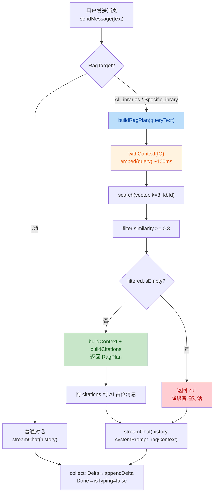

# US-019 RAG 对话集成 安全与质量审计报告

> 从 `docs/templates/reports/guardrail-template.md` 复制新建，依 CLAUDE.md 第十节。
> 由 guardrail-enforcer 子 Agent 生成。基于 TRAE-code-review + TRAE-security-review skill 执行。

| 项目 | 内容 |
|---|---|
| 执行 Agent | guardrail-enforcer |
| 任务令牌 | TKN-US019-RAG-GUARDRAIL-001 |
| 审计日期 | 2026-08-07 |
| 关联 ADR | [ADR-012](../decisions/ADR-012-m3-rag-conversation-integration.md) |
| 关联考古报告 | [2026-08-07-us019-rag-integration-archaeology.md](2026-08-07-us019-rag-integration-archaeology.md) |
| 关联自检报告 | [2026-08-07-us019-rag-integration-impact-selfcheck.md](2026-08-07-us019-rag-integration-impact-selfcheck.md) |
| 关联代码变更 | 8 文件修改 + 4 文件新增（共 714 insertions / 82 deletions） |
| 风险等级 | P2 跨模块 |
| 技术栈 | Android Kotlin 2.3.21 + Jetpack Compose + ObjectBox 5.4.2 + Ktor SSE + ONNX Runtime 1.27.0 |

---

## 审查范围（文件清单）

| # | 文件 | 类型 | 行数变化 |
|---|---|---|---|
| 1 | `app/src/main/java/io/prism/rag/RagContextBuilder.kt` | 新增 | +93 |
| 2 | `app/src/main/java/io/prism/rag/RagTarget.kt` | 新增 | +28 |
| 3 | `app/src/main/java/io/prism/network/ChatStreamProvider.kt` | 修改 | +13/-3 |
| 4 | `app/src/main/java/io/prism/network/OpenAICompatibleProvider.kt` | 修改 | +52/-10 |
| 5 | `app/src/main/java/io/prism/ui/model/ChatMessage.kt` | 修改 | +35/-10 |
| 6 | `app/src/main/java/io/prism/ui/chat/ConversationViewModel.kt` | 修改 | +150/-36 |
| 7 | `app/src/main/java/io/prism/ui/chat/ConversationScreen.kt` | 修改 | +161/-40 |
| 8 | `app/src/test/java/io/prism/rag/RagContextBuilderTest.kt` | 新增 | +125 |
| 9 | `app/src/test/java/io/prism/network/OpenAICompatibleProviderTest.kt` | 修改 | +83/-0 |
| 10 | `app/src/test/java/io/prism/ui/chat/ConversationViewModelTest.kt` | 修改 | +148/-16 |
| 11 | `docs/decisions/ADR-012-m3-rag-conversation-integration.md` | 新增 | +232 |
| 12 | `docs/decisions/README.md` | 修改 | +1 |

**审查函数/接口数**：ChatStreamProvider.streamChat / OpenAICompatibleProvider.buildRequestBody / ConversationViewModel.sendMessage+buildRagPlan+appendDelta / RagContextBuilder.buildContext+buildCitations / RagTarget 三态 / ChatMessage+Citation 数据类 / ConversationScreen RagModeChip+RagModeSelectorSheet+SourceChip+TypingIndicator

---

## 1. 代码质量审查（TRAE-code-review）

### 1.0 变更流程概览



**作者意图推断**：在现有对话流中集成 RAG 检索能力，通过扩展 ChatStreamProvider 接口注入 system prompt + ragContext，实现三级降级保证对话不中断，同时修复既有并发隐患（appendDelta 原子 CAS）和误导性 UI 文案。

### 1.1 Karpathy Guidelines 符合性

| 指南项 | 结论 | 证据 |
|---|---|---|
| 命名清晰 | ✅ 通过 | RagContextBuilder / RagTarget / RagPlan / Citation 命名表意准确 |
| 职责单一 | ✅ 通过 | RagContextBuilder 只管拼接（不 embed/search），ConversationViewModel 编排，Provider 执行 |
| Surgical changes | ✅ 通过 | 接口扩展用默认参数向后兼容，不触碰无关代码 |
| 错误处理 | ⚠️ 有条件 | 三级降级框架正确，但内层 runCatching 静默吞异常（G-01/G-02） |
| 过度设计 | ✅ 通过 | top-k=3 + 阈值 0.3 简洁务实，无过度抽象 |
| 可验证成功标准 | ⚠️ 有条件 | 降级路径有测试，但正向快乐路径缺失（G-05） |

### 1.2 ADR-012 决策符合性

| ADR-012 决策项 | 结论 | 证据 / 偏差 |
|---|---|---|
| 5.1 RagContextBuilder 独立组件 | ✅ 符合 | `RagContextBuilder.kt` object 单例，纯函数无状态 |
| 5.2 三态检索目标 + 默认开启 | ✅ 符合 | `RagTarget` sealed interface，默认 `AllLibraries` |
| 5.3 引用标注 inline citation + Citation 列表 | ✅ 符合 | `Citation` 数据类 + `SourceChip` 渲染列表 + prompt `[来源N]` |
| 5.4 接口扩展 systemPrompt/ragContext（方案 C） | ✅ 符合 | `ChatStreamProvider.streamChat` 两新参数默认 null |
| 5.5 三级降级 | ⚠️ 偏差 | embed 失败应 Toast 但实现静默降级（G-02）；整个 RAG 异常应「用户无感」但实现暴露 simpleName（G-03） |
| 5.6 IO 线程 + top-k=3 + 阈值 0.3 | ✅ 符合 | `withContext(ioDispatcher)` + `RAG_TOP_K=3` + `RAG_SIMILARITY_THRESHOLD=0.3` |
| 5.7 _messages 原子 CAS | ✅ 符合 | 全部 `_messages.update { }`（修复 R-5，BR-concurrency-004） |
| 5.8 UI 文案修正 | ✅ 符合 | TypingIndicator 按 RAG 状态切换文案；占位符改为「输入问题…」 |

### 1.3 behavioral-rules.md 既有规则符合性

| 规则 | 结论 | 证据 |
|---|---|---|
| BR-concurrency-002（embed 全程持锁） | ✅ 符合 | `buildRagPlan` 在 `withContext(ioDispatcher)` 内调用 embed/search，禁止 Main |
| BR-concurrency-004（StateFlow 原子 CAS） | ✅ 符合 | `_messages.update { }` 全部使用 CAS（`sendMessage` / `appendDelta` / citations 附着） |
| BR-error-handling-003（保留业务语义区分） | ✅ 符合 | OpenAICompatibleProvider 401/4xx/通用三档映射保留 |
| BR-error-handling-004（catch 不静默吞） | ❌ 违反 | `buildRagPlan` 内层 `runCatching { }.getOrElse { return@withContext null }` 静默吞异常无日志（G-01） |
| BR-interface-003（过滤空占位消息） | ✅ 符合 | `filterNot { it.role == Role.ASSISTANT && it.content.isEmpty() }` 排除所有空 AI 消息 |
| BR-security-001（data class 数组 equals） | ✅ N/A | Citation / ChatMessage / RagPlan 均无数组字段 |
| BR-testing-001（测试替身复现语义） | ✅ 符合 | StubEmbedderImpl 正确实现 Embedder 接口语义 |

### 1.4 跨模块影响识别

自检报告的 blast-radius 扫描结论经复核**正确**：

- ChatStreamProvider 接口扩展：3 个测试 fake（FakeChatStreamProvider / RecordingChatStreamProvider / MultiRoundRecordingProvider）均已适配 4 参数签名 ✅
- ChatMessage.source → sources：无残留 `.source` 单字段引用 ✅
- ConversationViewModel 构造签名：生产 Factory + 11 处测试构造点均已更新 ✅
- SourceChip：从 `source: String` 改为 `citation: Citation`，调用点已迁移 ✅

**无孤立残留**，跨模块影响全部同步。

### 1.5 测试框架与基础用例充分性

| 测试文件 | 用例数 | 覆盖评估 |
|---|---|---|
| `RagContextBuilderTest.kt` | 7 | ✅ 充分（空列表 / 多结果拼接 / chunkIndex null / 编号一致性） |
| `OpenAICompatibleProviderTest.kt`（US-019 新增） | 5 | ✅ 充分（system 注入 / null+blank 跳过 / ragContext 插入位置 / 无 user 时追加 / 两者同注入） |
| `ConversationViewModelTest.kt`（US-019 新增） | 4 | ⚠️ **不足**（4 个均为降级/关闭场景，无正向快乐路径） |

**测试覆盖缺口**（G-05/G-07，详见发现清单）。

### 1.6 代码质量发现清单

| 编号 | 严重度 | 位置 | 问题描述 |
|---|---|---|---|
| G-01 | HIGH | `ConversationViewModel.kt:203-204, 212-213` | **buildRagPlan 内层 runCatching 吞 CancellationException 破坏结构化并发 + 静默吞异常违反 BR-error-handling-004** |
| G-02 | MEDIUM | `ConversationViewModel.kt:203-204, 212-213` | **embed/search 失败静默降级无用户反馈，违反 ADR-012 5.5（embed 失败应 Toast）** |
| G-03 | MEDIUM | `ConversationViewModel.kt:145` | **整个 RAG 异常分支 appendDelta 暴露 simpleName 到用户消息，违反 ADR-012 5.5「用户无感」** |
| G-04 | MEDIUM | `RagTarget.kt:27` / `ConversationViewModel.kt:209` | **SpecificLibrary 无 kbId 入参校验，KDoc 说「>0」但代码不强制，kbId<=0 隐式容错** |
| G-05 | MEDIUM | `ConversationViewModelTest.kt:293-397` | **正向快乐路径测试缺失：无「RAG 检索成功→注入 systemPrompt+ragContext+citations」测试，AC-3 验证缺口** |
| G-06 | LOW | `ConversationScreen.kt:150, 478-480` | **TypingIndicator 未区分检索阶段与流式阶段，整个 isTyping 期间均显示「正在检索知识库…」** |
| G-07 | LOW | `ConversationViewModelTest.kt` | **SpecificLibrary(kbId<=0) 隐式容错路径未显式测试；「search 返回非空但阈值过滤后为空」分支未测试** |

#### G-01 详细说明（HIGH）

`buildRagPlan` 内部使用两处 `runCatching { }.getOrElse { return@withContext null }`：

```kotlin
// ConversationViewModel.kt:203-204
val queryVector = runCatching { embedder.embed(queryText) }
    .getOrElse { return@withContext null }  // embed 失败 → 降级

// ConversationViewModel.kt:212-213
val results = runCatching { knowledgeBaseRepository.search(queryVector, k = RAG_TOP_K, knowledgeBaseId = kbId) }
    .getOrElse { return@withContext null }  // search 失败 → 降级
```

**问题 1：runCatching 是 Kotlin 协程已知反模式**。`runCatching` 捕获所有 `Throwable`（含 `CancellationException`）。Kotlin 官方文档明确警告：「If you are using runCatching in coroutine code, make sure to rethrow CancellationException.」虽然当前 `embedder.embed()` 和 `search()` 是非挂起的阻塞函数（不会主动抛 `CancellationException`），但这是**潜在缺陷**——若后续将 embed 改为挂起函数，或在 `withContext` 切换调度器时协程被取消，`CancellationException` 会被静默吞掉，导致协程取消不传播、资源泄漏。

**问题 2：静默吞异常违反 BR-error-handling-004**。两处 `getOrElse { return@withContext null }` 不记录任何日志、不保留可诊断类别，异常被完全抹除。对比外层 `runCatching { buildRagPlan(trimmed) }`（:140-147）正确做了 `if (e is CancellationException) throw e` + `appendDelta` 提示，内层却完全静默。

**问题 3：内层静默吞导致外层降级提示不可达**。embed/search 失败时，内层 `runCatching` 返回 null，`buildRagPlan` 返回 null，外层 `runCatching` 成功（值 null），`getOrElse` 块不执行——用户看不到任何降级提示。这与 ADR-012 5.5「embed 失败 → Toast 提示」矛盾（G-02）。

**同项目对比**：`OpenAICompatibleProvider.kt:105-107` 正确处理了 `CancellationException`（`catch (e: CancellationException) { throw e }`），且 `OpenAICompatibleProviderTest` 有 `streamChat rethrows cancellation instead of emitting error` 测试验证此原则。ViewModel 层应保持一致。

#### G-02 详细说明（MEDIUM）

ADR-012 5.5 降级策略表规定：

| 失败场景 | 降级行为 | 用户感知 |
|---|---|---|
| embed(query) 失败 | 跳过检索，普通对话 | **Toast「查询嵌入失败，本次未检索知识库」** |

但实现中 embed 失败被内层 `runCatching` 静默吞掉（返回 null），**无 Toast、无 appendDelta 提示、无日志**。用户完全无感知 RAG 检索失败，仅得到普通对话回复。虽 ConversationViewModel 当前无 Toast 基建，但应至少通过 appendDelta 或日志记录失败（参考 G-03 外层处理模式），不可完全静默。

#### G-03 详细说明（MEDIUM）

ADR-012 5.5 降级策略表规定：

| 失败场景 | 降级行为 | 用户感知 |
|---|---|---|
| 整个 RAG 注入异常 | try-catch 兜底，退化为普通对话 | **日志记录 simpleName，用户无感** |

但实现 `appendDelta(aiId, "\n\n⚠️ 知识库检索异常（${e::class.simpleName}），已降级为普通对话")` 将 `simpleName` 写入用户可见的聊天消息内容。ADR 明确要求「用户无感」（仅日志记录），实现却暴露到 UI。虽 `simpleName`（如 `IllegalStateException`）非路径/堆栈，属 BR-error-handling-003「可诊断类别」边界，但与 ADR「用户无感」明确矛盾。

---

## 2. 安全漏洞扫描（TRAE-security-review）

### 2.1 输入与边界审计

#### 2.1.1 数值与类型边界

| 输入参数 | 合法范围 | 校验机制 | 结论 |
|---|---|---|---|
| `queryText`（用户查询文本） | 非空非空白 | `sendMessage`: `trim()` + `isEmpty()` 检查 | ✅ |
| `queryVector`（embed 输出） | 384 维 FloatArray | `KnowledgeBaseRepository.search`: `require(query.size == 384)` | ✅ |
| `k`（top-k） | >0 | `search`: `require(k > 0)` + ViewModel 硬编码 `RAG_TOP_K=3` | ✅ |
| `knowledgeBaseId`（kbId） | null / >=0 | `search`: `require(knowledgeBaseId == null \|\| >= 0)` | ⚠️ **SpecificLibrary(kbId) 无前置校验**（G-04） |
| `similarity`（相似度阈值） | [-1, 1] | `filter { it.similarity >= 0.3 }` | ✅ |
| `RagTarget.SpecificLibrary.kbId` | KDoc 声称 >0 | **无校验** | ⚠️ G-04 |

#### 2.1.2 集合与缓冲边界

- `buildContext` 使用 `StringBuilder` 动态拼接，无固定缓冲区溢出风险 ✅
- `buildList` 在 `buildRequestBody` 中动态构建消息列表，无越界风险 ✅
- `indexOfLast` 查找最后一条 user 消息，`-1` 时有容错分支（直接追加末尾）✅
- `messages.forEach` / `results.forEachIndexed` 均为安全迭代器遍历 ✅

#### 2.1.3 业务状态机约束

- `RagTarget` 三态切换：Off / AllLibraries / SpecificLibrary，无非法状态转换路径 ✅
- `isTyping` 状态：true→false 在 Done / Error 分支均置位 ✅
- 无 active Provider 时提前 return + appendDelta 提示，不进入 streamChat ✅

### 2.2 执行安全审计（注入 / 最小权限 / 输出编码）

#### 2.2.1 注入防护

| 注入类型 | 结论 | 证据 |
|---|---|---|
| SQL/NoSQL 注入 | ✅ 安全 | ObjectBox `nearestNeighbors` + `equal` 为参数化查询 API，无字符串拼接（`KnowledgeBaseRepository.kt:263-268`） |
| OS 命令注入 | ✅ N/A | 无 `system()` / `exec()` 调用 |
| 代码/表达式注入 | ✅ N/A | 无 `eval()` / `Function()` / 动态加载 |
| 模板引擎注入 | ✅ N/A | 无模板引擎 |
| Prompt 注入 | ⚠️ 架构固有 | `RagContextBuilder.buildContext` 将 `RetrievalResult.content`（文档原文）拼接进 user message。文档内容由用户上传，恶意文档可能含 prompt injection 载荷（如「忽略以上指令」）。**TRAE-security-review §8.1 明确将「Including user-controlled content inside an AI system prompt」列为 out of scope**——此为 RAG 架构固有特性，system prompt 为固定常量（`SYSTEM_PROMPT`），context 在 user message 中。ADR-012 未提及 prompt injection 防护，建议作为后续加固项（见 §5 建议） |

#### 2.2.2 最小权限

- ConversationViewModel 不持有高权限资源 ✅
- Embedder / KnowledgeBaseRepository 以应用进程权限运行，无 root 提权 ✅
- 无容器化安全上下文（Android 原生应用）✅

#### 2.2.3 输出编码与特殊字符处理

- JSON 序列化使用 `kotlinx.serialization` 标准库（`json.encodeToString`），非字符串拼接 ✅
- `parseChunkData` 对非 JSON / 类型不安全 chunk 做容错（返回 null 忽略），测试覆盖 XSS / SQL injection / 控制字符载荷 ✅
- Compose `Text` 组件默认安全转义，无 `dangerouslySetInnerHTML` 等风险 ✅

### 2.3 密钥与配置安全

| 检查项 | 结论 | 证据 |
|---|---|---|
| 硬编码密钥/密码/Token | ✅ 安全 | `SYSTEM_PROMPT` 为固定文案常量，无密钥 |
| RAG context 含敏感信息 | ✅ 安全 | context 仅含文档片段（用户自传），无 API Key / Token / 内部路径 |
| system prompt 含密钥 | ✅ 安全 | `RagContextBuilder.SYSTEM_PROMPT` 纯规则文案 |
| `.gitignore` 排除密钥文件 | ✅ N/A | 本 US 无新增配置文件 |
| API Key 传输 | ✅ 安全 | `OpenAICompatibleProvider` 通过 `apiKeyRepository.readApiKeyOnce` 读取，`Authorization: Bearer` 头传输，不进 prompt |

### 2.4 日志脱敏

| 检查项 | 结论 | 证据 |
|---|---|---|
| appendDelta 提示文案泄露路径/堆栈 | ✅ 安全 | 仅含 `e::class.simpleName`（类名如 `IllegalStateException`），不含文件路径/行号/堆栈 |
| system prompt / ragContext 泄露密钥 | ✅ 安全 | prompt 为规则文案，ragContext 为文档片段 |
| StreamEvent.Error 文案泄露内部细节 | ✅ 安全 | `mapHttpError` 按 401/4xx/通用三档映射，不含内部路径（BR-error-handling-003） |
| 日志输出密钥/Token | ✅ N/A | 本 US 无日志框架调用（项目暂无结构化日志基建，注释说明） |

### 2.5 依赖与供应链风险

| 检查项 | 结论 |
|---|---|
| 新增第三方依赖 | ✅ 无（复用既有 onnxruntime / ObjectBox / Ktor SSE） |
| 锁文件改动 | ✅ 无（`libs.versions.toml` 未触碰） |
| 已知 CVE | ✅ N/A（无新依赖） |

---

## 3. OWASP / CWE 发现

基于 TRAE-security-review Pass A-C 审计与 §8 硬排除规则过滤：

| 编号 | 类别 | 等级 | 位置 | Source → Sink | 修复建议 |
|---|---|---|---|---|---|
| S-01 | defense_in_depth | LOW | `RagContextBuilder.kt:56-70` | `RetrievalResult.content`（用户上传文档）→ `buildContext` 拼接 → `ragContext` → `MessageBody("user", ragContext)` → LLM HTTP 请求 | RAG 架构固有特性。建议在 ADR-012 补充 prompt injection 防护策略：(1) 在 context 边界添加分隔标记（已实现 `【知识库片段】`/`【END 知识库片段】`）；(2) system prompt 已有「不捏造来源」约束；(3) 后续可评估对文档内容做 prompt injection 检测 |

**注**：TRAE-security-review §8.1 将「Including user-controlled content inside an AI system prompt」列为 out of scope。S-01 仅作为 defense-in-depth 建议记录，不阻断。

**无 HIGH / MEDIUM 安全漏洞**。无 SQL 注入、命令注入、代码注入、硬编码密钥、敏感信息泄露。

---

## 4. 综合结论

### 4.1 结论

- [x] **有条件通过**（存在 HIGH/MEDIUM 质量缺陷须修复，无阻断级安全漏洞）
- [ ] 通过（可进入测试阶段）
- [ ] 阻断（存在严重缺陷或高危漏洞，回退编码阶段）

### 4.2 结论依据

**安全维度**：无阻断级安全漏洞。无 SQL/命令/代码注入，无硬编码密钥，无敏感信息泄露。Prompt injection 为 RAG 架构固有特性（TRAE-security-review §8.1 out of scope），作为 LOW 建议记录。

**质量维度**：存在 1 个 HIGH + 4 个 MEDIUM 质量缺陷，须修复后重新提交审查：

| 编号 | 严重度 | 阻断条件 | 处置 |
|---|---|---|---|
| G-01 | HIGH | 违反 BR-error-handling-004 + Kotlin 协程反模式 | **必须修复** |
| G-02 | MEDIUM | 违反 ADR-012 5.5 embed 失败降级策略 | **必须修复** |
| G-03 | MEDIUM | 违反 ADR-012 5.5「用户无感」 | **必须修复** |
| G-04 | MEDIUM | 入参校验缺失 + KDoc 与代码不一致 | **必须修复** |
| G-05 | MEDIUM | AC-3 验证缺口（正向快乐路径测试缺失） | **必须修复** |
| G-06 | LOW | UX 体验问题 | 建议（可进 ac-verifier 后处理） |
| G-07 | LOW | 测试覆盖缺口 | 建议（可进 ac-verifier 后处理） |

**依据 CLAUDE.md 7.2**：结论为「有条件通过」，主 Agent 必须修复 G-01~G-05 后**从 guardrail-enforcer 阶段重新开始闭环**（重新提交审查），不可直接进入 ac-verifier。

---

## 5. 必须修复项（主 Agent 须逐项修复后重新提交审查）

### G-01：buildRagPlan 内层 runCatching 吞 CancellationException + 静默吞异常

**文件:行**：`app/src/main/java/io/prism/ui/chat/ConversationViewModel.kt:203-204, 212-213`

**问题**：两处 `runCatching { }.getOrElse { return@withContext null }` 捕获所有 Throwable（含 CancellationException），且不记录日志。违反 BR-error-handling-004（禁止静默吞异常）+ Kotlin 协程结构化并发原则。

**建议修复**：将内层 `runCatching` 改为显式 try-catch，重抛 CancellationException，并记录可诊断信息：

```kotlin
// embed
val queryVector = try {
    embedder.embed(queryText)
} catch (e: CancellationException) {
    throw e  // 协程取消必须传播
} catch (e: Exception) {
    // embed 失败 → 降级，但保留可诊断类别（BR-error-handling-004）
    // 建议：记录日志或通过返回值传递失败原因给调用方
    return@withContext null
}

// search
val results = try {
    knowledgeBaseRepository.search(queryVector, k = RAG_TOP_K, knowledgeBaseId = kbId)
} catch (e: CancellationException) {
    throw e
} catch (e: Exception) {
    return@withContext null
}
```

若需让调用方区分 embed 失败 vs search 失败（以满足 ADR-012 5.5 的差异化降级提示），可将 `buildRagPlan` 返回类型改为 sealed class（如 `RagPlan` / `RagDegraded(val reason: String)`），让调用方根据 reason 决定是否提示用户。

### G-02：embed/search 失败静默降级无用户反馈

**文件:行**：`app/src/main/java/io/prism/ui/chat/ConversationViewModel.kt:203-204, 212-213`

**问题**：ADR-012 5.5 规定 embed 失败应 Toast「查询嵌入失败，本次未检索知识库」。实现中 embed/search 失败被内层 runCatching 静默吞掉（返回 null），外层 `runCatching { buildRagPlan(...) }` 看不到失败（buildRagPlan 成功返回 null），用户完全无感知。

**建议修复**：与 G-01 联动修复。将 embed/search 失败原因传递到调用方，在 `sendMessage` 中根据失败原因决定是否向用户展示降级提示。若项目暂无 Toast 基建，可先用 `appendDelta` 在 AI 消息中追加简短提示（如「⚠️ 知识库检索失败，已降级为普通对话」），并在注释中说明待 Toast 基建就绪后迁移。同时需在 ADR-012 中更新降级策略表（将 Toast 改为实际可实现的方式）或补充 Toast 基建的 TODO。

### G-03：整个 RAG 异常分支暴露 simpleName 到用户消息

**文件:行**：`app/src/main/java/io/prism/ui/chat/ConversationViewModel.kt:145`

**问题**：ADR-012 5.5 规定整个 RAG 异常应「日志记录 simpleName，用户无感」。实现 `appendDelta(aiId, "\n\n⚠️ 知识库检索异常（${e::class.simpleName}），已降级为普通对话")` 将 simpleName 写入用户可见聊天消息，违反「用户无感」。

**建议修复**：将 simpleName 记录到日志（项目暂无结构化日志基建时，用 `android.util.Log.w` 或注释说明），不写入 appendDelta。用户侧应「无感」——直接降级为普通对话，不追加任何提示消息：

```kotlin
val ragPlan = runCatching { buildRagPlan(trimmed) }
    .getOrElse { e ->
        if (e is CancellationException) throw e
        // ADR-012 5.5: 整个 RAG 注入异常 → 日志记录 simpleName，用户无感
        // 项目暂无结构化日志基建，用 android.util.Log 记录（不含密钥/请求体）
        android.util.Log.w("ConversationViewModel",
            "RAG injection failed: ${e::class.simpleName}, degrading to normal chat")
        null  // 用户无感，不 appendDelta
    }
```

### G-04：RagTarget.SpecificLibrary 无 kbId 入参校验

**文件:行**：`app/src/main/java/io/prism/rag/RagTarget.kt:27` / `app/src/main/java/io/prism/ui/chat/ConversationViewModel.kt:209`

**问题**：`RagTarget.SpecificLibrary` KDoc 声称「kbId 为具体库 id（>0）」，但 `data class SpecificLibrary(val kbId: Long)` 无 init 校验。`buildRagPlan` 直接传 `target.kbId` 给 `search`。kbId < 0 触发 `require(knowledgeBaseId >= 0)` 抛 `IllegalArgumentException`，被内层 runCatching 静默吞掉（G-01）。kbId = 0 是合法的默认库，但与 KDoc「>0」矛盾。

**建议修复**：在 `SpecificLibrary` 的 init 块或工厂函数中校验 `require(kbId > 0)`，或在 `buildRagPlan` 的 `when` 分支中对 `SpecificLibrary` 做前置校验。同步修正 KDoc 与代码一致性：

```kotlin
data class SpecificLibrary(val kbId: Long) : RagTarget {
    init {
        require(kbId > 0) { "SpecificLibrary kbId must be > 0 (received $kbId); use AllLibraries for default KB" }
    }
}
```

### G-05：正向快乐路径测试缺失（AC-3 验证缺口）

**文件:行**：`app/src/test/java/io/prism/ui/chat/ConversationViewModelTest.kt:293-397`

**问题**：当前 4 个 RAG 测试全部为降级/关闭场景：

1. `rag off does not inject system prompt or rag context`
2. `rag on with embedder failure degrades to normal chat`
3. `rag on with empty knowledgebase degrades to normal chat`
4. `setRagTarget switches between three states`

**无任何测试覆盖**「RAG 开启 + embed 成功 + search 返回结果 + 阈值过滤通过 → systemPrompt + ragContext + citations 均正确注入」的正向快乐路径。这是 US-019 AC-3（AI 回答标注引用来源）的最大验证缺口。

**建议修复**：补充正向快乐路径测试。需构造一个含 chunk 数据的 KnowledgeBaseRepository（通过 ObjectBox 插入 KnowledgeChunk 实体），使 `search` 返回非空结果，然后断言：

- `provider.receivedSystemPrompts.single()` 等于 `RagContextBuilder.SYSTEM_PROMPT`
- `provider.receivedRagContexts.single()` 非空且包含 `[来源1]` / `文件=` 等标记
- `vm.messages.value[1].sources` 非空且 `Citation.index` 与 context 编号对齐

同时建议补充「search 返回非空但全部 similarity < 0.3」分支测试（G-07），验证 `filtered.isEmpty()` 降级路径。

---

## 6. 规则提议（accepted review → behavioral-rules）

### BR-error-handling-007（提议）：协程代码中禁止用 runCatching 捕获 CancellationException

- **类别**：error-handling / concurrency
- **规则**：在 Kotlin 协程代码（suspend 函数 / withContext 块 / Flow collect）中，`runCatching { }` 会捕获所有 `Throwable`（含 `CancellationException`），破坏结构化并发的取消传播。必须改用显式 `try-catch`，且 `catch (e: CancellationException) { throw e }` 必须在其他 catch 之前。若必须用 `runCatching`，须在 `getOrElse` / `onFailure` 中先检查并重抛 `CancellationException`。
- **反例**：`val v = runCatching { suspendingApi.call() }.getOrElse { return null }` —— 协程取消时 `CancellationException` 被吞，取消不传播
- **正例**：`val v = try { suspendingApi.call() } catch (e: CancellationException) { throw e } catch (e: Exception) { return null }`
- **来源**：US-019 RAG 对话集成审查（TKN-US019-RAG-GUARDRAIL-001，G-01 HIGH 发现）
- **添加日期**：2026-08-07
- **适用场景**：dev
- **状态**：proposed（待主 Agent 修复 G-01 后确认转 active）

---

## 7. 保护机制验证

| 保护机制 | 验证结论 |
|---|---|
| BR-concurrency-002（embed IO 线程） | ✅ `buildRagPlan` 在 `withContext(ioDispatcher)` 内调用 embed/search |
| BR-concurrency-004（_messages.update CAS） | ✅ 全部 `_messages` 写入使用 `update { }`，无 `value = value.copy(...)` |
| BR-interface-003（过滤空 AI 占位） | ✅ `filterNot { it.role == Role.ASSISTANT && it.content.isEmpty() }` 排除所有空 AI 消息 |
| CancellationException 传播（Provider 层） | ✅ `OpenAICompatibleProvider.kt:105-107` 正确重抛 + 测试验证 |
| CancellationException 传播（ViewModel 层） | ❌ `buildRagPlan` 内层 runCatching 吞掉（G-01） |
| JSON 序列化安全 | ✅ `kotlinx.serialization` 标准库，非字符串拼接 |
| ObjectBox 查询参数化 | ✅ `nearestNeighbors` + `equal` API，无字符串拼接 |

---

## 8. 豁免说明

| 豁免项 | 理由 | 状态 |
|---|---|---|
| ConversationScreen 无 Compose UI 测试 | 项目当前无 UI 测试框架（无 Compose Test 依赖），RAG 模式切换 UI 与多引用胶囊渲染为视觉层，属 ac-verifier 评估范围 | 记录不阻断 |
| mergeDebugJavaResource 打包失败 | US-014 引入 PDFBox 遗留，与本 US 无关（自检报告 §6.1 已记录），单元/集成测试不触发该任务 | 记录不阻断 |
| Prompt injection（S-01） | TRAE-security-review §8.1 明确列为 out of scope，RAG 架构固有特性 | 记录为 LOW 建议 |

---

## 9. 自检报告与实际代码不符项

| 自检报告描述 | 实际代码 | 处置 |
|---|---|---|
| 无不符项 | 自检报告的 blast-radius 扫描、接口变更分析、薄弱点识别均与实际代码一致 | ✅ |

**特别确认**：自检报告 §7 主 Agent 自问中识别的 3 项薄弱点（正向测试缺失 / SpecificLibrary 半成品 / kbId<=0 隐式容错）经代码验证**全部属实**，已纳入 G-04 / G-05 / G-07 发现。

---

## 10. CI/CD 自动化建议

```yaml
# .github/workflows/rag-guardrail.yml 示例片段
# 在 PR 中自动检测 runCatching 反模式
- name: Detect runCatching in coroutine code
  run: |
    # 使用 Semgrep 规则检测 suspend 函数 / withContext 块内的 runCatching
    semgrep --config p/kotlin-coroutines --include="*.kt" app/src/main/
    # 或自定义规则：检测 .getOrElse { return@withContext } 模式
```

建议添加 Semgrep 自定义规则：检测 `runCatching` 出现在 `withContext` / `suspend fun` 作用域内且未重抛 `CancellationException` 的模式，作为 CI 门禁。

---

> **本报告结论为「有条件通过」。主 Agent 必须修复 G-01~G-05 后从 guardrail-enforcer 阶段重新开始闭环。**
> **修复时须同步执行 CLAUDE.md 第九节变更影响自检，确认修复未引入新的跨模块影响。**
