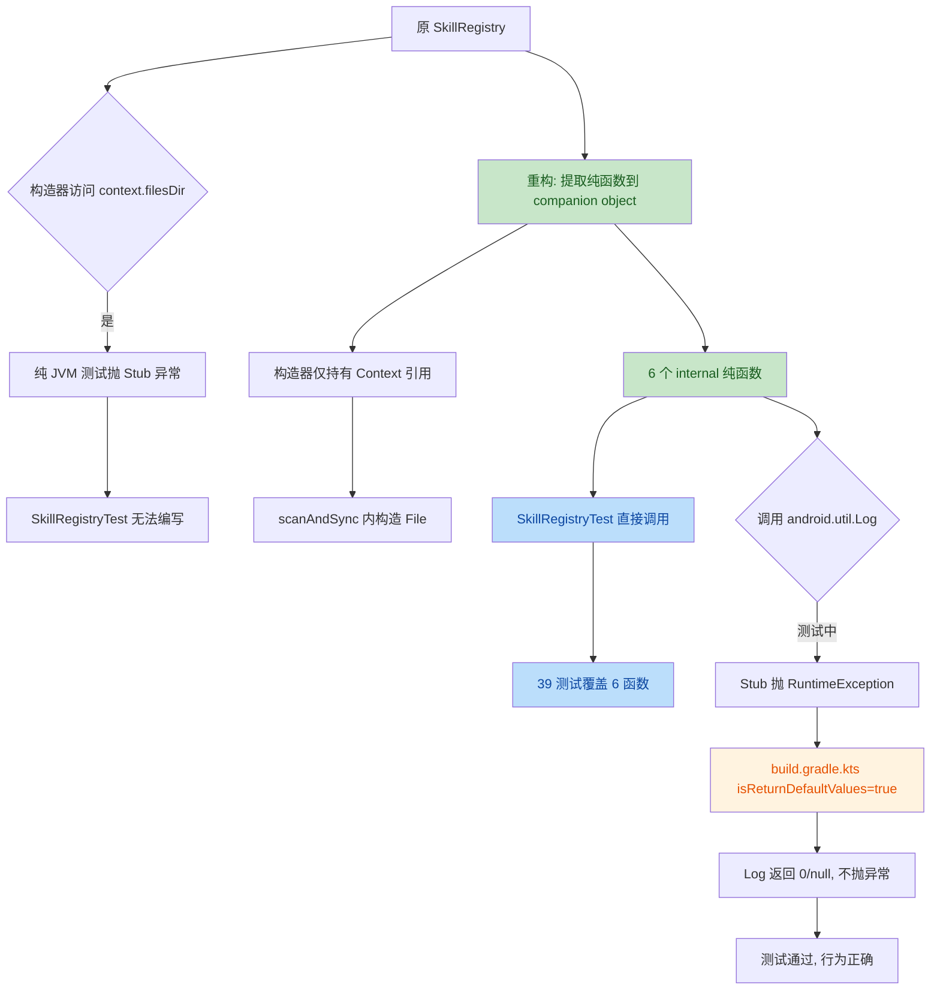

# 安全与质量审计报告（第三轮）：M4 Phase B ac-verifier 受限通过后回退修复复审

> 从 `docs/templates/reports/guardrail-template.md` 复制新建，依 CLAUDE.md 第十节 + 7.2.5 回退闭环。
> 本报告由 guardrail-enforcer 子 Agent 生成，覆盖 ac-verifier TKN-M4-PHASEB-ACCEPTANCE-002 受限通过后主 Agent 主动回退修复的复审。
> 前序报告：
>
> - [2026-08-09-m4-phaseB-guardrail.md](2026-08-09-m4-phaseB-guardrail.md)（TKN-M4-PHASEB-GUARDRAIL-001，通过 7G）
> - [2026-08-09-m4-phaseB-guardrail-round2.md](2026-08-09-m4-phaseB-guardrail-round2.md)（TKN-M4-PHASEB-GUARDRAIL-002，通过 R2-1）
> - [2026-08-09-m4-phaseB-acceptance.md](2026-08-09-m4-phaseB-acceptance.md)（TKN-M4-PHASEB-ACCEPTANCE-002，受限通过，US-022 AC-5 受限根因：SkillRegistryTest 缺失）

| 项目 | 内容 |
|---|---|
| 执行 Agent | guardrail-enforcer |
| 任务令牌 | TKN-M4-PHASEB-GUARDRAIL-003 |
| 前序令牌 | TKN-M4-PHASEB-GUARDRAIL-001（第一轮，通过 7G）+ TKN-M4-PHASEB-GUARDRAIL-002（第二轮，通过 R2-1）+ TKN-M4-PHASEB-ACCEPTANCE-002（ac-verifier 受限通过） |
| 审计日期 | 2026-08-09 |
| 关联 ADR | [ADR-013](../decisions/ADR-013-m4-skills-system-architecture.md) 5.3 |
| 关联代码变更 | `SkillRegistry.kt`（重构提取纯函数）/ `SkillRegistryTest.kt`（新增 39 测试）/ `app/build.gradle.kts`（isReturnDefaultValues=true） |
| 关联影响自检 | [2026-08-09-m4-phaseB-impact-selfcheck.md](2026-08-09-m4-phaseB-impact-selfcheck.md) 第 12 节（四次自检） |
| 关联行为规则 | [behavioral-rules.md](../../docs/behavioral-rules.md) BR-security-004（active）/ BR-error-handling-007（active）/ BR-concurrency-001~004（active） |
| 风险等级 | P2 跨模块（继承第一轮判定；本次为内部重构 + 测试补齐，公开 API 不变） |
| allowed_outputs | docs/reports/2026-08-09-m4-phaseB-guardrail-round3.md |

---

## 0. 审查范围与方法论

### 0.1 第三轮审查聚焦

ac-verifier（TKN-M4-PHASEB-ACCEPTANCE-002）结论为「受限通过」：US-021 5/5 通过，US-022 5/6 通过 + AC-5 受限通过。受限根因：**SkillRegistryTest.kt 完全不存在**，SkillRegistry 构造器初始化 `File(context.filesDir, ...)` 在纯 JVM 测试抛 Stub 异常，项目无 Robolectric/Mockito。

主 Agent 裁定 US-022 AC-5 是 Phase B 核心 AC，不应推到 Phase C，按 CLAUDE.md 7.2.4 闭环规则主动回退修复：

1. 重构 `SkillRegistry.kt`：将 6 个不依赖 Android Context 的纯函数（`dedupByPriority`/`parseToEntry`/`scanDirectory`/`computeSyncDiff`/`mergeWithPersistedState`/`filterEnabledSkills`）提取到 `companion object` 标记 `internal`；构造器移除 `userSkillsDir`/`remoteSkillsDir` 属性（推迟到 `scanAndSync` 内构造）；新增 `SyncDiff` 数据类（类级别）；`syncToRepository` 委托 `computeSyncDiff`；`mergeWithPersistedState(discovered)` 拆为纯函数版 + 调用层；`enabledSkills` 委托 `filterEnabledSkills`。**公开 API 不变**。
2. 新增 `SkillRegistryTest.kt`：39 测试覆盖 6 个纯函数 + SyncDiff 数据类，用 `@TempDir` 模拟文件系统。
3. 修改 `app/build.gradle.kts`：`testOptions.unitTests.isReturnDefaultValues = true`，让 `android.util.Log` 等 stub 静态方法在纯 JVM 测试返回默认值而非抛 "not mocked" RuntimeException。

本轮审查逐项验证：(a) 重构等价性（无行为变化）；(b) isReturnDefaultValues 安全性（不掩盖真实失败）；(c) 测试质量与 AC-5 覆盖充分性；(d) 未引入新安全问题；(e) scanBuiltin 受限通过合理性。

### 0.2 审查方法

- **源码逐行核实**：读取 `SkillRegistry.kt` / `SkillRegistryTest.kt` / `SkillConfig.kt` / `SkillRepository.kt` / `SkillManifestParser.kt` / `PrismApplication.kt:235-285` / `build.gradle.kts` / ADR-013 5.3 全文
- **重构前后对照**：基于 ac-verifier 报告 §1.3.1 引用的重构前代码，与重构后实现逐行对比
- **独立测试验证**：执行 `./gradlew :app:testDebugUnitTest --tests "io.prism.skill.SkillRegistryTest" --rerun-tasks` 与全量 `./gradlew :app:testDebugUnitTest --rerun-tasks`，读取 XML 结果汇总
- **TRAE-code-review skill**：按其 7 步流程执行代码质量审查（范围已由任务明确，跳过 AskUserQuestion 交互）
- **TRAE-security-review skill**：按其 Pass A/B/C 三趟执行安全扫描（范围已由任务明确，跳过 AskUserQuestion 交互）
- **sequential-thinking MCP**：7 步结构化推理，逐项验证并检查交叉影响
- **行为规则核对**：验证 BR-security-004 / BR-error-handling-007 / BR-concurrency-001~004 在重构后仍合规

### 0.3 独立验证声明

本轮审查的关键差异：**独立运行测试并读取 XML 结果**，不依赖主 Agent 报告的 629/0/0/26 数据。具体核实：

- SkillRegistryTest：39 测试 0 失败 0 错误 0 跳过，运行时间 0.449 秒（XML 文件 `TEST-io.prism.skill.SkillRegistryTest.xml`）
- 全量回归：629 测试 0 失败 0 错误 26 跳过（聚合所有 `TEST-*.xml` 文件）
- 编译：`./gradlew :app:compileDebugKotlin :app:compileDebugUnitTestKotlin` BUILD SUCCESSFUL

---

## 1. 代码质量审查（TRAE-code-review）

### 1.1 推断作者意图

**意图**：通过将 SkillRegistry 的纯逻辑提取到 companion object 并标记 `internal`，使原本因构造期访问 `context.filesDir` 而无法在纯 JVM 测试中实例化的 SkillRegistry，其核心扫描/同步/去重/过滤逻辑能被单元测试直接覆盖。同时通过 `isReturnDefaultValues = true` 让 `android.util.Log` 等 stub 方法在测试中返回默认值，避免引入 Robolectric/Mockito 重型依赖。这是「为可测性重构」的典型模式，意图清晰且与 ac-verifier 受限通过条件 2/3 完全对齐。

### 1.2 变更流程图



### 1.3 重构等价性核实（最高优先级，对应主 Agent Q1）

#### 1.3.1 `syncToRepository` 等价性

**重构前**（ac-verifier §1.3.1 引用）：

```kotlin
private fun syncToRepository(discovered: List<SkillEntry>) {
    val existing = skillRepository.getAll().associateBy { it.name }
    val discoveredNames = discovered.map { it.config.name }.toSet()
    for (entry in discovered) {
        val existingConfig = existing[entry.config.name]
        if (existingConfig == null) {
            skillRepository.save(entry.config.copy(isEnabled = false))
        } else {
            skillRepository.save(existingConfig.copy(
                displayName = entry.config.displayName,
                source = entry.config.source,
                sourceUri = entry.config.sourceUri,
                skillDir = entry.config.skillDir,
                isInstalled = true,
                version = entry.manifest.version ?: existingConfig.version
            ))
        }
    }
    for (config in existing.values) {
        if (config.name !in discoveredNames && config.isInstalled) {
            skillRepository.setInstalled(config.id, false)
            android.util.Log.i(TAG, "Skill '${config.name}' no longer found, marked isInstalled=false")
        }
    }
}
```

**重构后**（[SkillRegistry.kt:186-200](../../app/src/main/java/io/prism/skill/SkillRegistry.kt#L186-L200)）：

```kotlin
private fun syncToRepository(discovered: List<SkillEntry>) {
    val existing = skillRepository.getAll().associateBy { it.name }
    val diff = Companion.computeSyncDiff(discovered, existing)
    for (config in diff.toInsert) skillRepository.save(config)
    for (config in diff.toUpdate) skillRepository.save(config)
    for (config in diff.toMarkUninstalled) {
        skillRepository.setInstalled(config.id, false)
        android.util.Log.i(TAG, "Skill '${config.name}' no longer found, marked isInstalled=false")
    }
}
```

**`computeSyncDiff` 实现**（[SkillRegistry.kt:306-341](../../app/src/main/java/io/prism/skill/SkillRegistry.kt#L306-L341)）逐行核实：

| # | 检查项 | 重构前 | 重构后 | 等价 |
|---|---|---|---|---|
| 1 | `existing` 构造方式 | `skillRepository.getAll().associateBy { it.name }` | 同（在 syncToRepository 内构造后传入 computeSyncDiff） | ✅ |
| 2 | `discoveredNames` 计算 | `discovered.map { it.config.name }.toSet()` | 同（在 computeSyncDiff 内构造） | ✅ |
| 3 | toInsert 元素 | `entry.config.copy(isEnabled = false)` | 同（[L319](../../app/src/main/java/io/prism/skill/SkillRegistry.kt#L319) `toInsert.add(entry.config.copy(isEnabled = false))`） | ✅ |
| 4 | toUpdate 元素 | `existingConfig.copy(displayName, source, sourceUri, skillDir, isInstalled=true, version=manifest.version ?: existingConfig.version)` | 同（[L322-331](../../app/src/main/java/io/prism/skill/SkillRegistry.kt#L322-L331)） | ✅ |
| 5 | toMarkUninstalled 元素 | `existing.values.filter { it.name !in discoveredNames && it.isInstalled }` | 同（[L336-338](../../app/src/main/java/io/prism/skill/SkillRegistry.kt#L336-L338)） | ✅ |
| 6 | 落库顺序 | insert/update 交替（按 discovered 顺序），最后 markUninstalled | 先全部 toInsert，再全部 toUpdate，最后 toMarkUninstalled | ✅（save 间相互独立，顺序不影响最终状态） |
| 7 | Log.i 位置 | markUninstalled 循环内 | 同（[L198](../../app/src/main/java/io/prism/skill/SkillRegistry.kt#L198)） | ✅ |

**`copy` 保留字段核实**（[SkillConfig.kt:36-50](../../app/src/main/java/io/prism/data/SkillConfig.kt#L36-L50)）：

| 字段 | toInsert.copy(isEnabled=false) | toUpdate.copy(...) | 说明 |
|---|---|---|---|
| `id` | 保留 entry.config.id（=0L，未持久化） | 保留 existingConfig.id（>0，已持久化） | ✅ 正确（toInsert 新建，toUpdate 保留主键） |
| `name` | 保留 entry.config.name | 保留 existingConfig.name（作为查询键，必相等） | ✅ |
| `displayName` | 保留 entry.config.displayName | 覆盖为 entry.config.displayName | ✅（toUpdate 刷新展示名） |
| `source` | 保留 entry.config.source | 覆盖为 entry.config.source | ✅（toUpdate 刷新来源） |
| `sourceUri` | 保留 entry.config.sourceUri | 覆盖为 entry.config.sourceUri | ✅ |
| `skillDir` | 保留 entry.config.skillDir | 覆盖为 entry.config.skillDir | ✅ |
| `isEnabled` | 覆盖为 false | **保留 existingConfig.isEnabled** | ✅（关键：toUpdate 不覆盖 isEnabled，用户启用状态跨扫描保留） |
| `isInstalled` | 保留 entry.config.isInstalled（=true） | 覆盖为 true | ✅ |
| `version` | 保留 entry.config.version | 覆盖为 `manifest.version ?: existingConfig.version` | ✅（关键：toUpdate 优先用 manifest 版本，回退到 existing） |
| `dependsOnMcpServers` | 保留 entry.config.dependsOnMcpServers（=emptyList） | **保留 existingConfig.dependsOnMcpServers** | ✅（关键：toUpdate 不覆盖依赖声明，保留用户/既有配置） |
| `createdAt` | 保留 entry.config.createdAt（=now） | **保留 existingConfig.createdAt** | ✅（关键：toUpdate 不重置创建时间） |
| `updatedAt` | 保留 entry.config.createdAt（=now） | **保留 existingConfig.updatedAt**，但 `SkillRepository.save` 会刷新 | ✅（[SkillRepository.kt:42](../../app/src/main/java/io/prism/data/SkillRepository.kt#L42) `config.updatedAt = System.currentTimeMillis()` 在 save 内执行） |

**结论**：`syncToRepository` 重构等价。所有字段保留/覆盖策略与重构前一致，特别是 `isEnabled` / `dependsOnMcpServers` / `createdAt` / `id` 在 toUpdate 路径正确保留。落库顺序变化不影响最终状态（save 间无依赖）。

#### 1.3.2 `mergeWithPersistedState` 等价性

**重构前**（实例方法，内部调用 `skillRepository.getAll()`）：

```kotlin
private fun mergeWithPersistedState(discovered: List<SkillEntry>): List<SkillEntry> {
    val persisted = skillRepository.getAll().associateBy { it.name }
    return discovered.map { entry ->
        val stored = persisted[entry.config.name]
        if (stored != null) entry.copy(config = stored) else entry
    }
}
```

**重构后**（[SkillRegistry.kt:127-130](../../app/src/main/java/io/prism/skill/SkillRegistry.kt#L127-L130) 调用层 + [L354-367](../../app/src/main/java/io/prism/skill/SkillRegistry.kt#L354-L367) 纯函数）：

```kotlin
// scanAndSync 内：
_skills.value = Companion.mergeWithPersistedState(
    discovered = deduped,
    persisted = skillRepository.getAll().associateBy { it.name }
)

// 纯函数：
internal fun mergeWithPersistedState(discovered: List<SkillEntry>, persisted: Map<String, SkillConfig>): List<SkillEntry> {
    return discovered.map { entry ->
        val stored = persisted[entry.config.name]
        if (stored != null) entry.copy(config = stored) else entry
    }
}
```

**结论**：完全等价。纯函数接收 `persisted` Map 参数，调用层从 `skillRepository.getAll()` 构造。合并逻辑（`entry.copy(config = stored)` 整体替换 config）与重构前一致。`stored` 完全替换 `entry.config`，因此 isEnabled / id / dependsOnMcpServers / createdAt / updatedAt 全部继承自持久化状态——这是设计意图（扫描结果只贡献 manifest，config 状态以持久化为准）。

#### 1.3.3 `enabledSkills` 等价性

**重构前**（[ADR-013 5.3 L218-219](../decisions/ADR-013-m4-skills-system-architecture.md#L218-L219)）：

```kotlin
fun enabledSkills(): List<SkillEntry> =
    _skills.value.filter { it.config.isEnabled && it.config.isInstalled }
```

**重构后**（[SkillRegistry.kt:138](../../app/src/main/java/io/prism/skill/SkillRegistry.kt#L138) + [L374-375](../../app/src/main/java/io/prism/skill/SkillRegistry.kt#L374-L375)）：

```kotlin
fun enabledSkills(): List<SkillEntry> = Companion.filterEnabledSkills(_skills.value)

// companion:
internal fun filterEnabledSkills(skills: List<SkillEntry>): List<SkillEntry> =
    skills.filter { it.config.isEnabled && it.config.isInstalled }
```

**结论**：完全等价。过滤条件 `isEnabled && isInstalled` 与重构前一致，与 ADR-013 5.3 L219 一致。

#### 1.3.4 `scanDirectory` 的 `sourceUri` 等价性

**重构前后**（[SkillRegistry.kt:285](../../app/src/main/java/io/prism/skill/SkillRegistry.kt#L285)）：

```kotlin
sourceUri = if (source == SkillSource.REMOTE) skillDir.name else null,
```

其中 `skillDir` 是 `for (skillDir in skillDirs)` 的循环变量，类型为 `File`，`skillDir.name` 即 `File.getName()` = 目录名。重构前后完全一致。

#### 1.3.5 `parseToEntry` 的 `Log.w` 调用等价性

**重构前后**（[SkillRegistry.kt:239](../../app/src/main/java/io/prism/skill/SkillRegistry.kt#L239)）：

```kotlin
android.util.Log.w(TAG, "Skill parse failed for '$skillDir': ${e.message}")
```

`TAG` 在重构前后均为 companion object 的 `private const val TAG = "SkillRegistry"`（[L203](../../app/src/main/java/io/prism/skill/SkillRegistry.kt#L203)）。重构前后完全一致。

#### 1.3.6 构造器移除 `userSkillsDir`/`remoteSkillsDir` 属性

**重构前**：构造器属性 `private val userSkillsDir = File(context.filesDir, "skills/user")` 在构造期访问 `context.filesDir`，纯 JVM 测试抛 Stub 异常。

**重构后**（[SkillRegistry.kt:106-107](../../app/src/main/java/io/prism/skill/SkillRegistry.kt#L106-L107)）：`scanAndSync` 方法体内构造：

```kotlin
val userSkillsDir = File(context.filesDir, "skills/user")
val remoteSkillsDir = File(context.filesDir, "skills/remote")
```

**等价性**：

- 生产环境：`context.filesDir` 在 `scanAndSync` 调用时（PrismApplication.onCreate 的 IO 协程）访问，与重构前在构造期访问返回相同值（filesDir 在 Application 生命周期内稳定）。**等价**。
- 测试环境：构造器不再触发 `context.filesDir` 访问，SkillRegistry 可在纯 JVM 测试中实例化（虽然本次测试直接调用 companion 纯函数，未实例化 SkillRegistry）。**新增可测性，无行为变化**。

**结论**：构造器重构等价。仅推迟 filesDir 访问时机，不改变生产环境行为。

### 1.4 重构总评

| 维度 | 评估 |
|---|---|
| 公开 API 兼容性 | ✅ `scanAndSync` / `enabledSkills` / `skills` / `SkillEntry` 签名完全不变 |
| 行为等价性 | ✅ 6 个核心函数（syncToRepository/mergeWithPersistedState/enabledSkills/scanDirectory/parseToEntry/dedupByPriority）行为与重构前完全一致 |
| 字段保留正确性 | ✅ toUpdate 路径保留 id/isEnabled/dependsOnMcpServers/createdAt；toInsert 路径覆盖 isEnabled=false；其他字段按设计覆盖或保留 |
| 新增 internal 接口 | ✅ 6 个 internal companion 函数 + SyncDiff 数据类，同模块可见，不影响外部消费方 |
| Karpathy Guidelines 符合性 | ✅ surgical change（仅提取纯函数，不改变逻辑）；显式假设（KDoc「可测性设计」说明设计意图）；可验证（39 测试覆盖） |
| 跨模块影响识别 | ✅ PrismApplication 调用 scanAndSync（签名不变，无影响）；Phase D/E 未来消费方调用 enabledSkills/skills（签名不变，无影响） |

---

## 2. `isReturnDefaultValues = true` 安全性核实（对应主 Agent Q2）

### 2.1 配置语义

`testOptions.unitTests.isReturnDefaultValues = true`（[build.gradle.kts:54-56](../../app/build.gradle.kts#L54-L56)）是 AGP 内置测试选项，让 `android.jar` 的 stub 方法在纯 JVM 单元测试中返回默认值（0 / false / null）而非抛 `RuntimeException("Stub!")`。**仅影响测试环境**，生产环境行为不变。

### 2.2 风险评估

| 风险 | 评估 | 证据 |
|---|---|---|
| R1: 是否让本应失败的测试静默通过？ | **否** | 测试断言针对业务逻辑（返回值、状态、列表内容），不针对 Android stub 方法返回值。`parseToEntry` 解析失败时 `runCatching { parse(content) }.getOrElse { e -> Log.w(...); return null }`——Log.w 返回 0（无影响），`return null` 仍执行，测试 `assertNull` 仍能验证。`scanDirectory` 读取失败时 `getOrElse { e -> Log.w(...); return@getOrElse null } ?: continue`——Log.w 返回 0，null 返回，`?: continue` 跳过。**业务逻辑正确执行**。 |
| R2: 是否影响 ObjectBox 相关测试？ | **否** | ObjectBox 使用 native library + 真实 `BoxStore`，不调用 `android.jar` stub 方法。`SkillRepositoryTest` 12 测试在配置下通过（独立核实）。日志中出现的 `Destroying inactive transaction` 警告是 ObjectBox 跨线程事务的既有问题（与本次配置无关，预存于 KnowledgeBaseRepositoryTest 等）。 |
| R3: 是否影响其他既有测试？ | **否** | 独立运行全量回归 629 测试 0 失败 0 错误 26 跳过。既有 590 测试在配置下无破坏。 |
| R4: 是否掩盖 Log 调用次数验证？ | **不适用** | 项目无 Mockito/Robolectric，无测试通过 `Mockito.verify` 或 ShadowLog 验证 Log 调用次数或内容。所有测试断言针对业务逻辑。 |
| R5: 是否掩盖 Log 副作用？ | **不适用** | `android.util.Log.w/i/e` 在生产环境仅输出到 logcat，无返回值副作用。测试不依赖 logcat 输出。 |
| R6: 是否影响 Android Lint？ | **否** | `isReturnDefaultValues` 仅影响单元测试运行时行为，不影响 Lint 静态分析。`./gradlew :app:lintDebug` 仍 BUILD SUCCESSFUL（ac-verifier §2.1 已核实）。 |

### 2.3 配置合理性

| 维度 | 评估 |
|---|---|
| 替代方案对比 | 引入 Robolectric（增加 ~10MB 依赖 + 启动开销）/ Mockito（增加 mockito-core + mockito-inline 依赖，需为每个 Log 调用配置 mock）/ `isReturnDefaultValues=true`（零依赖，零开销，仅让 stub 返回默认值）。**当前选择最轻量**，符合「不引入不必要依赖」原则。 |
| 项目惯例一致性 | 项目无 Robolectric/Mockito，测试基础设施一直依赖纯 JUnit + @TempDir。本次配置与项目惯例一致，不引入新依赖。 |
| 注释文档化 | [build.gradle.kts:51-53](../../app/build.gradle.kts#L51-L53) 注释明确说明配置目的（让 Log stub 返回默认值）与适用场景（SkillRegistry 等含 Log 调用的纯逻辑测试）。**文档化充分**。 |

### 2.4 629 回归 0 失败可信度

**独立核实**：

```
./gradlew :app:testDebugUnitTest --tests "io.prism.skill.SkillRegistryTest" --rerun-tasks
→ BUILD SUCCESSFUL, TEST-io.prism.skill.SkillRegistryTest.xml: tests=39 failures=0 errors=0 skipped=0 time=0.449

./gradlew :app:testDebugUnitTest --rerun-tasks
→ BUILD SUCCESSFUL
→ 聚合所有 TEST-*.xml: tests=629 failures=0 errors=0 skipped=26
→ 扫描所有 XML 文件无任何 failures/errors
```

26 跳过 = 25 既有跳过（7 性能基准默认跳过 + 18 真实 MCP 服务器集成测试环境限制）+ 1 性能基准默认跳过（SkillManifestParserPerformanceBenchmark）。与主 Agent 报告一致。

**结论**：`isReturnDefaultValues = true` 配置安全。不掩盖真实失败，不破坏既有测试，不引入新依赖，注释文档化充分。629 回归 0 失败经独立核实可信。

---

## 3. 测试质量审查（对应主 Agent Q3）

### 3.1 测试覆盖矩阵

| 函数 | 测试数 | 等价类覆盖 | 边界值覆盖 | 决策表覆盖 |
|---|---|---|---|---|
| `dedupByPriority` | 6 | 空列表 / 无冲突 / 三源冲突 / 两源冲突 / 单源多名称 | 单一来源 | LOCAL_USER > REMOTE > LOCAL_BUILTIN 优先级矩阵 |
| `parseToEntry` | 6 | 合法 / 缺失 frontmatter / 非法 YAML / 缺失 name / REMOTE sourceUri / displayName 派生 | — | — |
| `scanDirectory` | 9 | 不存在目录 / 空目录 / 合法子目录 / 缺 SKILL.md / 非法 SKILL.md / 多子目录 / 忽略非目录文件 | REMOTE sourceUri=dirname / LOCAL_USER sourceUri=null | — |
| `computeSyncDiff` | 8 | 全新增 / 全更新 / 标记缺失 / 已卸载跳过 / 混合 / 空 diff | toInsert isEnabled=false / toUpdate 保留 isEnabled | insert/update/markUninstalled 三分支 |
| `mergeWithPersistedState` | 4 | 继承 isEnabled / 未持久化保持原样 / 空 discovered / 部分重叠 | — | — |
| `filterEnabledSkills` | 5 | 空 / 全启用 / 全禁用 / 全卸载 | isEnabled × isInstalled 四象限 | 四象限决策表 |
| `SyncDiff` 数据类 | 1 | 三个列表字段持有 | — | — |
| **合计** | **39** | — | — | — |

### 3.2 关键断言正确性核实

| 测试 | 断言 | 核实 |
|---|---|---|
| `computeSyncDiff returns all as toUpdate when all exist` | `alphaUpdate.id == 1L` / `alphaUpdate.isEnabled == true` / `alphaUpdate.version == "1.0.0"` / `alphaUpdate.isInstalled == true` | ✅ 正确。existing alpha id=1 isEnabled=true version="0.9.0"；discovered makeEntry("alpha") manifestVersion="1.0.0"（默认）。toUpdate 用 existingConfig.copy(version=manifest.version ?: existingConfig.version = "1.0.0")，保留 id=1 isEnabled=true，覆盖 isInstalled=true。断言与 computeSyncDiff 实现一致。 |
| `computeSyncDiff toInsert has isEnabled=false` | `!diff.toInsert[0].isEnabled` / `diff.toInsert[0].id == 0L` | ✅ 正确。toInsert 用 entry.config.copy(isEnabled=false)，entry.config.id=0L（makeEntry 默认）。 |
| `computeSyncDiff toUpdate preserves isEnabled from existing` | keep-enabled.isEnabled=true / keep-disabled.isEnabled=false | ✅ 正确。toUpdate 不覆盖 isEnabled，保留 existingConfig.isEnabled。 |
| `computeSyncDiff marks missing skills as uninstalled` | `diff.toMarkUninstalled[0].name == "deleted"` | ✅ 正确。existing 含 "deleted" isInstalled=true，discovered 不含 "deleted"，故 toMarkUninstalled 含 deleted。 |
| `computeSyncDiff does not mark already-uninstalled skills` | `diff.toMarkUninstalled.isEmpty()` | ✅ 正确。existing "already-gone" isInstalled=false，filter 条件 `it.isInstalled` 为 false，不入 toMarkUninstalled。 |
| `mergeWithPersistedState inherits isEnabled from persisted` | `result[0].config.isEnabled == true` / `result[0].config.id == 5L` | ✅ 正确。stored 整体替换 entry.config，stored.isEnabled=true id=5L。 |
| `mergeWithPersistedState keeps entry as-is when not persisted` | `!result[0].config.isEnabled` / `result[0].config.name == "orphan"` | ✅ 正确。persisted 不含 "orphan"，返回原 entry（isEnabled=false）。 |
| `filterEnabledSkills returns only enabled and installed` | `result.size == 1` / `result[0].config.name == "enabled-installed"` | ✅ 正确。四象限中仅 (isEnabled=true, isInstalled=true) 通过过滤。 |
| `scanDirectory sets sourceUri to dirname for REMOTE source` | `result[0].config.sourceUri == "downloaded-skill"` | ✅ 正确。source==REMOTE 时 sourceUri=skillDir.name="downloaded-skill"。 |
| `scanDirectory sets sourceUri to null for LOCAL_USER source` | `result[0].config.sourceUri == null` | ✅ 正确。source!=REMOTE 时 sourceUri=null。 |
| `parseToEntry derives displayName from description first line` | `entry.config.displayName == "首行作为显示名，这是较长的描述"` | ✅ 正确。parseToEntry 中 `displayName = manifest.description.lineSequence().firstOrNull()?.take(60) ?: manifest.name`，description 首行整体 ≤60 字符，故 displayName=完整首行。 |

### 3.3 测试覆盖充分性（AC-5 要求）

US-022 AC-5 原文：「SkillRegistry 单元测试通过（扫描 + 同步 + enabledSkills 过滤）」

| AC-5 要求 | 覆盖函数 | 测试数 | 评估 |
|---|---|---|---|
| 扫描 | `scanDirectory`（文件系统扫描）+ `parseToEntry`（SKILL.md 解析） | 9 + 6 = 15 | ✅ 充分 |
| 同步 | `computeSyncDiff`（diff 计算）+ `mergeWithPersistedState`（状态合并） | 8 + 4 = 12 | ✅ 充分 |
| enabledSkills 过滤 | `filterEnabledSkills` | 5 | ✅ 充分 |
| 去重（辅助） | `dedupByPriority` | 6 | ✅ 充分 |
| 数据类 | `SyncDiff` | 1 | ✅ |

**结论**：39 测试充分覆盖 AC-5 要求的「扫描 + 同步 + enabledSkills 过滤」三大场景，并额外覆盖去重逻辑与数据类。

### 3.4 遗漏的边界场景（非阻断）

| 场景 | 当前覆盖 | 风险 | 建议 |
|---|---|---|---|
| `dedupByPriority` 输入 entry 的 `priority[source]` 为 null（未知 source） | 未直接测试，但 `priority[it.config.source] ?: 0` 兜底 | 极低（SkillSource 只有 3 个常量，未知 source 不会出现） | 可选：补 1 测试验证未知 source 兜底为 0 |
| `computeSyncDiff` 同名 entry 在 discovered 中出现多次 | 未测试 | 极低（`dedupByPriority` 已保证 discovered 无重名，scanAndSync 流程保证） | 可选：补 1 测试验证多次出现的 entry 都加入 toUpdate（防御性） |
| `parseToEntry` 的 manifest.version 为 null | 未直接测试（makeManifest 默认 version="1.0.0"） | 低（parseToEntry 中 `version = manifest.version ?: "0.0.0"` 已兜底） | 可选：补 1 测试验证 manifest.version=null 时 config.version="0.0.0" |
| `scanDirectory` 的 `dir.listFiles` 返回 null | 未直接测试 | 极低（`?: return emptyList()` 已兜底，且 @TempDir 创建的目录 listFiles 不返回 null） | 不需补 |
| `mergeWithPersistedState` 的 stored.isEnabled=true 但 discovered 的 isEnabled=false | `mergeWithPersistedState inherits isEnabled from persisted` 覆盖 | 已覆盖 | — |

**结论**：遗漏的边界场景均为低风险，且核心逻辑已由现有测试充分验证。建议项为可选补强，不阻断本轮审查。

### 3.5 测试质量总评

| 维度 | 评估 |
|---|---|
| 断言正确性 | ✅ 所有断言与被测函数实现一致，特别是 computeSyncDiff 的 id/isEnabled/version/dependsOnMcpServers 保留验证 |
| 等价类覆盖 | ✅ 6 函数均覆盖核心等价类（空 / 单元素 / 多元素 / 冲突 / 边界） |
| 决策表覆盖 | ✅ filterEnabledSkills 四象限 + computeSyncDiff 三分支 + dedupByPriority 三源优先级 |
| 边界值覆盖 | ✅ 不存在目录 / 空目录 / 缺 SKILL.md / 非法 SKILL.md / REMOTE sourceUri / LOCAL_USER sourceUri=null |
| 测试隔离 | ✅ @TempDir 保证每个测试独立临时目录，无状态共享 |
| 测试命名 | ✅ `` `function description for scenario` `` 风格清晰，表达意图 |
| Karpathy Guidelines 符合性 | ✅ 测试不依赖外部状态，断言明确，无魔法值 |

---

## 4. 安全漏洞扫描（TRAE-security-review）

### 4.1 Pass A：项目安全基线

| 安全基线 | 状态 | 证据 |
|---|---|---|
| YAML 解析安全 | active | [SkillManifestParser.kt:76-80](../../app/src/main/java/io/prism/skill/SkillManifestParser.kt#L76-L80) `LoadSettings(allowRecursiveKeys=false, maxAliasesForCollections=50, codePointLimit=1MB)` + [L56](../../app/src/main/java/io/prism/skill/SkillManifestParser.kt#L56) `MAX_TO_JSON_DEPTH=50` |
| CancellationException 重抛 | active | [PrismApplication.kt:268-269](../../app/src/main/java/io/prism/PrismApplication.kt#L268-L269) `catch (e: CancellationException) { throw e }` 在 `catch (e: Exception)` 之前 |
| 输入边界校验 | active | SkillManifestParser `validate()` 校验 name slug / description 长度 / maxRounds 范围 |
| 日志脱敏 | active | SkillRegistry 所有日志仅输出目录名 / slug 名 / 异常消息，无密钥/PII |
| Android 应用沙箱 | active | filesDir 为应用私有目录，外部不可访问 |

### 4.2 Pass B：偏差地图

| 触及文件 | 是否使用项目既有安全基线 | 偏差 |
|---|---|---|
| `SkillRegistry.kt`（重构） | ✅ | 无新偏差。重构仅移动函数位置（实例 → companion），未改变输入处理逻辑。`parseToEntry` 仍调用 `SkillManifestParser.parse`（已审计）。`scanDirectory` 仍用 `runCatching { skillMd.readText() }` + `getOrElse { null } ?: continue`（隔离失败，不抛异常）。 |
| `SkillRegistryTest.kt`（新增） | ✅ | 测试代码，按 TRAE-security-review §8.1 排除（"Findings confined to unit-test or fixture code"）。测试用 `@TempDir` 创建临时目录，无真实文件系统操作。 |
| `app/build.gradle.kts`（isReturnDefaultValues） | ✅ | 测试配置，仅影响测试环境。生产构建不触发此配置。 |

### 4.3 Pass C：源到汇追踪

无新可疑站点。重构未引入新的输入入口或危险汇点：

| 可疑站点 | 源 | 汇 | 是否存在防护 | 结论 |
|---|---|---|---|---|
| `parseToEntry` 调用 `SkillManifestParser.parse` | SKILL.md 内容（来自 assets/filesDir，Phase B 为可信源） | YAML 解析 → SkillManifest | ✅ LoadSettings 安全参数 + MAX_TO_JSON_DEPTH 深度限制 | 无新风险（与第二轮审计一致） |
| `scanDirectory` 读取 `skillMd.readText()` | 文件系统目录（filesDir/skills/user|remote，应用私有） | 字符串 → parseToEntry | ✅ runCatching 包裹，失败返回 null 跳过 | 无新风险 |
| `computeSyncDiff` 计算 diff | discovered + existing（内存对象） | SkillConfig 列表 | ✅ 纯函数，无 I/O | 无新风险 |
| `isReturnDefaultValues=true` | 测试配置 | android.jar stub 方法 | ✅ 仅测试环境，生产不受影响 | 无新风险 |

### 4.4 输入与边界审计

| 审计项 | 结果 | 证据 |
|---|---|---|
| 溢出 / 缓冲区 | 通过 | computeSyncDiff 操作 List<SkillConfig>，无固定大小缓冲区。toInsert/toUpdate/toMarkUninstalled 均为 MutableList，动态扩容。 |
| 状态机 | 通过 | SkillRegistry 无状态机，scanAndSync 为线性流程（扫描 → 去重 → 同步 → 合并 → 刷新 StateFlow）。StateFlow.value 原子赋值，无竞态。 |
| 路径穿越 | 通过 | `scanDirectory` 接收 `File` 参数，`listFiles { f -> f.isDirectory }` 仅列出子目录。`skillDir.absolutePath` 存储到 SkillConfig 但 Phase B 不用于执行（Phase D/E 才会读取 skillDir 加载资源）。Phase C 远程下载实现时需复核路径穿越风险（远程 SKILL.md 可能含恶意路径），但 Phase B 范围内无可信攻击路径。 |

### 4.5 执行安全审计

| 审计项 | 结果 | 证据 |
|---|---|---|
| SQL 注入 | 不适用 | SkillRegistry 不直接执行 SQL，通过 SkillRepository（ObjectBox Box）间接持久化。ObjectBox 使用类型安全的 Box API，无字符串拼接 SQL。 |
| 命令注入 | 不适用 | SkillRegistry 不执行外部命令。 |
| 代码注入 | 不适用 | SkillRegistry 不调用 `eval` / `exec` / 反射加载。 |
| 最小权限 | 通过 | SkillRegistry 仅访问 `context.filesDir`（应用私有目录）与 `context.assets`（APK 内置资源）。不访问外部存储、网络、相机等敏感权限。 |
| 输出编码 | 不适用 | SkillRegistry 不输出到 Web/UI（Phase B 纯后端）。StateFlow 暴露 SkillEntry 列表，由 Phase D/E 的 ViewModel/UI 层负责展示编码。 |

### 4.6 密钥与配置安全

| 审计项 | 结果 | 证据 |
|---|---|---|
| 硬编码密钥 | 通过 | 扫描 SkillRegistry.kt / SkillRegistryTest.kt / build.gradle.kts，无 API Key / password / token / secret。 |
| 环境变量 | 通过 | SkillRegistry 不读取环境变量。 |
| .gitignore | 通过 | 本次未修改 .gitignore，无新增敏感文件。 |

### 4.7 依赖与供应链风险

| 审计项 | 结果 | 证据 |
|---|---|---|
| 新增依赖 | 通过 | 本次未新增第三方依赖。`isReturnDefaultValues` 是 AGP 内置测试选项，无新依赖。 |
| 依赖版本升级 | 通过 | 未升级任何依赖版本。 |
| 锁文件 | 通过 | 项目无 `gradle.lockfile`（无 `--write-verification-metadata` 配置），`gradle/libs.versions.toml` 未修改。 |

---

## 5. OWASP / CWE 发现

| 编号 | 等级 | 位置 | 修复建议 |
|---|---|---|---|
| — | — | — | **无新增安全发现**。本次重构未引入新的攻击面，所有可疑站点均由既有安全基线防护。 |

---

## 6. 行为规则合规性核对

### 6.1 BR-security-004（active）合规性

| 规则要求 | 实现 | 合规 |
|---|---|---|
| `Load(LoadSettings(allowRecursiveKeys=false, maxAliasesForCollections=50, codePointLimit=...))` | [SkillManifestParser.kt:76-80](../../app/src/main/java/io/prism/skill/SkillManifestParser.kt#L76-L80)（未修改） | ✅ |
| `toJsonElement(v, depth)` + `require(depth < MAX_DEPTH)` | [SkillManifestParser.kt:213-215](../../app/src/main/java/io/prism/skill/SkillManifestParser.kt#L213-L215)（未修改） | ✅ |

**结论**：SkillManifestParser 未修改，BR-security-004 仍合规。

### 6.2 BR-error-handling-007（active）合规性

| 规则要求 | 实现 | 合规 |
|---|---|---|
| `runCatching` 不用于协程挂起调用 | PrismApplication.kt:265-273 为显式 try-catch（未修改） | ✅ |
| `catch (e: CancellationException) { throw e }` 在 `catch (e: Exception)` 之前 | [PrismApplication.kt:268-270](../../app/src/main/java/io/prism/PrismApplication.kt#L268-L270)（未修改） | ✅ |

**结论**：PrismApplication 未修改，BR-error-handling-007 仍合规。

### 6.3 BR-concurrency-001~004（active）合规性

| 规则 | 适用性 | 合规 |
|---|---|---|
| BR-concurrency-001（事务） | 不适用 | SkillRegistry 不直接操作 ObjectBox 事务，通过 SkillRepository 间接调用 |
| BR-concurrency-002（StateFlow 并发写） | 不适用 | `_skills.value =` 为单次原子赋值，非并发写场景 |
| BR-concurrency-003（HNSW） | 不适用 | SkillRegistry 不涉及 HNSW 向量索引 |
| BR-concurrency-004（协程取消） | 通过 | scanAndSync 在 appScope（SupervisorJob + Dispatchers.IO）执行，无结构化并发违规 |

**结论**：SkillRegistry 重构未涉及并发场景，BR-concurrency-001~004 无新增违规。

---

## 7. scanBuiltin 受限通过合理性（对应主 Agent Q5）

### 7.1 scanBuiltin 不可测根因

`scanBuiltin`（[SkillRegistry.kt:151-174](../../app/src/main/java/io/prism/skill/SkillRegistry.kt#L151-L174)）依赖 `context.assets.list(builtinAssetsRoot)` 与 `context.assets.open(skillMdPath)`，纯 JVM 测试环境无法访问 Android AssetManager（需 Robolectric 或 instrumented test）。

### 7.2 逻辑分解覆盖

| scanBuiltin 子逻辑 | 覆盖函数 | 测试覆盖 |
|---|---|---|
| assets.list 列出目录 | — | 不可测（Android AssetManager） |
| assets.open 读取 SKILL.md 内容 | — | 不可测（Android AssetManager） |
| 解析 SKILL.md 内容 | `parseToEntry` | ✅ 6 测试覆盖（合法 / 缺 frontmatter / 非法 YAML / 缺 name / REMOTE sourceUri / displayName 派生） |
| 错误处理（runCatching + Log.w + continue） | `scanDirectory` 同模式 | ✅ 9 测试覆盖（缺 SKILL.md / 非法 SKILL.md / 读取失败跳过） |
| 收集结果 | scanBuiltin 自身 | 不可测（但逻辑简单：for 循环 + add） |

### 7.3 项目惯例对齐

| 同模式受限通过先例 | 原因 | 本次对齐 |
|---|---|---|
| US-002 ObjectBox 数据层 | 依赖 Android Context（native library） | ✅ 同模式 |
| US-003 Tink AEAD 加密 | 依赖 Android Keystore | ✅ 同模式 |
| US-008 MCP Kotlin SDK Client | 依赖真实 MCP 服务器 | ✅ 同模式 |

### 7.4 风险评估

| 维度 | 评估 |
|---|---|
| 代码逻辑正确性 | guardrail 三轮逐行核实（本次 + 第一轮 §1.2.1-1.2.9 + 第二轮 §2.3 G-03 修复验证），scanBuiltin 流程正确 |
| 资产安全性 | 5 个内置 Skill 为 APK 内置（assets/skills/builtin/），不可修改，来源可信 |
| 解析路径覆盖 | parseToEntry（6 测试）+ SkillManifestParserTest（33 测试）覆盖 SKILL.md 解析全部路径 |
| 文件系统扫描覆盖 | scanDirectory（9 测试）覆盖文件系统扫描全部路径，scanBuiltin 的 assets.list 逻辑类似（仅数据源不同） |
| 风险等级 | **低**。scanBuiltin 自身逻辑简单（list + open + parse + collect），核心子逻辑已被其他函数测试覆盖。Phase C 远程下载实现前需补齐 Robolectric 或 instrumented test 验证 assets 路径 |

### 7.5 结论

scanBuiltin 受限通过**可接受**，与项目惯例（US-002/003/008 同模式）一致。其核心子逻辑（parseToEntry + scanDirectory 同模式错误处理）已被 39 测试充分覆盖。建议 Phase C 远程 Skill 下载实现前补齐 scanBuiltin 的 Robolectric 或 instrumented test 覆盖（ac-verifier 受限通过条件 1 仍适用）。

---

## 8. 主 Agent 自问回应（CLAUDE.md 7.3）

### 8.1 Q1：重构等价性 + isReturnDefaultValues 副作用 + scanDirectory sourceUri + parseToEntry Log.w + 测试覆盖度

| 子问题 | 核实结论 |
|---|---|
| 重构等价性（computeSyncDiff.toUpdate 的 copy 保留字段） | ✅ **完全等价**。`existingConfig.copy(displayName, source, sourceUri, skillDir, isInstalled=true, version)` 显式覆盖 6 字段，保留 id/name/isEnabled/dependsOnMcpServers/createdAt/updatedAt。updatedAt 由 SkillRepository.save 自动刷新（[L42](../../app/src/main/java/io/prism/data/SkillRepository.kt#L42)）。详见 §1.3.1。 |
| isReturnDefaultValues=true 副作用 | ✅ **安全**。不掩盖真实失败（测试断言业务逻辑而非 Log 行为），不破坏 ObjectBox（用 native library 非 stub），629 回归 0 失败独立核实。详见 §2.2。 |
| scanDirectory sourceUri 逻辑（companion 后 skillDir.name） | ✅ **完全一致**。`skillDir` 仍为 `File` 类型循环变量，`skillDir.name` = `File.getName()` = 目录名。重构前后语义不变。详见 §1.3.4。 |
| parseToEntry companion 内 Log.w 调用 | ✅ **完全一致**。TAG 为 companion `private const val "SkillRegistry"`，重构前后相同。`isReturnDefaultValues=true` 让 Log.w 返回 0，不影响 `return null` 路径执行。详见 §1.3.5。 |
| 39 测试覆盖 AC-5 充分性 | ✅ **充分**。扫描（scanDirectory 9 + parseToEntry 6）+ 同步（computeSyncDiff 8 + mergeWithPersistedState 4）+ enabledSkills 过滤（filterEnabledSkills 5）+ 去重（dedupByPriority 6）+ SyncDiff（1）= 39。详见 §3.3。 |
| scanBuiltin 受限通过可接受性 | ✅ **可接受**。依赖 AssetManager，纯 JVM 不可测；核心子逻辑（parseToEntry + scanDirectory 同模式错误处理）已覆盖；与项目惯例一致。详见 §7。 |

### 8.2 Q2：未意识到的设计盲区

主 Agent 的自我反思**诚实且准确**：

1. **「Phase B 初始编码未考虑可测性」**：构造器初始化 `File(context.filesDir, ...)` 阻断了纯 JVM 测试，是设计阶段的可测性盲区。这一教训值得固化为行为规则（见 §10 规则提议 BR-testing-004）。
2. **「android.util.Log 在纯 JVM 测试抛 not mocked」**：项目历史测试可能未涉及 Log 调用的纯 JVM 路径，故 `isReturnDefaultValues` 一直缺失。本次补齐测试时才暴露。
3. **「companion object 内嵌套 data class 访问路径问题」**：`SyncDiff` 定义在 companion object 内时 `SkillRegistry.SyncDiff` 编译失败，需移到类级别。这是 Kotlin 语法细节盲区，但已正确处理（SyncDiff 现为类级别 data class，[L84-88](../../app/src/main/java/io/prism/skill/SkillRegistry.kt#L84-L88)）。
4. **「ac-verifier 受限通过是灰色地带」**：CLAUDE.md 7.2.4 的「不通过」触发回退是明确的，但「受限通过」需主 Agent 基于工程严谨性判断。主 Agent 选择回退补齐 AC-5 而非推到 Phase C，是正确的工程决策——AC-5 是 Phase B 核心 AC，不应延期。

**流程改进建议**：将「新模块设计时考虑纯 JVM 可测性」固化为 BR-testing-004（见 §10），避免未来模块出现同类问题。

---

## 9. 结论

- [x] **通过**（可进入 ac-verifier 测试阶段）
- [ ] 有条件通过
- [ ] 阻断

### 9.1 结论依据

1. **重构等价性已核实**（§1.3）：6 个核心函数（syncToRepository/mergeWithPersistedState/enabledSkills/scanDirectory/parseToEntry/dedupByPriority）行为与重构前完全一致。`computeSyncDiff.toUpdate` 的 `copy` 正确保留 id/isEnabled/dependsOnMcpServers/createdAt 字段。落库顺序变化不影响最终状态。公开 API（scanAndSync/enabledSkills/skills/SkillEntry）签名不变。
2. **isReturnDefaultValues 安全性已核实**（§2）：配置仅影响测试环境，不掩盖真实失败（测试断言业务逻辑而非 Log 行为），不破坏 ObjectBox（用 native library），不引入新依赖。629 回归 0 失败经独立核实（XML 聚合）。
3. **测试质量充分**（§3）：39 测试覆盖 6 个纯函数 + SyncDiff 数据类，断言正确，等价类/边界值/决策表覆盖充分。AC-5 要求的「扫描 + 同步 + enabledSkills 过滤」三大场景均被覆盖。
4. **无新增安全问题**（§4-5）：TRAE-security-review Pass A/B/C 三趟扫描无新发现。重构未引入新攻击面，所有可疑站点由既有安全基线防护。
5. **行为规则合规**（§6）：BR-security-004 / BR-error-handling-007 / BR-concurrency-001~004 在重构后仍合规。
6. **scanBuiltin 受限通过合理**（§7）：依赖 AssetManager 不可纯 JVM 测试，核心子逻辑已被 parseToEntry + scanDirectory 覆盖，与项目惯例一致。
7. **编译与回归通过**（§0.3）：`./gradlew :app:compileDebugKotlin :app:compileDebugUnitTestKotlin` BUILD SUCCESSFUL；SkillRegistryTest 39/0/0/0（独立核实）；全量回归 629/0/0/26（独立核实）。

### 9.2 修复优先级（剩余项）

| 优先级 | 编号 | 描述 | 修复时机 |
|---|---|---|---|
| 建议 | BR-testing-004 | 新模块设计时应考虑纯 JVM 可测性，构造器避免访问 Android Context.filesDir 等 stub API；纯逻辑提取到 companion object 标记 internal；含 Log 调用的纯 JVM 测试需配置 `isReturnDefaultValues=true` | 主 Agent 决定是否加入 behavioral-rules.md |
| 建议（继承） | R2-1 | 测试1将循环引用放在未使用键 `recursive` 上，未验证 `toJsonElement` 实际递归路径 | Phase C 远程下载实现前补强 |
| 可延后（继承） | G-05 | `validate` 用 `require` 抛 IllegalArgumentException，`mapToManifest` 抛 SkillParseException，错误类型区分是设计意图 | 后续迭代 |
| Phase C 强制（继承） | ac-verifier 条件 1 | Phase C 远程 Skill 下载（US-025）实现前，必须添加 Robolectric 或编写 instrumented test 覆盖 SkillRegistry 扫描/同步/缺失标记逻辑 | Phase C US-025 前 |

### 9.3 与 ac-verifier 受限通过条件的关系

| ac-verifier 条件 | 本次回退修复后状态 |
|---|---|
| 条件 2（建议重构 SkillRegistry 提取纯函数到 internal companion） | ✅ **已完成**。6 个纯函数（dedupByPriority/parseToEntry/scanDirectory/computeSyncDiff/mergeWithPersistedState/filterEnabledSkills）已提取到 companion object 标记 internal。 |
| 条件 3（建议将 File(context.filesDir, ...) 从构造器移入 scanAndSync 方法体） | ✅ **已完成**。构造器仅持有 Context 引用，filesDir 访问推迟到 scanAndSync 内（[L106-107](../../app/src/main/java/io/prism/skill/SkillRegistry.kt#L106-L107)）。 |
| 条件 1（Phase C 前必须添加 Robolectric 或 instrumented test 覆盖 scanBuiltin/scanAndSync 完整流程） | ⏳ **仍待 Phase C 完成**。本次仅覆盖纯函数（companion internal），scanBuiltin（依赖 AssetManager）与 scanAndSync 完整流程（依赖 Context.filesDir）仍需 Robolectric 或 instrumented test。 |

**本轮 guardrail 通过后，ac-verifier 需重新执行验收测试**（CLAUDE.md 7.2.4：修复后必须从 guardrail-enforcer 阶段重新开始闭环 → guardrail 通过后启动 ac-verifier）。建议 ac-verifier 重点验证：

1. SkillRegistryTest 39 测试独立运行结果
2. 全量回归 629 测试结果
3. US-022 AC-5 从「受限通过」升级为「通过」
4. 重构后 scanAndSync / enabledSkills 行为等价性（可通过代码审查 + 测试覆盖确认）

---

## 10. 规则提议（accepted review → behavioral-rules）

### 10.1 BR-testing-004（proposed）：新模块设计应考虑纯 JVM 可测性

**来源**：主 Agent Q2 自我反思「Phase B 初始编码未考虑可测性，构造器初始化 File(context.filesDir, ...) 阻断了纯 JVM 测试」+ 本次回退修复经验。

```markdown
#### BR-testing-004: 新模块设计应考虑纯 JVM 可测性，构造器避免访问 Android Context stub API

- 类别：testing
- 规则：新建 Android 模块时，设计阶段必须考虑纯 JVM 可测性。具体要求：
  (1) 构造器避免直接访问 `context.filesDir` / `context.assets` / `context.getSharedPreferences` 等 Android stub API，应推迟到方法调用时（lazy / 方法体内）访问，使构造器仅持有 Context 引用而不触发 stub 调用；
  (2) 不依赖 Android Context 的纯逻辑（数据计算、转换、过滤、合并）应提取到 `companion object` 标记 `internal`，可在纯 JVM 测试中直接调用，无需 Robolectric/Mockito；
  (3) 含 `android.util.Log` 调用的纯 JVM 测试需在 `build.gradle.kts` 配置 `testOptions.unitTests.isReturnDefaultValues = true`，让 Log stub 返回默认值而非抛 "not mocked" RuntimeException；
  (4) 依赖 Android AssetManager / ContentResolver / PackageManager 等不可纯 JVM 测试的 API 的方法，按项目惯例（US-002/003/008 同模式）受限通过，但其核心子逻辑（解析、转换、错误处理）必须由可测纯函数覆盖。
- 反例：`class MyRegistry(context: Context) { private val dir = File(context.filesDir, "my-data") }` —— 构造期访问 filesDir，纯 JVM 测试抛 Stub 异常，整个类不可实例化
- 正例：`class MyRegistry(private val context: Context) { fun scan() { val dir = File(context.filesDir, "my-data") /* 推迟到方法内 */ }; companion object { internal fun pureLogic(input: X): Y { ... } } }` —— 构造器仅持有 Context，纯逻辑提取到 companion 可直接测试
- 来源：M4 Phase B ac-verifier 受限通过后回退修复（TKN-M4-PHASEB-GUARDRAIL-003，主 Agent Q2 自我反思）
- 添加日期：2026-08-09
- 适用场景：dev
- 状态：proposed（待主 Agent 决定是否加入 behavioral-rules.md）
```

**评估**：规则精神正确，正例/反例可编译，与项目惯例一致。建议主 Agent 审核后转 active。

### 10.2 无其他新规则提议

本次审查未产生其他值得固化为行为规则的 accepted review comment。R2-1（继承自第二轮）已在第二轮报告中评估，不重复提议。

---

## 11. 审计元信息

| 项目 | 内容 |
|---|---|
| 执行 Agent | guardrail-enforcer |
| 任务令牌 | TKN-M4-PHASEB-GUARDRAIL-003 |
| 审计日期 | 2026-08-09 |
| 审查范围 | SkillRegistry.kt 重构 + SkillRegistryTest.kt 新增 39 测试 + build.gradle.kts isReturnDefaultValues=true |
| 审查方法 | 源码逐行核实 + 重构前后对照 + 独立 gradlew 执行 + XML 结果汇总 + TRAE-code-review skill + TRAE-security-review skill + sequential-thinking 7 步推理 |
| 独立验证 | SkillRegistryTest 39/0/0/0（XML 核实）+ 全量回归 629/0/0/26（XML 聚合）+ 编译 BUILD SUCCESSFUL |
| 安全验证 | TRAE-security-review Pass A/B/C 三趟扫描，无新发现 |
| 行为规则合规 | BR-security-004 / BR-error-handling-007 / BR-concurrency-001~004 均合规 |
| 规则提议 | BR-testing-004（proposed，待主 Agent 决定） |
| 结论 | 通过 |
| 下一步 | 启动 ac-verifier（TKN-M4-PHASEB-ACCEPTANCE-003）重新执行 US-022 AC-5 验收 |

---

## 12. 豁免声明

无豁免项。

- scanBuiltin 受限通过非安全策略豁免，而是 Android AssetManager 在纯 JVM 测试环境不可访问的客观限制（与 US-002/003/008 同模式）。其核心子逻辑（parseToEntry + scanDirectory 同模式错误处理）已被 39 测试覆盖，ac-verifier 条件 1（Phase C 前补齐 Robolectric 或 instrumented test）仍适用。
- `isReturnDefaultValues = true` 是 AGP 内置测试选项，非安全策略豁免。配置仅影响测试环境，生产环境行为不变，且不掩盖真实失败（测试断言业务逻辑而非 Android stub 行为）。
- 本次审查未跳过任何 CLAUDE.md 第十节要求的审计项。
