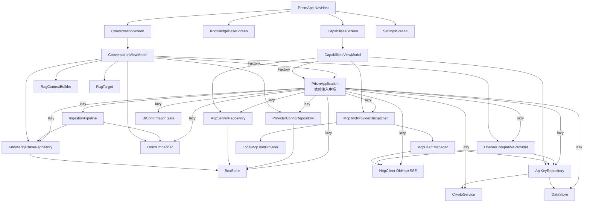

# Prism M4 Skills 系统集成点源码考古报告（简化版）

| 项目 | 内容 |
| --- | --- |
| 执行 Agent | code-archaeologist |
| 任务令牌 | TKN-M4-SKILLS-ARCH-001 |
| 考古范围 | M4 Skills 系统设计的 6 个现有集成点（简化版，CLAUDE.md 3.1 允许） |
| 考古日期 | 2026-08-09 |
| 分支 | feat/m0-scaffold |
| 证据来源 | 实际源码静态审计（60+ Kotlin 文件） |

> 主 Agent 自问（CLAUDE.md 7.3 强制）：
>
> 1. **眼下最没有把握的事情是什么？** —— Skill 执行模型（prompt 注入 vs 工具调用 vs DSL）如何与现有 `ChatStreamProvider` 接口集成，是否需要扩展接口。本次考古已确认：现有 `OpenAICompatibleProvider.buildRequestBody` **不含 `tools` 字段**，即 tool_calling 通道未打通，Skills 若走工具调用路径需扩展接口。
> 2. **最大的遗憾/盲区是什么？** —— 现有 `ConversationViewModel` 已有 RAG 注入逻辑，Skills 注入是否与之冲突或复用同一 systemPrompt 通道。本次考古已确认：RAG 注入通过 `streamChat(systemPrompt, ragContext)` 双通道完成，Skills 可复用 `systemPrompt` 通道（追加 Skill 指令）或引入第三通道，二者不必然冲突，但需设计合并策略。

---

## 1. 集成点 1：PrismApplication 依赖注入模式

### 1.1 关键代码

**文件**：`app/src/main/java/io/prism/PrismApplication.kt`

PrismApplication 是整个应用的依赖注入中枢，采用「`Application` 持有 `by lazy` 单例依赖 + ViewModel Factory 经 `initializer` 从 `PrismApplication` 取依赖」的模式。

核心 lazy 依赖声明（节选）：

```kotlin
// PrismApplication.kt:54-80
class PrismApplication : Application() {
    lateinit var boxStore: BoxStore
        private set

    val cryptoService: CryptoService by lazy { KeystoreCryptoService(this) }
    val providerConfigRepository: ProviderConfigRepository by lazy { ProviderConfigRepository(boxStore) }
    val apiKeyRepository: ApiKeyRepository by lazy { ApiKeyRepository(dataStore, cryptoService) }
    val httpClient: HttpClient by lazy {
        HttpClient(OkHttp) { expectSuccess = true; install(SSE) }
    }
    val openAICompatibleProvider: OpenAICompatibleProvider by lazy {
        OpenAICompatibleProvider(httpClient, apiKeyRepository)
    }
    val mcpServerRepository: McpServerRepository by lazy { McpServerRepository(boxStore) }
    val mcpClientManager: McpClientManager by lazy { McpClientManager(httpClient, apiKeyRepository) }
    val knowledgeBaseRepository: KnowledgeBaseRepository by lazy { KnowledgeBaseRepository(boxStore) }
    val embedder: Embedder by lazy { /* 从 assets 加载 ONNX 模型 */ }
    val ingestionPipeline: IngestionPipeline by lazy {
        IngestionPipeline(documentParserRegistry, chunker, embedder, knowledgeBaseRepository)
    }
}
```

ViewModel Factory 模式（以 ConversationViewModel 为例）：

```kotlin
// ConversationViewModel.kt:289-299
companion object {
    val Factory: ViewModelProvider.Factory = viewModelFactory {
        initializer {
            val app = this[ViewModelProvider.AndroidViewModelFactory.APPLICATION_KEY] as PrismApplication
            ConversationViewModel(
                providerRepository = app.providerConfigRepository,
                provider = app.openAICompatibleProvider,
                embedder = app.embedder,
                knowledgeBaseRepository = app.knowledgeBaseRepository
            )
        }
    }
}
```

CapabilitiesViewModel Factory（同类模式）：

```kotlin
// CapabilitiesViewModel.kt:167-172
val Factory: ViewModelProvider.Factory = viewModelFactory {
    initializer {
        val app = this[ViewModelProvider.AndroidViewModelFactory.APPLICATION_KEY] as PrismApplication
        CapabilitiesViewModel(app.mcpServerRepository, app.mcpToolProviderDispatcher, app.apiKeyRepository)
    }
}
```

### 1.2 分析结论

- **注入风格**：无 DI 框架（无 Hilt/Dagger），纯 `by lazy` 手工单例 + `viewModelFactory { initializer {} }` 工厂。优点是零反射、可追踪；缺点是依赖图扩展时需手动在 PrismApplication 增字段 + 在 Factory 增参数。
- **依赖暴露方式**：所有依赖以 `val`（只读 `by lazy`）暴露，`boxStore` 为 `lateinit var ... private set`（构造期初始化）。ViewModel 经 `viewModel(factory = XxxViewModel.Factory)` 注入。
- **M4 接入建议**：新增 `skillRepository`、`skillRegistry`/`skillExecutor` 等依赖时，直接在 PrismApplication 增 `by lazy` 字段，并在新 ViewModel 的 Factory 内取用即可，与现有模式完全一致。

---

## 2. 集成点 2：ObjectBox 实体与 Repository 模式

### 2.1 实体注解模式

**@Entity 基础模式**（`ProviderConfig.kt:32-43`、`KnowledgeBase.kt:35-39`、`McpServerConfig.kt:32-44`）：

```kotlin
@Entity
data class ProviderConfig(
    @Id var id: Long = 0,
    var name: String,
    var baseUrl: String,
    var apiKeyRef: String,
    @Convert(converter = StringListConverter::class, dbType = String::class)
    var models: List<String> = emptyList(),
    @Convert(converter = StringMapConverter::class, dbType = String::class)
    var headers: Map<String, String> = emptyMap(),
    var isActive: Boolean = false,
    var createdAt: Long = System.currentTimeMillis()
)
```

**@HnswIndex 向量索引模式**（`KnowledgeChunk.kt:28-35`）：

```kotlin
@Entity
data class KnowledgeChunk(
    @Id var id: Long = 0,
    var title: String,
    var content: String,
    @HnswIndex(dimensions = 384, distanceType = VectorDistanceType.COSINE)
    var embedding: FloatArray? = null,
    var knowledgeBaseId: Long = 0L
)
```

**@Convert 模式**：`StringListConverter`（换行分隔+转义，`StringListConverter.kt:21-30`）与 `StringMapConverter`（`key=value` 行+转义，`StringMapConverter.kt:23-38`）。两者均用单次扫描反转义规避链式 `replace` 的错误匹配（`BR-data-001`）。

### 2.2 Repository CRUD 模式

**统一架构**（以 `ProviderConfigRepository.kt:26-178` 为标杆）：

```kotlin
class ProviderConfigRepository(private val boxStore: BoxStore) {
    private val box: Box<ProviderConfig> = boxStore.boxFor(ProviderConfig::class.java)
    private val _providers = MutableStateFlow<List<ProviderConfig>>(emptyList())
    val providers: StateFlow<List<ProviderConfig>> = _providers.asStateFlow()

    init { refreshFlows() }

    fun save(config: ProviderConfig): Long {
        var resultId = 0L
        boxStore.runInTx {                          // 事务保证不变式
            if (config.isActive) {                   // 单激活兜底
                box.all.forEach { other -> /* 取消其他激活 */ }
            }
            resultId = box.put(config)
        }
        refreshFlows()
        return resultId
    }

    private fun refreshFlows() {
        _providers.value = box.all.sortedBy { it.createdAt }
    }
}
```

**关键模式提炼**：

| 模式 | 证据 | 说明 |
| --- | --- | --- |
| Box 延迟获取 | `boxStore.boxFor(...)` 构造期初始化 | 每个 Repository 持有自己的 Box |
| StateFlow 暴露 | `_xxx` Mutable + `xxx` 只读 asStateFlow | UI 经 `collectAsState` 订阅 |
| 写后刷新 | 每个写操作末尾 `refreshFlows()` | 牺牲增量更新换简单性 |
| 事务不变式 | `boxStore.runInTx { }` | 单激活（Provider）/ 级联删除（KB）原子性（`BR-concurrency-001`） |
| 默认库语义 | `KnowledgeBaseRepository.DEFAULT_KB_ID = 0L` | 虚拟库不持久化为记录（`KnowledgeBaseRepository.kt:324`） |
| HNSW 删除规避 | `findIds()` + `Box.remove(ids)` 而非 `Query.remove()` | 规避 objectbox-java#1209（`KnowledgeBaseRepository.kt:113-124`） |
| Query 资源管理 | `.build().use { it.findIds() }` | 释放 native 句柄（`BR-concurrency-003`） |

**McpServerRepository**（`McpServerRepository.kt:22-125`）与 ProviderConfigRepository 几乎同构，区别在于 MCP 允许多 Server 并存（无单激活，用 `isEnabled` 逐个开关，`:94-100`）。

### 2.3 M4 接入建议

- 新增 `SkillConfig` 实体时，照搬 `McpServerConfig` 模式（`@Entity` + `@Convert(headers)` + `isEnabled` + `createdAt`），Repository 照搬 `McpServerRepository`（多实例并存，`setEnabled` 逐个开关）。
- 若 Skill 需要存储执行历史/结果，可复用 `KnowledgeChunk` 的 `@HnswIndex` 模式做语义检索，或新建无向量的纯文本实体。

---

## 3. 集成点 3：CapabilitiesScreen / CapabilitiesViewModel（MCP UI 模式）

### 3.1 UiState 单一聚合模式

**文件**：`app/src/main/java/io/prism/ui/capabilities/CapabilitiesViewModel.kt`

CapabilitiesViewModel 采用「多个独立 StateFlow」而非单一 UiState 聚合对象：

```kotlin
// CapabilitiesViewModel.kt:51-68
val servers: StateFlow<List<McpServerConfig>> = serverRepository.servers
    .stateIn(viewModelScope, SharingStarted.WhileSubscribed(5_000), serverRepository.servers.value)

private val _selectedServer = MutableStateFlow<McpServerConfig?>(null)
val selectedServer: StateFlow<McpServerConfig?> = _selectedServer.asStateFlow()

private val _testState = MutableStateFlow<TestState>(TestState.Idle)
val testState: StateFlow<TestState> = _testState.asStateFlow()
```

**嵌套 sealed interface 模式**（状态用 sealed 表达穷尽分支）：

```kotlin
// CapabilitiesViewModel.kt:59-64
sealed interface TestState {
    data object Idle : TestState
    data object Testing : TestState
    data class Success(val toolCount: Int) : TestState
    data class Fail(val message: String) : TestState
}

// CapabilitiesViewModel.kt:207-217
sealed interface ConnectionStatus {
    data object Connecting : ConnectionStatus
    data class Connected(val toolCount: Int) : ConnectionStatus
    data class Error(val message: String) : ConnectionStatus
}
```

### 3.2 列表项 CRUD UI 模式

CapabilitiesScreen（`CapabilitiesScreen.kt:103-185`）采用 `LazyColumn` + `item {}` 分段渲染：

- 顶栏（`PrismTopBar`）含「+」新建入口（`:117-137`）
- `PrismSegmented` 三段切换 MCP/Skills/记忆（`:139-146`，`CapSegment` 枚举 `:77`）
- `AnimatedVisibility` 按段显隐面板（`:148-178`）
- 配置弹层用 `PrismSheetHost` + `PrismSheet`（`:181-183`、`:401-567`）

CRUD 操作经 ViewModel 转发到 Repository（`CapabilitiesViewModel.kt:76-128`）：

```kotlin
fun saveServer(config: McpServerConfig) { serverRepository.save(config); _selectedServer.value = null }
fun createFromPreset(preset: McpServerConfig) { serverRepository.createFromPreset(preset) }
fun newCustomServer() { _selectedServer.value = McpServerConfig(name = "", baseUrl = "", apiKeyRef = "mcp-${UUID.randomUUID()}") }
fun setEnabled(id: Long, enabled: Boolean) { serverRepository.setEnabled(id, enabled) }
fun deleteServer(config: McpServerConfig) { serverRepository.remove(config.id); /* 清理 selected */ }
```

### 3.3 连接状态可观测模式

```kotlin
// CapabilitiesViewModel.kt:190-204
fun observeConnectionStatus(config: McpServerConfig, mcpToolProvider: McpToolProvider): Flow<ConnectionStatus> =
    flow {
        emit(ConnectionStatus.Connecting)
        try {
            val tools = withTimeout(CONNECT_TIMEOUT_MS) { mcpToolProvider.listTools(config) }
            emit(if (tools.isEmpty()) ConnectionStatus.Error("连接失败") else ConnectionStatus.Connected(tools.size))
        } catch (e: TimeoutCancellationException) {
            emit(ConnectionStatus.Error("连接超时"))
        }
    }.flowOn(Dispatchers.IO)
```

UI 侧用 `remember(config.id, config.baseUrl, config.isEnabled)` 做 Flow key，编辑后 baseUrl 变化时重建 Flow 避免徽章陈旧（`CapabilitiesScreen.kt:233-239`，guardrail L-01）。

### 3.4 Skills 段现状（关键发现）

**Skills 面板当前是完全静态硬编码**（`CapabilitiesScreen.kt:89-94`、`:583-588`）：

```kotlin
private val skills = listOf(
    PrismSkill("✎", "智能翻译", "本地", "中英互译", true, PrismIndigo),
    PrismSkill("⌂", "会议纪要", "远程", "自动摘要", true, PrismCyan),
    PrismSkill("⌁", "代码审查", "本地", "AI Code Review", true, PrismMint),
    PrismSkill("▣", "知识整理", "远程", "结构化管理", false, Color(0xFFFF9A5C))
)

@Composable
private fun SkillsPanel(onSkillClick: (PrismSkill) -> Unit) {
    Column {
        SectionHeader("已安装 · 5", "+ 安装")   // 硬编码「5」，与实际 4 条不符
        skills.forEach { SkillRow(it, Modifier.padding(horizontal = 20.dp), onClick = { onSkillClick(it) }) }
    }
}
```

`SkillsPanel(onSkillClick = { })` 回调为空（`CapabilitiesScreen.kt:166`），`SkillRow` 的 `enabled` 是本地 `remember` 状态不落库（`:593`），点击无任何效果。这是 M4 的核心空白区。

### 3.5 M4 接入建议

- 新建 `SkillsViewModel`（仿 CapabilitiesViewModel），注入 `SkillRepository` + `SkillExecutor`，暴露 `skills: StateFlow<List<SkillConfig>>` + `selectedSkill` + `testState`/`executionState`。
- 复用 `PrismSheet` 配置弹层模式做 Skill 编辑/参数配置。
- 复用 `ConnectionStatus` sealed 模式表达 Skill 执行状态（`Idle/Running/Success(result)/Error(msg)`）。

---

## 4. 集成点 4：ConversationViewModel 集成点（RAG 注入模式）

### 4.1 ChatStreamProvider 注入与 RAG 双通道

**文件**：`app/src/main/java/io/prism/ui/chat/ConversationViewModel.kt`

ConversationViewModel 构造注入 4 个依赖（`:56-63`）：

```kotlin
class ConversationViewModel(
    private val providerRepository: ProviderConfigRepository,
    private val provider: ChatStreamProvider,
    private val embedder: Embedder,
    private val knowledgeBaseRepository: KnowledgeBaseRepository,
    private val ioDispatcher: CoroutineDispatcher = Dispatchers.IO
) : ViewModel()
```

**RAG 注入是 sendMessage 的核心环节**（`:126-203`）：

```kotlin
fun sendMessage(text: String) {
    // 1. 追加用户消息 + AI 占位消息
    _messages.update { it + ChatMessage(nextId++, Role.USER, trimmed, now) }
    viewModelScope.launch {
        _isTyping.value = true
        _messages.update { it + ChatMessage(aiId, Role.ASSISTANT, "", now) }

        // 2. RAG 注入（IO 协程）
        val ragResult = runCatching { buildRagPlan(trimmed) }
            .getOrElse { e -> /* 降级 NormalChat */ }

        // 3. 按三态差异化处理
        val ragPlan: RagPlan? = when (ragResult) {
            is RagBuildResult.Success -> { /* 附 citations */ ragResult.plan }
            RagBuildResult.EmbedFailed -> { appendDelta(aiId, "⚠️ ..."); null }
            RagBuildResult.NormalChat -> null
        }

        // 4. 构建历史 + 发起流式请求（注入 systemPrompt + ragContext）
        val history = _messages.value.filterNot { /* 排除占位与空 AI 消息 */ }
        val stream = provider.streamChat(
            config = active,
            messages = history,
            systemPrompt = ragPlan?.systemPrompt,
            ragContext = ragPlan?.ragContext
        )
        // 5. collect Delta → appendDelta（原子 CAS）
    }
}
```

### 4.2 RagTarget 三态模式

**文件**：`app/src/main/java/io/prism/rag/RagTarget.kt`

```kotlin
sealed interface RagTarget {
    object Off : RagTarget
    object AllLibraries : RagTarget
    data class SpecificLibrary(val kbId: Long) : RagTarget {
        init { require(kbId > 0) { "..." } }   // G-04 入参校验
    }
}
```

`_ragTarget` 默认 `AllLibraries`（`:81`），经 `setRagTarget` 切换（`:98-100`），仅内存态未持久化（ADR-012 5.2 备注）。

### 4.3 RagBuildResult sealed 降级模式

**文件**：`ConversationViewModel.kt:311-323`（private sealed interface）

```kotlin
private sealed interface RagBuildResult {
    data class Success(val plan: RagPlan) : RagBuildResult
    object EmbedFailed : RagBuildResult
    object NormalChat : RagBuildResult
}

private data class RagPlan(
    val systemPrompt: String,
    val ragContext: String,
    val citations: List<Citation>
)
```

`buildRagPlan`（`:225-269`）的降级链：

1. `RagTarget.Off` → `NormalChat`（无提示）
2. `embed` 失败 → `EmbedFailed`（提示用户）
3. `search` 失败或空 → `NormalChat`（无提示）
4. 阈值过滤后空 → `NormalChat`（无提示）
5. 成功 → `Success(RagPlan(...))`

### 4.4 RagContextBuilder 纯函数模式

**文件**：`app/src/main/java/io/prism/rag/RagContextBuilder.kt`

`object RagContextBuilder`（`:22`）是无状态单例，三件套：

- `SYSTEM_PROMPT`（常量 `:33-37`）：RAG grounding rules
- `buildContext(results)`（`:56-70`）：拼接 `[来源N] 文件=xxx 片段=N\n内容`
- `buildCitations(results)`（`:78-86`）：转 `Citation` 列表，编号与 context 严格对齐（1-based `i + 1`）

### 4.5 M4 接入建议（关键）

**主 Agent 自问 2 的回答（盲区确认）**：RAG 注入走的是 `streamChat(systemPrompt, ragContext)` 双通道。Skills 注入有两种策略：

- **策略 A（复用 systemPrompt 通道）**：Skills 产出的指令拼接到 `RagPlan.systemPrompt`，即 `systemPrompt = RagContextBuilder.SYSTEM_PROMPT + SkillInstructions`。优点是零接口改动；风险是 system prompt 过长、职责混淆。
- **策略 B（引入第三通道）**：`streamChat` 新增 `skillContext: String?` 参数，或扩展为 `injection: ContextInjection` 聚合对象。优点是职责清晰；代价是接口变更（P2 跨模块）。
- **策略 C（工具调用通道，若走 tool_calling）**：Skills 作为 OpenAI tools 暴露给模型，模型自主决定调用。但当前 `ChatStreamProvider` 不支持 tool_calling（见集成点 5），需扩展接口 + 改造 `buildRequestBody`。

**推荐**：M4 初期走策略 A（最小改动），成熟后视需要升级到策略 B/C。需新建 `SkillPlan`（仿 `RagPlan`）+ `SkillBuildResult` sealed（仿 `RagBuildResult`），在 `sendMessage` 中与 RAG 并行构建、合并 systemPrompt。

---

## 5. 集成点 5：ChatStreamProvider 接口与 OpenAICompatibleProvider

### 5.1 ChatStreamProvider 接口

**文件**：`app/src/main/java/io/prism/network/ChatStreamProvider.kt`

```kotlin
interface ChatStreamProvider {
    fun streamChat(
        config: ProviderConfig,
        messages: List<ChatMessage>,
        systemPrompt: String? = null,
        ragContext: String? = null
    ): Flow<StreamEvent>
}
```

US-019 扩展了 `systemPrompt` + `ragContext` 两可选参数（ADR-012 5.4 方案 C），默认 null 向后兼容。

### 5.2 StreamEvent sealed 模式

**文件**：`app/src/main/java/io/prism/network/StreamEvent.kt`

```kotlin
sealed class StreamEvent {
    data class Delta(val content: String) : StreamEvent()
    data object Done : StreamEvent()
    data class Error(val message: String) : StreamEvent()
}
```

调用方用 `when` 穷尽分支（`ConversationViewModel.kt:192-200`）。

### 5.3 OpenAICompatibleProvider 实现关键点

**文件**：`app/src/main/java/io/prism/network/OpenAICompatibleProvider.kt`

- **流式请求**：`httpClient.sse(endpoint, { ... }) { incoming.collect { ... } }`（`:87-104`），`flowOn(Dispatchers.IO)`（`:124`）
- **systemPrompt 注入点**（`:155-159`）：`buildRequestBody` 内 `if (!systemPrompt.isNullOrBlank()) add(MessageBody("system", systemPrompt))` 前置
- **ragContext 注入点**（`:163-172`）：插在最后一条 user 消息之前
- **错误处理**：`CancellationException` 重抛（`:105-107`），`SSEClientException`/`ClientRequestException` 按状态码映射（`:108-116`），其余通用文案不泄露内部细节（`:117-120`，CWE-209）
- **兜底 Done**：SSE 流正常结束但未收到 `[DONE]` 时补发（`:123`）

### 5.4 tool_calling 支持现状（关键发现）

**当前不支持 tool_calling**。证据：

`buildRequestBody`（`:149-180`）的 `ChatCompletionRequest` 只有三个字段：

```kotlin
@Serializable
private data class ChatCompletionRequest(
    val model: String,
    val messages: List<MessageBody>,
    val stream: Boolean
)   // 无 tools / tool_choice / functions 字段
```

`StreamEvent` 只有 `Delta(content)`/`Done`/`Error(message)`，**无 `ToolCall` 事件**。`parseChunkData`（`:222-235`）只解析 `choices[0].delta.content`，忽略 `tool_calls` 字段。

### 5.5 MCP 工具调用基础设施（已存在但未接入对话流）

MCP 工具调用能力已完整实现，但仅在 CapabilitiesViewModel 的「测试连接」路径使用，**未接入 ConversationViewModel 对话流**：

- `McpToolProvider` 接口（`McpToolProvider.kt:11-30`）：`listTools(config)` + `callTool(config, name, arguments)`
- `McpToolProviderDispatcher`（`McpToolProviderDispatcher.kt:15-31`）：按 `serverType` 分发 LOCAL/REMOTE
- `LocalMcpToolProvider`（`LocalMcpToolProvider.kt`）：进程内桥接 FilesystemMcpServer
- `McpClientManager`（`McpClientManager.kt`）：Streamable HTTP 远程 MCP

### 5.6 M4 接入建议

- **若 Skills 走 prompt 注入**：无需改 ChatStreamProvider，在 ConversationViewModel 层合并 systemPrompt 即可。
- **若 Skills 走 tool_calling**：需 P2/P3 级接口扩展：
  1. `ChatStreamProvider.streamChat` 新增 `tools: List<ToolDefinition>?` 参数
  2. `ChatCompletionRequest` 增 `tools`/`tool_choice` 字段
  3. `StreamEvent` 增 `ToolCall(name, arguments)` 子类
  4. `parseChunkData` 解析 `delta.tool_calls`
  5. `ConversationViewModel` 增 tool_call 循环（模型返回 tool_call → 执行 → 回填 tool result → 再请求）
  6. 复用现有 `McpToolProvider.callTool` 作为执行后端，`UiConfirmationGate` 做确认门禁

---

## 6. 集成点 6：NavHost 路由与 Tab 结构

### 6.1 路由定义

**文件**：`app/src/main/java/io/prism/ui/PrismApp.kt`

```kotlin
// PrismApp.kt:49-54
object PrismDestinations {
    const val CHAT = "chat"
    const val KNOWLEDGE = "knowledge"
    const val CAPABILITIES = "capabilities"
    const val SETTINGS = "settings"
}

// PrismApp.kt:57-62
private val bottomNavItems = listOf(
    PrismNavItem(PrismDestinations.CHAT, "聊天", Icons.AutoMirrored.Filled.Chat),
    PrismNavItem(PrismDestinations.KNOWLEDGE, "知识库", Icons.Filled.MenuBook),
    PrismNavItem(PrismDestinations.CAPABILITIES, "能力", Icons.Filled.Bolt),
    PrismNavItem(PrismDestinations.SETTINGS, "设置", Icons.Filled.Settings)
)
```

### 6.2 NavHost 配置

```kotlin
// PrismApp.kt:99-108
NavHost(
    navController = navController,
    startDestination = PrismDestinations.CHAT,
    modifier = Modifier.fillMaxSize()
) {
    composable(PrismDestinations.CHAT) { ConversationScreen() }
    composable(PrismDestinations.KNOWLEDGE) { KnowledgeBaseScreen() }
    composable(PrismDestinations.CAPABILITIES) { CapabilitiesScreen() }
    composable(PrismDestinations.SETTINGS) { SettingsScreen() }
}
```

**扁平 4 Tab 路由，无二级嵌套路由**。Skills 入口已在 `CAPABILITIES` Tab 内（`CapabilitiesScreen` 的 `CapSegment.SKILLS` 段），无需新增 Tab。

### 6.3 全局 ToolConfirmationHost

`PrismApp.kt:113` 在 NavHost 外层挂载 `ToolConfirmationHost()`（`:124-165`），收集 `UiConfirmationGate.requests` 流到 FIFO 队列逐条确认。这是工具调用确认的全局宿主，M4 若引入 tool_calling 可直接复用。

### 6.4 M4 接入建议

- Skills 管理 UI 复用 `CAPABILITIES` Tab 的 `CapSegment.SKILLS` 段，无需新增路由。
- 若需 Skill 详情页/执行详情页，可新增二级路由 `composable("skills/{id}")`，但当前模式无二级路由先例，需评估是否引入 `NavHost` 嵌套。

---

## 7. 模块职责与依赖图

### 7.1 依赖关系（Mermaid）



### 7.2 分层架构判定

- **架构风格**：MVVM + Repository，无 Domain/UseCase 层（ViewModel 直接调 Repository/Provider）。
- **依赖倒置**：`ChatStreamProvider`、`McpToolProvider` 是接口，ViewModel 依赖抽象而非实现，符合 DIP。
- **分层质量**：UI（`ui.*`）→ 网络/数据（`network.*`/`data.*`）单向依赖，无循环。RAG 逻辑（`rag.*`）是纯函数工具层，被 ViewModel 组合。

---

## 8. 潜在风险清单

| ID | 风险 | 证据 | 影响 | 级别 |
| --- | --- | --- | --- | --- |
| R-1 | Skills 面板完全静态硬编码，`SectionHeader("已安装 · 5")` 与实际 4 条 `skills` 不符，`onSkillClick` 为空，`enabled` 不落库 | `CapabilitiesScreen.kt:89-94, 166, 585, 593` | M4 必须从零重建 Skills UI 数据流，现有代码仅作视觉占位 | 中 |
| R-2 | `ChatStreamProvider` 不支持 tool_calling，`ChatCompletionRequest` 无 `tools` 字段，`StreamEvent` 无 `ToolCall` 事件 | `ChatStreamProvider.kt:30-35`, `OpenAICompatibleProvider.kt:250-254`, `StreamEvent.kt:13-21` | 若 Skills 走 tool_calling 路径，需 P2 级接口扩展 + 对话循环改造 | 高 |
| R-3 | MCP 工具调用基础设施已完整（`McpToolProvider.callTool`），但未接入 ConversationViewModel 对话流，仅在「测试连接」使用 | `CapabilitiesViewModel.kt:139`, `ConversationViewModel.kt` 全文无 McpToolProvider 依赖 | tool_calling 闭环需新建「对话内工具调度器」，M4 可复用 McpToolProvider 作为执行后端 | 中 |
| R-4 | RAG 的 `systemPrompt` 与 Skills 指令若共用同一 system 通道，存在 prompt 膨胀/职责混淆风险 | `ConversationViewModel.kt:188-189`, `OpenAICompatibleProvider.kt:155-159` | 需设计合并策略（拼接 vs 分段 vs 优先级），避免 system prompt 超模型上下文窗口 | 中 |
| R-5 | `_messages` 写入已用 `update` 原子 CAS（`BR-concurrency-004` 修复），但 Skill 执行若引入异步工具结果回填，需同样遵循 CAS 模式 | `ConversationViewModel.kt:131, 136, 161, 272-276` | M4 tool_calling 回填 tool result 时必须用 `_messages.update {}`，禁止直接 `value =` | 中 |
| R-6 | `RagTarget` 仅内存 StateFlow 未持久化（ADR-012 5.2 备注），若 Skill 启用状态需跨会话保留，不能照搬此模式 | `RagTarget.kt:17` 注释, `ConversationViewModel.kt:81` | M4 SkillConfig 的 `isEnabled` 应落库（仿 McpServerConfig），而非仅内存态 | 低 |
| R-7 | `Embedder` 全程持锁串行（`BR-concurrency-002`），单次 embed ~100ms 不可中断。若 Skills 执行需嵌入（如语义路由），会与 RAG 检索争锁 | `PrismApplication.kt:199-201` 注释 | Skill 语义路由若高频调用 embed，可能阻塞 RAG 检索；需评估是否引入 embed 队列或缓存 | 低 |
| R-8 | `KnowledgeChunk` 含 `FloatArray` 字段，`data class` 自动 equals/hashCode 用引用比较（`BR-security-001`） | `KnowledgeChunk.kt:22-24` 注释 | 若 SkillConfig 实体含 `FloatArray`/`List` 等引用类型字段，需注意 equals 语义 | 低 |
| R-9 | ObjectBox `@Relation` 被刻意规避（用扁平 Long 外键，ADR-008 5.2），因 ToMany 已知副作用 | `KnowledgeBase.kt:28-33`, `KnowledgeChunk.kt:14-18` | M4 实体关联必须沿用扁平 Long 外键模式，禁止引入 `@Relation` | 低 |
| R-10 | HNSW 索引删除有已知 bug（objectbox-java#1209），需用 `findIds()` + `Box.remove(ids)` 规避 | `KnowledgeBaseRepository.kt:98-124` | 若 Skill 历史实体用 HNSW 索引，删除时必须沿用规避模式 | 低 |

---

## 9. M4 Skills 系统接入建议总表

| 组件 | 复用 / 新增 / 重构 | 证据与说明 |
| --- | --- | --- |
| **依赖注入** | 复用 | PrismApplication `by lazy` + ViewModel Factory `initializer` 模式，新增 `skillRepository`/`skillExecutor` 字段即可（`PrismApplication.kt:52-218`） |
| **SkillConfig 实体** | 新增（仿 McpServerConfig） | `@Entity` + `@Convert(headers)` + `isEnabled` + `createdAt`，照搬 `McpServerConfig.kt:32-44` |
| **SkillRepository** | 新增（仿 McpServerRepository） | `Box` + `MutableStateFlow` + `refreshFlows()` + `setEnabled`，照搬 `McpServerRepository.kt:22-125` |
| **SkillsViewModel** | 新增（仿 CapabilitiesViewModel） | 多 StateFlow + sealed `ExecutionState`（仿 `TestState`）+ sealed `SkillConnectionStatus`（仿 `ConnectionStatus`），照搬 `CapabilitiesViewModel.kt:44-218` |
| **Skills UI 面板** | 重构（替换静态硬编码） | 当前 `skills` 列表硬编码（`CapabilitiesScreen.kt:89-94`），需改为 `viewModel.skills.collectAsState()`，复用 `SkillRow` + `PrismSheet` 配置弹层 |
| **Skill 指令注入** | 复用 systemPrompt 通道（策略 A） | `ConversationViewModel.kt:188-189` 的 `ragPlan?.systemPrompt` 可拼接 Skill 指令；新增 `SkillPlan`（仿 `RagPlan`）+ `SkillBuildResult` sealed（仿 `RagBuildResult`） |
| **Skill 执行（若 tool_calling）** | 重构 ChatStreamProvider（策略 C） | 需 P2 级扩展：`streamChat` 增 `tools` 参数、`StreamEvent` 增 `ToolCall`、`ChatCompletionRequest` 增 `tools` 字段、`parseChunkData` 解析 `tool_calls`、ConversationViewModel 增工具调用循环 |
| **工具执行后端** | 复用 McpToolProvider | `McpToolProvider.callTool`（`McpToolProvider.kt:29`）+ `McpToolProviderDispatcher` 路由，Skill 可包装为 McpToolProvider 实现或新建独立执行器 |
| **工具确认门禁** | 复用 UiConfirmationGate | `PrismApp.kt:124-165` 的 `ToolConfirmationHost` 已全局挂载，Skill 工具调用可直接经 `confirmationGate` 请求确认 |
| **路由** | 无需改动 | Skills 在 `CAPABILITIES` Tab 内 `CapSegment.SKILLS` 段，无需新增路由（`PrismApp.kt:99-108`） |
| **错误降级模式** | 复用 RagBuildResult sealed 模式 | 三态降级（Success/EmbedFailed→SkillFailed/NormalChat→NormalChat）照搬 `ConversationViewModel.kt:311-323` |
| **RagContextBuilder 纯函数** | 新增对应 SkillContextBuilder | 仿 `RagContextBuilder.kt:22` 的 `object` + 纯函数模式构建 Skill 指令文本 |

### 9.1 推荐实施路径（按风险递增）

1. **M4-1（P1 常规）**：SkillConfig 实体 + SkillRepository + SkillsViewModel + 重构 Skills 面板为动态数据。纯 UI/数据层，不改 ChatStreamProvider。
2. **M4-2（P1 常规）**：SkillContextBuilder + ConversationViewModel 注入 Skill 指令（策略 A，拼接到 systemPrompt）。复用 RAG 降级模式。
3. **M4-3（P2 跨模块，可选）**：若需 tool_calling，扩展 ChatStreamProvider + StreamEvent + OpenAICompatibleProvider + ConversationViewModel 工具调用循环。复用 McpToolProvider + UiConfirmationGate。

---

## 10. 验证可复现性

本报告所有结论可通过以下步骤复现：

1. `git checkout feat/m0-scaffold`
2. 按本报告「证据来源」列的 file:line 定位代码
3. 核对 Mermaid 依赖图与实际 `import` 语句

关键文件清单（按集成点）：

- 集成点 1：`app/src/main/java/io/prism/PrismApplication.kt`
- 集成点 2：`app/src/main/java/io/prism/data/{ProviderConfig,KnowledgeBase,KnowledgeChunk,McpServerConfig}*.kt` + `*Repository.kt` + `String*Converter.kt`
- 集成点 3：`app/src/main/java/io/prism/ui/capabilities/{CapabilitiesScreen,CapabilitiesViewModel}.kt`
- 集成点 4：`app/src/main/java/io/prism/ui/chat/ConversationViewModel.kt` + `app/src/main/java/io/prism/rag/{RagContextBuilder,RagTarget}.kt`
- 集成点 5：`app/src/main/java/io/prism/network/{ChatStreamProvider,OpenAICompatibleProvider,StreamEvent,McpToolProvider,McpToolProviderDispatcher,LocalMcpToolProvider,McpClientManager}.kt`
- 集成点 6：`app/src/main/java/io/prism/ui/PrismApp.kt`

---

**报告结束**
